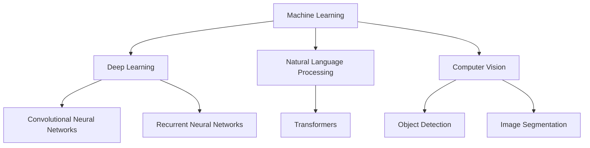

                 

**人工智能的未来发展机遇**

**作者：禅与计算机程序设计艺术 / Zen and the Art of Computer Programming**

## 1. 背景介绍

人工智能（AI）自诞生以来，已从一项学术实验发展为商业和技术的关键驱动因素。随着计算能力的提高和数据的丰富，AI正在各行各业产生重大影响。本文将探讨人工智能的未来发展机遇，关注其核心概念、算法、数学模型，并提供实践项目和工具资源。

## 2. 核心概念与联系

人工智能的核心概念包括机器学习（ML）、深度学习（DL）、自然语言处理（NLP）、计算机视觉（CV）等。这些概念密切相关，共同构成了AI的基础。



## 3. 核心算法原理 & 具体操作步骤

### 3.1 算法原理概述

人工智能的核心是机器学习算法，其目标是从数据中学习模式，并利用这些模式对新数据进行预测。常用的ML算法包括线性回归、逻辑回归、决策树、随机森林和支持向量机（SVM）。

### 3.2 算法步骤详解

1. 数据收集：收集与问题相关的数据。
2. 数据预处理：清洗、标准化和转换数据。
3. 特征工程：选择或创建有助于模型学习的特征。
4. 模型选择：选择适合问题的ML算法。
5. 模型训练：使用训练数据调整模型参数。
6. 模型评估：使用验证数据评估模型性能。
7. 模型部署：将模型集成到生产环境中。

### 3.3 算法优缺点

优点：自动化决策、发现复杂模式、处理大数据。缺点：解释性差、需要大量数据、易受过拟合影响。

### 3.4 算法应用领域

ML算法广泛应用于预测分析、推荐系统、图像和语音识别、自动驾驶等领域。

## 4. 数学模型和公式 & 详细讲解 & 举例说明

### 4.1 数学模型构建

线性回归模型的数学表达式为：$y = wx + b$, 其中$w$和$b$是模型参数，需要通过最小化误差平方和来学习。

### 4.2 公式推导过程

误差平方和（MSE）公式为：$MSE = \frac{1}{n} \sum_{i=1}^{n} (y_i - \hat{y}_i)^2$, 其中$y_i$是实际值，$ \hat{y}_i$是预测值。通过最小化MSE，我们可以使用梯度下降算法更新参数$w$和$b$.

### 4.3 案例分析与讲解

例如，使用线性回归预测房价。特征$x$是房屋的面积，目标$y$是房屋的价格。通过训练数据，模型学习到$w = 100$和$b = 10000$, 因此预测公式为：$y = 100x + 10000$.

## 5. 项目实践：代码实例和详细解释说明

### 5.1 开发环境搭建

使用Python、TensorFlow和Jupyter Notebook搭建开发环境。

### 5.2 源代码详细实现

```python
import tensorflow as tf
from tensorflow.keras import layers

# Define the model
model = tf.keras.Sequential([
    layers.Dense(64, activation='relu', input_shape=(32,)),
    layers.Dense(64, activation='relu'),
    layers.Dense(1)
])

# Compile the model
model.compile(optimizer='adam', loss='mse')

# Train the model
model.fit(x_train, y_train, epochs=10, validation_data=(x_val, y_val))
```

### 5.3 代码解读与分析

该代码定义了一个具有两个隐藏层的简单神经网络，并使用Adam优化器和均方误差（MSE）作为损失函数来编译模型。然后，它使用训练数据训练模型。

### 5.4 运行结果展示

模型的训练损失和验证损失随时间变化的图表。

## 6. 实际应用场景

### 6.1 当前应用

AI已广泛应用于搜索引擎、推荐系统、自动驾驶、医疗诊断等领域。

### 6.2 未来应用展望

未来，AI将在物联网、数字孪生、智能城市等领域发挥关键作用。

## 7. 工具和资源推荐

### 7.1 学习资源推荐

- Andrew Ng的机器学习课程（Coursera）
- "Python机器学习"（Adrian Kaehler、Gordon Guthrie著）
- "深度学习"（Ian Goodfellow、Yoshua Bengio、Aaron Courville著）

### 7.2 开发工具推荐

- TensorFlow
- PyTorch
- Keras
- Scikit-learn

### 7.3 相关论文推荐

- "Attention is All You Need"（Vaswani et al., 2017）
- "ImageNet Classification with Deep Convolutional Neural Networks"（Krizhevsky et al., 2012）
- "Gradient Boosting Machines"（Friedman, 2001）

## 8. 总结：未来发展趋势与挑战

### 8.1 研究成果总结

AI取得了显著进展，但仍面临挑战。

### 8.2 未来发展趋势

AI将朝着自监督学习、多模式学习、可解释AI和联邦学习等方向发展。

### 8.3 面临的挑战

挑战包括数据隐私、算法偏见、计算能力和能源消耗等。

### 8.4 研究展望

未来的研究将关注AI的解释性、可靠性和安全性。

## 9. 附录：常见问题与解答

**Q：什么是过拟合？**

**A：**过拟合是指模型学习了训练数据的噪声和细节，而不是其基本模式，从而导致泛化性能下降。

**Q：什么是正则化？**

**A：**正则化是指通过添加约束条件来防止模型过拟合的技术，常用的正则化方法包括L1正则化（Lasso）和L2正则化（Ridge）。

## 结束语

人工智能的未来充满机遇和挑战。通过理解其核心概念、算法和数学模型，并进行实践项目，我们可以推动AI的发展，并帮助其在各行各业发挥作用。

**作者署名：作者：禅与计算机程序设计艺术 / Zen and the Art of Computer Programming**

