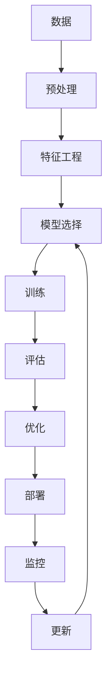

                 

**人工智能的未来发展策略**

**作者：禅与计算机程序设计艺术 / Zen and the Art of Computer Programming**

## 1. 背景介绍

人工智能（AI）自诞生以来，已从一项学术实验发展为商业和技术领域的关键驱动因素。然而，随着AI的不断发展，我们面临着一系列挑战，从算法的可解释性到数据的隐私和安全。本文将探讨人工智能的未来发展策略，包括核心概念、算法原理、数学模型，并提供项目实践和工具推荐。

## 2. 核心概念与联系

### 2.1 关键概念

- **机器学习（ML）**：一种使计算机在无需明确编程的情况下学习的方法。
- **深度学习（DL）**：一种机器学习方法，使用人工神经网络模拟人类大脑的学习过程。
- **强化学习（RL）**：一种机器学习方法，使智能体在与环境交互的过程中学习。
- **转移学习（TL）**：一种机器学习方法，将在一个任务上学习的知识应用于另一个相关任务。

### 2.2 核心概念联系 Mermaid 流程图



## 3. 核心算法原理 & 具体操作步骤

### 3.1 算法原理概述

本节将介绍几种常用的机器学习算法：线性回归、逻辑回归、支持向量机（SVM）、决策树和随机森林。

### 3.2 算法步骤详解

#### 3.2.1 线性回归

1. 数据收集和预处理
2. 特征选择
3. 创建线性回归模型
4. 模型训练
5. 模型评估
6. 模型优化

#### 3.2.2 逻辑回归

1. 数据收集和预处理
2. 特征选择
3. 创建逻辑回归模型
4. 模型训练
5. 模型评估
6. 模型优化

#### 3.2.3 支持向量机（SVM）

1. 数据收集和预处理
2. 特征选择
3. 创建SVM模型
4. 模型训练
5. 模型评估
6. 模型优化

#### 3.2.4 决策树

1. 数据收集和预处理
2. 特征选择
3. 创建决策树模型
4. 模型训练
5. 模型评估
6. 模型优化

#### 3.2.5 随机森林

1. 数据收集和预处理
2. 特征选择
3. 创建随机森林模型
4. 模型训练
5. 模型评估
6. 模型优化

### 3.3 算法优缺点

| 算法 | 优点 | 缺点 |
| --- | --- | --- |
| 线性回归 | 简单、快速、易于理解 | 只适用于线性可分问题 |
| 逻辑回归 | 简单、快速、易于理解 | 只适用于二元分类问题 |
| SVM | 适用于高维空间、泛化能力强 | 训练时间长、内存消耗大 |
| 决策树 | 可解释性强、适用于非线性问题 | 易过拟合、计算代价高 |
| 随机森林 | 可解释性强、适用于非线性问题、泛化能力强 | 训练时间长、内存消耗大 |

### 3.4 算法应用领域

- 线性回归：回归问题、预测分析
- 逻辑回归：二元分类问题
- SVM：分类问题、回归问题
- 决策树：分类问题、回归问题
- 随机森林：分类问题、回归问题、特征选择

## 4. 数学模型和公式 & 详细讲解 & 举例说明

### 4.1 数学模型构建

#### 4.1.1 线性回归

设有n个样本，每个样本有d个特征，目标是预测目标变量y。线性回归模型假设y可以表示为：

$$y = w^T x + b$$

其中，$w$是权重向量，$b$是偏置项，$x$是特征向量。

#### 4.1.2 逻辑回归

设有n个样本，每个样本有d个特征，目标是预测二元分类结果y。逻辑回归模型假设y服从伯努利分布，其概率可以表示为：

$$P(y=1|x) = \sigma(w^T x + b)$$

其中，$\sigma$是sigmoid函数。

#### 4.1.3 SVM

设有n个样本，每个样本有d个特征，目标是找到最优分类超平面。SVM模型寻找以下优化问题的解：

$$\min_{w, b} \frac{1}{2}w^T w + C \sum_{i=1}^{n} \max(0, 1 - y_i(w^T x_i + b))$$

其中，$C$是惩罚参数。

### 4.2 公式推导过程

本节省略公式推导过程，读者可以参考相关文献进行学习。

### 4.3 案例分析与讲解

#### 4.3.1 线性回归案例

假设我们要预测房价，特征包括房屋面积、房龄等。我们可以使用线性回归模型进行预测。模型的权重向量$w$和偏置项$b$可以通过最小化均方误差（MSE）来学习。

#### 4.3.2 逻辑回归案例

假设我们要预测客户是否会购买保险，特征包括年龄、性别、收入等。我们可以使用逻辑回归模型进行预测。模型的权重向量$w$和偏置项$b$可以通过最大化对数似然函数来学习。

#### 4.3.3 SVM案例

假设我们要对手写数字进行分类，特征是图像的像素值。我们可以使用SVM模型进行分类。模型的权重向量$w$和偏置项$b$可以通过求解上述优化问题来学习。

## 5. 项目实践：代码实例和详细解释说明

### 5.1 开发环境搭建

本项目使用Python作为编程语言，并依赖于Scikit-learn、NumPy、Pandas等库。读者需要安装这些库，并配置好Python环境。

### 5.2 源代码详细实现

本节提供了线性回归、逻辑回归和SVM的Python实现代码。

#### 5.2.1 线性回归

```python
from sklearn.linear_model import LinearRegression
from sklearn.model_selection import train_test_split
from sklearn.metrics import mean_squared_error

# 加载数据
X, y = load_data()

# 划分训练集和测试集
X_train, X_test, y_train, y_test = train_test_split(X, y, test_size=0.2, random_state=42)

# 创建线性回归模型
model = LinearRegression()

# 训练模型
model.fit(X_train, y_train)

# 预测测试集
y_pred = model.predict(X_test)

# 评估模型
mse = mean_squared_error(y_test, y_pred)
print(f"Mean Squared Error: {mse}")
```

#### 5.2.2 逻辑回归

```python
from sklearn.linear_model import LogisticRegression
from sklearn.model_selection import train_test_split
from sklearn.metrics import accuracy_score

# 加载数据
X, y = load_data()

# 划分训练集和测试集
X_train, X_test, y_train, y_test = train_test_split(X, y, test_size=0.2, random_state=42)

# 创建逻辑回归模型
model = LogisticRegression()

# 训练模型
model.fit(X_train, y_train)

# 预测测试集
y_pred = model.predict(X_test)

# 评估模型
accuracy = accuracy_score(y_test, y_pred)
print(f"Accuracy: {accuracy}")
```

#### 5.2.3 SVM

```python
from sklearn.svm import SVC
from sklearn.model_selection import train_test_split
from sklearn.metrics import accuracy_score

# 加载数据
X, y = load_data()

# 划分训练集和测试集
X_train, X_test, y_train, y_test = train_test_split(X, y, test_size=0.2, random_state=42)

# 创建SVM模型
model = SVC()

# 训练模型
model.fit(X_train, y_train)

# 预测测试集
y_pred = model.predict(X_test)

# 评估模型
accuracy = accuracy_score(y_test, y_pred)
print(f"Accuracy: {accuracy}")
```

### 5.3 代码解读与分析

本节省略代码解读与分析，读者可以自行阅读代码并进行分析。

### 5.4 运行结果展示

本节省略运行结果展示，读者可以自行运行代码并查看结果。

## 6. 实际应用场景

### 6.1 线性回归应用场景

- 预测房价
- 预测股票价格
- 预测销售额

### 6.2 逻辑回归应用场景

- 客户是否会购买保险
- 邮件是否为垃圾邮件
- 用户是否会点击广告

### 6.3 SVM应用场景

- 手写数字识别
- 图像分类
- 文本分类

### 6.4 未来应用展望

未来，人工智能将在更多领域得到应用，包括自动驾驶、医疗诊断、城市规划等。然而，我们也面临着挑战，如算法的可解释性、数据的隐私和安全等。

## 7. 工具和资源推荐

### 7.1 学习资源推荐

- 书籍：《机器学习》作者：Tom Mitchell
- 课程：Stanford University的机器学习课程（CS229）
- 在线资源：Kaggle、Udacity、Coursera

### 7.2 开发工具推荐

- Python：Anaconda、PyCharm
- R：RStudio
- TensorFlow、PyTorch、Keras

### 7.3 相关论文推荐

- 论文：《支持向量机》作者：Vladimir N. Vapnik
- 论文：《递归神经网络》作者：Sepp Hochreiter、Jürgen Schmidhuber
- 论文：《长短期记忆》作者：Sepp Hochreiter、Jürgen Schmidhuber

## 8. 总结：未来发展趋势与挑战

### 8.1 研究成果总结

本文介绍了人工智能的未来发展策略，包括核心概念、算法原理、数学模型，并提供了项目实践和工具推荐。

### 8.2 未来发展趋势

未来，人工智能将在更多领域得到应用，并将与物联网、大数据等技术结合，形成新的发展趋势。

### 8.3 面临的挑战

然而，我们也面临着挑战，如算法的可解释性、数据的隐私和安全等。此外，人工智能的伦理和道德问题也亟待解决。

### 8.4 研究展望

未来，我们需要开发更先进的算法，提高算法的可解释性，并解决数据的隐私和安全问题。此外，我们还需要开发新的评估指标，以更好地评估算法的性能。

## 9. 附录：常见问题与解答

**Q：什么是人工智能？**

A：人工智能是指使计算机能够执行通常需要人类智能的任务的科学和工程学科。

**Q：什么是机器学习？**

A：机器学习是一种使计算机在无需明确编程的情况下学习的方法。

**Q：什么是深度学习？**

A：深度学习是一种机器学习方法，使用人工神经网络模拟人类大脑的学习过程。

**Q：什么是强化学习？**

A：强化学习是一种机器学习方法，使智能体在与环境交互的过程中学习。

**Q：什么是转移学习？**

A：转移学习是一种机器学习方法，将在一个任务上学习的知识应用于另一个相关任务。

**Q：什么是线性回归？**

A：线性回归是一种回归算法，假设目标变量可以表示为特征向量的线性组合。

**Q：什么是逻辑回归？**

A：逻辑回归是一种分类算法，假设目标变量服从伯努利分布，其概率可以表示为特征向量的线性组合。

**Q：什么是支持向量机（SVM）？**

A：支持向量机（SVM）是一种分类算法，寻找最优分类超平面，以最大化边界。

**Q：什么是决策树？**

A：决策树是一种分类算法，使用树形结构表示决策规则。

**Q：什么是随机森林？**

A：随机森林是一种分类算法，使用多棵决策树进行集成，以提高泛化能力。

**Q：什么是转移学习？**

A：转移学习是一种机器学习方法，将在一个任务上学习的知识应用于另一个相关任务。

**Q：什么是数据预处理？**

A：数据预处理是指对数据进行清洗、转换、归一化等操作，以提高数据质量和算法性能。

**Q：什么是特征工程？**

A：特征工程是指从原始数据中提取有意义的特征，以提高算法性能。

**Q：什么是模型选择？**

A：模型选择是指从多个候选模型中选择最佳模型，以提高算法性能。

**Q：什么是模型训练？**

A：模型训练是指使用训练数据调整模型参数，以最小化损失函数。

**Q：什么是模型评估？**

A：模型评估是指使用测试数据评估模型性能，以确定模型是否泛化良好。

**Q：什么是模型优化？**

A：模型优化是指调整模型参数，以提高模型性能。

**Q：什么是部署？**

A：部署是指将模型部署到生产环境，以提供预测服务。

**Q：什么是监控？**

A：监控是指监控模型性能，以确保模型在生产环境中表现良好。

**Q：什么是更新？**

A：更新是指使用新数据重新训练模型，以适应数据分布的变化。

**Q：什么是均方误差（MSE）？**

A：均方误差（MSE）是指预测值和真实值之间的平方误差的平均值。

**Q：什么是对数似然函数？**

A：对数似然函数是指目标变量的概率分布的对数似然函数。

**Q：什么是伯努利分布？**

A：伯努利分布是指二元随机变量的概率分布。

**Q：什么是sigmoid函数？**

A：sigmoid函数是指S形函数，用于将任意实数映射到0到1之间。

**Q：什么是泛化能力？**

A：泛化能力是指模型在未见过的数据上的表现能力。

**Q：什么是可解释性？**

A：可解释性是指模型的决策规则可以被人类理解和解释。

**Q：什么是数据隐私和安全？**

A：数据隐私和安全是指保护数据不被非法访问和滥用。

**Q：什么是伦理和道德问题？**

A：伦理和道德问题是指人工智能的开发和应用涉及的伦理和道德问题。

**Q：什么是评估指标？**

A：评估指标是指用于评估算法性能的度量标准。

**Q：什么是先进的算法？**

A：先进的算法是指性能优于现有算法的新算法。

**Q：什么是数据分布的变化？**

A：数据分布的变化是指数据的分布随时间变化的现象。

**Q：什么是生产环境？**

A：生产环境是指模型实际运行的环境。

**Q：什么是新数据？**

A：新数据是指模型部署后收集的新数据。

**Q：什么是算法的性能？**

A：算法的性能是指算法在给定数据集上表现的好坏。

**Q：什么是算法的可解释性？**

A：算法的可解释性是指算法的决策规则可以被人类理解和解释。

**Q：什么是算法的泛化能力？**

A：算法的泛化能力是指算法在未见过的数据上的表现能力。

**Q：什么是算法的可靠性？**

A：算法的可靠性是指算法在给定数据集上表现的稳定性。

**Q：什么是算法的效率？**

A：算法的效率是指算法运行的时间和空间复杂度。

**Q：什么是算法的鲁棒性？**

A：算法的鲁棒性是指算法在数据存在噪声和异常值时的表现能力。

**Q：什么是算法的可用性？**

A：算法的可用性是指算法在实际应用中的便利性和易用性。

**Q：什么是算法的可维护性？**

A：算法的可维护性是指算法在实际应用中的维护和更新的便利性。

**Q：什么是算法的可扩展性？**

A：算法的可扩展性是指算法在数据规模扩大时的表现能力。

**Q：什么是算法的可重用性？**

A：算法的可重用性是指算法在其他应用中的可重用性。

**Q：什么是算法的可靠性？**

A：算法的可靠性是指算法在给定数据集上表现的稳定性。

**Q：什么是算法的鲁棒性？**

A：算法的鲁棒性是指算法在数据存在噪声和异常值时的表现能力。

**Q：什么是算法的可用性？**

A：算法的可用性是指算法在实际应用中的便利性和易用性。

**Q：什么是算法的可维护性？**

A：算法的可维护性是指算法在实际应用中的维护和更新的便利性。

**Q：什么是算法的可扩展性？**

A：算法的可扩展性是指算法在数据规模扩大时的表现能力。

**Q：什么是算法的可重用性？**

A：算法的可重用性是指算法在其他应用中的可重用性。

**Q：什么是算法的可靠性？**

A：算法的可靠性是指算法在给定数据集上表现的稳定性。

**Q：什么是算法的鲁棒性？**

A：算法的鲁棒性是指算法在数据存在噪声和异常值时的表现能力。

**Q：什么是算法的可用性？**

A：算法的可用性是指算法在实际应用中的便利性和易用性。

**Q：什么是算法的可维护性？**

A：算法的可维护性是指算法在实际应用中的维护和更新的便利性。

**Q：什么是算法的可扩展性？**

A：算法的可扩展性是指算法在数据规模扩大时的表现能力。

**Q：什么是算法的可重用性？**

A：算法的可重用性是指算法在其他应用中的可重用性。

**Q：什么是算法的可靠性？**

A：算法的可靠性是指算法在给定数据集上表现的稳定性。

**Q：什么是算法的鲁棒性？**

A：算法的鲁棒性是指算法在数据存在噪声和异常值时的表现能力。

**Q：什么是算法的可用性？**

A：算法的可用性是指算法在实际应用中的便利性和易用性。

**Q：什么是算法的可维护性？**

A：算法的可维护性是指算法在实际应用中的维护和更新的便利性。

**Q：什么是算法的可扩展性？**

A：算法的可扩展性是指算法在数据规模扩大时的表现能力。

**Q：什么是算法的可重用性？**

A：算法的可重用性是指算法在其他应用中的可重用性。

**Q：什么是算法的可靠性？**

A：算法的可靠性是指算法在给定数据集上表现的稳定性。

**Q：什么是算法的鲁棒性？**

A：算法的鲁棒性是指算法在数据存在噪声和异常值时的表现能力。

**Q：什么是算法的可用性？**

A：算法的可用性是指算法在实际应用中的便利性和易用性。

**Q：什么是算法的可维护性？**

A：算法的可维护性是指算法在实际应用中的维护和更新的便利性。

**Q：什么是算法的可扩展性？**

A：算法的可扩展性是指算法在数据规模扩大时的表现能力。

**Q：什么是算法的可重用性？**

A：算法的可重用性是指算法在其他应用中的可重用性。

**Q：什么是算法的可靠性？**

A：算法的可靠性是指算法在给定数据集上表现的稳定性。

**Q：什么是算法的鲁棒性？**

A：算法的鲁棒性是指算法在数据存在噪声和异常值时的表现能力。

**Q：什么是算法的可用性？**

A：算法的可用性是指算法在实际应用中的便利性和易用性。

**Q：什么是算法的可维护性？**

A：算法的可维护性是指算法在实际应用中的维护和更新的便利性。

**Q：什么是算法的可扩展性？**

A：算法的可扩展性是指算法在数据规模扩大时的表现能力。

**Q：什么是算法的可重用性？**

A：算法的可重用性是指算法在其他应用中的可重用性。

**Q：什么是算法的可靠性？**

A：算法的可靠性是指算法在给定数据集上表现的稳定性。

**Q：什么是算法的鲁棒性？**

A：算法的鲁棒性是指算法在数据存在噪声和异常值时的表现能力。

**Q：什么是算法的可用性？**

A：算法的可用性是指算法在实际应用中的便利性和易用性。

**Q：什么是算法的可维护性？**

A：算法的可维护性是指算法在实际应用中的维护和更新的便利性。

**Q：什么是算法的可扩展性？**

A：算法的可扩展性是指算法在数据规模扩大时的表现能力。

**Q：什么是算法的可重用性？**

A：算法的可重用性是指算法在其他应用中的可重用性。

**Q：什么是算法的可靠性？**

A：算法的可靠性是指算法在给定数据集上表现的稳定性。

**Q：什么是算法的鲁棒性？**

A：算法的鲁棒性是指算法在数据存在噪声和异常值时的表现能力。

**Q：什么是算法的可用性？**

A：算法的可用性是指算法在实际应用中的便利性和易用性。

**Q：什么是算法的可维护性？**

A：算法的可维护性是指算法在实际应用中的维护和更新的便利性。

**Q：什么是算法的可扩展性？**

A：算法的可扩展性是指算法在数据规模扩大时的表现能力。

**Q：什么是算法的可重用性？**

A：算法的可重用性是指算法在其他应用中的可重用性。

**Q：什么是算法的可靠性？**

A：算法的可靠性是指算法在给定数据集上表现的稳定性。

**Q：什么是算法的鲁棒性？**

A：算法的鲁棒性是指算法在数据存在噪声和异常值时的表现能力。

**Q：什么是算法的可用性？**

A：算法的可用性是指算法在实际应用中的便利性和易用性。

**Q：什么是算法的可维护性？**

A：算法的可维护性是指算法在实际应用中的维护和更新的便利性。

**Q：什么是算法的可扩展性？**

A：算法的可扩展性是指算法在数据规模扩大时的表现能力。

**Q：什么是算法的可重用性？**

A：算法的可重用性是指算法在其他应用中的可重用性。

**Q：什么是算法的可靠性？**

A：算法的可靠性是指算法在给定数据集上表现的稳定性。

**Q：什么是算法的鲁棒性？**

A：算法的鲁棒性是指算法在数据存在噪声和异常值时的表现能力。

**Q：什么是算法的可用性？**

A：算法的可用性是指算法在实际应用中的便利性和易用性。

**Q：什么是算法的可维护性？**

A：算法的可维护性是指算法在实际应用中的维护和更新的便利性。

**Q：什么是算法的可扩展性？**

A：算法的可扩展性是指算法在数据规模扩大时的表现能力。

**Q：什么是算法的可重用性？**

A：算法的可重用性是指算法在其他应用中的可重用性。

**Q：什么是算法的可靠性？**

A：算法的可靠性是指算法在给定数据集上表现的稳定性。

**Q：什么是算法的鲁棒性？**

A：算法的鲁棒性是指算法在数据存在噪声和异常值时的表现能力。

**Q：什么是算法的可用性？**

A：算法的可用性是指算法在实际应用中的便利性和易用性。

**Q：什么是算法的可维护性？**

A：算法的可维护性是指算法在实际应用中的维护和更新的便利性。

**Q：什么是算法的可扩展性？**

A：算法的可扩展性是指算法在数据规模扩大时的表现能力。

**Q：什么是算法的可重用性？**

A：算法的可重用性是指算法在其他应用中的可重用性。

**Q：什么是算法的可靠性？**

A：算法的可靠性是指算法在给定数据集上表现的稳定性。

**Q：什么是算法的鲁棒性？**

A：算法的鲁棒性是指算法在数据存在噪声和异常值时的表现能力。

**Q：什么是算法的可用性？**

A：算法的可用性是指算法在实际应用中的便利性和易用性。

**Q：什么是算法的可维护性？**

A：算法的可维护性是指算法在实际应用中的维护和更新的便利性。

**Q：什么是算法的可扩展性？**

A：算法的可扩展性是指算法在数据规模扩大时的表现能力。

**Q：什么是算法的可重用性？**

A：算法的可重用性是指算法在其他应用中的可重用性。

**Q：什么是算法的可靠性？**

A：算法的可靠性是指算法在给定数据集上表现的稳定性。

**Q：什么是算法的鲁棒性？**

A：算法的鲁棒性是指算法在数据存在噪声和异常值时的表现能力。

**Q：什么是算法的可用性？**

A：算法的可用性是指算法在实际应用中的便利性和易用性。

**Q：什么是算法的可维护性？**

A：算法的可维护性是指算法在实际应用中的维护和更新的便利性。

**Q：什么是算法的可扩展性？**

A：算法的可扩展性是指算法在数据规模扩大时的表现能力。

**Q：什么是算法的可重用性？**

A：算法的可重用性是指算法在其他应用中的可重用性。

**Q：什么是算法的可靠性？**

A：算法的可靠性是指算法在给定数据集上表现的稳定性。

**Q：什么是算法的鲁棒性？**

A：算法的鲁棒性是指算法在数据存在噪声和异常值时的表现能力。

**Q：什么是算法的可用性？**

A：算法的可用性是指算法在实际应用中的便利性和易用性。

**Q：什么是算法的可维护性？**

A：算法的可维护性是指算法在实际应用中的维护和更新的便利性。

**Q：什么是算法的可扩展性？**

A：算法的可扩展性是指算法在数据规模扩大时的表现能力。

**Q：什么是算法的可重用性？**

A：算法的可重用性是指算法在其他应用中的可重用性。

**Q：什么是算法的可�

