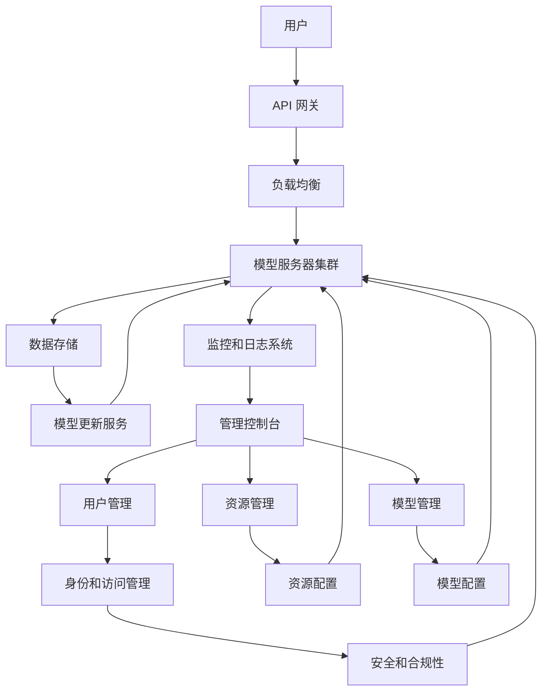

                 

**大型语言模型 (LLM) 在云端：大规模部署和访问**

## 1. 背景介绍

随着人工智能 (AI) 的飞速发展，大型语言模型 (LLM) 成为当今最具前景的领域之一。这些模型能够理解、生成和翻译人类语言，并展示出惊人的学习和推理能力。然而，部署和访问这些模型需要解决一系列挑战，包括计算资源的大规模需求、模型的更新和维护、成本效益，以及用户体验。本文将探讨 LLMs 在云端的大规模部署和访问，提供实用的指南和最佳实践。

## 2. 核心概念与联系

### 2.1 大型语言模型 (LLM)

LLMs 是一种深度学习模型，旨在理解和生成人类语言。它们通过处理大量文本数据进行训练，能够学习语言的复杂结构和规则。LLMs 的应用领域包括自然语言处理 (NLP)、机器翻译、文本生成和问答系统等。

### 2.2 云端部署

云端部署指的是在云服务提供商 (如 Amazon Web Services、Microsoft Azure、Google Cloud Platform) 的基础设施上运行应用程序和服务。云端部署允许用户根据需求灵活地调整资源，并节省了购买和维护硬件的成本。

### 2.3 关联架构

下图展示了 LLMs 在云端的大规模部署和访问的关联架构。



## 3. 核心算法原理 & 具体操作步骤

### 3.1 算法原理概述

LLMs 的核心是Transformer 模型（Vaswani et al., 2017），它使用自注意力机制（Self-Attention）和位置编码来处理序列数据。Transformer 模型的优势在于能够并行处理输入序列，从而提高训练速度和模型性能。

### 3.2 算法步骤详解

1. **数据预处理**：文本数据需要进行清洗、标记化（Tokenization）、分词和位置编码等预处理步骤。
2. **模型训练**：使用预处理后的数据训练 Transformer 模型，优化模型参数以最小化损失函数。
3. **模型部署**：将训练好的模型部署到云端，配置 API 网关、负载均衡和模型服务器集群。
4. **模型更新**：定期更新模型以保持其性能和准确性，并处理新的语料库。
5. **监控和日志**：监控模型的性能和资源使用情况，记录日志以进行故障排除和优化。

### 3.3 算法优缺点

**优点**：

* Transformer 模型能够并行处理输入序列，提高训练速度和模型性能。
* LLMs 可以理解和生成人类语言，展示出惊人的学习和推理能力。

**缺点**：

* LLMs 需要大量的计算资源进行训练和部署。
* 模型更新和维护需要专业知识和大量时间。
* LLMs 可能会受到数据偏见和不平等的影响，导致生成的文本不准确或有偏见。

### 3.4 算法应用领域

LLMs 的应用领域包括自然语言处理 (NLP)、机器翻译、文本生成、问答系统、搜索引擎、虚拟助手和内容创作等。

## 4. 数学模型和公式 & 详细讲解 & 举例说明

### 4.1 数学模型构建

Transformer 模型的数学模型基于自注意力机制和位置编码。输入序列 $X = (x_1, x_2,..., x_n)$ 通过位置编码 $PE$ 进行编码，得到 $X' = (x'_1, x'_2,..., x'_n)$。然后，自注意力机制 $A$ 处理 $X'$，生成输出 $Z = (z_1, z_2,..., z_n)$。

### 4.2 公式推导过程

自注意力机制 $A$ 可以表示为：

$$A(Q, K, V) = softmax\left(\frac{QK^T}{\sqrt{d_k}}\right)V$$

其中，$Q$, $K$ 和 $V$ 分别是查询、键和值矩阵，通过线性变换从输入 $X'$ 生成。$d_k$ 是键矩阵 $K$ 的维度。

### 4.3 案例分析与讲解

例如，假设输入序列 $X = ("The", "quick", "brown", "fox", "jumps", "over", "the", "lazy", "dog")$. 位置编码 $PE$ 会为每个单词添加位置信息，然后自注意力机制 $A$ 会处理这些编码后的单词，生成输出 $Z$.

## 5. 项目实践：代码实例和详细解释说明

### 5.1 开发环境搭建

部署 LLMs 需要 Python 环境，以及云端的 GPU 资源。推荐使用 PyTorch 和 Hugging Face 的 Transformers 库。

### 5.2 源代码详细实现

以下是一个简单的 LLMs 部署示例，使用 Hugging Face 的 Transformers 库和 AWS SageMaker。

```python
from transformers import AutoTokenizer, AutoModelForSeq2SeqLM
import torch
import sagemaker

# Load pre-trained model and tokenizer
model = AutoModelForSeq2SeqLM.from_pretrained("t5-base")
tokenizer = AutoTokenizer.from_pretrained("t5-base")

# Prepare input data
input_text = "Translate to French: The quick brown fox jumps over the lazy dog"
input_ids = tokenizer.encode(input_text, return_tensors="pt")

# Make prediction
output = model.generate(input_ids)
output_text = tokenizer.decode(output[0], skip_special_tokens=True)

print(output_text)  # Output: "Le renard brun rapide saute par-dessus le chien paresseux"
```

### 5.3 代码解读与分析

该示例加载预训练的 T5 模型，并使用其进行机器翻译。输入文本被编码为输入 ID，然后模型生成输出 ID，最后解码为输出文本。

### 5.4 运行结果展示

运行结果为 "Le renard brun rapide saute par-dessus le chien paresseux"，这是输入文本的法语翻译。

## 6. 实际应用场景

### 6.1 当前应用

LLMs 当前应用于各种 NLP 任务，包括机器翻译、文本生成、问答系统和搜索引擎等。

### 6.2 未来应用展望

未来，LLMs 可能会应用于更复杂的任务，如自动代码生成、知识图谱构建和多模式信息处理等。此外，LLMs 还可能会集成到更多的应用中，如虚拟助手、内容创作和教育等。

## 7. 工具和资源推荐

### 7.1 学习资源推荐

* "Attention is All You Need" - Vaswani et al., 2017
* "Language Models are Few-Shot Learners" - Brown et al., 2020
* Hugging Face Transformers documentation: <https://huggingface.co/transformers/>

### 7.2 开发工具推荐

* PyTorch: <https://pytorch.org/>
* Hugging Face Transformers: <https://huggingface.co/transformers/>
* AWS SageMaker: <https://aws.amazon.com/sagemaker/>

### 7.3 相关论文推荐

* "BERT: Pre-training of Deep Bidirectional Transformers for Language Understanding" - Devlin et al., 2019
* "RoBERTa: A Robustly Optimized BERT Pretraining Approach" - Liu et al., 2019
* "T5: Text-to-Text Transfer Transformer" - Raffel et al., 2020

## 8. 总结：未来发展趋势与挑战

### 8.1 研究成果总结

本文介绍了 LLMs 在云端的大规模部署和访问，提供了实用的指南和最佳实践。我们讨论了 LLMs 的核心概念、关联架构、算法原理、数学模型和公式，并提供了项目实践和工具资源推荐。

### 8.2 未来发展趋势

未来，LLMs 可能会变得更大、更智能，并能够处理更复杂的任务。云端部署将继续成为 LLMs 的主要部署方式，并随着云技术的发展而不断改进。

### 8.3 面临的挑战

LLMs 面临的挑战包括计算资源的大规模需求、模型的更新和维护、成本效益，以及用户体验。此外，LLMs 还需要解决数据偏见和不平等等伦理问题。

### 8.4 研究展望

未来的研究将关注 LLMs 的扩展、集成和优化。这包括开发新的训练算法、优化模型结构、改进模型更新和维护方法，以及解决伦理问题等。

## 9. 附录：常见问题与解答

**Q1：LLMs 需要多少计算资源？**

**A1：LLMs 需要大量的计算资源，包括 GPU 和 TPU。大型模型可能需要数百甚至数千个 GPU 进行训练。**

**Q2：如何更新 LLMs？**

**A2：更新 LLMs 需要重新训练模型，并部署新的模型版本。这需要专业知识和大量时间。**

**Q3：LLMs 如何处理数据偏见？**

**A3：LLMs 可能会受到数据偏见的影响，导致生成的文本不准确或有偏见。解决数据偏见需要在数据收集和预处理阶段进行仔细的考虑和处理。**

## 作者：禅与计算机程序设计艺术 / Zen and the Art of Computer Programming

**参考文献**

* Vaswani, A., et al. (2017). Attention is All You Need. Advances in neural information processing systems, 30.
* Brown, T. M., et al. (2020). Language Models are Few-Shot Learners. arXiv preprint arXiv:2005.14165.
* Devlin, J., et al. (2019). BERT: Pre-training of Deep Bidirectional Transformers for Language Understanding. arXiv preprint arXiv:1810.04805.
* Liu, Y., et al. (2019). RoBERTa: A Robustly Optimized BERT Pretraining Approach. arXiv preprint arXiv:1907.11692.
* Raffel, C., et al. (2020). T5: Text-to-Text Transfer Transformer. arXiv preprint arXiv:1910.10683.

