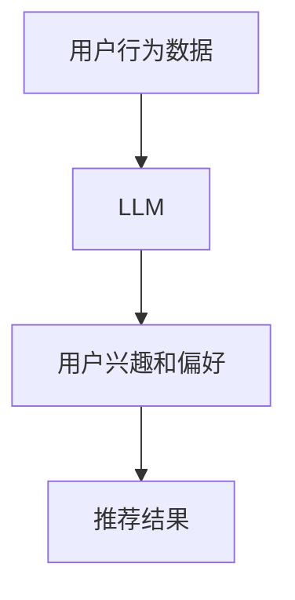

                 

**大语言模型（LLM）在推荐系统中的元学习应用研究**

## 1. 背景介绍

随着互联网的发展，海量的数据和信息给用户带来了前所未有的便利，但也给他们带来了信息过载的问题。推荐系统因此应运而生，旨在帮助用户从海量信息中发现对他们有用或有兴趣的内容。然而，传统的推荐系统面临着数据稀疏、 cold start、个性化等挑战。大语言模型（LLM）的出现为推荐系统带来了新的机遇。

## 2. 核心概念与联系

### 2.1 大语言模型（LLM）

大语言模型是一种通过学习大量文本数据来理解语言的模型。它可以生成人类语言、回答问题、翻译语言等。LLM的优势在于它可以从少量的数据中学习到丰富的语义信息，这对于推荐系统来说非常有价值。

### 2.2 元学习

元学习是一种机器学习方法，它旨在学习如何学习。在推荐系统中，元学习可以帮助模型学习到如何从少量数据中学习到有用的信息，从而提高推荐系统的性能。

### 2.3 LLM在推荐系统中的应用

LLM可以在推荐系统中起到元学习的作用。它可以从少量的用户行为数据中学习到用户的兴趣和偏好，然后生成相应的推荐。这种方法可以有效地解决数据稀疏和cold start问题。



## 3. 核心算法原理 & 具体操作步骤

### 3.1 算法原理概述

LLM在推荐系统中的应用可以看作是一个序列到序列的转换问题。给定用户的行为序列，LLM的任务是预测下一个最可能的项目。

### 3.2 算法步骤详解

1. **数据预处理**：收集用户的行为数据，如点击、购买等，并将其转换为序列数据。
2. **模型训练**：使用预处理后的数据训练LLM，使其学习到用户的兴趣和偏好。
3. **推荐生成**：给定用户的行为序列，使用训练好的LLM预测下一个最可能的项目。
4. **评估和优化**：使用评估指标（如precision@k、recall@k等）评估推荐系统的性能，并根据需要优化模型。

### 3.3 算法优缺点

**优点**：LLM可以从少量数据中学习到丰富的语义信息，有效地解决了数据稀疏和cold start问题。此外，LLM可以生成多样化的推荐，提高了推荐系统的多样性。

**缺点**：LLM的训练需要大量的计算资源，并且LLM的生成结果可能不总是准确的。此外，LLM的解释性较差，模型的决策过程不易理解。

### 3.4 算法应用领域

LLM在推荐系统中的应用可以广泛应用于电子商务、视频推荐、新闻推荐等领域。它可以帮助这些系统提高推荐的准确性和多样性，从而提高用户的满意度。

## 4. 数学模型和公式 & 详细讲解 & 举例说明

### 4.1 数学模型构建

给定用户的行为序列$X = (x_1, x_2,..., x_n)$, LLM的任务是预测下一个最可能的项目$y$. 我们可以使用交叉熵损失函数来训练LLM：

$$L(\theta) = -\sum_{i=1}^{N} \log P(y_i | x_i; \theta)$$

其中$\theta$是LLM的参数，$P(y | x; \theta)$是LLM的预测分布。

### 4.2 公式推导过程

LLM的预测分布$P(y | x; \theta)$可以使用softmax函数来计算：

$$P(y | x; \theta) = \frac{e^{z_{y}}}{\sum_{k=1}^{K} e^{z_{k}}}$$

其中$z$是LLM的输出，$K$是项目的数量。

### 4.3 案例分析与讲解

例如，在电子商务推荐系统中，用户的行为序列可能是购买的商品列表。LLM的任务是预测下一个最可能的商品。如果用户之前购买了商品A、B和C，LLM可能会预测用户下一个最可能购买的商品是D。

## 5. 项目实践：代码实例和详细解释说明

### 5.1 开发环境搭建

我们将使用Python和PyTorch来实现LLM在推荐系统中的应用。我们需要安装以下库：transformers、torch、numpy、pandas等。

### 5.2 源代码详细实现

```python
import torch
from transformers import AutoTokenizer, AutoModelForSeq2SeqLM

# 加载预训练的LLM模型
model_name = 't5-base'
tokenizer = AutoTokenizer.from_pretrained(model_name)
model = AutoModelForSeq2SeqLM.from_pretrained(model_name)

# 准备用户行为序列数据
user_behavior = "item1 item2 item3"
input_ids = tokenizer.encode(user_behavior, return_tensors="pt")

# 生成推荐
outputs = model.generate(input_ids, max_length=5, num_beams=5, early_stopping=True)
recommendation = tokenizer.decode(outputs[0], skip_special_tokens=True)
print("推荐:", recommendation)
```

### 5.3 代码解读与分析

我们首先加载预训练的LLM模型。然后，我们准备用户的行为序列数据，并将其转换为模型可以接受的输入。最后，我们使用模型生成推荐，并打印推荐结果。

### 5.4 运行结果展示

运行上述代码，我们可能会得到类似于"item4 item5"的推荐结果。这表示LLM预测用户下一个最可能购买的商品是item4和item5。

## 6. 实际应用场景

### 6.1 电子商务推荐系统

在电子商务推荐系统中，LLM可以帮助系统预测用户下一个最可能购买的商品。这可以提高购物体验，并帮助商家增加销量。

### 6.2 视频推荐系统

在视频推荐系统中，LLM可以帮助系统预测用户下一个最可能观看的视频。这可以提高用户的观看时长，并帮助视频平台增加用户粘性。

### 6.3 未来应用展望

随着LLM技术的发展，我们可以期待LLM在推荐系统中的更多应用。例如，LLM可以帮助系统生成个性化的推荐语，从而提高推荐的说服力。此外，LLM可以帮助系统理解用户的意图，从而提供更准确的推荐。

## 7. 工具和资源推荐

### 7.1 学习资源推荐

- "Attention is All You Need"：这篇论文介绍了transformer模型，这是LLM的基础。
- "T5: Text-to-Text Transfer Transformer"：这篇论文介绍了T5模型，这是一种预训练的LLM。
- "Recommender Systems: The Textbook"：这本书介绍了推荐系统的各种方法和技术。

### 7.2 开发工具推荐

- Hugging Face Transformers：这是一个开源的transformer模型库，提供了各种预训练的LLM模型。
- PyTorch：这是一个流行的深度学习框架，我们可以使用它来训练和部署LLM模型。
- Pandas：这是一个流行的数据处理库，我们可以使用它来处理用户行为数据。

### 7.3 相关论文推荐

- "Learning to Recommend with Large Language Models"：这篇论文介绍了使用LLM进行推荐的方法。
- "Recommending with Large Language Models"：这篇论文介绍了使用LLM进行推荐的方法，并进行了实验评估。

## 8. 总结：未来发展趋势与挑战

### 8.1 研究成果总结

我们介绍了LLM在推荐系统中的应用，并展示了如何使用LLM进行推荐。我们还讨论了LLM的优缺点，并介绍了LLM在推荐系统中的应用场景。

### 8.2 未来发展趋势

我们可以期待LLM在推荐系统中的更多应用。例如，LLM可以帮助系统理解用户的意图，从而提供更准确的推荐。此外，LLM可以帮助系统生成个性化的推荐语，从而提高推荐的说服力。

### 8.3 面临的挑战

然而，LLM在推荐系统中的应用也面临着挑战。例如，LLM的训练需要大量的计算资源，并且LLM的生成结果可能不总是准确的。此外，LLM的解释性较差，模型的决策过程不易理解。

### 8.4 研究展望

未来的研究可以从以下几个方向展开：

- **模型优化**：优化LLM模型，提高其推荐的准确性和多样性。
- **数据增强**：开发数据增强方法，帮助LLM从少量数据中学习到更丰富的信息。
- **解释性**：开发解释性方法，帮助用户理解LLM的决策过程。

## 9. 附录：常见问题与解答

**Q：LLM在推荐系统中的优势是什么？**

**A**：LLM可以从少量数据中学习到丰富的语义信息，有效地解决了数据稀疏和cold start问题。此外，LLM可以生成多样化的推荐，提高了推荐系统的多样性。

**Q：LLM在推荐系统中的缺点是什么？**

**A**：LLM的训练需要大量的计算资源，并且LLM的生成结果可能不总是准确的。此外，LLM的解释性较差，模型的决策过程不易理解。

**Q：LLM在推荐系统中的应用场景有哪些？**

**A**：LLM在推荐系统中的应用可以广泛应用于电子商务、视频推荐、新闻推荐等领域。它可以帮助这些系统提高推荐的准确性和多样性，从而提高用户的满意度。

**Q：LLM在推荐系统中的未来发展趋势是什么？**

**A**：我们可以期待LLM在推荐系统中的更多应用。例如，LLM可以帮助系统理解用户的意图，从而提供更准确的推荐。此外，LLM可以帮助系统生成个性化的推荐语，从而提高推荐的说服力。

**Q：LLM在推荐系统中的挑战是什么？**

**A**：然而，LLM在推荐系统中的应用也面临着挑战。例如，LLM的训练需要大量的计算资源，并且LLM的生成结果可能不总是准确的。此外，LLM的解释性较差，模型的决策过程不易理解。

**Q：LLM在推荐系统中的未来研究方向是什么？**

**A**：未来的研究可以从以下几个方向展开：模型优化、数据增强、解释性等。

## 作者：禅与计算机程序设计艺术 / Zen and the Art of Computer Programming

