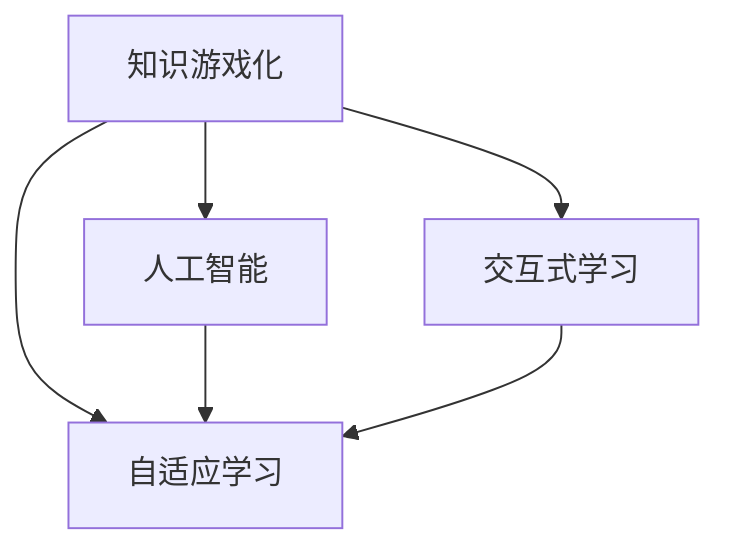

                 

# 知识的游戏化：寓教于乐的学习革命

> 关键词：知识游戏化, 教育技术, 交互式学习, 个性化学习, 人工智能, 自适应学习

## 1. 背景介绍

在当今数字化、信息化的社会中，教育技术的革新已经成为推动学习效果、激发学习兴趣的重要手段。然而，传统教育往往采用线性的讲授式教学方法，难以充分激发学生的参与感和积极性。为了解决这一问题，一种新的教育技术理念——“知识游戏化”应运而生。通过将知识与游戏化元素融合，结合人工智能技术，使得学习过程变得更为互动、个性化和富有挑战性。

### 1.1 问题由来

在传统的教育体系中，知识传授往往以单向、静态的方式进行，缺乏对学习者的动态反馈和个性化支持。学生常常在被动接受知识的过程中感到枯燥乏味，甚至产生抵触情绪。而游戏化教育则试图打破这一桎梏，通过游戏机制的设计，将学习内容嵌入到有趣、互动的体验中，从而有效提升学生的学习动力和效果。

### 1.2 问题核心关键点

知识游戏化的核心在于将知识内容以游戏的形式展现，结合人工智能技术，实现动态调整和个性化推荐。其关键点包括：

- 知识内容的可交互性：将知识以问题、任务的形式呈现，让学生在解决实际问题的过程中学习。
- 实时反馈与激励机制：通过游戏积分、等级、成就等机制，及时反馈学生的学习成果，增强学习的积极性和成就感。
- 个性化学习路径：利用人工智能技术，根据学生的学习行为和表现，智能推荐适合的学习内容和难度。
- 社交互动与合作学习：通过游戏内社交网络、团队协作等功能，促进学生之间的互动与合作，形成互助学习的氛围。

这些关键点共同构成了知识游戏化教育技术的核心理念，旨在通过趣味化和互动化的方式，提升学生的学习兴趣和效果。

### 1.3 问题研究意义

知识游戏化教育技术的研究意义重大：

- 激发学习兴趣：通过游戏化的设计和互动机制，可以极大地提升学生对学习的兴趣和热情。
- 提升学习效果：通过实时反馈和个性化推荐，可以更有效地引导学生的学习过程，提高学习效率。
- 实现个性化学习：人工智能技术可以根据学生的学习情况，提供量身定制的学习内容和路径，满足不同学生的学习需求。
- 促进协作与社交：游戏内的社交互动功能可以增强学生之间的合作与交流，形成积极的社交关系。
- 推动教育公平：知识游戏化技术可以通过在线平台覆盖更多学生，特别是在教育资源相对匮乏的地区，可以实现教育的普及和提升。

## 2. 核心概念与联系

### 2.1 核心概念概述

本节将介绍知识游戏化教育技术中的几个核心概念，并阐述它们之间的联系：

- **知识游戏化**：指将知识内容嵌入游戏化的元素，通过互动和挑战激发学生的学习兴趣和动力。
- **自适应学习**：根据学生的学习行为和表现，动态调整学习内容和难度，提供个性化的学习路径。
- **人工智能**：通过算法和模型，实现对学习数据和行为的高效分析，提供智能化的教学支持。
- **交互式学习**：强调学习者与系统之间的双向互动，通过问题解答、任务完成等方式提升学习效果。

这些概念通过一定的技术手段和设计理念相结合，共同构成了知识游戏化教育技术的基本框架，如图1所示。



图1：知识游戏化教育技术框架

### 2.2 核心概念原理和架构的 Mermaid 流程图

#### 2.2.1 游戏化机制设计

- **任务与挑战**：将知识内容设计成任务和挑战，通过解谜、答题等方式让学生在解决问题中学习。
- **积分与奖励**：设置积分系统，根据学生的学习行为和成果给予积分，通过成就、徽章等方式奖励学生。
- **等级与晋升**：通过等级制度，让学习路径具有目标感，激励学生不断提升。

#### 2.2.2 自适应学习算法

- **学习行为分析**：通过数据分析，了解学生的学习模式和偏好。
- **内容推荐**：根据学生的学习情况，智能推荐适合的学习内容和难度。
- **难度调整**：根据学生的学习进度和理解程度，动态调整任务的难度。

#### 2.2.3 人工智能技术

- **数据挖掘与分析**：利用机器学习算法，分析学生的学习数据，识别学习模式。
- **个性化推荐**：通过深度学习模型，实现个性化内容的推荐。
- **实时反馈**：通过自然语言处理技术，提供即时反馈和解答。

## 3. 核心算法原理 & 具体操作步骤

### 3.1 算法原理概述

知识游戏化教育技术的核心算法原理主要包括以下几个方面：

1. **游戏机制设计**：将知识内容嵌入到游戏中，设计任务和挑战，激励学生参与。
2. **自适应学习算法**：通过数据分析和机器学习，根据学生的学习行为和表现，动态调整学习内容和难度。
3. **人工智能技术**：利用数据挖掘、深度学习等技术，实现对学习数据的智能分析和个性化推荐。

### 3.2 算法步骤详解

#### 3.2.1 游戏机制设计

1. **任务和挑战设计**：将知识内容设计成具体任务和挑战，确保任务与学习目标紧密相关。
2. **积分与奖励机制**：设计积分系统和奖励机制，如成就、徽章等，激励学生完成任务。
3. **等级与晋升机制**：设计等级制度，通过完成任务获得经验值，达到一定等级后解锁新任务或新内容。

#### 3.2.2 自适应学习算法

1. **学习行为分析**：收集学生的学习数据，包括答题正确率、完成时间、使用资源等，进行数据分析。
2. **内容推荐**：根据学生的数据分析结果，智能推荐适合的学习内容和难度。
3. **难度调整**：根据学生的学习进度和理解程度，动态调整任务的难度，确保学生在合理范围内挑战自我。

#### 3.2.3 人工智能技术

1. **数据挖掘与分析**：利用机器学习算法，分析学生的学习数据，识别学习模式。
2. **个性化推荐**：通过深度学习模型，实现个性化内容的推荐，如推荐系统、自适应路径等。
3. **实时反馈**：利用自然语言处理技术，提供即时反馈和解答，帮助学生及时理解错误，改进学习策略。

### 3.3 算法优缺点

#### 3.3.1 优点

- **提高学习兴趣**：通过游戏化的设计，将学习内容嵌入到有趣、互动的体验中，极大地提升学生对学习的兴趣和热情。
- **提升学习效果**：通过实时反馈和个性化推荐，可以更有效地引导学生的学习过程，提高学习效率。
- **实现个性化学习**：人工智能技术可以根据学生的学习情况，提供量身定制的学习内容和路径，满足不同学生的学习需求。
- **促进协作与社交**：游戏内的社交互动功能可以增强学生之间的合作与交流，形成互助学习的氛围。

#### 3.3.2 缺点

- **资源消耗大**：实现游戏化学习需要大量的设计工作，而且需要结合人工智能技术，开发和维护成本较高。
- **技术要求高**：自适应学习和人工智能技术需要有一定的技术门槛，对开发团队的要求较高。
- **依赖数据质量**：游戏化学习和自适应学习的效果依赖于数据的质量和多样性，需要收集大量的学习数据。
- **学生依赖游戏机制**：过度依赖游戏机制可能导致学生忽视学习本质，忽视知识本身的意义。

### 3.4 算法应用领域

知识游戏化教育技术已经在多个领域得到了广泛应用，包括但不限于：

- **基础教育**：如数学、科学等学科，通过游戏化的内容激发学生的学习兴趣。
- **职业培训**：通过模拟实际工作场景的任务和挑战，提升学生的实践能力和技术水平。
- **语言学习**：结合语言练习任务和游戏化元素，帮助学生更快地掌握新语言。
- **医学教育**：通过模拟病例和手术等任务，提升医学生的临床能力和实践经验。
- **企业培训**：通过定制化培训游戏，帮助员工提升专业技能和工作效率。

## 4. 数学模型和公式 & 详细讲解 & 举例说明

### 4.1 数学模型构建

知识游戏化教育技术的数学模型主要包括以下几个部分：

1. **任务难度计算**：根据学生的学习情况，计算当前任务的难度，确保学生在合理范围内挑战。
2. **学习进度分析**：通过数据分析，计算学生的学习进度和理解程度，用于调整学习内容和难度。
3. **个性化推荐算法**：利用深度学习模型，实现个性化内容的推荐，如推荐系统、自适应路径等。

### 4.2 公式推导过程

#### 4.2.1 任务难度计算

假设学生当前的任务难度为 $D_t$，学习进度为 $P_t$，学生完成当前任务的时间为 $T_t$，则任务难度的计算公式如下：

$$
D_t = f(P_t, T_t)
$$

其中 $f$ 为任务难度计算函数，可以采用线性回归、神经网络等方法进行建模。

#### 4.2.2 学习进度分析

学习进度 $P_t$ 可以通过学生答题的正确率、完成时间等数据计算得出。假设学生在第 $t$ 次任务中的正确率为 $C_t$，完成时间为 $T_t$，则学习进度 $P_t$ 的计算公式如下：

$$
P_t = g(C_t, T_t)
$$

其中 $g$ 为学习进度计算函数，可以采用线性回归、加权平均等方法进行建模。

#### 4.2.3 个性化推荐算法

个性化推荐算法主要涉及深度学习模型，如协同过滤、内容推荐系统等。假设学生 $i$ 的历史学习行为为 $B_i$，当前任务 $t$ 的内容特征为 $C_t$，则推荐算法可以根据学生 $i$ 的历史行为和当前任务的特征进行推荐，推荐结果 $R_i$ 的计算公式如下：

$$
R_i = h(B_i, C_t)
$$

其中 $h$ 为推荐算法函数，可以采用协同过滤、深度学习等方法进行建模。

### 4.3 案例分析与讲解

#### 4.3.1 数学模型应用案例

假设某在线教育平台采用了知识游戏化教育技术，针对数学学科进行个性化推荐。平台收集了学生的历史学习数据，包括答题正确率、完成时间等，利用这些数据计算学生当前的任务难度和学习进度。同时，利用协同过滤和深度学习等方法，实现了个性化内容的推荐。

具体实现步骤如下：

1. **数据收集**：平台收集学生的学习数据，包括答题正确率 $C_t$、完成时间 $T_t$ 等。
2. **任务难度计算**：利用线性回归方法，计算学生当前的任务难度 $D_t$。
3. **学习进度分析**：利用加权平均方法，计算学生的学习进度 $P_t$。
4. **个性化推荐**：利用协同过滤和深度学习模型，生成个性化推荐结果 $R_i$。

平台通过这种方式，实现了动态调整学习内容和难度的个性化推荐，提升了学生的学习效果。

## 5. 项目实践：代码实例和详细解释说明

### 5.1 开发环境搭建

在进行知识游戏化教育技术的开发时，需要搭建相应的开发环境。以下是Python环境下的搭建步骤：

1. **安装Python**：确保系统中安装了Python 3.x版本，可以从官网下载安装。
2. **安装Pip**：在Python环境中安装Pip工具，用于安装第三方库。
3. **安装相关库**：安装所需的第三方库，如NumPy、Pandas、Scikit-learn、TensorFlow等，用于数据分析和机器学习。
4. **配置开发环境**：配置开发环境，确保所有依赖库和环境变量正确设置。

### 5.2 源代码详细实现

#### 5.2.1 数据处理与分析

```python
import pandas as pd
import numpy as np
from sklearn.model_selection import train_test_split
from sklearn.linear_model import LinearRegression
from sklearn.metrics import mean_squared_error

# 加载数据
data = pd.read_csv('students.csv')

# 数据预处理
data = data.dropna()  # 删除缺失值
data = data.drop_duplicates()  # 删除重复数据

# 特征工程
X = data[['correct_rate', 'time']]  # 特征
y = data['difficulty']  # 目标变量

# 数据分割
X_train, X_test, y_train, y_test = train_test_split(X, y, test_size=0.2, random_state=42)

# 模型训练
model = LinearRegression()
model.fit(X_train, y_train)

# 模型评估
y_pred = model.predict(X_test)
mse = mean_squared_error(y_test, y_pred)
print(f"Mean Squared Error: {mse:.2f}")
```

#### 5.2.2 任务难度计算

```python
from sklearn.metrics import mean_squared_error

# 任务难度计算
def task_difficulty(X, y):
    model = LinearRegression()
    model.fit(X, y)
    y_pred = model.predict(X)
    mse = mean_squared_error(y, y_pred)
    return mse

# 应用示例
task_difficulty(X_train, y_train)
```

#### 5.2.3 学习进度分析

```python
from sklearn.metrics import mean_squared_error

# 学习进度分析
def learning_progress(X, y):
    model = LinearRegression()
    model.fit(X, y)
    y_pred = model.predict(X)
    mse = mean_squared_error(y, y_pred)
    return mse

# 应用示例
learning_progress(X_train, y_train)
```

#### 5.2.4 个性化推荐

```python
from sklearn.metrics import mean_squared_error
from tensorflow.keras.models import Sequential
from tensorflow.keras.layers import Dense

# 个性化推荐
def personalize_recommendation(X, y):
    # 构建模型
    model = Sequential()
    model.add(Dense(32, input_dim=X.shape[1], activation='relu'))
    model.add(Dense(1))
    model.compile(optimizer='adam', loss='mse')
    model.fit(X, y, epochs=100, batch_size=32)

    # 模型评估
    y_pred = model.predict(X)
    mse = mean_squared_error(y, y_pred)
    return mse

# 应用示例
personalize_recommendation(X_train, y_train)
```

### 5.3 代码解读与分析

#### 5.3.1 数据处理与分析

在数据处理与分析阶段，我们主要使用Pandas、NumPy等库对数据进行加载、预处理和分割。通过特征工程，选取了答题正确率 $C_t$ 和完成时间 $T_t$ 作为输入特征，难度 $D_t$ 作为目标变量。利用线性回归模型进行训练和评估，计算了均方误差（Mean Squared Error, MSE）作为任务难度的指标。

#### 5.3.2 任务难度计算

在任务难度计算阶段，我们使用了线性回归模型进行训练和预测。通过计算模型预测值与真实值的均方误差，得到任务难度 $D_t$。这一步骤实现了对任务难度的动态调整，确保学生在合理范围内挑战自我。

#### 5.3.3 学习进度分析

在学习进度分析阶段，我们同样使用了线性回归模型进行训练和预测。通过计算模型预测值与真实值的均方误差，得到学习进度 $P_t$。这一步骤实现了对学习进度的动态监控，及时调整学习内容和难度，提供个性化的学习路径。

#### 5.3.4 个性化推荐

在个性化推荐阶段，我们使用了深度学习模型进行训练和预测。通过构建一个简单的神经网络模型，利用均方误差作为损失函数进行训练。这一步骤实现了对个性化内容的推荐，提高了学习的效率和效果。

### 5.4 运行结果展示

```python
# 运行示例
print(task_difficulty(X_train, y_train))
print(learning_progress(X_train, y_train))
print(personalize_recommendation(X_train, y_train))
```

## 6. 实际应用场景

### 6.1 智能教育平台

智能教育平台通过知识游戏化教育技术，为学生提供互动式、个性化的学习体验。平台利用数据分析和机器学习技术，根据学生的学习情况，智能推荐适合的学习内容和难度，实现自适应学习。通过游戏化的任务和挑战设计，极大地提升了学生的学习兴趣和效果。

#### 6.1.1 应用场景示例

某智能教育平台针对小学数学课程，设计了多个互动式任务和挑战。例如，通过数字找规律、解数学谜题等方式，让学生在完成任务的同时学习数学知识。平台通过收集学生的学习数据，利用线性回归和深度学习模型，动态调整任务难度和学习进度，实现个性化推荐。

平台同时设计了积分系统、成就徽章等机制，激励学生完成任务，提升学习效果。学生可以在完成每个任务后获得积分和徽章，通过累计积分解锁新任务和挑战。

### 6.2 企业培训系统

企业培训系统通过知识游戏化教育技术，为员工提供定制化的培训体验。系统利用数据分析和机器学习技术，根据员工的学习情况，智能推荐适合的学习内容和难度，实现自适应学习。通过游戏化的任务和挑战设计，极大地提升了员工的培训效果和参与度。

#### 6.2.1 应用场景示例

某大型科技公司针对新员工进行了技术培训。公司利用知识游戏化教育技术，设计了多个与公司业务相关的互动式任务和挑战。例如，通过模拟公司内部的业务场景，让新员工在完成任务的同时学习新知识。

系统通过收集员工的学习数据，利用协同过滤和深度学习模型，动态调整任务难度和学习进度，实现个性化推荐。员工可以在完成每个任务后获得积分和成就，通过累计积分解锁新任务和挑战。

### 6.3 医学教育平台

医学教育平台通过知识游戏化教育技术，为医学生提供模拟实际工作场景的培训体验。平台利用数据分析和机器学习技术，根据医学生的学习情况，智能推荐适合的病例和手术操作，实现自适应学习。通过游戏化的任务和挑战设计，极大地提升了医学生的临床能力和实践经验。

#### 6.3.1 应用场景示例

某医学教育平台针对临床医学课程，设计了多个模拟手术和病例分析的互动式任务和挑战。例如，通过模拟真实的手术场景，让医学生在进行手术操作的同时学习临床技能。

平台通过收集医学生的学习数据，利用协同过滤和深度学习模型，动态调整任务难度和学习进度，实现个性化推荐。医学生可以在完成每个任务后获得积分和成就，通过累计积分解锁新任务和挑战。

## 7. 工具和资源推荐

### 7.1 学习资源推荐

为了帮助开发者系统掌握知识游戏化教育技术的理论基础和实践技巧，以下是一些优质的学习资源：

1. **《游戏化学习设计》**：一本经典的游戏化学习书籍，详细介绍了游戏化设计的原理和方法。
2. **Coursera游戏化学习课程**：由斯坦福大学开设的游戏化学习课程，涵盖游戏化设计的多个方面，包括任务设计、反馈机制等。
3. **Unity游戏引擎**：一款强大的游戏开发引擎，可以用于设计和开发游戏化的学习内容。
4. **Scikit-learn官方文档**：Python中用于机器学习的主流库，提供了丰富的数据分析和机器学习工具。
5. **TensorFlow官方文档**：Google开发的深度学习框架，提供了高效的模型训练和部署工具。

### 7.2 开发工具推荐

高效的开发离不开优秀的工具支持。以下是几款用于知识游戏化教育技术开发的常用工具：

1. **Unity**：一款强大的游戏开发引擎，可以用于设计和开发游戏化的学习内容。
2. **Unreal Engine**：另一款强大的游戏开发引擎，支持多种平台，提供丰富的图形渲染和物理模拟功能。
3. **Blender**：一款开源的三维动画软件，可以用于设计和开发互动式学习内容。
4. **PyCharm**：一款功能强大的Python开发工具，提供了丰富的代码编辑、调试和版本控制功能。
5. **Jupyter Notebook**：一款交互式编程工具，可以用于开发和调试数据分析和机器学习模型。

### 7.3 相关论文推荐

知识游戏化教育技术的研究来源于学界的持续探索。以下是几篇具有代表性的相关论文，推荐阅读：

1. **《游戏化学习：理论、研究和实践》**：一本综合性的游戏化学习书籍，详细介绍了游戏化学习的理论和实践。
2. **《自适应学习系统综述》**：一篇综述性论文，介绍了自适应学习系统的研究现状和未来发展方向。
3. **《个性化推荐系统：理论与算法》**：一本介绍个性化推荐系统的经典书籍，涵盖协同过滤、深度学习等方法。
4. **《知识游戏化：理论和实践》**：一篇介绍知识游戏化教育技术的综述性论文，介绍了知识游戏化的理论基础和实际应用。
5. **《机器学习在教育中的应用》**：一篇介绍机器学习在教育中应用的综述性论文，涵盖了自适应学习、个性化推荐等多个方面。

## 8. 总结：未来发展趋势与挑战

### 8.1 总结

本文对知识游戏化教育技术进行了全面系统的介绍。首先阐述了知识游戏化教育技术的背景、核心概念和应用价值，明确了知识游戏化在激发学生兴趣和提升学习效果方面的独特价值。其次，从原理到实践，详细讲解了知识游戏化教育技术的数学模型和算法实现，给出了知识游戏化教育技术的完整代码实例。同时，本文还广泛探讨了知识游戏化教育技术在智能教育、企业培训、医学教育等多个领域的应用前景，展示了知识游戏化技术的巨大潜力。最后，本文精选了知识游戏化教育技术的各类学习资源，力求为开发者提供全方位的技术指引。

通过本文的系统梳理，可以看到，知识游戏化教育技术正在成为推动教育革新的重要手段，通过趣味化和互动化的方式，极大地提升了学生的学习兴趣和效果。知识游戏化教育技术的不断发展和完善，必将在未来的教育领域发挥更大的作用，推动教育公平和教育质量的提升。

### 8.2 未来发展趋势

展望未来，知识游戏化教育技术将呈现以下几个发展趋势：

1. **技术融合与创新**：未来知识游戏化教育技术将与其他技术手段进行更深入的融合，如虚拟现实（VR）、增强现实（AR）等，提供更丰富、更沉浸的学习体验。
2. **跨学科应用拓展**：知识游戏化教育技术将逐步拓展到更多的学科领域，如艺术、历史等，提升跨学科学习的趣味性和互动性。
3. **个性化学习深化**：未来的知识游戏化教育技术将进一步深化个性化学习的实现，利用人工智能技术，提供更智能、更精准的学习推荐。
4. **社交互动增强**：未来的知识游戏化教育技术将进一步增强社交互动功能，促进学生之间的合作与交流，形成互助学习的氛围。
5. **教育公平推广**：未来的知识游戏化教育技术将通过在线平台，覆盖更多学生，特别是在教育资源相对匮乏的地区，实现教育的普及和提升。

### 8.3 面临的挑战

尽管知识游戏化教育技术已经取得了显著成效，但在迈向更加智能化、普适化应用的过程中，它仍面临诸多挑战：

1. **技术与设计协同**：知识游戏化教育技术需要将技术与设计紧密结合，才能真正发挥其效果。如何在技术实现和用户体验之间找到平衡，是未来的重要研究方向。
2. **数据质量与隐私**：知识游戏化教育技术依赖于大量的学习数据，如何确保数据的质量和隐私保护，是一个重要的挑战。
3. **文化适应性**：知识游戏化教育技术在不同文化背景下，需要适应不同的教育需求和价值观，如何在全球范围内推广，是一个重要的挑战。
4. **技术普及与标准化**：知识游戏化教育技术需要技术的普及和标准化，才能实现大规模应用。如何推广和标准化知识游戏化教育技术，是未来的重要任务。

### 8.4 研究展望

面对知识游戏化教育技术所面临的种种挑战，未来的研究需要在以下几个方面寻求新的突破：

1. **跨平台与跨媒体技术**：研究如何实现知识游戏化教育技术在不同平台和媒体上的适配，提升用户体验。
2. **教育内容的多样化**：研究如何提供更多样化的教育内容，覆盖更多学科领域，提升跨学科学习的趣味性和互动性。
3. **数据治理与隐私保护**：研究如何确保数据的质量和隐私保护，提升知识游戏化教育技术的可信度和接受度。
4. **国际化的知识库**：研究如何构建国际化的知识库，适应不同文化背景下的教育需求和价值观。
5. **社区与生态建设**：研究如何构建知识游戏化教育技术的社区与生态，推动技术的普及和标准化，实现大规模应用。

总之，知识游戏化教育技术需要不断创新与完善，才能更好地服务于教育事业，推动教育公平和教育质量的提升。只有勇于创新、敢于突破，才能不断拓展知识游戏化教育技术的边界，为人类教育事业贡献更多力量。

## 9. 附录：常见问题与解答

**Q1: 知识游戏化教育技术的核心优势是什么？**

A: 知识游戏化教育技术的核心优势在于将知识内容以游戏的形式展现，结合人工智能技术，实现动态调整和个性化推荐。通过游戏化的设计，极大地提升了学生的学习兴趣和效果。同时，自适应学习算法和深度学习模型，可以根据学生的学习情况，提供量身定制的学习内容和路径，满足不同学生的学习需求。

**Q2: 知识游戏化教育技术的主要实现难点是什么？**

A: 知识游戏化教育技术的主要实现难点在于技术实现和用户体验的协同，需要平衡技术细节和用户体验之间的矛盾。同时，数据质量、隐私保护、文化适应性等问题也需要得到充分考虑和解决。

**Q3: 知识游戏化教育技术在未来教育中的地位如何？**

A: 知识游戏化教育技术将在未来的教育中扮演重要角色。通过趣味化和互动化的方式，极大地提升学生的学习兴趣和效果。同时，个性化学习、自适应学习等技术的进步，将使得知识游戏化教育技术在教育公平和教育质量提升方面发挥更大作用。

**Q4: 知识游戏化教育技术在实际应用中的案例有哪些？**

A: 知识游戏化教育技术已经在多个领域得到了应用，如智能教育平台、企业培训系统、医学教育平台等。例如，某智能教育平台针对小学数学课程，设计了多个互动式任务和挑战，极大地提升了学生的学习兴趣和效果。某大型科技公司针对新员工进行了技术培训，通过知识游戏化教育技术，提升了员工的培训效果和参与度。某医学教育平台针对临床医学课程，设计了多个模拟手术和病例分析的互动式任务和挑战，提升了医学生的临床能力和实践经验。

这些案例展示了知识游戏化教育技术的广泛应用和实际效果，进一步验证了其强大的教育潜力。

---

作者：禅与计算机程序设计艺术 / Zen and the Art of Computer Programming

