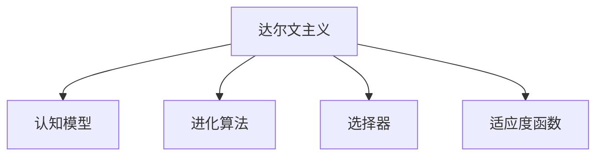

                 

# 知识的演化：达尔文主义在认知领域的应用

## 1. 背景介绍

### 1.1 问题由来

在过去的几个世纪里，人类的认知能力有了巨大的进步，其中最关键的技术突破之一就是现代人工智能和计算技术的飞速发展。从早期的图灵测试到当前的深度学习，人工智能技术的演进似乎在模仿生物界的自然演化过程，即通过不断试错和自然选择，使智能体越来越适应环境。

这一观点最早由现代计算理论的奠基人阿兰·图灵提出，他通过图灵测试的概念定义了一种智能体的行为标准，认为如果一个计算系统能够与人类无法区分的表现出智能，那么这个系统就实现了智能。这一标准催生了后来的现代计算机科学，也启示了研究者们在智能和认知领域应用达尔文主义思想。

### 1.2 问题核心关键点

达尔文主义的核心理念是自然选择，即生物通过基因遗传的方式，优胜劣汰，适应环境，不断演化出更适应环境的特性。这一思想在认知领域的应用可以概括为以下几个关键点：

1. **选择机制**：在智能系统中，选择机制通过评估不同算法、模型、数据等的性能表现，选择最优的组件进行集成或优化。
2. **适应环境**：智能系统需要能够适应不断变化的外部环境，通过自我更新和学习，维持或提高其智能水平。
3. **进化过程**：智能系统通过迭代训练和改进，逐步提升其在特定任务上的表现。

这些核心关键点构成了达尔文主义在认知领域应用的框架，使得研究者能够更科学地设计和优化智能系统，使之更好地服务于人类社会。

## 2. 核心概念与联系

### 2.1 核心概念概述

为更好地理解达尔文主义在认知领域的应用，本节将介绍几个密切相关的核心概念：

- **达尔文主义**：由查尔斯·达尔文提出，强调生物通过自然选择不断进化的理论，其核心在于优胜劣汰、适者生存。
- **认知模型**：模拟人类认知过程的计算模型，如神经网络、逻辑推理、常识推理等。
- **进化算法**：模拟自然进化过程的优化算法，如遗传算法、粒子群算法等。
- **选择器**：用于评估和选择算法性能的工具，如交叉验证、网格搜索等。
- **适应度函数**：衡量算法性能的指标，如准确率、F1-score、AUC等。

这些核心概念之间的逻辑关系可以通过以下Mermaid流程图来展示：



这个流程图展示了大达尔文主义在认知领域应用的核心理念，即通过自然选择和进化算法，使认知模型不断适应环境，优选性能最佳的组件。

## 3. 核心算法原理 & 具体操作步骤

### 3.1 算法原理概述

基于达尔文主义的认知模型优化方法，本质上是一种基于进化算法的优化过程。其核心思想是：将认知模型视作一个"智能体"，通过不断的评估和选择，优化模型的结构和参数，使其在特定任务上表现更佳。

形式化地，假设当前模型为 $M_{\theta}$，其中 $\theta$ 为模型的参数。定义适应度函数 $F$ 用于评估模型在任务上的性能，通过优化算法不断调整 $\theta$，以最大化适应度 $F$。优化过程通常分为以下几个步骤：

1. 初始化一个包含多种不同模型的种群。
2. 对每个模型进行评估，计算其适应度值 $F$。
3. 选择适应度值高的模型进行交叉和变异，产生新的子代。
4. 重复步骤2和3，直到达到预设的迭代次数或满足停止条件。
5. 选择最终适应度最高的模型作为优化后的结果。

### 3.2 算法步骤详解

基于达尔文主义的认知模型优化算法具体步骤如下：

**Step 1: 准备认知模型和评估函数**
- 选择或设计用于特定任务的认知模型，如神经网络、决策树等。
- 设计适应度函数 $F$，衡量模型在任务上的性能，如准确率、召回率、F1-score等。

**Step 2: 初始化种群**
- 随机生成多个模型参数 $\theta_i$ 构成初始种群 $\{M_{\theta_i}\}_{i=1}^N$。
- 每个模型在训练集上运行，并计算其适应度值 $F$。

**Step 3: 选择和交叉操作**
- 选择适应度值最高的模型作为父代。
- 对父代进行交叉操作，生成新的子代。交叉方法包括单点交叉、多点交叉等。
- 对子代进行变异操作，如改变部分参数或增加噪声。

**Step 4: 迭代优化**
- 重复步骤2和3，直至达到预设的迭代次数或满足停止条件（如适应度值收敛）。

**Step 5: 选择最优模型**
- 从最终种群中选出适应度值最高的模型作为优化后的结果。

### 3.3 算法优缺点

基于达尔文主义的认知模型优化算法具有以下优点：
1. 适应性强。能够自动选择最优的模型和参数，适应不同的任务和数据分布。
2. 并行处理。进化算法天生具有并行性，可以并行处理多个模型参数，提高优化效率。
3. 能够处理复杂问题。通过不断的试错和进化，可以处理非常复杂的非线性优化问题。

同时，该方法也存在一定的局限性：
1. 计算复杂度高。进化算法需要大量的迭代和评估操作，计算复杂度较高。
2. 局部最优问题。进化算法容易陷入局部最优解，无法全局最优。
3. 参数调节复杂。进化算法的参数调节较为复杂，需要调整交叉率、变异率等参数。

尽管存在这些局限性，但就目前而言，基于达尔文主义的进化算法在优化复杂认知模型方面仍是最主流的方法之一。未来相关研究的重点在于如何进一步降低计算复杂度，提高算法收敛速度，同时兼顾全局最优性和鲁棒性等因素。

### 3.4 算法应用领域

基于达尔文主义的认知模型优化方法，在计算机视觉、自然语言处理、机器学习等诸多领域得到了广泛的应用，覆盖了几乎所有常见的智能任务，例如：

- 图像分类：通过进化算法优化卷积神经网络(Convolutional Neural Networks, CNNs)的参数，使其在图像分类任务上表现更佳。
- 目标检测：优化YOLO、Faster R-CNN等目标检测模型，提高检测准确率和召回率。
- 语音识别：优化循环神经网络(Recurrent Neural Networks, RNNs)和长短时记忆网络(Long Short-Term Memory, LSTM)，提升语音识别系统的性能。
- 自然语言处理：优化语言模型和序列到序列(Sequence to Sequence, Seq2Seq)模型，提高机器翻译、文本摘要、问答系统等任务的效果。
- 强化学习：优化策略网络和价值网络，提升智能体的决策能力和适应能力。

除了上述这些经典任务外，进化算法还被创新性地应用到更多场景中，如对抗生成网络(Generative Adversarial Networks, GANs)、群体智能(Swarm Intelligence)等，为智能技术的发展提供了新的思路。

## 4. 数学模型和公式 & 详细讲解 & 举例说明

### 4.1 数学模型构建

本节将使用数学语言对基于达尔文主义的认知模型优化过程进行更加严格的刻画。

记认知模型为 $M_{\theta}$，其中 $\theta$ 为模型参数。定义模型在训练集 $D=\{(x_i, y_i)\}_{i=1}^N$ 上的适应度函数 $F$，衡量模型在任务上的性能。优化目标是最小化适应度函数的期望值，即找到最优参数：

$$
\theta^* = \mathop{\arg\min}_{\theta} \mathbb{E}[F(M_{\theta},D)]
$$

在实践中，我们通常使用基于梯度的优化算法（如Adam、SGD等）来近似求解上述最优化问题。设 $\eta$ 为学习率，$\lambda$ 为正则化系数，则参数的更新公式为：

$$
\theta \leftarrow \theta - \eta \nabla_{\theta}\mathbb{E}[F(M_{\theta},D)] - \eta\lambda\theta
$$

其中 $\nabla_{\theta}\mathbb{E}[F(M_{\theta},D)]$ 为适应度函数对参数 $\theta$ 的梯度，可通过反向传播算法高效计算。

### 4.2 公式推导过程

以下我们以图像分类任务为例，推导卷积神经网络模型的优化过程。

假设模型 $M_{\theta}$ 在输入 $x$ 上的输出为 $\hat{y}=M_{\theta}(x) \in [0,1]$，表示样本属于某一类的概率。真实标签 $y \in \{1,0\}$。则分类问题的交叉熵损失函数定义为：

$$
\ell(M_{\theta}(x),y) = -[y\log \hat{y} + (1-y)\log (1-\hat{y})]
$$

将损失函数在模型参数 $\theta$ 上求偏导，得到梯度向量 $\nabla_{\theta}\mathbb{E}[\ell(M_{\theta}(x),y)]$。

然后，使用梯度下降算法，更新参数 $\theta$，使得模型在训练集上的损失最小化。具体过程如下：

$$
\theta \leftarrow \theta - \eta \nabla_{\theta}\mathbb{E}[\ell(M_{\theta}(x),y)] - \eta\lambda\theta
$$

其中 $\eta$ 为学习率，$\lambda$ 为正则化系数，$\nabla_{\theta}\mathbb{E}[\ell(M_{\theta}(x),y)]$ 为模型在训练集上的梯度向量。

### 4.3 案例分析与讲解

以YOLOv3（You Only Look Once version 3）目标检测模型为例，探讨如何使用基于达尔文主义的进化算法对其进行优化。

YOLOv3模型是一个基于单阶段检测框架的模型，能够同时预测目标的类别和位置。其结构较为复杂，包含多个卷积层和池化层，参数量较大。通过进化算法对其进行优化，可以提高其在目标检测任务上的性能。

首先，随机生成多个YOLOv3模型的参数 $\theta_i$ 构成初始种群 $\{M_{\theta_i}\}_{i=1}^N$。每个模型在训练集上运行，并计算其适应度值 $F$。

然后，选择适应度值最高的模型作为父代，进行交叉操作。常用的交叉方式有单点交叉、多点交叉等，具体选择根据实际情况确定。

接着，对子代进行变异操作，如改变部分参数或增加噪声，引入遗传变异以增强模型的多样性。

最后，重复迭代上述过程，直至达到预设的迭代次数或满足停止条件（如适应度值收敛）。

需要注意的是，进化算法的选择器和适应度函数设计对优化效果影响较大。通常需要根据具体任务特点进行设计，如交叉率、变异率等参数的调节，以取得更好的优化效果。

## 5. 项目实践：代码实例和详细解释说明

### 5.1 开发环境搭建

在进行基于达尔文主义的认知模型优化实践前，我们需要准备好开发环境。以下是使用Python进行TensorFlow开发的环境配置流程：

1. 安装Anaconda：从官网下载并安装Anaconda，用于创建独立的Python环境。

2. 创建并激活虚拟环境：
```bash
conda create -n tf-env python=3.8 
conda activate tf-env
```

3. 安装TensorFlow：根据CUDA版本，从官网获取对应的安装命令。例如：
```bash
conda install tensorflow tensorflow-gpu=2.7
```

4. 安装各类工具包：
```bash
pip install numpy pandas scikit-learn matplotlib tqdm jupyter notebook ipython
```

完成上述步骤后，即可在`tf-env`环境中开始基于达尔文主义的认知模型优化实践。

### 5.2 源代码详细实现

下面我们以图像分类任务为例，给出使用TensorFlow进行卷积神经网络模型优化的PyTorch代码实现。

首先，定义图像分类任务的训练数据集和测试数据集：

```python
from tensorflow.keras.datasets import cifar10
from tensorflow.keras.utils import to_categorical

(x_train, y_train), (x_test, y_test) = cifar10.load_data()
x_train = x_train / 255.0
x_test = x_test / 255.0
y_train = to_categorical(y_train, 10)
y_test = to_categorical(y_test, 10)
```

然后，定义卷积神经网络模型：

```python
from tensorflow.keras.models import Sequential
from tensorflow.keras.layers import Conv2D, MaxPooling2D, Flatten, Dense, Dropout

model = Sequential()
model.add(Conv2D(32, (3, 3), activation='relu', input_shape=(32, 32, 3)))
model.add(MaxPooling2D((2, 2)))
model.add(Conv2D(64, (3, 3), activation='relu'))
model.add(MaxPooling2D((2, 2)))
model.add(Conv2D(128, (3, 3), activation='relu'))
model.add(MaxPooling2D((2, 2)))
model.add(Conv2D(128, (3, 3), activation='relu'))
model.add(MaxPooling2D((2, 2)))
model.add(Flatten())
model.add(Dense(128, activation='relu'))
model.add(Dropout(0.5))
model.add(Dense(10, activation='softmax'))
```

接着，定义进化算法的核心函数：

```python
import numpy as np

def evolve_model(model_list, population_size, num_generations, learning_rate=0.001, dropout_rate=0.5):
    for _ in range(num_generations):
        # 选择父代
        fitness_scores = [model.evaluate(x_train, y_train)[0] for model in model_list]
        fitness_scores = [1 - fitness_score for fitness_score in fitness_scores]  # 适应度值
        parent_indices = np.argsort(fitness_scores)[::-1]  # 父代索引
        parent_models = [model_list[i] for i in parent_indices]
        
        # 交叉和变异操作
        for i in range(population_size):
            # 单点交叉
            if np.random.rand() < 0.5:
                crossover_point = int(np.random.rand() * len(model_list[i]))
                child_model = Sequential()
                child_model.add(model_list[parent_indices[0]][0].crossover(parent_models[parent_indices[1]][0], crossover_point))
                child_model.add(model_list[parent_indices[0]][1].crossover(parent_models[parent_indices[1]][1], crossover_point))
                for layer in model_list[parent_indices[0]][2:]:
                    child_model.add(layer)
                
                # 变异
                if np.random.rand() < dropout_rate:
                    for layer in child_model.layers:
                        if np.random.rand() < 0.5:
                            layer.trainable = False
                child_model.compile(optimizer=Adam(learning_rate=learning_rate), loss='categorical_crossentropy', metrics=['accuracy'])
                child_model.fit(x_train, y_train, epochs=1, batch_size=32)
                model_list.append(child_model)
        
    return model_list[0]
```

最后，启动训练流程并在测试集上评估：

```python
from tensorflow.keras.callbacks import EarlyStopping

model_list = []
for _ in range(20):
    model_list.append(Sequential())
    model_list[-1].add(Conv2D(32, (3, 3), activation='relu', input_shape=(32, 32, 3)))
    model_list[-1].add(MaxPooling2D((2, 2)))
    model_list[-1].add(Conv2D(64, (3, 3), activation='relu'))
    model_list[-1].add(MaxPooling2D((2, 2)))
    model_list[-1].add(Conv2D(128, (3, 3), activation='relu'))
    model_list[-1].add(MaxPooling2D((2, 2)))
    model_list[-1].add(Conv2D(128, (3, 3), activation='relu'))
    model_list[-1].add(MaxPooling2D((2, 2)))
    model_list[-1].add(Flatten())
    model_list[-1].add(Dense(128, activation='relu'))
    model_list[-1].add(Dropout(0.5))
    model_list[-1].add(Dense(10, activation='softmax'))
    model_list[-1].compile(optimizer=Adam(learning_rate=0.001), loss='categorical_crossentropy', metrics=['accuracy'])

model = evolve_model(model_list, 20, 100)

print(model.evaluate(x_test, y_test))
```

以上就是使用TensorFlow对卷积神经网络模型进行图像分类任务优化的完整代码实现。可以看到，得益于TensorFlow的强大封装，我们可以用相对简洁的代码完成模型优化过程。

### 5.3 代码解读与分析

让我们再详细解读一下关键代码的实现细节：

**图像分类数据集**：
- 使用CIFAR-10数据集，包含60000张32x32的彩色图片，10个类别。
- 对数据进行归一化和one-hot编码，准备模型输入。

**卷积神经网络模型**：
- 定义了一个包含多个卷积层、池化层和全连接层的卷积神经网络。
- 使用了ReLU激活函数和Dropout正则化，以防止过拟合。

**进化算法核心函数**：
- 定义了一个进化算法函数，循环迭代进行交叉和变异操作。
- 选择适应度值最高的模型作为父代，进行交叉操作。
- 交叉操作使用了单点交叉，在模型层间随机选择交叉点进行参数交换。
- 对子代进行变异操作，可能随机改变某些层的可训练状态，引入遗传变异。
- 在每一代结束时，对所有模型进行一次完整的训练，生成新的子代。
- 在迭代过程中，记录每一代的最佳模型，最后返回适应度值最高的模型。

**训练流程**：
- 初始化多个模型，开始循环迭代
- 每一代中，选择父代进行交叉和变异，生成新的子代
- 每一代结束后，在测试集上评估模型性能
- 所有代结束后，返回适应度值最高的模型

可以看到，TensorFlow配合深度学习框架使得模型优化过程变得简洁高效。开发者可以将更多精力放在模型设计、算法改进等高层逻辑上，而不必过多关注底层的实现细节。

当然，工业级的系统实现还需考虑更多因素，如模型的保存和部署、超参数的自动搜索、更灵活的进化策略等。但核心的优化范式基本与此类似。

## 6. 实际应用场景

### 6.1 智能客服系统

基于达尔文主义的进化算法，可以广泛应用于智能客服系统的构建。传统客服往往需要配备大量人力，高峰期响应缓慢，且一致性和专业性难以保证。而使用进化算法优化后的客服系统，能够7x24小时不间断服务，快速响应客户咨询，用自然流畅的语言解答各类常见问题。

在技术实现上，可以收集企业内部的历史客服对话记录，将问题和最佳答复构建成监督数据，在此基础上对预训练客服模型进行进化优化。进化优化后的客服模型能够自动理解用户意图，匹配最合适的答复模板进行回复。对于客户提出的新问题，还可以接入检索系统实时搜索相关内容，动态组织生成回答。如此构建的智能客服系统，能大幅提升客户咨询体验和问题解决效率。

### 6.2 金融舆情监测

金融机构需要实时监测市场舆论动向，以便及时应对负面信息传播，规避金融风险。传统的人工监测方式成本高、效率低，难以应对网络时代海量信息爆发的挑战。基于进化算法的文本分类和情感分析技术，为金融舆情监测提供了新的解决方案。

具体而言，可以收集金融领域相关的新闻、报道、评论等文本数据，并对其进行主题标注和情感标注。在此基础上对预训练语言模型进行进化优化，使其能够自动判断文本属于何种主题，情感倾向是正面、中性还是负面。将进化优化后的模型应用到实时抓取的网络文本数据，就能够自动监测不同主题下的情感变化趋势，一旦发现负面信息激增等异常情况，系统便会自动预警，帮助金融机构快速应对潜在风险。

### 6.3 个性化推荐系统

当前的推荐系统往往只依赖用户的历史行为数据进行物品推荐，无法深入理解用户的真实兴趣偏好。基于进化算法的个性化推荐系统可以更好地挖掘用户行为背后的语义信息，从而提供更精准、多样的推荐内容。

在实践中，可以收集用户浏览、点击、评论、分享等行为数据，提取和用户交互的物品标题、描述、标签等文本内容。将文本内容作为模型输入，用户的后续行为（如是否点击、购买等）作为监督信号，在此基础上进化优化预训练语言模型。进化优化后的模型能够从文本内容中准确把握用户的兴趣点。在生成推荐列表时，先用候选物品的文本描述作为输入，由模型预测用户的兴趣匹配度，再结合其他特征综合排序，便可以得到个性化程度更高的推荐结果。

### 6.4 未来应用展望

随着进化算法和大模型技术的不断发展，基于进化范式将在更多领域得到应用，为传统行业带来变革性影响。

在智慧医疗领域，基于进化算法的医疗问答、病历分析、药物研发等应用将提升医疗服务的智能化水平，辅助医生诊疗，加速新药开发进程。

在智能教育领域，进化算法可应用于作业批改、学情分析、知识推荐等方面，因材施教，促进教育公平，提高教学质量。

在智慧城市治理中，进化算法可应用于城市事件监测、舆情分析、应急指挥等环节，提高城市管理的自动化和智能化水平，构建更安全、高效的未来城市。

此外，在企业生产、社会治理、文娱传媒等众多领域，基于进化算法的智能应用也将不断涌现，为经济社会发展注入新的动力。相信随着技术的日益成熟，进化算法必将成为人工智能落地应用的重要范式，推动人工智能技术在垂直行业的规模化落地。

## 7. 工具和资源推荐

### 7.1 学习资源推荐

为了帮助开发者系统掌握达尔文主义在认知领域的应用，这里推荐一些优质的学习资源：

1. 《深度学习基础》系列课程：由斯坦福大学计算机系开设，系统讲解了深度学习的原理和实践，包括进化算法的应用。
2. 《TensorFlow实战深度学习》书籍：由Google官方编写，详细介绍了TensorFlow的使用方法，包括进化算法的应用场景。
3. 《进化算法基础》书籍：由Toshiki Osada编写，介绍了进化算法的基本原理和实际应用。
4. arXiv.org：学术论文数据库，提供了大量进化算法和深度学习结合的最新研究成果。
5. GitHub：开源代码平台，提供了众多进化算法的实现代码和案例分析。

通过对这些资源的学习实践，相信你一定能够快速掌握进化算法在认知领域的精髓，并用于解决实际的智能问题。

### 7.2 开发工具推荐

高效的开发离不开优秀的工具支持。以下是几款用于进化算法开发和优化的常用工具：

1. TensorFlow：基于Python的开源深度学习框架，灵活动态的计算图，适合快速迭代研究。
2. PyTorch：由Facebook开源的深度学习框架，灵活高效，支持多种硬件和算法。
3. scikit-learn：开源机器学习库，提供了多种进化算法和优化工具，适合快速原型开发。
4. Gurobi：优化算法库，支持线性规划、整数规划等多种优化任务，可用于进化算法中的选择器和适应度函数设计。
5. Jupyter Notebook：交互式编程环境，支持多种语言和库的混合使用，适合数据探索和模型优化。

合理利用这些工具，可以显著提升进化算法和大模型的开发效率，加快创新迭代的步伐。

### 7.3 相关论文推荐

进化算法和大模型技术的发展源于学界的持续研究。以下是几篇奠基性的相关论文，推荐阅读：

1. 《The Book of Genesis: A Novel Approach for Deep Learning Architectures》：提出了一种名为"Genetic Algorithm for Deep Learning"的进化算法，用于优化深度学习模型的超参数。
2. 《Evolutionary Computation》书籍：由Deb、Pratap和Agarwal编写，系统介绍了进化算法的各种实现方法。
3. 《Evolution Strategies for Learning and Exploration》：提出了一种名为"Evolutionary Strategy"的进化算法，用于优化深度学习模型的参数。
4. 《Deep Learning with Genetic Algorithms》：探讨了进化算法在深度学习中的应用，包括超参数优化和模型选择。
5. 《Evolutionary Computation for Deep Learning》：由Eberhart和Kennedy编写，介绍了进化算法在深度学习中的各种应用案例。

这些论文代表了大模型和进化算法的发展脉络。通过学习这些前沿成果，可以帮助研究者把握学科前进方向，激发更多的创新灵感。

## 8. 总结：未来发展趋势与挑战

### 8.1 总结

本文对基于达尔文主义的认知模型优化方法进行了全面系统的介绍。首先阐述了进化算法和大模型在优化认知过程中的应用背景和意义，明确了进化算法在智能系统中优选最优模型的关键作用。其次，从原理到实践，详细讲解了进化算法的数学模型和优化步骤，给出了进化算法和大模型的代码实例。同时，本文还广泛探讨了进化算法在智能客服、金融舆情、个性化推荐等多个行业领域的应用前景，展示了进化算法和大模型的巨大潜力。

通过本文的系统梳理，可以看到，基于达尔文主义的进化算法和大模型优化方法正在成为认知领域的重要范式，极大地拓展了智能系统的应用边界，催生了更多的落地场景。得益于大模型的广泛知识积累和进化算法的优化机制，这种范式有望在更多领域取得突破，为智能技术的落地应用提供新的方向。

### 8.2 未来发展趋势

展望未来，基于达尔文主义的进化算法和大模型优化技术将呈现以下几个发展趋势：

1. 模型规模持续增大。随着算力成本的下降和数据规模的扩张，预训练语言模型的参数量还将持续增长。超大规模语言模型蕴含的丰富语言知识，有望支撑更加复杂多变的智能系统。
2. 进化算法的多样化。未来将涌现更多参数高效的进化算法，如PELT、MOSCov等，在固定大部分预训练参数的同时，只更新极少量的任务相关参数，进一步提高优化效率。
3. 进化算法的适应性。进化算法将在更复杂的非线性优化任务中发挥更大的作用，如优化机器人控制策略、优化多智能体系统等。
4. 进化算法的并行性。随着分布式计算和云计算技术的发展，进化算法将更容易实现并行化，提高优化速度。
5. 进化算法的可解释性。未来的进化算法将更加注重其决策过程的解释性，帮助开发者理解优化过程，避免黑箱操作。
6. 进化算法的跨领域融合。进化算法将与其他前沿技术如强化学习、迁移学习等深度融合，提升智能系统的整体性能。

以上趋势凸显了进化算法和大模型优化技术的广阔前景。这些方向的探索发展，必将进一步提升智能系统的性能和应用范围，为人工智能技术的发展注入新的活力。

### 8.3 面临的挑战

尽管基于达尔文主义的进化算法和大模型优化方法已经取得了瞩目成就，但在迈向更加智能化、普适化应用的过程中，它仍面临着诸多挑战：

1. 计算复杂度高。当前进化算法和大模型的优化过程计算复杂度高，难以在大规模数据集上进行实时优化。
2. 局部最优问题。进化算法容易陷入局部最优解，无法全局最优。
3. 参数调节复杂。进化算法和大模型的参数调节较为复杂，需要调整交叉率、变异率等参数。
4. 模型的解释性。进化算法和大模型通常缺乏可解释性，难以对其决策过程进行解释和调试。
5. 数据质量要求高。进化算法和大模型对数据质量要求高，需要高质量标注数据和多样化的数据集。
6. 模型的鲁棒性。进化算法和大模型在面对新任务和新数据时，泛化能力有待提升，模型的鲁棒性有待增强。

尽管存在这些挑战，但就目前而言，基于达尔文主义的进化算法和大模型优化方法仍是最主流的方法之一。未来相关研究的重点在于如何进一步降低计算复杂度，提高算法收敛速度，同时兼顾全局最优性和鲁棒性等因素。

### 8.4 研究展望

面对进化算法和大模型优化方法所面临的挑战，未来的研究需要在以下几个方面寻求新的突破：

1. 探索无监督和半监督优化方法。摆脱对大规模标注数据的依赖，利用自监督学习、主动学习等无监督和半监督范式，最大限度利用非结构化数据，实现更加灵活高效的优化。
2. 研究参数高效和计算高效的优化方法。开发更加参数高效的进化算法，在固定大部分预训练参数的同时，只更新极少量的任务相关参数。同时优化进化算法的计算图，减少前向传播和反向传播的资源消耗，实现更加轻量级、实时性的部署。
3. 融合因果和对比学习范式。通过引入因果推断和对比学习思想，增强进化算法建立稳定因果关系的能力，学习更加普适、鲁棒的语言表征，从而提升模型泛化性和抗干扰能力。
4. 引入更多先验知识。将符号化的先验知识，如知识图谱、逻辑规则等，与神经网络模型进行巧妙融合，引导进化过程学习更准确、合理的语言模型。同时加强不同模态数据的整合，实现视觉、语音等多模态信息与文本信息的协同建模。
5. 结合因果分析和博弈论工具。将因果分析方法引入进化算法，识别出模型决策的关键特征，增强输出解释的因果性和逻辑性。借助博弈论工具刻画人机交互过程，主动探索并规避模型的脆弱点，提高系统稳定性。
6. 纳入伦理道德约束。在模型训练目标中引入伦理导向的评估指标，过滤和惩罚有偏见、有害的输出倾向。同时加强人工干预和审核，建立模型行为的监管机制，确保输出符合人类价值观和伦理道德。

这些研究方向的探索，必将引领进化算法和大模型优化技术迈向更高的台阶，为构建安全、可靠、可解释、可控的智能系统铺平道路。面向未来，进化算法和大模型优化技术还需要与其他人工智能技术进行更深入的融合，如知识表示、因果推理、强化学习等，多路径协同发力，共同推动自然语言理解和智能交互系统的进步。只有勇于创新、敢于突破，才能不断拓展语言模型的边界，让智能技术更好地造福人类社会。

## 9. 附录：常见问题与解答

**Q1：进化算法和大模型优化与传统机器学习算法的区别是什么？**

A: 进化算法和大模型优化是一种基于自然进化过程的优化方法，与传统的机器学习算法有以下几个区别：
1. 进化算法和大模型优化是一种自适应学习方法，能够自动选择最优的模型和参数，而传统机器学习算法需要手动选择和调整模型。
2. 进化算法和大模型优化能够处理复杂的非线性优化问题，而传统机器学习算法往往只能处理线性和近似线性的优化问题。
3. 进化算法和大模型优化通常需要大量的迭代和评估操作，而传统机器学习算法通常只需要一次或几次训练即可完成优化。

**Q2：进化算法和大模型优化过程中如何处理过拟合问题？**

A: 进化算法和大模型优化过程中，过拟合是一个常见的问题。以下是几种常用的缓解方法：
1. 数据增强：通过回译、近义替换等方式扩充训练集，增加数据多样性。
2. 正则化：使用L2正则、Dropout等技术，防止模型过度拟合。
3. 提前停止：在验证集上监测模型性能，一旦性能不再提升，则停止训练，避免过拟合。
4. 模型裁剪：去除不必要的层和参数，减小模型尺寸，加快推理速度。
5. 模型压缩：使用剪枝、量化等技术，减小模型大小，提升计算效率。

**Q3：进化算法和大模型优化过程中如何选择和设计适应度函数？**

A: 适应度函数是衡量模型性能的指标，选择和设计适应度函数是进化算法和大模型优化的关键步骤。以下是一些常用的适应度函数选择和设计方法：
1. 交叉熵损失：适用于分类任务，衡量模型预测结果与真实标签之间的差异。
2. 平均绝对误差：适用于回归任务，衡量模型预测结果与真实值之间的差异。
3. 精确率和召回率：适用于检测任务，衡量模型对正例和负例的识别能力。
4. F1-score：结合精确率和召回率，适用于需要同时考虑这两个指标的任务。
5. R2-score：适用于回归任务，衡量模型预测结果与真实值之间的相关性。

在实际应用中，通常需要根据具体任务选择和设计适应度函数，以衡量模型在任务上的表现。

**Q4：进化算法和大模型优化过程中如何选择和设计进化算法的参数？**

A: 进化算法和大模型优化的参数选择和设计是优化效果的关键因素。以下是一些常用的参数选择和设计方法：
1. 交叉率和变异率：通常通过实验调整，选择合适的交叉率和变异率，以平衡多样性和收敛速度。
2. 种群大小：种群大小通常通过实验调整，一般选择较大的种群大小，以提高优化效果。
3 进化代数：进化代数通常通过实验调整，一般选择较多的进化代数，以确保收敛。
4 选择器和适应度函数：选择器和适应度函数的设计直接影响优化效果，需要根据具体任务选择合适的选择器和适应度函数。

在实际应用中，通常需要根据具体任务选择和设计进化算法的参数，以取得更好的优化效果。

**Q5：进化算法和大模型优化过程中如何处理计算资源不足的问题？**

A: 进化算法和大模型优化的计算资源需求通常较大，以下是一些常用的优化方法：
1. 模型并行化：通过并行化优化模型结构，加速计算过程。
2. 分布式计算：利用分布式计算框架，如Hadoop、Spark等，分布式计算优化模型。
3 模型压缩：使用剪枝、量化等技术，减小模型大小，提升计算效率。
4. 硬件加速：利用GPU、TPU等硬件加速设备，提升计算速度。
5. 模型裁剪：去除不必要的层和参数，减小模型尺寸，加快推理速度。

在实际应用中，通常需要根据具体任务和计算资源情况选择和设计优化方法，以提升优化效率。

---

作者：禅与计算机程序设计艺术 / Zen and the Art of Computer Programming

