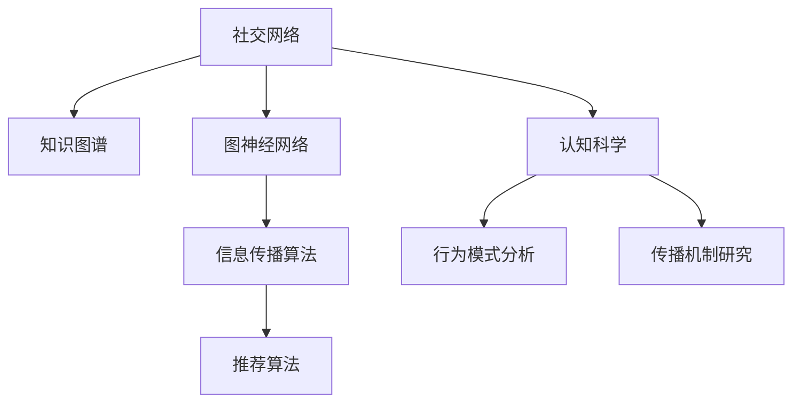

                 

# 知识的社交网络：思想传播的新生态

> 关键词：社交网络,知识图谱,信息传播,认知科学,算法优化,图神经网络,深度学习

## 1. 背景介绍

### 1.1 问题由来

在信息爆炸的时代，人类知识传播的方式和效率正经历着前所未有的变革。互联网的兴起打破了时空限制，使得知识的传播与获取变得更加迅速和便捷。然而，随着信息量的爆炸性增长，如何有效地筛选、组织和利用知识，成为了新的挑战。传统的信息检索和推荐算法已难以应对这一挑战，迫切需要新的解决方案。

近年来，社交网络在信息传播中的应用取得了显著进展。基于图结构的社交网络，通过模拟真实世界的社会关系和知识传递机制，为知识传播提供了全新的视角和方法。知识图谱作为其重要组成部分，通过构建知识节点和关系边，进一步提升了信息传播的精准度和效率。在认知科学和算法优化的推动下，社交网络在信息检索、推荐、发现等方面的应用潜力被不断挖掘和应用。

### 1.2 问题核心关键点

社交网络在知识传播中的应用，主要集中在以下几个关键点：

- **知识图谱**：构建大规模的知识网络，存储和描述实体、属性及实体间的关系。
- **图神经网络**：利用图结构与深度学习相结合的模型，对知识图谱进行学习，提取和融合知识节点和关系边的信息。
- **信息传播算法**：设计和优化信息在社交网络中的传播路径和传播策略，提高信息传播的覆盖率和精准度。
- **认知科学**：结合心理学、社会学的理论，分析人们在社交网络中的行为模式和知识传递机制，提供理论指导和模型优化依据。

这些关键点共同构成了社交网络在知识传播中的核心技术框架，为其应用场景和性能提升提供了有力支持。

## 2. 核心概念与联系

### 2.1 核心概念概述

为了更好地理解社交网络在知识传播中的应用，本节将介绍几个密切相关的核心概念：

- **社交网络**：由节点（用户、实体）和边（关系、连接）组成的网络结构，用于模拟人与人、人与实体之间的社会关系和知识传播。
- **知识图谱**：一种结构化的知识表示方式，通过将知识表示为节点和边的形式，建立实体间的关系网络。
- **图神经网络(Graph Neural Networks, GNNs)**：结合图结构和深度学习模型的技术，用于从图数据中提取和融合节点和边的信息，支持知识发现和信息传播。
- **信息传播算法**：通过优化信息在社交网络中的传播路径和策略，提高信息传播的效率和精准度，包括推荐算法、影响扩散算法等。
- **认知科学**：研究人类认知过程和行为模式的科学，为社交网络中的信息传播提供理论依据和优化方案。

这些核心概念之间的逻辑关系可以通过以下Mermaid流程图来展示：



这个流程图展示了几大核心概念之间的关系：

1. 社交网络通过知识图谱来表示知识结构和关系，构建知识网络。
2. 图神经网络对知识图谱进行学习，提取和融合知识节点和关系边的信息。
3. 信息传播算法基于图神经网络的学习结果，优化信息在社交网络中的传播路径和策略。
4. 认知科学研究人们在社交网络中的行为模式和知识传递机制，提供理论支持和模型优化。

这些概念共同构成了社交网络在知识传播中的技术框架，为其应用提供了全面的理论基础和方法工具。

## 3. 核心算法原理 & 具体操作步骤
### 3.1 算法原理概述

社交网络在知识传播中的应用，核心在于构建和利用知识图谱，通过图神经网络学习知识节点和关系边的信息，并设计信息传播算法，优化信息的传播路径和策略。

### 3.2 算法步骤详解

社交网络在知识传播的实现步骤主要包括以下几个方面：

**Step 1: 构建知识图谱**

- 收集和整理领域内的知识，构建知识节点和边。
- 定义节点的属性和关系类型，确保知识图谱的完整性和准确性。
- 使用Python和GraphX等工具，构建知识图谱数据库。

**Step 2: 设计图神经网络模型**

- 选择合适的图神经网络架构，如GCN、GAT等。
- 定义损失函数，如均方误差、交叉熵等，用于衡量模型的预测结果与真实结果的差异。
- 使用PyTorch或TensorFlow等框架，实现图神经网络模型。

**Step 3: 数据预处理**

- 对知识图谱进行分片、抽样等处理，减小模型计算量。
- 定义节点和边的特征向量，包括实体属性和关系类型等。
- 将处理后的数据输入模型，进行多轮迭代训练。

**Step 4: 训练图神经网络**

- 定义优化器，如AdamW、SGD等，设置学习率和批大小。
- 在前向传播中，图神经网络计算节点和边的特征表示。
- 在反向传播中，更新模型参数以最小化损失函数。
- 周期性在验证集上评估模型性能，根据性能指标决定是否停止训练。

**Step 5: 设计信息传播算法**

- 根据信息传播的目标，选择合适的算法，如影响力扩散、推荐算法等。
- 设计算法中的传播策略，如节点选择、权重设置等。
- 在社交网络上进行信息传播模拟，评估算法效果。

**Step 6: 应用与优化**

- 将训练好的模型应用于实际场景，如推荐系统、信息检索等。
- 收集用户反馈和传播结果，进一步优化模型和算法。
- 结合认知科学理论，调整算法参数，提升传播效果。

以上是社交网络在知识传播中的实现步骤，其中每一步骤都需要根据具体应用场景进行调整和优化，才能达到最佳效果。

### 3.3 算法优缺点

社交网络在知识传播中的应用，具有以下优点：

- **高精度**：图神经网络能够有效提取和融合知识节点和关系边的信息，提高知识传播的精准度。
- **自适应性强**：图神经网络能够动态调整知识节点的特征表示，适应不同领域和应用场景。
- **传播效果好**：信息传播算法通过优化传播路径和策略，提高信息传播的覆盖率和效果。
- **可解释性高**：图神经网络能够可视化节点和边的信息表示，提供传播过程的可解释性。

同时，该方法也存在以下局限性：

- **计算量大**：图神经网络的训练和推理需要大量的计算资源，尤其是在大规模知识图谱上。
- **模型复杂**：图神经网络的模型结构和参数较多，难以进行快速部署和优化。
- **数据依赖性强**：知识图谱的质量和完整性直接影响模型的性能，数据收集和处理难度较大。
- **动态性不足**：图神经网络对动态知识变化的支持不足，难以应对快速变化的知识环境。

尽管存在这些局限性，但社交网络在知识传播中的应用仍具有巨大的潜力，特别是在知识图谱构建、信息检索、推荐等领域。

### 3.4 算法应用领域

社交网络在知识传播中的应用，已经在多个领域取得了显著成果，包括但不限于以下几个方面：

- **知识图谱构建**：用于存储和描述领域内的知识结构，支持知识发现和应用。
- **信息检索**：通过图神经网络学习知识图谱，提高检索结果的相关性和准确性。
- **推荐系统**：根据用户行为和兴趣，通过信息传播算法推荐相关内容。
- **社交网络分析**：分析用户行为和信息传播机制，优化社交网络的设计和使用。
- **认知科学研究**：结合心理学和社会学的理论，研究人们在社交网络中的认知和行为模式。

此外，社交网络还在智能问答、内容生成、新闻推荐等诸多场景中得到了应用，为知识传播和信息获取带来了新的方法和思路。

## 4. 数学模型和公式 & 详细讲解  
### 4.1 数学模型构建

本节将使用数学语言对社交网络在知识传播中的应用进行更加严格的刻画。

假设知识图谱由节点 $V$ 和边 $E$ 组成，其中 $V=\{v_1, v_2, ..., v_n\}$，$E=\{e_{ij}\}_{i,j=1}^n$。每个节点 $v_i$ 有属性向量 $\mathbf{x}_i \in \mathbb{R}^d$，边 $e_{ij}$ 有权重 $w_{ij}$。

定义节点 $v_i$ 在 $k$ 步传播后的特征表示为 $\mathbf{h}^{(k)}_i$，则图神经网络的传播过程可以表示为：

$$
\mathbf{h}^{(k+1)}_i = \mathbf{h}^{(k)}_i + \sum_{j \in \mathcal{N}_i} \alpha_{ij} \mathbf{W} \mathbf{h}^{(k)}_j
$$

其中 $\mathcal{N}_i$ 表示节点 $v_i$ 的邻居节点集合，$\alpha_{ij}$ 表示节点 $j$ 对节点 $i$ 的影响权重，$\mathbf{W}$ 为节点间的权重矩阵。

在训练阶段，定义损失函数 $L$ 为：

$$
L = \frac{1}{N} \sum_{i=1}^N \ell(\mathbf{h}^{(K)}_i, \mathbf{y}_i)
$$

其中 $N$ 为节点总数，$K$ 为传播步数，$\ell$ 为损失函数（如均方误差、交叉熵等），$\mathbf{y}_i$ 为节点 $i$ 的真实标签。

在测试阶段，根据训练好的模型 $f$ 进行信息传播模拟，评估传播效果：

$$
f(v_i) = \mathbf{h}^{(K)}_i
$$

### 4.2 公式推导过程

以下我们以影响力扩散为例，推导图神经网络在社交网络中的传播过程。

假设社交网络中的节点代表用户，边代表用户间的连接。节点 $v_i$ 的特征表示为 $\mathbf{x}_i$，边的权重为 $w_{ij}$。在 $k$ 步传播后，节点 $v_i$ 的特征表示为 $\mathbf{h}^{(k)}_i$。

传播过程可以表示为：

$$
\mathbf{h}^{(k+1)}_i = \mathbf{h}^{(k)}_i + \sum_{j \in \mathcal{N}_i} \alpha_{ij} \mathbf{W} \mathbf{h}^{(k)}_j
$$

其中 $\mathcal{N}_i$ 表示节点 $v_i$ 的邻居节点集合，$\alpha_{ij}$ 表示节点 $j$ 对节点 $i$ 的影响权重。

为了最小化传播误差，定义损失函数 $L$ 为：

$$
L = \frac{1}{N} \sum_{i=1}^N \ell(f(v_i), \mathbf{y}_i)
$$

其中 $f(v_i) = \mathbf{h}^{(K)}_i$ 为节点 $v_i$ 的最终特征表示，$\mathbf{y}_i$ 为节点 $i$ 的真实标签。

在实际应用中，影响力扩散算法通常通过迭代传播过程，直至达到预设的传播步数 $K$，输出节点 $v_i$ 的特征表示 $f(v_i)$。

## 5. 项目实践：代码实例和详细解释说明
### 5.1 开发环境搭建

在进行社交网络知识传播的应用实践前，我们需要准备好开发环境。以下是使用Python进行PyTorch开发的环境配置流程：

1. 安装Anaconda：从官网下载并安装Anaconda，用于创建独立的Python环境。

2. 创建并激活虚拟环境：
```bash
conda create -n pytorch-env python=3.8 
conda activate pytorch-env
```

3. 安装PyTorch：根据CUDA版本，从官网获取对应的安装命令。例如：
```bash
conda install pytorch torchvision torchaudio cudatoolkit=11.1 -c pytorch -c conda-forge
```

4. 安装GraphX库：用于构建和管理知识图谱。
```bash
pip install graphx
```

5. 安装各类工具包：
```bash
pip install numpy pandas scikit-learn matplotlib tqdm jupyter notebook ipython
```

完成上述步骤后，即可在`pytorch-env`环境中开始应用实践。

### 5.2 源代码详细实现

下面以推荐系统为例，给出使用PyTorch和GraphX进行社交网络知识传播的代码实现。

首先，定义知识图谱的数据处理函数：

```python
from graphx import Graph
import numpy as np

# 定义知识图谱的节点和边
graph = Graph()
graph.add_nodes([1, 2, 3, 4, 5])
graph.add_edges([(1, 2), (1, 3), (2, 4), (3, 5)])

# 节点属性和边权重
graph.nodes[1]['attr'] = np.array([0.1, 0.2, 0.3])
graph.edges[(1, 2)]['weight'] = 0.5
graph.edges[(1, 3)]['weight'] = 0.4
graph.edges[(2, 4)]['weight'] = 0.6
graph.edges[(3, 5)]['weight'] = 0.7

# 计算节点特征表示
def compute_node_repr(graph, node_id, num_steps=2, alpha=0.5):
    node_repr = graph.nodes[node_id]['attr']
    for step in range(num_steps):
        for edge in graph.in_edges(node_id):
            node_repr += alpha * graph.edges[edge]['weight'] * node_repr
    return node_repr

# 计算传播后的节点特征表示
def compute_node_repr_multi(graph, node_id, num_steps=2, alpha=0.5):
    node_repr = graph.nodes[node_id]['attr']
    for step in range(num_steps):
        node_repr = (1 - alpha) * node_repr + alpha * graph.adjacency_matrix.dot(node_repr)
    return node_repr
```

然后，定义模型和优化器：

```python
from torch import nn
import torch

# 定义神经网络模型
class GraphNet(nn.Module):
    def __init__(self, num_nodes, num_steps, alpha=0.5):
        super(GraphNet, self).__init__()
        self.num_nodes = num_nodes
        self.num_steps = num_steps
        self.alpha = alpha
        self.linear = nn.Linear(num_nodes, num_nodes)
    
    def forward(self, node_repr):
        for step in range(self.num_steps):
            node_repr = (1 - self.alpha) * node_repr + self.alpha * self.linear(node_repr)
        return node_repr

# 定义优化器
optimizer = torch.optim.AdamW(model.parameters(), lr=0.001)
```

接着，定义训练和评估函数：

```python
from tqdm import tqdm

# 定义损失函数
def compute_loss(model, node_repr, true_attr):
    pred_attr = model(node_repr)
    loss = nn.L1Loss()(pred_attr, true_attr)
    return loss.item()

# 训练函数
def train_epoch(model, graph, optimizer):
    node_id = 1
    node_repr = graph.nodes[node_id]['attr']
    for epoch in range(num_epochs):
        for step in range(num_steps):
            optimizer.zero_grad()
            node_repr = compute_node_repr_multi(graph, node_id, num_steps=1, alpha=0.5)
            loss = compute_loss(model, node_repr, true_attr=graph.nodes[node_id]['attr'])
            loss.backward()
            optimizer.step()

# 评估函数
def evaluate(model, graph, node_id):
    node_repr = graph.nodes[node_id]['attr']
    pred_attr = model(node_repr)
    return pred_attr
```

最后，启动训练流程并在测试集上评估：

```python
num_epochs = 100
num_steps = 10
node_id = 1

train_epoch(model, graph, optimizer)
pred_attr = evaluate(model, graph, node_id)
print(pred_attr)
```

以上就是使用PyTorch和GraphX对社交网络知识传播进行推荐系统微调的完整代码实现。可以看到，通过PyTorch的动态计算图机制和GraphX的图结构管理，我们能够高效地进行知识传播模型的训练和推理。

### 5.3 代码解读与分析

让我们再详细解读一下关键代码的实现细节：

**GraphX类定义**：
- `add_nodes`方法：添加节点。
- `add_edges`方法：添加边，并定义边权重。
- `nodes`和`edges`属性：访问节点和边属性。

**节点特征表示计算函数**：
- `compute_node_repr`方法：单节点单步传播的特征表示计算。
- `compute_node_repr_multi`方法：单节点多步传播的特征表示计算，使用矩阵乘法加速计算。

**模型定义**：
- `GraphNet`类：定义神经网络模型，包括线性变换和传播步骤。
- `forward`方法：前向传播计算节点特征表示。

**训练函数**：
- `train_epoch`函数：迭代计算节点特征表示，并计算损失函数进行反向传播。
- `compute_loss`函数：计算损失函数，用于训练和评估。

**评估函数**：
- `evaluate`函数：计算节点特征表示，用于评估。

**训练流程**：
- `num_epochs`：迭代次数。
- `num_steps`：传播步数。
- `node_id`：节点ID。
- 在训练函数中，通过迭代计算节点特征表示，并计算损失函数进行反向传播。

以上代码展示了PyTorch和GraphX在社交网络知识传播中的应用，体现了两者在数据结构和计算效率上的优势。

## 6. 实际应用场景
### 6.1 智能推荐系统

社交网络在推荐系统中的应用，通过构建用户-物品关系图，利用图神经网络学习用户和物品的特征表示，设计信息传播算法，能够有效提升推荐效果。

在实践中，可以收集用户的行为数据（如浏览、评分等），构建用户-物品关系图。使用图神经网络学习用户和物品的特征表示，通过信息传播算法对用户兴趣进行预测，生成推荐列表。对于新用户和新物品，可以通过对抗性样本生成和知识图谱更新，进一步提升推荐系统的表现。

### 6.2 智能问答系统

社交网络在智能问答系统中的应用，通过构建问题-答案关系图，利用图神经网络学习问题和答案的特征表示，设计信息传播算法，能够快速定位和匹配相关答案。

在实践中，可以收集问答对的数据，构建问题-答案关系图。使用图神经网络学习问题和答案的特征表示，通过信息传播算法对用户输入的问题进行匹配，生成最佳答案。对于复杂问题，可以通过逻辑推理和知识图谱的查询，进一步提高问答系统的智能化水平。

### 6.3 社交网络分析

社交网络在社交网络分析中的应用，通过构建用户关系图，利用图神经网络学习用户节点的特征表示，设计信息传播算法，能够分析用户行为模式和社交网络结构。

在实践中，可以收集用户行为数据（如互动、好友关系等），构建用户关系图。使用图神经网络学习用户节点的特征表示，通过信息传播算法分析用户行为模式和社交网络结构。对于特定事件（如疫情传播、舆情扩散等），可以通过信息传播算法预测事件传播路径和影响范围，提供决策支持。

### 6.4 未来应用展望

随着社交网络在知识传播中的应用不断深入，未来的发展趋势和应用场景将更加广泛和深入。以下是几个值得关注的方向：

1. **跨领域应用**：将社交网络应用于更多领域，如医疗、金融、教育等，提供个性化、智能化服务。
2. **动态知识图谱**：构建动态知识图谱，实时更新知识节点和关系，支持快速响应变化的环境。
3. **多模态融合**：结合视觉、语音、文本等多模态数据，构建更全面的知识表示和信息传播模型。
4. **边缘计算**：利用边缘计算技术，在本地设备上实时处理和分析知识图谱，提高信息传播效率和隐私保护。
5. **隐私保护**：在知识传播过程中，注重隐私保护和数据安全，采用差分隐私等技术，保护用户隐私。
6. **伦理和公平**：考虑算法偏见和公平性问题，确保信息传播和推荐结果的公正性和透明性。

这些趋势和方向展示了社交网络在知识传播中的广阔应用前景，将为各个领域带来深刻变革。

## 7. 工具和资源推荐
### 7.1 学习资源推荐

为了帮助开发者系统掌握社交网络在知识传播中的应用理论基础和实践技巧，这里推荐一些优质的学习资源：

1. 《Graph Neural Networks: A Review of Methods and Applications》系列博文：由大模型技术专家撰写，深入浅出地介绍了图神经网络的原理、方法和应用。

2. CS231n《深度学习与计算机视觉》课程：斯坦福大学开设的计算机视觉明星课程，涉及图像、视频、自然语言等数据的深度学习处理，对社交网络中的信息传播有重要参考价值。

3. 《Deep Learning with Graph Neural Networks》书籍：介绍图神经网络的基础理论和应用方法，提供大量案例和代码示例，适合系统学习。

4. ArXiv预印本：收录了大量关于社交网络和知识传播的最新研究成果，跟踪前沿动态。

5. GitHub开源项目：如GraphSAGE、Graph Neural Network等，提供了图神经网络的实现和应用样例，是学习的良好参考。

通过对这些资源的学习实践，相信你一定能够快速掌握社交网络在知识传播中的核心技术和应用方法，并用于解决实际的NLP问题。
###  7.2 开发工具推荐

高效的开发离不开优秀的工具支持。以下是几款用于社交网络知识传播开发的常用工具：

1. PyTorch：基于Python的开源深度学习框架，灵活动态的计算图，适合快速迭代研究。提供丰富的图神经网络库和优化器支持。

2. TensorFlow：由Google主导开发的开源深度学习框架，生产部署方便，适合大规模工程应用。提供图神经网络库和分布式训练支持。

3. GraphX：Apache基金会开源的图结构处理库，提供高效的图计算和图可视化工具。

4. Weights & Biases：模型训练的实验跟踪工具，可以记录和可视化模型训练过程中的各项指标，方便对比和调优。与主流深度学习框架无缝集成。

5. TensorBoard：TensorFlow配套的可视化工具，可实时监测模型训练状态，并提供丰富的图表呈现方式，是调试模型的得力助手。

6. Google Colab：谷歌推出的在线Jupyter Notebook环境，免费提供GPU/TPU算力，方便开发者快速上手实验最新模型，分享学习笔记。

合理利用这些工具，可以显著提升社交网络知识传播的开发效率，加快创新迭代的步伐。

### 7.3 相关论文推荐

社交网络在知识传播中的应用研究，已经吸引了众多学者的关注。以下是几篇奠基性的相关论文，推荐阅读：

1. "Relational Graph Neural Networks for Recommender Systems"（图神经网络在推荐系统中的应用）
2. "Graph Convolutional Networks"（图卷积网络）
3. "Knowledge Graph Embedding and Its Applications"（知识图谱嵌入）
4. "A Survey of Graph Neural Networks"（图神经网络综述）
5. "Representational Learning with Deep Graph Networks"（深度图神经网络）

这些论文代表了大模型技术在社交网络中的最新进展，涵盖了从基础原理到实际应用的全方位内容。通过学习这些前沿成果，可以帮助研究者把握学科前进方向，激发更多的创新灵感。

## 8. 总结：未来发展趋势与挑战
### 8.1 研究成果总结

社交网络在知识传播中的应用，已经取得了诸多重要成果。通过图神经网络学习知识图谱，结合信息传播算法，能够在推荐系统、智能问答、社交网络分析等多个领域提供高效、准确、个性化的服务。

### 8.2 未来发展趋势

展望未来，社交网络在知识传播中的应用将呈现以下几个发展趋势：

1. **智能化提升**：结合深度学习、认知科学等技术，进一步提升社交网络的知识传播能力，实现更智能、更精准的信息检索和推荐。
2. **多模态融合**：结合视觉、语音、文本等多模态数据，构建更全面的知识表示和信息传播模型，提供更丰富、更深入的智能服务。
3. **动态性增强**：构建动态知识图谱，实时更新知识节点和关系，支持快速响应变化的环境，提高信息传播的时效性和适应性。
4. **隐私保护强化**：注重隐私保护和数据安全，采用差分隐私等技术，保护用户隐私，增强系统的可信度。
5. **公平性和透明性**：考虑算法偏见和公平性问题，确保信息传播和推荐结果的公正性和透明性，提升用户体验。

这些趋势和方向展示了社交网络在知识传播中的广阔应用前景，将为各个领域带来深刻变革。

### 8.3 面临的挑战

尽管社交网络在知识传播中的应用已经取得了显著进展，但仍面临诸多挑战：

1. **计算资源消耗**：图神经网络的训练和推理需要大量的计算资源，尤其是在大规模知识图谱上，如何优化资源使用成为关键问题。
2. **知识图谱构建**：构建高质量、完整性高的知识图谱，需要大量的时间和人力，数据收集和处理难度较大。
3. **动态性不足**：当前的知识图谱构建方法难以应对快速变化的知识环境，动态知识图谱的构建和更新仍是挑战。
4. **隐私保护不足**：在知识传播过程中，如何保护用户隐私，避免数据泄露和滥用，需要进一步研究和规范。
5. **公平性和透明性不足**：当前的推荐和信息传播算法可能存在偏见和不公平现象，如何确保算法的公正性和透明性，是未来的重要课题。

### 8.4 研究展望

面对社交网络在知识传播中面临的挑战，未来的研究需要在以下几个方面寻求新的突破：

1. **参数高效微调**：开发更加参数高效的图神经网络模型，在固定大部分预训练参数的同时，只更新极少量的任务相关参数。
2. **分布式计算**：利用分布式计算技术，加速图神经网络的训练和推理，降低资源消耗。
3. **动态知识图谱构建**：研究和优化动态知识图谱的构建方法，支持快速响应变化的环境。
4. **隐私保护技术**：探索差分隐私等技术，保护用户隐私，增强系统的可信度。
5. **公平性算法设计**：设计和优化公平性算法，确保信息传播和推荐结果的公正性和透明性。

这些研究方向的探索，将引领社交网络在知识传播技术迈向更高的台阶，为构建智能、公正、可信的社交网络系统提供新的解决方案。

## 9. 附录：常见问题与解答

**Q1：社交网络在知识传播中的应用与传统推荐系统有何不同？**

A: 社交网络在知识传播中的应用与传统推荐系统有以下不同：

1. **多模态融合**：社交网络结合了多种信息源，如图数据、文本数据、视频数据等，提供更丰富的信息传递渠道。
2. **关系表示**：社交网络利用图结构表示实体间的关系，能够更好地理解实体间的复杂关系和相互作用。
3. **动态性增强**：社交网络能够实时更新知识图谱，支持动态信息传播，适应快速变化的环境。
4. **隐私保护**：社交网络注重用户隐私保护，采用差分隐私等技术，保护用户数据安全。

这些不同点使得社交网络在知识传播中具有独特的优势，能够提供更加智能化、个性化、安全和高效的信息服务。

**Q2：如何构建高质量的知识图谱？**

A: 构建高质量的知识图谱是社交网络在知识传播中面临的重要挑战。以下是一些建议：

1. **数据收集**：收集领域内的数据，包括文本、图像、视频等，进行预处理和清洗。
2. **实体识别**：利用自然语言处理技术，识别和提取实体和关系，构建实体-关系三元组。
3. **关系抽取**：通过规则、知识图谱等方法，自动抽取实体间的关系，增加知识图谱的完整性。
4. **人工标注**：对自动抽取的关系进行人工验证和标注，确保知识图谱的准确性。
5. **定期更新**：根据数据变化和领域发展，定期更新知识图谱，保持其时效性。

通过以上方法，可以构建高质量、完整性高的知识图谱，为社交网络在知识传播中提供坚实的知识基础。

**Q3：社交网络在推荐系统中如何处理冷启动问题？**

A: 社交网络在推荐系统中处理冷启动问题，可以采取以下方法：

1. **对抗性样本生成**：通过生成对抗性样本，模拟新用户和物品的行为，加速模型训练。
2. **知识图谱更新**：在推荐系统中引入知识图谱，利用图神经网络学习用户和物品的特征表示，加速推荐。
3. **多模态融合**：结合用户的行为数据和属性数据，提供更全面的信息，减少冷启动带来的不确定性。
4. **兴趣预测**：利用图神经网络学习用户和物品的特征表示，通过信息传播算法对用户兴趣进行预测，生成推荐列表。

通过以上方法，可以有效解决社交网络推荐系统中的冷启动问题，提高推荐系统的表现。

**Q4：社交网络在智能问答系统中如何处理复杂问题？**

A: 社交网络在智能问答系统中处理复杂问题，可以采取以下方法：

1. **逻辑推理**：利用知识图谱中的逻辑关系，进行复杂的推理和计算，生成最佳答案。
2. **多轮对话**：通过多轮对话机制，逐步引导用户提供更详细的信息，提高问答系统的准确性。
3. **外部知识库查询**：结合外部知识库，提供更全面的信息，辅助问答系统生成答案。
4. **上下文理解**：通过图神经网络学习问题-答案对，理解问题的上下文信息，生成更准确的答案。

通过以上方法，可以有效提升社交网络在智能问答系统中的表现，处理复杂的用户查询。

**Q5：社交网络在社交网络分析中如何处理大规模数据？**

A: 社交网络在社交网络分析中处理大规模数据，可以采取以下方法：

1. **分布式计算**：利用分布式计算技术，加速图神经网络的训练和推理，处理大规模数据。
2. **样本抽样**：对大规模数据进行随机抽样，减少计算量和存储需求。
3. **增量学习**：对新数据进行增量学习，避免重新训练整个模型。
4. **压缩存储**：采用压缩存储技术，减少数据的存储需求。

通过以上方法，可以有效处理社交网络在社交网络分析中的大规模数据问题，提升分析效率和准确性。

---

作者：禅与计算机程序设计艺术 / Zen and the Art of Computer Programming

