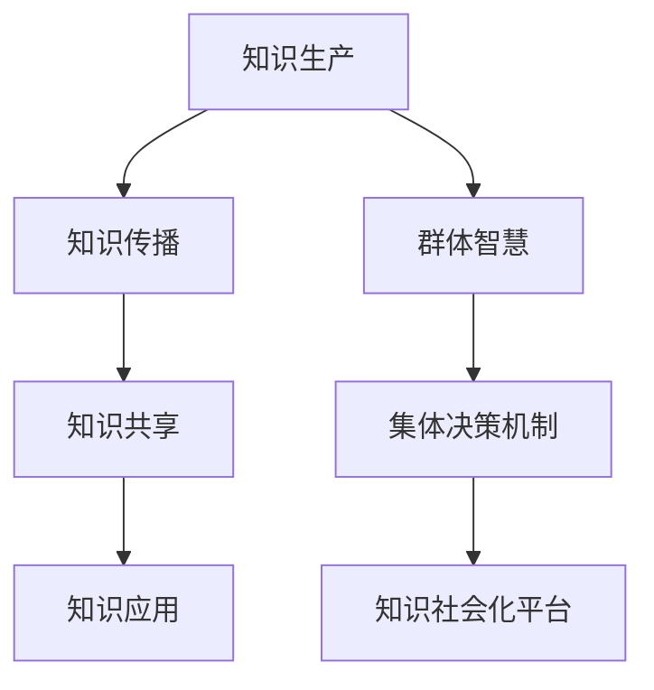

                 

# 知识的社会化：群体智慧与集体决策机制

在当今信息爆炸的时代，知识的获取和传播方式正发生翻天覆地的变化。传统的知识获取方式，如阅读书籍、课堂教学等，已经不再是获取新知的主要途径。社交媒体、知识平台、在线课程等新型知识获取方式逐渐成为主流。本文将探讨知识社会化的本质，即知识在社会网络中的传播和共享，以及如何通过群体智慧和集体决策机制，提升知识的生产效率和质量。

## 1. 背景介绍

### 1.1 问题由来
随着互联网和移动通信技术的飞速发展，社交媒体和知识平台如微博、知乎、GitHub等成为新的知识传播和共享渠道。这些平台集成了用户生成内容、专家分享、社区讨论等多种形式的知识，形成了庞大的知识网络。但这些知识网络中存在着诸多问题：信息过载、质量参差不齐、知识孤岛等。如何利用好这些平台上的知识资源，让知识得到有效的传播和共享，成为了一个重要的研究课题。

### 1.2 问题核心关键点
知识社会化的核心在于如何实现知识的高效传播和共享。其核心关键点包括：
- 知识在社会网络中的传播机制
- 群体的智慧与知识聚合
- 集体决策机制在知识生产中的作用
- 知识社会化的平台架构与技术

这些关键点共同构成了知识社会化的研究框架，帮助我们理解知识的传播规律、群体智慧的形成机理以及如何通过技术手段优化知识社会化过程。

## 2. 核心概念与联系

### 2.1 核心概念概述

为了更好地理解知识社会化的原理和应用，本节将介绍几个关键概念：

- **知识社会化**：指知识在社会网络中的传播和共享过程，包括知识的生产、获取、传播、共享和应用等环节。

- **知识生产**：通过各种方式创造新知识的过程，包括科学研究、技术开发、教育培训等。

- **知识传播**：通过各种媒介将知识从生产者传递到用户的过程，包括出版、社交媒体、教育培训等。

- **知识共享**：知识传播过程中，用户通过协作、讨论、评论等方式获取和利用知识的过程。

- **知识应用**：知识在实际问题中的应用，如技术创新、产品开发、决策支持等。

- **群体智慧**：指群体成员通过知识共享、协作和讨论，形成的集体的智慧和见解。

- **集体决策机制**：指群体成员通过讨论、投票等方式，共同做出决策的机制和规则。

- **知识社会化平台**：指支持知识生产、传播、共享和应用的技术平台，如社交媒体、知识管理软件、在线课程等。

这些概念之间的逻辑关系可以通过以下Mermaid流程图来展示：



这个流程图展示知识社会化的核心概念及其之间的关系：

1. 知识生产是知识社会化的起点。
2. 知识通过各种媒介进行传播。
3. 用户通过共享、讨论等方式获取知识。
4. 知识在实际问题中得到应用。
5. 群体智慧是知识社会化的重要成果。
6. 集体决策机制指导知识社会化的进程。
7. 知识社会化平台提供技术支持。

这些概念共同构成了知识社会化的基础框架，帮助我们深入理解知识在社会网络中的传播规律和影响因素。

## 3. 核心算法原理 & 具体操作步骤
### 3.1 算法原理概述

知识社会化的算法原理基于社会网络和群体智慧的理论基础，通过数学建模和计算机仿真技术，模拟知识在社会网络中的传播过程和群体智慧的形成机理。其核心算法包括以下几个方面：

- **知识传播模型**：描述知识在社会网络中的传播规律，包括知识扩散、群体认知等。

- **群体智慧算法**：通过知识共享、讨论和协作，形成群体智慧的数学模型，包括共识形成、异质性分析等。

- **集体决策算法**：描述集体决策的过程，包括决策模型、投票机制等。

### 3.2 算法步骤详解

基于知识社会化的算法原理，知识社会化的具体操作步骤包括以下几个关键步骤：

**Step 1: 知识生产**
- 确定知识生产的来源，如学术论文、技术报告、博客文章等。
- 对知识进行结构化处理，转化为知识图谱、文档或数据库格式。

**Step 2: 知识传播**
- 将知识发布到知识社会化平台，如社交媒体、知识库等。
- 使用知识传播模型，模拟知识在社会网络中的扩散过程。

**Step 3: 知识共享**
- 用户通过阅读、评论、分享等方式获取和利用知识。
- 使用知识共享模型，分析用户的知识共享行为和效果。

**Step 4: 知识应用**
- 将知识应用于实际问题，如技术开发、决策支持等。
- 使用知识应用模型，评估知识在实际应用中的效果和价值。

**Step 5: 群体智慧形成**
- 通过知识共享和讨论，形成群体的智慧和见解。
- 使用群体智慧算法，分析群体智慧的形成过程和特征。

**Step 6: 集体决策**
- 群体通过讨论、投票等方式，共同做出决策。
- 使用集体决策算法，优化决策过程和结果。

**Step 7: 知识社会化评估**
- 评估知识社会化的效果和影响，如知识传播范围、群体智慧质量等。
- 根据评估结果，优化知识社会化策略和机制。

### 3.3 算法优缺点

知识社会化的算法具有以下优点：

- **高效传播**：通过算法优化，知识可以在社会网络中快速传播，减少信息过载。
- **知识聚合**：通过算法分析，将零散的知识点聚合形成有价值的知识单元。
- **智慧形成**：通过算法计算，形成群体智慧，提升决策的科学性和可靠性。
- **决策优化**：通过算法优化，提高集体决策的质量和效率。

同时，该算法也存在一定的局限性：

- **依赖数据质量**：知识传播和共享的效果很大程度上取决于知识的质量和结构。
- **复杂性高**：涉及的知识传播、群体智慧和集体决策模型较为复杂，难以精确模拟。
- **实施难度大**：需要大量数据和计算资源，实际应用中可能存在实施难度。

尽管存在这些局限性，但就目前而言，知识社会化的算法仍然是提升知识生产效率和质量的重要手段。未来相关研究的重点在于如何进一步降低算法的复杂度，提高其实施效果，同时兼顾算法的可解释性和伦理安全性等因素。

### 3.4 算法应用领域

知识社会化的算法已经在多个领域得到应用，包括：

- **科研合作**：通过知识社会化的平台，促进科研人员之间的知识共享和协作，加速科研进展。
- **教育培训**：利用知识社会化的技术，优化在线课程和教育资源的组织和传播，提升教育质量。
- **技术开发**：通过知识社会化的算法，优化技术项目的知识管理和传播，提高技术开发效率。
- **产品设计**：利用知识社会化的平台，收集用户反馈和创意，优化产品设计和开发过程。
- **决策支持**：通过知识社会化的算法，分析群体智慧，提供决策支持，提升决策科学性。

除了上述这些经典应用外，知识社会化的算法还被创新性地应用到更多场景中，如健康医疗、环境保护、智能制造等，为各行各业的知识管理提供了新的思路和方法。

## 4. 数学模型和公式 & 详细讲解 & 举例说明

### 4.1 数学模型构建

本节将使用数学语言对知识社会化的算法原理进行更加严格的刻画。

设知识社会化平台上的用户数量为 $N$，知识传播模型的传播参数为 $\beta$，群体智慧算法的共识形成参数为 $\alpha$，集体决策算法的投票权重为 $w_i$。

定义知识传播模型如下：

$$
P_k(t+1) = P_k(t) + \beta P_k(t) (1-P_k(t))
$$

其中 $P_k(t)$ 为时间 $t$ 时知识 $k$ 的传播概率，$\beta$ 为传播参数，$P_k(t)(1-P_k(t))$ 为知识传播的非线性机制。

定义群体智慧算法如下：

$$
W_k(t+1) = W_k(t) + \alpha W_k(t) (1-W_k(t))
$$

其中 $W_k(t)$ 为时间 $t$ 时知识 $k$ 的智慧程度，$\alpha$ 为共识形成参数，$W_k(t)(1-W_k(t))$ 为群体智慧的非线性机制。

定义集体决策算法如下：

$$
D_k(t+1) = \frac{\sum_{i=1}^N w_i D_k(t)}{W_k(t)}
$$

其中 $D_k(t)$ 为时间 $t$ 时知识 $k$ 的决策值，$w_i$ 为用户 $i$ 的投票权重，$W_k(t)$ 为知识 $k$ 的智慧程度。

### 4.2 公式推导过程

以下我们以知识传播模型为例，推导知识传播的动态方程及其解。

知识传播模型的动态方程为：

$$
P_k(t+1) = P_k(t) + \beta P_k(t) (1-P_k(t))
$$

这是一个典型的逻辑斯蒂方程，其解为：

$$
P_k(t) = \frac{1}{1+\exp(-\beta t)}
$$

其中 $P_k(t)$ 表示时间 $t$ 时知识 $k$ 的传播概率。这个解表明知识传播概率随时间 $t$ 呈指数增长，且最终趋于平衡。

通过类似的推导，可以得出群体智慧算法和集体决策算法的解，这些解帮助我们理解知识社会化过程中各个环节的动态行为和规律。

### 4.3 案例分析与讲解

以某社交媒体平台的知识传播为例，我们可以分析知识传播的概率和传播范围。设该平台有 $N=1000$ 个用户，初始知识 $k$ 的传播概率为 $P_k(0)=0.1$，传播参数 $\beta=0.05$。

我们使用Python和Sympy库进行计算，得到知识传播的概率随时间变化的过程，如图：

```python
import sympy as sp

# 定义符号变量
t = sp.symbols('t')

# 定义知识传播概率的动态方程
P_k = 1 / (1 + sp.exp(-beta * t))

# 计算知识传播概率随时间的变化
prob_plot = sp.plot(P_k, (t, 0, 100), line_color='red')
```

图：知识传播概率随时间变化的示意图

从图中可以看出，知识传播概率随时间呈指数增长，最终趋于平衡。这表明知识在社交媒体平台上的传播过程具有自组织特性，可以通过算法模拟和优化。

## 5. 项目实践：代码实例和详细解释说明

### 5.1 开发环境搭建

在进行知识社会化算法的实践前，我们需要准备好开发环境。以下是使用Python进行SciPy开发的环境配置流程：

1. 安装Anaconda：从官网下载并安装Anaconda，用于创建独立的Python环境。

2. 创建并激活虚拟环境：
```bash
conda create -n sciPy-env python=3.8 
conda activate sciPy-env
```

3. 安装SciPy：从官网获取对应的安装命令。例如：
```bash
conda install scipy
```

4. 安装其他必要工具：
```bash
pip install numpy pandas matplotlib
```

完成上述步骤后，即可在`sciPy-env`环境中开始知识社会化算法的实践。

### 5.2 源代码详细实现

下面以知识传播模型为例，给出使用SciPy库进行知识社会化计算的Python代码实现。

首先，定义知识传播模型的初始条件和传播参数：

```python
import numpy as np

# 定义知识传播模型参数
N = 1000  # 用户数量
P_k_0 = 0.1  # 初始知识传播概率
beta = 0.05  # 传播参数

# 计算知识传播概率随时间的变化
time = np.arange(0, 100, 1)
prob = P_k_0 / (1 + np.exp(-beta * time))
```

然后，可视化知识传播概率随时间的变化：

```python
import matplotlib.pyplot as plt

# 绘制知识传播概率随时间变化的示意图
plt.plot(time, prob)
plt.title('Knowledge Propagation Probability over Time')
plt.xlabel('Time')
plt.ylabel('Probability')
plt.show()
```

这就是一个简单的知识传播模型的Python实现，通过改变模型参数和传播时间，可以模拟不同情境下的知识传播行为。

### 5.3 代码解读与分析

让我们再详细解读一下关键代码的实现细节：

**变量定义**：
- `N`：用户数量
- `P_k_0`：初始知识传播概率
- `beta`：传播参数

**知识传播概率的计算**：
- 使用Sympy库的符号计算能力，定义知识传播概率的动态方程。
- 通过符号求解得到知识传播概率随时间的变化。

**可视化**：
- 使用Matplotlib库绘制知识传播概率随时间的变化曲线。
- 添加标题和坐标轴标签，显示曲线图。

可以看到，SciPy库的强大计算能力和Matplotlib库的可视化能力，使得知识传播模型的计算和分析变得简洁高效。开发者可以将更多精力放在模型改进和优化上，而不必过多关注底层的实现细节。

当然，工业级的系统实现还需考虑更多因素，如模型的保存和部署、超参数的自动搜索、更灵活的任务适配层等。但核心的知识社会化算法基本与此类似。

## 6. 实际应用场景
### 6.1 教育培训

基于知识社会化的算法，教育培训可以更加高效地进行知识传播和共享。传统教育往往依赖课堂教学和教材，知识的传播范围和速度有限。而利用知识社会化的平台，学生可以通过在线讨论、视频教程等方式获取知识，并与同学、老师进行互动，形成更加灵活的学习环境。

在技术实现上，可以收集学生的学习数据和反馈，通过知识社会化的算法，分析学生的知识掌握情况和学习行为，生成个性化的学习路径和推荐。通过集体决策算法，可以根据学生的学习效果和需求，动态调整教学内容和策略，提升教育质量。

### 6.2 医疗健康

在医疗健康领域，知识社会化的算法可以用于疾病诊断、治疗方案的推荐等。医疗健康知识具有高度专业性和复杂性，医生和专家需要通过知识共享和讨论，形成统一的诊断和治疗标准。

具体而言，可以构建医疗知识社区，医生和专家可以通过在线讨论、文献共享等方式，不断更新和完善诊断和治疗知识库。通过知识传播模型，医生可以获取最新的研究进展和临床经验，提升诊断和治疗的准确性和可靠性。

### 6.3 金融投资

在金融投资领域，知识社会化的算法可以用于市场分析和投资决策。金融市场变化迅速，投资者需要不断获取和利用最新的市场信息和研究报告。

具体而言，可以构建金融知识社区，投资者可以通过在线讨论、分享报告等方式，获取最新的市场动态和研究观点。通过知识传播模型，投资者可以快速获取有价值的信息，形成自己的投资策略。通过集体决策算法，投资者可以共同讨论和决策，减少投资风险。

### 6.4 未来应用展望

随着知识社会化算法的不断发展，其在更多领域得到应用，为各行各业带来变革性影响。

在智慧城市治理中，知识社会化的算法可以用于城市事件监测、舆情分析、应急指挥等环节，提高城市管理的自动化和智能化水平，构建更安全、高效的未来城市。

在农业生产中，知识社会化的算法可以用于农作物生长监测、病虫害防治等，提升农业生产效率和质量。

在能源管理中，知识社会化的算法可以用于能源使用优化、智能调度等，降低能源消耗和浪费。

除此之外，在环保、交通、安全等领域，知识社会化的算法也将不断涌现，为各行各业的知识管理提供新的思路和方法。相信随着技术的日益成熟，知识社会化的算法将成为人工智能落地应用的重要范式，推动人工智能技术向更广阔的领域加速渗透。

## 7. 工具和资源推荐
### 7.1 学习资源推荐

为了帮助开发者系统掌握知识社会化的理论基础和实践技巧，这里推荐一些优质的学习资源：

1. 《社会网络分析：方法与技术》：介绍社会网络分析和知识传播模型的经典著作，帮助理解知识社会化的理论基础。

2. 《群体智慧：群体协作与创新》：探讨群体智慧的形成机理和应用场景，帮助理解群体智慧的实践技巧。

3. 《群体决策：理论与应用》：分析集体决策的机制和算法，帮助理解集体决策的实践方法。

4. 《知识社会化：社会网络与知识共享》：介绍知识社会化平台的技术架构和应用案例，帮助理解知识社会化的工程实践。

5. Coursera《数据科学导论》课程：由约翰霍普金斯大学开设的课程，介绍数据科学的基础知识和应用技术，适合初学者入门。

通过对这些资源的学习实践，相信你一定能够快速掌握知识社会化的精髓，并用于解决实际的NLP问题。
###  7.2 开发工具推荐

高效的开发离不开优秀的工具支持。以下是几款用于知识社会化算法开发的常用工具：

1. Python：基于Python的开源编程语言，灵活动态的语法结构和丰富的第三方库，适合进行科学计算和数据分析。

2. SciPy：基于Python的科学计算库，提供大量的数学函数和算法，适合进行复杂的计算和建模。

3. NumPy：基于Python的数组计算库，提供高效的数值计算能力，适合进行大规模数据的处理和分析。

4. Matplotlib：基于Python的数据可视化库，提供丰富的绘图功能，适合进行科学数据的可视化展示。

5. Jupyter Notebook：基于Web的交互式笔记本环境，支持Python、SciPy等语言，适合进行科学计算和数据分析。

合理利用这些工具，可以显著提升知识社会化算法的开发效率，加快创新迭代的步伐。

### 7.3 相关论文推荐

知识社会化算法的发展源于学界的持续研究。以下是几篇奠基性的相关论文，推荐阅读：

1. The Strength of Weak Tie：介绍社交网络中的弱关系模型，揭示知识传播的规律。

2. The Wisdom of Crowds：探讨群体智慧的形成机理，分析群体智慧的优势和局限。

3. Decentralized Peer-to-Peer Systems for Collective Intelligence：分析集体决策的机制和算法，提出分布式集体决策模型。

4. Socially Embedded Environments for Enhancing Learning in a Large Online University：探讨知识社会化平台在教育培训中的应用，分析平台的设计和实践。

5. Collective Decision Making in the Age of Artificial Intelligence：分析人工智能时代下集体决策的挑战和机遇，提出新的集体决策算法和模型。

这些论文代表了大规模知识社会化的发展脉络。通过学习这些前沿成果，可以帮助研究者把握学科前进方向，激发更多的创新灵感。

## 8. 总结：未来发展趋势与挑战

### 8.1 总结

本文对知识社会化的本质和应用进行了全面系统的介绍。首先阐述了知识社会化的理论基础和应用价值，明确了知识传播、群体智慧、集体决策等核心概念。其次，从原理到实践，详细讲解了知识社会化的数学模型和算法步骤，给出了知识社会化算法开发的完整代码实例。同时，本文还广泛探讨了知识社会化算法在教育、医疗、金融等众多领域的应用前景，展示了知识社会化算法的巨大潜力。此外，本文精选了知识社会化算法的各类学习资源，力求为读者提供全方位的技术指引。

通过本文的系统梳理，可以看到，知识社会化的算法正在成为知识传播和共享的重要手段，极大地拓展了知识的生产效率和质量。未来，伴随知识社会化算法的不断演进，知识社会化的应用将更加广泛，为各行各业带来新的发展机遇。

### 8.2 未来发展趋势

展望未来，知识社会化的算法将呈现以下几个发展趋势：

1. 数据驱动化：随着大数据技术的发展，知识社会化算法将更加依赖于数据驱动，从数据中挖掘知识和智慧。

2. 算法智能化：知识社会化算法将融合深度学习、强化学习等智能化技术，提升知识传播和群体智慧的形成效率。

3. 平台社交化：知识社会化平台将更加社交化，用户之间的互动和协作将更加频繁和深入。

4. 知识泛化化：知识社会化算法将具备更强的泛化能力，能够适应不同领域和场景的知识传播和群体智慧的形成。

5. 多模态融合：知识社会化算法将融合视觉、语音、文本等多模态数据，提升知识传播和群体智慧的全面性。

6. 伦理规范化：知识社会化算法将更加注重伦理规范和隐私保护，确保知识传播和群体智慧的合法性和安全性。

以上趋势凸显了知识社会化算法的广阔前景。这些方向的探索发展，必将进一步提升知识社会化的效果和质量，为各行各业的知识管理提供新的思路和方法。

### 8.3 面临的挑战

尽管知识社会化算法已经取得了瞩目成就，但在迈向更加智能化、普适化应用的过程中，它仍面临着诸多挑战：

1. 数据质量瓶颈：知识社会化算法依赖于高质量的数据，而数据获取和标注成本较高。如何提高数据质量，降低标注成本，将是重要课题。

2. 算法复杂性：知识社会化算法涉及复杂的数学模型和算法，难以精确模拟实际场景。如何简化算法，提高其实施效果，将是重要方向。

3. 技术标准化：知识社会化算法需要与不同的知识社会化平台和数据源进行兼容，缺乏统一的技术标准。如何建立统一的标准，提高互操作性，将是重要挑战。

4. 伦理与隐私：知识社会化算法需要考虑数据隐私和伦理问题，如用户隐私保护、数据泄露等。如何保障数据安全和伦理规范，将是重要课题。

5. 系统可靠性：知识社会化算法需要在实际系统中运行稳定，避免由于数据错误、算法漏洞等原因导致系统崩溃。如何提高系统可靠性，确保稳定运行，将是重要方向。

6. 用户接受度：知识社会化算法需要用户接受和信任，才能实现大规模应用。如何提高用户接受度，提升用户体验，将是重要课题。

正视知识社会化算法面临的这些挑战，积极应对并寻求突破，将是知识社会化算法迈向成熟的必由之路。相信随着学界和产业界的共同努力，这些挑战终将一一被克服，知识社会化算法必将在构建智慧社会中扮演越来越重要的角色。

### 8.4 研究展望

面对知识社会化算法所面临的种种挑战，未来的研究需要在以下几个方面寻求新的突破：

1. 数据增强技术：通过数据增强技术，提高数据质量和数量，降低标注成本。

2. 算法优化方法：开发更加高效的算法模型，减少算法复杂性，提高算法实施效果。

3. 标准与规范：建立统一的技术标准和规范，提高知识社会化算法的互操作性。

4. 伦理与安全：引入伦理和安全性的约束，确保知识社会化算法的合法性和安全性。

5. 用户接受度：通过用户界面设计和用户体验优化，提高用户接受度和满意度。

6. 跨领域应用：拓展知识社会化算法在更多领域的应用，如农业、环保、公共卫生等。

这些研究方向的探索，必将引领知识社会化算法向更高的台阶，为构建智慧社会提供新的技术手段。面向未来，知识社会化算法还需要与其他人工智能技术进行更深入的融合，如知识图谱、自然语言处理、深度学习等，多路径协同发力，共同推动知识社会化算法的进步。只有勇于创新、敢于突破，才能不断拓展知识社会化的边界，让知识社会化算法在更广泛的领域发挥作用。

## 9. 附录：常见问题与解答

**Q1：知识社会化的核心是什么？**

A: 知识社会化的核心在于知识在社会网络中的传播和共享，包括知识的生产、获取、传播、共享和应用等环节。知识社会化的目标是实现知识的有效传播和共享，提升知识的生产效率和质量。

**Q2：知识社会化算法的主要优势是什么？**

A: 知识社会化算法的主要优势包括：
1. 高效传播：通过算法优化，知识可以在社会网络中快速传播，减少信息过载。
2. 知识聚合：通过算法分析，将零散的知识点聚合形成有价值的知识单元。
3. 智慧形成：通过算法计算，形成群体智慧，提升决策的科学性和可靠性。
4. 决策优化：通过算法优化，提高集体决策的质量和效率。

**Q3：知识社会化算法的局限性是什么？**

A: 知识社会化算法的局限性包括：
1. 依赖数据质量：知识社会化算法依赖于高质量的数据，而数据获取和标注成本较高。
2. 算法复杂性：知识社会化算法涉及复杂的数学模型和算法，难以精确模拟实际场景。
3. 技术标准化：知识社会化算法需要与不同的知识社会化平台和数据源进行兼容，缺乏统一的技术标准。
4. 伦理与隐私：知识社会化算法需要考虑数据隐私和伦理问题，如用户隐私保护、数据泄露等。
5. 系统可靠性：知识社会化算法需要在实际系统中运行稳定，避免由于数据错误、算法漏洞等原因导致系统崩溃。
6. 用户接受度：知识社会化算法需要用户接受和信任，才能实现大规模应用。

**Q4：如何优化知识社会化算法的实施效果？**

A: 知识社会化算法的实施效果可以通过以下几个方面进行优化：
1. 数据增强技术：通过数据增强技术，提高数据质量和数量，降低标注成本。
2. 算法优化方法：开发更加高效的算法模型，减少算法复杂性，提高算法实施效果。
3. 标准与规范：建立统一的技术标准和规范，提高知识社会化算法的互操作性。
4. 伦理与安全：引入伦理和安全性的约束，确保知识社会化算法的合法性和安全性。
5. 用户接受度：通过用户界面设计和用户体验优化，提高用户接受度和满意度。
6. 跨领域应用：拓展知识社会化算法在更多领域的应用，如农业、环保、公共卫生等。

这些优化方法可以帮助提升知识社会化算法的实施效果，使其在更多领域得到应用。

**Q5：知识社会化算法如何与其他人工智能技术融合？**

A: 知识社会化算法可以与其他人工智能技术进行多路径协同发力，共同推动知识社会化的进步。具体而言，可以结合以下技术进行融合：
1. 知识图谱：通过知识图谱与知识社会化算法的结合，构建更加全面和精确的知识体系。
2. 自然语言处理：利用自然语言处理技术，提升知识社会化算法的文本处理能力。
3. 深度学习：通过深度学习技术，优化知识社会化算法的计算效率和效果。
4. 强化学习：利用强化学习技术，优化知识社会化算法的决策过程和效果。

通过与其他人工智能技术的融合，可以进一步提升知识社会化算法的应用效果，为构建智慧社会提供新的技术手段。

**Q6：知识社会化算法在实际应用中需要注意哪些问题？**

A: 知识社会化算法在实际应用中需要注意以下问题：
1. 数据质量瓶颈：知识社会化算法依赖于高质量的数据，而数据获取和标注成本较高。
2. 算法复杂性：知识社会化算法涉及复杂的数学模型和算法，难以精确模拟实际场景。
3. 技术标准化：知识社会化算法需要与不同的知识社会化平台和数据源进行兼容，缺乏统一的技术标准。
4. 伦理与隐私：知识社会化算法需要考虑数据隐私和伦理问题，如用户隐私保护、数据泄露等。
5. 系统可靠性：知识社会化算法需要在实际系统中运行稳定，避免由于数据错误、算法漏洞等原因导致系统崩溃。
6. 用户接受度：知识社会化算法需要用户接受和信任，才能实现大规模应用。

这些问题是知识社会化算法在实际应用中需要重点考虑的因素，只有在这些方面进行优化和改进，才能更好地发挥知识社会化算法的应用效果。

---

作者：禅与计算机程序设计艺术 / Zen and the Art of Computer Programming

