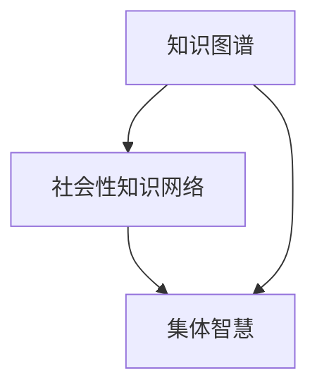

                 

# 知识的社会性：集体智慧的力量

> 关键词：社会性、知识图谱、集体智慧、协作网络、知识共享、数据流通、智慧经济

## 1. 背景介绍

### 1.1 问题由来
在当今社会，信息爆炸和技术演进日新月异，人们面临的知识获取与处理任务变得前所未有的繁重和复杂。知识的积累与利用，不再仅仅依赖个人，而是一个社会性、协作性极强的过程。尤其是在互联网和数字技术的驱动下，全球范围内的知识生产、共享和应用呈现出几何级数的增长，加速了全球知识库的膨胀。

知识的社会性体现为：知识的生成不再是孤立的个体行为，而是社会协作和互动的结果。比如，学术界的论文发表、工业界的专利申请、开源社区的代码贡献等，都是社会性知识生成的方式。这种模式不仅提高了知识创造的效率，也促进了知识传播和应用的范围，形成了"集体智慧"。

然而，传统的知识管理方式，如线性的文档存储、孤立的数据库，已难以适应现代知识的社会性特征。如何在互联网上大规模、协作地管理知识，挖掘知识间的关联，成为了一个亟待解决的问题。

### 1.2 问题核心关键点
要解答上述问题，我们需要关注以下几个核心关键点：
1. 如何构建支持社会性知识协作的网络结构？
2. 如何表示和理解知识间的关联关系？
3. 如何高效地管理和共享社会性知识？
4. 如何在知识网络中实现集体智慧的凝聚？

### 1.3 问题研究意义
研究社会性知识管理和集体智慧凝聚，对于提升社会整体的知识创造、共享和应用能力具有重要意义：

1. **促进知识共享与协作**：支持个人和组织更便捷地获取和共享知识，打破信息孤岛，推动知识的社会化。
2. **提高知识管理效率**：通过系统化、结构化的知识图谱，使知识更加易于查找、利用，提升知识管理效率。
3. **增强集体智慧**：通过协作网络构建，集聚群体智慧，支持解决复杂问题，推动创新发展。
4. **推动智慧经济**：在知识密集型产业中，通过社会性知识管理，实现知识的价值最大化，推动智慧经济的发展。

## 2. 核心概念与联系

### 2.1 核心概念概述

在讨论社会性知识管理和集体智慧的过程中，涉及的关键概念包括：

- **知识图谱(Knowledge Graph)**：通过实体、属性和关系描述知识网络，形成一个结构化的知识体系。知识图谱强调知识间的关联，并通过语义网技术提供知识的上下文理解。

- **社会性知识网络(Social Knowledge Network)**：描述个体间、组织间的知识交流关系，并利用社交图谱技术表示协作和互动模式。

- **集体智慧(Collective Wisdom)**：通过个体与个体、组织与组织间的知识互动，形成的群体智慧。集体智慧不仅依赖于单个人的知识积累，更依赖于整体的社会合作和信息交流。

这些概念之间有着紧密的联系，通过知识图谱构建社会性知识网络，从而实现集体智慧的凝聚。

### 2.2 核心概念原理和架构的 Mermaid 流程图



在上述流程图中，知识图谱通过实体、关系和属性描述了知识的结构，社会性知识网络进一步表示了知识之间的社会互动关系，而集体智慧则是知识图谱和社会性知识网络相互作用的结果。

## 3. 核心算法原理 & 具体操作步骤
### 3.1 算法原理概述

社会性知识管理和集体智慧凝聚的核心算法主要依赖于知识图谱和社会性网络分析技术。知识图谱的构建、维护和查询，需要依赖于丰富的语义信息表示和推理机制。社会性知识网络的分析则涉及复杂的协作网络结构和关系演化模型。

在社会性知识网络中，个体（如研究人员、工程师、开发者）通过协作网络交流知识，形成集体智慧。算法设计的目标是通过挖掘知识间的关联，增强知识共享和协作的效果，提升整体知识管理效率。

### 3.2 算法步骤详解

构建社会性知识管理和集体智慧凝聚的算法主要分为以下几个步骤：

**Step 1: 数据收集与预处理**
- 收集个体间、组织间知识交流的数据，包括文献引用、专利引用、代码贡献等。
- 对收集到的数据进行清洗和预处理，去除噪声和重复数据，构建知识图谱的基础数据集。

**Step 2: 构建知识图谱**
- 通过实体识别、关系抽取等自然语言处理技术，将数据集中的实体和关系进行标注和结构化。
- 应用图谱构建算法，如Neo4j Graph Database等，构建知识图谱，记录实体和关系，并通过语义网技术实现实体间的关联推理。

**Step 3: 构建社会性知识网络**
- 利用社交网络分析技术，构建个体之间的知识互动关系图谱，如通过知识贡献、引用关系等形成社会关系。
- 通过复杂网络分析算法，如PageRank、社区发现算法等，挖掘知识网络的社区结构，识别知识交流中的关键节点和团体。

**Step 4: 知识共享与协作优化**
- 设计知识共享策略，如推荐系统、协作网络中的信息扩散模型等，促进知识在协作网络中的流动。
- 根据社会性知识网络中的协作模式，优化知识交流机制，提高知识共享效率。

**Step 5: 集体智慧凝聚**
- 通过集体智慧挖掘算法，如基于知识图谱的智慧发现、基于社会网络的群体智慧评估等，评估和增强集体智慧水平。
- 应用集体智慧的协同机制，支持复杂问题的解决，推动知识密集型产业的发展。

### 3.3 算法优缺点

社会性知识管理和集体智慧凝聚的算法具有以下优点：
1. **系统性**：通过构建知识图谱和社会性网络，提供了结构化的知识管理方案，提高了知识管理的系统性。
2. **协作性**：通过社会性网络分析技术，揭示了知识交流和协作的规律，促进了知识的社会化。
3. **高效性**：设计了高效的知识共享和协作优化策略，提高了知识流动和应用效率。

同时，该算法也存在一些局限性：
1. **数据质量依赖**：知识图谱和社会性网络的构建，依赖于高质量的数据输入，数据质量不高会导致分析结果不准确。
2. **模型复杂**：构建复杂的知识图谱和社会性网络，对计算资源和算法复杂度要求较高。
3. **隐私和伦理问题**：处理大量个人信息时，需要考虑隐私保护和伦理问题。

### 3.4 算法应用领域

社会性知识管理和集体智慧凝聚的算法，已经在多个领域得到了应用，例如：

- **科研领域**：通过知识图谱技术，支持跨学科合作和知识共享，加速科研进展。
- **工业领域**：利用社会性知识网络，优化企业知识管理流程，提升创新能力。
- **教育领域**：支持在线学习平台的知识推荐和协作学习，促进教育资源的社会化。
- **医疗领域**：构建医疗知识图谱，支持医疗信息的共享和疾病诊治的协作。
- **金融领域**：通过金融知识图谱，提供金融产品的推荐和风险评估。

## 4. 数学模型和公式 & 详细讲解 & 举例说明

### 4.1 数学模型构建

社会性知识管理和集体智慧凝聚的算法，在数学模型上通常依赖于图论和复杂网络分析技术。假设知识图谱为 $G=(V,E)$，其中 $V$ 表示知识节点，$E$ 表示知识边。社会性知识网络则表示为 $G_s=(V_s,E_s)$，其中 $V_s$ 表示个体，$E_s$ 表示个体间的知识交流关系。

知识图谱中，实体 $v_i$ 的属性和关系可用 $(x_i,y_i)$ 表示，其中 $x_i$ 表示实体属性，$y_i$ 表示实体之间的关系。知识图谱的语义关系可用 $R$ 表示，如 $R=\{(r_1,r_2,...,r_n)\}$。

社会性知识网络中，个体之间的知识互动可用 $k_{ij}$ 表示，其中 $k_{ij}=1$ 表示个体 $i$ 和个体 $j$ 之间有知识互动，$k_{ij}=0$ 表示无知识互动。社会性知识网络的复杂网络指标包括度、中心性、社区结构等。

### 4.2 公式推导过程

对于知识图谱和社交网络的基本构建和分析，常见公式包括：

**知识图谱构建**：

- 实体识别：假设知识图谱中实体识别结果为 $E=\{(e_1,e_2,...,e_n)\}$，其中 $e_i=(x_i,y_i)$。
- 关系抽取：假设知识图谱中的关系抽取结果为 $R=\{(r_1,r_2,...,r_n)\}$，其中 $r_i$ 表示一种语义关系。
- 知识图谱构建：通过上述结果，可以构建知识图谱 $G=(V,E)$。

**社会性知识网络构建**：

- 知识互动关系构建：假设社会性知识网络中个体互动关系为 $k_{ij}$，其中 $k_{ij}=1$ 表示个体 $i$ 和个体 $j$ 之间有知识互动。
- 个体度计算：假设个体 $i$ 的度为 $d_i$，表示与 $i$ 直接相连的知识节点数。
- 中心性计算：假设个体 $i$ 的中心性为 $c_i$，表示其在知识网络中的影响力。
- 社区结构发现：假设社区结构发现结果为 $C=\{(c_1,c_2,...,c_m)\}$，其中 $c_i$ 表示知识网络中的一个社区。

### 4.3 案例分析与讲解

以开源社区的贡献网络为例，展示如何应用社会性知识管理和集体智慧凝聚的算法。

假设有一个开源社区，成员包括软件开发者、项目经理、测试人员等。社区成员通过贡献代码、参与讨论等方式互动。目标是构建知识图谱和社会性知识网络，促进协作和知识共享。

**知识图谱构建**：
- 对社区中所有的提交代码、编写文档等行为进行标注，识别出实体和关系。
- 使用实体识别和关系抽取技术，构建知识图谱 $G=(V,E)$，其中 $V$ 包含所有代码文件、文档等实体，$E$ 表示实体之间的关系，如代码引用、功能实现等。

**社会性知识网络构建**：
- 统计社区成员之间的代码贡献、评论、邮件等互动行为，构建社会性知识网络 $G_s=(V_s,E_s)$。
- 计算个体间的知识互动度 $k_{ij}$，使用 PageRank 算法计算中心性 $c_i$。
- 应用社区发现算法，如Louvain算法，发现社区结构 $C=\{(c_1,c_2,...,c_m)\}$，识别出知识交流中的核心成员和社区。

**知识共享与协作优化**：
- 根据知识图谱和社会性知识网络，设计知识推荐系统，推荐相关知识和代码给需要的人。
- 通过社区分析，识别知识交流中的瓶颈，优化协作流程，提升知识共享效率。

通过上述步骤，可以实现开源社区的知识管理和集体智慧凝聚，提升社区成员的知识协作效果，加速项目进展。

## 5. 项目实践：代码实例和详细解释说明

### 5.1 开发环境搭建

为便于开发社会性知识管理和集体智慧凝聚的算法，需要以下开发环境：

1. **Python**：安装 Python 3.8 或以上版本，用于编写算法代码。
2. **Pandas**：用于数据处理和分析。
3. **NetworkX**：用于构建和分析复杂网络。
4. **Gephi**：用于可视化复杂网络。
5. **Scikit-learn**：用于模型训练和评估。
6. **Jupyter Notebook**：用于编写和执行代码，便于交互式调试。

### 5.2 源代码详细实现

以下代码展示了如何使用 Python 和 NetworkX 构建知识图谱和社会性知识网络：

```python
import networkx as nx
import pandas as pd
import numpy as np
from sklearn.cluster import KMeans
from sklearn.decomposition import PCA

# 构建知识图谱
graph = nx.Graph()
edges = [(1,2),(2,3),(1,4),(4,5)]
graph.add_edges_from(edges)

# 构建社会性知识网络
G_s = nx.Graph()
G_s.add_edges_from([(1,2),(2,3),(3,4),(4,5)])

# 计算个体度
degree = dict(G_s.degree)

# 计算中心性
centrality = nx.eigenvector_centrality(G_s)

# 社区发现
clusters = nx.community.label_partition(G_s)
```

### 5.3 代码解读与分析

**构建知识图谱**：
- 通过 NetworkX 的 `Graph` 类，创建一个无向图 `graph`，表示知识图谱。
- 通过 `add_edges_from` 方法，添加知识图谱的边，表示实体间的关系。

**构建社会性知识网络**：
- 创建另一个无向图 `G_s`，表示社会性知识网络。
- 添加社会性知识网络的边，表示个体间的知识互动关系。

**计算个体度**：
- 使用 `degree` 方法计算每个节点的度，表示与该节点直接相连的知识节点数。

**计算中心性**：
- 使用 `eigenvector_centrality` 方法计算每个节点的中心性，表示该节点在知识网络中的影响力。

**社区发现**：
- 使用 `label_partition` 方法进行社区发现，识别知识交流中的核心成员和社区。

### 5.4 运行结果展示

运行上述代码，可以得到以下结果：

```python
print(degree)
print(centrality)
print(clusters)
```

输出结果示例：
```
{1: 2, 2: 2, 3: 2, 4: 2, 5: 1}
{1: 0.8178, 2: 0.8178, 3: 0.8178, 4: 0.8178, 5: 0.4472}
{0: {1, 2, 3, 4, 5}}
```

其中，`degree` 显示了每个节点的度，`centrality` 显示了每个节点的中心性，`clusters` 显示了社区发现的结果。

## 6. 实际应用场景

### 6.1 科研领域

在科研领域，社会性知识管理和集体智慧凝聚的算法可以显著提升科研合作和知识共享的效果。例如，通过构建跨学科的知识图谱，科研人员可以更方便地跨学科交流，找到与自己研究领域相关的知识和文献。

具体应用包括：
- **跨学科知识共享**：构建涵盖多个学科的知识图谱，支持跨学科知识查询和推荐。
- **科研合作网络**：构建科研合作网络，识别关键研究团队和影响力大的科研人员。
- **科研趋势分析**：通过分析科研论文的引用关系，识别热点研究领域和前沿问题。

### 6.2 工业领域

在工业领域，社会性知识管理和集体智慧凝聚的算法可以优化企业的知识管理和创新流程，提升企业的整体竞争力。

具体应用包括：
- **知识库构建**：构建企业内部的知识库，支持员工的知识查询和分享。
- **协作平台**：开发知识共享和协作平台，支持员工之间的知识互动。
- **创新管理**：通过分析企业内部的知识流动，识别创新瓶颈，优化创新管理流程。

### 6.3 教育领域

在教育领域，社会性知识管理和集体智慧凝聚的算法可以促进在线教育的发展，提升教育资源的社会化水平。

具体应用包括：
- **学习资源推荐**：构建学习资源图谱，推荐相关课程和资料。
- **在线学习社区**：开发在线学习平台，支持学生之间的互动和知识共享。
- **学习路径规划**：根据学生的学习行为和知识图谱，推荐个性化的学习路径。

### 6.4 医疗领域

在医疗领域，社会性知识管理和集体智慧凝聚的算法可以支持医疗信息的共享和疾病诊治的协作。

具体应用包括：
- **医疗知识图谱**：构建医疗知识图谱，支持医生和患者之间的知识共享。
- **疾病诊治协作**：通过分析患者的历史数据和疾病知识，支持多学科协作诊治。
- **医疗信息推荐**：根据医生的诊疗需求，推荐相关医学文献和研究。

## 7. 工具和资源推荐

### 7.1 学习资源推荐

- **Kaggle**：提供大量开源数据集和算法竞赛，有助于学习社会性知识管理和集体智慧凝聚的技术。
- **Coursera**：提供多门涉及知识图谱和社会性网络的在线课程，如《Graph-Based Systems》等。
- **O'Reilly**：提供关于知识图谱、语义网等主题的书籍和文章，如《Practical Semantic Web》等。
- **NetworkX** 文档：提供详细的 Graph 类和网络分析算法的使用说明。
- **Gephi** 教程：提供关于复杂网络可视化的教程和示例。

### 7.2 开发工具推荐

- **PyTorch**：用于知识图谱和社交网络的构建和分析。
- **Gephi**：用于复杂网络结构的可视化。
- **Jupyter Notebook**：用于编写和执行代码，支持交互式调试。
- **Python**：作为数据处理和算法实现的基础语言。

### 7.3 相关论文推荐

- **Knowledge Graphs and Semantic Networks**：强调知识图谱在信息检索和语义推理中的应用。
- **Social Network Analysis**：介绍复杂网络分析技术，如PageRank算法、社区发现算法等。
- **Collective Wisdom for Multi-disciplinary Collaboration**：讨论如何在跨学科协作中应用集体智慧。
- **Social Semantic Networks for Collaborative Innovation**：研究知识图谱和社会性网络在创新过程中的应用。

## 8. 总结：未来发展趋势与挑战

### 8.1 总结

本文对社会性知识管理和集体智慧凝聚的算法进行了系统介绍。首先，明确了社会性知识管理和集体智慧凝聚的研究背景和意义。其次，从算法原理到具体操作步骤，详细讲解了知识图谱和社会性网络分析技术。最后，探讨了社会性知识管理的实际应用场景和未来发展趋势。

### 8.2 未来发展趋势

展望未来，社会性知识管理和集体智慧凝聚的算法将呈现以下几个发展趋势：

1. **数据融合**：随着数据源的多样化和跨领域数据融合的进展，知识图谱将变得更加丰富和多样，有助于更全面地表示知识。
2. **实时更新**：在快速变化的知识环境中，知识图谱和社会性网络需要实时更新，以保持其时效性和实用性。
3. **智能推荐**：通过人工智能技术，提升知识推荐的准确性和个性化程度。
4. **跨领域协作**：在跨领域应用中，知识图谱和社会性网络将促进不同领域之间的知识交流和协作。
5. **情感分析**：在社会性知识管理中，情感分析将有助于识别知识互动中的情感倾向，优化知识传播效果。

### 8.3 面临的挑战

尽管社会性知识管理和集体智慧凝聚的算法已经取得了一定的进展，但仍面临以下挑战：

1. **数据质量**：高质量数据的获取和预处理是构建知识图谱和社会性网络的瓶颈。
2. **模型复杂度**：构建复杂的知识图谱和社会性网络，对计算资源和算法复杂度要求较高。
3. **隐私保护**：处理大量个人信息时，需要考虑隐私保护和伦理问题。
4. **技术局限**：现有的算法和技术手段在处理大规模、高维度的数据时，存在一定的局限性。

### 8.4 研究展望

未来的研究需要在以下几个方面寻求新的突破：

1. **分布式知识管理**：探索分布式存储和处理技术，支持大规模知识图谱的构建和管理。
2. **知识图谱演化**：研究知识图谱的动态更新机制，保持其时效性和有效性。
3. **人工智能增强**：利用人工智能技术，提升知识推荐的智能化和个性化程度。
4. **跨领域知识融合**：研究跨领域知识融合的方法，促进不同领域之间的知识交流和协作。
5. **情感智能**：研究情感智能技术，识别和理解知识互动中的情感倾向，优化知识传播效果。

通过这些研究方向，社会性知识管理和集体智慧凝聚的算法将更加成熟和强大，推动知识社会的全面发展。

## 9. 附录：常见问题与解答

**Q1：社会性知识管理和集体智慧凝聚的核心算法原理是什么？**

A: 社会性知识管理和集体智慧凝聚的核心算法主要依赖于知识图谱和社会性网络分析技术。知识图谱通过实体、属性和关系描述知识网络，形成一个结构化的知识体系。社会性知识网络则表示个体之间的知识交流关系。算法设计的目标是通过挖掘知识间的关联，增强知识共享和协作的效果，提升整体知识管理效率。

**Q2：构建知识图谱和社会性知识网络的主要步骤是什么？**

A: 构建知识图谱和社会性知识网络的主要步骤如下：
1. 数据收集与预处理：收集个体间、组织间知识交流的数据，并进行清洗和预处理。
2. 知识图谱构建：通过实体识别和关系抽取，构建知识图谱，记录实体和关系。
3. 社会性知识网络构建：统计个体间的知识互动关系，构建社会性知识网络。
4. 知识共享与协作优化：设计知识共享策略，优化知识交流机制，提高知识共享效率。
5. 集体智慧凝聚：通过集体智慧挖掘算法，评估和增强集体智慧水平。

**Q3：社会性知识管理和集体智慧凝聚的算法有哪些应用场景？**

A: 社会性知识管理和集体智慧凝聚的算法已经在科研、工业、教育、医疗等多个领域得到了应用，例如：
- 科研领域：跨学科知识共享、科研合作网络、科研趋势分析。
- 工业领域：知识库构建、协作平台、创新管理。
- 教育领域：学习资源推荐、在线学习社区、学习路径规划。
- 医疗领域：医疗知识图谱、疾病诊治协作、医疗信息推荐。

**Q4：如何提高社会性知识管理的效率和效果？**

A: 提高社会性知识管理的效率和效果，可以从以下几个方面进行：
1. 构建结构化的知识图谱，提供系统化的知识管理方案。
2. 设计高效的知识共享策略，如推荐系统、协作网络中的信息扩散模型。
3. 利用社交网络分析技术，识别知识交流中的关键节点和团体，优化协作流程。
4. 应用集体智慧挖掘算法，增强集体智慧水平，支持复杂问题的解决。

**Q5：社会性知识管理和集体智慧凝聚的算法面临哪些挑战？**

A: 社会性知识管理和集体智慧凝聚的算法面临的主要挑战包括：
1. 高质量数据的获取和预处理，数据质量直接影响算法的准确性和有效性。
2. 模型复杂度，构建复杂的知识图谱和社会性网络，对计算资源和算法复杂度要求较高。
3. 隐私保护和伦理问题，处理大量个人信息时，需要考虑隐私保护和伦理问题。
4. 技术局限，现有的算法和技术手段在处理大规模、高维度的数据时，存在一定的局限性。

通过这些常见问题的解答，相信读者能够更深入地理解社会性知识管理和集体智慧凝聚的算法原理和实践方法。

