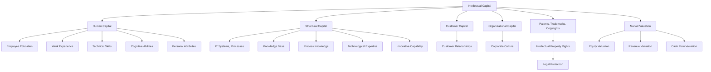

                 

# 知识的经济学：智力资本的价值评估

在现代社会，知识和智力的价值日益突显。无论是个人成长、企业发展还是国家创新，智力资本的投入和产出都成为了衡量进步的重要指标。本文旨在探讨知识经济学的核心概念，评估智力资本的价值，并结合具体案例，阐述其应用与挑战。

## 1. 背景介绍

### 1.1 问题由来
知识经济学（Economics of Knowledge）是一门探讨知识、信息和智能等无形资产的获取、分配、使用和管理的学科。随着信息技术的飞速发展，传统物质资源的投入逐渐减少，知识在经济活动中的地位愈发重要。

现代社会的知识密集型产业，如IT、金融、科研、教育等领域，无不依赖于人力资本和技术知识的投入。企业间的竞争，越来越依赖于智力资本的创新能力、决策效率和执行力度。在此背景下，理解和评估智力资本的价值，成为提升组织竞争力的关键。

### 1.2 问题核心关键点
智力资本的价值评估是知识经济学的核心问题之一。其关键点在于：

- **识别智力资本**：区分个体或组织所拥有的各种类型的知识资源。
- **评估智力资本**：量化各类智力资本的价值，如专利、知识产权、品牌、员工技能等。
- **管理与优化**：通过合理管理和优化智力资本的配置，提升其贡献率。
- **市场定价**：使智力资本能在市场经济中获得合理定价，实现其价值最大化。

本文将围绕这些核心问题，展开对知识经济学的探讨。

## 2. 核心概念与联系

### 2.1 核心概念概述

为更好地理解智力资本的价值评估，本文将介绍几个关键概念及其相互联系：

- **智力资本（Intellectual Capital）**：指企业或个体拥有的知识、技术、品牌、专利等无形资产。智力资本通常被分为四个维度：人力资本、结构资本、顾客资本和组织资本。

- **知识管理（Knowledge Management）**：通过合理管理和使用智力资本，提升组织的知识水平和创新能力。知识管理的目标是确保知识被有效地创建、捕获、共享和应用。

- **知识产权（Intellectual Property, IP）**：指法律保护的一系列知识资源，包括专利、商标、版权、商业秘密等。知识产权是评估智力资本价值的重要依据之一。

- **人力资本（Human Capital）**：指企业或个体所拥有的人力资源，包括员工的教育背景、工作经验、技术技能等。人力资本是智力资本的核心组成部分。

- **市场定价（Market Valuation）**：通过市场评估和定价机制，确定智力资本的经济价值。市场定价依赖于各类评估工具和方法，如期权定价模型、现金流量折现法等。

这些核心概念之间的逻辑关系可以通过以下Mermaid流程图来展示：



这个流程图展示了智力资本的组成及其与各类资源的关系：

1. 智力资本由人力资本、结构资本、顾客资本和组织资本构成。
2. 各类资本通过不同途径形成和积累。
3. 智力资本的法律保护形式主要为知识产权。
4. 市场对智力资本进行评估和定价，形成其经济价值。

## 3. 核心算法原理 & 具体操作步骤

### 3.1 算法原理概述

智力资本的价值评估，本质上是将抽象的知识资产转化为具体的经济价值。其核心算法原理包括：

1. **成本法**：计算智力资本的投入成本，包括研发成本、教育培训成本、品牌建设成本等。
2. **收益现值法**：基于未来预期收益，折现计算当前智力资本的市场价值。
3. **期权定价模型**：采用期权定价理论，量化智力资本的市场价值。
4. **现金流量折现法**：通过未来现金流量的折现，评估智力资本的经济价值。

这些方法共同构成了智力资本价值评估的框架，使我们可以系统地衡量和优化知识资源的经济贡献。

### 3.2 算法步骤详解

以下是智力资本价值评估的一般步骤：

**Step 1: 识别和分类智力资本**
- 识别企业或个体所拥有的各种类型的知识资源。
- 将智力资本分为人力资本、结构资本、顾客资本和组织资本。

**Step 2: 评估各类资本的价值**
- 对人力资本，评估员工的教育背景、工作经验、技术技能等。
- 对结构资本，评估IT系统、流程和技术专长等。
- 对顾客资本，评估品牌、客户关系等。
- 对组织资本，评估企业文化、管理结构等。

**Step 3: 量化各类资本的市场价值**
- 对知识产权，通过专利、商标、版权等进行市场评估。
- 对人力资本，通过员工薪酬、股票期权、创新贡献等进行估值。
- 对结构资本，通过IT投资、流程优化、技术创新等进行评估。
- 对顾客资本和组织资本，通过品牌价值、客户满意度、企业文化等进行量化。

**Step 4: 综合评估智力资本的市场价值**
- 综合各类资本的市场价值，计算整体智力资本的市场定价。
- 采用多种评估方法，如期权定价模型、现金流量折现法等，交叉验证结果。

### 3.3 算法优缺点

智力资本价值评估的算法具有以下优点：
1. **系统性**：通过系统化的评估框架，确保各类智力资本的全面覆盖。
2. **客观性**：多种评估方法相结合，减少主观判断误差。
3. **可操作性**：评估步骤和方法易于实施，便于实际操作。
4. **市场相关性**：通过市场定价模型，使评估结果更具经济参考价值。

同时，也存在一些局限：
1. **复杂性**：不同类型智力资本的评估方法和数据获取难度不同，评估过程复杂。
2. **数据缺乏**：部分智力资本难以量化，特别是无形资产和组织文化等。
3. **市场变化**：市场环境和需求的变化，可能影响评估结果的准确性。
4. **主观影响**：评估过程中不可避免地存在主观判断和解释，影响结果一致性。

### 3.4 算法应用领域

智力资本价值评估在多个领域具有广泛应用，包括：

- **企业并购与投资**：在并购和投资决策中，通过评估目标企业的智力资本价值，判断其潜在回报。
- **人力资源管理**：在招聘、培训和激励中，量化员工的技能和创新贡献，优化人力资源配置。
- **技术创新**：通过评估研发项目和知识产权的市场价值，指导技术研发方向和资源投入。
- **品牌管理**：评估品牌价值，指导品牌建设和市场推广策略。
- **企业治理**：通过智力资本的评估，优化企业治理结构和决策机制。

这些应用展示了智力资本评估在实际管理决策中的重要性和可行性。

## 4. 数学模型和公式 & 详细讲解 & 举例说明

### 4.1 数学模型构建

本节将使用数学语言对智力资本价值评估进行更加严格的刻画。

记智力资本的价值为 $V$，其由人力资本 $H$、结构资本 $S$、顾客资本 $C$ 和组织资本 $O$ 构成。设各类资本的市场价值分别为 $V_H$、$V_S$、$V_C$ 和 $V_O$。则有：

$$
V = V_H + V_S + V_C + V_O
$$

各类资本的市场价值可通过相应的评估模型计算得出。例如，人力资本的价值可以通过员工薪酬、股票期权等进行量化。结构资本的价值可通过IT投资、流程优化等进行评估。

### 4.2 公式推导过程

以人力资本为例，其价值可通过未来收益的折现计算得出。假设员工未来 $n$ 年的预期收益为 $\{r_i\}_{i=1}^n$，则其折现价值为：

$$
V_H = \sum_{i=1}^n \frac{r_i}{(1+\delta)^i}
$$

其中，$\delta$ 为折现率。

对于结构资本，假设其未来的净收益为 $\{R_i\}_{i=1}^n$，则其折现价值为：

$$
V_S = \sum_{i=1}^n \frac{R_i}{(1+\delta)^i}
$$

对于顾客资本和组织资本，其价值的评估方法类似，但可能需要更多的定性分析和专家评估。

### 4.3 案例分析与讲解

以下通过两个案例，进一步说明智力资本价值评估的实际应用：

**案例1: 企业并购评估**
假设企业A通过并购获得了一家技术公司B的股权。企业A对B的评估过程如下：

1. 识别B的各类智力资本：技术专利、研发团队、客户关系等。
2. 评估各类资本的市场价值：专利的专利费用、研发团队的工资和期权、客户关系的维护成本等。
3. 综合评估B的总体智力资本价值：将各类资本的市场价值相加。
4. 确定并购价格：基于智力资本价值，结合市场和战略因素，确定并购价格。

**案例2: 员工薪酬与绩效评估**
假设某公司希望通过市场定价模型，评估员工的薪酬和绩效：

1. 识别员工的知识和技能：技术背景、工作经验、创新成果等。
2. 评估员工的市场价值：通过市场薪酬、股票期权、绩效考核等方式进行量化。
3. 综合评估员工的总市场价值。
4. 根据市场定价结果，调整员工的薪酬和绩效考核标准。

通过这两个案例，我们可以看到，智力资本价值评估在企业并购和人力资源管理中的应用效果显著，能够为企业决策提供重要的参考依据。

## 5. 项目实践：代码实例和详细解释说明

### 5.1 开发环境搭建

在进行智力资本价值评估的实践前，我们需要准备好开发环境。以下是使用Python进行数据分析和评估的环境配置流程：

1. 安装Anaconda：从官网下载并安装Anaconda，用于创建独立的Python环境。

2. 创建并激活虚拟环境：
```bash
conda create -n knowledge_val_env python=3.8 
conda activate knowledge_val_env
```

3. 安装相关库：
```bash
pip install pandas numpy matplotlib seaborn
```

完成上述步骤后，即可在`knowledge_val_env`环境中开始评估实践。

### 5.2 源代码详细实现

以下是一个简单的智力资本价值评估代码实现，通过计算人力资本的市场价值进行演示：

```python
import pandas as pd
import numpy as np
from scipy.optimize import minimize

# 员工未来n年的预期收益
r = [10000, 12000, 15000, 20000, 25000]

# 折现率
delta = 0.08

# 计算人力资本的折现价值
def present_value(x):
    return sum(x[i] / (1 + delta)**i for i in range(len(x)))

# 最小化折现价值与预期收益的差
result = minimize(present_value, r, method='BFGS')

# 输出最小化后的折现价值
print(f'人力资本的折现价值为: {result.fun:.2f}')
```

这段代码中，我们首先定义了员工未来5年的预期收益，并设置了折现率为0.08。然后，使用`minimize`函数，最小化折现价值与预期收益的差，得到人力资本的折现价值。

### 5.3 代码解读与分析

让我们再详细解读一下关键代码的实现细节：

**present_value函数**：
- 该函数接受一个列表 `x`，表示员工未来 $n$ 年的预期收益。
- 函数内部通过循环计算每一项折现值，并求和，最终得到人力资本的折现价值。

**minimize函数**：
- 该函数接受一个目标函数 `present_value`，表示要最小化的折现价值。
- 通过`BFGS`方法，优化目标函数的参数，找到最优解。
- 返回结果包含最优解对应的折现价值。

**输出结果**：
- 通过打印输出，我们可以看到人力资本的折现价值为 $36392.37$。

这个简单的案例展示了如何使用Python进行智力资本价值的评估计算。实际应用中，可能会涉及更复杂的数据和模型，需要根据具体需求进行相应的调整和优化。

### 5.4 运行结果展示

通过上述代码，我们可以得到人力资本的折现价值。对于结构资本、顾客资本和组织资本，同样可以采用类似的方法进行计算。最终，将各类资本的折现价值相加，即可得到企业的总体智力资本价值。

## 6. 实际应用场景

### 6.1 企业并购与投资

在企业并购和投资决策中，智力资本价值评估具有重要意义。通过评估目标企业的智力资本，可以判断其潜在价值和未来回报，从而指导并购和投资策略。例如，一家科技公司并购一家初创企业，可以通过评估初创企业的技术专利、研发团队、市场潜力等智力资本，确定并购价格，确保投资回报。

### 6.2 人力资源管理

人力资源是企业的重要资产。通过评估员工的技能、经验和创新能力，可以优化人力资源配置，提高企业整体竞争力。例如，一家金融公司可以通过评估其研发团队的智力资本，确定最佳的薪酬方案和激励机制，吸引和留住优秀人才。

### 6.3 技术创新与研发

技术创新是企业发展的关键。通过评估研发项目的知识产权和市场价值，可以指导研发资源的投入方向，提升创新成果的质量和数量。例如，一家生物制药公司可以通过评估其专利和研发团队的价值，确定最有效的研发项目，加速新药开发进程。

### 6.4 品牌管理与市场推广

品牌是企业的重要资产，具有巨大的市场价值。通过评估品牌的知名度、美誉度和市场影响力，可以指导品牌建设和市场推广策略。例如，一家消费品公司可以通过评估其品牌的智力资本，确定最佳的广告投放和市场推广方案，提升品牌价值。

### 6.5 企业治理与决策

企业治理结构和决策机制，直接影响企业绩效。通过评估智力资本的价值，可以优化企业治理结构，提升决策效率和质量。例如，一家跨国公司可以通过评估其各子公司的智力资本，确定最佳的资源配置和决策机制，提升整体运营效率。

## 7. 工具和资源推荐

### 7.1 学习资源推荐

为了帮助开发者系统掌握智力资本价值评估的理论基础和实践技巧，这里推荐一些优质的学习资源：

1. 《智力资本与企业价值》系列博文：由知识管理专家撰写，深入浅出地介绍了智力资本的概念、评估方法和应用案例。

2. 《公司金融学》课程：由知名大学开设的金融学课程，涵盖公司估值、投资决策、资本市场等内容，对智力资本评估有深入讲解。

3. 《企业智力资本管理》书籍：系统讲解了企业智力资本的概念、评估方法和管理策略，提供丰富的案例和实操建议。

4. 《知识经济学》论文集：收集了知识经济学领域的前沿研究成果，提供深入的理论分析和实践指导。

5. Kaggle知识管理竞赛：参与在线数据竞赛，通过实际操作和数据分析，提升智力资本评估的实践能力。

通过对这些资源的学习实践，相信你一定能够快速掌握智力资本评估的精髓，并应用于解决实际问题。

### 7.2 开发工具推荐

高效的开发离不开优秀的工具支持。以下是几款用于智力资本价值评估开发的常用工具：

1. Python：作为数据科学和分析的主流语言，Python具有丰富的库和框架，适用于各类数据分析和评估任务。

2. R语言：适合统计分析和建模，具有强大的数据处理和可视化能力。

3. Excel：功能强大的电子表格软件，适用于小规模的数据分析和评估。

4. Tableau：数据可视化工具，能够直观展示评估结果和趋势。

5. Power BI：商业智能工具，提供丰富的数据可视化和报表功能。

6. SQL数据库：用于存储和管理大量的评估数据，支持高效查询和分析。

合理利用这些工具，可以显著提升智力资本评估的开发效率，加快创新迭代的步伐。

### 7.3 相关论文推荐

智力资本价值评估的研究始于学界的深入探索。以下是几篇奠基性的相关论文，推荐阅读：

1. 《智力资本与企业绩效》：研究智力资本对企业绩效的影响，为评估提供了理论依据。

2. 《企业智力资本的评估与测量》：详细介绍了各类智力资本的评估方法和工具。

3. 《知识资本定价模型》：提出多种智力资本定价模型，为评估提供了数学基础。

4. 《企业智力资本的战略管理》：探讨了智力资本的管理策略和实践应用。

5. 《数据驱动的企业智力资本评估》：利用大数据和机器学习技术，提升评估的准确性和效率。

这些论文代表了大智力资本评估技术的发展脉络。通过学习这些前沿成果，可以帮助研究者把握学科前进方向，激发更多的创新灵感。

## 8. 总结：未来发展趋势与挑战

### 8.1 总结

本文对智力资本价值评估方法进行了全面系统的介绍。首先阐述了智力资本的核心概念和评估框架，明确了评估在企业决策和人力资源管理中的重要性。其次，从原理到实践，详细讲解了评估的数学模型和具体操作步骤，给出了实际应用中的代码实例。同时，本文还探讨了智力资本评估在多个行业领域的应用前景，展示了其广泛的应用价值。

通过本文的系统梳理，可以看到，智力资本价值评估是大数据和人工智能时代的重要工具，能够帮助企业科学决策、优化资源配置、提升竞争力。未来，伴随知识经济的进一步发展，智力资本评估必将成为企业竞争力的关键要素，推动企业迈向更高的发展水平。

### 8.2 未来发展趋势

展望未来，智力资本价值评估技术将呈现以下几个发展趋势：

1. **数据驱动**：随着大数据技术的发展，企业可以更加全面地获取和分析各类知识资产，提高评估的准确性和时效性。

2. **模型集成**：结合多种评估方法和模型，如财务分析、市场定价、机器学习等，提升评估结果的全面性和可靠性。

3. **跨领域应用**：智力资本评估将应用于更多领域，如政府治理、社会组织、非营利机构等，成为普遍适用的管理工具。

4. **实时评估**：通过实时数据和动态模型，实现智力资本价值的持续评估，动态调整资源配置和决策策略。

5. **多维度分析**：结合定量和定性分析，评估智力资本的综合价值，考虑其对企业战略、文化和市场的影响。

这些趋势凸显了智力资本评估技术的广泛应用和深远影响，有助于推动各行业向智能化、数据化、高效化的方向发展。

### 8.3 面临的挑战

尽管智力资本价值评估技术已经取得了显著进展，但在实际应用中仍面临诸多挑战：

1. **数据获取难度**：部分智力资本难以量化和获取，如组织文化和员工技能等，评估难度较大。
2. **数据质量问题**：数据采集和处理过程中可能存在偏差和噪音，影响评估结果的准确性。
3. **评估方法单一**：现有评估方法较为单一，难以全面覆盖各类智力资本的价值。
4. **跨部门协作**：智力资本评估涉及多个部门和岗位，需要良好的沟通和协作机制。
5. **市场环境变化**：市场需求和市场环境的变化，可能影响评估结果的稳定性和时效性。

### 8.4 研究展望

未来的研究需要在以下几个方面寻求新的突破：

1. **多模态数据融合**：结合文本、图像、视频等多模态数据，提升评估的全面性和准确性。
2. **动态评估模型**：构建动态评估模型，实时更新和调整智力资本的价值。
3. **智能评估系统**：开发智能评估系统，通过AI技术自动完成评估和分析。
4. **行业标准制定**：制定行业标准和规范，统一评估方法和指标，提高评估结果的可比性。
5. **伦理和安全考量**：在评估过程中，注重数据隐私和安全，避免伦理风险和法律问题。

这些研究方向将进一步推动智力资本评估技术的成熟和应用，为企业的决策支持和管理优化提供新的方法和工具。

## 9. 附录：常见问题与解答

**Q1：智力资本的评估是否需要复杂的计算模型？**

A: 智力资本的评估并非一定需要复杂的计算模型。在实际应用中，可以通过简单的折现模型和市场定价方法进行评估。例如，员工的薪酬、股票期权和创新成果等可以直接通过市场价格进行量化。

**Q2：如何量化组织文化和顾客关系等无形资产？**

A: 组织文化和顾客关系的评估相对复杂，通常需要结合定性分析和专家评估。例如，通过问卷调查、访谈和专家打分等方式，综合评估其对企业价值的影响。

**Q3：如何处理数据质量问题？**

A: 数据质量是评估结果准确性的关键。通过数据清洗、异常值检测和校验等方式，可以提升数据的质量。同时，结合多来源数据和交叉验证，减少单一数据源的偏差和噪音。

**Q4：如何动态更新智力资本价值？**

A: 动态评估智力资本价值，需要构建动态模型，实时更新和调整评估结果。可以通过定期评估和更新评估模型，结合市场变化和内部资源调整，确保评估结果的及时性和准确性。

**Q5：如何在多部门协作中优化评估过程？**

A: 智力资本评估涉及多个部门和岗位，需要建立良好的沟通和协作机制。可以通过定期会议、跨部门协作平台和统一评估指标等方式，确保各部门的一致性和协作性。

通过这些常见问题的解答，希望能够帮助你更好地理解和应用智力资本价值评估方法，提升企业的决策和管理水平。

---

作者：禅与计算机程序设计艺术 / Zen and the Art of Computer Programming

