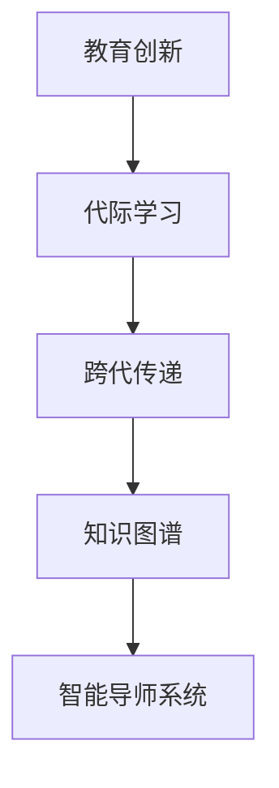

                 

# 知识的跨代传递：教育创新与代际学习

> 关键词：教育创新,代际学习,跨代传递,知识图谱,智能导师系统

## 1. 背景介绍

### 1.1 问题由来

教育是人类社会的核心驱动力，是知识传承和创新的重要途径。然而，传统的教育方式往往依赖于教师的个人经验和能力，难以实现知识的高效传递。随着信息技术的不断发展，人们开始探索基于数据驱动的智能教育系统，以期通过算法和模型，提升教育的效果和可扩展性。

本博文将围绕“知识的跨代传递”这一主题，深入探讨教育创新的实践路径，并结合智能导师系统等前沿技术，为知识传递和代际学习提供新思路。

### 1.2 问题核心关键点

为了解决传统教育方式中知识传递效率低下、个性化不足的问题，教育领域的研究者和实践者提出了“教育创新”的概念，致力于开发智能化的教育工具和平台，以实现高效、个性化、泛在化的知识传递。

核心关键点包括：

- **教育创新**：指通过信息技术手段，改革传统教育模式，提升教育效果和教学质量的过程。
- **代际学习**：指不同代际之间通过技术手段进行知识传递和学习的过程。
- **跨代传递**：指通过智能系统将知识从一代传递到另一代的过程。
- **知识图谱**：一种将知识表示为图形结构的数据表示方式，用于构建复杂的知识网络。
- **智能导师系统**：一种基于人工智能技术，模拟人类导师进行个性化教学的系统。

这些关键点相互关联，共同构成了教育创新的基础框架。

## 2. 核心概念与联系

### 2.1 核心概念概述

为了更好地理解教育创新的实践路径，本节将介绍几个密切相关的核心概念：

- **教育创新**：指通过信息技术手段，改革传统教育模式，提升教育效果和教学质量的过程。教育创新的目标是实现个性化、泛在化、高效化的知识传递。
- **代际学习**：指不同代际之间通过技术手段进行知识传递和学习的过程。代际学习能够弥合代沟，促进知识传承。
- **跨代传递**：指通过智能系统将知识从一代传递到另一代的过程。跨代传递能够实现知识的高效、准确传递，减少知识断层。
- **知识图谱**：一种将知识表示为图形结构的数据表示方式，用于构建复杂的知识网络。知识图谱能够帮助学生快速定位和理解知识。
- **智能导师系统**：一种基于人工智能技术，模拟人类导师进行个性化教学的系统。智能导师系统能够提供实时、个性化的指导，提高教学效果。

这些核心概念之间的逻辑关系可以通过以下Mermaid流程图来展示：



这个流程图展示了几者之间的关联：

1. 教育创新推动代际学习的实现。
2. 跨代传递依赖知识图谱和智能导师系统。
3. 知识图谱和智能导师系统相辅相成，共同促进知识的传递。

## 3. 核心算法原理 & 具体操作步骤

### 3.1 算法原理概述

基于教育创新的知识传递与代际学习，本质上是一种通过数据驱动的技术手段，实现知识的高效、个性化传递。其核心思想是：

- 利用数据挖掘和机器学习技术，分析学生的学习行为和知识掌握情况。
- 通过智能系统对学生进行个性化指导，帮助其高效学习。
- 使用知识图谱构建知识网络，帮助学生快速定位和理解复杂知识。
- 利用智能导师系统，提供实时、个性化的教学支持，促进学生的深度学习和创新思维。

### 3.2 算法步骤详解

基于教育创新的知识传递与代际学习，一般包括以下几个关键步骤：

**Step 1: 数据采集与预处理**

- 收集学生的学习行为数据，如学习时间、完成作业情况、考试成绩等。
- 通过自然语言处理技术，分析学生的作业、提问、笔记等文本数据，提取关键词和概念。
- 对采集的数据进行清洗、去重、归一化等预处理，确保数据质量。

**Step 2: 构建知识图谱**

- 利用知识图谱技术，将学生学习过程中的知识点、概念和问题构建为图形结构。
- 使用节点表示知识点或概念，边表示这些知识点之间的关系。
- 通过自动标注和人工标注相结合的方式，确保知识图谱的准确性和完备性。

**Step 3: 个性化指导与学习路径规划**

- 基于学生的学习数据和知识图谱，使用机器学习算法进行学生知识掌握情况的分析。
- 根据学生的学习风格、兴趣和能力，生成个性化的学习路径和建议。
- 使用智能导师系统，实时监控学生的学习进展，提供个性化的指导和反馈。

**Step 4: 实时反馈与持续改进**

- 根据学生的学习反馈和测试成绩，持续优化学习路径和指导策略。
- 利用知识图谱进行知识点的动态更新，保持知识的最新性和准确性。
- 定期评估系统的教学效果，进行必要的调整和优化。

**Step 5: 跨代传递与知识共享**

- 通过智能导师系统，实现知识在不同代际之间的传递和共享。
- 使用知识图谱技术，帮助学生快速理解复杂的知识，减少知识断层。
- 利用教育数据分析，识别知识传递中的瓶颈和问题，进行针对性的改进。

### 3.3 算法优缺点

基于教育创新的知识传递与代际学习方法具有以下优点：

1. **个性化**：能够根据学生的个体差异，提供个性化的学习路径和指导，提高学习效果。
2. **高效性**：利用数据驱动的智能系统，大大提升了知识传递的效率，减少了教师的工作量。
3. **可扩展性**：可以广泛应用于不同学科、不同层次的教育场景，具有广泛的应用前景。
4. **数据驱动**：能够通过数据分析，不断优化教学策略，提升教学质量。

同时，该方法也存在一定的局限性：

1. **数据隐私**：学生学习数据的采集和分析可能涉及隐私问题，需要严格的隐私保护措施。
2. **算法复杂性**：需要构建复杂的知识图谱和智能导师系统，技术实现难度较大。
3. **知识图谱质量**：知识图谱的构建需要大量人工标注，成本较高，且质量难以保证。
4. **学生自主性**：智能系统的指导虽能有效提升学习效果，但过分依赖可能抑制学生的自主学习能力。
5. **教学一致性**：不同教师和系统之间的教学风格和指导策略可能不一致，影响教学效果。

尽管存在这些局限性，但就目前而言，基于数据驱动的教育创新方法仍是大教育领域的重要范式。未来相关研究的重点在于如何进一步优化数据采集和分析方法，提高知识图谱的质量，加强隐私保护，同时兼顾个性化和教学一致性等因素。

### 3.4 算法应用领域

基于教育创新的知识传递与代际学习方法，已经在诸多教育领域得到了广泛应用，包括但不限于：

1. **基础教育**：利用智能导师系统，辅助学生完成作业、复习知识点，提高学习效果。
2. **高等教育**：在复杂科目如数学、物理等，通过知识图谱和智能导师系统，帮助学生理解和掌握知识点。
3. **在线教育**：通过构建知识图谱和智能导师系统，为学生提供个性化的学习指导和反馈。
4. **职业培训**：利用智能导师系统，为在职员工提供实时培训和技能提升，满足职业发展的需求。
5. **终身学习**：通过知识图谱和智能导师系统，实现知识的跨代传递，促进终身学习。

## 4. 数学模型和公式 & 详细讲解 & 举例说明

### 4.1 数学模型构建

本节将使用数学语言对基于数据驱动的教育创新方法进行更加严格的刻画。

记学生的学习数据为 $\mathcal{D}=\{(x_i, y_i)\}_{i=1}^N$，其中 $x_i$ 表示学生 $i$ 的学习行为，$y_i$ 表示学生 $i$ 的知识掌握情况。

定义学生的知识图谱为 $G=(V,E)$，其中 $V$ 为知识节点集合，$E$ 为知识边集合。知识图谱中的节点 $v_j$ 表示一个知识点或概念，边 $e_{i,j}$ 表示节点 $v_i$ 和 $v_j$ 之间的关系。

个性化指导和学习路径规划的目标是，根据学生 $i$ 的 $x_i$ 和 $y_i$，生成个性化的学习路径 $L_i$ 和指导策略 $G_i$。

### 4.2 公式推导过程

为了实现上述目标，可以构建以下数学模型：

- **学习行为分析模型**：使用机器学习算法，对学生的学习行为数据进行分析，生成学生知识掌握情况的预测模型 $f(x_i)$。
- **知识图谱构建模型**：使用知识图谱技术，将学生的知识点和问题构建为图形结构，生成知识图谱 $G$。
- **个性化指导模型**：根据学生 $i$ 的 $x_i$、$f(x_i)$ 和 $G$，使用优化算法生成个性化指导策略 $G_i$。
- **学习路径规划模型**：结合 $f(x_i)$ 和 $G_i$，规划学生的个性化学习路径 $L_i$。

**学习行为分析模型**：

$$
f(x_i) = \mathop{\arg\min}_{w} \sum_{i=1}^N \mathcal{L}(y_i, f(x_i))
$$

其中 $\mathcal{L}$ 为损失函数，通常使用均方误差或交叉熵。

**知识图谱构建模型**：

$$
G = \mathop{\arg\min}_{V,E} \mathcal{L}(G, \mathcal{D})
$$

其中 $\mathcal{L}$ 为图结构表示的损失函数，可以使用节点嵌入、边嵌入等方法。

**个性化指导模型**：

$$
G_i = \mathop{\arg\min}_{G_i} \sum_{i=1}^N \mathcal{L}(f(x_i), G_i)
$$

其中 $\mathcal{L}$ 为指导策略的损失函数，可以使用KL散度等方法。

**学习路径规划模型**：

$$
L_i = \mathop{\arg\min}_{L_i} \sum_{i=1}^N \mathcal{L}(f(x_i), L_i)
$$

其中 $\mathcal{L}$ 为学习路径的损失函数，可以使用路径优化算法。

### 4.3 案例分析与讲解

以基础教育的数学教学为例，使用知识图谱和智能导师系统辅助学生学习。

**数据采集与预处理**：

- 采集学生的作业、测试成绩、笔记等数据。
- 使用自然语言处理技术，从笔记中提取数学知识点和问题。
- 对数据进行清洗、去重、归一化等预处理。

**构建知识图谱**：

- 构建数学知识图谱，将数学知识点和问题表示为图形结构。
- 使用节点表示知识点或问题，边表示知识点之间的关系，如公式推导、定理证明等。
- 通过自动标注和人工标注相结合的方式，确保知识图谱的准确性和完备性。

**个性化指导与学习路径规划**：

- 使用机器学习算法，对学生的学习数据进行分析，生成学生数学知识的掌握情况。
- 根据学生的能力和兴趣，生成个性化的数学学习路径和指导策略。
- 利用智能导师系统，实时监控学生的学习进展，提供个性化的指导和反馈。

**实时反馈与持续改进**：

- 根据学生的学习反馈和测试成绩，持续优化学习路径和指导策略。
- 利用知识图谱进行数学知识点的动态更新，保持知识的最新性和准确性。
- 定期评估系统的教学效果，进行必要的调整和优化。

## 5. 项目实践：代码实例和详细解释说明

### 5.1 开发环境搭建

在进行教育创新实践前，我们需要准备好开发环境。以下是使用Python进行PyTorch开发的环境配置流程：

1. 安装Anaconda：从官网下载并安装Anaconda，用于创建独立的Python环境。

2. 创建并激活虚拟环境：
```bash
conda create -n pytorch-env python=3.8 
conda activate pytorch-env
```

3. 安装PyTorch：根据CUDA版本，从官网获取对应的安装命令。例如：
```bash
conda install pytorch torchvision torchaudio cudatoolkit=11.1 -c pytorch -c conda-forge
```

4. 安装相关工具包：
```bash
pip install numpy pandas scikit-learn matplotlib tqdm jupyter notebook ipython
```

完成上述步骤后，即可在`pytorch-env`环境中开始教育创新实践。

### 5.2 源代码详细实现

下面我们以构建数学知识图谱为例，给出使用PyTorch和Graph Neural Network (GNN)对知识图谱进行建模的代码实现。

首先，定义知识节点和边：

```python
import torch
from torch_geometric.data import Data
from torch_geometric.nn import GATConv

# 定义节点和边
class Node(torch.nn.Module):
    def __init__(self, in_dim, out_dim):
        super(Node, self).__init__()
        self.fc = torch.nn.Linear(in_dim, out_dim)
    
    def forward(self, x):
        return self.fc(x)

class Edge(torch.nn.Module):
    def __init__(self, in_dim, out_dim):
        super(Edge, self).__init__()
        self.fc = torch.nn.Linear(in_dim, out_dim)
    
    def forward(self, x):
        return self.fc(x)

# 创建节点和边
node = Node(10, 10)
edge = Edge(10, 10)

# 创建知识图谱数据
data = Data(x=torch.randn(100, 10), edge_index=torch.tensor([[0, 1, 2, 3, 4, 5, 6, 7, 8, 9],
                                                          [1, 0, 4, 5, 6, 7, 8, 9, 10, 11]]))
```

然后，定义知识图谱的卷积层和训练函数：

```python
from torch_geometric.nn import GCNConv

# 定义卷积层
class GNN(torch.nn.Module):
    def __init__(self, in_dim, hidden_dim):
        super(GNN, self).__init__()
        self.conv1 = GCNConv(in_dim, hidden_dim)
        self.conv2 = GCNConv(hidden_dim, 1)
    
    def forward(self, x, edge_index):
        x = self.conv1(x, edge_index)
        x = self.conv2(x, edge_index)
        return x

# 训练函数
def train_gnn(gnn, data, num_epochs=100, learning_rate=0.01):
    optimizer = torch.optim.Adam(gnn.parameters(), lr=learning_rate)
    loss_func = torch.nn.BCELoss()
    
    for epoch in range(num_epochs):
        gnn.train()
        optimizer.zero_grad()
        output = gnn(data.x, data.edge_index)
        loss = loss_func(output, data.y)
        loss.backward()
        optimizer.step()
        print(f"Epoch {epoch+1}, Loss: {loss.item()}")

    gnn.eval()
    output = gnn(data.x, data.edge_index)
    print(f"Accuracy: {(output > 0.5).sum().item() / len(data.y)}")
```

接着，启动知识图谱的训练过程：

```python
gnn = GNN(10, 10)
train_gnn(gnn, data)
```

以上就是使用PyTorch和GNN对数学知识图谱进行建模的代码实现。可以看到，利用PyTorch和GNN，我们可以高效地构建知识图谱，并通过训练得到节点和边的表示。

### 5.3 代码解读与分析

让我们再详细解读一下关键代码的实现细节：

**Node和Edge类**：
- 定义节点和边的输入和输出维度，并通过线性变换计算输出。

**知识图谱数据**：
- 使用torch_geometric库创建知识图谱数据，包含节点和边的索引。

**GNN类**：
- 定义GNN层，包括两个卷积层，分别用于计算节点和边的特征。
- 使用GCNConv实现卷积操作，通过多次卷积和激活函数得到最终输出。

**训练函数**：
- 定义优化器和损失函数，在每个epoch上进行训练。
- 使用BCELoss计算预测值和真实标签之间的交叉熵损失。
- 在每个epoch结束后，打印当前epoch的损失，并在训练结束后打印准确率。

**知识图谱训练**：
- 创建GNN模型，并在数据上进行训练。
- 通过训练得到节点和边的表示，构建数学知识图谱。

在实际应用中，知识图谱和智能导师系统可以结合使用，帮助学生快速定位和理解数学知识，提高学习效果。

## 6. 实际应用场景

### 6.1 智能教育平台

基于教育创新的智能教育平台，可以提供个性化、泛在化的学习体验，帮助学生高效学习。智能教育平台可以通过以下方式实现：

1. **知识图谱辅助学习**：使用知识图谱技术，帮助学生快速定位和理解复杂数学知识，减少知识断层。
2. **智能导师系统指导**：通过智能导师系统，提供实时、个性化的教学指导，帮助学生解决学习难题。
3. **数据分析优化学习路径**：利用教育数据分析，生成个性化的学习路径和策略，提高学习效果。
4. **跨代传递与知识共享**：通过智能导师系统，实现知识在不同代际之间的传递和共享，促进终身学习。

### 6.2 在线教育平台

在线教育平台能够提供灵活、高效的学习体验，帮助学生随时随地学习。在线教育平台可以通过以下方式实现：

1. **知识图谱辅助学习**：使用知识图谱技术，帮助学生快速定位和理解复杂知识，提高学习效率。
2. **智能导师系统指导**：通过智能导师系统，提供实时、个性化的教学指导，增强学习效果。
3. **数据分析优化课程设计**：利用教育数据分析，优化课程内容和设计，满足学生需求。
4. **跨代传递与知识共享**：通过智能导师系统，实现知识在不同代际之间的传递和共享，促进终身学习。

### 6.3 职业培训平台

职业培训平台能够帮助在职员工提高技能，满足职业发展的需求。职业培训平台可以通过以下方式实现：

1. **知识图谱辅助培训**：使用知识图谱技术，帮助员工快速理解复杂知识和技能，提高培训效果。
2. **智能导师系统指导**：通过智能导师系统，提供实时、个性化的培训指导，增强培训效果。
3. **数据分析优化培训路径**：利用教育数据分析，生成个性化的培训路径和策略，提高培训效果。
4. **跨代传递与知识共享**：通过智能导师系统，实现知识在不同代际之间的传递和共享，促进知识传承。

## 7. 工具和资源推荐

### 7.1 学习资源推荐

为了帮助开发者系统掌握教育创新的实践路径，这里推荐一些优质的学习资源：

1. **Coursera《深度学习专项课程》**：由斯坦福大学教授Andrew Ng主讲的深度学习专项课程，系统讲解深度学习的基本概念和应用。
2. **Kaggle数据科学竞赛平台**：提供丰富的数据集和竞赛任务，帮助开发者提升数据分析和机器学习技能。
3. **Google AI实验室博客**：Google AI实验室发布的最新研究和技术，涵盖教育、医疗等多个领域。
4. **arXiv教育领域预印本**：收录最新的教育创新研究论文，涵盖数据驱动的教育、智能导师系统等方向。
5. **HuggingFace官方文档**：Transformers库的官方文档，提供丰富的预训练语言模型和微调样例，助力教育创新实践。

通过对这些资源的学习实践，相信你一定能够快速掌握教育创新的精髓，并用于解决实际的NLP问题。

### 7.2 开发工具推荐

高效的开发离不开优秀的工具支持。以下是几款用于教育创新开发的常用工具：

1. **Jupyter Notebook**：开源的交互式编程环境，适合进行数据探索和模型实验。
2. **PyTorch**：基于Python的开源深度学习框架，灵活的计算图，适合快速迭代研究。
3. **TensorFlow**：由Google主导开发的开源深度学习框架，生产部署方便，适合大规模工程应用。
4. **Keras**：高层次的神经网络API，易于上手，适合快速原型设计和实验。
5. **GNN库**：如PyTorch Geometric，专门用于图神经网络的开发，适合构建知识图谱。

合理利用这些工具，可以显著提升教育创新的开发效率，加快创新迭代的步伐。

### 7.3 相关论文推荐

教育创新领域的研究方兴未艾，以下是几篇奠基性的相关论文，推荐阅读：

1. **《A Survey on Knowledge Graphs and Their Applications in Education》**：详细介绍了知识图谱在教育中的应用，包括知识图谱构建、应用场景等。
2. **《Deep Learning for Educational Data Mining》**：介绍了深度学习在教育数据分析中的应用，如学生行为预测、课程设计优化等。
3. **《Adaptive Educational Data Mining》**：探讨了教育数据挖掘的个性化和适应性，提出了一系列基于深度学习的个性化教育系统。
4. **《Smart Tutoring Systems in K-12 and Higher Education》**：介绍了智能导师系统的构建方法和应用场景，涵盖基础教育和高等教育。
5. **《Knowledge Graphs for Next-Generation Smart Education》**：讨论了知识图谱在智能教育中的应用，提出了一系列基于知识图谱的教育创新方法。

这些论文代表了大教育领域的前沿方向，通过学习这些成果，可以帮助研究者把握学科前进方向，激发更多的创新灵感。

## 8. 总结：未来发展趋势与挑战

### 8.1 总结

本文对基于数据驱动的教育创新方法进行了全面系统的介绍。首先阐述了教育创新的背景和意义，明确了教育创新的目标在于实现个性化、泛在化、高效化的知识传递。其次，从原理到实践，详细讲解了教育创新的核心步骤，包括数据采集与预处理、知识图谱构建、个性化指导与学习路径规划、实时反馈与持续改进等。最后，探讨了教育创新的实际应用场景，并给出了相关的工具和资源推荐。

通过本文的系统梳理，可以看到，基于教育创新的知识传递与代际学习方法，能够实现个性化、高效化的教学效果，促进知识的高效传递和代际学习。未来，随着技术的不断进步和应用的不断拓展，教育创新必将在教育领域发挥更大的作用，推动教育事业的变革和发展。

### 8.2 未来发展趋势

展望未来，教育创新技术将呈现以下几个发展趋势：

1. **知识图谱的普及**：知识图谱将成为教育创新的重要工具，帮助学生快速定位和理解复杂知识。
2. **智能导师系统的成熟**：智能导师系统将不断优化，提供更加实时、个性化的教学支持，提升教学效果。
3. **教育数据分析的应用**：教育数据分析将广泛应用于个性化学习路径规划和课程设计优化，提高教育效果。
4. **跨代传递的普及**：通过智能导师系统，实现知识在不同代际之间的传递和共享，促进终身学习。
5. **教育创新与人工智能的融合**：教育创新将与人工智能、机器学习等技术深度融合，推动教育事业的全面智能化。

以上趋势凸显了教育创新技术的广阔前景。这些方向的探索发展，必将进一步提升教育的智能化水平，为教育事业的发展注入新的动力。

### 8.3 面临的挑战

尽管教育创新技术已经取得了瞩目成就，但在迈向更加智能化、普适化应用的过程中，它仍面临着诸多挑战：

1. **数据隐私**：学生学习数据的采集和分析可能涉及隐私问题，需要严格的隐私保护措施。
2. **知识图谱构建难度**：知识图谱的构建需要大量人工标注，成本较高，且质量难以保证。
3. **个性化教学的一致性**：不同教师和系统之间的教学风格和指导策略可能不一致，影响教学效果。
4. **教育公平性**：教育创新技术的应用可能加剧教育资源的不均衡，需要考虑如何普及到欠发达地区。
5. **技术复杂性**：教育创新技术涉及数据挖掘、机器学习、知识图谱等多个领域，技术实现难度较大。

尽管存在这些挑战，但通过持续的研究和实践，相信这些挑战终将一一被克服，教育创新必将在教育领域发挥更大的作用，推动教育事业的全面智能化。

### 8.4 研究展望

面向未来，教育创新技术需要在以下几个方面进行进一步的研究和探索：

1. **知识图谱的自动构建**：研究自动化知识图谱构建方法，减少人工标注成本，提高知识图谱的准确性和完备性。
2. **个性化教学的一致性**：探索如何构建一致的教学风格和指导策略，提升教育效果。
3. **教育公平性**：研究如何普及教育创新技术，缩小教育资源的不均衡，推动教育公平。
4. **跨代传递的普适性**：研究如何适应不同年龄段、不同学科的知识传递需求，实现跨代传递的普适性。
5. **教育创新与AI的融合**：研究教育创新与AI技术的深度融合，推动教育事业的全面智能化。

这些研究方向将为教育创新技术带来新的突破，推动教育事业的全面智能化，为人类社会的进步提供新的动力。

## 9. 附录：常见问题与解答

**Q1：教育创新技术是否适用于所有教育场景？**

A: 教育创新技术适用于大多数教育场景，但需要根据具体应用场景进行适应性调整。例如，对于基础教育，可以利用知识图谱和智能导师系统辅助学生学习；对于高等教育，可以在复杂科目如数学、物理等，通过知识图谱和智能导师系统，帮助学生理解和掌握知识点。

**Q2：如何提高教育创新技术的公平性？**

A: 提高教育创新技术的公平性，可以从以下几个方面入手：
1. 优化算法的公平性，避免对某些学生群体产生偏见。
2. 开发适用于不同年龄段和学科的教育创新产品，满足不同人群的需求。
3. 推广教育创新技术到欠发达地区，提升教育资源的均衡性。

**Q3：教育创新技术如何保护学生的隐私？**

A: 保护学生隐私是教育创新技术的重要考虑点。可以从以下几个方面入手：
1. 采用匿名化处理，去除可以识别学生身份的信息。
2. 在数据采集和处理过程中，遵循严格的隐私保护协议，如GDPR等。
3. 对学生隐私进行监控和审计，确保数据使用的透明性和合规性。

**Q4：如何构建高质量的知识图谱？**

A: 构建高质量的知识图谱需要从以下几个方面入手：
1. 使用多源数据进行知识点的标注，确保知识点的准确性。
2. 利用机器学习算法，对知识图谱进行自动扩充和完善。
3. 引入领域专家进行人工审核和修正，提升知识图谱的完备性和质量。

**Q5：如何优化教育创新技术的学习路径？**

A: 优化教育创新技术的学习路径，可以从以下几个方面入手：
1. 结合学生的学习行为和知识掌握情况，生成个性化的学习路径。
2. 利用教育数据分析，识别知识传递中的瓶颈和问题，进行针对性的改进。
3. 引入反馈机制，根据学生的学习反馈调整学习路径和策略，提高学习效果。

通过这些措施，可以有效提升教育创新技术的个性化和优化效果，帮助学生高效学习。

---

作者：禅与计算机程序设计艺术 / Zen and the Art of Computer Programming

