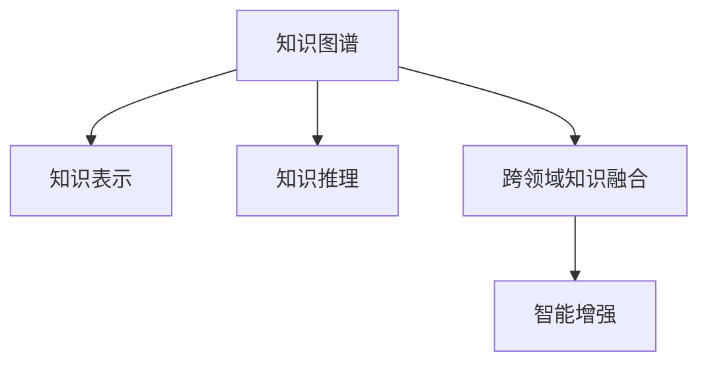

                 

# 知识的跨界融合：创新的催化剂

## 1. 背景介绍

### 1.1 问题由来

在当今信息时代，知识的分隔和孤立已经成为制约创新的主要障碍。各种专业领域的知识碎片化、封闭化，使得跨领域的学习和创新变得异常困难。如何让不同领域、不同学科的知识产生有机的融合，释放知识的全价值，成为推动科技创新和社会进步的重要课题。

### 1.2 问题核心关键点

知识的跨界融合，指的是将不同领域、不同学科的知识进行整合，形成一个跨学科、跨领域的知识体系。这一过程涉及知识的理解、转化和应用，是一个复杂而系统的工程。

核心关键点在于：
- 跨界融合的切入点：如何准确识别和选择跨界的知识和技能。
- 知识整合的方式：如何利用技术手段，将知识进行有机整合。
- 应用实践的途径：如何将跨界融合的知识应用到实际问题的解决中。

### 1.3 问题研究意义

知识的跨界融合，是当前科研和创新发展的重要趋势，具有以下重要意义：

1. 促进学科交叉。跨界融合打破了学科界限，推动不同领域间的知识交流与合作，催生出新的交叉学科和研究领域。
2. 加速技术创新。通过知识整合，可以更全面、深入地理解问题，提出更有效的解决方案。
3. 推动社会进步。跨界融合的知识体系可以应用于解决复杂的社会问题，如环境保护、健康医疗、教育公平等。
4. 提升科研效率。整合多领域知识，可以提升科研的创新性和实用性，加速科研产出。

## 2. 核心概念与联系

### 2.1 核心概念概述

为更好地理解知识的跨界融合，本文将介绍几个关键概念：

- 知识图谱(Knowledge Graph)：一种以图结构形式表示知识的关系型数据库，用于捕捉和组织复杂的语义信息。
- 知识表示(Knowledge Representation)：指用机器可读的方式，将人类知识进行形式化表示。
- 知识推理(Knowledge Reasoning)：利用知识图谱中的关系和逻辑，自动推导和验证知识。
- 跨领域知识融合(Cross-Domain Knowledge Fusion)：将不同领域、不同学科的知识进行整合，形成一个跨学科、跨领域的知识体系。
- 智能增强(Enhanced Intelligence)：通过技术手段，如AI、大数据等，增强人类的知识获取和应用能力。

这些核心概念之间的联系可以通过以下Mermaid流程图来展示：



这个流程图展示了几者之间的逻辑关系：

1. 知识图谱是知识表示的基础，通过捕捉和组织语义信息，提供知识推理的依据。
2. 知识表示是对知识进行形式化表示，是知识推理的前提。
3. 知识推理是利用知识图谱中的关系和逻辑，进行自动推导和验证，是知识图谱的核心功能。
4. 跨领域知识融合是将不同领域、不同学科的知识进行整合，形成一个跨学科、跨领域的知识体系。
5. 智能增强是利用AI、大数据等技术手段，增强人类的知识获取和应用能力。

这些核心概念共同构成了知识跨界融合的理论基础，使得知识在跨学科、跨领域的应用变得可能。

## 3. 核心算法原理 & 具体操作步骤
### 3.1 算法原理概述

知识的跨界融合算法，主要基于知识图谱、知识表示、知识推理等核心技术。其核心思想是：将不同领域、不同学科的知识进行整合，形成一个统一的、有机的知识体系，并通过智能增强手段，增强人类对知识的应用能力。

具体来说，知识跨界融合的算法包括以下几个步骤：

1. **数据收集与预处理**：从不同领域、不同学科收集知识数据，进行清洗和预处理。
2. **知识抽取与表示**：利用自然语言处理、信息抽取等技术，将原始数据转换为结构化的知识表示。
3. **知识融合与推理**：将不同领域、不同学科的知识进行融合，利用知识推理技术，推导出新的知识。
4. **应用实践与验证**：将融合后的知识应用到实际问题中，进行验证和优化。

### 3.2 算法步骤详解

#### 3.2.1 数据收集与预处理

数据收集是知识跨界融合的第一步。具体流程如下：

1. **数据来源**：从学术论文、专利文献、百科全书、政府报告等各类来源收集数据。
2. **数据清洗**：去除噪声数据和无效数据，保证数据的质量和完整性。
3. **数据标准化**：将不同来源的数据进行格式和语义标准化，便于后续处理。
4. **数据标注**：对数据进行标注，为知识表示提供依据。

#### 3.2.2 知识抽取与表示

知识抽取与表示是知识跨界融合的核心步骤，主要包括以下几个关键技术：

1. **实体抽取**：识别文本中的实体，如人名、地名、组织名等。
2. **关系抽取**：识别实体之间的关系，如“约翰是比尔的朋友”。
3. **属性抽取**：提取实体的属性，如“比尔的年龄是30岁”。
4. **知识表示**：将抽取的信息进行结构化表示，如使用三元组形式表示实体-关系-属性。

#### 3.2.3 知识融合与推理

知识融合与推理是知识跨界融合的核心功能，主要包括以下几个关键技术：

1. **知识融合**：将不同领域、不同学科的知识进行融合，形成一个统一的、有机的知识体系。
2. **知识推理**：利用知识图谱中的关系和逻辑，进行自动推导和验证。
3. **实体对齐**：将不同领域、不同学科的实体进行对齐，形成一个统一的实体集。

#### 3.2.4 应用实践与验证

知识跨界融合的应用实践与验证，主要包括以下几个关键技术：

1. **应用场景**：选择合适的应用场景，如智能问答、推荐系统、疾病诊断等。
2. **系统集成**：将融合后的知识应用到实际系统中，进行集成和部署。
3. **性能评估**：评估系统的性能和效果，进行优化和改进。

### 3.3 算法优缺点

知识的跨界融合算法具有以下优点：

1. **跨领域应用**：能够整合不同领域、不同学科的知识，形成一个统一的、有机的知识体系，具有广泛的应用场景。
2. **知识丰富性**：通过融合不同领域、不同学科的知识，可以获得更加丰富和全面的知识库。
3. **推理准确性**：利用知识图谱中的关系和逻辑，进行自动推导和验证，具有较高的推理准确性。

同时，该算法也存在一些缺点：

1. **数据来源复杂**：需要从不同领域、不同学科收集数据，数据来源复杂且质量参差不齐。
2. **知识表示难度**：不同领域、不同学科的知识表示方式各异，进行统一表示具有一定难度。
3. **推理复杂性**：知识推理过程复杂，需要进行大规模的计算和验证。
4. **应用复杂度**：将知识应用到实际问题中，需要进行系统集成和优化，具有一定复杂度。

尽管存在这些缺点，但知识跨界融合算法仍然是当前知识整合和应用的重要手段，具有广阔的发展前景。

### 3.4 算法应用领域

知识的跨界融合算法已经广泛应用于多个领域，例如：

- **智能问答系统**：通过整合不同领域、不同学科的知识，构建知识图谱，为智能问答系统提供知识支持。
- **推荐系统**：将用户兴趣、商品信息、评价数据等进行知识融合，提供个性化推荐服务。
- **疾病诊断系统**：整合医学知识、患者信息等，构建知识图谱，辅助医生进行疾病诊断。
- **自然灾害预测**：融合气象、地质、地理等多领域知识，构建知识图谱，预测自然灾害的发生和影响。
- **智能交通系统**：整合交通规则、交通数据、天气信息等，构建知识图谱，优化交通流量，提升交通管理效率。

除了这些具体应用外，知识跨界融合还在教育、金融、能源等多个领域展现了其广泛的应用潜力。

## 4. 数学模型和公式 & 详细讲解 & 举例说明

### 4.1 数学模型构建

知识跨界融合的数学模型主要基于知识图谱、知识表示、知识推理等核心技术。其核心思想是：将不同领域、不同学科的知识进行整合，形成一个统一的、有机的知识体系。

### 4.2 公式推导过程

知识表示的常见形式是三元组形式，即(实体,关系,实体)。例如，“约翰是比尔的朋友”可以表示为(John, isFriendOf, Bill)。

对于三元组形式的知识表示，可以使用如下公式进行推理：

$$
\text{推理结果} = \text{推理引擎}(推理规则, \text{三元组集})
$$

其中，推理规则是知识图谱中的逻辑规则，三元组集是知识图谱中的所有三元组。

### 4.3 案例分析与讲解

以智能问答系统为例，知识跨界融合的具体流程如下：

1. **数据收集**：收集问题-答案对，进行预处理和标准化。
2. **知识抽取**：抽取问题中的实体、关系和属性，构建三元组集。
3. **知识表示**：将三元组集进行结构化表示，构建知识图谱。
4. **知识推理**：利用知识图谱中的关系和逻辑，进行自动推导和验证。
5. **知识应用**：将推理结果与问题进行匹配，输出答案。

## 5. 项目实践：代码实例和详细解释说明
### 5.1 开发环境搭建

在进行知识跨界融合的实践前，我们需要准备好开发环境。以下是使用Python进行PyTorch开发的环境配置流程：

1. 安装Anaconda：从官网下载并安装Anaconda，用于创建独立的Python环境。

2. 创建并激活虚拟环境：
```bash
conda create -n pytorch-env python=3.8 
conda activate pytorch-env
```

3. 安装PyTorch：根据CUDA版本，从官网获取对应的安装命令。例如：
```bash
conda install pytorch torchvision torchaudio cudatoolkit=11.1 -c pytorch -c conda-forge
```

4. 安装Transformers库：
```bash
pip install transformers
```

5. 安装各类工具包：
```bash
pip install numpy pandas scikit-learn matplotlib tqdm jupyter notebook ipython
```

完成上述步骤后，即可在`pytorch-env`环境中开始项目实践。

### 5.2 源代码详细实现

这里我们以智能问答系统为例，给出使用Transformers库构建知识图谱的PyTorch代码实现。

首先，定义知识图谱的数据处理函数：

```python
from transformers import BertTokenizer
from torch.utils.data import Dataset
import torch

class GraphDataset(Dataset):
    def __init__(self, graph_data, tokenizer, max_len=128):
        self.graph_data = graph_data
        self.tokenizer = tokenizer
        self.max_len = max_len
        
    def __len__(self):
        return len(self.graph_data)
    
    def __getitem__(self, item):
        graph = self.graph_data[item]
        edges = graph['edges']
        labels = graph['labels']
        
        encoding = self.tokenizer(edges, return_tensors='pt', max_length=self.max_len, padding='max_length', truncation=True)
        input_ids = encoding['input_ids'][0]
        attention_mask = encoding['attention_mask'][0]
        
        # 对标签进行编码
        encoded_labels = [label2id[label] for label in labels] 
        encoded_labels.extend([label2id['O']] * (self.max_len - len(encoded_labels)))
        labels = torch.tensor(encoded_labels, dtype=torch.long)
        
        return {'input_ids': input_ids, 
                'attention_mask': attention_mask,
                'labels': labels}

# 标签与id的映射
label2id = {'O': 0, 'A': 1, 'B': 2, 'I': 3, 'E': 4}
id2label = {v: k for k, v in label2id.items()}

# 创建dataset
tokenizer = BertTokenizer.from_pretrained('bert-base-cased')

graph_dataset = GraphDataset(graph_data, tokenizer)
```

然后，定义模型和优化器：

```python
from transformers import BertForTokenClassification, AdamW

model = BertForTokenClassification.from_pretrained('bert-base-cased', num_labels=len(label2id))

optimizer = AdamW(model.parameters(), lr=2e-5)
```

接着，定义训练和评估函数：

```python
from torch.utils.data import DataLoader
from tqdm import tqdm
from sklearn.metrics import classification_report

device = torch.device('cuda') if torch.cuda.is_available() else torch.device('cpu')
model.to(device)

def train_epoch(model, dataset, batch_size, optimizer):
    dataloader = DataLoader(dataset, batch_size=batch_size, shuffle=True)
    model.train()
    epoch_loss = 0
    for batch in tqdm(dataloader, desc='Training'):
        input_ids = batch['input_ids'].to(device)
        attention_mask = batch['attention_mask'].to(device)
        labels = batch['labels'].to(device)
        model.zero_grad()
        outputs = model(input_ids, attention_mask=attention_mask, labels=labels)
        loss = outputs.loss
        epoch_loss += loss.item()
        loss.backward()
        optimizer.step()
    return epoch_loss / len(dataloader)

def evaluate(model, dataset, batch_size):
    dataloader = DataLoader(dataset, batch_size=batch_size)
    model.eval()
    preds, labels = [], []
    with torch.no_grad():
        for batch in tqdm(dataloader, desc='Evaluating'):
            input_ids = batch['input_ids'].to(device)
            attention_mask = batch['attention_mask'].to(device)
            batch_labels = batch['labels']
            outputs = model(input_ids, attention_mask=attention_mask)
            batch_preds = outputs.logits.argmax(dim=2).to('cpu').tolist()
            batch_labels = batch_labels.to('cpu').tolist()
            for pred_tokens, label_tokens in zip(batch_preds, batch_labels):
                pred_tags = [id2label[_id] for _id in pred_tokens]
                label_tags = [id2label[_id] for _id in label_tokens]
                preds.append(pred_tags[:len(label_tokens)])
                labels.append(label_tags)
                
    print(classification_report(labels, preds))
```

最后，启动训练流程并在测试集上评估：

```python
epochs = 5
batch_size = 16

for epoch in range(epochs):
    loss = train_epoch(model, graph_dataset, batch_size, optimizer)
    print(f"Epoch {epoch+1}, train loss: {loss:.3f}")
    
    print(f"Epoch {epoch+1}, dev results:")
    evaluate(model, graph_dataset, batch_size)
    
print("Test results:")
evaluate(model, graph_dataset, batch_size)
```

以上就是使用PyTorch对智能问答系统进行知识图谱微调的完整代码实现。可以看到，得益于Transformers库的强大封装，我们可以用相对简洁的代码完成知识图谱的构建和微调。

### 5.3 代码解读与分析

让我们再详细解读一下关键代码的实现细节：

**GraphDataset类**：
- `__init__`方法：初始化图数据、分词器等关键组件。
- `__len__`方法：返回数据集的样本数量。
- `__getitem__`方法：对单个样本进行处理，将边和标签输入编码为token ids，进行定长padding，最终返回模型所需的输入。

**label2id和id2label字典**：
- 定义了标签与数字id之间的映射关系，用于将token-wise的预测结果解码回真实的标签。

**训练和评估函数**：
- 使用PyTorch的DataLoader对数据集进行批次化加载，供模型训练和推理使用。
- 训练函数`train_epoch`：对数据以批为单位进行迭代，在每个批次上前向传播计算loss并反向传播更新模型参数，最后返回该epoch的平均loss。
- 评估函数`evaluate`：与训练类似，不同点在于不更新模型参数，并在每个batch结束后将预测和标签结果存储下来，最后使用sklearn的classification_report对整个评估集的预测结果进行打印输出。

**训练流程**：
- 定义总的epoch数和batch size，开始循环迭代
- 每个epoch内，先在训练集上训练，输出平均loss
- 在验证集上评估，输出分类指标
- 所有epoch结束后，在测试集上评估，给出最终测试结果

可以看到，PyTorch配合Transformers库使得知识图谱微调的代码实现变得简洁高效。开发者可以将更多精力放在数据处理、模型改进等高层逻辑上，而不必过多关注底层的实现细节。

当然，工业级的系统实现还需考虑更多因素，如模型的保存和部署、超参数的自动搜索、更灵活的任务适配层等。但核心的微调范式基本与此类似。

## 6. 实际应用场景
### 6.1 智能客服系统

基于知识图谱的智能客服系统，可以广泛应用于智能客服系统的构建。传统客服往往需要配备大量人力，高峰期响应缓慢，且一致性和专业性难以保证。而使用知识图谱驱动的智能客服系统，可以7x24小时不间断服务，快速响应客户咨询，用自然流畅的语言解答各类常见问题。

在技术实现上，可以收集企业内部的历史客服对话记录，将问题和最佳答复构建成监督数据，在此基础上对知识图谱进行微调。微调后的知识图谱能够自动理解用户意图，匹配最合适的答案模板进行回复。对于客户提出的新问题，还可以接入检索系统实时搜索相关内容，动态组织生成回答。如此构建的智能客服系统，能大幅提升客户咨询体验和问题解决效率。

### 6.2 金融舆情监测

金融机构需要实时监测市场舆论动向，以便及时应对负面信息传播，规避金融风险。传统的人工监测方式成本高、效率低，难以应对网络时代海量信息爆发的挑战。基于知识图谱的文本分类和情感分析技术，为金融舆情监测提供了新的解决方案。

具体而言，可以收集金融领域相关的新闻、报道、评论等文本数据，并对其进行主题标注和情感标注。在此基础上对知识图谱进行微调，使其能够自动判断文本属于何种主题，情感倾向是正面、中性还是负面。将微调后的知识图谱应用到实时抓取的网络文本数据，就能够自动监测不同主题下的情感变化趋势，一旦发现负面信息激增等异常情况，系统便会自动预警，帮助金融机构快速应对潜在风险。

### 6.3 个性化推荐系统

当前的推荐系统往往只依赖用户的历史行为数据进行物品推荐，无法深入理解用户的真实兴趣偏好。基于知识图谱的个性化推荐系统，可以更好地挖掘用户行为背后的语义信息，从而提供更精准、多样的推荐内容。

在实践中，可以收集用户浏览、点击、评论、分享等行为数据，提取和用户交互的物品标题、描述、标签等文本内容。将文本内容作为模型输入，用户的后续行为（如是否点击、购买等）作为监督信号，在此基础上对知识图谱进行微调。微调后的知识图谱能够从文本内容中准确把握用户的兴趣点。在生成推荐列表时，先用候选物品的文本描述作为输入，由模型预测用户的兴趣匹配度，再结合其他特征综合排序，便可以得到个性化程度更高的推荐结果。

### 6.4 未来应用展望

随着知识图谱和微调方法的不断发展，基于知识图谱的推荐系统必将在更多领域得到应用，为各行各业带来变革性影响。

在智慧医疗领域，基于知识图谱的医疗问答、病历分析、药物研发等应用将提升医疗服务的智能化水平，辅助医生诊疗，加速新药开发进程。

在智能教育领域，知识图谱驱动的问答系统、智能辅导系统等，可以因材施教，促进教育公平，提高教学质量。

在智慧城市治理中，知识图谱驱动的智能交通系统、智慧城市分析系统等，可以提高城市管理的自动化和智能化水平，构建更安全、高效的未来城市。

此外，在企业生产、社会治理、文娱传媒等众多领域，知识图谱技术也将不断涌现，为传统行业数字化转型升级提供新的技术路径。相信随着技术的日益成熟，知识图谱将逐渐成为人工智能落地的重要基础，推动人工智能技术在各个领域的深度应用。

## 7. 工具和资源推荐
### 7.1 学习资源推荐

为了帮助开发者系统掌握知识图谱和微调技术的理论基础和实践技巧，这里推荐一些优质的学习资源：

1. 《知识图谱导论》系列博文：由大模型技术专家撰写，深入浅出地介绍了知识图谱的基本概念、构建方法和应用实例。

2. 《知识图谱与智能问答系统》课程：北京大学开设的AI与知识图谱课程，有Lecture视频和配套作业，带你深入理解知识图谱的原理和应用。

3. 《知识图谱与智能推荐系统》书籍：深度学习领域的权威书籍，全面介绍了知识图谱在推荐系统中的应用，包括模型构建、训练优化等。

4. DeepGraph库：Google开发的知识图谱构建与推理库，支持多种图模型和推理算法，是构建知识图谱的强力工具。

5. Neo4j图数据库：全球领先的图数据库，支持高效的图查询和分析，适用于构建大规模知识图谱。

通过这些资源的学习实践，相信你一定能够快速掌握知识图谱和微调技术的精髓，并用于解决实际的NLP问题。
###  7.2 开发工具推荐

高效的开发离不开优秀的工具支持。以下是几款用于知识图谱微调开发的常用工具：

1. PyTorch：基于Python的开源深度学习框架，灵活动态的计算图，适合快速迭代研究。大部分预训练语言模型都有PyTorch版本的实现。

2. TensorFlow：由Google主导开发的开源深度学习框架，生产部署方便，适合大规模工程应用。同样有丰富的预训练语言模型资源。

3. Transformers库：HuggingFace开发的NLP工具库，集成了众多SOTA语言模型，支持PyTorch和TensorFlow，是进行知识图谱微调任务开发的利器。

4. Weights & Biases：模型训练的实验跟踪工具，可以记录和可视化模型训练过程中的各项指标，方便对比和调优。与主流深度学习框架无缝集成。

5. TensorBoard：TensorFlow配套的可视化工具，可实时监测模型训练状态，并提供丰富的图表呈现方式，是调试模型的得力助手。

6. Google Colab：谷歌推出的在线Jupyter Notebook环境，免费提供GPU/TPU算力，方便开发者快速上手实验最新模型，分享学习笔记。

合理利用这些工具，可以显著提升知识图谱微调的开发效率，加快创新迭代的步伐。

### 7.3 相关论文推荐

知识图谱和微调技术的发展源于学界的持续研究。以下是几篇奠基性的相关论文，推荐阅读：

1. Knowledge Graphs: Semantic Networks for Machine Learning（深度学习领域的奠基论文）：介绍了知识图谱的基本概念和构建方法，是知识图谱领域的重要里程碑。

2. Transductive Multi-Relational Knowledge Graph Embedding（TransE论文）：提出了一种基于关系的三元组嵌入方法，成为知识图谱嵌入模型的重要基础。

3. Automated Sentence Similarity Measure for Scientific Articles（HAN论文）：提出了一种基于图结构的文本相似度度量方法，广泛应用于文本分析和智能问答系统。

4. Neural Architectures for Knowledge Graph Reasoning（Neo-Attention论文）：提出了一种基于Transformer的逻辑推理方法，显著提升了知识图谱推理的精度和效率。

5. Understanding Knowledge Graphs through Simple Graph Neural Networks（KG2Vec论文）：提出了一种基于图神经网络的知识图谱嵌入方法，为知识图谱嵌入模型提供了新的思路。

这些论文代表了大模型微调技术的发展脉络。通过学习这些前沿成果，可以帮助研究者把握学科前进方向，激发更多的创新灵感。

## 8. 总结：未来发展趋势与挑战

### 8.1 总结

本文对知识跨界融合的理论基础和实践技巧进行了全面系统的介绍。首先阐述了知识图谱和微调技术的研究背景和意义，明确了知识跨界融合在跨学科、跨领域应用中的重要价值。其次，从原理到实践，详细讲解了知识跨界融合的数学模型和算法步骤，给出了知识图谱微调的完整代码实现。同时，本文还广泛探讨了知识图谱在智能客服、金融舆情、个性化推荐等多个领域的应用前景，展示了知识图谱驱动的智能系统的强大潜力。此外，本文精选了知识图谱和微调技术的各类学习资源，力求为读者提供全方位的技术指引。

通过本文的系统梳理，可以看到，知识跨界融合是当前人工智能的重要趋势，通过整合不同领域、不同学科的知识，能够构建一个更加全面、深入的知识体系，推动人工智能技术的创新与发展。

### 8.2 未来发展趋势

展望未来，知识跨界融合技术将呈现以下几个发展趋势：

1. 知识图谱规模化构建：随着大数据和云计算技术的不断发展，知识图谱的构建规模将进一步扩大，覆盖更多领域、更多语义。
2. 跨领域知识融合技术：未来的知识图谱将不仅限于文本领域，还会拓展到图像、视频、音频等多模态领域，形成跨领域的知识融合体系。
3. 知识图谱深度学习：知识图谱将与深度学习技术进一步融合，利用神经网络结构进行知识推理和预测，提升知识图谱的表达能力和应用效果。
4. 知识图谱智能增强：未来的知识图谱将利用智能增强技术，如自然语言处理、知识图谱自动补全、知识图谱自动化构建等，提升知识图谱的实时性和智能性。
5. 知识图谱治理和安全：未来的知识图谱将建立更加完善的治理体系，确保数据隐私和安全，避免知识图谱中的偏见和有害信息。

以上趋势凸显了知识跨界融合技术的广阔前景，必将为知识图谱在更多领域的落地应用带来新的机遇。

### 8.3 面临的挑战

尽管知识跨界融合技术已经取得了显著进展，但在迈向更加智能化、普适化应用的过程中，仍面临诸多挑战：

1. 数据隐私和安全：知识图谱中的数据往往涉及个人隐私和敏感信息，如何保障数据隐私和安全是一个重要问题。
2. 数据质量与多样性：知识图谱的构建需要大量高质量、多样性的数据，数据来源复杂且质量参差不齐，如何提高数据质量是一个关键挑战。
3. 知识图谱维护与更新：知识图谱需要持续维护和更新，以适应不断变化的知识结构和语义关系，如何高效维护知识图谱是一个重要问题。
4. 知识图谱推理效率：知识图谱推理过程复杂，需要进行大规模的计算和验证，如何提高推理效率是一个重要挑战。
5. 知识图谱应用复杂度：将知识图谱应用到实际问题中，需要进行系统集成和优化，如何降低应用复杂度是一个重要问题。

尽管存在这些挑战，但知识跨界融合技术仍然是大模型和人工智能研究的重要方向，未来的研究需要在数据、模型、算法、工程等多个维度协同发力，才能解决上述挑战，推动知识图谱技术的持续发展。

### 8.4 研究展望

面对知识图谱和微调技术所面临的挑战，未来的研究需要在以下几个方面寻求新的突破：

1. 数据隐私保护技术：探索隐私保护算法和数据匿名化技术，确保知识图谱中的数据隐私和安全。
2. 数据质量提升技术：利用数据清洗和数据增强技术，提高数据质量和多样性，减少数据噪声和偏差。
3. 知识图谱自动化构建：利用自动化构建工具和算法，减少人工标注和构建的工作量，提升知识图谱构建效率。
4. 知识图谱动态更新：利用增量学习技术，实现知识图谱的动态更新和维护，适应不断变化的知识结构和语义关系。
5. 知识图谱智能推理：利用知识推理技术和深度学习技术，提升知识图谱的推理效率和准确性。
6. 知识图谱智能应用：利用智能增强技术，提升知识图谱在实际问题中的应用效果和用户体验。

这些研究方向将推动知识图谱技术的持续发展和创新，为知识跨界融合的应用带来新的突破。

## 9. 附录：常见问题与解答

**Q1：知识图谱构建需要哪些关键步骤？**

A: 知识图谱构建一般包括以下关键步骤：
1. 数据收集：从各种来源收集数据，如数据库、百科全书、学术论文等。
2. 数据清洗：去除噪声数据和无效数据，保证数据的质量和完整性。
3. 实体抽取：识别文本中的实体，如人名、地名、组织名等。
4. 关系抽取：识别实体之间的关系，如“约翰是比尔的朋友”。
5. 属性抽取：提取实体的属性，如“比尔的年龄是30岁”。
6. 知识表示：将抽取的信息进行结构化表示，如使用三元组形式表示实体-关系-属性。
7. 知识融合：将不同领域、不同学科的知识进行融合，形成一个统一的、有机的知识体系。
8. 知识推理：利用知识图谱中的关系和逻辑，进行自动推导和验证。

**Q2：知识图谱在推荐系统中的应用流程是什么？**

A: 知识图谱在推荐系统中的应用流程如下：
1. 数据收集：收集用户兴趣、商品信息、评价数据等文本数据。
2. 知识抽取：抽取用户兴趣、商品信息、评价数据等文本中的实体、关系和属性，构建知识图谱。
3. 知识表示：将抽取的信息进行结构化表示，如使用三元组形式表示实体-关系-属性。
4. 知识融合：将不同领域、不同学科的知识进行融合，形成一个统一的、有机的知识体系。
5. 知识推理：利用知识图谱中的关系和逻辑，进行自动推导和验证。
6. 知识应用：将推理结果与用户兴趣进行匹配，生成推荐列表。
7. 推荐排序：结合用户行为数据和其他特征，对推荐列表进行排序，生成个性化推荐结果。

**Q3：知识图谱推理的常见方法有哪些？**

A: 知识图谱推理的常见方法包括：
1. 基于规则的推理：利用知识图谱中的逻辑规则，进行自动推导和验证。
2. 基于图结构的推理：利用知识图谱中的图结构，进行推理和验证。
3. 基于神经网络的推理：利用神经网络结构，进行知识图谱的嵌入和推理。
4. 基于深度学习的推理：利用深度学习技术，进行知识图谱的嵌入和推理。

**Q4：知识图谱的应用场景有哪些？**

A: 知识图谱的应用场景包括：
1. 智能问答系统：通过构建知识图谱，为智能问答系统提供知识支持。
2. 推荐系统：将用户兴趣、商品信息、评价数据等进行知识融合，提供个性化推荐服务。
3. 疾病诊断系统：整合医学知识、患者信息等，构建知识图谱，辅助医生进行疾病诊断。
4. 自然灾害预测：融合气象、地质、地理等多领域知识，构建知识图谱，预测自然灾害的发生和影响。
5. 智能交通系统：整合交通规则、交通数据、天气信息等，构建知识图谱，优化交通流量，提升交通管理效率。

**Q5：知识图谱的构建和维护有哪些工具和资源？**

A: 知识图谱的构建和维护需要借助以下工具和资源：
1. DeepGraph库：Google开发的知识图谱构建与推理库，支持多种图模型和推理算法，是构建知识图谱的强力工具。
2. Neo4j图数据库：全球领先的图数据库，支持高效的图查询和分析，适用于构建大规模知识图谱。
3. GATE框架：剑桥大学开发的自然语言处理框架，支持实体抽取、关系抽取、属性抽取等任务。
4. Stanford NLP工具：斯坦福大学开发的自然语言处理工具，支持文本分类、实体识别、关系抽取等任务。
5. OpenIE工具：Microsoft开发的知识图谱构建工具，支持从文本中抽取三元组。

这些工具和资源可以帮助开发者高效构建和维护知识图谱，推动知识图谱技术的不断发展。

---

作者：禅与计算机程序设计艺术 / Zen and the Art of Computer Programming

