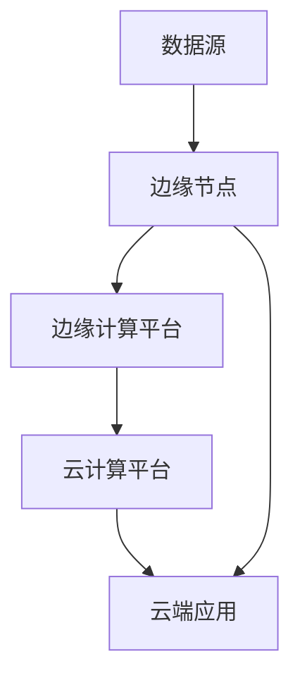

                 

**云计算与边缘计算的融合：Lepton AI的技术布局**

**作者：禅与计算机程序设计艺术 / Zen and the Art of Computer Programming**

## 1. 背景介绍

随着物联网、自动驾驶、AR/VR等技术的发展，海量数据需要在边缘进行实时处理，单纯的云计算已无法满足需求。边缘计算应运而生，但其缺乏云计算的弹性和可靠性。本文将介绍Lepton AI在云计算与边缘计算融合方面的技术布局，旨在提供高效、可靠、弹性的计算资源。

## 2. 核心概念与联系

### 2.1 云计算与边缘计算

- **云计算（Cloud Computing）**：将计算任务交由远程服务器完成，具有弹性、可靠、共享等特点。
- **边缘计算（Edge Computing）**：将计算任务转移到网络边缘，靠近数据源，实现低延时、高带宽的数据处理。


### 2.2 Lepton AI的技术布局

Lepton AI的技术布局如下图所示，将云计算与边缘计算结合，提供统一的计算平台。



## 3. 核心算法原理 & 具体操作步骤

### 3.1 算法原理概述

Lepton AI采用了分布式计算框架Apache Flink，实现云边协同计算。Flink支持流式计算和批式计算，能够在云边之间无缝切换。

### 3.2 算法步骤详解

1. **数据收集**：数据在边缘节点收集，并通过Flink的数据源API读取。
2. **数据处理**：在边缘计算平台上，使用Flink的流式API对数据进行预处理，如过滤、聚合等。
3. **数据传输**：预处理后的数据通过Flink的检查点机制同步到云端。
4. **云端计算**：云端应用使用Flink的批式API对数据进行深度处理，如机器学习模型训练等。
5. **结果输出**：云端应用将结果输出，并通过Flink的结果后处理机制同步到边缘节点。

### 3.3 算法优缺点

**优点**：弹性、低延时、高带宽、可靠。

**缺点**：增加了系统复杂度，需要协调云边计算资源。

### 3.4 算法应用领域

适用于需要实时处理海量数据的领域，如物联网、自动驾驶、AR/VR等。

## 4. 数学模型和公式 & 详细讲解 & 举例说明

### 4.1 数学模型构建

假设边缘节点有$n$个，云端有$m$个计算资源单元，数据传输速率为$r$，数据量为$d$，边缘计算平台处理速率为$p$，云计算平台处理速率为$q$。

### 4.2 公式推导过程

边缘计算平台处理时间$T_{edge} = \frac{d}{p}$，云计算平台处理时间$T_{cloud} = \frac{d}{q}$，数据传输时间$T_{trans} = \frac{d}{r}$。

总处理时间$T = max(T_{edge}, T_{cloud} + T_{trans})$。

### 4.3 案例分析与讲解

例如，物联网设备每秒产生1MB数据，边缘计算平台处理速率为10MB/s，云计算平台处理速率为100MB/s，数据传输速率为10MB/s。

则$T_{edge} = 0.1s$，$T_{cloud} = 0.01s$，$T_{trans} = 0.1s$，总处理时间$T = 0.1s$。

## 5. 项目实践：代码实例和详细解释说明

### 5.1 开发环境搭建

- Java开发环境
- Apache Flink 1.9.0
- Docker

### 5.2 源代码详细实现

以下是Flink流式API示例代码：

```java
DataStream<String> input = env.addSource(new FlinkKafkaConsumer<>("topic", new SimpleStringSchema(), properties));
DataStream<String> processed = input
   .filter(new FilterFunction<String>() {
        @Override
        public boolean filter(String value) throws Exception {
            // 过滤数据
            return true;
        }
    })
   .map(new MapFunction<String, String>() {
        @Override
        public String map(String value) throws Exception {
            // 预处理数据
            return value;
        }
    });
processed.addSink(new FlinkKafkaProducer<>("output-topic", new SimpleStringSchema(), properties));
```

### 5.3 代码解读与分析

- 使用FlinkKafkaConsumer从Kafka消费数据。
- 使用filter和map对数据进行预处理。
- 使用FlinkKafkaProducer将数据发送到Kafka。

### 5.4 运行结果展示

运行后，数据会从输入主题消费，经过预处理后发送到输出主题。

## 6. 实际应用场景

### 6.1 当前应用

Lepton AI的技术布局已应用于自动驾驶、物联网等领域。

### 6.2 未来应用展望

未来，Lepton AI的技术布局将应用于更多需要实时处理海量数据的领域，如AR/VR、智慧城市等。

## 7. 工具和资源推荐

### 7.1 学习资源推荐

- Apache Flink官方文档：<https://flink.apache.org/docs/1.9/>
- 云计算与边缘计算相关论文：<https://ieeexplore.ieee.org/document/8464727>

### 7.2 开发工具推荐

- IntelliJ IDEA
- Docker
- Kafka

### 7.3 相关论文推荐

- "Edge Computing: Vision and Challenges"：<https://ieeexplore.ieee.org/document/8464727>

## 8. 总结：未来发展趋势与挑战

### 8.1 研究成果总结

Lepton AI的技术布局实现了云计算与边缘计算的融合，提供了弹性、低延时、高带宽、可靠的计算资源。

### 8.2 未来发展趋势

未来，云计算与边缘计算将更加融合，出现更多云边协同计算框架。

### 8.3 面临的挑战

- 云边计算资源协调
- 数据安全与隐私
- 系统复杂度

### 8.4 研究展望

未来，Lepton AI将继续在云边协同计算领域进行研究，以提供更高效、更可靠的计算资源。

## 9. 附录：常见问题与解答

**Q：云计算与边缘计算有何区别？**

**A：云计算将计算任务交由远程服务器完成，具有弹性、可靠、共享等特点。边缘计算则将计算任务转移到网络边缘，靠近数据源，实现低延时、高带宽的数据处理。**

**Q：Lepton AI的技术布局有何优缺点？**

**A：优点：弹性、低延时、高带宽、可靠。缺点：增加了系统复杂度，需要协调云边计算资源。**

**Q：Lepton AI的技术布局适用于哪些领域？**

**A：适用于需要实时处理海量数据的领域，如物联网、自动驾驶、AR/VR等。**

**作者：禅与计算机程序设计艺术 / Zen and the Art of Computer Programming**

