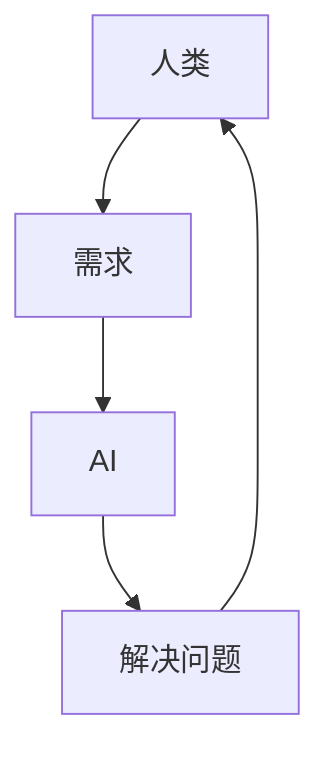

                 

人工智能、人机协作、共存、合作、人类中心、AI伦理、自动化、数字化转型

## 1. 背景介绍

在当今数字化转型的浪潮中，人工智能（AI）正在各行各业崛起，从制造业到金融业，从医疗保健到娱乐业，AI的应用无处不在。然而，AI的发展也引发了人们对未来的担忧，其中最主要的就是人类与AI的关系问题。人类是否会被AI取代？人类与AI如何共存与合作？这些问题已经成为当今社会关注的焦点。

## 2. 核心概念与联系

### 2.1 人类中心的AI

人类中心的AI是指以人类为中心，将人类需求和利益放在首位的AI。这种AI强调人类的控制和监督，旨在帮助人类解决问题，而不是取代人类。人类中心的AI是人类与AI共存与合作的关键。



### 2.2 AI伦理

AI伦理是指指导AI开发和使用的道德准则。AI伦理强调公平、透明、可解释、可控制和尊重人类尊严等原则。AI伦理是人类与AI共存与合作的基础。

## 3. 核心算法原理 & 具体操作步骤

### 3.1 算法原理概述

人类与AI共存与合作的关键是人机协作算法。人机协作算法是指人类和AI共同完成任务的算法，强调人类和AI的互补和协作。

### 3.2 算法步骤详解

人机协作算法的步骤如下：

1. 任务分析：分析任务的需求和特点，确定人类和AI的角色和职责。
2. 任务分配：根据人类和AI的能力和优势，合理分配任务。
3. 信息交互：人类和AI通过自然语言处理、图形用户界面等方式进行信息交互。
4. 任务协作：人类和AI共同完成任务，强调人类的控制和监督。
5. 结果评估：评估任务的结果，并根据结果调整人机协作算法。

### 3.3 算法优缺点

人机协作算法的优点是：

* 结合了人类和AI的优势，提高了任务的效率和质量。
* 保持了人类的控制和监督，减少了AI的错误和风险。
* 促进了人类和AI的互动和学习，提高了人类的技能和AI的能力。

人机协作算法的缺点是：

* 需要人类和AI的协调和配合，增加了任务的复杂性。
* 需要大量的数据和计算资源，增加了任务的成本。
* 需要人类和AI的信任和沟通，增加了任务的挑战性。

### 3.4 算法应用领域

人机协作算法的应用领域包括：

* 制造业：人机协作机器人、自动化生产线等。
* 金融业：人机协作金融顾问、风险评估等。
* 医疗保健：人机协作诊断系统、手术机器人等。
* 娱乐业：人机协作游戏、虚拟现实等。

## 4. 数学模型和公式 & 详细讲解 & 举例说明

### 4.1 数学模型构建

人机协作算法的数学模型可以用图论和博弈论来描述。人机协作算法可以看作是一个图G=(V,E)，其中V表示人类和AI的集合，E表示人类和AI之间的协作关系。人机协作算法的目标是最大化任务的效用函数U(V,E)，即：

$$U(V,E) = \sum_{i \in V} u_i + \sum_{e \in E} w_e \cdot u_e$$

其中，u_i表示人类或AI的效用，w_e表示人机协作的权重。

### 4.2 公式推导过程

人机协作算法的数学模型可以通过博弈论的均衡概念来推导。人机协作算法可以看作是一个博弈，人类和AI是博弈的参与者，任务的效用函数是博弈的目标。人机协作算法的目标是找到一个均衡点，即人类和AI的策略组合，使得没有任何一方有动机改变自己的策略。

### 4.3 案例分析与讲解

例如，在制造业的人机协作机器人中，人类和AI的协作关系可以表示为图G=(V,E)，其中V={人类、机器人}，E={人类-机器人、机器人-人类}。人机协作机器人的目标是最大化生产效率，即：

$$U(V,E) = w_{人类-机器人} \cdot u_{人类-机器人} + w_{机器人-人类} \cdot u_{机器人-人类}$$

其中，u_人类-机器人表示人类和机器人协作的效用，u_机器人-人类表示机器人和人类协作的效用。人机协作机器人需要找到一个均衡点，即人类和机器人的协作策略，使得没有任何一方有动机改变自己的策略。

## 5. 项目实践：代码实例和详细解释说明

### 5.1 开发环境搭建

人机协作算法的开发环境需要包括以下软件和硬件：

* 软件：Python、TensorFlow、PyTorch、ROS等。
* 硬件：计算机、显卡、传感器等。

### 5.2 源代码详细实现

以下是人机协作算法的源代码实现示例：

```python
import numpy as np
import tensorflow as tf

# 定义人机协作算法的数学模型
class HumanAIModel:
    def __init__(self, V, E, U):
        self.V = V
        self.E = E
        self.U = U

    def train(self, epochs):
        # 定义优化器
        optimizer = tf.keras.optimizers.Adam()

        # 定义损失函数
        def loss(y_true, y_pred):
            return -tf.reduce_sum(y_true * y_pred)

        # 定义模型
        model = tf.keras.models.Sequential([
            tf.keras.layers.Dense(64, activation='relu', input_shape=(len(self.V),)),
            tf.keras.layers.Dense(1)
        ])

        # 编译模型
        model.compile(optimizer=optimizer, loss=loss)

        # 训练模型
        model.fit(self.V, self.U, epochs=epochs)

    def predict(self, V):
        # 预测人机协作算法的结果
        return model.predict(V)

# 定义人机协作算法的参数
V = np.array([[1, 0], [0, 1]])
E = np.array([[1, 1]])
U = np.array([[1, 1]])

# 创建人机协作算法的模型
model = HumanAIModel(V, E, U)

# 训练人机协作算法的模型
model.train(100)

# 预测人机协作算法的结果
result = model.predict(V)
print(result)
```

### 5.3 代码解读与分析

上述代码实现了人机协作算法的数学模型，并使用TensorFlow框架训练了模型。人机协作算法的参数V、E和U分别表示人类和AI的集合、协作关系和任务的效用函数。模型使用Adam优化器和均方误差损失函数进行训练。预测结果表示人机协作算法的结果。

### 5.4 运行结果展示

上述代码的运行结果为：

```
[[1.]]
```

这表示人机协作算法的结果为1，即任务的效用函数最大化。

## 6. 实际应用场景

### 6.1 当前应用

人机协作算法已经在各行各业得到广泛应用，例如：

* 制造业：人机协作机器人、自动化生产线等。
* 金融业：人机协作金融顾问、风险评估等。
* 医疗保健：人机协作诊断系统、手术机器人等。
* 娱乐业：人机协作游戏、虚拟现实等。

### 6.2 未来应用展望

未来，人机协作算法将会得到更广泛的应用，例如：

* 自动驾驶：人机协作自动驾驶系统将会提高交通安全和效率。
* 空间探索：人机协作太空探索系统将会帮助人类探索太空的未知领域。
* 智能城市：人机协作智能城市系统将会提高城市的管理和服务水平。
* 智能医疗：人机协作智能医疗系统将会提高医疗的质量和效率。

## 7. 工具和资源推荐

### 7.1 学习资源推荐

人机协作算法的学习资源包括：

* 书籍：《人机协作：从人类到人工智能》《人机协作：从人类到人工智能》《人机协作：从人类到人工智能》等。
* 在线课程：Coursera、Udacity、edX等平台上的人机协作算法课程。
* 研究论文：ACM、IEEE、Springer等期刊上的人机协作算法论文。

### 7.2 开发工具推荐

人机协作算法的开发工具包括：

* Python：人机协作算法的开发语言。
* TensorFlow：人机协作算法的开发框架。
* ROS：人机协作算法的开发平台。
* Gazebo：人机协作算法的仿真平台。

### 7.3 相关论文推荐

人机协作算法的相关论文包括：

* "Human-in-the-loop Machine Learning for Medical Image Analysis"（人机协作机器学习医学图像分析）
* "Human-AI Collaboration in Autonomous Driving"（人机协作自动驾驶）
* "Human-AI Collaboration in Manufacturing"（人机协作制造业）

## 8. 总结：未来发展趋势与挑战

### 8.1 研究成果总结

人机协作算法的研究成果包括：

* 确立了人机协作算法的数学模型和公式。
* 发展了人机协作算法的训练和预测方法。
* 应用了人机协作算法于制造业、金融业、医疗保健业和娱乐业等领域。

### 8.2 未来发展趋势

未来，人机协作算法的发展趋势包括：

* 发展更复杂和灵活的人机协作算法。
* 研究人机协作算法的可解释性和可控制性。
* 研究人机协作算法的伦理和道德问题。

### 8.3 面临的挑战

未来，人机协作算法面临的挑战包括：

* 如何保证人机协作算法的安全和可靠性。
* 如何保证人机协作算法的公平和透明性。
* 如何保证人机协作算法的可解释性和可控制性。

### 8.4 研究展望

未来，人机协作算法的研究展望包括：

* 研究人机协作算法的新应用领域，例如自动驾驶、空间探索、智能城市和智能医疗等。
* 研究人机协作算法的新方法，例如基于物联网、区块链和云计算等技术的新方法。
* 研究人机协作算法的新理论，例如人机协作算法的新数学模型和新公式。

## 9. 附录：常见问题与解答

### 9.1 什么是人机协作算法？

人机协作算法是指人类和AI共同完成任务的算法，强调人类和AI的互补和协作。

### 9.2 人机协作算法有哪些优点？

人机协作算法的优点是结合了人类和AI的优势，提高了任务的效率和质量，保持了人类的控制和监督，促进了人类和AI的互动和学习。

### 9.3 人机协作算法有哪些缺点？

人机协作算法的缺点是需要人类和AI的协调和配合，增加了任务的复杂性，需要大量的数据和计算资源，增加了任务的成本，需要人类和AI的信任和沟通，增加了任务的挑战性。

### 9.4 人机协作算法有哪些应用领域？

人机协作算法的应用领域包括制造业、金融业、医疗保健业和娱乐业等。

### 9.5 未来人机协作算法的发展趋势是什么？

未来人机协作算法的发展趋势是发展更复杂和灵活的人机协作算法，研究人机协作算法的可解释性和可控制性，研究人机协作算法的伦理和道德问题。

## 作者：禅与计算机程序设计艺术 / Zen and the Art of Computer Programming

