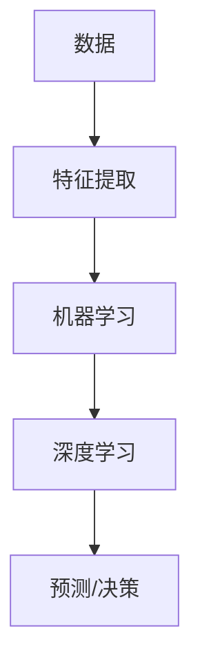

                 

**人类智慧：AI 时代的新力量**

## 1. 背景介绍

在人工智能（AI）飞速发展的今天，我们正见证着计算机科学与人类智慧的奇妙结合。AI 从单纯的模仿人类智慧进化到如今的创造性智慧，为我们带来了前所未有的机遇和挑战。本文将深入探讨 AI 时代的人类智慧，从核心概念到具体算法，再到实际应用场景，为读者提供全面的理解和见解。

## 2. 核心概念与联系

### 2.1 智能与智慧

智能和智慧是理解 AI 的关键概念。智能指的是系统感知、学习、推理和解决问题的能力。而智慧则是指在复杂环境中做出明智决策的能力，它需要理解、判断和创造力。AI 的目标就是要具备人类一样的智慧。

### 2.2 机器学习与深度学习

机器学习是 AI 的一个分支，它使得计算机能够从数据中学习，而无需被明确编程。深度学习是机器学习的一种，它使用神经网络模型，模仿人类大脑的结构和功能。



### 2.3 创造性智慧

创造性智慧是指能够创造新想法、新产品或新解决方案的智慧。AI 正在朝着这个方向发展，从创作音乐到设计药物，AI 正在各个领域展示出其创造力。

## 3. 核心算法原理 & 具体操作步骤

### 3.1 算法原理概述

本节将介绍一种常用的机器学习算法：支持向量机（SVM）。SVM 是一种监督学习算法，用于分类和回归问题。

### 3.2 算法步骤详解

1. **数据预处理**：收集数据，并对数据进行清洗、标记和归一化。
2. **特征选择**：选择最能区分不同类别的特征。
3. **模型训练**：使用选定的特征训练 SVM 模型。
4. **模型评估**：使用测试数据评估模型的准确性。
5. **预测**：使用训练好的模型对新数据进行预测。

### 3.3 算法优缺点

**优点**：SVM 可以处理高维特征空间中的数据，并且可以处理小样本学习问题。它还具有泛化能力，可以在未见过的数据上表现出色。

**缺点**：SVM 训练时间长，不适合处理大规模数据。它也很难处理线性不可分的数据。

### 3.4 算法应用领域

SVM 广泛应用于文本分类、图像分类、生物信息学、金融等领域。

## 4. 数学模型和公式 & 详细讲解 & 举例说明

### 4.1 数学模型构建

SVM 的数学模型是寻找一个超平面，将不同类别的数据点分开，且分开的距离最大化。这个超平面的方程是：

$$w^Tx + b = 0$$

其中，$w$ 是权重向量，$b$ 是偏置项，$x$ 是输入数据。

### 4.2 公式推导过程

SVM 的目标函数是：

$$\min_{w,b} \frac{1}{2}w^Tw + C\sum_{i=1}^{n}\xi_i$$

subject to:

$$y_i(w^Tx_i + b) \geq 1 - \xi_i, \xi_i \geq 0, i = 1, \ldots, n$$

其中，$C$ 是惩罚参数，$y_i$ 是数据点的标签，$\xi_i$ 是松弛变量。

### 4.3 案例分析与讲解

例如，在文本分类任务中，我们有两类文本数据：正面和负面。我们的目标是找到一个超平面，将这两类数据分开。我们可以使用 SVM 算法来实现这一点。

## 5. 项目实践：代码实例和详细解释说明

### 5.1 开发环境搭建

我们将使用 Python 和 scikit-learn 库来实现 SVM 算法。首先，安装 scikit-learn 库：

```bash
pip install -U scikit-learn
```

### 5.2 源代码详细实现

```python
from sklearn import svm, datasets

# Load iris dataset as an example
iris = datasets.load_iris()
X = iris.data
y = iris.target

# Create a SVM classifier
clf = svm.SVC(kernel='linear')

# Train the model using the training sets
clf.fit(X, y)
```

### 5.3 代码解读与分析

我们首先导入 SVM 分类器和示例数据集。然后，我们创建一个 SVM 分类器，并使用训练数据训练模型。

### 5.4 运行结果展示

我们可以使用以下代码来预测新数据的类别：

```python
# Predict the response for test dataset
y_pred = clf.predict(X)
```

## 6. 实际应用场景

### 6.1 当前应用

SVM 广泛应用于各种领域，如文本分类、图像分类、生物信息学、金融等。

### 6.2 未来应用展望

随着 AI 技术的发展，SVM 将会被应用于更多的领域，如自动驾驶、医疗诊断等。此外，SVM 也将会与其他 AI 技术结合，如深度学习，以提高其性能和泛化能力。

## 7. 工具和资源推荐

### 7.1 学习资源推荐

- 书籍：《统计学习方法》作者：李航
- 课程：Stanford University 的机器学习课程

### 7.2 开发工具推荐

- Python：一个强大的编程语言，有丰富的机器学习库。
- scikit-learn：一个流行的机器学习库，提供了 SVM 等算法的实现。

### 7.3 相关论文推荐

- "Support-Vector Networks" by Vapnik, 1995

## 8. 总结：未来发展趋势与挑战

### 8.1 研究成果总结

本文介绍了 SVM 算法的原理、步骤、优缺点和应用领域。我们还提供了一个 Python 实现的例子。

### 8.2 未来发展趋势

AI 将会继续发展，SVM 也将会与其他 AI 技术结合，以提高其性能和泛化能力。

### 8.3 面临的挑战

AI 的发展也面临着挑战，如数据隐私、算法偏见等。我们需要不断地研究和改进 AI 技术，以克服这些挑战。

### 8.4 研究展望

未来的研究将会集中在 AI 的解释性、可靠性和安全性等方面。我们也将会看到 AI 与其他领域的结合，如物联网、量子计算等。

## 9. 附录：常见问题与解答

**Q：SVM 如何处理线性不可分的数据？**

**A：SVM 使用核技巧来处理线性不可分的数据。核技巧将数据映射到高维空间，使其线性可分。**

**Q：SVM 的惩罚参数 C 代表什么？**

**A：惩罚参数 C 控制了错误分类样本的惩罚程度。较大的 C 会导致更复杂的模型，但可能会有更好的泛化能力。**

**作者：禅与计算机程序设计艺术 / Zen and the Art of Computer Programming**

