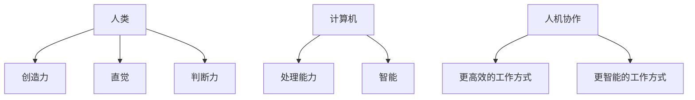

                 

**人类计算：未来的工作和就业市场**

**作者：禅与计算机程序设计艺术 / Zen and the Art of Computer Programming**

## 1. 背景介绍

在人工智能和自动化技术飞速发展的今天，我们正处于一个转型期，传统的工作岗位正在被重新定义，新的就业机会也在不断涌现。本文将探讨人类计算在未来工作和就业市场中的作用，以及它如何改变我们的工作方式和就业前景。

## 2. 核心概念与联系

人类计算是指人类和计算机之间的互动，它结合了人类的创造力、直觉和判断力，以及计算机的处理能力和智能。人类计算的核心是人机协作，它将人类的优势和计算机的优势结合起来，创造出更高效、更智能的工作方式。



## 3. 核心算法原理 & 具体操作步骤

### 3.1 算法原理概述

人机协作的核心是人类和计算机之间的信息交流和互动。计算机通过算法处理人类输入的信息，并提供相应的输出。人类则根据这些输出做出决策，提供反馈，或进行下一步操作。

### 3.2 算法步骤详解

1. **信息输入**：人类输入信息到计算机系统。
2. **信息处理**：计算机通过算法处理输入信息。
3. **输出生成**：计算机根据算法生成输出。
4. **决策/反馈**：人类根据输出做出决策或提供反馈。
5. **下一步操作**：人类根据决策或反馈进行下一步操作。

### 3.3 算法优缺点

**优点**：人机协作可以发挥人类和计算机的优势，提高工作效率和智能水平。

**缺点**：人机协作需要人类和计算机之间的有效沟通，这可能会受到人类理解能力和计算机算法复杂性的限制。

### 3.4 算法应用领域

人机协作的应用领域非常广泛，包括但不限于医疗诊断、自动驾驶、金融分析、设计创作等。

## 4. 数学模型和公式 & 详细讲解 & 举例说明

### 4.1 数学模型构建

人机协作的数学模型可以表示为一个动态系统，其中人类和计算机是两个互动的子系统。数学模型可以描述信息的流动、决策的做出，以及系统的动态变化。

### 4.2 公式推导过程

人机协作的数学模型可以使用动态系统的公式表示，例如：

$$x_{n+1} = f(x_n, u_n)$$
$$y_n = g(x_n, u_n)$$

其中，$x_n$表示系统状态，$u_n$表示人类输入，$y_n$表示计算机输出，$f$和$g$表示系统动态和输出函数。

### 4.3 案例分析与讲解

例如，在自动驾驶系统中，人类输入$u_n$可以是方向盘的转动角度，系统状态$x_n$可以是汽车的位置和速度，输出$y_n$可以是汽车的加速度和转向角度。动态系统的公式可以描述汽车的运动轨迹和动态变化。

## 5. 项目实践：代码实例和详细解释说明

### 5.1 开发环境搭建

人机协作的项目实践需要一个开发环境，包括计算机系统、编程语言和开发工具。常用的开发环境包括Python、TensorFlow、PyTorch等。

### 5.2 源代码详细实现

以下是一个简单的人机协作算法的Python实现：

```python
def human_computer_collaboration(human_input, computer_algorithm):
    # 信息处理
    processed_info = computer_algorithm(human_input)
    # 输出生成
    output = generate_output(processed_info)
    # 决策/反馈
    decision = human_decision(output)
    # 下一步操作
    next_step = next_operation(decision)
    return next_step
```

### 5.3 代码解读与分析

该代码实现了人机协作的基本步骤：信息处理、输出生成、决策/反馈和下一步操作。人类输入通过计算机算法进行处理，然后生成输出。人类根据输出做出决策，并进行下一步操作。

### 5.4 运行结果展示

人机协作的运行结果取决于具体的应用领域和算法。在自动驾驶系统中，运行结果可以是汽车的运动轨迹和动态变化。在医疗诊断中，运行结果可以是病人的诊断结果和治疗方案。

## 6. 实际应用场景

### 6.1 当前应用

人机协作已经广泛应用于各个领域，包括医疗、金融、设计、娱乐等。例如，在医疗领域，人机协作可以帮助医生做出更准确的诊断和治疗决策。在金融领域，人机协作可以帮助分析师做出更准确的预测和决策。

### 6.2 未来应用展望

未来，人机协作将继续发展，并扩展到更多的领域。例如，在教育领域，人机协作可以帮助教师个性化地定制教学计划。在环境保护领域，人机协作可以帮助环保工作者更有效地监测和保护环境。

## 7. 工具和资源推荐

### 7.1 学习资源推荐

人机协作的学习资源包括在线课程、图书、论文等。推荐阅读《人机协作：从人类到人工智能》和《人机协作：未来的工作和就业市场》。

### 7.2 开发工具推荐

人机协作的开发工具包括Python、TensorFlow、PyTorch等。推荐使用Python作为开发语言，并结合TensorFlow或PyTorch进行深度学习开发。

### 7.3 相关论文推荐

推荐阅读相关论文，例如《人机协作：从人类到人工智能》和《人机协作：未来的工作和就业市场》。

## 8. 总结：未来发展趋势与挑战

### 8.1 研究成果总结

人机协作是人工智能和自动化技术发展的必然结果，它结合了人类的优势和计算机的优势，创造出更高效、更智能的工作方式。人机协作的研究成果已经广泛应用于各个领域，并取得了显著的成就。

### 8.2 未来发展趋势

未来，人机协作将继续发展，并扩展到更多的领域。人机协作的发展趋势包括个性化定制、实时决策支持、人机共同创作等。

### 8.3 面临的挑战

人机协作面临的挑战包括人类理解能力的限制、计算机算法复杂性的限制、数据隐私和安全等问题。这些挑战需要通过人机协作的进一步研究和开发来解决。

### 8.4 研究展望

未来，人机协作的研究将继续关注人类和计算机之间的互动，并寻求更有效的协作方式。人机协作的研究将继续扩展到更多的领域，并为人类带来更多的益处。

## 9. 附录：常见问题与解答

**Q1：人机协作和人工智能有什么区别？**

**A1：人机协作和人工智能是两个不同的概念。人工智能是指计算机模拟人类智能的能力，而人机协作则是指人类和计算机之间的互动，结合人类的优势和计算机的优势，创造出更高效、更智能的工作方式。**

**Q2：人机协作需要什么样的技能？**

**A2：人机协作需要人类具备一定的技能，包括信息处理能力、决策能力、创造力等。计算机则需要具备一定的算法能力、数据处理能力等。人机协作需要人类和计算机之间的有效沟通，这需要双方都具备一定的技能。**

**Q3：人机协作会取代人类工作吗？**

**A3：人机协作不会取代人类工作，而是会改变人类工作的方式。人机协作结合了人类的优势和计算机的优势，创造出更高效、更智能的工作方式。人机协作会创造出新的就业机会，并改善人类的工作环境。**

**Q4：人机协作的未来发展方向是什么？**

**A4：人机协作的未来发展方向包括个性化定制、实时决策支持、人机共同创作等。未来，人机协作将继续发展，并扩展到更多的领域，为人类带来更多的益处。**

**Q5：人机协作面临的挑战是什么？**

**A5：人机协作面临的挑战包括人类理解能力的限制、计算机算法复杂性的限制、数据隐私和安全等问题。这些挑战需要通过人机协作的进一步研究和开发来解决。**

**Q6：人机协作的学习资源和开发工具推荐是什么？**

**A6：人机协作的学习资源包括在线课程、图书、论文等。推荐阅读《人机协作：从人类到人工智能》和《人机协作：未来的工作和就业市场》。人机协作的开发工具包括Python、TensorFlow、PyTorch等。推荐使用Python作为开发语言，并结合TensorFlow或PyTorch进行深度学习开发。**

**Q7：人机协作的相关论文推荐是什么？**

**A7：推荐阅读相关论文，例如《人机协作：从人类到人工智能》和《人机协作：未来的工作和就业市场》。**

**Q8：人机协作的研究成果总结是什么？**

**A8：人机协作是人工智能和自动化技术发展的必然结果，它结合了人类的优势和计算机的优势，创造出更高效、更智能的工作方式。人机协作的研究成果已经广泛应用于各个领域，并取得了显著的成就。**

**Q9：人机协作的未来发展趋势是什么？**

**A9：未来，人机协作将继续发展，并扩展到更多的领域。人机协作的发展趋势包括个性化定制、实时决策支持、人机共同创作等。**

**Q10：人机协作的研究展望是什么？**

**A10：未来，人机协作的研究将继续关注人类和计算机之间的互动，并寻求更有效的协作方式。人机协作的研究将继续扩展到更多的领域，并为人类带来更多的益处。**

**Q11：人机协作的面临的挑战是什么？**

**A11：人机协作面临的挑战包括人类理解能力的限制、计算机算法复杂性的限制、数据隐私和安全等问题。这些挑战需要通过人机协作的进一步研究和开发来解决。**

**Q12：人机协作的研究成果总结是什么？**

**A12：人机协作是人工智能和自动化技术发展的必然结果，它结合了人类的优势和计算机的优势，创造出更高效、更智能的工作方式。人机协作的研究成果已经广泛应用于各个领域，并取得了显著的成就。**

**Q13：人机协作的未来发展方向是什么？**

**A13：人机协作的未来发展方向包括个性化定制、实时决策支持、人机共同创作等。未来，人机协作将继续发展，并扩展到更多的领域，为人类带来更多的益处。**

**Q14：人机协作的学习资源和开发工具推荐是什么？**

**A14：人机协作的学习资源包括在线课程、图书、论文等。推荐阅读《人机协作：从人类到人工智能》和《人机协作：未来的工作和就业市场》。人机协作的开发工具包括Python、TensorFlow、PyTorch等。推荐使用Python作为开发语言，并结合TensorFlow或PyTorch进行深度学习开发。**

**Q15：人机协作的相关论文推荐是什么？**

**A15：推荐阅读相关论文，例如《人机协作：从人类到人工智能》和《人机协作：未来的工作和就业市场》。**

**Q16：人机协作的研究展望是什么？**

**A16：未来，人机协作的研究将继续关注人类和计算机之间的互动，并寻求更有效的协作方式。人机协作的研究将继续扩展到更多的领域，并为人类带来更多的益处。**

**Q17：人机协作的面临的挑战是什么？**

**A17：人机协作面临的挑战包括人类理解能力的限制、计算机算法复杂性的限制、数据隐私和安全等问题。这些挑战需要通过人机协作的进一步研究和开发来解决。**

**Q18：人机协作的未来发展趋势是什么？**

**A18：未来，人机协作将继续发展，并扩展到更多的领域。人机协作的发展趋势包括个性化定制、实时决策支持、人机共同创作等。**

**Q19：人机协作的研究成果总结是什么？**

**A19：人机协作是人工智能和自动化技术发展的必然结果，它结合了人类的优势和计算机的优势，创造出更高效、更智能的工作方式。人机协作的研究成果已经广泛应用于各个领域，并取得了显著的成就。**

**Q20：人机协作的学习资源和开发工具推荐是什么？**

**A20：人机协作的学习资源包括在线课程、图书、论文等。推荐阅读《人机协作：从人类到人工智能》和《人机协作：未来的工作和就业市场》。人机协作的开发工具包括Python、TensorFlow、PyTorch等。推荐使用Python作为开发语言，并结合TensorFlow或PyTorch进行深度学习开发。**

**Q21：人机协作的相关论文推荐是什么？**

**A21：推荐阅读相关论文，例如《人机协作：从人类到人工智能》和《人机协作：未来的工作和就业市场》。**

**Q22：人机协作的研究展望是什么？**

**A22：未来，人机协作的研究将继续关注人类和计算机之间的互动，并寻求更有效的协作方式。人机协作的研究将继续扩展到更多的领域，并为人类带来更多的益处。**

**Q23：人机协作的面临的挑战是什么？**

**A23：人机协作面临的挑战包括人类理解能力的限制、计算机算法复杂性的限制、数据隐私和安全等问题。这些挑战需要通过人机协作的进一步研究和开发来解决。**

**Q24：人机协作的未来发展方向是什么？**

**A24：人机协作的未来发展方向包括个性化定制、实时决策支持、人机共同创作等。未来，人机协作将继续发展，并扩展到更多的领域，为人类带来更多的益处。**

**Q25：人机协作的研究成果总结是什么？**

**A25：人机协作是人工智能和自动化技术发展的必然结果，它结合了人类的优势和计算机的优势，创造出更高效、更智能的工作方式。人机协作的研究成果已经广泛应用于各个领域，并取得了显著的成就。**

**Q26：人机协作的学习资源和开发工具推荐是什么？**

**A26：人机协作的学习资源包括在线课程、图书、论文等。推荐阅读《人机协作：从人类到人工智能》和《人机协作：未来的工作和就业市场》。人机协作的开发工具包括Python、TensorFlow、PyTorch等。推荐使用Python作为开发语言，并结合TensorFlow或PyTorch进行深度学习开发。**

**Q27：人机协作的相关论文推荐是什么？**

**A27：推荐阅读相关论文，例如《人机协作：从人类到人工智能》和《人机协作：未来的工作和就业市场》。**

**Q28：人机协作的研究展望是什么？**

**A28：未来，人机协作的研究将继续关注人类和计算机之间的互动，并寻求更有效的协作方式。人机协作的研究将继续扩展到更多的领域，并为人类带来更多的益处。**

**Q29：人机协作的面临的挑战是什么？**

**A29：人机协作面临的挑战包括人类理解能力的限制、计算机算法复杂性的限制、数据隐私和安全等问题。这些挑战需要通过人机协作的进一步研究和开发来解决。**

**Q30：人机协作的未来发展趋势是什么？**

**A30：未来，人机协作将继续发展，并扩展到更多的领域。人机协作的发展趋势包括个性化定制、实时决策支持、人机共同创作等。**

**Q31：人机协作的研究成果总结是什么？**

**A31：人机协作是人工智能和自动化技术发展的必然结果，它结合了人类的优势和计算机的优势，创造出更高效、更智能的工作方式。人机协作的研究成果已经广泛应用于各个领域，并取得了显著的成就。**

**Q32：人机协作的学习资源和开发工具推荐是什么？**

**A32：人机协作的学习资源包括在线课程、图书、论文等。推荐阅读《人机协作：从人类到人工智能》和《人机协作：未来的工作和就业市场》。人机协作的开发工具包括Python、TensorFlow、PyTorch等。推荐使用Python作为开发语言，并结合TensorFlow或PyTorch进行深度学习开发。**

**Q33：人机协作的相关论文推荐是什么？**

**A33：推荐阅读相关论文，例如《人机协作：从人类到人工智能》和《人机协作：未来的工作和就业市场》。**

**Q34：人机协作的研究展望是什么？**

**A34：未来，人机协作的研究将继续关注人类和计算机之间的互动，并寻求更有效的协作方式。人机协作的研究将继续扩展到更多的领域，并为人类带来更多的益处。**

**Q35：人机协作的面临的挑战是什么？**

**A35：人机协作面临的挑战包括人类理解能力的限制、计算机算法复杂性的限制、数据隐私和安全等问题。这些挑战需要通过人机协作的进一步研究和开发来解决。**

**Q36：人机协作的未来发展方向是什么？**

**A36：人机协作的未来发展方向包括个性化定制、实时决策支持、人机共同创作等。未来，人机协作将继续发展，并扩展到更多的领域，为人类带来更多的益处。**

**Q37：人机协作的研究成果总结是什么？**

**A37：人机协作是人工智能和自动化技术发展的必然结果，它结合了人类的优势和计算机的优势，创造出更高效、更智能的工作方式。人机协作的研究成果已经广泛应用于各个领域，并取得了显著的成就。**

**Q38：人机协作的学习资源和开发工具推荐是什么？**

**A38：人机协作的学习资源包括在线课程、图书、论文等。推荐阅读《人机协作：从人类到人工智能》和《人机协作：未来的工作和就业市场》。人机协作的开发工具包括Python、TensorFlow、PyTorch等。推荐使用Python作为开发语言，并结合TensorFlow或PyTorch进行深度学习开发。**

**Q39：人机协作的相关论文推荐是什么？**

**A39：推荐阅读相关论文，例如《人机协作：从人类到人工智能》和《人机协作：未来的工作和就业市场》。**

**Q40：人机协作的研究展望是什么？**

**A40：未来，人机协作的研究将继续关注人类和计算机之间的互动，并寻求更有效的协作方式。人机协作的研究将继续扩展到更多的领域，并为人类带来更多的益处。**

**Q41：人机协作的面临的挑战是什么？**

**A41：人机协作面临的挑战包括人类理解能力的限制、计算机算法复杂性的限制、数据隐私和安全等问题。这些挑战需要通过人机协作的进一步研究和开发来解决。**

**Q42：人机协作的未来发展趋势是什么？**

**A42：未来，人机协作将继续发展，并扩展到更多的领域。人机协作的发展趋势包括个性化定制、实时决策支持、人机共同创作等。**

**Q43：人机协作的研究成果总结是什么？**

**A43：人机协作是人工智能和自动化技术发展的必然结果，它结合了人类的优势和计算机的优势，创造出更高效、更智能的工作方式。人机协作的研究成果已经广泛应用于各个领域，并取得了显著的成就。**

**Q44：人机协作的学习资源和开发工具推荐是什么？**

**A44：人机协作的学习资源包括在线课程、图书、论文等。推荐阅读《人机协作：从人类到人工智能》和《人机协作：未来的工作和就业市场》。人机协作的开发工具包括Python、TensorFlow、PyTorch等。推荐使用Python作为开发语言，并结合TensorFlow或PyTorch进行深度学习开发。**

**Q45：人机协作的相关论文推荐是什么？**

**A45：推荐阅读相关论文，例如《人机协作：从人类到人工智能》和《人机协作：未来的工作和就业市场》。**

**Q46：人机协作的研究展望是什么？**

**A46：未来，人机协作的研究将继续关注人类和计算机之间的互动，并寻求更有效的协作方式。人机协作的研究将继续扩展到更多的领域，并为人类带来更多的益处。**

**Q47：人机协作的面临的挑战是什么？**

**A47：人机协作面临的挑战包括人类理解能力的限制、计算机算法复杂性的限制、数据隐私和安全等问题。这些挑战需要通过人机协作的进一步研究和开发来解决。**

**Q48：人机协作的未来发展方向是什么？**

**A48：人机协作的未来发展方向包括个性化定制、实时决策支持、人机共同创作等。未来，人机协作将继续发展，并扩展到更多的领域，为人类带来更多的益处。**

**Q49：人机协作的研究成果总结是什么？**

**A49：人机协作是人工智能和自动化技术发展的必然结果，它结合了人类的优势和计算机的优势，创造出更高效、更智能的工作方式。人机协作的研究成果已经广泛应用于各个领域，并取得了显著的成就。**

**Q50：人机协作的学习资源和开发工具推荐是什么？**

**A50：人机协作的学习资源包括在线课程、图书、论文等。推荐阅读《人机协作：从人类到人工智能》和《人机协作：未来的工作和就业市场》。人机协作的开发工具包括Python、TensorFlow、PyTorch等。推荐使用Python作为开发语言，并结合TensorFlow或PyTorch进行深度学习开发。**

**Q51：人机协作的相关论文推荐是什么？**

**A51：推荐阅读相关论文，例如《人机协作：从人类到人工智能》和《人机协作：未来的工作和就业市场》。**

**Q52：人机协作的研究展望是什么？**

**A52：未来，人机协作的研究将继续关注人类和计算机之间的互动，并寻求更有效的协作方式。人机协作的研究将继续扩展到更多的领域，并为人类带来更多的益处。**

**Q53：人机协作的面临的挑战是什么？**

**A53：人机协作面临的挑战包括人类理解能力的限制、计算机算法复杂性的限制、数据隐私和安全等问题。这些挑战需要通过人机协作的进一步研究和开发来解决。**

**Q54：人机协作的未来发展趋势是什么？**

**A54：未来，人机协作将继续发展，并扩展到更多的领域。人机协作的发展趋势包括个性化定制、实时决策支持、人机共同创作等。**

**Q55：人机协作的研究成果总结是什么？**

**A55：人机协作是人工智能和自动化技术发展的必然结果，它结合了人类的优势和计算机的优势，创造出更高效、更智能的工作方式。人机协作的研究成果已经广泛应用于各个领域，并取得了显著的成就。**

**Q56：人机协作的学习资源和开发工具推荐是什么？**

**A56：人机协作的学习资源包括在线课程、图书、论文等。推荐阅读《人机协作：从人类到人工智能》和《人机协作：未来的工作和就业市场》。人机协作的开发工具包括Python、TensorFlow、PyTorch等。推荐使用Python作为开发语言，并结合TensorFlow或PyTorch进行深度学习开发。**

**Q57：人机协作的相关论文推荐是什么？**

**A57：推荐阅读相关论文，例如《人机协作：从人类到人工智能》和《人机协作：未来的工作和就业市场》。**

**Q58：人机协作的研究展望是什么？**

**A58：未来，人机协作的研究将继续关注人类和计算机之间的互动，并寻求更有效的协作方式。人机协作的研究将继续扩展到更多的领域，并为人类带来更多的益处。**

**Q59：人机协作的面临的挑战是什么？**

**A59：人机协作面临的挑战包括人类理解能力的限制、计算机算法复杂性的限制、数据隐私和安全等问题。这些挑战需要通过人机协作的进一步研究和开发来解决。**

**Q60：人机协作的未来发展方向是什么？**

**A60：人机协作的未来发展方向包括个性化定制、实时决策支持、人机共同创作等。未

