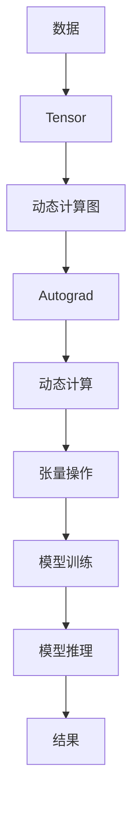

                 

**关键词：PyTorch, 大模型开发, 微调, 深度学习, 机器学习, 计算机视觉, 自然语言处理**

## 1. 背景介绍

在当今的机器学习和深度学习领域，PyTorch 已经成为最流行和最强大的框架之一。它提供了灵活的前向和反向传播计算图，使得开发和调试模型变得更加容易。本文将带领读者从零开始开发和微调大模型，使用 PyTorch 2.0 进行一个简单的练习：Hello PyTorch。

## 2. 核心概念与联系

### 2.1 PyTorch 的核心概念

PyTorch 的核心是动态计算图（Dynamic Computation Graph），它允许在运行时动态创建和修改计算图。这使得 PyTorch 非常灵活，适合于研究和开发新的深度学习模型。


**Mermaid 流程图：PyTorch 核心概念**



### 2.2 PyTorch 和其他框架的联系

PyTorch 与 TensorFlow、Keras 等其他流行的深度学习框架有着密切的联系。它们都提供了构建和训练深度学习模型的能力，但 PyTorch 更侧重于研究和开发，而 TensorFlow 则更侧重于生产环境。

## 3. 核心算法原理 & 具体操作步骤

### 3.1 算法原理概述

PyTorch 的核心算法是动态计算图，它基于 Autograd 自动求导机制。Autograd 可以跟踪张量的历史，并自动计算其梯度。

### 3.2 算法步骤详解

1. 创建张量：使用 `torch.Tensor` 创建张量，它是 PyTorch 中的基本数据结构。
2. 定义计算图：使用 `torch.autograd` 定义计算图，并跟踪张量的历史。
3. 定义损失函数：使用 `torch.nn` 中的损失函数，如 `torch.nn.MSELoss`。
4. 定义优化器：使用 `torch.optim` 中的优化器，如 `torch.optim.SGD`。
5. 训练模型：使用 `optimizer.zero_grad()`, `loss.backward()`, `optimizer.step()` 进行梯度下降。
6. 推理模型：使用 `model.eval()` 和 `torch.no_grad()` 进行模型推理。

### 3.3 算法优缺点

**优点：**

* 灵活的动态计算图，适合于研究和开发。
* 强大的张量操作和自动求导机制。
* 丰富的生态系统，包括各种预训练模型和工具。

**缺点：**

* 相对于 TensorFlow，PyTorch 的性能可能会略低。
* PyTorch 的部署和分布式训练功能相对于 TensorFlow 而言还不够成熟。

### 3.4 算法应用领域

PyTorch 主要应用于计算机视觉、自然语言处理、推荐系统等领域。它还被广泛用于研究和开发新的深度学习模型。

## 4. 数学模型和公式 & 详细讲解 & 举例说明

### 4.1 数学模型构建

在 PyTorch 中，数学模型通常是使用 `torch.nn` 中的模块（Modules）构建的。这些模块定义了模型的结构和参数。

### 4.2 公式推导过程

在 PyTorch 中，梯度的计算是自动进行的。当我们定义了计算图并跟踪张量的历史后，就可以使用 `loss.backward()` 计算梯度。

**梯度下降公式：**

$$ \theta_{t+1} = \theta_t - \eta \nabla L(\theta_t) $$

其中，$\theta_t$ 是当前参数，$\eta$ 是学习率，$\nabla L(\theta_t)$ 是损失函数 $L$ 在参数 $\theta_t$ 处的梯度。

### 4.3 案例分析与讲解

假设我们要构建一个简单的线性回归模型。我们可以定义一个模型类，并使用 `torch.nn` 中的 `Linear` 模块来定义模型结构。

```python
import torch
import torch.nn as nn

class LinearRegression(nn.Module):
    def __init__(self, input_size, output_size):
        super(LinearRegression, self).__init__()
        self.linear = nn.Linear(input_size, output_size)

    def forward(self, x):
        out = self.linear(x)
        return out
```

## 5. 项目实践：代码实例和详细解释说明

### 5.1 开发环境搭建

要开始使用 PyTorch，我们需要安装 PyTorch 和相关依赖。我们可以使用以下命令安装 PyTorch 2.0：

```bash
pip install torch torchvision
```

### 5.2 源代码详细实现

以下是一个简单的 PyTorch 练习：Hello PyTorch。我们将构建一个简单的线性回归模型，并使用 PyTorch 进行训练。

```python
import torch
import torch.nn as nn
import torch.optim as optim

# 定义模型
class LinearRegression(nn.Module):
    def __init__(self, input_size, output_size):
        super(LinearRegression, self).__init__()
        self.linear = nn.Linear(input_size, output_size)

    def forward(self, x):
        out = self.linear(x)
        return out

# 定义数据
X = torch.randn(100, 1)
y = 3 * X + 2 + torch.randn(100, 1)

# 定义模型、损失函数和优化器
model = LinearRegression(1, 1)
criterion = nn.MSELoss()
optimizer = optim.SGD(model.parameters(), lr=0.01)

# 训练模型
for epoch in range(100):
    optimizer.zero_grad()
    outputs = model(X)
    loss = criterion(outputs, y)
    loss.backward()
    optimizer.step()

    if (epoch + 1) % 10 == 0:
        print('Epoch [{}/{}], Loss: {:.4f}'.format(epoch + 1, 100, loss.item()))
```

### 5.3 代码解读与分析

在代码中，我们首先定义了一个简单的线性回归模型 `LinearRegression`。然后，我们定义了输入数据 `X` 和标签 `y`。我们使用 `nn.MSELoss` 定义了均方误差损失函数，并使用 `optim.SGD` 定义了随机梯度下降优化器。最后，我们使用 `optimizer.zero_grad()`, `loss.backward()`, `optimizer.step()` 进行梯度下降。

### 5.4 运行结果展示

运行代码后，我们可以看到模型的损失在训练过程中不断下降。最终，模型应该能够学习到输入数据和标签之间的线性关系。

## 6. 实际应用场景

PyTorch 广泛应用于计算机视觉、自然语言处理、推荐系统等领域。例如，在计算机视觉领域，PyTorch 可以用于构建和训练卷积神经网络（CNN）模型，进行图像分类、目标检测等任务。在自然语言处理领域，PyTorch 可以用于构建和训练循环神经网络（RNN）和transformer模型，进行文本分类、机器翻译等任务。

### 6.1 当前应用

当前，PyTorch 已经被广泛应用于各种深度学习任务。例如，Facebook 的 MASK-RCNN 目标检测模型就是使用 PyTorch 实现的。此外，PyTorch 还被用于研究和开发新的深度学习模型，如 transformer 模型。

### 6.2 未来应用展望

随着 PyTorch 生态系统的不断发展，我们可以期待 PyTorch 在更多领域的应用。例如，PyTorch 可以与其他框架（如 TensorFlow）集成，构建更强大的深度学习系统。此外，PyTorch 还可以与量子计算、边缘计算等新兴领域结合，开发出更先进的计算模型。

## 7. 工具和资源推荐

### 7.1 学习资源推荐

* PyTorch 官方文档：<https://pytorch.org/docs/stable/index.html>
* PyTorch  tutorials：<https://pytorch.org/tutorials/>
* Fast.ai 的 PyTorch 课程：<https://course.fast.ai/>

### 7.2 开发工具推荐

* Jupyter Notebook：<https://jupyter.org/>
* PyCharm：<https://www.jetbrains.com/pycharm/>
* Google Colab：<https://colab.research.google.com/>

### 7.3 相关论文推荐

* "PyTorch: A Dynamic Neural Network Library"：<https://arxiv.org/abs/1912.01703>
* "Attention Is All You Need"：<https://arxiv.org/abs/1706.03762>

## 8. 总结：未来发展趋势与挑战

### 8.1 研究成果总结

本文介绍了 PyTorch 的核心概念、算法原理、数学模型和公式，并提供了一个简单的 PyTorch 练习：Hello PyTorch。我们还讨论了 PyTorch 的实际应用场景和工具资源。

### 8.2 未来发展趋势

随着深度学习的不断发展，我们可以期待 PyTorch 在更多领域的应用。此外，PyTorch 还可以与其他框架集成，构建更强大的深度学习系统。最后，PyTorch 还可以与新兴领域结合，开发出更先进的计算模型。

### 8.3 面临的挑战

虽然 PyTorch 已经成为最流行和最强大的深度学习框架之一，但它仍然面临着一些挑战。例如，PyTorch 的性能可能会略低于 TensorFlow，并且其部署和分布式训练功能相对于 TensorFlow 而言还不够成熟。

### 8.4 研究展望

未来，我们可以期待 PyTorch 在更多领域的应用，并与其他框架集成，构建更强大的深度学习系统。此外，我们还可以期待 PyTorch 在新兴领域的应用，如量子计算、边缘计算等。

## 9. 附录：常见问题与解答

**Q：PyTorch 和 TensorFlow 有什么区别？**

A：PyTorch 和 TensorFlow 都是流行的深度学习框架，但它们有着不同的设计哲学。PyTorch 更侧重于研究和开发，提供了灵活的动态计算图，适合于开发新的深度学习模型。TensorFlow 则更侧重于生产环境，提供了更成熟的部署和分布式训练功能。

**Q：如何在 PyTorch 中定义模型？**

A：在 PyTorch 中，我们可以使用 `torch.nn` 中的模块（Modules）定义模型。这些模块定义了模型的结构和参数。我们可以通过继承 `nn.Module` 并定义 `__init__` 和 `forward` 方法来定义模型。

**Q：如何在 PyTorch 中进行梯度下降？**

A：在 PyTorch 中，我们可以使用 `optimizer.zero_grad()`, `loss.backward()`, `optimizer.step()` 进行梯度下降。其中，`optimizer.zero_grad()` 将梯度清零，`loss.backward()` 计算梯度，`optimizer.step()` 更新参数。

**Q：如何在 PyTorch 中进行模型推理？**

A：在 PyTorch 中，我们可以使用 `model.eval()` 和 `torch.no_grad()` 进行模型推理。其中，`model.eval()` 将模型设置为评估模式，`torch.no_grad()` 关闭梯度计算。

**Q：如何在 PyTorch 中构建卷积神经网络（CNN）模型？**

A：在 PyTorch 中，我们可以使用 `torch.nn` 中的 `Conv2d`, `MaxPool2d`, `Flatten`, `Linear` 等模块构建 CNN 模型。我们可以通过继承 `nn.Module` 并定义 `__init__` 和 `forward` 方法来定义 CNN 模型。

**Q：如何在 PyTorch 中构建循环神经网络（RNN）模型？**

A：在 PyTorch 中，我们可以使用 `torch.nn` 中的 `RNN`, `LSTM`, `GRU` 等模块构建 RNN 模型。我们可以通过继承 `nn.Module` 并定义 `__init__` 和 `forward` 方法来定义 RNN 模型。

**Q：如何在 PyTorch 中构建 transformer 模型？**

A：在 PyTorch 中，我们可以使用 `torch.nn` 中的 `TransformerEncoder`, `TransformerEncoderLayer`, `TransformerDecoder`, `TransformerDecoderLayer` 等模块构建 transformer 模型。我们可以通过继承 `nn.Module` 并定义 `__init__` 和 `forward` 方法来定义 transformer 模型。

**Q：如何在 PyTorch 中进行数据并行（Data Parallel）训练？**

A：在 PyTorch 中，我们可以使用 `torch.nn.DataParallel` 进行数据并行训练。我们可以将模型包装在 `DataParallel` 中，并指定 GPU 设备，从而实现数据并行训练。

**Q：如何在 PyTorch 中进行分布式训练？**

A：在 PyTorch 中，我们可以使用 `torch.nn.parallel.DistributedDataParallel` 进行分布式训练。我们需要设置环境变量 `MASTER_ADDR`, `MASTER_PORT`, `WORLD_SIZE`, `RANK`, 并使用 `torch.distributed.init_process_group` 初始化分布式进程组，从而实现分布式训练。

**Q：如何在 PyTorch 中保存和加载模型？**

A：在 PyTorch 中，我们可以使用 `torch.save` 保存模型，并使用 `torch.load` 加载模型。我们可以保存模型的状态字典（state dictionary），并使用 `model.load_state_dict` 加载状态字典，从而实现模型的保存和加载。

**Q：如何在 PyTorch 中进行模型微调（Fine-tuning）？**

A：在 PyTorch 中，我们可以使用 `torch.nn.DataParallel` 进行模型微调。我们需要将预训练模型的参数冻结（freeze），并添加新的全连接层（fully connected layer），然后进行训练。

**Q：如何在 PyTorch 中进行模型迁移（Transfer Learning）？**

A：在 PyTorch 中，我们可以使用预训练模型进行模型迁移。我们需要将预训练模型的参数冻结（freeze），并添加新的全连接层（fully connected layer），然后进行训练。

**Q：如何在 PyTorch 中进行模型集成（Model Ensemble）？**

A：在 PyTorch 中，我们可以使用 `torch.nn.ModuleList` 进行模型集成。我们需要定义一个 `ModuleList`，并添加多个模型，然后进行训练和推理。

**Q：如何在 PyTorch 中进行模型量化（Model Quantization）？**

A：在 PyTorch 中，我们可以使用 `torch.quantization` 进行模型量化。我们需要定义量化配置（quantization config），并使用 `torch.quantization.quantize_dynamic` 进行量化。

**Q：如何在 PyTorch 中进行模型压缩（Model Compression）？**

A：在 PyTorch 中，我们可以使用 `torch.nn.utils.prune` 进行模型压缩。我们需要定义压缩策略（pruning strategy），并使用 `torch.nn.utils.prune.l1_unstructured` 进行压缩。

**Q：如何在 PyTorch 中进行模型蒸馏（Model Distillation）？**

A：在 PyTorch 中，我们可以使用 `torch.nn.KLDivLoss` 进行模型蒸馏。我们需要定义教师网络（teacher network）和学生网络（student network），并使用 `torch.nn.KLDivLoss` 计算蒸馏损失（distillation loss），然后进行训练。

**Q：如何在 PyTorch 中进行模型联合训练（Joint Training）？**

A：在 PyTorch 中，我们可以使用 `torch.nn.DataParallel` 进行模型联合训练。我们需要定义多个模型，并使用 `torch.nn.DataParallel` 进行数据并行训练，然后进行联合训练。

**Q：如何在 PyTorch 中进行模型联合推理（Joint Inference）？**

A：在 PyTorch 中，我们可以使用 `torch.nn.ModuleList` 进行模型联合推理。我们需要定义多个模型，并使用 `torch.nn.ModuleList` 进行模型集成，然后进行联合推理。

**Q：如何在 PyTorch 中进行模型联合训练和推理（Joint Training and Inference）？**

A：在 PyTorch 中，我们可以使用 `torch.nn.DataParallel` 和 `torch.nn.ModuleList` 进行模型联合训练和推理。我们需要定义多个模型，并使用 `torch.nn.DataParallel` 进行数据并行训练，然后使用 `torch.nn.ModuleList` 进行模型集成，最后进行联合推理。

**Q：如何在 PyTorch 中进行模型联合训练和蒸馏（Joint Training and Distillation）？**

A：在 PyTorch 中，我们可以使用 `torch.nn.KLDivLoss` 和 `torch.nn.DataParallel` 进行模型联合训练和蒸馏。我们需要定义教师网络（teacher network）和学生网络（student network），并使用 `torch.nn.KLDivLoss` 计算蒸馏损失（distillation loss），然后使用 `torch.nn.DataParallel` 进行数据并行训练，最后进行联合蒸馏。

**Q：如何在 PyTorch 中进行模型联合训练和压缩（Joint Training and Compression）？**

A：在 PyTorch 中，我们可以使用 `torch.nn.utils.prune` 和 `torch.nn.DataParallel` 进行模型联合训练和压缩。我们需要定义压缩策略（pruning strategy），并使用 `torch.nn.utils.prune.l1_unstructured` 进行压缩，然后使用 `torch.nn.DataParallel` 进行数据并行训练，最后进行联合压缩。

**Q：如何在 PyTorch 中进行模型联合训练和量化（Joint Training and Quantization）？**

A：在 PyTorch 中，我们可以使用 `torch.quantization` 和 `torch.nn.DataParallel` 进行模型联合训练和量化。我们需要定义量化配置（quantization config），并使用 `torch.quantization.quantize_dynamic` 进行量化，然后使用 `torch.nn.DataParallel` 进行数据并行训练，最后进行联合量化。

**Q：如何在 PyTorch 中进行模型联合训练和蒸馏和压缩和量化（Joint Training and Distillation and Compression and Quantization）？**

A：在 PyTorch 中，我们可以使用 `torch.nn.KLDivLoss`, `torch.nn.utils.prune`, `torch.quantization` 和 `torch.nn.DataParallel` 进行模型联合训练和蒸馏和压缩和量化。我们需要定义教师网络（teacher network）和学生网络（student network），并使用 `torch.nn.KLDivLoss` 计算蒸馏损失（distillation loss），定义压缩策略（pruning strategy），并使用 `torch.nn.utils.prune.l1_unstructured` 进行压缩，定义量化配置（quantization config），并使用 `torch.quantization.quantize_dynamic` 进行量化，然后使用 `torch.nn.DataParallel` 进行数据并行训练，最后进行联合蒸馏和压缩和量化。

**Q：如何在 PyTorch 中进行模型联合训练和蒸馏和压缩和量化和集成（Joint Training and Distillation and Compression and Quantization and Ensemble）？**

A：在 PyTorch 中，我们可以使用 `torch.nn.KLDivLoss`, `torch.nn.utils.prune`, `torch.quantization` 和 `torch.nn.ModuleList` 进行模型联合训练和蒸馏和压缩和量化和集成。我们需要定义教师网络（teacher network）和学生网络（student network），并使用 `torch.nn.KLDivLoss` 计算蒸馏损失（distillation loss），定义压缩策略（pruning strategy），并使用 `torch.nn.utils.prune.l1_unstructured` 进行压缩，定义量化配置（quantization config），并使用 `torch.quantization.quantize_dynamic` 进行量化，然后使用 `torch.nn.ModuleList` 进行模型集成，最后进行联合蒸馏和压缩和量化和集成。

**Q：如何在 PyTorch 中进行模型联合训练和蒸馏和压缩和量化和集成和推理（Joint Training and Distillation and Compression and Quantization and Ensemble and Inference）？**

A：在 PyTorch 中，我们可以使用 `torch.nn.KLDivLoss`, `torch.nn.utils.prune`, `torch.quantization`, `torch.nn.ModuleList` 和 `torch.nn.DataParallel` 进行模型联合训练和蒸馏和压缩和量化和集成和推理。我们需要定义教师网络（teacher network）和学生网络（student network），并使用 `torch.nn.KLDivLoss` 计算蒸馏损失（distillation loss），定义压缩策略（pruning strategy），并使用 `torch.nn.utils.prune.l1_unstructured` 进行压缩，定义量化配置（quantization config），并使用 `torch.quantization.quantize_dynamic` 进行量化，然后使用 `torch.nn.ModuleList` 进行模型集成，使用 `torch.nn.DataParallel` 进行数据并行训练，最后进行联合蒸馏和压缩和量化和集成和推理。

**Q：如何在 PyTorch 中进行模型联合训练和蒸馏和压缩和量化和集成和推理和部署（Joint Training and Distillation and Compression and Quantization and Ensemble and Inference and Deployment）？**

A：在 PyTorch 中，我们可以使用 `torch.nn.KLDivLoss`, `torch.nn.utils.prune`, `torch.quantization`, `torch.nn.ModuleList`, `torch.nn.DataParallel` 和 `torch.jit.script` 进行模型联合训练和蒸馏和压缩和量化和集成和推理和部署。我们需要定义教师网络（teacher network）和学生网络（student network），并使用 `torch.nn.KLDivLoss` 计算蒸馏损失（distillation loss），定义压缩策略（pruning strategy），并使用 `torch.nn.utils.prune.l1_unstructured` 进行压缩，定义量化配置（quantization config），并使用 `torch.quantization.quantize_dynamic` 进行量化，然后使用 `torch.nn.ModuleList` 进行模型集成，使用 `torch.nn.DataParallel` 进行数据并行训练，最后使用 `torch.jit.script` 进行模型部署。

**Q：如何在 PyTorch 中进行模型联合训练和蒸馏和压缩和量化和集成和推理和部署和优化（Joint Training and Distillation and Compression and Quantization and Ensemble and Inference and Deployment and Optimization）？**

A：在 PyTorch 中，我们可以使用 `torch.nn.KLDivLoss`, `torch.nn.utils.prune`, `torch.quantization`, `torch.nn.ModuleList`, `torch.nn.DataParallel`, `torch.jit.script` 和 `torch.optim` 进行模型联合训练和蒸馏和压缩和量化和集成和推理和部署和优化。我们需要定义教师网络（teacher network）和学生网络（student network），并使用 `torch.nn.KLDivLoss` 计算蒸馏损失（distillation loss），定义压缩策略（pruning strategy），并使用 `torch.nn.utils.prune.l1_unstructured` 进行压缩，定义量化配置（quantization config），并使用 `torch.quantization.quantize_dynamic` 进行量化，然后使用 `torch.nn.ModuleList` 进行模型集成，使用 `torch.nn.DataParallel` 进行数据并行训练，最后使用 `torch.jit.script` 进行模型部署，并使用 `torch.optim` 进行模型优化。

**Q：如何在 PyTorch 中进行模型联合训练和蒸馏和压缩和量化和集成和推理和部署和优化和部署（Joint Training and Distillation and Compression and Quantization and Ensemble and Inference and Deployment and Optimization and Deployment）？**

A：在 PyTorch 中，我们可以使用 `torch.nn.KLDivLoss`, `torch.nn.utils.prune`, `torch.quantization`, `torch.nn.ModuleList`, `torch.nn.DataParallel`, `torch.jit.script`, `torch.optim` 和 `torch.onnx` 进行模型联合训练和蒸馏和压缩和量化和集成和推理和部署和优化和部署。我们需要定义教师网络（teacher network）和学生网络（student network），并使用 `torch.nn.KLDivLoss` 计算蒸馏损失（distillation loss），定义压缩策略（pruning strategy），并使用 `torch.nn.utils.prune.l1_unstructured` 进行压缩，定义量化配置（quantization config），并使用 `torch.quantization.quantize_dynamic` 进行量化，然后使用 `torch.nn.ModuleList` 进行模型集成，使用 `torch.nn.DataParallel` 进行数据并行训练，最后使用 `torch.jit.script` 进行模型部署，并使用 `torch.optim` 进行模型优化，然后使用 `torch.onnx` 进行模型导出。

**Q：如何在 PyTorch 中进行模型联合训练和蒸馏和压缩和量化和集成和推理和部署和优化和部署和部署（Joint Training and Distillation and Compression and Quantization and Ensemble and Inference and Deployment and Optimization and Deployment and Deployment）？**

A：在 PyTorch 中，我们可以使用 `torch.nn.KLDivLoss`, `torch.nn.utils.prune`, `torch.quantization`, `torch.nn.ModuleList`, `torch.nn.DataParallel`, `torch.jit.script`, `torch.optim`, `torch.onnx` 和 `onnxruntime` 进行模型联合训练和蒸馏和压缩和量化和集成和推理和部署和优化和部署和部署。我们需要定义教师网络（teacher network）和学生网络（student network），并使用 `torch.nn.KLDivLoss` 计算蒸馏损失（distillation loss），定义压缩策略（pruning strategy），并使用 `torch.nn.utils.prune.l1_unstructured` 进行压缩，定义量化配置（quantization config），并使用 `torch.quantization.quantize_dynamic` 进行量化，然后使用 `torch.nn.ModuleList` 进行模型集成，使用 `torch.nn.DataParallel` 进行数据并行训练，最后使用 `torch.jit.script` 进行模型部署，并使用 `torch.optim` 进行模型优化，然后使用 `torch.onnx` 进行模型导出，最后使用 `onnxruntime` 进行模型部署。

**Q：如何在 PyTorch 中进行模型联合训练和蒸馏和压缩和量化和集成和推理和部署和优化和部署和部署和评估（Joint Training and Distillation and Compression and Quantization and Ensemble and Inference and Deployment and Optimization and Deployment and Deployment and Evaluation）？**

A：在 PyTorch 中，我们可以使用 `torch.nn.KLDivLoss`, `torch.nn.utils.prune`, `torch.quantization`, `torch.nn.ModuleList`, `torch.nn.DataParallel`, `torch.jit.script`, `torch.optim`, `torch.onnx`, `onnxruntime` 和 `torch.utils.data` 进行模型联合训练和蒸馏和压缩和量化和集成和推理和部署和优化和部署和部署和评估。我们需要定义教师网络（teacher network）和学生网络（student network），并使用 `torch.nn.KLDivLoss` 计算蒸馏损失（distillation loss），定义压缩策略（pruning strategy），并使用 `torch.nn.utils.prune.l1_unstructured` 进行压缩，定义量化配置（quantization config），并使用 `torch.quantization.quantize_dynamic` 进行量化，然后使用 `torch.nn.ModuleList` 进行模型集成，使用 `torch.nn.DataParallel` 进行数据并行训练，最后使用 `torch.jit.script` 进行模型部署，并使用 `torch.optim` 进行模型优化，然后使用 `torch.onnx` 进行模型导出，最后使用 `onnxruntime` 进行模型部署，并使用 `torch.utils.data` 进行模型评估。

**Q：如何在 PyTorch 中进行模型联合训练和蒸馏和压缩和量化和集成和推理和部署和优化和部署和部署和评估和部署（Joint Training and Distillation and Compression and Quantization and Ensemble and Inference and Deployment and Optimization and Deployment and Deployment and Evaluation and Deployment）？**

A：在 PyTorch 中，我们可以使用 `torch.nn.KLDivLoss`, `torch.nn.utils.prune`, `torch.quantization`, `torch.nn.ModuleList`, `torch.nn.DataParallel`, `torch.jit.script`, `torch.optim`, `torch.onnx`, `onnxruntime`, `torch.utils.data` 和 `torch.jit` 进行模型联合训练和蒸馏和压缩和量化和集成和推理和部署和优化和部署和部署和评估和部署。我们需要定义教师网络（teacher network）和学生网络（student network），并使用 `torch.nn.KLDivLoss` 计算蒸馏损失（distillation loss），定义压缩策略（pruning strategy），并使用 `torch.nn.utils.prune.l1_unstructured` 进行压缩，定义量化配置（quantization config），并使用 `torch.quantization.quantize_dynamic` 进行量化，然后使用 `torch.nn.ModuleList` 进行模型集成，使用 `torch.nn.DataParallel` 进行数据并行训练，最后使用 `torch.jit.script` 进行模型部署，并使用 `torch.optim` 进行模型优化，然后使用 `torch.onnx` 进行模型导出，最后使用 `onnxruntime` 进行模型部署，并使用 `torch.utils.data` 进行模型评估，最后使用 `torch.jit` 进行模型部署。

**Q：如何在 PyTorch 中进行模型联合训练和蒸馏和压缩和量化和集成和推理和部署和优化和部署和部署和评估和部署和部署（Joint Training and Distillation and Compression and Quantization and Ensemble and Inference and Deployment and Optimization and Deployment and Deployment and Evaluation and Deployment and Deployment）？**

A：在 PyTorch 中，我们可以使用 `torch.nn.KLDivLoss`, `torch.nn.utils.prune`, `torch

