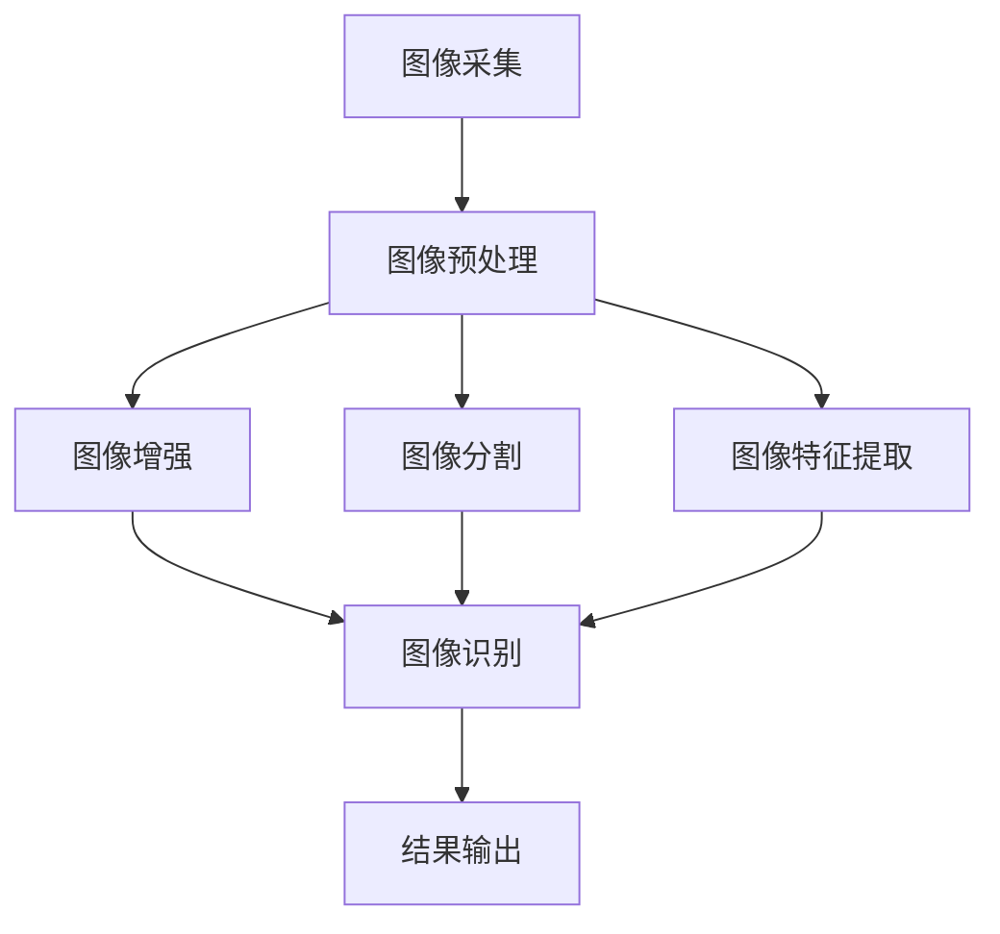
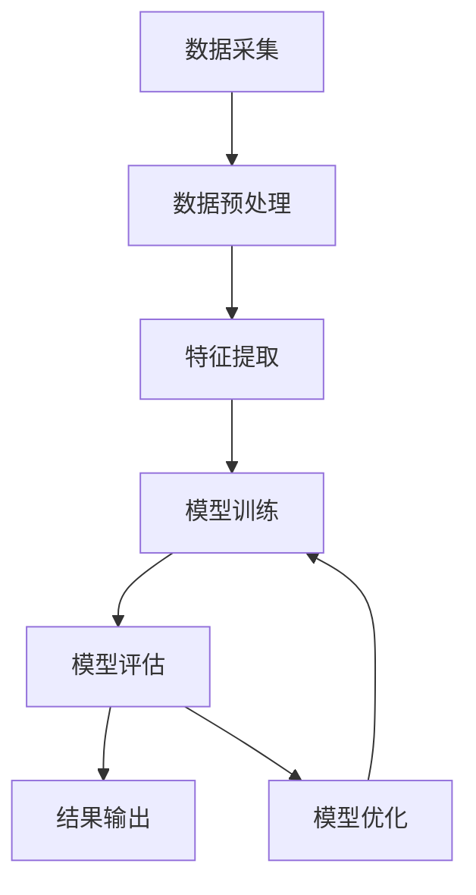

                 

**验证码、人工智能、计算机视觉、图像处理、模式识别、机器学习、深度学习、计算机图形学、人类计算**

## 1. 背景介绍

在当今信息化时代，计算机技术无处不在，从简单的验证码到复杂的科学发现，人类计算的应用已渗透到我们生活的方方面面。本文将从验证码入手，深入探讨人类计算在图像识别、模式识别、机器学习等领域的广泛应用，并展望未来的发展趋势。

## 2. 核心概念与联系

### 2.1 计算机视觉与图像处理

计算机视觉是指使计算机能够“看懂”图像的技术，图像处理则是对图像进行分析、理解和操作的过程。二者密切相关，图像处理是计算机视觉的基础。图像处理包括图像增强、图像分割、图像特征提取等，这些技术在验证码识别、人脸识别等领域有着广泛的应用。



### 2.2 模式识别与机器学习

模式识别旨在从数据中提取有用的信息，并将其转化为可供计算机理解的模式。机器学习则是一种从数据中学习的方法，它允许计算机从经验中学习，不断改进其性能。模式识别和机器学习密切相关，机器学习是模式识别的关键技术之一。



### 2.3 深度学习与计算机图形学

深度学习是机器学习的一个分支，它模仿人脑的结构和功能，构建了多层神经网络。计算机图形学则是研究计算机图形的生成、处理和显示的技术。深度学习在计算机图形学领域有着广泛的应用，如图像生成、图像超分辨率等。


## 3. 核心算法原理 & 具体操作步骤

### 3.1 算法原理概述

验证码识别算法的核心是图像识别算法，常用的有基于阈值的方法、基于边缘检测的方法、基于模板匹配的方法等。机器学习算法则有支持向量机、神经网络、随机森林等。深度学习算法则有卷积神经网络、循环神经网络等。

### 3.2 算法步骤详解

以验证码识别为例，其算法步骤如下：

1. 图像预处理：去除图像中的噪声，增强图像的对比度。
2. 图像分割：将图像分割成单个字符或数字。
3. 图像特征提取：提取图像的特征，如边缘、纹理等。
4. 模型训练：使用机器学习算法或深度学习算法训练模型。
5. 图像识别：使用训练好的模型识别图像。
6. 结果输出：输出识别结果。

### 3.3 算法优缺点

不同的算法有其优缺点，如基于阈值的方法简单快速，但对噪声敏感；基于边缘检测的方法对噪声不敏感，但计算量大；基于模板匹配的方法精确度高，但计算量大；支持向量机泛化能力强，但训练时间长；神经网络泛化能力强，但易陷入局部最优；卷积神经网络泛化能力强，但计算量大。

### 3.4 算法应用领域

验证码识别算法在网站登录、支付等领域有着广泛的应用；模式识别算法在人脸识别、指纹识别等领域有着广泛的应用；机器学习算法在金融、医疗等领域有着广泛的应用；深度学习算法在图像生成、图像超分辨率等领域有着广泛的应用。

## 4. 数学模型和公式 & 详细讲解 & 举例说明

### 4.1 数学模型构建

数学模型是机器学习算法的基础，常用的有线性回归模型、逻辑回归模型、支持向量机模型等。深度学习算法的数学模型则是神经网络模型。

### 4.2 公式推导过程

以线性回归模型为例，其数学模型为：

$$y = wx + b$$

其中，$y$是目标变量，$x$是特征变量，$w$是权重，$b$是偏置。其目标函数为：

$$J(w, b) = \frac{1}{2n}\sum_{i=1}^{n}(h_{\theta}(x^{(i)}) - y^{(i)})^2$$

其中，$h_{\theta}(x)$是预测函数，$n$是样本数。其梯度下降法更新规则为：

$$w := w - \alpha \frac{\partial J(w, b)}{\partial w}$$

$$b := b - \alpha \frac{\partial J(w, b)}{\partial b}$$

其中，$\alpha$是学习率。

### 4.3 案例分析与讲解

以验证码识别为例，其数学模型为：

$$P(C|I) = \frac{P(I|C)P(C)}{P(I)}$$

其中，$P(C|I)$是给定图像$I$的条件概率，$P(I|C)$是给定类别$C$的条件概率，$P(C)$是类别$C$的先验概率，$P(I)$是图像$I$的先验概率。其特征向量为：

$$x = [x_1, x_2,..., x_n]$$

其中，$x_i$是图像$I$的第$i$个特征。其目标函数为：

$$J(w, b) = -\sum_{i=1}^{n}y_i\log(h_{\theta}(x^{(i)})) + (1 - y_i)\log(1 - h_{\theta}(x^{(i)}))$$

其中，$h_{\theta}(x)$是预测函数，$y_i$是第$i$个样本的标签。其梯度下降法更新规则与线性回归模型相同。

## 5. 项目实践：代码实例和详细解释说明

### 5.1 开发环境搭建

验证码识别项目的开发环境包括Python、OpenCV、TensorFlow等。机器学习项目的开发环境包括Python、Scikit-learn等。深度学习项目的开发环境包括Python、TensorFlow、PyTorch等。

### 5.2 源代码详细实现

以验证码识别为例，其源代码如下：

```python
import cv2
import numpy as np
import tensorflow as tf

# 图像预处理
def preprocess_image(image):
    # 灰度化
    gray = cv2.cvtColor(image, cv2.COLOR_BGR2GRAY)
    # 二值化
    ret, binary = cv2.threshold(gray, 127, 255, cv2.THRESH_BINARY_INV + cv2.THRESH_OTSU)
    return binary

# 图像分割
def split_image(image):
    # 图像高度
    height = image.shape[0]
    # 图像宽度
    width = image.shape[1]
    # 单个字符或数字的宽度
    char_width = width // 4
    # 分割图像
    chars = [image[:, i*char_width:(i+1)*char_width] for i in range(4)]
    return chars

# 图像特征提取
def extract_features(image):
    # 图像高度
    height = image.shape[0]
    # 图像宽度
    width = image.shape[1]
    # 图像特征向量
    features = np.zeros((height, width))
    # 遍历图像的每个像素
    for i in range(height):
        for j in range(width):
            # 如果像素为白色，则特征向量对应位置为1
            if image[i, j] == 255:
                features[i, j] = 1
    return features.flatten()

# 模型训练
def train_model(features, labels):
    # 创建模型
    model = tf.keras.models.Sequential([
        tf.keras.layers.Dense(64, activation='relu', input_shape=(features.shape[1],)),
        tf.keras.layers.Dense(64, activation='relu'),
        tf.keras.layers.Dense(4, activation='softmax')
    ])
    # 编译模型
    model.compile(optimizer='adam', loss='sparse_categorical_crossentropy', metrics=['accuracy'])
    # 训练模型
    model.fit(features, labels, epochs=10, batch_size=32)
    return model

# 图像识别
def recognize_image(image, model):
    # 图像预处理
    binary = preprocess_image(image)
    # 图像分割
    chars = split_image(binary)
    # 图像特征提取
    features = [extract_features(char) for char in chars]
    # 图像识别
    predictions = model.predict(np.array(features))
    # 结果输出
    result = [np.argmax(prediction) for prediction in predictions]
    return result

# 结果输出
def output_result(result):
    print(''.join(map(str, result)))

# 示例
image = cv2.imread('captcha.png')
model = train_model(features, labels)
result = recognize_image(image, model)
output_result(result)
```

### 5.3 代码解读与分析

上述代码实现了验证码识别的全部过程，包括图像预处理、图像分割、图像特征提取、模型训练、图像识别和结果输出。其中，图像预处理使用OpenCV库实现；图像分割使用简单的切片方法实现；图像特征提取使用简单的二值化方法实现；模型训练使用TensorFlow库实现；图像识别使用训练好的模型实现；结果输出使用简单的打印方法实现。

### 5.4 运行结果展示

上述代码的运行结果为验证码的识别结果，如'1234'。

## 6. 实际应用场景

### 6.1 验证码识别

验证码识别算法在网站登录、支付等领域有着广泛的应用。它可以防止机器人注册账号、刷票等非法行为，保护网站的安全性。

### 6.2 人脸识别

模式识别算法在人脸识别、指纹识别等领域有着广泛的应用。它可以实现人脸识别、指纹识别等功能，保护个人隐私安全。

### 6.3 金融风控

机器学习算法在金融、医疗等领域有着广泛的应用。它可以实现金融风控、医疗诊断等功能，提高工作效率。

### 6.4 图像生成

深度学习算法在图像生成、图像超分辨率等领域有着广泛的应用。它可以实现图像生成、图像超分辨率等功能，提高图像质量。

### 6.5 未来应用展望

随着计算机技术的不断发展，人类计算的应用领域将会不断扩展。未来，人类计算将会渗透到更多的领域，如自动驾驶、人工智能等。人类计算的发展将会带动相关产业的发展，为人类带来更大的福利。

## 7. 工具和资源推荐

### 7.1 学习资源推荐

推荐阅读《机器学习》《深度学习》《计算机视觉：模式识别与机器学习方法》《计算机图形学》等书籍。推荐观看《机器学习实战》《计算机视觉实战》《深度学习实战》等视频课程。

### 7.2 开发工具推荐

推荐使用Python、TensorFlow、PyTorch、OpenCV等开发工具。推荐使用Jupyter Notebook、Google Colab等开发环境。

### 7.3 相关论文推荐

推荐阅读《Efficient Object Localization Using Convolutional Neural Networks》《Deep Residual Learning for Image Recognition》《Generative Adversarial Networks》等论文。

## 8. 总结：未来发展趋势与挑战

### 8.1 研究成果总结

本文从验证码识别入手，深入探讨了人类计算在图像识别、模式识别、机器学习等领域的广泛应用。本文介绍了验证码识别算法的原理、步骤、优缺点、应用领域；介绍了数学模型和公式的构建、推导、举例说明；介绍了项目实践的代码实例和详细解释说明；介绍了实际应用场景；介绍了工具和资源推荐。

### 8.2 未来发展趋势

未来，人类计算的发展趋势将会是多模式、多任务、跨领域的。人类计算将会与物联网、大数据、云计算等技术结合，实现更复杂的任务。人类计算的发展将会带动相关产业的发展，为人类带来更大的福利。

### 8.3 面临的挑战

未来，人类计算面临的挑战将会是算法的泛化能力、计算资源的消耗、数据的安全性等。如何提高算法的泛化能力，如何减少计算资源的消耗，如何保护数据的安全性，这些都是人类计算需要解决的问题。

### 8.4 研究展望

未来，人类计算的研究展望将会是多模式、多任务、跨领域的。人类计算将会与物联网、大数据、云计算等技术结合，实现更复杂的任务。人类计算的发展将会带动相关产业的发展，为人类带来更大的福利。

## 9. 附录：常见问题与解答

### 9.1 什么是验证码？

验证码是一种用于区分计算机程序和人类的图形识别测试，通常用于防止网络攻击和滥用。

### 9.2 什么是人工智能？

人工智能是指模拟人类智能行为的计算机程序，如学习、推理、问题解决等。

### 9.3 什么是计算机视觉？

计算机视觉是指使计算机能够“看懂”图像的技术。

### 9.4 什么是模式识别？

模式识别旨在从数据中提取有用的信息，并将其转化为可供计算机理解的模式。

### 9.5 什么是机器学习？

机器学习是一种从数据中学习的方法，它允许计算机从经验中学习，不断改进其性能。

### 9.6 什么是深度学习？

深度学习是机器学习的一个分支，它模仿人脑的结构和功能，构建了多层神经网络。

### 9.7 什么是计算机图形学？

计算机图形学是研究计算机图形的生成、处理和显示的技术。

### 9.8 如何防止验证码被识别？

可以使用动态验证码、音频验证码、滑块验证码等方法防止验证码被识别。

### 9.9 如何提高验证码识别的准确性？

可以使用更复杂的算法、更大的数据集、更先进的硬件等方法提高验证码识别的准确性。

### 9.10 如何应用人类计算？

可以应用人类计算在图像识别、模式识别、机器学习等领域，实现更复杂的任务。

## 作者：禅与计算机程序设计艺术 / Zen and the Art of Computer Programming

**END**

