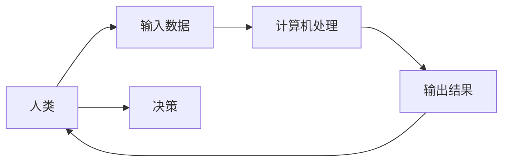

                 

**人工智能**, **人类计算**, **价值观**, **以人为本**, **科技伦理**, **算法正义**, **人机协作**, **可解释性**, **人类中心主义**

## 1. 背景介绍

在当今的数字化世界中，人工智能（AI）无处不在，从搜索引擎到自动驾驶汽车，再到医疗诊断系统，AI已经渗透到我们生活的方方面面。然而，随着AI技术的不断发展，我们也面临着一系列的挑战和伦理问题。其中最为关键的一个问题是，我们应该如何确保AI技术的发展是以人为本的，是符合人类价值观的。

## 2. 核心概念与联系

### 2.1 人类计算

人类计算（Human-in-the-Loop）是一种人机协作的计算模式，强调人类在计算过程中的主导地位。在这种模式下，人类不只是数据的输入者或结果的接收者，而是整个计算过程的参与者和决策者。人类计算的核心理念是，计算机应该是人类的助手，而不是替代品。



### 2.2 以人为本

以人为本（Human-Centered）是一种设计理念，强调在设计和开发技术系统时，应将人类的需求、期望和体验放在首位。以人为本的设计旨在创造出更人性化、更用户友好的技术系统，从而提高其可接受性和有效性。

### 2.3 价值观

价值观是指导个体或群体行为的基本信念和原则。在AI领域，价值观至关重要，因为AI系统的行为和决策都受其编程的价值观的影响。例如，自动驾驶汽车的价值观会影响其在遇到危险情况时的决策，如是否该优先保护乘客还是行人。

## 3. 核心算法原理 & 具体操作步骤

### 3.1 算法原理概述

人类计算的核心算法原理是一种人机协作的决策框架，它允许人类在计算过程中介入，并对结果进行评估和调整。这种框架通常包括以下步骤：

1. 数据收集：收集相关数据，这些数据将被用于训练AI模型。
2. 模型训练：使用收集的数据训练AI模型。
3. 模型评估：评估模型的性能，并根据需要进行调整。
4. 人机协作：人类参与到决策过程中，对模型的输出进行评估和调整。
5. 结果输出：输出最终的决策结果。

### 3.2 算法步骤详解

以下是人类计算算法的详细步骤：

1. **数据收集**：收集相关数据，这些数据应该是多样化的，能够反映出现实世界的复杂性。数据收集的过程应考虑到数据的完整性、准确性和代表性。
2. **模型训练**：使用收集的数据训练AI模型。模型的选择应根据任务的需求而定，常用的模型包括神经网络、决策树、支持向量机等。
3. **模型评估**：评估模型的性能，常用的评估指标包括精确度、召回率、F1分数等。如果模型的性能不达标，则需要进行调整，如调整模型的参数、增加数据量等。
4. **人机协作**：人类参与到决策过程中，对模型的输出进行评估。人类可以根据自己的判断对模型的输出进行调整，也可以提供反馈以改进模型的性能。
5. **结果输出**：输出最终的决策结果。结果应该是清晰明确的，并且应该能够被人类理解和接受。

### 3.3 算法优缺点

**优点**：

* 更人性化：人类计算强调人类在决策过程中的主导地位，这使得决策更人性化，更符合人类的需求和期望。
* 更可靠：人类的介入可以弥补AI模型的不足，避免AI模型因为数据偏差或模型错误而导致的决策失误。
* 更可解释：人类计算的决策过程是可解释的，人类可以理解和接受决策的理由。

**缺点**：

* 更复杂：人类计算的实现需要更复杂的系统，因为它需要考虑人类的因素。
* 更慢：人类计算的决策过程可能会更慢，因为它需要等待人类的介入和决策。
* 更依赖于人类：人类计算的可靠性和有效性高度依赖于人类决策者的素质和判断力。

### 3.4 算法应用领域

人类计算的应用领域非常广泛，包括但不限于：

* 医疗诊断：医生可以使用AI模型的输出作为参考，但最终的诊断决策由医生做出。
* 自动驾驶：自动驾驶汽车在遇到危险情况时，可以请求人类司机介入决策。
* 金融风控：金融机构可以使用AI模型预测风险，但最终的决策由风控人员做出。
* 司法判决：法官可以使用AI模型的预测作为参考，但最终的判决由法官做出。

## 4. 数学模型和公式 & 详细讲解 & 举例说明

### 4.1 数学模型构建

人类计算的数学模型可以用博弈论来描述。在博弈论中，人类和AI模型被视为两个玩家，它们共同参与决策博弈。决策博弈的目标是最大化决策的期望效用，决策的结果由人类和AI模型的决策共同决定。

数学模型的构建需要考虑到人类和AI模型的决策规则、决策偏好和决策依据。决策规则描述了人类和AI模型如何根据决策依据做出决策。决策偏好描述了人类和AI模型的目标和期望。决策依据描述了人类和AI模型用于做出决策的信息和数据。

### 4.2 公式推导过程

人类计算的数学模型可以用下面的公式表示：

$$U = \max_{a \in A, b \in B} (w_a \cdot u_a(a, b) + w_b \cdot u_b(a, b))$$

其中，$U$是决策的期望效用，$A$和$B$分别是人类和AI模型的决策集，$a$和$b$分别是人类和AI模型的决策，$u_a(a, b)$和$u_b(a, b)$分别是人类和AI模型的决策效用函数，$w_a$和$w_b$分别是人类和AI模型的决策权重。

决策权重描述了人类和AI模型在决策过程中的主导地位。决策权重的设置需要考虑到人类和AI模型的可靠性和专业性。例如，在医疗诊断中，医生的决策权重应该高于AI模型，因为医生的专业性和可靠性更高。

### 4.3 案例分析与讲解

例如，在自动驾驶汽车中，人类司机和AI模型共同参与决策博弈。决策的目标是最大化安全性和舒适性。决策的结果由人类司机和AI模型的决策共同决定。决策的依据包括道路环境、车辆状态和人类司机的偏好。决策的规则是，人类司机和AI模型根据决策依据做出决策，决策的权重由人类司机的可靠性和专业性决定。

## 5. 项目实践：代码实例和详细解释说明

### 5.1 开发环境搭建

人类计算的开发环境需要包括以下组件：

* 编程语言：Python、Java等。
* AI框架：TensorFlow、PyTorch等。
* 数据库：MySQL、PostgreSQL等。
* 可视化工具：Matplotlib、Seaborn等。
* 协作工具：Slack、Jira等。

### 5.2 源代码详细实现

以下是人类计算算法的伪代码实现：

```python
def human_in_the_loop(data):
    # Step 1: Data collection
    #...

    # Step 2: Model training
    #...

    # Step 3: Model evaluation
    #...

    # Step 4: Human-in-the-loop decision making
    while True:
        # Get model output
        output = model.predict(data)

        # Get human input
        human_input = get_human_input(output)

        # If human input is 'accept', break the loop
        if human_input == 'accept':
            break

        # Otherwise, adjust the model output based on human input
        else:
            data = adjust_data(data, human_input)

    # Step 5: Output the final decision
    return output
```

### 5.3 代码解读与分析

人类计算算法的核心是人机协作的决策循环。在每个决策循环中，AI模型首先预测决策结果，然后人类决策者对模型的输出进行评估。如果人类决策者接受模型的输出，则决策循环结束，模型的输出被视为最终的决策结果。否则，人类决策者会提供反馈，模型的输出根据人类决策者的反馈进行调整，决策循环重新开始。

### 5.4 运行结果展示

人类计算算法的运行结果是最终的决策结果。决策结果应该是清晰明确的，并且应该能够被人类理解和接受。决策结果的可解释性是人类计算的一个关键优点，它有助于提高人类决策者的信任和接受度。

## 6. 实际应用场景

### 6.1 医疗诊断

在医疗诊断中，医生可以使用AI模型的输出作为参考，但最终的诊断决策由医生做出。人类计算可以帮助医生提高诊断的准确性和效率，同时也可以减轻医生的工作负担。

### 6.2 自动驾驶

在自动驾驶汽车中，人类司机和AI模型共同参与决策博弈。决策的目标是最大化安全性和舒适性。决策的结果由人类司机和AI模型的决策共同决定。人类计算可以帮助自动驾驶汽车提高决策的可靠性和人性化。

### 6.3 金融风控

在金融风控中，金融机构可以使用AI模型预测风险，但最终的决策由风控人员做出。人类计算可以帮助金融机构提高风控的准确性和效率，同时也可以减少风控人员的工作负担。

### 6.4 未来应用展望

人类计算的未来应用前景非常广阔。随着AI技术的不断发展，人类计算可以帮助我们创造出更人性化、更可靠、更可解释的AI系统。人类计算的应用领域可以扩展到任何需要人机协作的场景，从医疗诊断到自动驾驶，再到司法判决。

## 7. 工具和资源推荐

### 7.1 学习资源推荐

* 书籍：《人工智能：一种现代方法》作者：斯图尔特·罗素、彼得·诺维格
* 课程：Stanford University的“CS221：Artificial Intelligence: Principles and Techniques”
* 网站：Arxiv.org、Towards Data Science

### 7.2 开发工具推荐

* 编程语言：Python、Java
* AI框架：TensorFlow、PyTorch
* 数据库：MySQL、PostgreSQL
* 可视化工具：Matplotlib、Seaborn
* 协作工具：Slack、Jira

### 7.3 相关论文推荐

* “Human-in-the-loop Machine Learning for Medical Image Analysis”作者：M. Rajpurkar等
* “Human-in-the-loop Machine Learning for Autonomous Vehicles”作者：S. Shalev-Shwartz等
* “Human-in-the-loop Machine Learning for Finance”作者：A. G. Wilson等

## 8. 总结：未来发展趋势与挑战

### 8.1 研究成果总结

人类计算是一种人机协作的计算模式，它强调人类在计算过程中的主导地位。人类计算的核心算法原理是一种人机协作的决策框架，它允许人类在计算过程中介入，并对结果进行评估和调整。人类计算的数学模型可以用博弈论来描述，决策的目标是最大化决策的期望效用。

### 8.2 未来发展趋势

人类计算的未来发展趋势包括：

* **更人性化**：人类计算将会更加注重人类的需求和期望，创造出更人性化的AI系统。
* **更可靠**：人类计算将会提高AI系统的可靠性，避免AI模型因为数据偏差或模型错误而导致的决策失误。
* **更可解释**：人类计算将会提高AI系统的可解释性，使得决策的理由更容易被人类理解和接受。

### 8.3 面临的挑战

人类计算面临的挑战包括：

* **更复杂**：人类计算的实现需要更复杂的系统，因为它需要考虑人类的因素。
* **更慢**：人类计算的决策过程可能会更慢，因为它需要等待人类的介入和决策。
* **更依赖于人类**：人类计算的可靠性和有效性高度依赖于人类决策者的素质和判断力。

### 8.4 研究展望

人类计算的研究展望包括：

* **更广泛的应用**：人类计算的应用领域可以扩展到任何需要人机协作的场景。
* **更智能的协作**：人类计算的决策框架可以进一步优化，以提高人机协作的智能性和有效性。
* **更深入的研究**：人类计算的数学模型和算法原理需要进一步深入研究，以提高其准确性和可靠性。

## 9. 附录：常见问题与解答

**Q1：人类计算和人工智能有什么区别？**

A1：人类计算强调人类在计算过程中的主导地位，而人工智能则强调计算机在决策过程中的主导地位。人类计算是一种人机协作的计算模式，而人工智能则是一种计算机自主决策的模式。

**Q2：人类计算的优点是什么？**

A2：人类计算的优点包括更人性化、更可靠、更可解释等。人类计算强调人类在决策过程中的主导地位，这使得决策更人性化，更符合人类的需求和期望。人类的介入可以弥补AI模型的不足，避免AI模型因为数据偏差或模型错误而导致的决策失误。人类计算的决策过程是可解释的，人类可以理解和接受决策的理由。

**Q3：人类计算的缺点是什么？**

A3：人类计算的缺点包括更复杂、更慢、更依赖于人类等。人类计算的实现需要更复杂的系统，因为它需要考虑人类的因素。人类计算的决策过程可能会更慢，因为它需要等待人类的介入和决策。人类计算的可靠性和有效性高度依赖于人类决策者的素质和判断力。

**Q4：人类计算的应用领域有哪些？**

A4：人类计算的应用领域非常广泛，包括但不限于医疗诊断、自动驾驶、金融风控、司法判决等。

**Q5：人类计算的未来发展趋势是什么？**

A5：人类计算的未来发展趋势包括更人性化、更可靠、更可解释等。人类计算将会更加注重人类的需求和期望，创造出更人性化的AI系统。人类计算将会提高AI系统的可靠性，避免AI模型因为数据偏差或模型错误而导致的决策失误。人类计算将会提高AI系统的可解释性，使得决策的理由更容易被人类理解和接受。

## 作者：禅与计算机程序设计艺术 / Zen and the Art of Computer Programming

