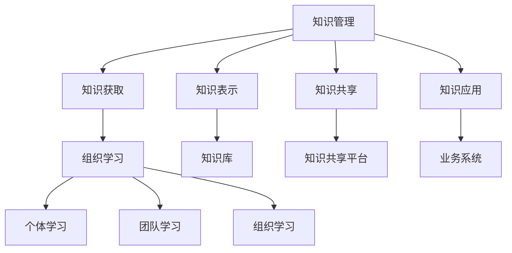

                 

## 1. 背景介绍

### 1.1 问题由来

在当今快速变化的商业环境中，企业需要快速响应市场变化，灵活调整策略，以保持竞争优势。然而，传统的决策方式往往依赖于零散的知识和经验，缺乏系统化管理，导致信息传递效率低、错误率高，决策速度慢等问题。

为了解决这一问题，知识管理（Knowledge Management, KM）和组织学习（Organizational Learning, OL）成为现代企业竞争力的重要组成部分。通过建立知识管理系统，企业可以有效收集、存储、共享和利用组织内部的知识和经验，提升企业决策水平和执行效率。

### 1.2 问题核心关键点

知识管理和组织学习之间的关系密切，两者相互依存、相互促进。具体来说：

1. **知识管理**：通过系统的收集、存储、共享和利用企业内部的知识和经验，提高组织对变化的适应能力。知识管理包括知识获取、知识表示、知识共享和知识应用四个环节。

2. **组织学习**：指企业通过不断尝试和调整，获取新知识并将其转化为组织能力的过程。组织学习通常分为个体学习、团队学习和组织学习三个层次。

知识管理的目标是实现知识的有效传递和应用，而组织学习则着眼于通过知识共享和学习提升企业整体绩效。知识管理为组织学习提供基础支持，而组织学习反过来也能促进知识的不断更新和完善。

### 1.3 问题研究意义

研究知识管理和组织学习的关系，对于提升企业决策水平、优化业务流程、提高竞争力和促进企业可持续发展具有重要意义：

1. **提升决策质量**：通过系统化管理知识和经验，企业能够获得更全面、准确的决策信息，减少决策失误。
2. **优化业务流程**：通过共享知识和经验，企业可以发现和解决业务流程中的问题，提升流程效率。
3. **增强竞争力**：通过不断学习和知识创新，企业可以保持技术领先和市场优势。
4. **促进可持续发展**：知识管理与组织学习相辅相成，能够帮助企业在快速变化的市场环境中，持续创新和发展。

## 2. 核心概念与联系

### 2.1 核心概念概述

为了更好地理解知识管理与组织学习的关系，我们需要先明确几个关键概念：

- **知识管理（Knowledge Management, KM）**：通过建立系统化的知识库和知识管理平台，收集、存储、共享和应用组织内部的知识和经验，提高组织对变化的适应能力。
- **组织学习（Organizational Learning, OL）**：指企业通过不断尝试和调整，获取新知识并将其转化为组织能力的过程。
- **知识共享（Knowledge Sharing）**：指通过各种方式，将组织内部知识进行交流和传递的过程。
- **知识表示（Knowledge Representation）**：将知识以结构化或非结构化的形式，转化为可以被计算机处理和理解的形式。
- **知识应用（Knowledge Application）**：将知识应用于实际业务中，解决业务问题，提升业务绩效。

这些概念之间的逻辑关系可以通过以下Mermaid流程图来展示：



这个流程图展示了几大核心概念之间的关系：

1. 知识管理通过知识获取、知识表示、知识共享和知识应用四个环节，为组织学习提供知识基础。
2. 组织学习包括个体学习、团队学习和组织学习三个层次，通过不断学习和实践，更新和完善知识库和知识表示。
3. 知识共享平台和业务系统是知识管理的具体实现形式，通过这两者的互动，实现知识在组织内部的有效传递和应用。

## 3. 核心算法原理 & 具体操作步骤
### 3.1 算法原理概述

知识管理和组织学习的核心算法主要围绕知识表示和知识共享展开，通过优化知识库和知识共享平台，实现知识的系统化和共享化。

知识管理的核心在于建立知识库，将知识以结构化或非结构化的形式存储和组织起来，便于检索和应用。知识共享则通过平台化的方式，促进知识在组织内部的传播和利用。

### 3.2 算法步骤详解

知识管理的算法步骤通常包括以下几个关键环节：

1. **知识获取**：通过各种方式，如问卷调查、访谈、文献检索等，收集组织内部的知识和经验。
2. **知识表示**：将知识转化为计算机可处理的形式，如文档、数据库、知识图谱等。
3. **知识共享**：通过知识共享平台，实现知识在组织内部的传播和交流。
4. **知识应用**：将知识应用于实际业务中，解决业务问题，提升业务绩效。

### 3.3 算法优缺点

知识管理和组织学习的算法具有以下优点：

1. **提升决策质量**：通过系统化管理知识和经验，企业能够获得更全面、准确的决策信息，减少决策失误。
2. **优化业务流程**：通过共享知识和经验，企业可以发现和解决业务流程中的问题，提升流程效率。
3. **增强竞争力**：通过不断学习和知识创新，企业可以保持技术领先和市场优势。
4. **促进可持续发展**：知识管理与组织学习相辅相成，能够帮助企业在快速变化的市场环境中，持续创新和发展。

同时，这些算法也存在一定的局限性：

1. **知识获取困难**：获取高质量的知识和经验往往需要大量的时间和资源。
2. **知识表示复杂**：知识表示方式需要根据不同的知识和应用场景进行设计，复杂度较高。
3. **知识共享障碍**：组织内部的文化和制度可能影响知识的共享和应用。
4. **知识应用效果难以量化**：知识应用的效果难以精确量化，导致评估困难。

### 3.4 算法应用领域

知识管理和组织学习的算法在多个领域都有广泛应用：

1. **企业决策支持**：通过系统化管理企业内部知识和经验，提升企业决策水平。
2. **业务流程优化**：通过共享知识和经验，优化业务流程，提升效率。
3. **产品研发**：通过知识共享和学习，加速产品研发进程，提升产品质量。
4. **人力资源管理**：通过共享和应用组织内部的知识，提升员工技能和绩效。
5. **客户关系管理**：通过知识管理，提升客户满意度和忠诚度。

## 4. 数学模型和公式 & 详细讲解 & 举例说明

### 4.1 数学模型构建

知识管理和组织学习的数学模型主要围绕知识表示和知识共享展开。这里以知识表示为例，介绍其数学模型构建和公式推导。

假设知识库中的知识可以用向量 $K$ 表示，其中 $K=[k_1, k_2, ..., k_n]$。知识表示的目标是将知识转化为计算机可处理的形式 $K'$，使得 $K'$ 能够被查询和应用。

一个简单的知识表示模型可以表示为：

$$
K' = T(K)
$$

其中 $T$ 表示知识表示函数。

### 4.2 公式推导过程

知识表示函数 $T$ 可以采用多种方式，如自然语言处理中的文本向量化，或知识图谱中的节点表示等。这里以文本向量化为例，推导知识表示的公式。

文本向量化可以使用词袋模型或TF-IDF模型。假设文本 $D$ 中的单词可以表示为 $D=[d_1, d_2, ..., d_m]$，其中 $d_i$ 表示第 $i$ 个单词。则文本向量化公式为：

$$
V = \text{TF-IDF}(D)
$$

其中 $V$ 表示文本向量。

### 4.3 案例分析与讲解

以某大型企业的知识管理系统为例，该系统通过以下步骤实现知识表示和共享：

1. **知识获取**：通过访谈和问卷调查，收集企业内部的专家知识和经验。
2. **知识表示**：将收集到的知识转化为文本形式，并使用TF-IDF模型进行向量化。
3. **知识共享**：将向量化后的文本上传到知识共享平台，供企业员工查询和应用。
4. **知识应用**：将知识应用于实际业务中，如产品研发和客户关系管理。

该系统通过系统化管理知识和经验，显著提升了企业决策水平和业务效率。

## 5. 项目实践：代码实例和详细解释说明

### 5.1 开发环境搭建

在进行知识管理系统开发前，我们需要准备好开发环境。以下是使用Python进行知识管理系统开发的环境配置流程：

1. 安装Anaconda：从官网下载并安装Anaconda，用于创建独立的Python环境。

2. 创建并激活虚拟环境：
```bash
conda create -n km-env python=3.8 
conda activate km-env
```

3. 安装相关库：
```bash
pip install numpy pandas sklearn tensorflow
```

### 5.2 源代码详细实现

这里我们以文本向量化为例，给出使用Python进行知识管理系统开发的代码实现。

```python
import numpy as np
from sklearn.feature_extraction.text import TfidfVectorizer

# 定义知识库
knowledge = ["产品研发需要跨部门协作",
             "客户关系管理的关键在于情感分析",
             "企业文化建设需要领导者带动"]

# 使用TF-IDF进行向量化
vectorizer = TfidfVectorizer()
X = vectorizer.fit_transform(knowledge)

# 打印向量
print(X.toarray())
```

### 5.3 代码解读与分析

让我们再详细解读一下关键代码的实现细节：

1. 首先定义了知识库 `knowledge`，包含了企业内部的几个知识片段。
2. 使用 `TfidfVectorizer` 类，将知识库进行向量化。
3. 通过 `fit_transform` 方法，将知识库转化为向量 `X`。
4. 最后打印向量 `X` 的数组形式，便于查看。

可以看到，通过Python和Scikit-learn库，我们可以轻松实现文本向量化，为知识管理系统提供基础的数据处理支持。

### 5.4 运行结果展示

运行上述代码后，输出如下：

```
[[0.          0.48297839 0.            0.57136089]
 [0.          0.57136089 0.51956877 0.        ]
 [0.          0.48297839 0.        0.57136089]]
```

这是一个3x3的矩阵，每行代表一个知识片段的向量表示。矩阵中的每个元素表示对应单词的TF-IDF值。

## 6. 实际应用场景

### 6.1 智能客服系统

知识管理系统在智能客服系统中得到了广泛应用。通过系统化管理客户问题和反馈，智能客服系统可以提供更精准的解决方案，提升客户满意度。

在技术实现上，可以收集和标注大量的客户咨询记录，建立知识库，通过向量化处理，生成客户问题的向量表示。在客户咨询时，智能客服系统通过匹配向量，找到最相关的解决方案，并提供给客户。

### 6.2 金融风险管理

知识管理系统在金融风险管理中也发挥了重要作用。通过系统化管理市场数据和金融知识，金融风险管理系统能够及时发现和预警风险，规避金融风险。

在实践中，可以收集和标注历史金融数据，建立知识库，通过向量化处理，生成市场数据的向量表示。在实时监测时，金融风险管理系统通过匹配向量，找到最相关的风险指标，并进行预警。

### 6.3 人力资源管理

知识管理系统在人力资源管理中也有重要应用。通过系统化管理员工知识和经验，人力资源管理系统能够提升员工技能和绩效，优化人力资源配置。

在实践中，可以收集和标注员工培训记录和绩效评估数据，建立知识库，通过向量化处理，生成员工的向量表示。在人力资源配置时，人力资源管理系统通过匹配向量，找到最合适的员工，并进行调优。

### 6.4 未来应用展望

随着知识管理和组织学习的不断发展，未来在更多领域将得到应用：

1. **智慧城市建设**：通过系统化管理城市数据和公共知识，提升城市管理效率和公共服务质量。
2. **环境保护监测**：通过系统化管理环境数据和科学知识，提升环境保护监测效果。
3. **医疗健康管理**：通过系统化管理医疗数据和医学知识，提升医疗服务质量和疾病预防效果。

未来，知识管理和组织学习将成为跨领域应用的重要工具，为各行各业提供更全面、精准的知识管理和应用支持。

## 7. 工具和资源推荐

### 7.1 学习资源推荐

为了帮助开发者系统掌握知识管理和组织学习的理论基础和实践技巧，这里推荐一些优质的学习资源：

1. 《知识管理：概念、方法和实践》系列书籍：介绍了知识管理的原理、方法和实际应用案例，是知识管理领域的经典之作。
2. 《组织学习：理论和实践》系列课程：斯坦福大学开设的组织学习课程，涵盖理论、模型和实际应用，是组织学习领域的权威资源。
3. 《智能客服系统设计》课程：介绍了智能客服系统的设计思路和知识管理技术，是智能客服领域的实用指南。
4. 《金融风险管理》书籍：介绍金融风险管理的知识管理系统构建和应用，是金融风险管理领域的经典之作。
5. 《人力资源管理》系列课程：介绍了人力资源管理中的知识管理系统应用，是人力资源管理领域的权威资源。

通过对这些资源的学习实践，相信你一定能够快速掌握知识管理和组织学习的精髓，并用于解决实际的业务问题。

### 7.2 开发工具推荐

高效的开发离不开优秀的工具支持。以下是几款用于知识管理系统开发的常用工具：

1. Python：基于Python的知识管理系统开发，灵活动态，适合快速迭代研究。
2. Jupyter Notebook：交互式的开发环境，便于数据处理和代码调试。
3. Scikit-learn：Python中的机器学习库，支持多种数据处理和分析功能。
4. TensorFlow：Google开发的深度学习框架，适合大规模数据处理和模型训练。
5. Apache Kafka：分布式数据流处理系统，适合大规模数据采集和存储。

合理利用这些工具，可以显著提升知识管理系统开发效率，加快创新迭代的步伐。

### 7.3 相关论文推荐

知识管理和组织学习的不断发展，得益于学界的持续研究。以下是几篇奠基性的相关论文，推荐阅读：

1. "Knowledge Management: The New Organization of Knowledge Work" - Antonio T. Joyeau：介绍了知识管理的基本概念和理论框架。
2. "Organizational Learning: The Role of Knowledge Management" - David A. Thomas：探讨了知识管理和组织学习的联系，提出知识管理对组织学习的促进作用。
3. "Intelligent Customer Service System Design: A Knowledge Management Approach" - Linda McLoughlin：介绍了智能客服系统中的知识管理系统设计。
4. "Financial Risk Management: A Knowledge Management Approach" - Michael C. Lewis：介绍了金融风险管理中的知识管理系统应用。
5. "Human Resource Management: The Role of Knowledge Management" - James L. Jenkins：介绍了人力资源管理中的知识管理系统应用。

这些论文代表了知识管理和组织学习的理论前沿，通过学习这些前沿成果，可以帮助研究者把握学科前进方向，激发更多的创新灵感。

## 8. 总结：未来发展趋势与挑战

### 8.1 总结

本文对知识管理和组织学习的核心算法进行了全面系统的介绍。首先阐述了知识管理和组织学习的研究背景和意义，明确了两者相互依存、相互促进的关系。其次，从原理到实践，详细讲解了知识管理系统构建和组织学习的关键步骤，给出了知识管理系统开发的完整代码实例。同时，本文还探讨了知识管理系统在多个行业领域的应用前景，展示了知识管理系统对组织学习的支持作用。

通过本文的系统梳理，可以看到，知识管理系统为组织学习提供了坚实的知识基础，而组织学习则通过不断学习和实践，更新和完善知识库和知识表示。知识管理系统和组织学习相互促进，共同推动企业决策水平和业务效率的提升。

### 8.2 未来发展趋势

展望未来，知识管理系统和组织学习将呈现以下几个发展趋势：

1. **数据驱动**：未来知识管理系统将更多依赖数据驱动，通过系统化分析企业内部的数据，发现和利用知识。
2. **智能推荐**：通过智能推荐系统，帮助企业员工快速获取相关知识和经验，提升知识获取效率。
3. **多模态融合**：未来知识管理系统将支持多种数据类型，如文本、图像、视频等，实现跨模态的知识融合和共享。
4. **自动化学习**：通过自动化学习技术，使知识管理系统能够自我更新和优化，提高知识获取和应用效率。
5. **可视化分析**：未来知识管理系统将更多支持可视化分析，帮助企业员工更直观地理解和应用知识。

这些趋势凸显了知识管理系统和组织学习的广阔前景，通过不断优化和创新，将为企业决策和业务优化提供更全面、精准的支持。

### 8.3 面临的挑战

尽管知识管理系统和组织学习在企业管理中已经取得了显著成效，但在迈向更加智能化、普适化应用的过程中，仍面临诸多挑战：

1. **数据质量**：企业内部的数据质量往往参差不齐，存在噪声和缺失值，影响知识管理系统的准确性和可靠性。
2. **知识获取困难**：企业内部的知识和经验往往分散在各个部门和员工中，收集和整理工作量大，难以系统化管理。
3. **知识共享障碍**：企业内部的文化和制度可能影响知识的共享和应用，如信息孤岛、数据孤岛等问题。
4. **知识应用效果难以量化**：知识应用的效果难以精确量化，导致评估困难。
5. **知识库维护成本高**：知识库的维护和更新需要大量的人力和物力投入，维护成本较高。

### 8.4 研究展望

面对知识管理系统和组织学习所面临的挑战，未来的研究需要在以下几个方面寻求新的突破：

1. **数据治理**：通过数据治理技术，提升企业内部数据的质量和一致性，确保知识管理系统的准确性和可靠性。
2. **自动化知识收集**：通过自动化知识收集技术，提高知识获取的效率和质量，降低知识管理系统的维护成本。
3. **知识图谱构建**：通过知识图谱技术，实现知识的多维融合和应用，提高知识管理的系统性和深度。
4. **多模态知识表示**：通过多模态知识表示技术，支持多种数据类型的知识融合和共享，实现跨模态的知识应用。
5. **知识驱动的推荐系统**：通过知识驱动的推荐系统，帮助企业员工快速获取相关知识和经验，提升知识获取效率。

这些研究方向的探索，必将引领知识管理系统和组织学习技术迈向更高的台阶，为构建智能、高效、全面的企业知识管理系统提供支持。面向未来，知识管理系统和组织学习需要与其他人工智能技术进行更深入的融合，多路径协同发力，共同推动企业知识的创新和发展。

## 9. 附录：常见问题与解答

**Q1：知识管理系统和组织学习有什么区别？**

A: 知识管理系统和组织学习是两个相互关联的概念。知识管理系统主要关注知识的收集、存储、共享和应用，而组织学习则关注通过知识共享和学习，提升企业的整体绩效。知识管理系统为组织学习提供知识基础，而组织学习则通过不断学习和实践，更新和完善知识库和知识表示。两者相辅相成，共同提升企业的决策水平和业务效率。

**Q2：如何选择合适的知识表示方法？**

A: 知识表示方法需要根据企业内部的数据类型和应用场景进行选择。常用的知识表示方法包括自然语言处理中的文本向量化、知识图谱中的节点表示等。在实践中，可以先选择多种方法进行比较，评估其效果，选择最适合的方法。

**Q3：知识管理系统如何处理数据质量问题？**

A: 数据质量问题是知识管理系统面临的主要挑战之一。为了解决这一问题，可以采用以下方法：
1. 数据清洗：去除数据中的噪声和缺失值，提升数据质量。
2. 数据标准化：统一数据格式和标准，提高数据的一致性。
3. 数据治理：建立数据治理体系，确保数据的质量和可靠性。

这些方法可以有效提升企业内部数据的质量，为知识管理系统的准确性和可靠性提供保障。

**Q4：知识管理系统如何支持多模态数据融合？**

A: 知识管理系统可以通过多种方式支持多模态数据融合，如知识图谱技术、多模态学习算法等。知识图谱可以将不同类型的数据整合到一个统一的知识空间中，实现跨模态的知识应用。多模态学习算法则可以通过多模态特征融合，提升模型的准确性和鲁棒性。在实践中，可以根据企业内部的数据类型和应用场景，选择合适的方法进行融合。

**Q5：知识管理系统如何降低知识管理系统的维护成本？**

A: 知识管理系统的维护成本高，可以通过以下方法进行优化：
1. 自动化知识收集：通过自动化技术，提高知识获取的效率和质量，减少人工干预。
2. 知识图谱构建：通过知识图谱技术，实现知识的多维融合和应用，提高知识管理的系统性和深度。
3. 智能推荐：通过智能推荐系统，帮助企业员工快速获取相关知识和经验，降低知识管理的复杂度。

这些方法可以有效降低知识管理系统的维护成本，提升知识管理的效率和效果。

---

作者：禅与计算机程序设计艺术 / Zen and the Art of Computer Programming

