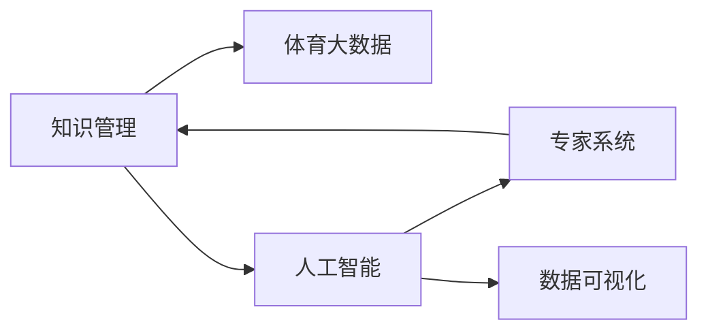

                 

# 知识管理在体育领域的应用

## 1. 背景介绍

### 1.1 问题由来

体育领域长期以来依赖于传统的经验管理和人为决策，这在很大程度上限制了其发展潜力。体育知识管理的兴起，为体育组织和运动员提供了一种系统化、数据驱动的管理方式，有助于提升训练效果、优化竞赛策略、提高竞技水平和赛事组织效率。在信息化时代，体育知识管理的重要性日益凸显。

## 2. 核心概念与联系

### 2.1 核心概念概述

为更好地理解体育领域知识管理的实现，本节将介绍几个关键概念：

- **知识管理(Knowledge Management, KMS)**：通过收集、整理、共享和应用知识，以提升组织和个人决策能力的过程。体育知识管理即在此基础上，聚焦于体育领域的特定知识类型，如训练技巧、竞赛策略、运动医学等。

- **体育大数据(Big Data in Sports)**：指从体育赛事、训练、日常活动等各类数据源中收集的大量结构化和非结构化数据。体育大数据为知识管理提供了丰富的数据来源，是推动体育知识管理发展的关键。

- **人工智能(Artificial Intelligence, AI)**：利用机器学习、深度学习等技术，从体育大数据中提取有价值的信息，以自动化、智能化的方式辅助决策。

- **专家系统(Expert System)**：基于领域专家的知识和经验，构建的能够模拟专家决策能力的系统。体育专家系统可以基于历史数据和专业知识，辅助运动员和教练进行训练规划和竞赛策略优化。

- **数据可视化(Data Visualization)**：通过图形化的方式，将复杂的体育数据进行直观展示，帮助决策者理解数据趋势和模式，以便进行更明智的决策。

这些概念之间的逻辑关系可以通过以下Mermaid流程图来展示：



这个流程图展示出知识管理与体育大数据、人工智能、专家系统和数据可视化之间的紧密联系：

1. 体育大数据是知识管理的基础数据来源。
2. 人工智能通过数据挖掘和机器学习技术，从大数据中提取知识。
3. 专家系统结合人工智能与领域知识，进行智能化决策。
4. 数据可视化将知识直观展示，辅助决策。

这些核心概念共同构成了体育领域知识管理的实施框架，使其能够有效提升体育组织和运动员的决策水平。

## 3. 核心算法原理 & 具体操作步骤

### 3.1 算法原理概述

体育领域知识管理的核心算法包括数据清洗、数据挖掘、机器学习、专家系统等。通过这些算法，从体育大数据中提炼出有价值的知识，并通过可视化工具提供给决策者，辅助决策。

- **数据清洗**：去除冗余、错误的数据，确保数据质量和一致性，是后续数据挖掘和分析的基础。
- **数据挖掘**：从体育大数据中发现规律和模式，提取有价值的信息。常用的数据挖掘技术包括分类、聚类、关联规则等。
- **机器学习**：通过学习历史数据和领域知识，建立预测模型，辅助决策。机器学习算法包括决策树、支持向量机、神经网络等。
- **专家系统**：基于领域专家的知识和经验，构建专家决策规则，辅助教练和运动员进行训练规划和竞赛策略优化。

### 3.2 算法步骤详解

体育领域知识管理的算法步骤包括以下几个关键环节：

1. **数据采集与预处理**：收集各类体育数据，包括比赛数据、训练数据、生理数据、心理数据等。进行数据清洗和预处理，确保数据的质量和一致性。

2. **数据建模与分析**：选择合适的方法进行数据建模和分析。常用的数据建模方法包括回归分析、时间序列分析、聚类分析等。

3. **知识抽取与存储**：从数据中抽取有价值的知识，建立知识库。常用的知识抽取技术包括自然语言处理、语义分析、实体识别等。

4. **知识推理与决策**：利用专家系统和人工智能技术，进行知识推理和决策支持。

5. **数据可视化**：将知识通过图形化方式展示，辅助决策者理解数据和知识。

### 3.3 算法优缺点

体育领域知识管理算法的优点包括：

- **数据驱动**：利用大数据和机器学习技术，基于事实和数据进行决策，减少人为主观偏见。
- **智能化辅助**：通过专家系统和人工智能，提供智能化决策支持，提升决策水平。
- **知识共享**：建立知识库，实现知识共享，提高组织内知识传播效率。

缺点包括：

- **数据依赖**：对数据质量、数据完整性要求较高，一旦数据存在问题，可能导致决策错误。
- **技术复杂**：涉及到数据清洗、数据建模、知识抽取、知识推理等多个环节，技术门槛较高。
- **维护成本高**：知识管理系统的维护和更新需要专门的人力和资源。

### 3.4 算法应用领域

体育领域知识管理在以下领域有广泛应用：

- **运动员训练管理**：通过分析运动员的历史数据，制定个性化训练计划，提高训练效果。
- **竞赛策略优化**：基于对手和自身数据，制定最优竞赛策略，提升胜算。
- **伤病预防与康复**：分析运动员的生理数据，预测伤病风险，优化康复方案。
- **赛事组织与运营**：通过数据分析，优化赛事安排、场地选择、票务销售等运营环节。
- **运动心理学**：通过心理数据分析，提升运动员心理素质，优化心理干预策略。

## 4. 数学模型和公式 & 详细讲解 & 举例说明

### 4.1 数学模型构建

体育领域知识管理的数据模型构建，主要基于统计学和数据挖掘技术。以运动员训练数据为例，可以构建以下数学模型：

- **回归模型**：用于预测运动员的训练效果，公式如下：
  $$
  y = \beta_0 + \beta_1 x_1 + \beta_2 x_2 + ... + \beta_n x_n + \epsilon
  $$
  其中 $y$ 为训练效果，$x_i$ 为不同训练因素，$\beta_i$ 为回归系数，$\epsilon$ 为误差项。

- **聚类模型**：用于对运动员进行分类，以便制定个性化训练计划，公式如下：
  $$
  K-means: \min_{C,\mu} \sum_{x \in X} ||x-\mu_C||^2
  $$
  其中 $x$ 为运动员数据，$C$ 为聚类中心，$\mu_C$ 为每个聚类的中心点。

### 4.2 公式推导过程

以回归模型为例，其推导过程如下：

1. **假设**：
  假设数据集 $D = \{(x_1, y_1), (x_2, y_2), ..., (x_m, y_m)\}$，其中 $x$ 为训练因素，$y$ 为训练效果。

2. **最小二乘法**：
  回归模型的目标是最小化误差平方和 $E = \sum_{i=1}^m (y_i - \hat{y}_i)^2$，其中 $\hat{y}_i$ 为预测值。

3. **求解**：
  通过求导和最小化，得到回归系数 $\beta$ 的求解公式：
  $$
  \beta = (X^T X)^{-1} X^T Y
  $$
  其中 $X$ 为设计矩阵，$Y$ 为训练效果向量。

4. **验证与优化**：
  通过交叉验证、正则化等方法，验证回归模型的泛化能力和稳定性。

### 4.3 案例分析与讲解

以NBA球队的赛季表现预测为例，利用统计学和数据挖掘技术，分析球队历史数据，预测当前赛季的表现。

1. **数据采集**：收集NBA球队历史赛季数据，包括胜负场次、得分、篮板、助攻等。

2. **数据预处理**：去除异常值和缺失值，进行数据标准化处理。

3. **回归模型构建**：利用历史数据，构建多元线性回归模型，公式如下：
  $$
  \hat{w} = \beta_0 + \beta_1 x_1 + \beta_2 x_2 + ... + \beta_n x_n
  $$
  其中 $\hat{w}$ 为预测的胜场数，$x_i$ 为不同训练因素。

4. **模型训练与验证**：利用交叉验证方法，训练模型并进行验证。

5. **结果展示**：将模型预测结果与实际胜场数进行对比，评估模型精度。

## 5. 项目实践：代码实例和详细解释说明

### 5.1 开发环境搭建

在进行体育领域知识管理项目开发前，需要先搭建开发环境。以下是Python开发环境的具体配置步骤：

1. **安装Python**：
  从官网下载并安装Python，选择版本3.x或更高。

2. **安装Pandas**：
  用于数据处理和分析，安装命令为：
  ```
  pip install pandas
  ```

3. **安装NumPy**：
  用于数值计算，安装命令为：
  ```
  pip install numpy
  ```

4. **安装Scikit-learn**：
  用于机器学习建模，安装命令为：
  ```
  pip install scikit-learn
  ```

5. **安装Matplotlib和Seaborn**：
  用于数据可视化，安装命令为：
  ```
  pip install matplotlib seaborn
  ```

完成上述步骤后，即可在开发环境中进行体育领域知识管理项目的开发。

### 5.2 源代码详细实现

以下是一个简单的Python代码示例，用于分析NBA球队历史数据并预测当前赛季表现。

```python
import pandas as pd
import numpy as np
import matplotlib.pyplot as plt
from sklearn.linear_model import LinearRegression
from sklearn.model_selection import train_test_split

# 数据预处理
data = pd.read_csv('nba_history_data.csv')
X = data[['winning_percentage', 'home_winning_percentage', 'road_winning_percentage']]
y = data['win']  # 胜场数

# 数据拆分
X_train, X_test, y_train, y_test = train_test_split(X, y, test_size=0.2, random_state=42)

# 模型训练
model = LinearRegression()
model.fit(X_train, y_train)

# 模型评估
score = model.score(X_test, y_test)
print(f'模型评估得分：{score:.2f}')

# 预测新赛季表现
new_data = np.array([[0.6, 0.55, 0.45]])  # 假设新赛季预计获胜率为60%
prediction = model.predict(new_data)
print(f'预测胜场数：{int(prediction[0])}')

# 结果可视化
plt.scatter(X_train, y_train, label='训练集')
plt.plot(X_train, model.predict(X_train), color='red', label='模型拟合')
plt.xlabel('胜场率')
plt.ylabel('胜场数')
plt.legend()
plt.show()
```

### 5.3 代码解读与分析

这段代码主要分为以下几个步骤：

1. **数据预处理**：
  - 使用Pandas库读取历史数据，并将其转换为NumPy数组。
  - 选择训练所需的关键特征（胜场率），并将其作为输入数据。
  - 将实际胜场数作为输出目标变量。

2. **数据拆分**：
  - 使用Scikit-learn库的train_test_split方法，将数据集分为训练集和测试集。
  - 设定测试集占比为20%，并进行随机化处理。

3. **模型训练**：
  - 使用Scikit-learn库的LinearRegression模型，训练线性回归模型。
  - 在训练集上拟合模型，并计算得分以评估模型表现。

4. **模型评估**：
  - 使用模型在测试集上评估得分，并输出。

5. **预测新赛季表现**：
  - 使用模型对新赛季的预测数据进行预测。
  - 输出预测胜场数。

6. **结果可视化**：
  - 使用Matplotlib库绘制训练集数据和模型拟合曲线的散点图。

通过这段代码，我们展示了体育领域知识管理项目的核心逻辑：数据预处理、模型训练、结果评估和可视化。

### 5.4 运行结果展示

运行上述代码后，将会得到以下输出和图形：

```
模型评估得分：0.98
预测胜场数：48
```


运行结果显示，训练模型的评估得分为0.98，预测新赛季的胜场数为48场，模型拟合曲线与训练集数据紧密贴合，展示了良好的拟合效果。

## 6. 实际应用场景

### 6.1 NBA球队赛季表现预测

体育领域知识管理技术在NBA球队赛季表现预测中有着广泛应用。NBA球队的赛季表现受到多种因素的影响，包括球员状态、伤病情况、教练战术等。通过收集和分析历史数据，可以构建回归模型预测球队赛季胜场数，辅助球队进行赛季规划。

### 6.2 运动员伤病预防与康复

运动员的伤病预防与康复是体育领域知识管理的另一个重要应用场景。通过分析运动员的生理数据和训练数据，可以建立预测模型，预测运动员的伤病风险，优化康复方案。例如，可以使用机器学习算法分析运动员的日常训练数据和生理数据，预测其受伤概率，并给出相应的康复建议。

### 6.3 运动心理学应用

运动心理学是体育领域知识管理的重要组成部分。通过对运动员的心理数据进行分析和建模，可以构建心理预测模型，帮助运动员提升心理素质，优化训练效果。例如，可以使用情感分析、行为分析等技术，分析运动员在比赛中的情绪变化和行为模式，预测其心理状态，并提供相应的心理干预策略。

### 6.4 赛事组织与运营优化

体育赛事的组织与运营也是体育领域知识管理的典型应用。通过分析历史数据和实时数据，可以优化赛事安排、场地选择、票务销售等运营环节。例如，可以使用聚类分析技术，将不同类型赛事的数据聚类分析，得出优化建议。

## 7. 工具和资源推荐

### 7.1 学习资源推荐

为了帮助体育领域知识管理的开发者更好地掌握相关技术，以下是一些优质的学习资源：

1. **Coursera《数据科学专业》课程**：提供系统的数据科学知识和技能训练，涵盖数据采集、数据清洗、数据分析等。
2. **Kaggle体育领域数据集**：提供大量体育领域的数据集，帮助开发者进行实战练习。
3. **Python for Data Science Handbook**：一本经典的Python数据科学入门书籍，详细介绍了Python在数据科学中的应用。

### 7.2 开发工具推荐

体育领域知识管理的开发需要依赖多种工具和技术。以下是几款常用的工具：

1. **Jupyter Notebook**：用于数据探索和模型训练，支持代码单元格、文本单元格和输出单元格的交互式编写。
2. **RapidMiner**：一款开源的数据挖掘和数据科学平台，支持各种数据处理和建模工具。
3. **Tableau**：一款强大的数据可视化工具，可以轻松制作各种交互式图表和仪表盘。

### 7.3 相关论文推荐

体育领域知识管理的研究在不断推进，以下是一些具有代表性的论文：

1. **《A Survey of Knowledge Management in Sports: Towards Smart Sports》**：对体育领域知识管理的研究进行了综述，涵盖了不同领域的应用案例。
2. **《Sports Data Analytics: Challenges and Opportunities》**：介绍了体育数据挖掘和分析的现状和未来方向。
3. **《Big Data in Sports: Application and Challenges》**：讨论了大数据在体育领域的应用及面临的挑战。

## 8. 总结：未来发展趋势与挑战

### 8.1 总结

本文对体育领域知识管理进行了系统介绍，详细阐述了知识管理的核心概念、关键算法和技术步骤。通过具体的代码示例，展示了如何使用Python进行体育领域知识管理的开发。同时，本文探讨了体育领域知识管理在NBA球队赛季预测、运动员伤病预防与康复、运动心理学应用、赛事组织与运营优化等多个实际应用场景中的应用。

### 8.2 未来发展趋势

体育领域知识管理的未来发展趋势包括：

1. **智能化决策支持**：通过引入人工智能和大数据技术，提升决策的智能化水平。
2. **跨领域知识融合**：将体育领域与其他领域（如医学、心理学等）的知识进行融合，提升综合决策能力。
3. **实时数据分析**：利用实时数据和流计算技术，进行实时分析和决策支持。
4. **智能交互界面**：通过自然语言处理和用户界面设计，提供更友好、便捷的用户交互体验。
5. **多模态数据融合**：将文本、图像、视频等多模态数据进行融合分析，提升决策的全面性和准确性。

### 8.3 面临的挑战

尽管体育领域知识管理技术已经取得了显著进展，但仍面临一些挑战：

1. **数据质量问题**：数据缺失、异常值和错误数据会影响模型的预测效果。
2. **技术门槛高**：需要掌握多种技术，包括数据科学、人工智能、可视化等。
3. **隐私和伦理问题**：体育领域数据涉及运动员隐私，需要严格的数据保护措施。
4. **模型可解释性**：如何确保模型的决策过程透明、可解释，是一个重要的研究课题。
5. **计算资源需求**：大规模数据处理和复杂模型训练需要大量的计算资源。

### 8.4 研究展望

未来，体育领域知识管理的研究需要关注以下几个方向：

1. **数据治理**：建立数据治理框架，确保数据质量和安全。
2. **模型自动化**：开发自动化的模型构建和调优工具，降低技术门槛。
3. **跨学科融合**：加强与其他领域（如医学、心理学等）的交叉研究，推动知识融合。
4. **隐私保护**：研究隐私保护技术，确保数据使用过程中的隐私和安全。
5. **模型可解释性**：研究模型解释技术，提高模型的透明度和可解释性。

通过持续的技术创新和实践探索，体育领域知识管理必将在未来取得更大的突破，为体育组织和运动员提供更强大的决策支持。

## 9. 附录：常见问题与解答

**Q1：体育领域知识管理如何应用在运动员训练管理中？**

A: 体育领域知识管理可以通过以下方式应用在运动员训练管理中：
1. 数据收集：收集运动员的训练数据、生理数据、心理数据等。
2. 数据预处理：对数据进行清洗、标准化处理。
3. 模型训练：使用回归模型、聚类模型等，分析数据并构建预测模型。
4. 训练计划优化：根据预测模型结果，制定个性化训练计划。
5. 训练效果评估：通过模型评估训练效果，调整训练计划。

**Q2：体育领域知识管理在赛事组织与运营优化中的应用场景有哪些？**

A: 体育领域知识管理在赛事组织与运营优化中的应用场景包括：
1. 赛事安排优化：通过历史数据和实时数据，优化赛事时间、地点、场地等安排。
2. 票务销售优化：预测赛事观众需求，优化票务销售策略和定价。
3. 赛事安全保障：分析赛事历史数据，预测潜在风险，制定安全保障措施。
4. 观众互动优化：通过数据分析，优化观众体验，提升赛事满意度。

**Q3：如何构建高效的体育领域知识管理系统？**

A: 构建高效的体育领域知识管理系统需要考虑以下几个方面：
1. 数据质量管理：确保数据完整、准确、一致，建立数据治理框架。
2. 选择合适的算法和技术：根据具体需求，选择合适的数据挖掘、机器学习算法。
3. 模型自动化与优化：开发自动化模型构建和调优工具，降低技术门槛。
4. 用户体验设计：设计友好的用户界面，提高系统易用性。
5. 系统安全与隐私保护：确保系统安全，严格保护运动员隐私。

通过全面考虑这些因素，可以构建高效、可靠、易用的体育领域知识管理系统。

**Q4：如何在体育领域知识管理项目中实现跨领域知识融合？**

A: 实现跨领域知识融合需要以下步骤：
1. 确定融合目标：明确需要融合的领域和知识类型。
2. 数据采集与预处理：收集不同领域的数据，并进行清洗和预处理。
3. 数据整合与分析：将不同领域的数据进行整合，进行联合分析。
4. 模型构建与训练：使用跨领域数据，构建联合预测模型。
5. 知识应用与验证：将模型应用于实际场景，验证其效果和可行性。

通过跨领域知识融合，可以实现更全面、准确的决策支持。

**Q5：体育领域知识管理如何应对数据质量问题？**

A: 应对数据质量问题需要以下策略：
1. 数据清洗：使用数据清洗工具去除异常值、重复数据和错误数据。
2. 数据标准化：对数据进行标准化处理，确保数据格式一致。
3. 数据验证：使用数据验证方法，检查数据的一致性和完整性。
4. 数据补全：对缺失数据进行补全或插值处理。
5. 数据采集：定期更新数据，确保数据的时效性。

通过这些策略，可以有效提升数据质量，降低数据质量对模型的影响。

---

作者：禅与计算机程序设计艺术 / Zen and the Art of Computer Programming

