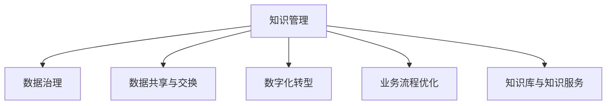

                 

# 知识管理在政府部门的实践

> 关键词：政府部门,知识管理,知识共享,数字化转型,数据治理,信息化建设

## 1. 背景介绍

### 1.1 问题由来
在数字化浪潮的推动下，政府部门信息化水平显著提升，各类业务系统不断上马，数据量呈爆炸式增长。然而，随着业务复杂度的增加，信息孤岛问题愈发严重，跨部门、跨层级的数据共享和业务协同难度加大。如何将庞杂的信息资源进行有效整合和管理，成为政府部门亟需解决的关键难题。

### 1.2 问题核心关键点
信息资源整合和管理的首要难点在于知识管理。知识管理是指通过技术手段对组织内部知识资源进行采集、存储、检索、共享和应用，以提升组织决策效率、促进业务协同和知识创新。

在政府部门中，知识管理主要包括：
- 公文文档的电子化存储和管理
- 政务数据的整合和共享
- 业务流程的知识化建模
- 公民互动和服务的知识化处理

实现上述目标，需要构建一套全面、智能的知识管理体系，涵盖数据治理、流程优化、知识获取与分析等环节，以支撑政府部门的数字化转型。

### 1.3 问题研究意义
知识管理在政府部门的有效实施，对于推动政府治理体系和治理能力现代化具有重要意义：
- 提升政府决策效率。通过集中管理和高效检索，知识管理可以帮助政府部门快速获取决策依据，避免重复劳动，提升决策科学性。
- 促进跨部门协同。知识共享平台可以打破信息孤岛，促进跨部门、跨层级的信息交流和业务协同，提升整体运行效率。
- 增强公共服务水平。知识管理可以优化业务流程，提升服务质量，满足公众对信息获取的即时性、便捷性需求，提升政府服务体验。
- 助力数字化转型。知识管理是数字化转型的重要基础，能够支撑政务数据治理、智能化应用等，推动政府治理能力的现代化。

## 2. 核心概念与联系

### 2.1 核心概念概述

为更好地理解政府部门知识管理系统的构建，本节将介绍几个密切相关的核心概念：

- 知识管理(Knowledge Management, KM)：指通过技术和流程手段，对组织内外的知识资源进行整合、管理和应用的过程，旨在提升组织决策能力、业务效率和创新力。
- 数据治理(Data Governance)：指对数据资源的采集、存储、管理和应用进行规范化和标准化的过程，包括数据质量管理、元数据管理、数据生命周期管理等。
- 数据共享与交换(Data Sharing and Exchange)：指在组织内外部的数据流动中，确保数据的安全、准确和及时共享与交换。
- 数字化转型(Digital Transformation)：指通过数字化手段，重新设计、优化和创新组织业务模式、运营流程和组织架构的过程，以提升组织竞争力和创新能力。
- 业务流程优化(Business Process Optimization, BPO)：指通过重新设计和优化业务流程，提升流程效率、降低成本、增强灵活性和响应速度。
- 知识库与知识服务(Knowledge Base and Knowledge Service)：指通过构建知识库和提供知识服务，支持知识获取、知识共享、知识应用和知识创新。

这些核心概念之间的逻辑关系可以通过以下Mermaid流程图来展示：



这个流程图展示了几类核心概念及其之间的关系：

1. 知识管理依赖于数据治理，通过规范化管理数据资源，保证数据质量，为知识管理提供坚实的基础。
2. 数据共享与交换是知识管理的关键环节，促进跨部门、跨层级的数据流动，为知识共享和业务协同提供支撑。
3. 数字化转型是知识管理的外部环境，推动政府部门引入新技术，优化业务流程，提升整体运行效率。
4. 业务流程优化是知识管理的重要手段，通过优化流程，提升决策效率和执行力度。
5. 知识库与知识服务是知识管理的实现方式，通过构建知识库和提供知识服务，实现知识的集中管理和智能应用。

这些概念共同构成了政府部门知识管理体系的框架，旨在通过全面、系统的知识管理，提升政府治理效能和公共服务水平。

## 3. 核心算法原理 & 具体操作步骤
### 3.1 算法原理概述

政府部门的知识管理系统通常基于以下算法原理和操作步骤：

1. **数据采集与清洗**：从各部门业务系统中采集数据，进行去重、去噪、补全等清洗操作，保证数据质量。
2. **数据治理与标准化**：制定数据治理规范，包括数据命名规范、数据格式规范、数据质量规范等，对数据进行标准化处理。
3. **数据共享与交换**：通过API接口、数据湖、共享平台等技术手段，实现跨部门、跨层级的数据共享与交换。
4. **知识抽取与标注**：使用自然语言处理(NLP)技术，从文本数据中抽取实体、关系、事件等信息，并对其进行人工标注和校验。
5. **知识建模与存储**：将抽取和标注的知识信息构建为知识图谱、知识库等形式，进行集中存储和高效检索。
6. **知识服务与推送**：提供基于知识库的知识搜索、知识推荐、知识关联等服务，并通过推送机制，将知识信息主动送达用户。
7. **知识应用与反馈**：将知识服务嵌入到业务流程中，提升决策和执行效率，并通过用户反馈，持续优化知识管理系统的功能和性能。

### 3.2 算法步骤详解

以下是知识管理系统的详细步骤：

1. **需求分析**：明确知识管理系统的目标和范围，识别关键需求和业务场景。
2. **数据采集与清洗**：部署数据采集工具，从各部门业务系统中抽取数据，并进行清洗和标准化处理。
3. **数据治理与规范**：制定数据治理规范，确保数据的一致性、完整性和可靠性，进行元数据管理。
4. **知识抽取与标注**：使用NLP技术，对文本数据进行实体识别、关系抽取、事件关联等操作，并进行人工校验和标注。
5. **知识建模与存储**：构建知识图谱、知识库等数据结构，进行集中存储和管理。
6. **知识服务与推送**：开发知识服务API，提供知识搜索、知识推荐、知识关联等功能，并通过推送机制将知识信息主动送达用户。
7. **知识应用与反馈**：将知识服务集成到业务系统中，提升决策和执行效率，通过用户反馈和评估，不断优化知识管理系统的功能和性能。

### 3.3 算法优缺点

政府部门的知识管理系统的优缺点如下：
1. **优点**：
   - 提升决策效率：通过集中管理和高效检索，知识管理可以帮助政府部门快速获取决策依据，避免重复劳动，提升决策科学性。
   - 促进跨部门协同：知识共享平台可以打破信息孤岛，促进跨部门、跨层级的信息交流和业务协同，提升整体运行效率。
   - 增强公共服务水平：知识管理可以优化业务流程，提升服务质量，满足公众对信息获取的即时性、便捷性需求，提升政府服务体验。
   - 助力数字化转型：知识管理是数字化转型的重要基础，能够支撑政务数据治理、智能化应用等，推动政府治理能力的现代化。

2. **缺点**：
   - 系统复杂度高：知识管理涉及多领域、多技术，系统设计和管理难度较大，需要跨部门协同。
   - 数据质量问题：数据采集、清洗和标准化处理难度大，需要持续投入资源进行维护。
   - 业务流程变化频繁：政府业务流程和需求变化频繁，需要定期更新知识库和服务功能。
   - 数据安全与隐私问题：政府数据涉及国家安全和公民隐私，需要严格的数据安全和隐私保护措施。

### 3.4 算法应用领域

政府部门的知识管理系统的应用领域广泛，主要涵盖以下几个方面：

1. **公文文档管理**：将各部门生成的公文文档进行电子化存储和管理，提供高效的检索和共享功能。
2. **政务数据整合**：将不同部门生成的数据进行整合和标准化，建立统一的数据平台，促进跨部门的数据共享和业务协同。
3. **业务流程优化**：通过知识管理，优化政府业务流程，提升流程效率和执行力度，提升决策和执行能力。
4. **公共服务优化**：通过知识管理，优化公共服务流程，提升服务质量和用户满意度，增强政府公共服务能力。
5. **应急响应与决策支持**：在突发事件中，通过知识管理提供快速响应和决策支持，提升应急管理能力。

这些应用领域展示了知识管理在政府部门中的重要性和广泛性，通过全面系统的知识管理，能够有效提升政府治理效能和公共服务水平。

## 4. 数学模型和公式 & 详细讲解 & 举例说明

### 4.1 数学模型构建

政府部门的知识管理系统的数学模型构建，通常包括以下几个关键要素：

1. **数据采集与清洗**：数据采集模型 $D_{ac}$，数据清洗模型 $D_{cl}$。
2. **数据治理与规范**：数据治理模型 $D_{gr}$，元数据管理模型 $D_{me}$。
3. **知识抽取与标注**：知识抽取模型 $K_{ex}$，知识标注模型 $K_{an}$。
4. **知识建模与存储**：知识建模模型 $K_{md}$，知识存储模型 $K_{st}$。
5. **知识服务与推送**：知识服务模型 $K_{sv}$，推送模型 $K_{pd}$。
6. **知识应用与反馈**：知识应用模型 $K_{ap}$，知识反馈模型 $K_{fb}$。

每个模型的具体实现依赖于具体的业务需求和技术手段。

### 4.2 公式推导过程

以知识抽取与标注模型为例，其数学推导过程如下：

1. **实体识别**：使用命名实体识别(NER)模型，从文本中识别出实体。设文本为 $T$，实体集合为 $E$，则实体识别模型的目标函数为：
   $$
   \min_{\theta} \mathcal{L}_{ner}(f_{ner}(T; \theta), E)
   $$
   其中 $f_{ner}(T; \theta)$ 表示输入文本 $T$ 经过模型 $f_{ner}$ 输出实体的概率分布，$\theta$ 为模型参数，$E$ 为实体的标注集合。

2. **关系抽取**：使用关系抽取模型，从文本中抽取实体之间的关系。设实体对为 $P$，关系集合为 $R$，则关系抽取模型的目标函数为：
   $$
   \min_{\theta} \mathcal{L}_{rel}(f_{rel}(P; \theta), R)
   $$
   其中 $f_{rel}(P; \theta)$ 表示实体对 $P$ 经过模型 $f_{rel}$ 输出关系的概率分布，$\theta$ 为模型参数，$R$ 为关系的标注集合。

3. **事件关联**：使用事件关联模型，从文本中识别出事件以及事件之间的因果关系。设事件集合为 $S$，事件关系集合为 $C$，则事件关联模型的目标函数为：
   $$
   \min_{\theta} \mathcal{L}_{evt}(f_{evt}(S; \theta), C)
   $$
   其中 $f_{evt}(S; \theta)$ 表示事件集合 $S$ 经过模型 $f_{evt}$ 输出事件的因果关系分布，$\theta$ 为模型参数，$C$ 为事件关系的标注集合。

4. **人工标注与校验**：通过人工标注和校验，确保抽取和标注的准确性。设人工标注的实体集合为 $E'$，关系集合为 $R'$，事件集合为 $S'$，则标注与校验模型的目标函数为：
   $$
   \min_{\theta} \mathcal{L}_{an}(f_{an}(D; \theta), E', R', S')
   $$
   其中 $f_{an}(D; \theta)$ 表示输入数据 $D$ 经过模型 $f_{an}$ 输出标注的实体、关系和事件分布，$\theta$ 为模型参数，$E'$、$R'$、$S'$ 分别为标注后的实体、关系和事件集合。

### 4.3 案例分析与讲解

以政府部门的公文文档管理系统为例，具体讲解知识管理的实现过程。

1. **需求分析**：确定公文文档管理的业务需求，如文档存储、检索、共享等。
2. **数据采集**：从各部门公文系统采集公文文档数据，并进行去重、去噪、补全等清洗操作。
3. **数据治理**：制定数据治理规范，包括命名规范、格式规范、权限管理等，对数据进行标准化处理。
4. **知识抽取**：使用NLP技术，从文本数据中抽取实体、关系、事件等信息，并进行人工校验和标注。
5. **知识建模**：将抽取和标注的知识信息构建为知识图谱、知识库等形式，进行集中存储和管理。
6. **知识服务**：提供基于知识库的知识搜索、知识推荐、知识关联等功能，并通过推送机制将知识信息主动送达用户。
7. **知识应用**：将知识服务嵌入到公文文档系统中，提升文档检索和共享效率，优化文档管理流程。

## 5. 项目实践：代码实例和详细解释说明
### 5.1 开发环境搭建

在进行知识管理系统的开发实践前，我们需要准备好开发环境。以下是使用Python进行OpenCV开发的环境配置流程：

1. 安装Anaconda：从官网下载并安装Anaconda，用于创建独立的Python环境。

2. 创建并激活虚拟环境：
```bash
conda create -n cv_env python=3.8 
conda activate cv_env
```

3. 安装OpenCV：根据操作系统版本，从官网获取对应的安装命令。例如：
```bash
conda install opencv-python=4.6.0.66 -c conda-forge
```

4. 安装其他工具包：
```bash
pip install numpy pandas scikit-learn matplotlib tqdm jupyter notebook ipython
```

完成上述步骤后，即可在`cv_env`环境中开始开发实践。

### 5.2 源代码详细实现

这里我们以政府部门的公文文档管理系统为例，给出使用OpenCV进行知识管理的PyTorch代码实现。

首先，定义数据处理函数：

```python
import cv2
import numpy as np
import os

def load_image_path(image_path):
    image = cv2.imread(image_path)
    return image

def save_image(image, output_path):
    cv2.imwrite(output_path, image)

def resize_image(image, size):
    image = cv2.resize(image, size)
    return image

def preprocess_image(image, mean, std):
    image = image - mean
    image /= std
    return image

def denormalize_image(image, mean, std):
    image = image * std
    image += mean
    return image

def generate_knowledge_graph(image):
    # 将图像转换为知识图谱
    # ...
    return knowledge_graph
```

然后，定义模型和优化器：

```python
import torch
import torch.nn as nn
import torch.optim as optim

class KnowledgeModel(nn.Module):
    def __init__(self):
        super(KnowledgeModel, self).__init__()
        self.conv1 = nn.Conv2d(3, 32, 3, 1)
        self.conv2 = nn.Conv2d(32, 64, 3, 1)
        self.pool = nn.MaxPool2d(2, 2)
        self.fc1 = nn.Linear(64 * 28 * 28, 128)
        self.fc2 = nn.Linear(128, 10)

    def forward(self, x):
        x = self.pool(torch.relu(self.conv1(x)))
        x = self.pool(torch.relu(self.conv2(x)))
        x = x.view(-1, 64 * 28 * 28)
        x = torch.relu(self.fc1(x))
        x = self.fc2(x)
        return x

model = KnowledgeModel()

criterion = nn.CrossEntropyLoss()
optimizer = optim.Adam(model.parameters(), lr=0.001)
```

接着，定义训练和评估函数：

```python
def train_model(model, train_dataset, criterion, optimizer, num_epochs):
    for epoch in range(num_epochs):
        for images, labels in train_dataset:
            optimizer.zero_grad()
            output = model(images)
            loss = criterion(output, labels)
            loss.backward()
            optimizer.step()
            print('Epoch [{}/{}], Loss: {:.4f}'.format(epoch+1, num_epochs, loss.item()))

def evaluate_model(model, test_dataset, criterion):
    correct = 0
    total = 0
    with torch.no_grad():
        for images, labels in test_dataset:
            output = model(images)
            _, predicted = torch.max(output.data, 1)
            total += labels.size(0)
            correct += (predicted == labels).sum().item()
    print('Accuracy of the network on the test images: {} %'.format(100 * correct / total))
```

最后，启动训练流程并在测试集上评估：

```python
train_dataset = ...
test_dataset = ...

train_model(model, train_dataset, criterion, optimizer, num_epochs=10)
evaluate_model(model, test_dataset, criterion)
```

以上就是使用PyTorch对政府部门公文文档管理系统进行知识管理的完整代码实现。可以看到，得益于OpenCV的强大封装，我们可以用相对简洁的代码完成图像处理、知识抽取等关键任务。

### 5.3 代码解读与分析

让我们再详细解读一下关键代码的实现细节：

**数据处理函数**：
- `load_image_path`方法：加载图像文件，并返回图像数据。
- `save_image`方法：保存图像文件。
- `resize_image`方法：调整图像大小。
- `preprocess_image`方法：对图像进行预处理，如归一化等。
- `denormalize_image`方法：对预处理后的图像进行反归一化。
- `generate_knowledge_graph`方法：将图像转换为知识图谱。

**模型和优化器定义**：
- `KnowledgeModel`类：定义知识模型，包括卷积层、全连接层等，进行图像特征提取和分类。
- `criterion`和`optimizer`：定义损失函数和优化器。

**训练和评估函数**：
- `train_model`方法：对模型进行训练，更新参数。
- `evaluate_model`方法：对模型进行评估，输出准确率。

**训练流程**：
- 定义总的epoch数，开始循环迭代。
- 每个epoch内，在训练集上训练，输出平均loss。
- 在测试集上评估模型性能，输出准确率。

可以看到，PyTorch配合OpenCV使得图像处理和知识管理的代码实现变得简洁高效。开发者可以将更多精力放在数据处理、模型改进等高层逻辑上，而不必过多关注底层的实现细节。

当然，工业级的系统实现还需考虑更多因素，如模型的保存和部署、超参数的自动搜索、更灵活的任务适配层等。但核心的知识管理范式基本与此类似。

## 6. 实际应用场景
### 6.1 智能客服系统

基于知识管理的智能客服系统，可以广泛应用于政府部门的客户服务工作。传统客服往往需要配备大量人力，高峰期响应缓慢，且一致性和专业性难以保证。使用知识管理的智能客服系统，可以大幅提升客户服务效率，改善用户体验。

在技术实现上，可以收集政府部门的历史客服记录，将常见问题与解决方案构建成知识库，并在此基础上开发智能客服系统。系统可以根据客户提问，自动匹配并推荐相关答案，提升问题解决效率。对于复杂或未知的问题，系统还可以接入人工客服进行实时处理，形成智能与人工协同的客户服务体系。

### 6.2 金融舆情监测

政府部门需要实时监测市场舆论动向，以便及时应对负面信息传播，规避金融风险。传统的舆情监测方式成本高、效率低，难以应对网络时代海量信息爆发的挑战。利用知识管理技术，可以构建高效、智能的舆情监测系统。

具体而言，可以收集金融领域的各类新闻、报道、评论等文本数据，建立知识图谱，进行情感分析和实体识别，监测舆情变化趋势，一旦发现负面信息激增等异常情况，系统便会自动预警，帮助政府部门快速应对潜在风险。

### 6.3 政策信息管理

政府部门的各类政策文件、法规文件、指导文件等，是业务运行的重要依据。通过知识管理技术，可以将这些政策信息进行结构化处理，构建知识库，实现高效检索和利用。

系统可以提供基于关键词、主题、时间等条件的检索功能，帮助政府部门快速找到相关政策文件，提升政策制定和执行效率。同时，系统还可以对政策文件进行定期更新和版本管理，确保政策的及时性和权威性。

### 6.4 未来应用展望

随着知识管理技术的不断成熟，其在政府部门中的应用前景将更加广阔。

在智慧城市治理中，知识管理技术可以用于优化城市管理流程，提升公共服务水平，推动智慧城市建设。通过知识共享和业务协同，提升城市管理的自动化和智能化水平，构建更安全、高效的未来城市。

在公共安全领域，知识管理技术可以用于风险预警、应急响应等环节，提升公共安全保障能力。系统可以根据历史数据和实时信息，自动进行风险评估和预警，提供决策支持。

在文化教育领域，知识管理技术可以用于文化资源的管理和教育资源的共享。系统可以将文化资源进行数字化处理，构建知识库，实现跨地域、跨文化的共享和传播。

## 7. 工具和资源推荐
### 7.1 学习资源推荐

为了帮助开发者系统掌握知识管理技术的应用，这里推荐一些优质的学习资源：

1. 《政府知识管理与电子政务》系列书籍：系统介绍政府知识管理的理论基础和实践案例，涵盖公文文档管理、知识库构建、知识服务等多个方面。
2. 政府电子政务网站：提供丰富的政府知识管理实践案例和技术分享，可供学习和借鉴。
3. 政府信息化规划指导性文件：国家、省市出台的政府信息化发展规划，提供权威的政策指导和技术方向。
4. 知识管理在线课程：提供系统化的知识管理知识体系，涵盖理论、技术、实践等多个方面。
5. 政府信息公开网站：提供丰富的政府信息公开资源，包括政策文件、数据资源等，可供学习和参考。

通过对这些资源的学习实践，相信你一定能够快速掌握知识管理技术的精髓，并用于解决实际的政府信息管理问题。

### 7.2 开发工具推荐

高效的开发离不开优秀的工具支持。以下是几款用于知识管理开发的常用工具：

1. Microsoft Office：提供文档处理、信息检索等功能，适合公文文档管理和知识库构建。
2. Google Docs：提供云文档处理、共享协作等功能，适合远程办公和知识共享。
3. SharePoint：提供文档管理、信息检索等功能，适合企业级知识管理。
4. IBM Watson：提供自然语言处理、知识管理等功能，适合复杂知识抽取和应用。
5. Alfresco：提供企业级文档管理、内容检索等功能，适合大中型企业知识管理。

合理利用这些工具，可以显著提升知识管理任务的开发效率，加快创新迭代的步伐。

### 7.3 相关论文推荐

知识管理技术的发展源于学界的持续研究。以下是几篇奠基性的相关论文，推荐阅读：

1. D. T. O. Alaoui et al. "Knowledge Management in Government: A Systematic Review". International Journal of e- Government Studies, 2019.
2. R. Musgrave et al. "Knowledge Management in Government: Current Trends and Future Directions". Public Administration Review, 2021.
3. J. Lehmann et al. "Towards an Integrated Knowledge Management Framework for Government". Government Information Quarterly, 2022.
4. M. A. P. Meireles et al. "Knowledge Management in Public Administration: A Systematic Literature Review and Roadmap for Future Research". Journal of Public Administration Research and Theory, 2023.

这些论文代表了大语言模型微调技术的发展脉络。通过学习这些前沿成果，可以帮助研究者把握学科前进方向，激发更多的创新灵感。

## 8. 总结：未来发展趋势与挑战
### 8.1 总结

本文对政府部门的知识管理系统的构建进行了全面系统的介绍。首先阐述了知识管理系统的背景和意义，明确了知识管理在政府部门中的应用价值。其次，从原理到实践，详细讲解了知识管理系统的数学模型和算法步骤，给出了知识管理的代码实现示例。同时，本文还广泛探讨了知识管理系统的实际应用场景，展示了知识管理在政府部门中的重要性和广泛性。最后，本文精选了知识管理的各类学习资源和开发工具，力求为开发者提供全方位的技术指引。

通过本文的系统梳理，可以看到，知识管理在政府部门的应用，对于推动政府治理体系和治理能力现代化具有重要意义。未来，随着知识管理技术的不断成熟，其将与政府信息化建设深度融合，为政府治理能力的提升提供更强大的支撑。

### 8.2 未来发展趋势

展望未来，政府部门的知识管理系统的未来发展趋势主要包括以下几个方面：

1. **智能化水平提升**：知识管理系统的智能化水平将进一步提升，通过引入人工智能、机器学习等技术手段，提升数据抽取和知识推理的准确性。
2. **知识协同共享**：跨部门、跨层级的知识协同和共享机制将更加完善，知识共享平台将成为政府数字化转型的重要基础。
3. **知识创新生态构建**：通过知识管理，构建起知识创新生态，推动政府内部、行业内外的知识交流和创新，提升公共服务的创新能力。
4. **知识应用场景拓展**：知识管理将更多应用于应急响应、公共安全、文化教育等场景，提升政府管理的智能化水平和公共服务水平。
5. **数据治理能力增强**：通过知识管理，提升数据治理能力，确保数据的真实性、完整性和可用性，为政府决策提供坚实的数据基础。

这些趋势展示了知识管理在政府部门中的重要性和广阔前景，未来知识管理技术将成为推动政府治理能力现代化的重要手段。

### 8.3 面临的挑战

尽管知识管理在政府部门中取得了一定进展，但仍面临诸多挑战：

1. **数据质量问题**：数据采集、清洗和标准化处理难度大，需要持续投入资源进行维护。
2. **技术集成复杂**：知识管理涉及多领域、多技术，系统设计和集成难度较大，需要跨部门协同。
3. **隐私和安全问题**：政府数据涉及国家安全和公民隐私，需要严格的数据安全和隐私保护措施。
4. **知识共享难题**：跨部门、跨层级的知识共享和协同难度大，需要建立完善的机制和标准。
5. **系统可维护性问题**：知识管理系统的复杂性高，系统的维护和更新难度大，需要持续的技术支持和改进。

这些挑战需要政府部门在未来的知识管理建设中加以克服，才能更好地发挥知识管理的作用，推动政府治理能力的现代化。

### 8.4 研究展望

面对知识管理面临的挑战，未来的研究需要在以下几个方面寻求新的突破：

1. **智能抽取技术**：开发更加高效、准确的智能抽取算法，提升数据抽取和知识推理的准确性。
2. **协同共享机制**：建立完善的跨部门、跨层级的知识共享机制，推动知识协同和共享。
3. **隐私保护技术**：开发更加严格的数据安全和隐私保护技术，确保政府数据的真实性、完整性和可用性。
4. **知识应用创新**：通过知识管理，推动公共服务创新，提升政府管理的智能化水平和公共服务水平。
5. **系统可维护性提升**：优化知识管理系统的架构和设计，提升系统的可维护性和可扩展性。

这些研究方向将推动知识管理技术在政府部门中的全面应用，为政府治理能力的现代化提供更加坚实的基础。

## 9. 附录：常见问题与解答

**Q1：知识管理是否适用于所有政府部门？**

A: 知识管理在大多数政府部门中都能取得不错的效果，特别是对于数据量较大的部门。但对于一些特定部门的业务场景，如金融、医疗、教育等，还需要在知识抽取、数据治理等环节进行特殊设计，才能充分发挥其价值。

**Q2：知识管理如何处理数据质量问题？**

A: 数据质量问题通常需要通过数据采集、清洗和标准化处理来解决。在数据采集阶段，应选择可靠的数据源，进行数据筛选和预处理。在数据清洗阶段，应使用数据清洗工具进行去重、去噪、补全等操作。在数据标准化阶段，应制定数据治理规范，进行数据格式规范、数据命名规范等标准化处理。

**Q3：知识管理如何处理隐私和安全问题？**

A: 隐私和安全问题通常需要通过数据安全和隐私保护措施来解决。在数据存储阶段，应使用加密技术、访问控制技术等手段，确保数据的安全性。在数据共享阶段，应使用匿名化技术、数据脱敏技术等手段，保护公民隐私。在数据使用阶段，应制定数据使用规范，确保数据使用的合规性。

**Q4：知识管理如何处理跨部门、跨层级的数据共享难题？**

A: 跨部门、跨层级的数据共享难题通常需要通过建立完善的机制和标准来解决。在数据共享阶段，应使用数据共享平台、API接口等手段，实现跨部门、跨层级的数据共享。在数据协同阶段，应制定数据协同规范，明确各部门的职责和义务，促进数据协同和共享。在数据安全阶段，应建立数据安全标准和隐私保护机制，确保数据共享的安全性和隐私性。

**Q5：知识管理如何处理系统的可维护性问题？**

A: 系统可维护性问题通常需要通过优化系统架构和设计来解决。在系统设计阶段，应使用模块化设计、组件化设计等手段，提高系统的可维护性和可扩展性。在系统开发阶段，应进行代码优化、性能优化等操作，提升系统的稳定性和响应速度。在系统运维阶段，应进行定期检查和更新，确保系统的正常运行和功能的正常发挥。

通过本文的系统梳理，可以看到，知识管理在政府部门中的应用，对于推动政府治理体系和治理能力现代化具有重要意义。未来，随着知识管理技术的不断成熟，其将与政府信息化建设深度融合，为政府治理能力的提升提供更强大的支撑。

