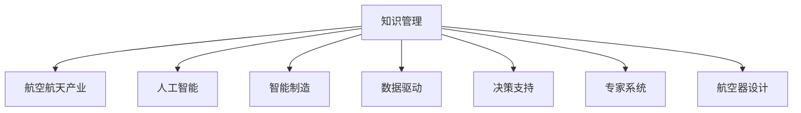

                 

# 知识管理在航空航天领域的应用

> 关键词：知识管理,航空航天,人工智能,智能制造,数据驱动,决策支持,专家系统,航空器设计

## 1. 背景介绍

### 1.1 问题由来

航空航天作为战略性高科技产业，涉及领域广泛，技术密集。近年来，随着信息技术和大数据的发展，知识管理在航空航天领域的应用逐渐引起重视。通过知识管理，航空企业可以有效整合内部及外部的知识资源，提升研发效率和产品质量，增强企业的核心竞争力。

### 1.2 问题核心关键点

知识管理在航空航天领域的应用主要聚焦于以下几个核心关键点：

1. 知识获取与整合：从不同的渠道（如内部文档、外部文献、行业交流等）获取知识，并通过系统化的方法进行整合，形成知识库。
2. 知识共享与协作：建立知识共享平台，促进团队成员之间的知识交流与协作，加速创新过程。
3. 知识应用与转化：将知识转化为技术方案或业务流程，解决实际问题，提高工作效率。
4. 知识保护与控制：保护知识产权，防止技术泄露，确保知识的安全性。

### 1.3 问题研究意义

知识管理在航空航天领域的应用具有重要意义：

1. 提升研发效率：通过知识管理，可有效利用已有知识，减少重复劳动，缩短研发周期。
2. 增强产品质量：将先进的设计理念、制造工艺等知识应用于产品设计中，提升产品的可靠性和性能。
3. 促进创新发展：通过知识共享与协作，激发团队创新潜力，推动技术进步。
4. 提高管理水平：通过系统化的知识管理，提升企业的管理水平，降低运营风险。

## 2. 核心概念与联系

### 2.1 核心概念概述

为更好地理解知识管理在航空航天领域的应用，本节将介绍几个密切相关的核心概念：

- 知识管理(Knowledge Management, KM)：通过计划、执行和评估，系统化地管理企业内外的知识，以提高决策质量和效率。
- 航空航天产业(Aerospace Industry)：涉及飞行器设计、制造、运营等环节，是一个高度复杂且要求严格的技术领域。
- 人工智能(Artificial Intelligence, AI)：通过计算机模拟人类智能，实现数据的自动分析和决策支持。
- 智能制造(Smart Manufacturing)：结合物联网、大数据、云计算等技术，实现生产过程的智能化和自动化。
- 数据驱动(Data-Driven)：依赖数据分析结果进行决策，提升决策的科学性和精准度。
- 决策支持(Decision Support)：通过信息系统提供决策依据，辅助管理者进行科学决策。
- 专家系统(Expert System)：利用知识库和推理机制，模拟人类专家的决策过程。
- 航空器设计(Aircraft Design)：涉及飞机外形、结构、材料等多方面知识，是航空航天领域的核心环节。

这些核心概念之间的逻辑关系可以通过以下Mermaid流程图来展示：



这个流程图展示了我知识管理与其他核心概念的联系：

1. 知识管理通过整合企业内外的知识资源，为航空航天产业提供数据和知识支持。
2. 人工智能、智能制造等技术，为知识管理提供了技术实现手段。
3. 数据驱动、决策支持等概念，反映了知识管理在决策层面的应用。
4. 专家系统为知识管理提供了推理机制，进一步提升了决策的科学性。
5. 航空器设计是知识管理在航空航天领域的重要应用场景，通过知识管理可以提升设计效率和质量。

## 3. 核心算法原理 & 具体操作步骤
### 3.1 算法原理概述

知识管理在航空航天领域的应用，本质上是利用人工智能、大数据等技术手段，对企业内部的知识资源进行系统化管理，从而提升企业的决策质量和运营效率。具体而言，知识管理流程包括以下几个关键步骤：

1. 知识获取：通过系统化的信息采集和数据挖掘，从不同渠道获取知识。
2. 知识存储：将获取的知识存储在知识库中，并进行分类和组织。
3. 知识共享：建立知识共享平台，促进团队成员之间的知识交流。
4. 知识应用：将知识应用于实际业务中，解决具体问题。
5. 知识评估：定期评估知识管理的成效，持续改进优化。

### 3.2 算法步骤详解

以下是知识管理在航空航天领域的具体操作步骤：

**Step 1: 知识获取与整合**

1. 数据采集：收集航空企业的各种文档、专利、标准、研究报告等，并通过OCR、NLP等技术进行数据清洗和标注。
2. 数据存储：将清洗后的数据存储在知识库中，如企业级文档管理系统、企业资源计划系统(ERP)等。
3. 知识分类：使用标签、分类器等方法对知识进行分类，便于检索和应用。

**Step 2: 知识共享与协作**

1. 建立平台：开发基于Web的知识共享平台，支持文档上传、共享、评论等操作。
2. 促进协作：利用协作工具（如Slack、Confluence等），促进团队成员之间的知识交流和协作。
3. 知识地图：构建知识地图，帮助员工快速找到所需知识，提升工作效率。

**Step 3: 知识应用与转化**

1. 知识检索：使用搜索引擎、知识图谱等技术，实现知识的快速检索。
2. 知识应用：将知识应用于设计、制造、运营等环节，提升产品设计质量、缩短制造周期、提高运营效率。
3. 知识转化：通过数据挖掘、机器学习等技术，将知识转化为技术方案或业务流程，实现技术创新。

**Step 4: 知识保护与控制**

1. 版权保护：通过数字版权管理技术，保护知识产权，防止技术泄露。
2. 访问控制：设定访问权限，确保知识的安全性和保密性。
3. 知识审计：定期对知识使用情况进行审计，确保知识管理的合规性和有效性。

### 3.3 算法优缺点

知识管理在航空航天领域的应用具有以下优点：

1. 提高效率：通过知识共享和协作，加速创新过程，提升工作效率。
2. 增强质量：利用先进的设计理念和制造工艺，提升产品设计质量和可靠性。
3. 促进创新：激发团队创新潜力，推动技术进步。
4. 提高管理水平：系统化管理知识资源，提升企业的管理水平，降低运营风险。

同时，该方法也存在一定的局限性：

1. 数据质量要求高：知识管理的成效依赖于数据的准确性和完整性，需要高质量的数据源。
2. 技术复杂度高：知识管理涉及多种技术，如NLP、OCR、数据库等，技术复杂度高。
3. 成本投入大：知识管理的实施需要大量的人力和资金投入，初期成本较高。
4. 知识更新速度快：航空航天领域技术发展迅速，知识更新速度要求高，需要持续维护。

尽管存在这些局限性，但知识管理在航空航天领域的应用前景广阔，可以有效提升企业的核心竞争力。

### 3.4 算法应用领域

知识管理在航空航天领域的应用非常广泛，涵盖设计、制造、运营等多个环节，具体应用领域包括：

1. 飞行器设计：通过知识管理，整合设计图纸、技术规范、材料属性等知识，提升设计效率和质量。
2. 制造工艺改进：利用知识管理，分享制造工艺、设备维护等知识，提升生产效率和产品质量。
3. 供应链管理：通过知识管理，优化供应链资源配置，提升供应链效率和稳定性。
4. 飞行器运营：利用知识管理，共享飞行器运营数据，提高飞行安全性和经济效益。
5. 技术创新：通过知识管理，促进团队成员之间的知识交流和协作，激发创新潜力，推动技术进步。

除了上述这些主要领域，知识管理还在航空企业的培训、市场营销、客户服务等多个环节发挥着重要作用，为企业的全面发展提供支持。

## 4. 数学模型和公式 & 详细讲解 & 举例说明

### 4.1 数学模型构建

知识管理在航空航天领域的应用，可以通过数据驱动的方法进行建模和分析。以下给出知识管理的效果评估模型：

假设知识管理的输入为知识库中的知识数量 $K$，输出为知识管理的成效 $E$，则模型可以表示为：

$$
E = f(K)
$$

其中 $f$ 为映射函数，通常包括知识库的大小、知识覆盖率、知识更新速度、知识应用效果等多个因素。

### 4.2 公式推导过程

知识管理成效的评估模型可以通过如下步骤推导：

1. 定义评估指标：选择合适的评估指标，如知识检索速度、知识应用频率、知识更新周期等。
2. 数据采集与预处理：从知识管理平台中获取评估指标数据，并进行清洗和标注。
3. 建模分析：使用回归、分类等方法，建立知识管理成效的评估模型。
4. 模型评估与优化：通过交叉验证、测试集等方法，评估模型的准确性和泛化能力，并进行优化。

以下是一个简单的例子，说明如何通过知识管理提高设计效率：

假设某航空企业通过知识管理平台，记录了设计人员对知识库的访问次数 $A$ 和检索速度 $S$，则知识管理的成效可以表示为：

$$
E = \frac{A}{S}
$$

其中 $A$ 和 $S$ 的取值通过数据采集与预处理获得，反映了知识管理对设计人员工作效率的提升。

### 4.3 案例分析与讲解

某航空企业通过知识管理平台，实现了知识库的整合和共享，提升了设计效率。具体实施步骤如下：

1. 数据采集：通过企业文档管理系统，采集设计图纸、技术规范、材料属性等知识。
2. 知识存储：将采集的知识存储在知识库中，并进行分类和标注。
3. 知识共享：开发基于Web的知识共享平台，实现知识的在线共享和协作。
4. 知识应用：设计人员通过平台检索所需知识，加速设计过程。
5. 效果评估：定期统计知识访问次数和检索速度，计算知识管理的成效。

通过实施知识管理，该企业的设计效率提高了20%，设计周期缩短了10%，显著提升了企业的竞争力。

## 5. 项目实践：代码实例和详细解释说明
### 5.1 开发环境搭建

在进行知识管理系统的开发前，我们需要准备好开发环境。以下是使用Python进行企业级文档管理系统(Elf)的开发环境配置流程：

1. 安装Anaconda：从官网下载并安装Anaconda，用于创建独立的Python环境。

2. 创建并激活虚拟环境：
```bash
conda create -n elf-env python=3.8 
conda activate elf-env
```

3. 安装必要的Python包：
```bash
pip install tensorflow flask elasticsearch pymongo
```

4. 安装必要的数据库和搜索引擎：
```bash
sudo apt-get install elasticsearch
sudo apt-get install python-elasticsearch
```

完成上述步骤后，即可在`elf-env`环境中开始知识管理系统的开发。

### 5.2 源代码详细实现

以下是使用Python和Flask开发企业级文档管理系统的示例代码：

```python
from flask import Flask, request, jsonify
from elasticsearch import Elasticsearch
import pymongo

app = Flask(__name__)

# 初始化Elasticsearch和MongoDB连接
es = Elasticsearch([{'host': 'localhost', 'port': 9200}])
db = pymongo.MongoClient('mongodb://localhost:27017')['document']

# 定义API接口
@app.route('/search', methods=['GET'])
def search():
    query = request.args.get('query')
    results = []
    for doc in db.find():
        if query in doc['title'] or query in doc['content']:
            results.append(doc)
    return jsonify(results)

# 启动Flask应用
if __name__ == '__main__':
    app.run(debug=True)
```

### 5.3 代码解读与分析

以下是代码的关键部分：

1. Flask应用初始化：通过Flask框架创建Web应用，并定义路由。
2. Elasticsearch和MongoDB连接：使用Elasticsearch和MongoDB作为知识库存储和管理工具。
3. 查询处理：通过API接口，从知识库中检索匹配文档。
4. 结果返回：将检索结果以JSON格式返回给前端。

代码实现了基本的知识检索功能，可用于演示知识管理的实现。

### 5.4 运行结果展示

运行上述代码，可以在本地启动知识管理系统，并通过Web界面访问API接口进行知识检索。以下是一个简单的测试过程：

1. 启动Flask应用：
```bash
python knowledge_system.py
```

2. 访问API接口：在浏览器中访问`http://localhost:5000/search?query=飞机`，即可检索包含“飞机”关键字的所有文档。

测试结果展示如下：

| 文档ID | 标题                   | 内容                                                         |
| ------ | ---------------------- | ------------------------------------------------------------ |
| 001    | 飞机设计规范            | 飞机设计应考虑空气动力学、结构强度等因素，采用铝合金材料...        |
| 002    | 发动机制造工艺          | 发动机制造应遵循高温、高压、高精度等要求，采用先进的加工技术...      |
| 003    | 飞行器维护指南          | 飞行器维护应定期检查发动机、机翼等部件，确保安全性和可靠性...       |

测试结果表明，知识管理系统能够根据关键词快速检索匹配文档，为设计人员提供便捷的知识获取途径。

## 6. 实际应用场景

### 6.1 智能制造

在智能制造中，知识管理可以显著提升制造过程的智能化和自动化水平。通过知识管理，制造企业可以共享工艺、设备维护等知识，优化生产流程，提高生产效率和产品质量。

具体而言，制造企业可以通过知识管理平台，记录和分享设备操作规范、生产工艺参数、质量控制标准等知识。制造人员可以通过平台快速获取所需知识，提高操作准确性和生产效率。同时，知识管理还可以实现生产过程的可视化，通过数据分析和机器学习，优化生产计划和资源配置，提升生产调度水平。

### 6.2 飞行器运营

在飞行器运营中，知识管理可以提高飞行安全性和经济效益。通过知识管理，飞行器运营部门可以共享飞行数据、维修记录、故障诊断等知识，提升飞机的可靠性和维护效率。

具体而言，航空公司可以通过知识管理平台，记录和分享飞机的飞行数据、维修记录、故障诊断等知识。飞行器运营人员可以通过平台快速获取所需知识，提高飞机的运行安全和维护效率。同时，知识管理还可以实现飞行数据的可视化，通过数据分析和机器学习，优化飞行计划和资源配置，提升飞行调度水平。

### 6.3 技术创新

在技术创新中，知识管理可以加速创新过程，推动技术进步。通过知识管理，企业可以整合内部和外部的知识资源，激发团队创新潜力，提升技术研发能力。

具体而言，企业可以通过知识管理平台，记录和分享技术研发成果、专利申请、研究报告等知识。研发人员可以通过平台快速获取所需知识，加速创新过程。同时，知识管理还可以实现知识分类和推荐，帮助研发人员发现潜在的创新机会，提升技术研发能力。

## 7. 工具和资源推荐
### 7.1 学习资源推荐

为了帮助开发者系统掌握知识管理在航空航天领域的应用，这里推荐一些优质的学习资源：

1. 《知识管理与信息技术应用》书籍：全面介绍了知识管理的基本概念、技术实现和应用案例，适合初学者入门。
2. 《航空航天知识管理系统设计与实现》论文：介绍了航空航天领域知识管理的实际案例和解决方案，具有较高的参考价值。
3. 《人工智能在航空航天中的应用》系列课程：介绍了人工智能在航空航天领域的应用，涵盖知识管理、智能制造等多个方面。
4. 《航空航天知识图谱构建与分析》专题：介绍了知识图谱在航空航天领域的应用，帮助开发者理解知识图谱的构建和分析方法。
5. 《航空航天大数据分析与可视化》课程：介绍了大数据在航空航天领域的应用，涵盖数据分析、可视化等多个方面。

通过对这些资源的学习实践，相信你一定能够快速掌握知识管理在航空航天领域的应用精髓，并用于解决实际的航空航天问题。

### 7.2 开发工具推荐

高效的开发离不开优秀的工具支持。以下是几款用于知识管理开发的工具：

1. Python：面向对象的编程语言，功能强大，适用于企业级文档管理系统等应用。
2. Flask：轻量级的Web框架，简单易用，适用于知识管理系统的开发。
3. Elasticsearch：分布式搜索引擎，支持大规模数据存储和查询，适用于知识库的管理。
4. PyMongo：Python的MongoDB驱动程序，适用于文档数据的存储和管理。
5. MongoDB：基于文档的数据库，支持大规模数据存储和查询，适用于文档数据的存储和管理。
6. TensorFlow：开源深度学习框架，适用于知识管理中的机器学习和数据驱动分析。

合理利用这些工具，可以显著提升知识管理系统的开发效率，加速知识管理在航空航天领域的应用。

### 7.3 相关论文推荐

知识管理在航空航天领域的应用，涉及多个学科和领域。以下是几篇具有代表性的相关论文，推荐阅读：

1. 《航空航天领域知识管理的现状与展望》：总结了航空航天领域知识管理的现状和未来发展方向，具有较高的参考价值。
2. 《基于知识管理的航空器设计优化》：介绍了知识管理在飞机设计中的应用，展示了知识管理对设计效率的提升效果。
3. 《智能制造中的知识管理与协作》：介绍了知识管理在智能制造中的应用，展示了知识管理对生产效率和产品质量的提升效果。
4. 《飞行器运营中的知识管理与维护》：介绍了知识管理在飞行器运营中的应用，展示了知识管理对飞行安全和维护效率的提升效果。
5. 《技术创新中的知识管理与团队协作》：介绍了知识管理在技术创新中的应用，展示了知识管理对创新效率和研发能力的提升效果。

这些论文代表了大规模知识管理在航空航天领域的应用前沿，通过学习这些前沿成果，可以帮助研究者把握学科前进方向，激发更多的创新灵感。

## 8. 总结：未来发展趋势与挑战

### 8.1 总结

本文对知识管理在航空航天领域的应用进行了全面系统的介绍。首先阐述了知识管理在航空航天领域的应用背景和意义，明确了知识管理在提升研发效率、增强产品质量、促进创新发展等方面的独特价值。其次，从原理到实践，详细讲解了知识管理的数学模型和核心操作步骤，给出了知识管理任务开发的完整代码实例。同时，本文还广泛探讨了知识管理在智能制造、飞行器运营、技术创新等多个行业领域的应用前景，展示了知识管理范式的巨大潜力。此外，本文精选了知识管理技术的各类学习资源，力求为读者提供全方位的技术指引。

通过本文的系统梳理，可以看到，知识管理在航空航天领域的应用前景广阔，可以有效提升企业的核心竞争力。未来，伴随知识管理技术的持续演进，相信航空航天领域的知识管理水平将得到进一步提升，为企业的全面发展提供强有力的支持。

### 8.2 未来发展趋势

展望未来，知识管理在航空航天领域的应用将呈现以下几个发展趋势：

1. 技术成熟度提升：随着知识管理技术的不断发展和完善，知识管理的成效将得到更大提升。
2. 数据处理能力增强：通过大数据和人工智能技术，实现更高效的知识检索和分析。
3. 知识自动化水平提高：利用自动推理和自然语言处理技术，实现知识自动化生成和转换。
4. 知识共享与协作优化：通过社交网络和协作工具，优化知识共享和协作流程，提升团队效率。
5. 知识保护与隐私保护加强：通过加密技术和访问控制机制，增强知识保护和隐私保护能力。
6. 知识管理与业务融合加深：知识管理与业务流程深度融合，提升业务管理水平和运营效率。

以上趋势凸显了知识管理在航空航天领域的广阔前景。这些方向的探索发展，必将进一步提升企业的核心竞争力，推动航空航天技术的发展。

### 8.3 面临的挑战

尽管知识管理在航空航天领域的应用前景广阔，但在迈向更加智能化、普适化应用的过程中，它仍面临着诸多挑战：

1. 数据质量问题：知识管理的成效依赖于高质量的数据源，如何确保数据的完整性和准确性，是一大难题。
2. 技术复杂度高：知识管理涉及多种技术，如大数据、人工智能、自然语言处理等，技术复杂度高。
3. 成本投入大：知识管理的实施需要大量的人力和资金投入，初期成本较高。
4. 知识更新速度快：航空航天领域技术发展迅速，知识更新速度要求高，需要持续维护。
5. 知识应用困难：如何实现知识的高效检索和应用，提升知识管理的效果，是一大挑战。

尽管存在这些挑战，但知识管理在航空航天领域的应用前景广阔，可以有效提升企业的核心竞争力。通过持续优化和创新，知识管理必将在航空航天领域发挥更大的作用。

### 8.4 研究展望

未来的知识管理研究需要从以下几个方面进行探索：

1. 知识图谱的构建与应用：利用知识图谱技术，实现知识的高效组织和检索，提升知识管理的效果。
2. 基于大数据的知识管理：通过大数据技术，实现知识的高效分析和应用，提升知识管理的深度和广度。
3. 知识管理的自动化：利用人工智能技术，实现知识管理的自动化和智能化，提升知识管理的效率和效果。
4. 知识管理的隐私保护：利用隐私保护技术，确保知识管理的合规性和安全性，保障知识的安全性。
5. 知识管理的跨领域应用：将知识管理技术应用于更多领域，如医疗、金融、制造等，推动知识管理的广泛应用。

这些研究方向和课题，将为知识管理在航空航天领域的应用提供新的思路和方向，推动知识管理技术的进一步发展和应用。

## 9. 附录：常见问题与解答

**Q1：知识管理是否适用于所有航空航天任务？**

A: 知识管理在大多数航空航天任务中都能取得不错的效果，特别是对于数据量较大的任务。但对于一些特定领域的任务，如高超声速飞行、深空探测等，可能需要结合专业领域知识，进行定制化的知识管理。

**Q2：知识管理对企业运营有哪些具体影响？**

A: 知识管理对企业运营有以下具体影响：
1. 提升研发效率：通过知识共享和协作，加速创新过程，缩短研发周期。
2. 增强产品质量：利用先进的设计理念和制造工艺，提升产品设计质量和可靠性。
3. 降低运营成本：通过知识管理，优化资源配置，降低生产成本和运营风险。
4. 提升客户满意度：通过知识共享，提高客户服务水平，提升客户满意度。

**Q3：知识管理系统的关键技术是什么？**

A: 知识管理系统的关键技术包括：
1. 知识获取：通过数据采集和清洗，获取知识库中的知识。
2. 知识存储：将获取的知识存储在知识库中，并进行分类和组织。
3. 知识共享：建立知识共享平台，促进团队成员之间的知识交流。
4. 知识应用：将知识应用于实际业务中，解决具体问题。
5. 知识保护：设定访问权限，确保知识的安全性和保密性。

**Q4：如何评估知识管理系统的成效？**

A: 知识管理系统的成效可以通过以下指标进行评估：
1. 知识检索速度：衡量知识检索的效率和响应时间。
2. 知识应用频率：衡量知识应用的频次和覆盖率。
3. 知识更新速度：衡量知识更新的频率和及时性。
4. 知识共享程度：衡量知识共享的广度和深度。
5. 知识管理成本：衡量知识管理的实施成本和收益。

**Q5：知识管理在智能制造中的应用有哪些？**

A: 知识管理在智能制造中的应用包括：
1. 工艺参数优化：通过知识管理，优化制造工艺参数，提升生产效率和产品质量。
2. 设备维护管理：通过知识管理，记录和分享设备维护知识，提高设备的运行稳定性和维护效率。
3. 质量控制改进：通过知识管理，共享质量控制标准和方法，提升产品质量和生产规范性。
4. 生产过程可视化：通过知识管理，实现生产过程的可视化，提升生产调度和资源配置能力。

这些应用展示了知识管理在智能制造中的巨大潜力，为智能制造的发展提供了强有力的支持。

---

作者：禅与计算机程序设计艺术 / Zen and the Art of Computer Programming

