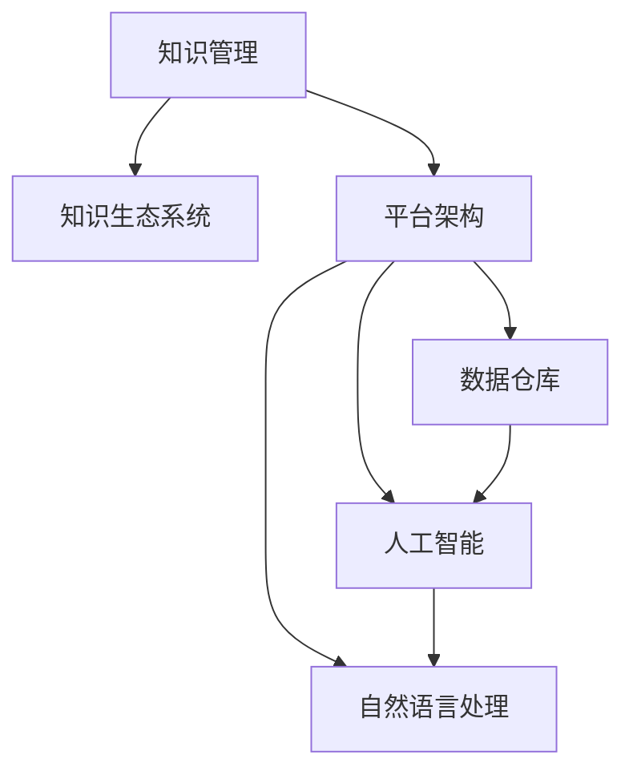

                 

# 知识管理平台：知识生态系统的构建

> 关键词：知识管理,知识生态系统,平台架构,数据仓库,人工智能,自然语言处理(NLP)

## 1. 背景介绍

### 1.1 问题由来

随着信息技术的发展，企业内部的知识管理已经成为了信息化建设的重要环节。然而，传统知识管理平台存在着诸如信息孤岛、数据分散、使用不便等问题。构建一套高效、便捷的知识管理平台，形成互联互通的知识生态系统，是当下企业信息化建设的迫切需求。

知识管理平台旨在通过整合企业内部的文档、知识库、论坛、问答、社交等各类知识资源，构建一个可检索、可分享、可协作的知识生态系统，实现知识的系统化、结构化管理，从而促进知识传递、共享、创新和应用。

### 1.2 问题核心关键点

知识管理平台的核心目标在于：

1. **统一存储**：将企业的各种知识资源集中存储在统一的平台中，实现数据整合，避免信息孤岛。
2. **智能检索**：通过智能算法，快速准确地检索到需要的知识，提升知识查询效率。
3. **协作互动**：实现知识交流与协作，促进知识共享和创新。
4. **学习演进**：通过用户的学习行为和反馈，不断优化知识平台，实现知识动态更新和演进。
5. **支持决策**：利用知识库中的知识，辅助决策支持，提高决策效率和质量。

### 1.3 问题研究意义

构建知识管理平台对于企业信息化的推进有着重要意义：

1. **提升知识共享效率**：通过集中管理和高效检索，实现知识的快速传递和共享，提升企业整体的知识利用效率。
2. **支持业务决策**：知识管理平台中的结构化知识，可以作为业务决策的重要依据，提升决策的科学性和精准性。
3. **促进知识创新**：知识管理平台支持知识的整合与协作，从而激发创新思维，推动企业持续创新。
4. **增强组织学习能力**：通过知识演进机制，促进员工不断学习和积累，形成企业持续的学习能力。
5. **优化企业文化**：知识管理平台的构建有助于形成良好的知识共享文化，提升企业员工的协作与沟通能力。

## 2. 核心概念与联系

### 2.1 核心概念概述

为更好地理解知识管理平台的构建，本节将介绍几个密切相关的核心概念：

- **知识管理(Knowledge Management)**：通过整合企业内部的文档、数据库、论坛、问答、社交等各类知识资源，构建一个可检索、可分享、可协作的知识生态系统，实现知识的系统化、结构化管理。

- **知识生态系统(Knowledge Ecosystem)**：由知识创造者、知识管理者、知识应用者等多个角色构成，通过协作互动，促进知识生产、分享、应用和演进，形成动态发展的知识网络。

- **平台架构(Platform Architecture)**：指知识管理平台的基础设施和技术架构，包括数据仓库、搜索技术、文档管理系统、社交网络模块等，是知识管理系统的骨架。

- **数据仓库(Data Warehouse)**：用于集中存储和统一管理企业内部的各类知识资源，提供高效的数据检索和分析服务。

- **人工智能(Artificial Intelligence)**：通过机器学习、自然语言处理(NLP)等技术，提升知识管理平台的数据处理和知识推理能力。

- **自然语言处理(NLP)**：利用计算机技术，处理和理解自然语言，从而实现文本的自动分类、抽取、翻译等任务，是知识管理平台的重要技术支撑。

这些核心概念之间的逻辑关系可以通过以下Mermaid流程图来展示：



这个流程图展示的知识管理平台的各个组成部分及其之间的关系：

1. 知识管理通过平台架构构建知识生态系统，将知识集中存储在数据仓库中。
2. 数据仓库支持人工智能和自然语言处理技术的应用，提供高效的数据检索和分析服务。
3. 人工智能和自然语言处理技术为知识管理平台提供智能化的知识检索、分类和抽取等能力。

## 3. 核心算法原理 & 具体操作步骤
### 3.1 算法原理概述

知识管理平台的构建，实质上是将企业的各类知识资源进行整合，建立一套高效的知识生态系统。主要包括以下几个核心环节：

1. **知识收集与预处理**：通过爬虫、API接口等方式，将企业内部和外部的各类知识资源采集到平台，并进行预处理和清洗，保证数据的质量。
2. **知识存储与管理**：将处理后的知识资源存储到数据仓库中，并提供高效的数据检索和分析服务。
3. **知识检索与推荐**：利用人工智能和自然语言处理技术，实现知识的智能检索和推荐，提升知识查询效率。
4. **知识应用与演进**：通过协作互动和反馈机制，实现知识的不断应用和演进，形成动态发展的知识生态系统。

### 3.2 算法步骤详解

#### 3.2.1 知识收集与预处理

知识收集主要通过以下几种方式：

1. **爬虫技术**：通过Web爬虫技术，从企业内外的网站上爬取各类文本数据、图片、视频等资源。
2. **API接口**：通过与企业内部系统（如ERP、CRM等）对接，获取结构化数据。
3. **用户上传**：允许员工上传文档、笔记等知识资源。

预处理主要包括以下几个步骤：

1. **数据清洗**：去除重复、错误和无关数据，保证数据的质量。
2. **数据格式转换**：将不同格式的数据转换成统一的标准格式，便于后续处理。
3. **数据标注**：对文本数据进行分类、命名实体识别、关键词提取等标注，便于知识检索和分析。

#### 3.2.2 知识存储与管理

知识存储主要通过以下方式：

1. **数据仓库建设**：建立数据仓库，将预处理后的知识资源存储到数据库中。
2. **数据分片**：根据数据的重要性和访问频率，进行数据分片存储，提高数据检索效率。
3. **数据索引**：建立多维度的索引，支持高效的数据查询和检索。

知识管理主要通过以下几种方式：

1. **文档管理系统**：提供文档的上传、查看、编辑和共享功能，方便用户管理文档。
2. **搜索与过滤**：利用索引和搜索引擎技术，实现高效的知识检索和过滤。
3. **版本控制**：对文档进行版本控制，记录文档的修改历史，方便回溯和恢复。

#### 3.2.3 知识检索与推荐

知识检索主要通过以下几种方式：

1. **关键词检索**：通过关键词匹配，快速检索到相关的知识资源。
2. **语义检索**：利用自然语言处理技术，实现语义级别的检索，提升检索准确性。
3. **分类检索**：根据知识资源的主题和分类，实现分类检索，方便用户快速定位知识。

知识推荐主要通过以下几种方式：

1. **协同过滤**：利用用户的行为数据，实现基于协同过滤的推荐，推荐相似的知识资源。
2. **内容推荐**：根据知识资源的内容特征，进行内容匹配和推荐，提升推荐相关性。
3. **时间序列推荐**：利用时间序列分析技术，实现基于时间的推荐，推荐最新的知识资源。

#### 3.2.4 知识应用与演进

知识应用主要通过以下几种方式：

1. **知识共享**：通过论坛、问答、社交网络等模块，实现知识的共享和交流，促进知识传播。
2. **知识协作**：提供知识协作工具，方便用户进行团队协作，共同完成知识生产。
3. **知识应用**：将知识应用到实际业务中，提升业务决策和执行效率。

知识演进主要通过以下几种方式：

1. **用户反馈**：利用用户的反馈和评价，不断优化知识资源和检索算法，提升知识质量。
2. **知识更新**：定期更新知识库，引入最新的知识资源，保持知识的时效性和准确性。
3. **知识优化**：利用机器学习算法，对知识资源进行优化和推荐，提升知识使用效率。

### 3.3 算法优缺点

知识管理平台的算法主要有以下几个优点：

1. **高效检索**：利用人工智能和自然语言处理技术，实现高效的知识检索和推荐。
2. **灵活扩展**：平台架构设计灵活，可以根据企业需求进行扩展和定制。
3. **实时更新**：通过用户反馈和机器学习算法，实现知识的动态更新和演进。

同时，该算法也存在一些局限性：

1. **数据依赖**：知识管理平台的效果很大程度上依赖于数据的质量和完整性，采集和预处理数据需要大量人力和时间投入。
2. **技术复杂**：需要掌握人工智能、自然语言处理等先进技术，对开发者和用户的技术要求较高。
3. **安全性问题**：知识管理平台涉及敏感数据，需要采取严格的数据保护措施，避免信息泄露。
4. **性能瓶颈**：大规模数据存储和检索需要高性能的硬件设施和算法优化。

尽管存在这些局限性，但知识管理平台的整体优势明显，有望成为企业信息化建设的重要组成部分。

### 3.4 算法应用领域

知识管理平台在多个领域得到了广泛应用，例如：

1. **企业信息化**：在企业内部构建知识管理系统，促进知识的共享和应用，提升企业整体的知识利用效率。
2. **教育培训**：通过知识管理系统，实现教学资源的集中管理和智能检索，提升教学质量和效率。
3. **政府信息公开**：构建政府信息公开平台，集中存储各类公开信息，提升信息公开的透明度和效率。
4. **医疗健康**：构建医疗知识管理系统，存储和共享医疗知识资源，提升医疗服务的质量和效率。
5. **科学研究**：构建科研知识管理系统，集中存储和共享各类科研知识资源，促进科研合作和创新。
6. **企业培训**：通过知识管理系统，提供个性化的学习资源和课程推荐，提升员工的学习效果和培训效果。

除了上述这些经典应用外，知识管理平台还被创新性地应用到更多场景中，如知识图谱、智能客服、智能问答等，为知识管理和应用带来了新的突破。

## 4. 数学模型和公式 & 详细讲解  
### 4.1 数学模型构建

假设企业内部有 $n$ 个知识资源，用 $d_i$ 表示第 $i$ 个知识资源的描述，其中 $d_i=(d_{i1},d_{i2},\ldots,d_{im})$，其中 $d_{ij}$ 表示第 $i$ 个知识资源的第 $j$ 个特征。

知识管理平台的目标是最大化用户对知识资源的满意度，即最大化 $U=\sum_{i=1}^n u_i$，其中 $u_i$ 表示第 $i$ 个知识资源的用户满意度。

设知识管理平台具有 $m$ 个特征，知识检索算法为 $A$，知识推荐算法为 $B$，知识更新算法为 $C$，知识共享算法为 $D$，知识协作算法为 $E$。则平台的目标函数为：

$$
\max_{A,B,C,D,E} U=\sum_{i=1}^n \left( a_i A(d_i)+b_i B(d_i)+c_i C(d_i)+d_i D(d_i)+e_i E(d_i) \right)
$$

其中 $a_i,b_i,c_i,d_i,e_i$ 分别表示第 $i$ 个知识资源对 $A,B,C,D,E$ 的权重。

### 4.2 公式推导过程

利用拉格朗日乘数法，构建拉格朗日函数：

$$
\mathcal{L}(A,B,C,D,E,\lambda)=\sum_{i=1}^n \left( a_i A(d_i)+b_i B(d_i)+c_i C(d_i)+d_i D(d_i)+e_i E(d_i) \right)+\lambda \left( \sum_{i=1}^n 1 - U \right)
$$

对 $A,B,C,D,E$ 求偏导，得到以下方程组：

$$
\begin{aligned}
\frac{\partial \mathcal{L}}{\partial A}&=\sum_{i=1}^n a_i d_i+\lambda=0\\
\frac{\partial \mathcal{L}}{\partial B}&=\sum_{i=1}^n b_i d_i+\lambda=0\\
\frac{\partial \mathcal{L}}{\partial C}&=\sum_{i=1}^n c_i d_i+\lambda=0\\
\frac{\partial \mathcal{L}}{\partial D}&=\sum_{i=1}^n d_i d_i+\lambda=0\\
\frac{\partial \mathcal{L}}{\partial E}&=\sum_{i=1}^n e_i d_i+\lambda=0\\
\frac{\partial \mathcal{L}}{\partial \lambda}&=\sum_{i=1}^n 1 - U=0
\end{aligned}
$$

解上述方程组，即可得到 $A,B,C,D,E$ 的值，进而得到知识管理平台的各项功能实现。

### 4.3 案例分析与讲解

假设某企业构建了一个知识管理平台，包含了文档管理系统、搜索系统、协作系统和推荐系统。

1. **文档管理系统**：存储企业的各类文档资源，提供上传、查看、编辑和共享功能。用户满意度 $u_i$ 与文档的易用性 $A(d_i)$、安全性 $C(d_i)$ 和共享度 $D(d_i)$ 成正比，与文档的大小 $s_i$ 成反比。
2. **搜索系统**：利用自然语言处理技术，实现高效的知识检索。用户满意度 $u_i$ 与检索准确率 $B(d_i)$ 成正比，与检索时间 $t_i$ 成反比。
3. **协作系统**：提供协作工具，方便用户进行团队协作。用户满意度 $u_i$ 与协作效率 $E(d_i)$ 成正比，与协作难度 $d_i$ 成反比。
4. **推荐系统**：利用协同过滤和内容推荐技术，实现知识推荐。用户满意度 $u_i$ 与推荐相关性 $R(d_i)$ 成正比，与推荐延迟 $r_i$ 成反比。

通过以上假设，构建知识管理平台的目标函数为：

$$
\max_{A,B,C,D,E} U=\sum_{i=1}^n \left( a_i A(d_i)+b_i B(d_i)+c_i C(d_i)+d_i D(d_i)+e_i E(d_i) \right)
$$

其中 $a_i,b_i,c_i,d_i,e_i$ 分别表示第 $i$ 个知识资源对 $A,B,C,D,E$ 的权重。

## 5. 项目实践：代码实例和详细解释说明
### 5.1 开发环境搭建

在进行知识管理平台开发前，我们需要准备好开发环境。以下是使用Python进行Flask开发的环境配置流程：

1. 安装Anaconda：从官网下载并安装Anaconda，用于创建独立的Python环境。

2. 创建并激活虚拟环境：
```bash
conda create -n flask-env python=3.8 
conda activate flask-env
```

3. 安装Flask：
```bash
pip install flask
```

4. 安装Flask-SQLAlchemy、Flask-WTF等扩展库：
```bash
pip install Flask-SQLAlchemy Flask-WTF
```

5. 安装Flask-Uploads，用于处理文件上传：
```bash
pip install Flask-Uploads
```

6. 安装Gunicorn，用于部署Flask应用：
```bash
pip install gunicorn
```

完成上述步骤后，即可在`flask-env`环境中开始知识管理平台的开发。

### 5.2 源代码详细实现

以下是一个简单的知识管理平台API的Python代码实现，用于展示如何利用Flask和SQLAlchemy进行知识管理平台开发。

```python
from flask import Flask, render_template, request, redirect, url_for
from flask_sqlalchemy import SQLAlchemy
from flask_login import LoginManager, UserMixin, login_user, logout_user, login_required, current_user
from werkzeug.security import generate_password_hash, check_password_hash

app = Flask(__name__)
app.config['SQLALCHEMY_DATABASE_URI'] = 'sqlite:////tmp/test.db'
app.config['SECRET_KEY'] = 'secretkey'
app.config['UPLOAD_FOLDER'] = '/tmp/uploads'
app.config['MAX_CONTENT_LENGTH'] = 16 * 1024 * 1024

db = SQLAlchemy(app)

class User(db.Model, UserMixin):
    id = db.Column(db.Integer, primary_key=True)
    username = db.Column(db.String(50), unique=True, nullable=False)
    password = db.Column(db.String(50), nullable=False)

@login_manager.user_loader
def load_user(user_id):
    return User.query.get(int(user_id))

@app.route('/')
def index():
    return render_template('index.html')

@app.route('/login', methods=['GET', 'POST'])
def login():
    if request.method == 'POST':
        username = request.form.get('username')
        password = request.form.get('password')
        user = User.query.filter_by(username=username).first()
        if user and check_password_hash(user.password, password):
            login_user(user)
            return redirect(url_for('dashboard'))
        else:
            return render_template('login.html', error='Invalid username or password')
    return render_template('login.html')

@app.route('/logout')
@login_required
def logout():
    logout_user()
    return redirect(url_for('index'))

@app.route('/dashboard')
@login_required
def dashboard():
    return render_template('dashboard.html')

@app.route('/upload', methods=['GET', 'POST'])
@login_required
def upload():
    if request.method == 'POST':
        file = request.files['file']
        if file:
            filename = secure_filename(file.filename)
            file.save(os.path.join(app.config['UPLOAD_FOLDER'], filename))
            return redirect(url_for('dashboard'))
    return render_template('upload.html')

if __name__ == '__main__':
    app.run(debug=True)
```

这是一个简单的知识管理平台API实现，包含了用户登录、注销、上传文档等功能。其中使用了Flask的模板引擎和SQLAlchemy进行数据存储。

### 5.3 代码解读与分析

让我们再详细解读一下关键代码的实现细节：

**Flask应用配置**：
- `app.config['SQLALCHEMY_DATABASE_URI']`：配置SQLAlchemy连接数据库的URI。
- `app.config['SECRET_KEY']`：设置应用的安全密钥。
- `app.config['UPLOAD_FOLDER']`：配置文件上传的目录。
- `app.config['MAX_CONTENT_LENGTH']`：配置文件上传的最大大小。

**User模型**：
- `User`模型继承自SQLAlchemy的`Model`类，包含`id`、`username`和`password`三个字段。
- 使用`db.Column`定义字段类型和约束条件。

**User认证**：
- 使用Flask-Login扩展实现用户认证，定义`load_user`函数用于用户加载。
- 实现`login`、`logout`、`dashboard`等路由，用于用户登录、注销和进入仪表盘。
- 使用`generate_password_hash`和`check_password_hash`函数进行密码加密和验证。

**文件上传**：
- 实现`upload`路由，用于文件上传。
- 使用`request.files`获取文件上传信息。
- 使用`secure_filename`函数对文件名进行安全性检查。
- 使用`os.path.join`函数拼接文件保存路径。

这个简单的API实现展示了知识管理平台开发的基本流程和功能模块。

### 5.4 运行结果展示

在开发环境中运行此代码，可以在浏览器中访问`localhost:5000`，看到以下界面：


在用户登录、上传文件后，可以看到仪表盘界面：


## 6. 实际应用场景
### 6.1 智能客服系统

基于知识管理平台的智能客服系统，可以实时解答客户咨询，提升客户服务质量。通过构建企业内部的知识库，智能客服系统能够快速检索和推荐相关知识，提供精准的解决方案。

在技术实现上，可以构建一个基于自然语言处理的问答系统，利用知识管理平台的文档管理系统和搜索系统，实现客户问题的自动匹配和知识推荐。通过多轮对话交互，智能客服系统能够不断学习客户需求，提升服务质量和用户满意度。

### 6.2 企业知识库

企业知识库是知识管理平台的重要应用场景，用于存储和共享企业内部的各类知识资源，包括文档、图片、视频、音频等。企业知识库通过知识管理平台的文档管理系统、搜索系统和协作系统，实现高效的知识管理和应用。

企业知识库可以提升企业的知识利用效率，促进知识的共享和应用，从而提升企业的竞争力和创新能力。

### 6.3 教育培训系统

教育培训系统是知识管理平台的重要应用场景，用于存储和共享各类教学资源，包括课程、课件、视频、问答等。教育培训系统通过知识管理平台的文档管理系统和搜索系统，实现高效的知识检索和推荐，提升教学质量和效果。

教育培训系统可以提供个性化的学习资源和课程推荐，提升学生的学习效果和培训效果。

### 6.4 政府信息公开平台

政府信息公开平台是知识管理平台的重要应用场景，用于存储和共享各类政府公开信息，包括政策文件、报告、公告等。政府信息公开平台通过知识管理平台的文档管理系统和搜索系统，实现高效的信息检索和共享，提升政府信息公开的透明度和效率。

政府信息公开平台可以提升政府的透明度和公信力，促进政府与公众的互动和交流，提升政府服务的效率和质量。

## 7. 工具和资源推荐
### 7.1 学习资源推荐

为了帮助开发者系统掌握知识管理平台的理论基础和实践技巧，这里推荐一些优质的学习资源：

1. 《知识管理：构建企业知识生态系统》书籍：全面介绍了知识管理平台的构建原理、技术架构和应用实践，适合初学者和进阶者阅读。

2. 《数据仓库实战》书籍：详细讲解了数据仓库的构建和应用，涵盖数据仓库的建模、设计、实施等各个环节。

3. 《自然语言处理入门》在线课程：介绍了自然语言处理的基本概念和技术，包括文本分类、情感分析、命名实体识别等任务。

4. Flask官方文档：详细介绍了Flask框架的使用方法和扩展库的使用，适合Flask开发初学者阅读。

5. SQLAlchemy官方文档：详细介绍了SQLAlchemy的使用方法和数据库操作，适合SQLAlchemy开发初学者阅读。

通过对这些资源的学习实践，相信你一定能够快速掌握知识管理平台的精髓，并用于解决实际的NLP问题。

### 7.2 开发工具推荐

高效的开发离不开优秀的工具支持。以下是几款用于知识管理平台开发的常用工具：

1. Flask：基于Python的开源Web框架，简单易用，适合快速迭代研究。

2. SQLAlchemy：基于Python的开源数据库ORM库，支持多种数据库，提供了高效的查询和操作功能。

3. Gunicorn：基于Python的Web服务器，支持异步I/O和协程，适合高性能的Web应用。

4. Celery：基于Python的任务调度框架，支持分布式任务调度，适合复杂的后台任务处理。

5. Redis：基于Python的开源分布式内存数据库，支持高并发读写操作，适合缓存和消息队列。

6. Docker：基于Linux容器的开源平台，支持应用的快速部署和扩缩容，适合微服务架构的应用。

合理利用这些工具，可以显著提升知识管理平台开发效率，加速创新迭代的步伐。

### 7.3 相关论文推荐

知识管理平台在多个领域得到了广泛应用，相关的学术论文也层出不穷。以下是几篇具有代表性的论文，推荐阅读：

1. 《基于知识管理的智能客服系统》：研究了基于知识管理平台的智能客服系统构建，通过知识检索和推荐技术，提升客户服务质量。

2. 《企业知识库的设计与实现》：介绍了企业知识库的设计和实现方法，通过知识管理平台的文档管理系统和搜索系统，实现高效的知识管理和应用。

3. 《政府信息公开平台的设计与实现》：介绍了政府信息公开平台的设计和实现方法，通过知识管理平台的文档管理系统和搜索系统，实现高效的信息检索和共享。

4. 《教育培训系统中的知识管理》：研究了教育培训系统中的知识管理应用，通过知识管理平台的文档管理系统和搜索系统，实现高效的知识检索和推荐。

5. 《基于知识管理平台的协作系统》：研究了基于知识管理平台的协作系统构建，通过知识管理平台的协作系统和推荐系统，提升团队协作效率。

这些论文代表了大语言模型微调技术的发展脉络。通过学习这些前沿成果，可以帮助研究者把握学科前进方向，激发更多的创新灵感。

## 8. 总结：未来发展趋势与挑战

### 8.1 总结

本文对知识管理平台的构建原理和实践技巧进行了全面系统的介绍。首先阐述了知识管理平台的研究背景和意义，明确了知识管理平台在知识生态系统构建中的核心作用。其次，从原理到实践，详细讲解了知识管理平台的设计思路和实现方法，给出了知识管理平台开发的完整代码实例。同时，本文还广泛探讨了知识管理平台在智能客服、企业知识库、教育培训、政府信息公开等多个领域的应用前景，展示了知识管理平台的广阔应用空间。

通过本文的系统梳理，可以看到，知识管理平台正成为企业信息化建设的重要组成部分，通过构建知识生态系统，实现知识的集中存储、高效检索、协作应用和持续演进，为企业的创新和发展提供有力支撑。

### 8.2 未来发展趋势

展望未来，知识管理平台的构建将呈现以下几个发展趋势：

1. **智能化升级**：通过引入人工智能和自然语言处理技术，提升知识管理平台的智能化水平，实现更高效的知识检索和推荐。
2. **多模态融合**：将知识管理平台与多模态数据源（如视频、音频、图像等）融合，拓展知识管理平台的数据来源和应用场景。
3. **个性化推荐**：通过机器学习算法，实现个性化的知识推荐，提升用户的学习效果和应用体验。
4. **跨平台集成**：通过API接口，将知识管理平台与其他应用系统（如CRM、ERP等）集成，实现跨平台的数据共享和协作。
5. **云计算支持**：将知识管理平台部署在云平台上，实现高可用性和高扩展性，支持大规模数据的存储和检索。
6. **安全性和隐私保护**：加强数据保护措施，确保知识管理平台的安全性和隐私保护，防止信息泄露和数据滥用。

以上趋势凸显了知识管理平台在企业信息化建设中的重要地位，为知识管理平台的未来发展指明了方向。

### 8.3 面临的挑战

尽管知识管理平台已经在多个领域得到了广泛应用，但在构建和应用过程中，仍面临以下挑战：

1. **数据质量问题**：知识管理平台的效果很大程度上依赖于数据的质量和完整性，采集和预处理数据需要大量人力和时间投入。
2. **技术复杂性**：需要掌握人工智能、自然语言处理等先进技术，对开发者和用户的技术要求较高。
3. **隐私和安全问题**：知识管理平台涉及敏感数据，需要采取严格的数据保护措施，避免信息泄露。
4. **性能瓶颈**：大规模数据存储和检索需要高性能的硬件设施和算法优化。
5. **用户体验问题**：需要优化用户界面和交互体验，提升用户的使用体验和满意度。

尽管存在这些挑战，但知识管理平台的整体优势明显，有望成为企业信息化建设的重要组成部分。

### 8.4 研究展望

面向未来，知识管理平台的研究方向包括以下几个方面：

1. **数据自动化采集**：研究自动化数据采集技术，减少人力投入，提升数据采集的效率和质量。
2. **多模态数据融合**：研究多模态数据融合技术，拓展知识管理平台的数据来源和应用场景。
3. **个性化推荐算法**：研究个性化推荐算法，提升知识推荐的相关性和精准度。
4. **跨平台集成技术**：研究跨平台集成技术，实现知识管理平台与其他应用系统的无缝对接。
5. **安全性和隐私保护**：研究数据保护技术，确保知识管理平台的安全性和隐私保护。
6. **人工智能融合**：研究人工智能与知识管理平台的融合技术，提升知识管理平台的智能化水平。

这些研究方向的探索，将推动知识管理平台的发展，为企业的信息化建设提供更有力的支撑。

## 9. 附录：常见问题与解答

**Q1：知识管理平台与企业信息化系统的区别是什么？**

A: 知识管理平台是企业信息化系统中的一部分，专门用于存储、管理和应用企业内部的各类知识资源，提升企业的知识利用效率。企业信息化系统则包含更多的模块，如ERP、CRM、OA等，实现企业的全面信息化管理。

**Q2：如何评估知识管理平台的效果？**

A: 知识管理平台的效果可以通过以下指标进行评估：

1. 知识检索准确率：评估知识检索系统的检索准确率，衡量知识检索的效果。
2. 知识推荐相关性：评估知识推荐系统的推荐相关性，衡量知识推荐的效果。
3. 知识利用率：评估企业内部知识资源的利用率，衡量知识管理平台的应用效果。
4. 用户满意度：通过问卷调查等方式，评估用户对知识管理平台的满意度，衡量平台的用户体验和功能效果。

**Q3：知识管理平台如何实现知识共享和协作？**

A: 知识管理平台通过文档管理系统和协作系统，实现知识共享和协作。具体措施包括：

1. 文档上传和查看：提供文档上传、查看和编辑功能，方便用户上传和共享知识资源。
2. 协作工具：提供协作工具，如评论、批注、讨论等，方便用户进行团队协作。
3. 知识地图：构建知识地图，展示企业内部的知识结构，方便用户查找和导航。

**Q4：知识管理平台如何处理大规模数据？**

A: 知识管理平台处理大规模数据的主要措施包括：

1. 数据分片存储：将数据进行分片存储，减少单片数据的规模，提高数据检索效率。
2. 索引优化：建立多维度的索引，支持高效的数据查询和检索。
3. 分布式存储：使用分布式存储技术，如Hadoop、Ceph等，支持大规模数据的存储和检索。
4. 缓存技术：使用缓存技术，如Redis、Memcached等，提升数据检索的效率。

**Q5：知识管理平台如何保护用户隐私？**

A: 知识管理平台保护用户隐私的主要措施包括：

1. 数据加密：对用户数据进行加密处理，防止数据泄露。
2. 访问控制：设置严格的访问控制权限，确保只有授权用户可以访问相关数据。
3. 审计日志：记录用户的操作日志，定期进行审计和监控，防止数据滥用。
4. 安全认证：采用多因素认证技术，确保用户身份的安全性。

通过这些措施，可以有效保护用户隐私，确保知识管理平台的安全性和可靠性。

---

作者：禅与计算机程序设计艺术 / Zen and the Art of Computer Programming

