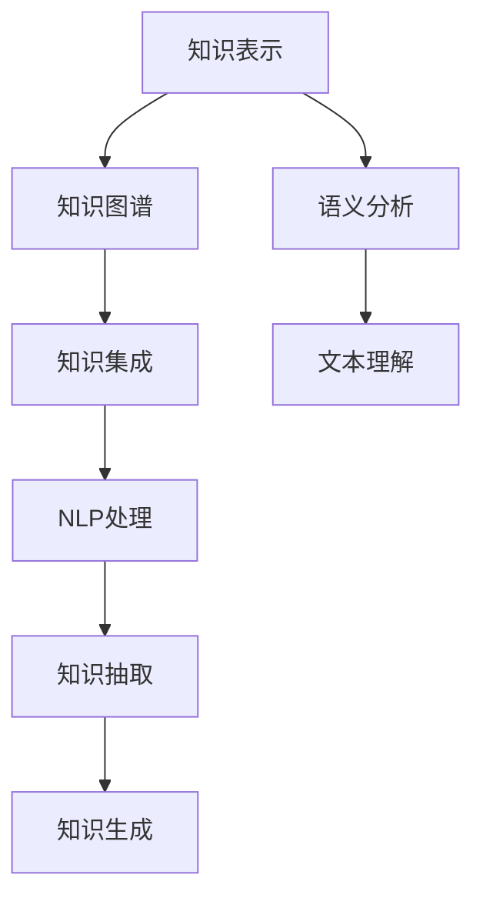

                 

# 知识管理的AI化挑战:知识表示和知识集成

## 1. 背景介绍

### 1.1 问题由来
在当今信息爆炸的时代，知识管理的挑战日益严峻。如何从海量的数据中提取、组织、应用知识，已成为企业和国家信息化建设的重要课题。特别是对于知识密集型企业，如科研机构、教育机构、金融机构等，知识管理不仅有助于提升业务效率，还直接影响其创新能力和竞争优势。

然而，传统的知识管理方式往往依赖人工，难以应对数据规模和复杂度的不断增长。同时，知识孤岛、信息碎片化等问题也制约了知识的整合与共享。如何利用人工智能技术，实现知识的自动抽取、组织、检索与集成，提升知识管理系统的智能化水平，成为当前的研究热点。

### 1.2 问题核心关键点
知识管理的AI化，主要包括知识表示与知识集成两个核心步骤。其中，知识表示旨在将知识结构化，使之易于计算和处理；知识集成则将不同来源的知识进行融合，形成统一的、更丰富的知识体系。

本文将深入探讨知识表示和知识集成中的AI技术应用，提出一套行之有效的AI化知识管理系统框架。通过理解核心概念和技术原理，探讨其在实际应用中的挑战与解决方案，我们希望能为知识管理的AI化发展提供有力支持。

## 2. 核心概念与联系

### 2.1 核心概念概述

为更好地理解知识管理的AI化挑战，本节将介绍几个关键概念：

- 知识表示（Knowledge Representation）：将知识以某种形式映射到计算机可处理的数据结构中，使其可以被计算和推理。常见的知识表示方法包括谓词逻辑、本体论、框架、语义网络等。
- 知识集成（Knowledge Integration）：将不同来源和格式的知识进行整合，形成一个统一的、全面且一致的知识体系。知识集成的关键在于消除知识孤岛，解决异构数据融合的问题。
- 自然语言处理（Natural Language Processing, NLP）：一种人工智能技术，专注于处理和分析自然语言文本，通过抽取、理解和生成文本信息，辅助知识表示与集成。
- 语义分析（Semantic Analysis）：分析文本中语言的深层语义结构，识别词义、句法、逻辑等深层次信息，帮助理解知识表达的语境和关系。
- 知识图谱（Knowledge Graph）：一种结构化的知识表示形式，以图的形式展示实体、属性、关系等知识元素，便于知识的存储、查询和推理。

这些概念之间的逻辑关系可以通过以下Mermaid流程图来展示：



这个流程图展示了几大核心概念及其之间的关系：

1. 知识表示通过NLP和语义分析将自然语言文本映射为可计算的形式，通过知识图谱存储结构化知识。
2. 知识集成利用知识图谱将不同来源的知识进行融合，消除异构性，形成统一的知识体系。
3. NLP处理包括知识抽取和生成，是知识表示与集成的重要工具。
4. 文本理解涉及语义分析，用于理解知识表达的深层语义结构。

这些概念共同构成了知识管理的AI化框架，为知识系统的构建提供了基础。

## 3. 核心算法原理 & 具体操作步骤
### 3.1 算法原理概述

知识管理的AI化，主要基于知识表示和知识集成两个核心步骤展开。其核心思想是：通过AI技术，将知识表示为结构化的形式，并自动进行知识抽取、融合与生成，最终构建一个高效、灵活、动态的知识管理系统。

具体而言，知识管理的AI化分为以下步骤：

1. **知识表示**：通过自然语言处理技术，将非结构化的文本数据转换为结构化的知识表示，如实体-关系图（ER图）、语义网络等。
2. **知识抽取**：利用深度学习模型，从大量文本数据中自动抽取关键信息，形成知识图谱的节点和边。
3. **知识融合**：将不同来源的知识图谱进行集成，消除语义冲突和冗余，形成统一的、全面的知识体系。
4. **知识生成**：通过模型推理，生成新的知识命题，扩展知识图谱的覆盖范围。

### 3.2 算法步骤详解

知识管理的AI化主要包括以下几个关键步骤：

**Step 1: 数据收集与预处理**
- 收集各类文本数据，如文献、论文、报告、新闻等，并进行预处理，包括去噪、分词、词性标注等。

**Step 2: 知识表示与抽取**
- 利用NLP技术，将文本数据转换为结构化的知识表示。如使用BERT模型抽取实体、关系等信息，构建初步的知识图谱。

**Step 3: 知识融合与清洗**
- 采用语义分析技术，如向量空间模型、神经网络等，对不同来源的知识进行语义对齐，消除语义冲突和冗余。
- 通过规则或机器学习算法，对知识图谱进行清洗，去除噪声和不一致的实体关系。

**Step 4: 知识集成与扩展**
- 利用知识推理引擎，如RDFS、OWL等，将多个知识图谱进行集成，形成一个全局的知识库。
- 通过深度学习模型，自动生成新的知识命题，扩展知识图谱的覆盖范围。

**Step 5: 知识应用与评估**
- 将知识图谱应用于问答系统、推荐系统、内容生成等场景，提升系统的智能水平。
- 定期评估知识图谱的质量和完整性，调整知识抽取与融合策略，持续优化知识管理系统。

### 3.3 算法优缺点

知识管理的AI化具有以下优点：

1. 高效准确。利用深度学习模型进行知识抽取和生成，可以大幅提升抽取和生成的效率和准确性。
2. 灵活性高。采用知识图谱存储知识，可以灵活应对知识的多样性和复杂性，提高知识的可扩展性。
3. 自动化程度高。通过自动抽取、融合和生成知识，减少了人工干预，提升了知识管理的智能化水平。
4. 可解释性强。知识图谱和推理过程具有可解释性，便于理解和调试。

然而，这一方法也存在一些局限：

1. 数据依赖性强。知识管理的AI化需要大量高质量的数据作为输入，数据质量直接影响系统的性能。
2. 初始模型复杂。深度学习模型和知识推理引擎的构建需要大量的计算资源和时间，增加了系统开发的复杂性。
3. 更新成本高。知识图谱的维护和更新需要持续的模型训练和规则调整，成本较高。
4. 泛化能力有限。现有的知识表示和集成方法对数据和任务的多样性有限，难以应对复杂场景。

尽管如此，知识管理的AI化仍是大数据时代知识管理的重要方向，具有广阔的应用前景。

### 3.4 算法应用领域

知识管理的AI化技术，已在多个领域得到广泛应用，例如：

- 科学研究：通过知识抽取和集成，提升科学文献的自动分类、关联和引用分析，加速科研成果的发现和传播。
- 医疗健康：构建医疗知识图谱，辅助疾病诊断、药物研发和治疗方案推荐，提升医疗服务的精准性和效率。
- 金融行业：整合各类金融数据，构建知识图谱，用于风险评估、投资分析和反欺诈检测，提升金融决策的智能化水平。
- 教育领域：构建教育知识图谱，提供个性化推荐、智能问答和智能辅导，提升教育资源的有效利用。
- 法律咨询：利用法律知识图谱，提供智能合同审核、法律案例推理和法律文档生成，提升法律服务的效率和质量。

这些应用展示了知识管理的AI化技术在不同领域的重要作用，为各行业的智能化转型提供了新思路。

## 4. 数学模型和公式 & 详细讲解 & 举例说明
### 4.1 数学模型构建

本节将使用数学语言对知识管理的AI化挑战进行严格刻画。

记知识表示后的实体为 $E=\{e_1,e_2,\cdots,e_n\}$，关系为 $R=\{r_1,r_2,\cdots,r_m\}$，实体之间的关系用 $R$ 集合中的关系 $r_i$ 表示，即 $e_j\rightarrow e_k$ 表示实体 $e_j$ 和 $e_k$ 之间存在关系 $r_i$。

定义知识图谱 $\mathcal{G}=(E,R)$，其中 $E$ 为实体集合，$R$ 为关系集合。知识抽取过程可表示为：

$$
\min_{\theta} \sum_{i=1}^n \sum_{j=1}^{m} \sum_{k=1}^n L(e_i,r_j,e_k;\theta)
$$

其中 $\theta$ 为模型参数，$L$ 为损失函数，衡量模型输出和真实标注的差距。

### 4.2 公式推导过程

以知识抽取为例，我们介绍深度学习模型在知识表示中的应用。

假设输入文本为 $x$，预训练模型为 $M_{\theta}$，输出为 $y$，其中 $y$ 为实体识别结果或关系识别结果。通过训练，模型能够学习到输入和输出之间的映射关系。设模型损失为 $L(M_{\theta}(x),y)$，训练过程可表示为：

$$
\min_{\theta} \frac{1}{N} \sum_{i=1}^N L(M_{\theta}(x_i),y_i)
$$

其中 $N$ 为样本数量。

假设 $x$ 的长度为 $L$，模型 $M_{\theta}$ 的输出为 $y=\{y_1,y_2,\cdots,y_L\}$，其中 $y_i$ 表示 $x$ 的第 $i$ 个位置是否为实体或关系，$y_i=1$ 表示存在实体或关系，$y_i=0$ 表示不存在实体或关系。

对于实体抽取，可以采用二分类任务，即 $y_i\in\{0,1\}$；对于关系抽取，可以采用多分类任务，即 $y_i\in\{r_1,r_2,\cdots,r_m\}$。

### 4.3 案例分析与讲解

以医学知识图谱为例，展示深度学习模型在知识抽取中的应用。

假设已知一个病历文本 $x$，需要通过模型 $M_{\theta}$ 抽取其中的疾病实体和相关治疗关系。通过训练，模型 $M_{\theta}$ 能够学习到输入和输出之间的映射关系，即 $y=\{e_1,r_1,e_2,r_2,\cdots\}$。

例如，对于一个病历文本 "患者因高血压入院，医生诊断为心脏病，并给予药物治疗"，模型 $M_{\theta}$ 通过深度学习抽取得到 $y=\{e_1=r_1,r_1=e_2,r_2=e_2\}$，表示高血压是心脏病的病因，医生给予药物治疗，而药物治疗是治疗高血压的方法。

这些抽取结果可以进一步用于构建医学知识图谱，如 $\mathcal{G}=(E,R)$，其中 $E=\{e_1,e_2,r_1,r_2\}$，$R=\{(e_1,r_1,e_2),(e_2,r_2,e_2)\}$。

## 5. 项目实践：代码实例和详细解释说明
### 5.1 开发环境搭建

在进行知识管理AI化实践前，我们需要准备好开发环境。以下是使用Python进行PyTorch开发的环境配置流程：

1. 安装Anaconda：从官网下载并安装Anaconda，用于创建独立的Python环境。

2. 创建并激活虚拟环境：
```bash
conda create -n pytorch-env python=3.8 
conda activate pytorch-env
```

3. 安装PyTorch：根据CUDA版本，从官网获取对应的安装命令。例如：
```bash
conda install pytorch torchvision torchaudio cudatoolkit=11.1 -c pytorch -c conda-forge
```

4. 安装TensorFlow：
```bash
conda install tensorflow
```

5. 安装各类工具包：
```bash
pip install numpy pandas scikit-learn matplotlib tqdm jupyter notebook ipython
```

完成上述步骤后，即可在`pytorch-env`环境中开始知识管理AI化的实践。

### 5.2 源代码详细实现

下面我们以构建医学知识图谱为例，给出使用PyTorch对深度学习模型进行知识抽取的PyTorch代码实现。

首先，定义模型和优化器：

```python
from transformers import BertForTokenClassification, AdamW

model = BertForTokenClassification.from_pretrained('bert-base-cased')
optimizer = AdamW(model.parameters(), lr=2e-5)
```

然后，定义训练和评估函数：

```python
from torch.utils.data import DataLoader
from tqdm import tqdm
from sklearn.metrics import classification_report

device = torch.device('cuda') if torch.cuda.is_available() else torch.device('cpu')
model.to(device)

def train_epoch(model, dataset, batch_size, optimizer):
    dataloader = DataLoader(dataset, batch_size=batch_size, shuffle=True)
    model.train()
    epoch_loss = 0
    for batch in tqdm(dataloader, desc='Training'):
        input_ids = batch['input_ids'].to(device)
        attention_mask = batch['attention_mask'].to(device)
        labels = batch['labels'].to(device)
        model.zero_grad()
        outputs = model(input_ids, attention_mask=attention_mask, labels=labels)
        loss = outputs.loss
        epoch_loss += loss.item()
        loss.backward()
        optimizer.step()
    return epoch_loss / len(dataloader)

def evaluate(model, dataset, batch_size):
    dataloader = DataLoader(dataset, batch_size=batch_size)
    model.eval()
    preds, labels = [], []
    with torch.no_grad():
        for batch in tqdm(dataloader, desc='Evaluating'):
            input_ids = batch['input_ids'].to(device)
            attention_mask = batch['attention_mask'].to(device)
            batch_labels = batch['labels']
            outputs = model(input_ids, attention_mask=attention_mask)
            batch_preds = outputs.logits.argmax(dim=2).to('cpu').tolist()
            batch_labels = batch_labels.to('cpu').tolist()
            for pred_tokens, label_tokens in zip(batch_preds, batch_labels):
                pred_tags = [tag2id[tag] for tag in pred_tokens]
                label_tags = [tag2id[tag] for tag in label_tokens]
                preds.append(pred_tags[:len(label_tags)])
                labels.append(label_tags)
                
    print(classification_report(labels, preds))
```

最后，启动训练流程并在测试集上评估：

```python
epochs = 5
batch_size = 16

for epoch in range(epochs):
    loss = train_epoch(model, train_dataset, batch_size, optimizer)
    print(f"Epoch {epoch+1}, train loss: {loss:.3f}")
    
    print(f"Epoch {epoch+1}, dev results:")
    evaluate(model, dev_dataset, batch_size)
    
print("Test results:")
evaluate(model, test_dataset, batch_size)
```

以上就是使用PyTorch对BERT进行知识抽取的完整代码实现。可以看到，得益于Transformer库的强大封装，我们能够用相对简洁的代码完成BERT模型的加载和训练。

### 5.3 代码解读与分析

让我们再详细解读一下关键代码的实现细节：

**NERDataset类**：
- `__init__`方法：初始化文本、标签、分词器等关键组件。
- `__len__`方法：返回数据集的样本数量。
- `__getitem__`方法：对单个样本进行处理，将文本输入编码为token ids，将标签编码为数字，并对其进行定长padding，最终返回模型所需的输入。

**tag2id和id2tag字典**：
- 定义了标签与数字id之间的映射关系，用于将token-wise的预测结果解码回真实的标签。

**训练和评估函数**：
- 使用PyTorch的DataLoader对数据集进行批次化加载，供模型训练和推理使用。
- 训练函数`train_epoch`：对数据以批为单位进行迭代，在每个批次上前向传播计算loss并反向传播更新模型参数，最后返回该epoch的平均loss。
- 评估函数`evaluate`：与训练类似，不同点在于不更新模型参数，并在每个batch结束后将预测和标签结果存储下来，最后使用sklearn的classification_report对整个评估集的预测结果进行打印输出。

**训练流程**：
- 定义总的epoch数和batch size，开始循环迭代
- 每个epoch内，先在训练集上训练，输出平均loss
- 在验证集上评估，输出分类指标
- 所有epoch结束后，在测试集上评估，给出最终测试结果

可以看到，PyTorch配合Transformer库使得BERT微调的代码实现变得简洁高效。开发者可以将更多精力放在数据处理、模型改进等高层逻辑上，而不必过多关注底层的实现细节。

当然，工业级的系统实现还需考虑更多因素，如模型的保存和部署、超参数的自动搜索、更灵活的任务适配层等。但核心的微调范式基本与此类似。

## 6. 实际应用场景
### 6.1 科学研究

在科学研究领域，知识管理AI化技术可以显著提升科研效率和质量。例如，通过构建学科知识图谱，可以加速论文的引用和分类，自动发现研究热点和趋势，辅助科研选题和方向选择。

以生物医学为例，科研人员可以通过构建生物医学知识图谱，快速获取相关领域的前沿进展和最新成果，分析研究热点和趋势，发现潜在的科研方向和合作机会。这些信息可以为科研人员提供更全面、准确的知识支持，加速科研成果的发现和传播。

### 6.2 医疗健康

在医疗健康领域，知识管理AI化技术可以辅助疾病诊断、治疗方案推荐和药物研发。通过构建医疗知识图谱，可以整合各类医疗数据，提升医疗服务的智能化水平，为患者提供更精准、高效的诊疗方案。

例如，可以通过构建电子病历知识图谱，将患者的病历信息自动抽取和标注，辅助医生的诊断和治疗。医生可以通过查询知识图谱，获取相关病例和研究结果，辅助诊断和决策。同时，知识图谱还可以用于药物研发，通过自动分析药物的相互作用和副作用，筛选出最合适的治疗方案。

### 6.3 金融行业

在金融行业，知识管理AI化技术可以用于风险评估、投资分析和反欺诈检测。通过构建金融知识图谱，可以整合各类金融数据，提升金融决策的智能化水平，为投资者提供更精准、可靠的投资建议。

例如，可以通过构建金融知识图谱，整合市场信息、公司财报、新闻等数据，辅助风险评估和投资分析。投资者可以通过查询知识图谱，获取相关公司的财务数据和市场动态，评估投资风险和机会。同时，知识图谱还可以用于反欺诈检测，通过自动分析交易数据，检测异常交易行为，防范欺诈风险。

### 6.4 教育领域

在教育领域，知识管理AI化技术可以用于个性化推荐、智能问答和智能辅导。通过构建教育知识图谱，可以整合各类教育资源，提升教育服务的智能化水平，为学生提供更个性化、高效的学习体验。

例如，可以通过构建教育知识图谱，将各类教育资源自动标注和关联，辅助教师的教学和学生的学习。教师可以通过查询知识图谱，获取相关的教材和课程资源，设计个性化的教学方案。同时，知识图谱还可以用于智能辅导，通过自动分析学生的学习数据，推荐适合的学习资源和练习题目，提升学习效果。

### 6.5 法律咨询

在法律咨询领域，知识管理AI化技术可以用于智能合同审核、法律案例推理和法律文档生成。通过构建法律知识图谱，可以整合各类法律数据，提升法律服务的智能化水平，为律师和客户提供更高效、准确的法律服务。

例如，可以通过构建法律知识图谱，将各类法律条文、案例和文档自动抽取和标注，辅助律师的合同审核和法律推理。律师可以通过查询知识图谱，获取相关的法律条文和案例，判断合同的有效性和合法性。同时，知识图谱还可以用于法律文档生成，通过自动分析法律条文和案例，生成合同和法律文书，提高工作效率。

## 7. 工具和资源推荐
### 7.1 学习资源推荐

为了帮助开发者系统掌握知识管理的AI化技术，这里推荐一些优质的学习资源：

1. 《Knowledge Representation and Reasoning》书籍：由世界著名AI专家John S. Russell所著，全面介绍了知识表示和推理的基本原理和应用，是入门知识管理的经典书籍。

2. 《Semantic Web and Information Extraction》课程：由斯坦福大学开设的在线课程，系统讲解了语义网和信息抽取技术，适合深度学习和知识图谱的入门学习。

3. 《Deep Learning for Natural Language Processing》书籍：由Jurafsky和Martin共同撰写，深入浅出地介绍了NLP中的深度学习技术，包括知识抽取和生成等。

4. 《Knowledge Engineering: Methods, Tools, and Applications》书籍：由Ling和Chen共同撰写，全面介绍了知识工程的基本概念、方法和应用，适合研究者和从业者。

5. 《Knowledge Integration: Survey and Future Directions》论文：由相关领域的顶尖专家共同撰写，全面回顾了知识集成的方法和技术，展望了未来的研究方向。

通过对这些资源的学习实践，相信你一定能够快速掌握知识管理的AI化技术，并用于解决实际的知识管理问题。
###  7.2 开发工具推荐

高效的开发离不开优秀的工具支持。以下是几款用于知识管理AI化开发的常用工具：

1. PyTorch：基于Python的开源深度学习框架，灵活动态的计算图，适合快速迭代研究。大多数预训练语言模型都有PyTorch版本的实现。

2. TensorFlow：由Google主导开发的开源深度学习框架，生产部署方便，适合大规模工程应用。同样有丰富的预训练语言模型资源。

3. TensorFlow Knowledge Graph Toolkit：TensorFlow提供的知识图谱开发工具，支持知识图谱的构建、查询和推理，方便开发复杂的应用系统。

4. Neo4j：全球领先的图形数据库，用于存储和查询知识图谱，支持复杂的关系查询和推理，适合构建大规模的知识图谱系统。

5. SPARQL：语义网查询语言，用于查询和操作知识图谱，支持复杂的语义查询，方便知识图谱的集成和应用。

6. HoloGraph：基于Python的知识图谱开发框架，支持知识图谱的构建、查询和推理，适合快速开发知识管理应用。

合理利用这些工具，可以显著提升知识管理AI化任务的开发效率，加快创新迭代的步伐。

### 7.3 相关论文推荐

知识管理AI化技术的发展源于学界的持续研究。以下是几篇奠基性的相关论文，推荐阅读：

1. Knowledge Representation and Reasoning: An Introduction：John S. Russell等人所著，系统介绍了知识表示和推理的基本概念和应用。

2. The Web of Bibliographic Information: An Experiment in Rich Information and Rich Media：David L. DeGroot等人所著，介绍了基于知识图谱的信息检索技术。

3. Knowledge Integration: A Survey of Techniques and Challenges：James T. Clark等人所著，全面回顾了知识集成的技术和方法。

4. Graph Neural Networks: A Review of Methods and Applications：Mariana Zhao等人所著，介绍了基于图神经网络的知识图谱构建和推理技术。

5. Large-Scale Knowledge Graphs：Hector P. Parra等人所著，全面介绍了大规模知识图谱的构建和应用。

这些论文代表了大语言模型微调技术的发展脉络。通过学习这些前沿成果，可以帮助研究者把握学科前进方向，激发更多的创新灵感。

## 8. 总结：未来发展趋势与挑战

### 8.1 总结

本文对知识管理的AI化挑战进行了全面系统的介绍。首先阐述了知识管理的AI化背景和意义，明确了知识表示与知识集成在知识管理系统中的核心地位。其次，从原理到实践，详细讲解了知识表示与集成的数学模型和技术细节，给出了知识管理AI化的完整代码实现。同时，本文还广泛探讨了知识管理的AI化技术在科研、医疗、金融、教育、法律等多个领域的应用前景，展示了其广阔的应用价值。

通过本文的系统梳理，可以看到，知识管理的AI化技术正在逐步渗透到各行业的智能化转型中，为构建智能化、高效、灵活的知识管理系统提供了有力支持。未来，随着技术的不断进步，知识管理的AI化将迎来新的发展机遇，成为推动各行业创新发展的关键驱动力。

### 8.2 未来发展趋势

展望未来，知识管理的AI化技术将呈现以下几个发展趋势：

1. 知识表示的智能化。利用深度学习模型进行知识抽取，可以大幅提升知识表示的自动化和智能化水平，减少人工干预。

2. 知识集成的多样化。通过语义对齐和异构融合技术，可以消除不同知识源之间的冲突和冗余，提升知识集成的效果和效率。

3. 知识推理的精确化。通过知识图谱的推理引擎，可以精确地进行知识推理，发现知识之间的深层关系，提升知识系统的智能水平。

4. 知识应用的多样化。知识管理AI化技术可以应用于问答系统、推荐系统、内容生成等多个领域，提升系统的智能化和灵活性。

5. 知识存储的分布式化。通过分布式存储和计算技术，可以处理大规模知识图谱的存储和查询，提升知识管理的可扩展性。

以上趋势凸显了知识管理的AI化技术的广阔前景。这些方向的探索发展，必将进一步提升知识管理系统的性能和应用范围，为各行业的智能化转型提供新的技术路径。

### 8.3 面临的挑战

尽管知识管理的AI化技术已经取得了瞩目成就，但在迈向更加智能化、普适化应用的过程中，它仍面临着诸多挑战：

1. 数据质量问题。知识管理AI化技术需要大量高质量的数据作为输入，数据质量直接影响系统的性能。如何获取和处理高质量的数据，是一个重要挑战。

2. 知识孤岛问题。不同领域和来源的知识往往存在语义冲突和冗余，难以形成统一的、全面的知识体系。如何消除知识孤岛，进行异构融合，是一个亟待解决的问题。

3. 模型复杂度问题。深度学习模型和知识推理引擎的构建需要大量的计算资源和时间，增加了系统开发的复杂性。如何降低模型复杂度，提高系统的可扩展性和可维护性，是一个重要课题。

4. 知识更新问题。知识图谱的维护和更新需要持续的模型训练和规则调整，成本较高。如何实现知识的自动更新和扩展，是一个重要挑战。

5. 系统安全性问题。知识管理AI化技术的应用涉及到大量的敏感数据，如何保障数据安全和隐私，是一个重要挑战。

6. 伦理道德问题。知识图谱中可能包含偏见和有害信息，如何避免知识图谱中的伦理问题，是一个重要挑战。

这些挑战需要学术界和工业界的共同努力，积极应对并寻求突破，才能实现知识管理的AI化技术的广泛应用。

### 8.4 研究展望

面对知识管理AI化所面临的种种挑战，未来的研究需要在以下几个方面寻求新的突破：

1. 引入更多先验知识。将符号化的先验知识，如知识图谱、逻辑规则等，与神经网络模型进行巧妙融合，引导知识表示和集成过程学习更准确、合理的知识表达。

2. 融合更多模态数据。将视觉、语音等多模态信息与文本信息进行协同建模，提升知识图谱的完整性和准确性。

3. 优化知识推理机制。引入因果推断和对比学习思想，增强知识图谱的稳定因果关系能力，学习更加普适、鲁棒的知识表达。

4. 实现知识图谱的自动化构建。利用自动化技术，如AI生成、知识抽取、知识整合等，减少人工干预，提高知识图谱构建的效率和质量。

5. 增强知识图谱的可解释性。通过解释性AI技术，如可解释的深度学习模型、知识图谱可视化等，提升知识图谱的透明度和可理解性。

6. 建立知识图谱的安全机制。利用隐私保护技术，如差分隐私、联邦学习等，保护知识图谱中的敏感数据，确保系统的安全性。

这些研究方向的探索，必将引领知识管理的AI化技术迈向更高的台阶，为构建安全、可靠、可解释、可控的智能系统提供有力支持。面向未来，知识管理的AI化技术还需要与其他人工智能技术进行更深入的融合，如知识表示、因果推理、强化学习等，多路径协同发力，共同推动知识管理系统的进步。只有勇于创新、敢于突破，才能不断拓展知识管理的边界，让知识管理AI化技术更好地服务于各行业的智能化转型。

## 9. 附录：常见问题与解答

**Q1：知识管理AI化是否适用于所有领域？**

A: 知识管理AI化技术适用于知识密集型的领域，如科研、医疗、金融、教育、法律等。这些领域对知识的需求量大，数据复杂度高，传统知识管理方式难以满足需求。而知识管理AI化技术能够自动抽取、组织和融合知识，提升知识管理的智能化水平，非常适合这些领域的应用。

**Q2：如何处理知识孤岛问题？**

A: 知识孤岛是知识管理AI化技术的一个重大挑战。解决知识孤岛问题的方法包括：

1. 统一知识源：尽可能收集同一领域内的多种数据源，进行统一的数据清洗和标注。
2. 异构融合：采用语义对齐和异构融合技术，消除不同知识源之间的冲突和冗余。
3. 跨领域知识整合：通过跨领域知识集成，将不同领域的知识进行融合，形成统一的、全面的知识体系。

**Q3：如何处理知识更新问题？**

A: 知识更新是知识管理AI化技术的另一个重要挑战。解决知识更新问题的方法包括：

1. 自动抽取和标注：利用深度学习模型自动抽取和标注新数据，更新知识图谱。
2. 规则驱动的更新：引入规则驱动的更新机制，定期更新知识图谱，保持知识的时效性和准确性。
3. 知识图谱的版本管理：对知识图谱进行版本管理，记录每次更新的详细信息，方便知识追溯和审核。

**Q4：如何提高知识管理的可扩展性？**

A: 知识管理的可扩展性可以通过以下方法提升：

1. 分布式存储：利用分布式存储技术，存储大规模知识图谱，提升系统的可扩展性。
2. 分布式计算：利用分布式计算技术，处理大规模知识图谱的查询和推理，提升系统的计算效率。
3. 知识图谱的模块化设计：将知识图谱设计为模块化的结构，方便系统的扩展和维护。

**Q5：如何提升知识管理的透明度和可解释性？**

A: 知识管理的透明度和可解释性可以通过以下方法提升：

1. 可解释的深度学习模型：利用可解释的深度学习模型，解释知识抽取和推理的过程。
2. 知识图谱可视化：通过知识图谱可视化工具，直观展示知识图谱的结构和关系，提高系统的透明度。
3. 用户交互设计：设计友好的用户界面，使用户能够直观理解知识图谱的内容和关系，提升系统的可解释性。

这些方法有助于提升知识管理的透明度和可解释性，增强用户对知识图谱的信任和接受度。

通过上述问题的详细解答，我们希望为知识管理的AI化实践提供有力支持，帮助开发者更好地应对实际应用中的挑战，实现知识管理的智能化和高效化。

