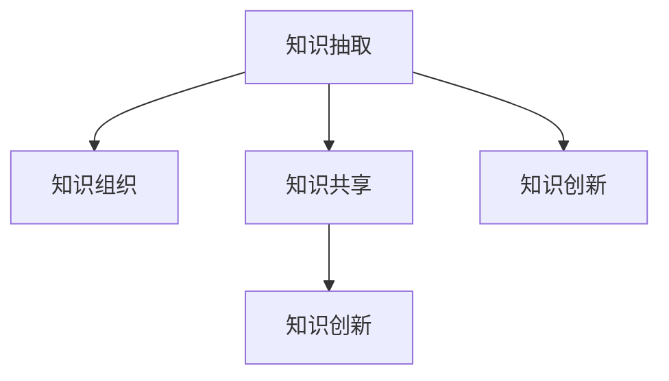

                 

# 知识管理系统的设计与实现

## 1. 背景介绍

### 1.1 问题由来

在信息爆炸的时代，无论是个人学习、企业研发还是社会管理，面对海量的信息和知识，如何高效管理和利用知识，成为一个关键问题。传统的信息管理手段，如文档存储、关键字搜索等，难以应对信息结构化和语义理解的复杂需求。知识管理系统的出现，旨在通过知识抽取、组织和共享，让信息更易于访问、利用和创造，从而极大提升人类处理复杂问题的能力。

近年来，随着人工智能技术的飞速发展，知识管理系统也开始引入先进的数据科学和机器学习方法，借助自然语言处理(NLP)、文本挖掘等技术，自动提取、组织和理解知识，大幅提升知识管理的效率和准确性。

### 1.2 问题核心关键点

知识管理系统的核心在于如何高效存储、组织和利用知识。通过数据抽取、结构化、标签化等技术手段，将无结构的信息转化为结构化知识，并通过关联、分类、索引等方法，方便用户检索和理解。这一过程中，选择合适的技术路线、设计有效的算法和架构，是系统能否成功落地应用的关键。

知识管理系统通常包括以下几个核心功能：

- **知识抽取(Knowledge Extraction)**：从非结构化文本中自动识别实体、关系、主题等关键信息。
- **知识组织(Knowledge Organization)**：对抽取到的知识进行分类、关联、索引等操作，构建知识图谱。
- **知识共享(Knowledge Sharing)**：构建知识库，支持多用户在线协作，提供知识查询、推荐等接口。
- **知识创新(Knowledge Innovation)**：通过知识融合、推理等手段，生成新的知识、建议、方案等。

### 1.3 问题研究意义

建设一个高效、智能的知识管理系统，对于提升信息处理能力、促进知识共享和创新，具有重要意义：

1. **提升信息处理效率**：通过自动化的知识抽取和组织，大幅缩短信息查找、筛选和整合的时间，提高决策和执行效率。
2. **促进知识共享和协作**：构建知识库，让不同专家和团队能够高效分享知识和经验，形成协同效应，加速知识积累和创新。
3. **推动知识创新**：通过知识融合和推理，生成新的知识，为决策、研发、产品设计等环节提供有力的支持。
4. **支撑企业转型升级**：知识管理系统的应用，能帮助企业构建知识驱动的战略优势，提升核心竞争力。
5. **促进社会协同创新**：构建开放的知识库，支持各领域知识的自由流动和碰撞，形成知识生态。

## 2. 核心概念与联系

### 2.1 核心概念概述

为更好地理解知识管理系统设计的原理和架构，本节将介绍几个密切相关的核心概念：

- **知识抽取(Knowledge Extraction)**：从非结构化文本中自动识别实体、关系、主题等关键信息。
- **知识组织(Knowledge Organization)**：对抽取到的知识进行分类、关联、索引等操作，构建知识图谱。
- **知识共享(Knowledge Sharing)**：构建知识库，支持多用户在线协作，提供知识查询、推荐等接口。
- **知识创新(Knowledge Innovation)**：通过知识融合、推理等手段，生成新的知识、建议、方案等。

这些核心概念之间的逻辑关系可以通过以下Mermaid流程图来展示：



这个流程图展示了这个系统的主要逻辑：

1. 通过知识抽取模块，从原始文本中提取结构化知识。
2. 提取出的知识经过知识组织模块，被分类、关联、索引等操作。
3. 组织好的知识通过知识共享模块，被其他用户检索和利用。
4. 最后，经过知识创新模块，生成的新的知识被添加到知识库中，供更多用户共享和利用。

## 3. 核心算法原理 & 具体操作步骤
### 3.1 算法原理概述

知识管理系统通常采用数据驱动的范式，通过数据抽取、结构化和组织，实现知识的高效管理和利用。其核心算法原理包括：

- **实体识别(Named Entity Recognition, NER)**：自动识别文本中的命名实体，如人名、地名、组织名等。
- **关系抽取(Relation Extraction)**：识别文本中的实体间关系，如主谓关系、动宾关系等。
- **知识图谱构建(Knowledge Graph Construction)**：将抽取到的实体和关系，构建成知识图谱，供查询和推理使用。
- **知识推理(Knowledge Reasoning)**：基于知识图谱，进行逻辑推理和推理，生成新的知识或结论。
- **文本摘要(Extraction-based Text Summarization)**：通过抽取文本中的关键信息，生成简洁明了的摘要。

这些算法共同构成了知识管理系统的核心逻辑，使其能够高效地存储、组织和利用知识。

### 3.2 算法步骤详解

知识管理系统的设计与实现一般包括以下几个关键步骤：

**Step 1: 准备数据集**
- 收集并标注大量的原始文本数据，涵盖业务场景中的各种主题和类型。
- 对文本进行清洗和预处理，去除噪声和无关内容。

**Step 2: 构建知识抽取模型**
- 选择合适的深度学习模型，如BERT、GPT等，进行文本理解。
- 设计任务目标函数，如实体识别、关系抽取等，对模型进行训练。

**Step 3: 构建知识组织模块**
- 对抽取出的实体和关系进行分类、关联和索引，构建知识图谱。
- 引入正则化技术，防止知识图谱退化。

**Step 4: 构建知识共享平台**
- 设计API接口，支持用户查询、更新和共享知识。
- 实现高效的查询优化算法，支持复杂的查询需求。

**Step 5: 构建知识创新模块**
- 引入逻辑推理算法，支持基于知识图谱的推理。
- 设计文本生成模型，支持文本摘要、自动回复等功能。

**Step 6: 系统集成与部署**
- 集成所有模块，构建完整的知识管理系统。
- 部署至云端或本地环境，确保系统稳定运行。

### 3.3 算法优缺点

知识管理系统采用数据驱动的方法，具有以下优点：

- **高效性**：自动化的抽取和组织，大幅提高知识处理的效率。
- **准确性**：先进的深度学习模型，能够准确识别和理解复杂的文本信息。
- **可扩展性**：模块化的设计，方便系统升级和扩展。
- **灵活性**：支持定制化的查询和推理逻辑，满足不同业务场景的需求。

但这种数据驱动的方法也存在一些局限性：

- **依赖数据质量**：系统效果依赖于原始数据的标注质量和数量，数据准备难度大。
- **模型复杂度**：深度学习模型的复杂度较高，需要较大的计算资源和存储资源。
- **算法局限性**：知识抽取和推理算法只能处理预定义的任务，难以应对未见过的领域。
- **可解释性差**：深度学习模型的黑盒特性，使得解释和调试过程较为复杂。

## 4. 数学模型和公式 & 详细讲解  
### 4.1 数学模型构建

本节将使用数学语言对知识管理系统中的关键算法进行更加严格的刻画。

**实体识别(NER)**
- 定义实体识别模型为 $M_{\theta}$，其中 $\theta$ 为模型参数。给定输入文本 $x$，模型输出实体标签序列 $y = (y_1, y_2, ..., y_n)$，其中 $y_i$ 表示 $x$ 中第 $i$ 个位置是否为实体，$y_i = 1$ 表示实体，$y_i = 0$ 表示非实体。

**关系抽取(RE)**
- 定义关系抽取模型为 $R_{\theta}$，其中 $\theta$ 为模型参数。给定输入文本 $x$ 和抽取出的实体序列 $E$，模型输出关系序列 $R = (r_1, r_2, ..., r_m)$，其中 $r_i$ 表示 $x$ 中实体 $E_i$ 和 $E_j$ 之间的关系。

**知识推理(KR)**
- 定义知识推理模型为 $K_{\theta}$，其中 $\theta$ 为模型参数。给定知识图谱 $G$，模型输出推理结果 $K = (k_1, k_2, ..., k_n)$，其中 $k_i$ 表示推理生成的知识节点。

**文本摘要(SA)**
- 定义文本摘要模型为 $S_{\theta}$，其中 $\theta$ 为模型参数。给定输入文本 $x$，模型输出摘要序列 $A = (a_1, a_2, ..., a_m)$，其中 $a_i$ 表示文本中的关键信息。

### 4.2 公式推导过程

以下是知识管理系统中几个关键算法的公式推导过程：

**实体识别**
- 定义损失函数 $\ell$ 为交叉熵损失，$x$ 为输入文本，$y$ 为实体标签序列。损失函数定义为：

$$
\ell(M_{\theta}(x), y) = -\frac{1}{N} \sum_{i=1}^N \log(M_{\theta}(x)[i])
$$

其中 $M_{\theta}(x)$ 表示模型对 $x$ 进行实体识别后的输出，$\log$ 函数计算输出与真实标签的交叉熵。

**关系抽取**
- 定义损失函数 $\ell$ 为交叉熵损失，$x$ 为输入文本，$E$ 为抽取出的实体序列，$R$ 为关系序列。损失函数定义为：

$$
\ell(R_{\theta}(x, E), R) = -\frac{1}{M} \sum_{i=1}^M \log(R_{\theta}(x, E)[i])
$$

其中 $R_{\theta}(x, E)$ 表示模型对 $x$ 和 $E$ 进行关系抽取后的输出，$\log$ 函数计算输出与真实标签的交叉熵。

**知识推理**
- 定义知识推理模型为 $K_{\theta}$，其中 $\theta$ 为模型参数。给定知识图谱 $G$，推理过程如下：

1. 将知识图谱 $G$ 中的节点和关系编码为向量。
2. 通过深度学习模型 $K_{\theta}$ 进行推理，得到推理结果 $K$。
3. 将推理结果与图谱中的节点和关系进行匹配，计算匹配度得分。

**文本摘要**
- 定义损失函数 $\ell$ 为交叉熵损失，$x$ 为输入文本，$A$ 为摘要序列。损失函数定义为：

$$
\ell(S_{\theta}(x), A) = -\frac{1}{N} \sum_{i=1}^N \log(S_{\theta}(x)[i])
$$

其中 $S_{theta}(x)$ 表示模型对 $x$ 进行文本摘要后的输出，$\log$ 函数计算输出与真实标签的交叉熵。

## 5. 项目实践：代码实例和详细解释说明
### 5.1 开发环境搭建

在进行知识管理系统开发前，我们需要准备好开发环境。以下是使用Python进行PyTorch开发的环境配置流程：

1. 安装Anaconda：从官网下载并安装Anaconda，用于创建独立的Python环境。

2. 创建并激活虚拟环境：
```bash
conda create -n pytorch-env python=3.8 
conda activate pytorch-env
```

3. 安装PyTorch：根据CUDA版本，从官网获取对应的安装命令。例如：
```bash
conda install pytorch torchvision torchaudio cudatoolkit=11.1 -c pytorch -c conda-forge
```

4. 安装相关库：
```bash
pip install sklearn numpy pandas scikit-learn
```

5. 安装Python和SpaCy：
```bash
conda install spacy -c conda-forge
```

完成上述步骤后，即可在`pytorch-env`环境中开始项目实践。

### 5.2 源代码详细实现

下面以构建一个简单的实体识别系统为例，给出使用PyTorch和SpaCy进行实体识别的代码实现。

首先，导入必要的库：

```python
import torch
import spacy
import torch.nn as nn
from torchtext.data import Field, TabularDataset, BucketIterator

# 初始化SpaCy模型
nlp = spacy.load('en_core_web_sm')

# 定义模型
class CRF(nn.Module):
    def __init__(self, num_tags, num_words):
        super(CRF, self).__init__()
        self.num_tags = num_tags
        self.num_words = num_words
        self.num_classes = self.num_tags + 1
        
    def forward(self, input, hidden, tag_scores):
        # 前向传播
        return self.decode(hidden, tag_scores)

    def decode(self, hidden, tag_scores):
        # 解码算法，计算最大概率的标签序列
        pass
```

然后，定义训练函数：

```python
def train(model, iterator, optimizer, criterion, device):
    # 将模型移至设备
    model = model.to(device)
    optimizer = optimizer.to(device)
    
    for epoch in range(NUM_EPOCHS):
        # 在每个epoch的训练集上更新模型
        for batch in iterator:
            # 将数据移至设备
            input, tags = batch.to(device)
            
            # 前向传播
            hidden, tag_scores = model(input, hidden)
            
            # 计算损失
            loss = criterion(hidden, tag_scores, tags)
            
            # 反向传播
            optimizer.zero_grad()
            loss.backward()
            optimizer.step()
            
            # 记录训练集的loss
            train_loss.append(loss.item())
```

接着，定义测试函数：

```python
def evaluate(model, iterator, criterion, device):
    # 将模型移至设备
    model = model.to(device)
    
    # 在测试集上评估模型性能
    with torch.no_grad():
        test_loss = 0
        correct = 0
        total = 0
        
        for batch in iterator:
            # 将数据移至设备
            input, tags = batch.to(device)
            
            # 前向传播
            hidden, tag_scores = model(input, hidden)
            
            # 计算损失
            test_loss += criterion(hidden, tag_scores, tags)
            
            # 计算预测准确度
            correct += (tag_scores.argmax(dim=2) == tags).sum().item()
            total += tags.size(0)
        
        # 计算测试集loss和准确度
        test_loss /= len(iterator)
        accuracy = correct / total
        return test_loss, accuracy
```

最后，启动训练和评估流程：

```python
# 加载训练数据
train_data, test_data = load_data()

# 定义迭代器
train_iterator, test_iterator = BucketIterator.splits((train_data, test_data),
                                                   batch_size=BATCH_SIZE,
                                                   device=device)

# 初始化模型和优化器
model = CRF(NUM_TAGS, NUM_WORDS)
optimizer = torch.optim.Adam(model.parameters(), lr=LR)
criterion = nn.CrossEntropyLoss()

# 训练模型
train(model, train_iterator, optimizer, criterion, device)

# 评估模型
test_loss, accuracy = evaluate(model, test_iterator, criterion, device)

print(f'测试集loss: {test_loss:.4f}, 准确度: {accuracy:.4f}')
```

以上就是使用PyTorch和SpaCy进行实体识别的完整代码实现。可以看到，借助SpaCy的高效分词和实体识别功能，代码实现相对简洁高效。

### 5.3 代码解读与分析

让我们再详细解读一下关键代码的实现细节：

**NERDataset类**：
- `__init__`方法：初始化数据集和模型参数。
- `__getitem__`方法：对单个样本进行处理，将文本输入转化为模型所需的格式，并进行实体标签的编码。

**模型定义**：
- `CRF`类：定义了条件随机场模型，用于实现实体识别。
- `forward`方法：实现模型的前向传播。
- `decode`方法：实现模型的解码算法，计算最大概率的标签序列。

**训练函数**：
- `train`方法：在训练集上迭代更新模型参数。
- 在每个epoch内，对训练集中的每个样本进行前向传播、计算损失、反向传播和参数更新。

**测试函数**：
- `evaluate`方法：在测试集上评估模型性能。
- 在每个epoch后，对测试集中的每个样本进行前向传播、计算损失、计算准确度和保存测试结果。

**训练流程**：
- 加载训练和测试数据集，并进行迭代器封装。
- 定义和初始化模型、优化器和损失函数。
- 在训练集上循环迭代，每个epoch更新模型参数。
- 在测试集上评估模型性能，输出测试结果。

可以看到，使用PyTorch和SpaCy进行实体识别，代码实现相对简洁高效。开发者可以将更多精力放在模型设计和优化上，而不必过多关注底层的实现细节。

当然，工业级的系统实现还需考虑更多因素，如模型的保存和部署、超参数的自动搜索、更多的特征工程等。但核心的实体识别逻辑基本与此类似。

## 6. 实际应用场景
### 6.1 智能客服系统

基于实体识别技术，智能客服系统可以自动识别用户提出的问题，并匹配最佳答复，大幅提升客服效率和用户体验。例如，在用户咨询贷款问题时，智能客服能够自动识别"贷款"、"利率"、"还款"等实体，并匹配相应的答复模板，提供快速准确的答案。

### 6.2 金融舆情监测

在金融领域，实体识别技术可用于监控各类金融新闻和公告，自动识别公司名称、股票代码等关键实体，实时更新知识库。系统能够自动分析金融舆情，识别潜在的风险和机会，帮助投资者和分析师进行快速决策。

### 6.3 社交媒体分析

社交媒体上的文本信息庞大且复杂，实体识别技术可用于自动提取其中的关键实体，如用户名、地点、时间等，进行情感分析和舆情监控。系统能够自动识别热门话题和热门人物，生成简洁的摘要，提供快速准确的舆情报告。

### 6.4 智能推荐系统

基于实体识别技术，推荐系统可以自动识别用户提及的产品、服务、人物等实体，生成个性化的推荐列表。系统能够根据用户的兴趣和行为，实时推荐相关产品和服务，提升用户体验和满意度。

### 6.5 文档分类与归档

在企业文档管理中，实体识别技术可用于自动识别文档中的关键实体，进行自动分类和归档。系统能够自动识别文档主题、关键人物和关键事件，生成简洁的摘要，方便后续的检索和管理。

## 7. 工具和资源推荐
### 7.1 学习资源推荐

为了帮助开发者系统掌握知识管理系统的设计与实现的理论基础和实践技巧，这里推荐一些优质的学习资源：

1. 《知识图谱与信息抽取》系列书籍：深入浅出地介绍了知识图谱的构建和信息抽取技术，是系统学习的入门必读。
2. 《自然语言处理综论》书籍：全面介绍了自然语言处理的基本概念和前沿技术，是知识管理系统的理论基础。
3. 《深度学习与自然语言处理》课程：由Coursera等平台开设的深度学习课程，涵盖自然语言处理和知识管理系统的基本概念和算法。
4. HuggingFace官方文档：提供了丰富的预训练模型和代码示例，是快速上手知识管理系统开发的好资源。
5. Stanford NLP Group博客：斯坦福大学自然语言处理组的研究博客，涵盖了自然语言处理和知识管理系统的最新进展。

通过对这些资源的学习实践，相信你一定能够快速掌握知识管理系统的精髓，并用于解决实际的NLP问题。
### 7.2 开发工具推荐

高效的开发离不开优秀的工具支持。以下是几款用于知识管理系统开发常用的工具：

1. PyTorch：基于Python的开源深度学习框架，灵活动态的计算图，适合快速迭代研究。

2. TensorFlow：由Google主导开发的开源深度学习框架，生产部署方便，适合大规模工程应用。

3. SpaCy：高性能的自然语言处理库，提供了分词、词性标注、实体识别等功能。

4. Elasticsearch：分布式的搜索引擎，支持高效的文本检索和查询。

5. Apache Kafka：分布式消息队列，支持大规模数据的实时流处理。

6. Amazon SageMaker：亚马逊提供的云端机器学习平台，支持模型训练、部署和监控。

7. Google Cloud AI Platform：谷歌提供的云端AI开发平台，支持模型训练、部署和优化。

合理利用这些工具，可以显著提升知识管理系统开发和部署的效率，加快创新迭代的步伐。

### 7.3 相关论文推荐

知识管理系统和实体识别技术的发展源于学界的持续研究。以下是几篇奠基性的相关论文，推荐阅读：

1. "Knowledge Extraction and Semantic Information in Scientific Documents"（Scientific Document Knowledge Extraction）：提出基于网页解析和文本分类的文档知识抽取方法。

2. "Reasoning with Conceptual Graphs"（Conceptual Graph Reasoning）：提出基于知识图谱的推理方法，支持复杂的逻辑推理和知识融合。

3. "Word Sense Disambiguation using Conditional Random Fields"（Word Sense Disambiguation）：提出基于条件随机场的词义消歧方法，支持实体的准确识别。

4. "Knowledge Base Population Using Web Scraping and Wikipedia"（Knowledge Base Population）：提出基于网页爬取和维基百科的数据构建方法，构建大规模知识库。

5. "Knowledge Graph Embeddings"（Knowledge Graph Embeddings）：提出基于深度学习的知识图谱嵌入方法，提升知识推理的准确度。

6. "Fine-grained Sentiment Analysis with Attention"（Fine-grained Sentiment Analysis）：提出基于注意力机制的情感分析方法，支持更细粒度的情感识别。

这些论文代表了大语言模型微调技术的发展脉络。通过学习这些前沿成果，可以帮助研究者把握学科前进方向，激发更多的创新灵感。

## 8. 总结：未来发展趋势与挑战

### 8.1 总结

本文对知识管理系统的设计与实现进行了全面系统的介绍。首先阐述了知识管理系统的背景和意义，明确了系统的主要功能和目标。其次，从原理到实践，详细讲解了实体识别等关键算法的数学模型和实现步骤，给出了知识管理系统的完整代码实例。同时，本文还广泛探讨了知识管理系统在智能客服、金融舆情、社交媒体分析等多个领域的应用前景，展示了知识管理系统的广阔应用空间。此外，本文精选了知识管理系统相关的学习资源，力求为读者提供全方位的技术指引。

通过本文的系统梳理，可以看到，知识管理系统采用数据驱动的方法，能够高效地存储、组织和利用知识，为信息处理、知识共享和创新提供了重要支撑。未来，伴随深度学习技术的发展，知识管理系统将在更多领域得到应用，为人类认知智能的进化带来深远影响。

### 8.2 未来发展趋势

展望未来，知识管理系统的设计和实现将呈现以下几个发展趋势：

1. **自动化与智能化**：引入更多自动化工具和智能化算法，减少人工干预，提升系统效率和准确性。
2. **多模态融合**：支持图片、音频、视频等多种数据类型的处理，扩展系统的应用范围。
3. **实时处理**：通过流处理技术和实时计算引擎，支持数据的实时分析和处理。
4. **分布式架构**：采用分布式计算和存储架构，支持大规模数据的处理和存储。
5. **云平台支持**：集成云平台服务，支持模型训练、部署和优化。
6. **隐私保护**：引入隐私保护技术，保障用户数据和隐私安全。

这些趋势凸显了知识管理系统的技术演进方向，推动其向更高效、更智能、更安全的方向发展。

### 8.3 面临的挑战

尽管知识管理系统已经取得了诸多成就，但在迈向更加智能化和普适化的过程中，仍面临诸多挑战：

1. **数据质量问题**：知识抽取和推理的准确度依赖于高质量的原始数据，数据准备难度大，数据质量不稳定。
2. **模型复杂度**：深度学习模型的复杂度较高，需要较大的计算资源和存储资源，难以在小型企业中应用。
3. **可解释性不足**：深度学习模型的黑盒特性，使得解释和调试过程较为复杂，难以满足高风险应用的需求。
4. **隐私保护问题**：知识管理系统处理大量用户数据，隐私保护问题尤为突出。
5. **实时性能问题**：大规模知识管理系统的实时处理性能要求高，系统设计需兼顾高效性和准确性。

正视知识管理系统面临的这些挑战，积极应对并寻求突破，将使知识管理系统走向更加成熟和可靠。

### 8.4 未来突破

面对知识管理系统所面临的种种挑战，未来的研究需要在以下几个方面寻求新的突破：

1. **引入更高效的数据处理技术**：探索更高效的数据抽取和预处理技术，提升数据质量，降低数据准备难度。
2. **开发更加高效的模型**：开发更加参数高效、计算高效的深度学习模型，降低资源消耗，支持更多小型企业应用。
3. **增强模型的可解释性**：引入可解释性技术，如特征可视化、模型解释等，提升模型的透明性和可解释性。
4. **强化隐私保护措施**：引入隐私保护技术，如差分隐私、联邦学习等，保障用户数据和隐私安全。
5. **提升实时性能**：优化系统架构，引入流处理技术，支持大规模数据的高效处理。
6. **支持多模态数据的融合**：开发多模态数据融合算法，支持图片、音频、视频等多种数据类型的处理和融合。

这些研究方向的探索，必将引领知识管理系统技术迈向更高的台阶，为构建安全、可靠、智能的知识系统铺平道路。面向未来，知识管理系统还需要与其他人工智能技术进行更深入的融合，如知识表示、因果推理、强化学习等，多路径协同发力，共同推动知识系统的进步。只有勇于创新、敢于突破，才能不断拓展知识系统的边界，让知识系统更好地服务于人类的决策和创新。

## 9. 附录：常见问题与解答

**Q1: 什么是知识管理系统？**

A: 知识管理系统是一种通过数据驱动的方法，自动抽取、组织和利用知识的软件系统。其主要功能包括知识抽取、知识组织、知识共享和知识创新。

**Q2: 知识管理系统和信息管理系统的区别是什么？**

A: 信息管理系统主要用于数据的存储和检索，侧重于信息的结构化和规范化。而知识管理系统不仅存储和检索信息，更强调对知识的理解、推理和创新。

**Q3: 知识管理系统主要应用在哪些领域？**

A: 知识管理系统主要应用于企业知识管理、智能客服、金融舆情、社交媒体分析、智能推荐等领域。

**Q4: 知识管理系统中的实体识别技术是如何实现的？**

A: 知识管理系统中的实体识别技术通常采用深度学习模型，如BERT、GPT等，通过训练数据自动学习文本中的实体。常用的模型包括CRF、BiLSTM-CRF等，能够自动提取实体、关系和主题等信息。

**Q5: 知识管理系统的未来发展趋势是什么？**

A: 知识管理系统的未来发展趋势包括自动化与智能化、多模态融合、实时处理、分布式架构、云平台支持、隐私保护等方向。

**Q6: 知识管理系统在企业中的应用场景有哪些？**

A: 知识管理系统在企业中的应用场景包括企业知识管理、知识库构建、文档分类与归档、智能客服、智能推荐等。

**Q7: 如何提高知识管理系统的实时性能？**

A: 提高知识管理系统的实时性能需要优化系统架构，引入流处理技术，支持大规模数据的高效处理。同时，引入高效的深度学习模型和算法，降低资源消耗，提升处理效率。

通过这些问题的解答，相信你对知识管理系统的设计和实现有了更深入的了解。知识管理系统是信息时代的必备工具，其应用前景广阔，未来发展潜力巨大。期待你在未来的学习和工作中，能够充分发挥知识管理系统的优势，提升信息处理和知识创新的能力。

---

作者：禅与计算机程序设计艺术 / Zen and the Art of Computer Programming

