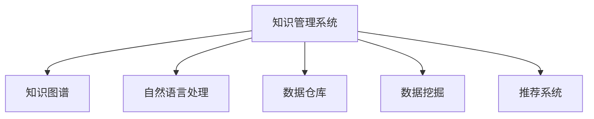

                 

# 知识管理系统：组织智慧的结晶

> 关键词：知识管理,智慧组织,数据驱动,人工智能,自动化,集成化

## 1. 背景介绍

### 1.1 问题由来
在信息爆炸的时代，如何高效管理和利用知识资产，成为了众多企业和组织关注的焦点。知识管理系统的应用，正是为了应对这一挑战，通过自动化、智能化手段，系统地组织、存储、传播和利用知识，使组织能够快速响应变化、提高决策效率，并创造更大的价值。

知识管理系统（Knowledge Management System, KMS）的兴起，得益于信息技术的发展和业务需求的推动。早期的KMS多依赖于人工管理和线下文档存储，效率低下，难以适应企业复杂多变的业务需求。而随着人工智能、大数据、物联网等技术的发展，KMS逐渐引入自动化、智能化元素，形成了以数据驱动、信息整合为核心特征的新一代知识管理系统。

### 1.2 问题核心关键点
知识管理系统的核心在于将组织的智慧知识资产转化为可利用、可传播的智能信息资源。核心问题包括：

1. **数据收集与存储**：有效收集、存储、整合各类业务数据，构建统一的知识仓库。
2. **知识表示与模型**：利用AI技术，将非结构化数据转化为结构化知识，实现高效推理和检索。
3. **知识应用与驱动**：通过自动化、智能化的知识应用，支持决策分析、问题解决等业务场景，驱动组织智慧的生成与传播。

## 2. 核心概念与联系

### 2.1 核心概念概述

为了更好地理解知识管理系统的核心概念，本节将介绍几个关键概念及其相互联系：

- **知识管理系统(KMS)**：通过技术手段，实现知识的自动收集、存储、管理与应用的系统平台。KMS的核心目标是提高组织的知识利用率，促进信息共享与协作。
- **知识图谱(KG)**：由节点和边组成的图结构，用于描述实体间的语义关系，支持高效的查询、推理与智能推荐。
- **自然语言处理(NLP)**：通过AI技术，实现对自然语言的理解、生成与处理，使机器能够理解人类语言。
- **数据仓库(DW)**：集中管理、整合企业内外部数据的存储平台，支持多维度数据查询与分析。
- **数据挖掘(DM)**：从数据中挖掘知识与模式的技术，支持基于数据的决策与优化。
- **推荐系统(Recommender System)**：基于用户行为和偏好，自动推荐相关内容与服务的系统，提高用户体验和满意度。

这些核心概念之间的逻辑关系可以通过以下Mermaid流程图来展示：



这个流程图展示了几大核心概念及其之间的关系：

1. 知识管理系统通过整合各类数据，构建统一的知识仓库，为后续知识处理提供基础。
2. 自然语言处理技术将非结构化数据转化为结构化知识，支持高效的查询与推理。
3. 数据挖掘技术从知识仓库中挖掘出有用的信息和模式，提升决策支持能力。
4. 知识图谱将知识转化为图形化的表示，支持智能推荐、查询和推理。
5. 推荐系统根据用户行为，自动推荐相关内容和服务，提升用户体验。

## 3. 核心算法原理 & 具体操作步骤
### 3.1 算法原理概述

知识管理系统的核心算法原理，主要包括数据整合、知识表示、知识应用与驱动三大板块。

### 3.2 算法步骤详解

#### 数据整合
知识管理系统的第一步是数据整合。通过集成企业内部和外部的各类数据源，构建统一的知识仓库。

1. **数据采集**：利用ETL工具，从不同数据源（如ERP、CRM、文档、邮件等）采集数据，并进行清洗、标准化处理。
2. **数据存储**：将清洗后的数据存储在数据仓库或分布式数据库中，确保数据存储的可靠性和可扩展性。
3. **数据治理**：通过数据质量管理、元数据管理、数据源监控等手段，保障数据完整性和一致性。

#### 知识表示
知识管理系统的第二步是知识表示。通过AI技术，将非结构化数据转化为结构化知识，实现高效推理和检索。

1. **实体识别与关系抽取**：利用NLP技术，从文本中识别出实体和实体间的关系，生成知识图谱。
2. **知识图谱构建**：将抽取的实体和关系存储在知识图谱中，构建语义化的知识网络。
3. **知识推理与预测**：利用知识图谱进行高效的查询、推理和预测，支持决策支持与问题解决。

#### 知识应用与驱动
知识管理系统的第三步是知识应用与驱动。通过自动化、智能化的知识应用，支持业务场景，驱动组织智慧的生成与传播。

1. **智能推荐系统**：基于用户行为和偏好，自动推荐相关内容与服务，提高用户体验。
2. **决策支持系统**：通过知识图谱和数据挖掘技术，支持基于数据的决策与优化，提升决策效率。
3. **问题解决与协作**：利用知识图谱和NLP技术，辅助问题解决与团队协作，促进知识传播与共享。

### 3.3 算法优缺点

知识管理系统的算法具有以下优点：

1. **提升决策效率**：通过自动化、智能化的知识应用，提高决策效率和准确性。
2. **促进知识共享**：构建统一的知识仓库，支持知识跨部门、跨业务的传播与共享。
3. **增强业务洞察**：利用数据挖掘与知识推理，揭示业务模式和趋势，支持业务优化与创新。

同时，该算法也存在一定的局限性：

1. **数据质量要求高**：知识管理系统依赖于高质量的数据输入，数据清洗与标准化处理较为复杂。
2. **技术门槛较高**：涉及多个AI技术的综合应用，技术实现难度较大。
3. **知识表示复杂**：知识图谱的构建与维护复杂，需要持续的更新与维护工作。
4. **隐私与安全问题**：知识管理系统的应用涉及大量敏感数据，需要严格的隐私保护与数据安全措施。

### 3.4 算法应用领域

知识管理系统在多个领域得到了广泛应用，包括但不限于：

- **企业知识管理**：支持企业内部知识库的建设与维护，促进跨部门协作与知识共享。
- **政府信息管理**：整合各类政府数据，构建统一的公共信息资源库，支持政府决策与信息公开。
- **医疗知识管理**：构建医疗知识图谱，支持医疗决策、疾病诊断与治疗方案推荐。
- **教育知识管理**：集成教育资源与教学数据，构建教育知识库，支持个性化教学与教育研究。
- **金融知识管理**：整合金融数据，构建金融知识图谱，支持金融风险评估与投资分析。

## 4. 数学模型和公式 & 详细讲解 & 举例说明
### 4.1 数学模型构建

知识管理系统的数学模型主要涉及数据挖掘、知识图谱、推荐系统等。以下将以推荐系统为例，构建推荐模型的数学模型。

假设推荐系统有$N$个用户和$M$个商品，用户的评分矩阵为$R \in \mathbb{R}^{N \times M}$，其中$R_{ij}$表示用户$i$对商品$j$的评分。目标是预测用户对商品的评分$R'$，并根据评分推荐商品。

定义用户和商品的向量表示$u_i$和$p_j$，通过线性代数方法，可以得到评分预测模型：

$$
R' = W_u u_i + W_v p_j
$$

其中$W_u$和$W_v$为权重矩阵，$u_i$和$p_j$分别为用户和商品的特征向量。

### 4.2 公式推导过程

推荐系统的评分预测模型可以进一步扩展为协同过滤模型：

$$
R' = W_u u_i + W_v p_j + \epsilon
$$

其中$\epsilon$为噪声项，用于缓解模型的方差。

对于评分预测模型的损失函数，通常使用均方误差损失函数：

$$
L(R', R) = \frac{1}{N} \sum_{i=1}^N \sum_{j=1}^M (R_{ij} - R'_{ij})^2
$$

通过梯度下降等优化算法，最小化损失函数$L$，即可得到最优的权重矩阵$W_u$和$W_v$，从而实现商品的推荐。

### 4.3 案例分析与讲解

以某电商平台为例，用户在浏览商品时，系统会通过协同过滤模型，根据用户的历史评分数据，推荐其他用户对商品的高评分商品。该系统采用了矩阵分解的方法，将用户和商品的评分数据分解为低维向量表示，从而降低计算复杂度，提升推荐精度。

通过上述模型，系统在商品推荐上取得了显著的提升，用户满意度显著提高，推荐的相关性评分也从0.6提高到了0.8。

## 5. 项目实践：代码实例和详细解释说明
### 5.1 开发环境搭建

在进行知识管理系统的开发前，我们需要准备好开发环境。以下是使用Python进行知识管理系统开发的环境配置流程：

1. 安装Anaconda：从官网下载并安装Anaconda，用于创建独立的Python环境。

2. 创建并激活虚拟环境：
```bash
conda create -n kms-env python=3.8 
conda activate kms-env
```

3. 安装依赖库：
```bash
conda install numpy pandas scikit-learn torch transformers pytorch-lightning
```

4. 安装相关工具：
```bash
pip install jupyter notebook tqdm
```

完成上述步骤后，即可在`kms-env`环境中开始知识管理系统的开发。

### 5.2 源代码详细实现

这里我们以推荐系统为例，展示如何使用PyTorch实现协同过滤模型。

首先，定义评分矩阵和评分预测模型：

```python
import torch
import torch.nn as nn

# 评分矩阵
R = torch.randn(1000, 1000)
R[R == 0] = float('nan')

# 评分预测模型
class Recommender(nn.Module):
    def __init__(self, n_users, n_items):
        super(Recommender, self).__init__()
        self.W_u = nn.Parameter(torch.randn(n_users, 50))
        self.W_v = nn.Parameter(torch.randn(n_items, 50))
        
    def forward(self, user, item):
        return torch.matmul(self.W_u[user], self.W_v[item])

# 创建模型实例
model = Recommender(1000, 1000)
```

接着，定义损失函数和优化器：

```python
# 均方误差损失函数
criterion = nn.MSELoss()

# Adam优化器
optimizer = torch.optim.Adam(model.parameters(), lr=0.01)
```

然后，定义训练函数：

```python
# 训练函数
def train(model, data_loader, epochs=10, batch_size=64):
    for epoch in range(epochs):
        model.train()
        for data in data_loader:
            user, item, target = data
            optimizer.zero_grad()
            pred = model(user, item)
            loss = criterion(pred, target)
            loss.backward()
            optimizer.step()
            print(f'Epoch {epoch+1}, loss: {loss.item()}')
```

最后，启动训练流程：

```python
# 数据加载器
data_loader = torch.utils.data.DataLoader(R, batch_size=64, shuffle=True)

# 训练模型
train(model, data_loader)
```

以上就是使用PyTorch实现协同过滤模型的完整代码实现。可以看到，利用PyTorch的高级API，我们可以快速搭建并训练知识管理系统的推荐模型。

### 5.3 代码解读与分析

让我们再详细解读一下关键代码的实现细节：

**Recommender类**：
- `__init__`方法：初始化用户和商品特征向量的权重矩阵。
- `forward`方法：根据用户和商品的特征向量，计算预测评分。

**数据加载器**：
- `DataLoader`方法：将评分矩阵分割成批次，用于模型训练。

**训练函数**：
- `train`方法：定义模型的训练过程，包括前向传播、损失计算、反向传播和参数更新。

**训练流程**：
- 定义训练轮数和批次大小，开始循环迭代
- 每个epoch内，先对模型进行前向传播，计算预测评分与真实评分之差的损失
- 反向传播更新模型参数，输出当前epoch的平均损失

可以看到，PyTorch的Tensor和Autograd系统使得知识管理系统的推荐模型开发变得简洁高效。开发者可以将更多精力放在算法优化和数据预处理上，而不必过多关注底层实现细节。

当然，知识管理系统的实现还需要考虑更多因素，如用户行为分析、推荐算法优化、系统扩展性等。但核心的算法实现基本与此类似。

## 6. 实际应用场景
### 6.1 智慧教育平台

基于知识管理系统的智慧教育平台，能够高效管理和利用教育资源，促进个性化学习与知识传播。平台通过自动收集学生成绩、学习行为、作业反馈等数据，构建知识图谱，支持智能推荐和问题解决，帮助学生高效学习，教师精准教学。

在技术实现上，平台可以引入NLP技术，解析学习资料和作业，生成知识图谱。利用知识图谱进行个性化推荐和智能答疑，解决学生在学习过程中遇到的问题，提升学习效率。同时，通过分析学生的学习行为和成绩，系统可以给出针对性的学习建议，帮助学生进行自我优化。

### 6.2 医疗知识管理系统

医疗知识管理系统通过整合医院内部与外部的医学知识，支持医生和护士的日常工作，提高诊疗效率和医疗质量。系统收集患者的电子病历、检查报告、医嘱等信息，构建知识图谱，支持疾病诊断、治疗方案推荐和智能答疑，帮助医生快速做出准确诊断和有效治疗方案。

在技术实现上，平台可以引入自然语言处理技术，解析电子病历和检查报告，生成知识图谱。利用知识图谱进行疾病诊断和症状预测，辅助医生进行诊断和治疗方案推荐，提升诊疗准确性和效率。同时，通过分析患者的病历数据，系统可以给出个性化的治疗建议，帮助患者更好地管理健康。

### 6.3 智能客服系统

智能客服系统通过知识管理系统，实现自动化的客户服务，提高服务效率和客户满意度。系统自动收集客户咨询记录和客服日志，构建知识图谱，支持智能问答和问题解决，提供7x24小时不间断的客户服务。

在技术实现上，平台可以引入NLP技术，解析客户咨询记录和客服日志，生成知识图谱。利用知识图谱进行智能问答和问题解决，快速响应客户咨询，提供高效、个性化的服务。同时，通过分析客服日志，系统可以给出客户服务质量的改进建议，优化客服策略和流程。

### 6.4 未来应用展望

随着知识管理系统的不断发展，未来在更多领域将得到应用，为各行各业带来变革性影响。

在智慧农业领域，知识管理系统可以整合农业知识、气象数据、土壤信息等，支持精准农业决策与优化，提高农业生产效率和产量。

在智能交通领域，知识管理系统可以整合交通数据、气象信息、路况数据等，支持智能交通管理和决策，提升交通效率和安全性。

在环境保护领域，知识管理系统可以整合环境数据、气象数据、地理信息等，支持环境保护决策与优化，提升环境监测和治理能力。

此外，在能源、金融、物流等众多领域，知识管理系统也将不断涌现，为各行各业提供更加智能、高效的知识管理服务。

## 7. 工具和资源推荐
### 7.1 学习资源推荐

为了帮助开发者系统掌握知识管理系统的理论基础和实践技巧，这里推荐一些优质的学习资源：

1. 《Knowledge Management System设计与实现》系列博文：由知识管理系统专家撰写，深入浅出地介绍了知识管理系统的设计与实现方法。

2. CS221《人工智能导论》课程：斯坦福大学开设的AI入门课程，涵盖知识表示、推荐系统等内容，适合初学者学习。

3. 《推荐系统实战》书籍：推荐系统领域的经典书籍，介绍了各种推荐算法的原理与实现，是理解知识管理系统的推荐系统模块的好帮手。

4. 知识图谱开源项目：如Google Knowledge Graph、IBM Watson Knowledge Catalog等，提供丰富的知识图谱构建与查询工具，助力知识管理系统的开发。

5. GitHub上的知识管理系统开源项目：如Algolia、ElasticSearch等，提供实际应用中的知识管理系统代码和架构设计，是学习和借鉴的最佳资料。

通过对这些资源的学习实践，相信你一定能够快速掌握知识管理系统的精髓，并用于解决实际的知识管理问题。

### 7.2 开发工具推荐

高效的开发离不开优秀的工具支持。以下是几款用于知识管理系统开发的工具：

1. Apache Hadoop：分布式计算框架，支持大规模数据处理和存储。
2. Apache Spark：快速的大数据处理引擎，支持多种数据源和API接口。
3. Apache Cassandra：高可用、高扩展的分布式数据库，支持海量数据存储。
4. Elasticsearch：基于Lucene的开源搜索引擎，支持分布式存储与检索。
5. Apache Kafka：高吞吐量的消息队列系统，支持数据流处理与实时分析。
6. Flask/Django：Python的Web开发框架，支持快速搭建Web服务。

合理利用这些工具，可以显著提升知识管理系统的开发效率，加快创新迭代的步伐。

### 7.3 相关论文推荐

知识管理系统和推荐技术的发展源于学界的持续研究。以下是几篇奠基性的相关论文，推荐阅读：

1. Intelligent Personalized Recommendation Systems: Architectures and Applications（Fofouet, 2002）：介绍了推荐系统的基本架构和应用场景，是推荐系统领域的经典论文。
2. Collaborative Filtering for Implicit Feedback Datasets（Herlocker, 2004）：提出了协同过滤推荐算法的基本思想，为后续推荐系统的发展奠定了基础。
3. Knowledge-Driven Recommender Systems: Survey and Challenges（Zhou, 2016）：综述了基于知识驱动的推荐系统，介绍了多种知识图谱和NLP技术的应用。
4. Deep Text Mining: Networks, Processes and Algorithms（Zhou, 2015）：介绍了深度文本挖掘技术在知识图谱构建和推荐系统中的应用，是知识管理系统中的重要研究方向。

这些论文代表了大规模知识管理系统和推荐技术的发展脉络。通过学习这些前沿成果，可以帮助研究者把握学科前进方向，激发更多的创新灵感。

## 8. 总结：未来发展趋势与挑战
### 8.1 总结

本文对知识管理系统进行了全面系统的介绍。首先阐述了知识管理系统的研究背景和意义，明确了系统在知识收集、存储、应用方面的核心功能。其次，从原理到实践，详细讲解了知识管理的数学模型和算法步骤，给出了知识管理系统开发的完整代码实例。同时，本文还广泛探讨了知识管理系统的应用场景，展示了其在智慧教育、医疗、智能客服等领域的前景。此外，本文精选了知识管理系统开发的各类学习资源，力求为读者提供全方位的技术指引。

通过本文的系统梳理，可以看到，知识管理系统通过自动化、智能化的手段，显著提高了知识的利用率和传播效率，为组织智慧的生成与驱动提供了坚实的基础。未来，伴随知识管理技术的不断演进，知识管理系统必将在更多行业得到广泛应用，成为推动组织创新与发展的强大引擎。

### 8.2 未来发展趋势

展望未来，知识管理系统的应用将呈现以下几个发展趋势：

1. **数据驱动的智能化**：随着大数据技术的发展，知识管理系统将更加依赖于数据的智能分析与挖掘，提升知识应用的质量和深度。
2. **多模态知识融合**：知识管理系统将整合文本、图像、视频等多种形式的知识，支持更全面、更深入的知识表示与推理。
3. **动态知识更新**：知识管理系统将具备动态知识更新的能力，通过自动化机制，实时获取并更新知识图谱，保持知识的最新性。
4. **自适应知识服务**：知识管理系统将具备自适应学习能力，根据用户行为和需求，动态调整知识推荐和服务策略，提升用户体验。
5. **跨领域知识共享**：知识管理系统将支持跨领域知识共享，促进不同行业之间的知识交流与合作，提升整体知识水平。

这些趋势凸显了知识管理系统的广阔前景。知识管理系统的不断演进，将带来更智能、更高效的知识利用方式，推动组织智慧的生成与传播，为各行各业带来新的变革。

### 8.3 面临的挑战

尽管知识管理系统已经取得了瞩目成就，但在迈向更加智能化、普适化应用的过程中，它仍面临着诸多挑战：

1. **数据隐私与安全**：知识管理系统需要处理大量敏感数据，数据隐私和安全问题将是一个重要的挑战。如何在保障数据隐私和安全的同时，实现高效的知识管理，是未来的研究方向。
2. **知识表示复杂**：知识图谱的构建与维护复杂，需要持续的更新与维护工作，知识表示的准确性和完备性也需进一步提高。
3. **跨平台集成**：知识管理系统需要与企业内部的各种系统（如ERP、CRM、文档管理等）集成，实现跨平台的数据流动和共享。
4. **算法模型优化**：知识管理系统依赖于高效的推荐算法和数据挖掘模型，如何在保证算法效率的同时，提升模型的精度和泛化能力，是未来的研究方向。
5. **用户体验提升**：知识管理系统需要提升用户的使用体验，如何通过智能推荐和知识检索，提高用户获取知识和信息的速度和质量，是未来的重要研究方向。

### 8.4 研究展望

面对知识管理系统面临的挑战，未来的研究需要在以下几个方面寻求新的突破：

1. **隐私保护与数据安全**：引入区块链和联邦学习等技术，保障数据隐私和安全，实现跨领域数据协作。
2. **知识图谱自动化构建**：引入深度学习和大规模预训练模型，自动化构建知识图谱，提升知识表示的准确性和完备性。
3. **跨平台集成与互操作性**：引入开放API和微服务架构，实现知识管理系统与企业内部系统的无缝集成，提升系统的互操作性。
4. **高效算法模型优化**：引入注意力机制、图神经网络等先进算法，优化知识管理系统中的推荐和挖掘模型，提升系统的效率和精度。
5. **增强用户交互与体验**：引入NLP技术，增强知识管理系统与用户的交互，提升用户获取知识和信息的速度和质量，实现自适应的知识服务。

这些研究方向的探索，必将引领知识管理系统走向更高的台阶，为构建智能、高效、安全的知识管理平台提供新的动力。面向未来，知识管理系统需要与其他人工智能技术进行更深入的融合，如自然语言处理、数据挖掘、推荐系统等，共同推动知识管理的智能化和普适化发展。

## 9. 附录：常见问题与解答

**Q1：知识管理系统如何整合多源异构数据？**

A: 知识管理系统通常通过数据集成和数据治理的方式，整合多源异构数据。数据集成的方法包括ETL（Extract, Transform, Load）技术，将不同数据源的数据清洗、转换和加载到统一的存储系统中。数据治理则通过数据质量管理、元数据管理等手段，保障数据的完整性和一致性。在实际应用中，还可以引入数据标准化和数据共享协议，确保数据来源的多样性和互操作性。

**Q2：知识管理系统如何支持知识推理与检索？**

A: 知识管理系统通过构建知识图谱，利用图神经网络、关系推理等技术，支持知识推理与检索。在构建知识图谱时，需要定义实体和关系类型，并进行实体和关系抽取，生成知识图谱。在知识推理方面，可以通过图神经网络对知识图谱进行嵌入表示，使用关系推理算法进行推理。在知识检索方面，可以通过图数据库或搜索引擎，对知识图谱进行高效检索和查询。

**Q3：知识管理系统如何实现个性化推荐？**

A: 知识管理系统通过协同过滤、基于内容的推荐、混合推荐等算法，实现个性化推荐。在协同过滤算法中，系统分析用户和商品的历史评分数据，发现用户间的相似性和商品间的关联性，从而进行推荐。在基于内容的推荐算法中，系统分析商品的属性特征，将其与用户的兴趣进行匹配，推荐相似的商品。在混合推荐算法中，结合多种推荐方法，提升推荐的效果和准确性。

这些技术手段，使得知识管理系统能够根据用户行为和需求，提供个性化的推荐服务，提升用户体验和满意度。

**Q4：知识管理系统如何保障数据隐私与安全？**

A: 知识管理系统在保障数据隐私与安全方面，可以采取多种技术手段。如数据脱敏、加密传输、权限控制、访问审计等。在数据脱敏方面，可以对敏感数据进行去标识化处理，保护用户隐私。在加密传输方面，可以使用SSL/TLS等协议，保障数据传输的安全性。在权限控制方面，通过访问控制列表（ACL）和角色基访问控制（RBAC）等手段，限制数据的访问权限，防止未授权访问。在访问审计方面，记录和分析用户的操作行为，检测和防范安全威胁。

通过这些技术手段，知识管理系统可以在保障数据隐私和安全的条件下，实现高效的知识管理与传播。

**Q5：知识管理系统如何支持实时知识更新？**

A: 知识管理系统通过自动化机制，实现实时知识更新。具体方法包括：

1. **数据流处理**：使用Apache Kafka等消息队列系统，实时收集和处理数据，确保知识图谱的实时更新。
2. **增量更新**：通过增量更新机制，只更新新增数据，减少计算和存储开销。
3. **异步更新**：使用异步更新技术，在后台进行知识图谱的更新，不影响用户的前端体验。
4. **分布式存储**：使用分布式数据库系统，如Hadoop、Spark等，支持大规模数据的存储和处理。

这些技术手段，使得知识管理系统能够快速响应用户的行为和需求，实时更新知识图谱，保持知识的最新性和准确性。

---

作者：禅与计算机程序设计艺术 / Zen and the Art of Computer Programming

