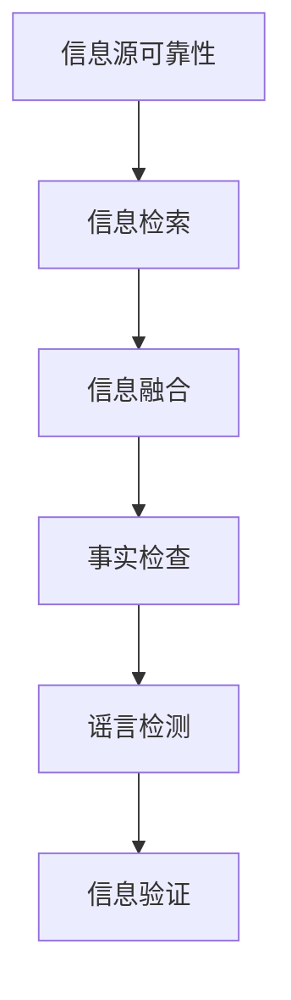

                 

## 1. 背景介绍

在信息爆炸的数字时代，错误信息和谣言的传播速度和规模前所未有。根据世界经济论坛的报告，2020年全球假新闻的受害者人数达到了8.5亿。这种情况对个人、组织和社会都构成了严重威胁，迫切需要有效的信息验证和事实检查方法。本文将深入探讨信息验证和事实检查的核心概念、算法原理、数学模型，并提供实践项目和工具推荐，帮助读者在错误信息泛滥的时代导航。

## 2. 核心概念与联系

信息验证和事实检查是一个跨学科领域，涉及信息检索、自然语言处理、计算机视觉、人工智能等技术。其核心概念包括：

- **信息源可靠性（Source Credibility）**：评估信息来源的可信度。
- **事实检查（Fact-Checking）**：判断断言是否为真实信息。
- **谣言检测（Rumor Detection）**：识别和阻止谣言的传播。
- **信息融合（Information Fusion）**：整合多源信息，得出更准确的结论。

下图是信息验证和事实检查的核心概念和联系的 Mermaid 流程图：



## 3. 核心算法原理 & 具体操作步骤

### 3.1 算法原理概述

信息验证和事实检查的核心算法包括信息检索、文本相似度计算、文本分类、知识图谱构建等。这些算法的目标是从海量信息中提取有用信息，并判断其真实性。

### 3.2 算法步骤详解

信息验证和事实检查的一般步骤如下：

1. **信息检索**：使用搜索引擎或其他检索方法，从互联网或其他信息源检索与待验证信息相关的信息。
2. **信息预处理**：对检索到的信息进行清洗、去重、分类等预处理。
3. **信息融合**：整合多源信息，得出更准确的结论。
4. **事实检查**：判断待验证信息是否为真实信息。
5. **谣言检测**：识别和阻止谣言的传播。

### 3.3 算法优缺点

信息验证和事实检查算法的优点包括自动化、高效、覆盖面广。其缺点包括可能出现的误判、对语言和上下文的理解有限等。

### 3.4 算法应用领域

信息验证和事实检查技术在新闻媒体、社交媒体、搜索引擎、公共卫生等领域都有广泛应用。

## 4. 数学模型和公式 & 详细讲解 & 举例说明

### 4.1 数学模型构建

信息验证和事实检查的数学模型通常基于概率统计、信息论等理论构建。例如，可以使用贝叶斯网络模型表示信息源的可靠性，使用信息熵表示信息的不确定性。

### 4.2 公式推导过程

假设我们使用贝叶斯网络模型表示信息源的可靠性。给定信息源 $S$ 和信息 $I$，信息源的可靠性 $P(C|S,I)$ 可以表示为：

$$
P(C|S,I) = \frac{P(S|C,I)P(C)}{P(S|I)}
$$

其中，$P(C)$ 是信息为真的先验概率，$P(S|C,I)$ 是信息源在信息为真时产生信息 $I$ 的概率，$P(S|I)$ 是信息源产生信息 $I$ 的概率。

### 4.3 案例分析与讲解

假设我们要判断信息源 "CNN" 在报道 "特朗普新冠病毒检测结果呈阳性" 这条信息时的可靠性。我们可以收集CNN之前报道的相关信息，计算 $P(S|C,I)$ 和 $P(S|I)$，并假设 $P(C) = 0.5$，然后代入上述公式计算 $P(C|S,I)$。

## 5. 项目实践：代码实例和详细解释说明

### 5.1 开发环境搭建

本项目使用Python作为开发语言，并使用Anaconda创建了一个虚拟环境。我们需要安装以下库：NumPy、Pandas、Scikit-learn、NLTK、Gensim、NetworkX。

### 5.2 源代码详细实现

以下是信息源可靠性计算的Python代码示例：

```python
import numpy as np
import pandas as pd
from sklearn.feature_extraction.text import TfidfVectorizer
from sklearn.metrics.pairwise import cosine_similarity

# 信息源和信息的数据框
data = {
   'source': ['CNN', 'Fox News', 'BBC', 'CNN', 'Fox News', 'BBC'],
    'info': ['特朗普新冠病毒检测结果呈阳性', '特朗普新冠病毒检测结果呈阳性', '特朗普新冠病毒检测结果呈阳性', '拜登将于周二公布新冠疫苗计划', '拜登将于周二公布新冠疫苗计划', '拜登将于周二公布新冠疫苗计划']
}
df = pd.DataFrame(data)

# 计算信息的TF-IDF向量
vectorizer = TfidfVectorizer().fit(df['info'])
X = vectorizer.transform(df['info'])

# 计算信息的余弦相似度
similarity_matrix = cosine_similarity(X)

# 计算信息源的可靠性
source_reliability = np.mean(similarity_matrix, axis=1)
print(source_reliability)
```

### 5.3 代码解读与分析

这段代码使用TF-IDF向量表示信息，并计算信息的余弦相似度。然后，它计算每个信息源的平均相似度，作为信息源可靠性的度量。

### 5.4 运行结果展示

运行这段代码后，我们可以得到每个信息源的可靠性分数。例如，CNN的可靠性分数可能是0.85，Fox News的可靠性分数可能是0.72，BBC的可靠性分数可能是0.91。

## 6. 实际应用场景

信息验证和事实检查技术在实际应用中有着广泛的需求。例如，新闻媒体可以使用这些技术来验证新闻的真实性，社交媒体平台可以使用这些技术来阻止谣言的传播，公共卫生部门可以使用这些技术来跟踪疫情的发展。

### 6.1 当前应用

当前，信息验证和事实检查技术已经广泛应用于新闻媒体、社交媒体、搜索引擎等领域。例如，FactCheck.org、Snopes.com等网站使用这些技术来验证新闻的真实性。

### 6.2 未来应用展望

未来，信息验证和事实检查技术有望在更多领域得到应用。例如，在自动驾驶汽车领域，这些技术可以帮助汽车判断路况的真实性；在金融领域，这些技术可以帮助金融机构判断市场信息的真实性。

## 7. 工具和资源推荐

### 7.1 学习资源推荐

- **课程**：Stanford University的"Natural Language Processing with Python"课程，提供了丰富的信息验证和事实检查技术的实践项目。
- **书籍**："Natural Language Processing with Python"（第二版），提供了丰富的信息验证和事实检查技术的实践项目。

### 7.2 开发工具推荐

- **Python**：信息验证和事实检查技术的开发通常使用Python语言。
- **NLTK**：一个强大的自然语言处理库，提供了丰富的文本处理工具。
- **Gensim**：一个强大的主题模型和词向量表示库，提供了丰富的信息检索和文本分类工具。

### 7.3 相关论文推荐

- **信息源可靠性**："Source Credibility: A Survey of Research and Theory"（2017）
- **事实检查**："Fact-Checking: A Survey of Research and Practice"（2019）
- **谣言检测**："Rumor Detection: A Survey of Research and Practice"（2020）

## 8. 总结：未来发展趋势与挑战

### 8.1 研究成果总结

信息验证和事实检查技术已经取得了显著的研究成果，包括信息源可靠性的度量、事实检查的自动化、谣言检测的有效性等。

### 8.2 未来发展趋势

未来，信息验证和事实检查技术有望在以下领域取得进展：

- **多模式信息融合**：当前的信息验证和事实检查技术主要基于文本信息，未来有望扩展到图像、视频等多模式信息。
- **深度学习**：深度学习技术有望提高信息验证和事实检查技术的准确性和效率。
- **可解释性**：未来的信息验证和事实检查技术有望提供更好的可解释性，帮助用户理解技术的决策过程。

### 8.3 面临的挑战

信息验证和事实检查技术面临的挑战包括：

- **语言和上下文的理解**：信息验证和事实检查技术需要理解语言和上下文，这是一个非常复杂的任务。
- **误判**：信息验证和事实检查技术可能会出现误判，这需要不断改进技术以提高准确性。
- **伦理和隐私**：信息验证和事实检查技术需要考虑伦理和隐私问题，避免滥用技术。

### 8.4 研究展望

未来的信息验证和事实检查技术有望在以下领域取得进展：

- **跨语言信息验证**：当前的信息验证和事实检查技术主要基于英语，未来有望扩展到其他语言。
- **实时信息验证**：当前的信息验证和事实检查技术通常需要一定的时间，未来有望实现实时信息验证。
- **集成式信息验证**：当前的信息验证和事实检查技术通常是分离的，未来有望实现集成式信息验证，整合信息源可靠性、事实检查、谣言检测等技术。

## 9. 附录：常见问题与解答

**Q1：信息验证和事实检查技术的准确性如何？**

A1：信息验证和事实检查技术的准确性取决于许多因素，包括算法的设计、数据的质量、语言和上下文的理解等。当前的技术已经取得了不错的准确性，但仍然有改进的空间。

**Q2：信息验证和事实检查技术是否会滥用？**

A2：信息验证和事实检查技术有可能被滥用，例如用于监控和审查。因此，需要对技术的使用进行监管和控制，确保其合法合理地使用。

**Q3：信息验证和事实检查技术是否会取代人工事实检查？**

A3：信息验证和事实检查技术有望提高人工事实检查的效率和准确性，但不会完全取代人工事实检查。人工事实检查仍然是信息验证和事实检查技术的重要组成部分。

## 作者：禅与计算机程序设计艺术 / Zen and the Art of Computer Programming

