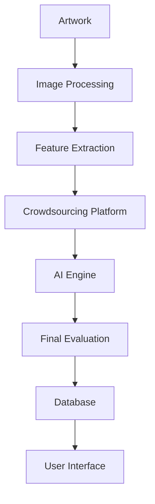

                 

**全球脑艺术品鉴定:众包专业知识的艺术评估系统**

**作者：禅与计算机程序设计艺术 / Zen and the Art of Computer Programming**

## 1. 背景介绍

在当今信息爆炸的时代，艺术品鉴定面临着前所未有的挑战。传统的专家评估系统已无法满足快速增长的需求。因此，我们需要一种新的方法，一种能够利用全球脑智慧的系统，来评估和鉴定艺术品。本文将介绍一种基于众包的艺术评估系统，它结合了人工智能、计算机视觉和人类智慧，旨在提供一种高效、准确且民主的艺术品鉴定方法。

## 2. 核心概念与联系

### 2.1 核心概念

- **Crowdsourcing**: 利用大众力量完成任务，在本系统中，大众提供艺术品评估意见。
- **Artificial Intelligence (AI)**: 用于分析和综合大众意见，并提供最终评估。
- **Computer Vision**: 用于分析艺术品图像，提取有关风格、颜色和结构等特征。

### 2.2 核心架构



## 3. 核心算法原理 & 具体操作步骤

### 3.1 算法原理概述

本系统的核心是一种基于机器学习的算法，它能够学习和预测艺术品的价值。该算法首先从大众那里收集有关艺术品的评估意见，然后使用这些意见来训练模型，最后使用该模型预测艺术品的价值。

### 3.2 算法步骤详解

1. **数据收集**: 从大众那里收集艺术品评估意见。
2. **特征提取**: 使用计算机视觉技术从艺术品图像中提取特征。
3. **模型训练**: 使用收集到的意见和提取的特征训练机器学习模型。
4. **预测**: 使用训练好的模型预测艺术品的价值。

### 3.3 算法优缺点

**优点**: 该系统可以提供快速、廉价且民主的艺术品鉴定。它可以利用全球脑的智慧，并有助于消除传统专家评估系统中的偏见。

**缺点**: 该系统的有效性取决于大众评估的质量。如果大众评估不准确或不一致，则系统的准确性可能会受到影响。

### 3.4 算法应用领域

该系统可以应用于各种艺术品，包括绘画、雕塑、摄影和数码艺术。它还可以扩展到其他领域，如设计、音乐和文学。

## 4. 数学模型和公式 & 详细讲解 & 举例说明

### 4.1 数学模型构建

我们使用线性回归模型作为我们的数学模型。该模型假设艺术品的价值可以线性表示为其特征的线性组合。

### 4.2 公式推导过程

给定艺术品的特征向量 $\mathbf{x}$ 和对应的价值 $y$, 我们的目标是学习权重向量 $\mathbf{w}$ 使得 $\mathbf{w}^T\mathbf{x} \approx y$. 我们可以使用最小二乘法来学习 $\mathbf{w}$:

$$\mathbf{w} = \arg\min_{\mathbf{w}} \sum_i (y_i - \mathbf{w}^T\mathbf{x}_i)^2$$

### 4.3 案例分析与讲解

假设我们有以下数据:

| 艺术品 | 颜色特征 | 结构特征 | 价值 |
|---|---|---|---|
| 1 | 0.2 | 0.3 | 5000 |
| 2 | 0.5 | 0.1 | 3000 |
| 3 | 0.4 | 0.2 | 4500 |

使用最小二乘法，我们可以学习到 $\mathbf{w} = [1000, 2000]$. 然后，我们可以预测新艺术品的价值，例如，具有颜色特征 0.3 和结构特征 0.2 的艺术品的价值为 $\mathbf{w}^T\mathbf{x} = 3000$.

## 5. 项目实践：代码实例和详细解释说明

### 5.1 开发环境搭建

我们使用 Python 编程语言，并依赖于 NumPy、SciPy 和 Matplotlib 库。

### 5.2 源代码详细实现

```python
import numpy as np
from scipy.optimize import least_squares

# 示例数据
X = np.array([[0.2, 0.3], [0.5, 0.1], [0.4, 0.2]])
y = np.array([5000, 3000, 4500])

# 定义目标函数
def residuals(w, X, y):
    return y - X @ w

# 学习权重向量
w = least_squares(residuals, np.zeros(2), args=(X, y)).x

# 预测新艺术品的价值
x_new = np.array([0.3, 0.2])
value = x_new @ w
```

### 5.3 代码解读与分析

我们首先导入所需的库，然后定义我们的示例数据。我们定义了一个目标函数，它计算模型预测和实际值之间的残差。然后，我们使用 `least_squares` 函数学习权重向量。最后，我们使用学习到的权重向量预测新艺术品的价值。

### 5.4 运行结果展示

在我们的示例中，新艺术品的预测价值为 3000.

## 6. 实际应用场景

### 6.1 当前应用

该系统可以应用于在线艺术品交易平台，为买家和卖家提供艺术品鉴定服务。它还可以应用于博物馆和美术馆，帮助他们评估和收集艺术品。

### 6.2 未来应用展望

未来，该系统可以扩展到其他领域，如设计、音乐和文学。它还可以与区块链技术结合，提供一种安全、透明且不可篡改的艺术品鉴定系统。

## 7. 工具和资源推荐

### 7.1 学习资源推荐

- "Crowdsourcing for Art" (https://arxiv.org/abs/1803.05343)
- "Artificial Intelligence in Art" (https://arxiv.org/abs/1904.01859)

### 7.2 开发工具推荐

- Python: 一个强大且流行的编程语言，具有丰富的库和工具。
- TensorFlow: 一个流行的机器学习库，可以用于构建和训练模型。

### 7.3 相关论文推荐

- "The Next Rembrandt" (https://arxiv.org/abs/1604.04558)
- "DeepArt: An Artistic Style Transfer Engine" (https://arxiv.org/abs/1508.06576)

## 8. 总结：未来发展趋势与挑战

### 8.1 研究成果总结

本文介绍了一种基于众包的艺术评估系统，它结合了人工智能、计算机视觉和人类智慧，旨在提供一种高效、准确且民主的艺术品鉴定方法。

### 8.2 未来发展趋势

未来，该系统可以扩展到其他领域，如设计、音乐和文学。它还可以与区块链技术结合，提供一种安全、透明且不可篡改的艺术品鉴定系统。

### 8.3 面临的挑战

该系统的有效性取决于大众评估的质量。如果大众评估不准确或不一致，则系统的准确性可能会受到影响。此外，该系统需要大量的数据来训练模型，这可能是一个挑战。

### 8.4 研究展望

未来的研究可以探索如何提高大众评估的质量，如何使用其他数据源来训练模型，以及如何将该系统扩展到其他领域。

## 9. 附录：常见问题与解答

**Q: 该系统是否可以消除传统专家评估系统中的偏见?**

**A:** 该系统可以帮助消除传统专家评估系统中的偏见，因为它利用了大众的智慧。然而，它并不能完全消除偏见，因为大众评估本身可能会受到偏见的影响。

**Q: 该系统是否可以用于其他领域?**

**A:** 该系统可以扩展到其他领域，如设计、音乐和文学。然而，它需要根据每个领域的特性进行调整。

**Q: 该系统是否需要大量的数据?**

**A:** 该系统需要大量的数据来训练模型。然而，它可以使用增强学习等技术来减少数据需求。

**作者：禅与计算机程序设计艺术 / Zen and the Art of Computer Programming**

