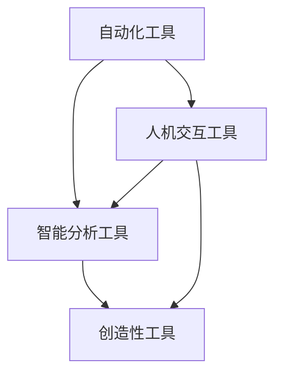

                 

**AI**, **Productivity**, **Income**, **Automation**, **Deep Learning**, **Natural Language Processing**, **Computer Vision**

## 1. 背景介绍

在当今快速发展的数字化时代，人工智能（AI）已经渗透到我们的日常生活和工作中。AI工具的出现和发展为我们带来了新的机遇，帮助我们提高工作效率，增加收入。本文将深入探讨如何利用AI工具提升工作效率和收入，并提供实践指南和工具推荐。

## 2. 核心概念与联系

### 2.1 AI工具的定义

AI工具是指利用人工智能技术开发的软件或系统，能够模拟人类智能，学习、适应和做出决策。AI工具可以自动化重复性任务，提高工作效率，并为我们提供新的盈利机会。

### 2.2 AI工具的分类

AI工具可以分为以下几类：

- **自动化工具**：自动化任务，如数据处理、文档编辑等。
- **智能分析工具**：提供数据分析和洞察，帮助我们做出更明智的决策。
- **创造性工具**：生成内容，如图像、音乐或文本。
- **人机交互工具**：改善人机交互，如虚拟助手或智能对话系统。

### 2.3 AI工具的联系

AI工具之间往往是相互关联的，它们可以组合使用以实现更复杂的任务。例如，自动化工具可以为智能分析工具提供数据，智能分析工具可以为创造性工具提供灵感，而人机交互工具可以为所有这些工具提供用户界面。



## 3. 核心算法原理 & 具体操作步骤

### 3.1 算法原理概述

AI工具的核心是算法，常用的AI算法包括机器学习算法、深度学习算法和自然语言处理算法等。这些算法可以从数据中学习，并用于预测、分类或生成新的内容。

### 3.2 算法步骤详解

1. **数据收集**：收集与任务相关的数据。
2. **数据预处理**：清洗、标记和格式化数据。
3. **模型选择**：选择适合任务的AI算法。
4. **模型训练**：使用预处理后的数据训练模型。
5. **模型评估**：评估模型的性能。
6. **部署**：将模型集成到应用程序中。
7. **持续学习**：收集反馈，持续改进模型。

### 3.3 算法优缺点

**优点**：

- 自动化任务，提高效率。
- 学习和适应能力强。
- 可以处理复杂的数据。

**缺点**：

- 需要大量数据和计算资源。
- 模型可能存在偏见或不准确。
- 解释性差，难以理解模型的决策过程。

### 3.4 算法应用领域

AI算法广泛应用于各个领域，包括：

- **自然语言处理**：文本分类、翻译、生成等。
- **计算机视觉**：图像分类、物体检测、图像生成等。
- **推荐系统**：个性化推荐、内容推荐等。
- **自动驾驶**：路径规划、物体检测等。

## 4. 数学模型和公式 & 详细讲解 & 举例说明

### 4.1 数学模型构建

数学模型是AI算法的基础。例如，线性回归模型的数学表达式为：

$$y = wx + b$$

其中，$y$是目标变量，$x$是输入变量，$w$和$b$是模型参数。

### 4.2 公式推导过程

模型参数通常通过最小化损失函数来学习。例如，均方误差（MSE）是常用的损失函数，其公式为：

$$L = \frac{1}{n}\sum_{i=1}^{n}(y_i - \hat{y}_i)^2$$

其中，$y_i$是真实值，$ \hat{y}_i$是模型预测值，$n$是样本数。

### 4.3 案例分析与讲解

假设我们要构建一个简单的线性回归模型来预测房价。我们的目标是找到一个函数$y = wx + b$，使得MSE最小化。我们可以使用梯度下降算法来学习模型参数$w$和$b$。

## 5. 项目实践：代码实例和详细解释说明

### 5.1 开发环境搭建

我们将使用Python和常用的机器学习库Scikit-learn来构建线性回归模型。首先，我们需要安装必要的库：

```bash
pip install numpy pandas scikit-learn
```

### 5.2 源代码详细实现

```python
import numpy as np
import pandas as pd
from sklearn.linear_model import LinearRegression
from sklearn.model_selection import train_test_split
from sklearn.metrics import mean_squared_error

# 加载数据
data = pd.read_csv('housing.csv')

# 准备数据
X = data[['square_feet', 'bedrooms', 'bathrooms']]
y = data['price']

# 分割数据
X_train, X_test, y_train, y_test = train_test_split(X, y, test_size=0.2, random_state=42)

# 创建模型
model = LinearRegression()

# 训练模型
model.fit(X_train, y_train)

# 预测
y_pred = model.predict(X_test)

# 评估模型
mse = mean_squared_error(y_test, y_pred)
print(f'Mean Squared Error: {mse}')
```

### 5.3 代码解读与分析

我们首先加载数据，然后准备数据，分割数据集为训练集和测试集。我们使用Scikit-learn的`LinearRegression`类来创建模型，并使用训练集训练模型。然后，我们使用测试集预测房价，并使用均方误差（MSE）来评估模型的性能。

### 5.4 运行结果展示

运行代码后，您会看到输出的MSE。这个值可以帮助您评估模型的性能。MSE越小，模型的预测越准确。

## 6. 实际应用场景

### 6.1 当前应用

AI工具已经广泛应用于各个领域，包括：

- **客户服务**：智能客服机器人。
- **营销**：个性化推荐系统。
- **金融**：风险评估和欺诈检测。
- **医疗**：疾病诊断和药物发现。

### 6.2 未来应用展望

未来，AI工具将继续发展，并应用于更多领域，如：

- **自动驾驶**：无人驾驶汽车和无人机。
- **人工智能道德**：帮助我们做出道德决策。
- **量子计算**：利用量子计算加速AI算法。

## 7. 工具和资源推荐

### 7.1 学习资源推荐

- **在线课程**：Coursera、Udacity、edX上的AI课程。
- **书籍**："Python机器学习"、"深度学习"、"自然语言处理"。
- **博客**：KDnuggets、Towards Data Science、Distill。

### 7.2 开发工具推荐

- **编程语言**：Python、R。
- **库和框架**：TensorFlow、PyTorch、Scikit-learn。
- **开发环境**：Jupyter Notebook、Google Colab。

### 7.3 相关论文推荐

- "Attention Is All You Need"、 "Generative Adversarial Networks"、 "Word2Vec"。

## 8. 总结：未来发展趋势与挑战

### 8.1 研究成果总结

本文介绍了如何利用AI工具提高工作效率和增加收入。我们讨论了AI工具的核心概念、算法原理、数学模型和实践项目。我们还提供了学习资源、开发工具和相关论文的推荐。

### 8.2 未来发展趋势

未来，AI工具将继续发展，变得更智能、更强大。我们将看到AI工具在更多领域的应用，如自动驾驶、人工智能道德和量子计算。

### 8.3 面临的挑战

然而，AI工具也面临着挑战，包括数据隐私、模型偏见和解释性差等问题。我们需要努力解决这些挑战，以确保AI工具的安全和有效使用。

### 8.4 研究展望

未来的研究将关注于提高AI工具的解释性、安全性和道德性。我们还将看到AI工具与其他技术的结合，如物联网和区块链。

## 9. 附录：常见问题与解答

**Q：AI工具是否会取代人类工作？**

**A：**AI工具可以自动化重复性任务，但它们也创造了新的工作岗位，如数据科学家和AI工程师。此外，AI工具可以帮助我们提高工作效率，为我们提供新的机遇。

**Q：AI工具是否安全？**

**A：**AI工具存在数据隐私和模型偏见等安全问题。我们需要开发新的技术来解决这些问题，并建立监管框架来确保AI工具的安全使用。

**Q：如何开始使用AI工具？**

**A：**开始使用AI工具的第一步是学习。您可以参加在线课程，阅读书籍和博客，并使用开源工具和库来构建自己的AI项目。

## 作者：禅与计算机程序设计艺术 / Zen and the Art of Computer Programming

