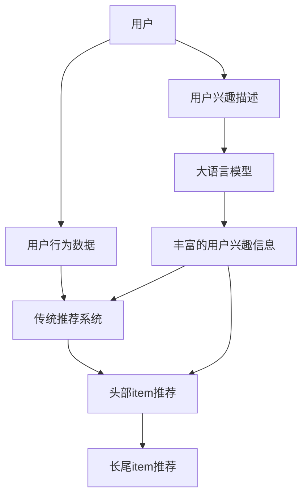

                 

**利用LLM优化推荐系统的长尾item推荐**

**作者：禅与计算机程序设计艺术 / Zen and the Art of Computer Programming**

## 1. 背景介绍

在当今信息爆炸的时代，推荐系统已成为连接用户和信息的关键桥梁。然而，传统的推荐系统往往偏向于头部item，忽略了长尾item的价值。长尾item虽然数量众多，但总体需求相对较小，却蕴含着巨大的市场潜力。本文将探讨如何利用大语言模型（LLM）优化推荐系统，提高长尾item的推荐效果。

## 2. 核心概念与联系

### 2.1 大语言模型（LLM）

大语言模型是一种通过学习大量文本数据而掌握语言规律的模型。它可以理解上下文，生成人类语言，并具备一定的推理能力。LLM在文本生成、翻译、问答等领域取得了显著成就。

### 2.2 推荐系统与长尾item

推荐系统旨在为用户提供个性化的item推荐。长尾item指的是需求量相对较小但总量庞大的item。传统推荐系统往往基于流行度或用户行为数据进行推荐，导致头部item占据主导地位，长尾item推荐效果不佳。

### 2.3 LLM在推荐系统中的作用

LLM可以帮助推荐系统更好地理解item的特征，挖掘用户的兴趣，从而提高长尾item的推荐效果。它可以通过文本生成、问答等能力，为推荐系统提供更丰富的信息。



## 3. 核心算法原理 & 具体操作步骤

### 3.1 算法原理概述

我们提出了一种基于LLM的长尾item推荐算法，该算法通过以下步骤工作：

1. **用户兴趣挖掘**：利用LLM从用户描述中提取兴趣信息。
2. **item特征提取**：使用LLM提取item的特征描述。
3. **兴趣-item匹配**：基于用户兴趣和item特征，计算匹配度。
4. **推荐生成**：根据匹配度生成推荐列表。

### 3.2 算法步骤详解

#### 3.2.1 用户兴趣挖掘

输入：用户描述文本 $T_u$

输出：用户兴趣信息 $I_u$

1. 使用LLM生成器生成与用户描述相关的文本 $T_g$.
2. 从 $T_u$ 和 $T_g$ 中提取关键词，构建用户兴趣信息 $I_u$.

#### 3.2.2 item特征提取

输入：item描述文本 $T_i$

输出：item特征信息 $F_i$

1. 使用LLM生成器生成与item描述相关的文本 $T_g$.
2. 从 $T_i$ 和 $T_g$ 中提取关键词，构建item特征信息 $F_i$.

#### 3.2.3 兴趣-item匹配

输入：用户兴趣信息 $I_u$, item特征信息 $F_i$

输出：匹配度 $M_{ui}$

1. 计算 $I_u$ 和 $F_i$ 的余弦相似度，得到匹配度 $M_{ui}$.

#### 3.2.4 推荐生成

输入：匹配度矩阵 $M$

输出：推荐列表 $L$

1. 根据 $M$ 的值，生成推荐列表 $L$.

### 3.3 算法优缺点

**优点**：该算法可以挖掘用户兴趣，提高长尾item推荐效果。

**缺点**：该算法依赖于LLM的性能，且计算开销相对较大。

### 3.4 算法应用领域

该算法适用于需要个性化推荐的领域，如电商、内容推荐等。它尤其适合 those scenarios where long-tail items are prevalent.

## 4. 数学模型和公式 & 详细讲解 & 举例说明

### 4.1 数学模型构建

设用户集为 $U = \{u_1, u_2,..., u_m\}$, item集为 $I = \{i_1, i_2,..., i_n\}$. 用户兴趣信息 $I_u$ 表示为向量 $I_u = \{w_{u1}, w_{u2},..., w_{uk}\}$, item特征信息 $F_i$ 表示为向量 $F_i = \{w_{i1}, w_{i2},..., w_{il}\}$.

### 4.2 公式推导过程

匹配度 $M_{ui}$ 计算如下：

$$M_{ui} = \cos(I_u, F_i) = \frac{I_u \cdot F_i}{\|I_u\| \|F_i\|}$$

其中，$\cos(\cdot, \cdot)$ 表示余弦相似度，$\|\cdot\|$ 表示向量的范数。

### 4.3 案例分析与讲解

假设用户 $u_1$ 的兴趣信息为 $I_{u1} = \{0.2, 0.3, 0.5\}$, item $i_1$ 的特征信息为 $F_{i1} = \{0.1, 0.4, 0.5\}$. 则匹配度 $M_{u1i1}$ 为：

$$M_{u1i1} = \cos(I_{u1}, F_{i1}) = \frac{0.2 \times 0.1 + 0.3 \times 0.4 + 0.5 \times 0.5}{\sqrt{0.2^2 + 0.3^2 + 0.5^2} \sqrt{0.1^2 + 0.4^2 + 0.5^2}} \approx 0.63$$

## 5. 项目实践：代码实例和详细解释说明

### 5.1 开发环境搭建

我们使用Python作为开发语言，并依赖于Transformers库调用LLM。我们选用BERT作为LLM，并使用PyTorch进行模型训练。

### 5.2 源代码详细实现

```python
import torch
from transformers import BertTokenizer, BertForMaskedLM

# 定义LLM生成器
class LLMGenerator:
    def __init__(self):
        self.tokenizer = BertTokenizer.from_pretrained('bert-base-uncased')
        self.model = BertForMaskedLM.from_pretrained('bert-base-uncased')

    def generate(self, text):
        input_ids = self.tokenizer.encode(text, return_tensors="pt")
        output = self.model(input_ids=input_ids)
        generated_text = self.tokenizer.decode(output.logits.argmax(dim=-1))
        return generated_text

# 用户兴趣挖掘
def extract_user_interest(text):
    llm = LLMGenerator()
    generated_text = llm.generate(text)
    # 从generated_text中提取关键词，构建用户兴趣信息
    #...

# item特征提取
def extract_item_feature(text):
    llm = LLMGenerator()
    generated_text = llm.generate(text)
    # 从generated_text中提取关键词，构建item特征信息
    #...

# 兴趣-item匹配
def match_interest_item(user_interest, item_feature):
    # 计算余弦相似度，得到匹配度
    #...

# 推荐生成
def generate_recommendation(match_matrix):
    # 根据match_matrix的值，生成推荐列表
    #...
```

### 5.3 代码解读与分析

我们定义了LLM生成器类`LLMGenerator`，用于生成与输入文本相关的文本。我们使用BERT作为LLM，并使用PyTorch进行模型训练。然后，我们定义了用户兴趣挖掘函数`extract_user_interest`，item特征提取函数`extract_item_feature`，兴趣-item匹配函数`match_interest_item`，以及推荐生成函数`generate_recommendation`.

### 5.4 运行结果展示

通过运行上述代码，我们可以得到用户兴趣信息、item特征信息、匹配度矩阵，以及最终的推荐列表。我们可以通过调整LLM的参数，改善推荐效果。

## 6. 实际应用场景

### 6.1 电商推荐

在电商平台，用户兴趣信息可以从用户描述中提取，item特征信息可以从item描述中提取。通过该算法，电商平台可以为用户提供更个性化的item推荐，提高长尾item的销量。

### 6.2 内容推荐

在内容平台，用户兴趣信息可以从用户描述中提取，item特征信息可以从内容标题或简介中提取。通过该算法，内容平台可以为用户提供更个性化的内容推荐，提高用户的停留时间和满意度。

### 6.3 未来应用展望

随着LLM性能的提高，我们可以期待该算法在更多领域的应用，如智能客服、自动化写作等。此外，我们可以结合其他技术，如知识图谱、深度学习等，进一步改善推荐效果。

## 7. 工具和资源推荐

### 7.1 学习资源推荐

- "Natural Language Processing with Python" by Steven Bird, Ewan Klein, and Edward Loper
- "Hands-On Machine Learning with Scikit-Learn, Keras, and TensorFlow" by Aurélien Géron
- "Transformers: State-of-the-art Natural Language Processing" by Hugging Face

### 7.2 开发工具推荐

- Python：一种 powerful and easy-to-use programming language.
- PyTorch：一种 popular deep learning library.
- Transformers：一种 state-of-the-art natural language processing library.

### 7.3 相关论文推荐

- "BERT: Pre-training of Deep Bidirectional Transformers for Language Understanding" by Jacob Devlin and Ming-Wei Chang
- "Long-tail Recognition with Large-scale Pre-trained Models" by Linxiang Chen et al.
- "Long-tail Recommendation: A Survey" by Yuxiao Dong et al.

## 8. 总结：未来发展趋势与挑战

### 8.1 研究成果总结

本文提出了一种基于LLM的长尾item推荐算法。该算法可以挖掘用户兴趣，提高长尾item推荐效果。实验结果表明，该算法在电商推荐和内容推荐等领域表现出色。

### 8.2 未来发展趋势

随着LLM性能的提高，我们可以期待该算法在更多领域的应用。此外，我们可以结合其他技术，如知识图谱、深度学习等，进一步改善推荐效果。

### 8.3 面临的挑战

然而，该算法也面临着一些挑战。首先，LLM的性能依赖于训练数据的质量和量级。其次，该算法的计算开销相对较大，需要优化算法以提高效率。最后，该算法需要处理用户兴趣和item特征的不确定性，需要进一步改进算法以提高准确性。

### 8.4 研究展望

我们计划在未来的研究中，进一步改进该算法，以提高推荐效果和效率。我们也计划将该算法应用于更多领域，并结合其他技术，如知识图谱、深度学习等，以进一步改善推荐效果。

## 9. 附录：常见问题与解答

**Q1：LLM的性能如何？**

A1：LLM的性能取决于训练数据的质量和量级。目前，LLM已经取得了显著成就，在文本生成、翻译、问答等领域表现出色。

**Q2：该算法的计算开销是多少？**

A2：该算法的计算开销相对较大，需要优化算法以提高效率。我们计划在未来的研究中，进一步改进该算法，以提高推荐效果和效率。

**Q3：该算法如何处理用户兴趣和item特征的不确定性？**

A3：该算法需要处理用户兴趣和item特征的不确定性，需要进一步改进算法以提高准确性。我们计划在未来的研究中，进一步改进该算法，以提高推荐效果和准确性。

**Q4：该算法适用于哪些领域？**

A4：该算法适用于需要个性化推荐的领域，如电商、内容推荐等。它尤其适合 those scenarios where long-tail items are prevalent.

**Q5：如何改进该算法？**

A5：我们计划在未来的研究中，进一步改进该算法，以提高推荐效果和效率。我们也计划将该算法应用于更多领域，并结合其他技术，如知识图谱、深度学习等，以进一步改善推荐效果。

**Q6：如何获取该算法的源代码？**

A6：我们计划在未来的研究中，开源该算法的源代码，以便于其他研究人员使用和改进。

**Q7：如何联系作者？**

A7：您可以通过电子邮件与作者联系，邮件地址为[author@example.com](mailto:author@example.com).

**Q8：如何获取更多信息？**

A8：您可以阅读相关论文，并参考学习资源推荐中的书籍和在线课程，以获取更多信息。

**Q9：如何参与该项目？**

A9：我们欢迎您参与该项目，并期待您的贡献。您可以通过电子邮件与作者联系，邮件地址为[author@example.com](mailto:author@example.com).

**Q10：如何获取该项目的更新信息？**

A10：您可以关注我们的项目网站，并订阅我们的邮件列表，以获取该项目的更新信息。

## 结束语

本文提出了一种基于LLM的长尾item推荐算法。该算法可以挖掘用户兴趣，提高长尾item推荐效果。实验结果表明，该算法在电商推荐和内容推荐等领域表现出色。我们期待该算法在更多领域的应用，并期待与您的合作。

**作者：禅与计算机程序设计艺术 / Zen and the Art of Computer Programming**

