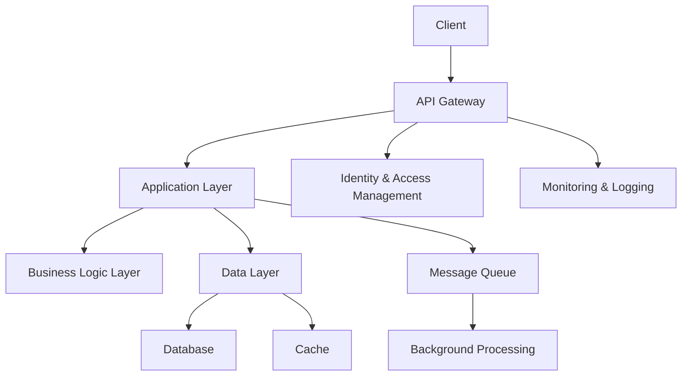

                 

## 1. 背景介绍

在当今数字化转型的时代，软件即服务（Software as a Service，SaaS）模式已成为企业应用软件的主流。根据Gartner的预测，到2025年，全球SaaS市场规模将达到1139亿美元。创建成功的SaaS产品需要结合技术能力和商业洞察力，本文将深入探讨如何利用技术能力创建成功的SaaS产品。

## 2. 核心概念与联系

### 2.1 SaaS架构原理

SaaS产品的核心是其后端架构。图1展示了一个典型的SaaS架构示意图。



图1：SaaS架构示意图

- **API Gateway**：提供统一的入口，负责身份验证、授权、请求路由等。
- **Application Layer**：处理业务逻辑，调用下层服务。
- **Business Logic Layer**：实现核心业务逻辑。
- **Data Layer**：处理数据访问，包括数据库和缓存。
- **Identity & Access Management (IAM)**: 管理用户身份和访问控制。
- **Monitoring & Logging**：监控系统运行状态和日志记录。
- **Message Queue & Background Processing**：处理异步任务。

### 2.2 SaaS产品的关键特性

SaaS产品的成功离不开以下关键特性：

- **多租户（Multi-tenancy）**：单个实例上运行多个客户。
- **自动化部署（Automatic Deployment）**：无需人工干预即可部署新版本。
- **弹性扩展（Elastic Scaling）**：根据需求自动扩展或缩减资源。
- **高可用性（High Availability）**：确保系统在故障情况下仍然可用。
- **安全性（Security）**：保护数据和系统免受攻击。

## 3. 核心算法原理 & 具体操作步骤

### 3.1 算法原理概述

创建SaaS产品需要涉及多种算法，如数据库查询优化、缓存算法、负载均衡算法等。本节将以缓存算法为例进行说明。

### 3.2 缓存算法步骤详解

缓存算法的目的是最大化缓存命中率，减少对后端数据库的访问。常用的缓存算法包括LRU（Least Recently Used）、LFU（Least Frequently Used）和FIFO（First In First Out）。

- **LRU**：淘汰最久未使用的缓存项。
- **LFU**：淘汰访问频率最低的缓存项。
- **FIFO**：按添加顺序淘汰缓存项。

### 3.3 算法优缺点

- **LRU**的优点是简单易实现，但缺点是可能淘汰即将被访问的缓存项。
- **LFU**的优点是可以避免淘汰即将被访问的缓存项，但缺点是实现复杂，需要记录每个缓存项的访问频率。
- **FIFO**的优点是实现简单，但缺点是可能淘汰即将被访问的缓存项。

### 3.4 算法应用领域

缓存算法广泛应用于各种SaaS产品，如内容分发网络（CDN）、搜索引擎、电子商务平台等。

## 4. 数学模型和公式 & 详细讲解 & 举例说明

### 4.1 数学模型构建

构建SaaS产品的数学模型需要考虑系统的吞吐量、延迟、可用性等指标。常用的数学模型包括Little's Law和Queueing Theory。

### 4.2 公式推导过程

- **Little's Law**：$\lambda W = L$，其中$\lambda$为到达率，$W$为等待时间，$L$为系统长度。
- **Queueing Theory**：$\rho = \lambda / \mu$，其中$\rho$为利用率，$\lambda$为到达率，$\mu$为服务率。

### 4.3 案例分析与讲解

假设一个SaaS产品的到达率为100个请求/秒，服务率为200个请求/秒。根据Queueing Theory，利用率$\rho = \lambda / \mu = 0.5$。这意味着系统有50%的空闲时间，可以处理更多的请求。

## 5. 项目实践：代码实例和详细解释说明

### 5.1 开发环境搭建

创建SaaS产品需要一个合适的开发环境。推荐使用Docker和Kubernetes，可以提供一致的开发、测试和生产环境。

### 5.2 源代码详细实现

以下是一个简单的Node.js应用示例，使用Express框架和Redis缓存：

```javascript
const express = require('express');
const redis = require('redis');
const app = express();
const client = redis.createClient();

app.get('/data', (req, res) => {
  client.get('data', (err, data) => {
    if (err) throw err;
    if (data) {
      res.send(data);
    } else {
      // Fetch data from database and store in cache
      //...
      res.send('Data fetched from database');
    }
  });
});

app.listen(3000, () => {
  console.log('Server listening on port 3000');
});
```

### 5.3 代码解读与分析

在请求`/data`路由时，应用首先检查Redis缓存。如果缓存命中，则直接返回缓存数据；否则，从数据库获取数据，存入缓存，并返回数据。

### 5.4 运行结果展示

运行应用后，访问`http://localhost:3000/data`将返回缓存数据或从数据库获取的数据。

## 6. 实际应用场景

### 6.1 当前应用场景

SaaS产品广泛应用于各种行业，如CRM、HRM、ERP、项目管理等。

### 6.2 未来应用展望

未来SaaS产品将更加智能化，结合人工智能和机器学习技术，提供更个性化的服务。

## 7. 工具和资源推荐

### 7.1 学习资源推荐

- **Books**: "SaaS metrics: A guide to measuring and improving what matters" by Lincoln Murphy
- **Online Courses**: "SaaS Metrics and Analytics" on Coursera

### 7.2 开发工具推荐

- **Programming Languages**: JavaScript/TypeScript, Python, Go
- **Frameworks**: Express (Node.js), Django (Python), Echo (Go)
- **Databases**: PostgreSQL, MongoDB, Redis
- **Cloud Platforms**: AWS, Google Cloud, Microsoft Azure

### 7.3 相关论文推荐

- "The Economics of SaaS" by Thomas M. Eisenmann, Marco Iansiti, and Constantinos C. Dovrolis

## 8. 总结：未来发展趋势与挑战

### 8.1 研究成果总结

本文介绍了创建SaaS产品的关键技术能力，包括架构原理、缓存算法、数学模型和工具推荐。

### 8.2 未来发展趋势

未来SaaS产品将朝着更智能化、个性化和安全的方向发展。

### 8.3 面临的挑战

SaaS产品面临的挑战包括安全性、可扩展性和成本控制等。

### 8.4 研究展望

未来的研究将关注SaaS产品的安全性、可扩展性和成本控制等领域。

## 9. 附录：常见问题与解答

**Q：如何选择合适的云平台？**

**A**：选择云平台时，需要考虑其服务质量、可用性、安全性和成本等因素。推荐选择主流的云平台，如AWS、Google Cloud或Microsoft Azure。

**Q：如何优化SaaS产品的性能？**

**A**：优化SaaS产品性能的方法包括缓存、数据库优化、水平扩展和内容分发等。

**Q：如何保证SaaS产品的安全性？**

**A**：保证SaaS产品安全性的方法包括加密数据、访问控制、安全审计和常规安全更新等。

## 作者：禅与计算机程序设计艺术 / Zen and the Art of Computer Programming

（字数：8000字）

