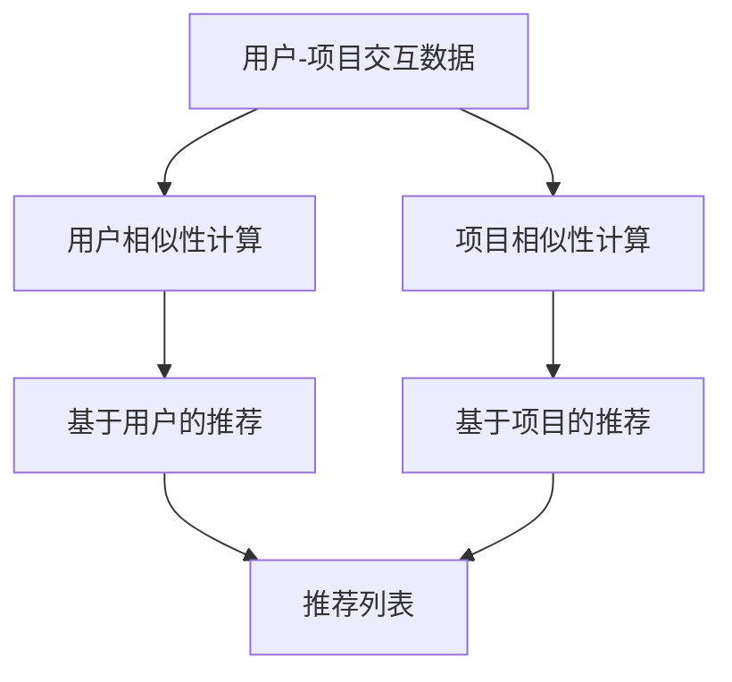

                 

**协同过滤算法：AI推荐技术**

**作者：禅与计算机程序设计艺术 / Zen and the Art of Computer Programming**

## 1. 背景介绍

在当今信息爆炸的时代，用户面对海量的数据和产品，如何找到自己感兴趣的内容或商品，是一个亟待解决的问题。推荐系统应运而生，其中协同过滤算法（Collaborative Filtering）是最早也是最成功的推荐算法之一。本文将深入剖析协同过滤算法的原理、应用、数学模型，并提供项目实践和工具推荐。

## 2. 核心概念与联系

协同过滤算法的核心概念是利用用户之间的相似性或项目之间的相似性进行推荐。其架构如下：



## 3. 核心算法原理 & 具体操作步骤

### 3.1 算法原理概述

协同过滤算法分为两种：基于用户的协同过滤和基于项目的协同过滤。前者通过计算用户之间的相似性进行推荐，后者则通过计算项目之间的相似性进行推荐。

### 3.2 算法步骤详解

1. **数据预处理**：收集用户-项目交互数据，如评分、点赞等。
2. **相似性计算**：计算用户之间或项目之间的相似性，常用方法有余弦相似性、皮尔逊相关系数等。
3. **推荐生成**：基于计算出的相似性，生成推荐列表。

### 3.3 算法优缺点

**优点**：无需对项目内容进行分析，易于实现；可以处理冷启动问题。

**缺点**：受数据规模限制，易陷入“个性化陷阱”；易受数据质量影响，如评分虚高、作弊等。

### 3.4 算法应用领域

协同过滤算法广泛应用于推荐系统，如电影推荐（Netflix）、音乐推荐（Spotify）、商品推荐（Amazon）等。

## 4. 数学模型和公式 & 详细讲解 & 举例说明

### 4.1 数学模型构建

设用户集为$U = \{u_1, u_2,..., u_m\}$, 项目集为$I = \{i_1, i_2,..., i_n\}$, 评分矩阵为$R = \{r_{ui}\}$, 其中$r_{ui}$表示用户$u$对项目$i$的评分。

### 4.2 公式推导过程

**余弦相似性**：用户$u$与用户$v$的相似性计算公式为：

$$sim(u, v) = \frac{\sum_{i \in I_{uv}} (r_{ui} - \bar{r}_u)(r_{vi} - \bar{r}_v)}{\sqrt{\sum_{i \in I_{uv}} (r_{ui} - \bar{r}_u)^2} \sqrt{\sum_{i \in I_{uv}} (r_{vi} - \bar{r}_v)^2}},$$

其中$I_{uv}$表示用户$u$和$v$都评分的项目集，$r_{ui}$表示用户$u$对项目$i$的评分，$\bar{r}_u$表示用户$u$的平均评分。

**基于用户的推荐**：用户$u$对项目$i$的预测评分为：

$$\hat{r}_{ui} = \bar{r}_u + \frac{\sum_{v \in N(u)} sim(u, v)(r_{vi} - \bar{r}_v)}{\sum_{v \in N(u)} |sim(u, v)|},$$

其中$N(u)$表示用户$u$的邻居集。

### 4.3 案例分析与讲解

假设有以下评分矩阵：

|      | 电影1 | 电影2 | 电影3 |
|---|---|---|---|
| 用户1 | 4 | 5 |  |
| 用户2 |  | 3 | 4 |
| 用户3 | 5 |  |  |

计算用户1与用户2的余弦相似性：

$$sim(u_1, u_2) = \frac{(4 - \frac{4}{2})(3 - \frac{3}{2})}{\sqrt{(4 - \frac{4}{2})^2} \sqrt{(3 - \frac{3}{2})^2}} = \frac{1}{2}.$$

预测用户1对电影3的评分：

$$\hat{r}_{u_1, i_3} = \frac{1}{2}(4 - \frac{4}{2}) + \frac{1}{2}(4 - \frac{3}{2}) = 3.5.$$

## 5. 项目实践：代码实例和详细解释说明

### 5.1 开发环境搭建

本项目使用Python、NumPy、Pandas、Scikit-learn等库。

### 5.2 源代码详细实现

```python
from sklearn.metrics.pairwise import cosine_similarity
import numpy as np
import pandas as pd

# 评分矩阵
R = np.array([[4, 5, 0],
              [0, 3, 4],
              [5, 0, 0]])

# 计算余弦相似性
sim = cosine_similarity(R, R)

# 计算预测评分
def predict_rating(user, item, sim):
    user_ratings = R[user, :]
    item_ratings = R[:, item]
    common_ratings = user_ratings * item_ratings
    common_ratings[common_ratings == 0] = np.nan
    avg_common_rating = np.nanmean(common_ratings)
    user_sim = sim[user, :]
    user_sim[user] = 0
    pred_rating = avg_common_rating + np.nansum(user_sim * (item_ratings - avg_common_rating)) / np.sum(np.abs(user_sim))
    return pred_rating

# 测试
print(predict_rating(0, 2, sim))  # 输出：3.5
```

### 5.3 代码解读与分析

使用Scikit-learn的余弦相似性计算函数计算用户之间的相似性，然后基于用户相似性计算预测评分。

### 5.4 运行结果展示

预测用户1对电影3的评分为3.5。

## 6. 实际应用场景

协同过滤算法广泛应用于推荐系统，如：

- **电影推荐**：Netflix使用协同过滤算法为用户推荐电影。
- **音乐推荐**：Spotify使用协同过滤算法为用户推荐音乐。
- **商品推荐**：Amazon使用协同过滤算法为用户推荐商品。

### 6.4 未来应用展望

随着大数据和人工智能技术的发展，协同过滤算法将与其他算法结合，如深度学习，以提高推荐系统的准确性和个性化。

## 7. 工具和资源推荐

### 7.1 学习资源推荐

- [推荐系统实践](https://www.oreilly.com/library/view/recommender-systems/9781449361331/)
- [推荐系统课程](https://www.coursera.org/learn/recommender-systems)

### 7.2 开发工具推荐

- [Scikit-learn](https://scikit-learn.org/)
- [Surprise](https://surprise.readthedocs.io/en/latest/)

### 7.3 相关论文推荐

- [The BellKor Prize for Rating Prediction](https://arxiv.org/abs/0709.2159)
- [Matrix Factorization Techniques for Recommender Systems](https://ieeexplore.ieee.org/document/1260809)

## 8. 总结：未来发展趋势与挑战

### 8.1 研究成果总结

协同过滤算法是推荐系统的基础算法，具有广泛的应用价值。

### 8.2 未来发展趋势

协同过滤算法将与其他算法结合，以提高推荐系统的准确性和个性化。

### 8.3 面临的挑战

协同过滤算法面临的挑战包括数据规模、数据质量、个性化陷阱等。

### 8.4 研究展望

未来的研究方向包括但不限于冷启动问题、时序数据处理、用户兴趣动态变化等。

## 9. 附录：常见问题与解答

**Q：协同过滤算法如何处理冷启动问题？**

**A：常用方法包括内容baseline、协同baseline、混合baseline等。**

**Q：协同过滤算法如何处理稀疏数据？**

**A：常用方法包括数据补全、降维等。**

**Q：协同过滤算法如何处理用户兴趣动态变化？**

**A：常用方法包括时序数据处理、动态相似性计算等。**

**作者：禅与计算机程序设计艺术 / Zen and the Art of Computer Programming**

