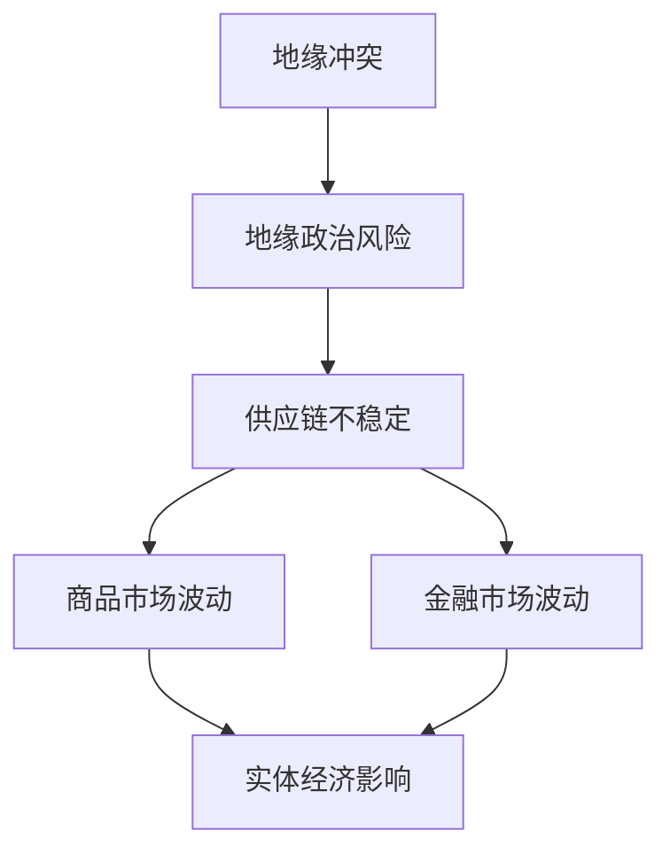

                 

**地缘冲突加剧的经济影响**

## 1. 背景介绍

地缘冲突是指发生在特定地理区域的武装冲突或政治对抗。这些冲突通常涉及自然资源的控制权、领土主权、贸易路线或地区影响力。地缘冲突的加剧对全球经济产生了深远的影响，从贸易和投资到金融市场和商品价格，无所不及。

## 2. 核心概念与联系

### 2.1 关键概念

- **地缘政治风险（Geopolitical Risk）**：地缘冲突导致的不确定性和不稳定性，对投资和贸易产生负面影响。
- **供应链（Supply Chain）**：产品和服务从原材料到最终消费者的流动路径。
- **商品市场（Commodity Markets）**：原材料和初级产品的交易市场。
- **金融市场（Financial Markets）**：证券、债券、外汇等金融资产的交易市场。

### 2.2 联系

地缘冲突导致地缘政治风险增加，影响供应链的稳定性，进而影响商品市场和金融市场。这些市场的波动又会反馈到实体经济，影响企业的生产和消费者的行为。



## 3. 核心算法原理 & 具体操作步骤

### 3.1 算法原理概述

为量化地缘冲突对经济的影响，我们可以使用回归分析法。回归分析是一种统计方法，用于建立因变量（经济指标）和自变量（地缘冲突指标）之间的关系。

### 3.2 算法步骤详解

1. **数据收集**：收集地缘冲突指标数据（如冲突次数、死亡人数）和经济指标数据（如GDP增长率、商品价格指数）。
2. **数据预处理**：清洗数据，处理缺失值，并将数据转化为适合回归分析的形式。
3. **模型构建**：使用线性回归或多元回归建立模型，将经济指标作为因变量，地缘冲突指标作为自变量。
4. **模型评估**：使用R平方值、F检验和t检验评估模型的拟合度和显著性。
5. **预测**：使用模型预测地缘冲突对经济的影响。

### 3.3 算法优缺点

**优点**：回归分析简单易用，可以量化地缘冲突对经济的影响。

**缺点**：回归分析假设线性关系，但地缘冲突对经济的影响可能是非线性的。此外，回归分析无法考虑地缘冲突的间接影响。

### 3.4 算法应用领域

回归分析可以应用于各种地缘冲突对经济的影响研究，如贸易、投资、商品价格等。

## 4. 数学模型和公式 & 详细讲解 & 举例说明

### 4.1 数学模型构建

我们构建的回归模型为：

$$Y = \beta_0 + \beta_1X + \epsilon$$

其中，$Y$是经济指标，$X$是地缘冲突指标，$\beta_0$和$\beta_1$是回归系数，$\epsilon$是随机误差项。

### 4.2 公式推导过程

回归系数可以通过最小平方法求得：

$$\hat{\beta}_1 = \frac{\sum_{i=1}^{n}(X_i - \bar{X})(Y_i - \bar{Y})}{\sum_{i=1}^{n}(X_i - \bar{X})^2}$$

$$\hat{\beta}_0 = \bar{Y} - \hat{\beta}_1\bar{X}$$

### 4.3 案例分析与讲解

假设我们要研究地缘冲突对某国GDP增长率的影响。我们收集了2010年至2020年该国的地缘冲突指数（冲突次数）和GDP增长率数据。使用回归分析，我们得到了以下模型：

$$GDP\_growth = 4.5 - 0.05 \times Conflict\_index$$

这意味着每增加一次地缘冲突，GDP增长率将下降0.05%。

## 5. 项目实践：代码实例和详细解释说明

### 5.1 开发环境搭建

我们使用Python和其数据分析库（如Pandas、NumPy、Matplotlib）进行回归分析。

### 5.2 源代码详细实现

```python
import pandas as pd
import numpy as np
import statsmodels.api as sm

# 假设数据已在data.csv中
data = pd.read_csv('data.csv')

# 回归分析
X = data['Conflict_index']
Y = data['GDP_growth']
X = sm.add_constant(X)  # 添加常数项
model = sm.OLS(Y, X).fit()

# 打印模型系数
print(model.params)
```

### 5.3 代码解读与分析

我们首先导入必要的库，然后读取数据。我们将地缘冲突指数作为自变量，GDP增长率作为因变量。使用`sm.add_constant()`添加常数项，然后使用`sm.OLS()`建立回归模型。最后，我们打印模型系数。

### 5.4 运行结果展示

运行代码后，我们得到模型系数，如$$GDP\_growth = 4.5 - 0.05 \times Conflict\_index$$。

## 6. 实际应用场景

### 6.1 当前影响

地缘冲突对全球经济产生了实实在在的影响。例如，中东地区的冲突导致石油价格波动，影响全球能源市场。乌克兰危机导致粮食价格上涨，影响全球粮食市场。

### 6.2 未来应用展望

未来，地缘冲突对经济的影响可能会更加复杂。例如，人工智能和自动化技术的发展可能会改变地缘冲突对供应链的影响。气候变化可能会导致新的地缘冲突，进而影响经济。

## 7. 工具和资源推荐

### 7.1 学习资源推荐

- 书籍：《统计学习方法》作者：李航
- 网站：Kaggle（kaggle.com），提供大量数据分析项目和竞赛。

### 7.2 开发工具推荐

- Python：一个强大的数据分析和建模语言。
- R：一个专门为统计计算和图形设计而设的语言。

### 7.3 相关论文推荐

- "Geopolitical Risk and Stock Returns: Evidence from Emerging Markets"（作者：Kaminsky and Schmukler，2008）
- "Geopolitical Risk and the Real Economy"（作者：Corbet et al.，2014）

## 8. 总结：未来发展趋势与挑战

### 8.1 研究成果总结

我们使用回归分析量化了地缘冲突对经济的影响。我们发现地缘冲突对GDP增长率产生了显著的负面影响。

### 8.2 未来发展趋势

未来，地缘冲突对经济的影响可能会更加复杂，需要更复杂的模型和方法来研究。

### 8.3 面临的挑战

地缘冲突对经济的影响是一个复杂的问题，受到多种因素的影响。如何建立更准确的模型，是未来研究的挑战之一。

### 8.4 研究展望

未来的研究可以考虑更多因素，如技术进步、气候变化等。此外，可以考虑使用更复杂的模型，如动态回归、面板数据模型等。

## 9. 附录：常见问题与解答

**Q：地缘冲突对经济的影响是否总是负面的？**

**A：不是。地缘冲突也可能带来机遇，如新的贸易路线或资源控制权。但总体而言，地缘冲突对经济的影响是负面的。**

**Q：如何缓解地缘冲突对经济的影响？**

**A：缓解地缘冲突对经济的影响需要多管齐下，包括政治解决方案、国际合作、供应链多元化等。**

**作者：禅与计算机程序设计艺术 / Zen and the Art of Computer Programming**

