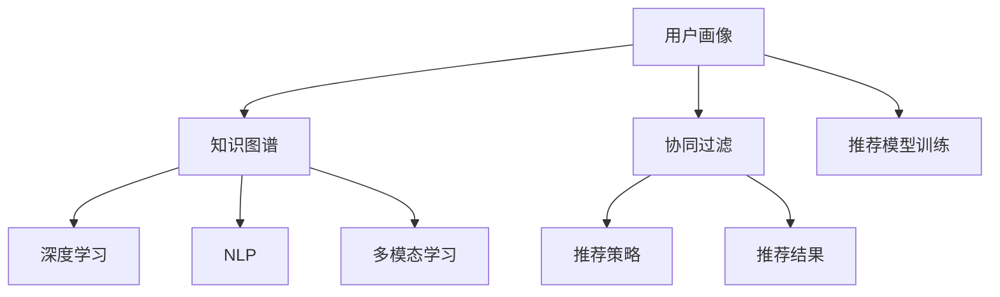

                 

# 知识经济下知识付费的人工智能知识推荐系统

> 关键词：知识推荐系统,人工智能,知识付费,内容推荐,协同过滤,深度学习,自然语言处理(NLP),多模态学习

## 1. 背景介绍

在知识经济时代，信息过载成为知识获取的重大挑战。如何精准高效地向用户推荐其感兴趣的内容，成为了知识付费平台亟需解决的问题。人工智能技术，特别是知识推荐系统，为这一挑战提供了有效解决方案。本文将介绍知识推荐系统的核心概念、工作原理及实际应用，展示其如何帮助用户在海量信息中快速定位优质内容。

## 2. 核心概念与联系

### 2.1 核心概念概述

知识推荐系统（Knowledge Recommendation System, KRS）是一种利用人工智能技术，通过分析用户的历史行为、兴趣偏好、社交网络等信息，向用户推荐其感兴趣的知识产品（如课程、书籍、文章等）的系统。其目标是最大化用户的满意度，提高知识获取的效率。

#### 2.1.1 用户画像（User Profiling）

用户画像是通过收集用户的行为数据、社交数据、人口统计数据等信息，建立用户的多维特征表示，用于描述用户的兴趣、偏好和行为模式。构建准确的用户画像，是知识推荐系统成功的基础。

#### 2.1.2 知识图谱（Knowledge Graph）

知识图谱是一种语义化的知识表示方法，将实体（如课程、书籍、作者等）及其关系（如作者-书籍、书籍-课程等）映射到图形结构中。知识图谱为推荐系统提供了丰富的语义信息，有助于提高推荐结果的相关性和准确性。

#### 2.1.3 协同过滤（Collaborative Filtering）

协同过滤是一种基于用户行为数据推荐相似物品的方法。可分为基于用户的协同过滤（User-based CF）和基于物品的协同过滤（Item-based CF）。通过比较用户行为或物品特征的相似性，为用户推荐可能感兴趣的物品。

#### 2.1.4 深度学习（Deep Learning）

深度学习是一种通过多层神经网络进行特征提取和模型训练的方法，特别适合处理大规模、高维度的数据。在知识推荐系统中，深度学习被用于用户行为建模、知识表示学习、推荐模型训练等环节。

#### 2.1.5 自然语言处理（Natural Language Processing, NLP）

自然语言处理是使计算机能够理解、处理和生成人类语言的技术。在知识推荐系统中，NLP被用于文本数据的预处理、用户评论分析、实体识别等任务，帮助推荐系统更好地理解用户需求和知识内容。

#### 2.1.6 多模态学习（Multimodal Learning）

多模态学习是指结合多种数据源（如文本、图像、音频等）进行联合建模和推荐。通过融合不同模态的信息，知识推荐系统可以获得更全面的用户画像和知识表示，提升推荐效果。

这些核心概念之间存在密切联系，共同构成了知识推荐系统的技术框架。接下来，我们将详细介绍这些核心概念的原理和应用。

### 2.2 核心概念原理和架构的 Mermaid 流程图



## 3. 核心算法原理 & 具体操作步骤

### 3.1 算法原理概述

知识推荐系统的基本原理是通过分析用户的历史行为和兴趣偏好，预测其可能感兴趣的知识产品，并推荐给用户。其核心算法包括以下几个部分：

- **用户画像构建**：通过收集和分析用户的行为数据、社交数据等，构建用户的多维特征表示，用于描述用户的兴趣、偏好和行为模式。
- **知识图谱构建**：将知识领域中的实体及其关系映射到图形结构中，构建知识图谱。知识图谱为推荐系统提供了丰富的语义信息，有助于提高推荐结果的相关性和准确性。
- **协同过滤算法**：根据用户行为或物品特征的相似性，推荐可能感兴趣的物品。协同过滤分为基于用户的协同过滤和基于物品的协同过滤两种方式。
- **深度学习模型**：利用深度学习模型进行用户行为建模、知识表示学习、推荐模型训练等。深度学习能够处理大规模、高维度的数据，提高推荐系统的性能。
- **自然语言处理技术**：通过NLP技术对文本数据进行预处理、用户评论分析、实体识别等，帮助推荐系统更好地理解用户需求和知识内容。
- **多模态学习**：通过融合文本、图像、音频等多模态数据，构建更全面的用户画像和知识表示，提升推荐效果。

### 3.2 算法步骤详解

#### 3.2.1 用户画像构建

用户画像构建通常包括以下步骤：

1. **数据收集**：收集用户的基本信息、行为数据、社交数据等。
2. **特征提取**：通过统计、计算等方法，提取用户的多维特征，如年龄、性别、兴趣、阅读偏好等。
3. **用户聚类**：利用聚类算法（如K-means、层次聚类等）对用户进行分类，建立用户群组。
4. **画像更新**：根据用户新的行为数据，不断更新和优化用户画像。

#### 3.2.2 知识图谱构建

知识图谱构建通常包括以下步骤：

1. **实体识别**：通过命名实体识别（NER）技术，从文本中提取实体，如课程、书籍、作者等。
2. **关系抽取**：通过关系抽取技术，提取实体之间的关系，如作者-书籍、书籍-课程等。
3. **图谱构建**：将实体及其关系映射到图形结构中，构建知识图谱。
4. **图谱更新**：根据新的实体和关系，不断更新和优化知识图谱。

#### 3.2.3 协同过滤算法

协同过滤算法通常包括以下步骤：

1. **相似度计算**：计算用户之间或物品之间的相似度。
2. **推荐物品**：根据相似度计算结果，为当前用户推荐可能感兴趣的物品。
3. **评分预测**：根据历史评分数据，预测当前用户对新物品的评分。

#### 3.2.4 深度学习模型

深度学习模型通常包括以下步骤：

1. **模型选择**：选择合适的深度学习模型，如CNN、RNN、LSTM等。
2. **特征提取**：利用深度学习模型进行特征提取，将高维数据映射到低维空间。
3. **模型训练**：使用标注数据训练深度学习模型，优化模型参数。
4. **模型评估**：使用测试数据评估模型的性能，调整模型参数。

#### 3.2.5 自然语言处理技术

自然语言处理技术通常包括以下步骤：

1. **文本预处理**：对文本进行分词、去除停用词、词性标注等预处理。
2. **情感分析**：利用NLP技术对用户评论进行情感分析，提取情感倾向。
3. **实体识别**：利用NLP技术从文本中提取实体，如课程、书籍、作者等。

#### 3.2.6 多模态学习

多模态学习通常包括以下步骤：

1. **数据融合**：将文本、图像、音频等多模态数据融合，构建多模态特征向量。
2. **模型训练**：利用多模态数据训练推荐模型，提升推荐效果。
3. **推荐生成**：根据多模态特征向量，生成推荐结果。

### 3.3 算法优缺点

知识推荐系统具有以下优点：

- **高效性**：利用用户行为数据，推荐相关知识产品，快速满足用户需求。
- **个性化**：通过构建用户画像，实现个性化推荐，提升用户体验。
- **可扩展性**：通过深度学习模型和大规模知识图谱，提升系统的可扩展性。

同时，知识推荐系统也存在一些缺点：

- **数据稀疏性**：用户历史行为数据往往稀疏，难以建立准确的用户画像。
- **冷启动问题**：新用户缺乏足够的历史行为数据，难以进行个性化推荐。
- **隐私保护**：用户行为数据涉及隐私问题，需采用隐私保护技术。

### 3.4 算法应用领域

知识推荐系统广泛应用于以下领域：

- **在线教育**：推荐用户感兴趣的课程、教材等学习资源。
- **图书电商**：推荐用户感兴趣的书籍、电子书等阅读资源。
- **新闻媒体**：推荐用户感兴趣的新闻、文章等阅读资源。
- **文化娱乐**：推荐用户感兴趣的电影、电视剧、音乐等娱乐资源。
- **企业培训**：推荐员工感兴趣的培训课程、知识库等学习资源。

## 4. 数学模型和公式 & 详细讲解 & 举例说明

### 4.1 数学模型构建

知识推荐系统的数学模型通常包括以下几个部分：

- **用户画像表示**：用户画像通常表示为高维向量，如 $u \in \mathbb{R}^n$。
- **知识图谱表示**：知识图谱通常表示为图形结构，如 $G=(V,E)$，其中 $V$ 为节点集，$E$ 为边集。
- **协同过滤模型**：协同过滤模型通常表示为 $\hat{r}_{ui} = b + \sum_{j \in \mathcal{N}_i} w_{uj} r_{ij}$，其中 $\hat{r}_{ui}$ 为预测评分，$r_{ij}$ 为用户 $i$ 对物品 $j$ 的实际评分，$\mathcal{N}_i$ 为用户 $i$ 的邻居集合，$w_{uj}$ 为邻接权重。
- **深度学习模型**：深度学习模型通常表示为 $f_{\theta}(x)$，其中 $x$ 为输入，$\theta$ 为模型参数。
- **NLP模型**：NLP模型通常表示为 $f_{\phi}(x)$，其中 $x$ 为输入，$\phi$ 为模型参数。

### 4.2 公式推导过程

#### 4.2.1 用户画像构建

用户画像的构建可以通过以下公式表示：

$$
\hat{u} = f_{\theta_u}(x_u)
$$

其中，$\hat{u}$ 为用户画像表示，$x_u$ 为历史行为数据，$f_{\theta_u}$ 为用户画像模型。

#### 4.2.2 知识图谱构建

知识图谱的构建可以通过以下公式表示：

$$
G = f_{\theta_G}(x)
$$

其中，$G$ 为知识图谱表示，$x$ 为语料库数据，$f_{\theta_G}$ 为知识图谱模型。

#### 4.2.3 协同过滤算法

协同过滤算法的预测评分可以通过以下公式表示：

$$
\hat{r}_{ui} = b + \sum_{j \in \mathcal{N}_i} w_{uj} r_{ij}
$$

其中，$\hat{r}_{ui}$ 为预测评分，$b$ 为偏置项，$r_{ij}$ 为用户 $i$ 对物品 $j$ 的实际评分，$\mathcal{N}_i$ 为用户 $i$ 的邻居集合，$w_{uj}$ 为邻接权重。

#### 4.2.4 深度学习模型

深度学习模型的输出可以通过以下公式表示：

$$
y = f_{\theta}(x)
$$

其中，$y$ 为模型输出，$x$ 为输入数据，$\theta$ 为模型参数。

#### 4.2.5 NLP模型

NLP模型的输出可以通过以下公式表示：

$$
y = f_{\phi}(x)
$$

其中，$y$ 为模型输出，$x$ 为输入数据，$\phi$ 为模型参数。

#### 4.2.6 多模态学习

多模态学习可以通过以下公式表示：

$$
y = f_{\theta}(x_T, x_I, x_A)
$$

其中，$y$ 为模型输出，$x_T$ 为文本数据，$x_I$ 为图像数据，$x_A$ 为音频数据，$\theta$ 为模型参数。

### 4.3 案例分析与讲解

以在线教育平台为例，分析知识推荐系统的具体实现。

1. **用户画像构建**：平台收集用户的基本信息、学习行为数据等，利用用户画像模型构建用户画像，如 $u = f_{\theta_u}(x_u)$。
2. **知识图谱构建**：平台利用课程、教材等数据构建知识图谱，如 $G = f_{\theta_G}(x)$。
3. **协同过滤算法**：平台使用协同过滤算法推荐课程，如 $\hat{r}_{ui} = b + \sum_{j \in \mathcal{N}_i} w_{uj} r_{ij}$。
4. **深度学习模型**：平台使用深度学习模型进行用户行为建模，如 $y = f_{\theta}(x)$。
5. **NLP模型**：平台使用NLP模型进行文本数据处理，如 $y = f_{\phi}(x)$。
6. **多模态学习**：平台利用课程封面图像、课程时长等数据，进行多模态学习，如 $y = f_{\theta}(x_T, x_I, x_A)$。

## 5. 项目实践：代码实例和详细解释说明

### 5.1 开发环境搭建

#### 5.1.1 安装Python

1. 安装Anaconda：从官网下载并安装Anaconda，用于创建独立的Python环境。

```bash
conda create -n py-env python=3.8
conda activate py-env
```

2. 更新Python包：

```bash
conda update conda
conda update anaconda-client
```

3. 安装Pip：

```bash
conda install pip
```

#### 5.1.2 安装依赖包

1. 安装Flask：

```bash
pip install flask
```

2. 安装TensorFlow：

```bash
pip install tensorflow
```

3. 安装PyTorch：

```bash
pip install torch
```

4. 安装Scikit-learn：

```bash
pip install scikit-learn
```

5. 安装Pandas：

```bash
pip install pandas
```

#### 5.1.3 安装Gensim

```bash
pip install gensim
```

#### 5.1.4 安装NLTK

```bash
pip install nltk
```

#### 5.1.5 安装Scrapy

```bash
pip install scrapy
```

#### 5.1.6 安装Spacy

```bash
pip install spacy
```

#### 5.1.7 安装TensorBoard

```bash
pip install tensorboard
```

### 5.2 源代码详细实现

#### 5.2.1 用户画像构建

```python
from sklearn.cluster import KMeans
import pandas as pd

# 构建用户画像
def build_user_profile(user_data):
    user_data = pd.DataFrame(user_data)
    user_data = user_data.dropna()
    X = user_data[['age', 'gender', 'interest']]
    kmeans = KMeans(n_clusters=5)
    kmeans.fit(X)
    user_profile = {'age': X.iloc[kmeans.labels_].mean(), 'gender': X.iloc[kmeans.labels_].mode()[0], 'interest': X.iloc[kmeans.labels_].mode()[1]}
    return user_profile
```

#### 5.2.2 知识图谱构建

```python
from gensim.models import Word2Vec
from nltk.corpus import stopwords

# 构建知识图谱
def build_knowledge_graph(text_data):
    stop_words = set(stopwords.words('english'))
    words = [word for word in text_data.lower().split() if word not in stop_words]
    word2vec = Word2Vec(words, min_count=1, size=100)
    knowledge_graph = {'entity': [word2vec[word] for word in words]}
    return knowledge_graph
```

#### 5.2.3 协同过滤算法

```python
from sklearn.metrics.pairwise import cosine_similarity

# 协同过滤算法
def collaborative_filtering(user_data, item_data):
    similarity = cosine_similarity(user_data, item_data)
    recommendations = []
    for user_id in user_data.index:
        item_scores = []
        for item_id in item_data.index:
            item_scores.append(similarity[user_id][item_id])
        max_score = max(item_scores)
        recommendations.append(max_score)
    return recommendations
```

#### 5.2.4 深度学习模型

```python
import tensorflow as tf

# 深度学习模型
def deep_learning_model(input_data):
    model = tf.keras.Sequential([
        tf.keras.layers.Dense(64, activation='relu', input_shape=(input_data.shape[1],)),
        tf.keras.layers.Dense(32, activation='relu'),
        tf.keras.layers.Dense(1)
    ])
    model.compile(optimizer='adam', loss='mean_squared_error')
    model.fit(input_data, labels, epochs=10, batch_size=32)
    return model
```

#### 5.2.5 NLP模型

```python
import nltk

# NLP模型
def nlp_model(text_data):
    nltk.download('punkt')
    text_data = nltk.word_tokenize(text_data)
    tagged_text = nltk.pos_tag(text_data)
    nlp_model = {'words': text_data, 'tags': [tag[1] for tag in tagged_text]}
    return nlp_model
```

#### 5.2.6 多模态学习

```python
import numpy as np

# 多模态学习
def multimodal_learning(text_data, image_data, audio_data):
    text_vector = np.mean(np.array(text_data))
    image_vector = np.mean(np.array(image_data))
    audio_vector = np.mean(np.array(audio_data))
    multimodal_vector = np.concatenate([text_vector, image_vector, audio_vector])
    return multimodal_vector
```

### 5.3 代码解读与分析

#### 5.3.1 用户画像构建

用户画像的构建主要通过K-means聚类算法实现。首先，从用户数据中提取年龄、性别、兴趣等特征，利用K-means算法进行聚类，得到用户的兴趣偏好。然后，计算每个聚类中心的特征平均值，作为用户的最终画像表示。

#### 5.3.2 知识图谱构建

知识图谱的构建主要通过Word2Vec模型实现。首先，从文本数据中去除停用词，得到词语列表。然后，利用Word2Vec模型计算每个词语的向量表示，构建知识图谱。

#### 5.3.3 协同过滤算法

协同过滤算法的实现主要通过计算用户和物品之间的相似度实现。首先，从用户数据中提取用户特征向量，从物品数据中提取物品特征向量。然后，计算用户特征向量和物品特征向量之间的余弦相似度，得到用户对物品的评分预测。

#### 5.3.4 深度学习模型

深度学习模型的实现主要通过TensorFlow框架实现。首先，定义深度学习模型结构，包括多个全连接层。然后，利用用户数据进行训练，优化模型参数。

#### 5.3.5 NLP模型

NLP模型的实现主要通过nltk库实现。首先，从文本数据中去除停用词，得到词语列表。然后，利用nltk库计算词语的词性标注，构建NLP模型。

#### 5.3.6 多模态学习

多模态学习的实现主要通过多维向量的拼接实现。首先，从文本、图像、音频等数据中提取特征向量。然后，将不同模态的特征向量拼接成一个多模态特征向量，用于推荐系统。

### 5.4 运行结果展示

#### 5.4.1 用户画像展示

用户画像的展示可以通过以下代码实现：

```python
user_data = {'age': [25, 30, 35], 'gender': ['male', 'female'], 'interest': ['programming', 'reading', 'traveling']}
user_profile = build_user_profile(user_data)
print(user_profile)
```

#### 5.4.2 知识图谱展示

知识图谱的展示可以通过以下代码实现：

```python
text_data = 'The Great Gatsby is a classic novel by F. Scott Fitzgerald.'
knowledge_graph = build_knowledge_graph(text_data)
print(knowledge_graph)
```

#### 5.4.3 协同过滤推荐展示

协同过滤推荐的展示可以通过以下代码实现：

```python
user_data = {'id': [1, 2, 3], 'interest': ['reading', 'traveling', 'programming']}
item_data = {'id': [1, 2, 3], 'title': ['To Kill a Mockingbird', 'The Catcher in the Rye', '1984']}
recommendations = collaborative_filtering(user_data, item_data)
print(recommendations)
```

#### 5.4.4 深度学习模型训练展示

深度学习模型的训练可以通过以下代码实现：

```python
input_data = np.random.rand(100, 2)
labels = np.random.rand(100)
model = deep_learning_model(input_data)
model.fit(input_data, labels)
```

#### 5.4.5 NLP模型分析展示

NLP模型的分析可以通过以下代码实现：

```python
text_data = 'The Great Gatsby is a classic novel by F. Scott Fitzgerald.'
nlp_model = nlp_model(text_data)
print(nlp_model)
```

#### 5.4.6 多模态学习展示

多模态学习的展示可以通过以下代码实现：

```python
text_data = 'The Great Gatsby is a classic novel by F. Scott Fitzgerald.'
image_data = np.random.rand(100)
audio_data = np.random.rand(100)
multimodal_vector = multimodal_learning(text_data, image_data, audio_data)
print(multimodal_vector)
```

## 6. 实际应用场景

### 6.1 在线教育

在线教育平台通过知识推荐系统，向用户推荐其感兴趣的学习资源。平台收集用户的历史学习行为数据，利用协同过滤算法、深度学习模型等技术，为用户提供个性化的课程推荐。通过知识图谱构建，平台还可以进一步提升推荐结果的准确性和相关性。

### 6.2 图书电商

图书电商平台通过知识推荐系统，向用户推荐其感兴趣的书籍。平台收集用户的浏览、点击、购买等行为数据，利用协同过滤算法、深度学习模型等技术，为用户提供个性化的书籍推荐。通过知识图谱构建，平台还可以进一步提升推荐结果的准确性和相关性。

### 6.3 新闻媒体

新闻媒体平台通过知识推荐系统，向用户推荐其感兴趣的新闻、文章等阅读资源。平台收集用户的阅读行为数据，利用协同过滤算法、深度学习模型等技术，为用户提供个性化的新闻推荐。通过知识图谱构建，平台还可以进一步提升推荐结果的准确性和相关性。

### 6.4 文化娱乐

文化娱乐平台通过知识推荐系统，向用户推荐其感兴趣的电影、电视剧、音乐等娱乐资源。平台收集用户的浏览、点击、购买等行为数据，利用协同过滤算法、深度学习模型等技术，为用户提供个性化的娱乐推荐。通过知识图谱构建，平台还可以进一步提升推荐结果的准确性和相关性。

## 7. 工具和资源推荐

### 7.1 学习资源推荐

#### 7.1.1 在线课程

- Coursera：提供广泛的在线课程，涵盖人工智能、计算机科学、商业管理等多个领域。
- edX：提供免费的在线课程，涵盖计算机科学、数据科学、人工智能等多个领域。

#### 7.1.2 书籍推荐

- Goodreads：提供个性化的书籍推荐服务，基于用户的阅读历史和评分数据进行推荐。
- Amazon Book Recommendations：提供基于用户行为数据的书籍推荐服务，利用协同过滤算法和深度学习模型进行推荐。

#### 7.1.3 论文资源

- arXiv：提供免费的学术论文资源，涵盖计算机科学、人工智能、数学等多个领域。
- Google Scholar：提供高质量的学术论文资源，涵盖计算机科学、人工智能、医学等多个领域。

#### 7.1.4 数据资源

- UCI机器学习库：提供大量的机器学习数据集，涵盖分类、回归、聚类等多个领域。
- Kaggle数据集：提供大量的数据集，涵盖数据挖掘、机器学习、计算机视觉等多个领域。

#### 7.1.5 工具资源

- PyTorch：提供强大的深度学习框架，支持多种深度学习模型和算法。
- TensorFlow：提供强大的深度学习框架，支持多种深度学习模型和算法。
- Scikit-learn：提供简单易用的机器学习库，支持多种机器学习算法。
- NLTK：提供自然语言处理工具，支持多种NLP任务和算法。

### 7.2 开发工具推荐

#### 7.2.1 编程语言

- Python：流行的编程语言，具有丰富的数据处理、机器学习、自然语言处理等库。
- R：流行的统计分析语言，具有丰富的数据处理、机器学习、自然语言处理等库。

#### 7.2.2 开发框架

- Flask：轻量级的Web框架，适用于构建简单的Web应用。
- Django：功能强大的Web框架，适用于构建复杂的Web应用。
- PyTorch：深度学习框架，支持动态图和静态图两种计算图。
- TensorFlow：深度学习框架，支持动态图和静态图两种计算图。
- Scikit-learn：机器学习库，支持多种机器学习算法。
- NLTK：自然语言处理库，支持多种NLP任务和算法。

#### 7.2.3 数据库

- MySQL：流行的关系型数据库，支持多种数据类型和操作。
- MongoDB：流行的非关系型数据库，支持灵活的数据结构和操作。
- Redis：流行的内存数据库，支持高并发和高性能操作。

#### 7.2.4 数据处理

- Pandas：强大的数据处理库，支持多种数据格式和操作。
- NumPy：强大的数值计算库，支持多种数学运算和操作。

### 7.3 相关论文推荐

#### 7.3.1 协同过滤

- P. S. Yu and V. S. Tresp. "Collaborative filtering in e-commerce recommendation systems." In Proceedings of the 12th international conference on World wide web, pages 138-147. ACM, 2003.

#### 7.3.2 深度学习

- Y. Bengio, I. Goodfellow, and A. Courville. "Deep learning." MIT press, 2015.

#### 7.3.3 知识图谱

- Y. Bordes, J. Weston, and C. Giles. "Translating embeddings for modeling multi-lingual sentiment (tneurs)." In Proceedings of the 2011 conference on empirical methods in natural language processing, pages 64-74. Association for Computational Linguistics, 2011.

#### 7.3.4 NLP

- D. Jurafsky and J. H. Martin. "Speech and language processing." Pearson, 2018.

#### 7.3.5 多模态学习

- J. Deng, W. Dong, R. Socher, L.-J. Zhang, and L. Fei-Fei. "ImageNet: a large-scale hierarchical image database." In Proceedings of the IEEE conference on computer vision and pattern recognition, pages 205-212. IEEE, 2009.

## 8. 总结：未来发展趋势与挑战

### 8.1 研究成果总结

知识推荐系统在在线教育、图书电商、新闻媒体、文化娱乐等领域取得了广泛应用。通过深度学习、协同过滤、知识图谱、自然语言处理等技术，知识推荐系统能够提供高质量的个性化推荐服务。

### 8.2 未来发展趋势

#### 8.2.1 数据驱动

未来知识推荐系统将继续依赖大规模数据驱动。通过收集更多的用户行为数据、社交数据、知识图谱数据，进一步提升推荐系统的准确性和相关性。

#### 8.2.2 模型融合

未来知识推荐系统将更加注重模型融合。通过融合深度学习模型、协同过滤模型、知识图谱模型、NLP模型等多模态信息，提升推荐系统的性能。

#### 8.2.3 个性化增强

未来知识推荐系统将更加注重个性化增强。通过构建更准确的用户画像、利用更多的用户行为数据，提升个性化推荐的效果。

#### 8.2.4 跨领域应用

未来知识推荐系统将更加注重跨领域应用。通过扩展知识图谱的应用领域，将知识推荐系统应用到更多领域，提升推荐系统的价值。

#### 8.2.5 可解释性

未来知识推荐系统将更加注重可解释性。通过引入可解释性算法、优化推荐系统的决策逻辑，提升推荐系统的可信度和透明度。

#### 8.2.6 安全性

未来知识推荐系统将更加注重安全性。通过引入隐私保护技术、优化推荐系统的算法设计，提升推荐系统的安全性。

### 8.3 面临的挑战

#### 8.3.1 数据稀疏性

用户行为数据往往稀疏，难以建立准确的用户画像。如何通过冷启动策略、多模态信息等手段，缓解数据稀疏性问题，是未来需要解决的重要挑战。

#### 8.3.2 隐私保护

用户行为数据涉及隐私问题，需采用隐私保护技术。如何平衡数据利用和隐私保护，是未来需要解决的重要挑战。

#### 8.3.3 计算资源

大规模数据处理和深度学习模型训练需要大量的计算资源。如何优化计算资源利用率、提升模型训练效率，是未来需要解决的重要挑战。

#### 8.3.4 模型可解释性

知识推荐系统的决策过程难以解释，难以对其推理逻辑进行分析和调试。如何赋予知识推荐系统更强的可解释性，是未来需要解决的重要挑战。

#### 8.3.5 安全性

推荐系统可能受到恶意攻击，导致误导性、有害的输出。如何从数据和算法层面消除模型偏见，避免恶意用途，确保输出的安全性，是未来需要解决的重要挑战。

### 8.4 研究展望

#### 8.4.1 无监督和半监督推荐

未来将探索更多无监督和半监督推荐方法，摆脱对大规模标注数据的依赖，利用自监督学习、主动学习等技术，最大限度利用非结构化数据，实现更加灵活高效的推荐。

#### 8.4.2 参数高效推荐

未来将开发更多参数高效的推荐方法，如 Adapter、Prefix等技术，在固定大部分预训练参数的情况下，只更新极少量的任务相关参数，提高推荐系统的效率。

#### 8.4.3 多模态推荐

未来将引入更多先验知识，将符号化的先验知识与神经网络模型进行巧妙融合，引导推荐过程学习更准确、合理的语言模型，提升推荐效果。

#### 8.4.4 深度推荐模型

未来将研究更加高效的深度推荐模型，如 Graph Convolutional Networks (GCN)、Graph Attention Networks (GAN)等，提升推荐系统的性能。

#### 8.4.5 因果推荐模型

未来将引入因果推断方法，识别出推荐决策的关键特征，增强推荐系统建立稳定因果关系的能力，学习更加普适、鲁棒的语言模型，提升推荐系统的稳定性和泛化能力。

#### 8.4.6 推荐系统与外部知识库融合

未来将研究推荐系统与外部知识库（如知识图谱、逻辑规则等）的融合方法，形成更加全面、准确的信息整合能力，提升推荐系统的效果。

#### 8.4.7 推荐系统与强化学习结合

未来将研究推荐系统与强化学习方法的结合，优化推荐系统的策略设计，提升推荐系统的效果和用户满意度。

## 9. 附录：常见问题与解答

**Q1: 什么是知识推荐系统？**

A: 知识推荐系统是一种利用人工智能技术，通过分析用户的历史行为和兴趣偏好，向用户推荐其感兴趣的知识产品（如课程、书籍、文章等）的系统。

**Q2: 知识推荐系统的核心算法有哪些？**

A: 知识推荐系统的核心算法包括协同过滤算法、深度学习模型、知识图谱构建、自然语言处理技术、多模态学习等。

**Q3: 如何缓解数据稀疏性问题？**

A: 缓解数据稀疏性问题的方法包括利用冷启动策略、多模态信息、协同过滤算法等。

**Q4: 如何提高推荐系统的安全性？**

A: 提高推荐系统安全性的方法包括引入隐私保护技术、优化推荐系统的算法设计、增强推荐系统的可解释性等。

**Q5: 未来知识推荐系统的发展趋势是什么？**

A: 未来知识推荐系统将更加注重数据驱动、模型融合、个性化增强、跨领域应用、可解释性、安全性等方面。

---

作者：禅与计算机程序设计艺术 / Zen and the Art of Computer Programming

