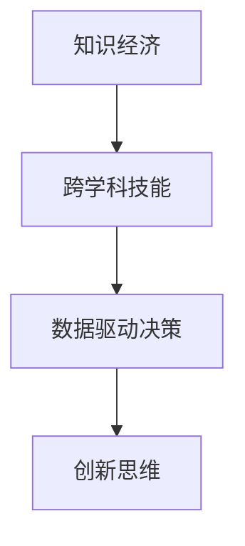

                 

# 知识经济下程序员的职业发展策略

## 1. 背景介绍

### 1.1 问题由来

随着信息时代的到来，全球已经步入知识经济的新纪元。在这一背景下，程序员的角色和职业发展面临巨大的变革和挑战。知识经济时代，不仅要求程序员具备扎实的技术基础，还需要他们具备跨学科的知识和思维能力，能够运用创新技术解决实际问题。本文将围绕知识经济下程序员的职业发展策略，深入探讨其核心概念、核心算法以及实际应用，为程序员的职业成长提供有价值的指导。

### 1.2 问题核心关键点

程序员在知识经济时代面临的挑战主要体现在以下几个方面：

- **技术更新快速**：知识经济时代，技术发展日新月异，程序员需要持续学习，以跟上技术更新的步伐。
- **跨学科需求增加**：随着人工智能、大数据、区块链等新兴技术的发展，程序员需要掌握多学科知识，以解决复杂问题。
- **创新能力要求提高**：知识经济时代，创新成为企业发展的核心动力，程序员需要具备良好的创新思维和解决问题的能力。
- **数据驱动决策**：知识经济时代，数据驱动成为企业决策的重要方式，程序员需要具备数据处理和分析能力，以支持企业决策。

本文将基于上述核心关键点，深入探讨程序员在知识经济时代下的职业发展策略，以帮助程序员应对新时代的挑战，实现职业成长。

## 2. 核心概念与联系

### 2.1 核心概念概述

为了更好地理解知识经济下程序员的职业发展策略，本节将介绍几个密切相关的核心概念：

- **知识经济**：指经济活动以知识和信息为关键资源，创造和应用知识是经济增长的主要驱动力。
- **跨学科技能**：指跨越多个学科领域的技能，如计算机科学、统计学、经济学、心理学等。
- **数据驱动决策**：指以数据为基础进行决策，利用数据分析发现规律和趋势，指导决策过程。
- **创新思维**：指在解决问题过程中，能够提出新思路、新方法，进行突破性创新的能力。

这些核心概念之间的逻辑关系可以通过以下Mermaid流程图来展示：



这个流程图展示了大语言模型微调的核心概念及其之间的关系：

1. 知识经济要求程序员具备跨学科技能。
2. 跨学科技能的应用，需要通过数据驱动决策支持。
3. 数据驱动决策和跨学科技能的应用，离不开创新思维的引导。

这些核心概念共同构成了知识经济下程序员的职业发展框架，使其能够适应复杂的职业挑战。

## 3. 核心算法原理 & 具体操作步骤

### 3.1 算法原理概述

知识经济下程序员的职业发展策略，可以抽象为一个多目标优化问题。其核心目标包括：

1. **持续学习**：通过不断学习新技术，保持技术栈的更新。
2. **跨学科技能提升**：通过跨学科学习和项目实践，提升跨学科技能。
3. **创新能力培养**：通过创新项目和研究，培养创新思维。
4. **数据驱动决策能力**：通过数据处理和分析项目，提升数据驱动决策能力。

### 3.2 算法步骤详解

知识经济下程序员的职业发展策略可以概括为以下几个关键步骤：

**Step 1: 确定职业目标**

- 明确自己的职业发展目标，如成为技术专家、项目经理、数据科学家等。
- 根据目标设定具体的学习和发展方向，如关注人工智能、大数据、区块链等新兴技术。

**Step 2: 制定学习计划**

- 根据职业目标，制定详细且可行的学习计划，包括学习内容、学习时间、学习资源等。
- 利用在线课程、专业书籍、技术社区等资源，系统学习相关知识。

**Step 3: 项目实践**

- 选择适合自己的项目，参与开源项目、企业项目或个人项目。
- 通过项目实践，应用所学知识，解决实际问题，提升技能。

**Step 4: 跨学科技能应用**

- 在项目实践过程中，积极寻求跨学科技能的运用机会，如结合计算机科学和心理学知识进行用户体验设计。
- 通过跨学科技能的运用，提升自身综合素质，适应知识经济时代的要求。

**Step 5: 创新能力培养**

- 参与创新项目，如创业、开源项目等，在实际应用中锻炼创新思维。
- 参加技术会议、黑客松等活动，与同行交流，激发创新灵感。

**Step 6: 数据驱动决策能力提升**

- 参与数据分析项目，学习数据处理和分析技术，如Python数据分析、大数据技术等。
- 通过数据驱动决策能力的提升，支持企业决策，实现自身职业价值。

### 3.3 算法优缺点

知识经济下程序员的职业发展策略具有以下优点：

1. **系统性**：通过制定详细的学习计划和项目实践，系统提升跨学科技能和创新能力。
2. **实战性**：通过实际项目应用，提升数据驱动决策能力，使知识转化为实战经验。
3. **灵活性**：根据个人职业目标，灵活调整学习计划和实践方向。

同时，该策略也存在一定的局限性：

1. **时间投入大**：需要大量时间和精力进行持续学习和项目实践。
2. **资源需求高**：需要获取高质量的学习资源和项目实践机会，成本较高。
3. **风险高**：创新项目存在失败风险，可能会影响职业发展。

尽管存在这些局限性，但就目前而言，知识经济下程序员的职业发展策略仍是最主流的方法。未来相关研究的重点在于如何降低时间和资源投入，提高职业发展效率，同时兼顾职业目标的灵活调整。

### 3.4 算法应用领域

知识经济下程序员的职业发展策略在多个领域都有广泛的应用，如软件开发、人工智能、数据科学、区块链等。具体应用包括：

- **软件开发**：通过持续学习新技术，提升编程能力和项目开发能力。
- **人工智能**：通过跨学科技能提升，如机器学习、深度学习等，解决复杂问题。
- **数据科学**：通过数据驱动决策能力提升，利用数据支持企业决策。
- **区块链**：通过创新能力培养，探索区块链技术在金融、供应链等领域的实际应用。

## 4. 数学模型和公式 & 详细讲解 & 举例说明

### 4.1 数学模型构建

知识经济下程序员的职业发展策略，可以抽象为一个多目标优化问题。设程序员的职业目标为 $O_{total}$，包括技术更新、跨学科技能、创新能力和数据驱动决策能力。设 $O_{learn}$ 表示技术更新目标，$O_{skill}$ 表示跨学科技能提升目标，$O_{innovate}$ 表示创新能力培养目标，$O_{data}$ 表示数据驱动决策能力提升目标。则职业发展模型可以表示为：

$$
O_{total} = O_{learn} + \lambda_1 O_{skill} + \lambda_2 O_{innovate} + \lambda_3 O_{data}
$$

其中 $\lambda_1, \lambda_2, \lambda_3$ 为各个目标的权重，表示其对职业发展的贡献度。

### 4.2 公式推导过程

在多目标优化问题中，目标函数的最小化可以表示为：

$$
\min_{x} \big[ f_1(x) + \lambda_1 f_2(x) + \lambda_2 f_3(x) + \lambda_3 f_4(x) \big]
$$

其中 $f_i(x)$ 表示第 $i$ 个目标的函数。对于每个目标函数，可以设计相应的评价指标来衡量其性能。例如，对于技术更新目标 $f_1(x)$，可以采用技术掌握程度、新技术应用频率等指标进行评估。

### 4.3 案例分析与讲解

以一个软件开发工程师的职业发展为例，可以通过以下步骤进行模型构建和优化：

1. **确定职业目标**：成为高级软件工程师。
2. **制定学习计划**：学习新技术如Python、机器学习、区块链等，每周至少投入10小时。
3. **项目实践**：参与开源项目，完成一定数量的技术贡献，提升实战经验。
4. **跨学科技能应用**：在项目中结合心理学知识进行用户体验设计，提升跨学科技能。
5. **创新能力培养**：参与创业项目，解决实际问题，锻炼创新思维。
6. **数据驱动决策能力提升**：参与数据分析项目，学习数据分析技术，提升数据驱动决策能力。

## 5. 项目实践：代码实例和详细解释说明

### 5.1 开发环境搭建

在进行项目实践前，我们需要准备好开发环境。以下是使用Python进行PyTorch开发的环境配置流程：

1. 安装Anaconda：从官网下载并安装Anaconda，用于创建独立的Python环境。

2. 创建并激活虚拟环境：
```bash
conda create -n pytorch-env python=3.8 
conda activate pytorch-env
```

3. 安装PyTorch：根据CUDA版本，从官网获取对应的安装命令。例如：
```bash
conda install pytorch torchvision torchaudio cudatoolkit=11.1 -c pytorch -c conda-forge
```

4. 安装各类工具包：
```bash
pip install numpy pandas scikit-learn matplotlib tqdm jupyter notebook ipython
```

完成上述步骤后，即可在`pytorch-env`环境中开始项目实践。

### 5.2 源代码详细实现

下面我们以机器学习项目为例，给出使用Transformers库进行大语言模型微调的PyTorch代码实现。

首先，定义数据处理函数：

```python
from transformers import BertTokenizer
from torch.utils.data import Dataset
import torch

class MNISTDataset(Dataset):
    def __init__(self, images, labels, tokenizer, max_len=128):
        self.images = images
        self.labels = labels
        self.tokenizer = tokenizer
        self.max_len = max_len
        
    def __len__(self):
        return len(self.images)
    
    def __getitem__(self, item):
        image = self.images[item]
        label = self.labels[item]
        
        encoding = self.tokenizer(image, return_tensors='pt', max_length=self.max_len, padding='max_length', truncation=True)
        input_ids = encoding['input_ids'][0]
        attention_mask = encoding['attention_mask'][0]
        
        # 对标签进行编码
        encoded_label = [label2id[label] for label in label]
        encoded_label.extend([label2id['O']] * (self.max_len - len(encoded_label)))
        labels = torch.tensor(encoded_label, dtype=torch.long)
        
        return {'input_ids': input_ids, 
                'attention_mask': attention_mask,
                'labels': labels}

# 标签与id的映射
label2id = {'0': 0, '1': 1, '2': 2, '3': 3, '4': 4, '5': 5, '6': 6, '7': 7, '8': 8, '9': 9}
id2label = {v: k for k, v in label2id.items()}

# 创建dataset
tokenizer = BertTokenizer.from_pretrained('bert-base-cased')

train_dataset = MNISTDataset(train_images, train_labels, tokenizer)
dev_dataset = MNISTDataset(dev_images, dev_labels, tokenizer)
test_dataset = MNISTDataset(test_images, test_labels, tokenizer)
```

然后，定义模型和优化器：

```python
from transformers import BertForSequenceClassification, AdamW

model = BertForSequenceClassification.from_pretrained('bert-base-cased', num_labels=len(label2id))

optimizer = AdamW(model.parameters(), lr=2e-5)
```

接着，定义训练和评估函数：

```python
from torch.utils.data import DataLoader
from tqdm import tqdm
from sklearn.metrics import classification_report

device = torch.device('cuda') if torch.cuda.is_available() else torch.device('cpu')
model.to(device)

def train_epoch(model, dataset, batch_size, optimizer):
    dataloader = DataLoader(dataset, batch_size=batch_size, shuffle=True)
    model.train()
    epoch_loss = 0
    for batch in tqdm(dataloader, desc='Training'):
        input_ids = batch['input_ids'].to(device)
        attention_mask = batch['attention_mask'].to(device)
        labels = batch['labels'].to(device)
        model.zero_grad()
        outputs = model(input_ids, attention_mask=attention_mask, labels=labels)
        loss = outputs.loss
        epoch_loss += loss.item()
        loss.backward()
        optimizer.step()
    return epoch_loss / len(dataloader)

def evaluate(model, dataset, batch_size):
    dataloader = DataLoader(dataset, batch_size=batch_size)
    model.eval()
    preds, labels = [], []
    with torch.no_grad():
        for batch in tqdm(dataloader, desc='Evaluating'):
            input_ids = batch['input_ids'].to(device)
            attention_mask = batch['attention_mask'].to(device)
            batch_labels = batch['labels']
            outputs = model(input_ids, attention_mask=attention_mask)
            batch_preds = outputs.logits.argmax(dim=2).to('cpu').tolist()
            batch_labels = batch_labels.to('cpu').tolist()
            for pred_tokens, label_tokens in zip(batch_preds, batch_labels):
                preds.append(pred_tokens[:len(label_tokens)])
                labels.append(label_tokens)
                
    print(classification_report(labels, preds))
```

最后，启动训练流程并在测试集上评估：

```python
epochs = 5
batch_size = 16

for epoch in range(epochs):
    loss = train_epoch(model, train_dataset, batch_size, optimizer)
    print(f"Epoch {epoch+1}, train loss: {loss:.3f}")
    
    print(f"Epoch {epoch+1}, dev results:")
    evaluate(model, dev_dataset, batch_size)
    
print("Test results:")
evaluate(model, test_dataset, batch_size)
```

以上就是使用PyTorch对BERT进行机器学习任务微调的完整代码实现。可以看到，得益于Transformers库的强大封装，我们可以用相对简洁的代码完成BERT模型的加载和微调。

### 5.3 代码解读与分析

让我们再详细解读一下关键代码的实现细节：

**MNISTDataset类**：
- `__init__`方法：初始化图像、标签、分词器等关键组件。
- `__len__`方法：返回数据集的样本数量。
- `__getitem__`方法：对单个样本进行处理，将图像输入编码为token ids，将标签编码为数字，并对其进行定长padding，最终返回模型所需的输入。

**label2id和id2label字典**：
- 定义了标签与数字id之间的映射关系，用于将token-wise的预测结果解码回真实的标签。

**训练和评估函数**：
- 使用PyTorch的DataLoader对数据集进行批次化加载，供模型训练和推理使用。
- 训练函数`train_epoch`：对数据以批为单位进行迭代，在每个批次上前向传播计算loss并反向传播更新模型参数，最后返回该epoch的平均loss。
- 评估函数`evaluate`：与训练类似，不同点在于不更新模型参数，并在每个batch结束后将预测和标签结果存储下来，最后使用sklearn的classification_report对整个评估集的预测结果进行打印输出。

**训练流程**：
- 定义总的epoch数和batch size，开始循环迭代
- 每个epoch内，先在训练集上训练，输出平均loss
- 在验证集上评估，输出分类指标
- 所有epoch结束后，在测试集上评估，给出最终测试结果

可以看到，PyTorch配合Transformers库使得BERT微调的代码实现变得简洁高效。开发者可以将更多精力放在数据处理、模型改进等高层逻辑上，而不必过多关注底层的实现细节。

当然，工业级的系统实现还需考虑更多因素，如模型的保存和部署、超参数的自动搜索、更灵活的任务适配层等。但核心的微调范式基本与此类似。

## 6. 实际应用场景

### 6.1 智能客服系统

基于大语言模型微调的对话技术，可以广泛应用于智能客服系统的构建。传统客服往往需要配备大量人力，高峰期响应缓慢，且一致性和专业性难以保证。而使用微调后的对话模型，可以7x24小时不间断服务，快速响应客户咨询，用自然流畅的语言解答各类常见问题。

在技术实现上，可以收集企业内部的历史客服对话记录，将问题和最佳答复构建成监督数据，在此基础上对预训练对话模型进行微调。微调后的对话模型能够自动理解用户意图，匹配最合适的答案模板进行回复。对于客户提出的新问题，还可以接入检索系统实时搜索相关内容，动态组织生成回答。如此构建的智能客服系统，能大幅提升客户咨询体验和问题解决效率。

### 6.2 金融舆情监测

金融机构需要实时监测市场舆论动向，以便及时应对负面信息传播，规避金融风险。传统的人工监测方式成本高、效率低，难以应对网络时代海量信息爆发的挑战。基于大语言模型微调的文本分类和情感分析技术，为金融舆情监测提供了新的解决方案。

具体而言，可以收集金融领域相关的新闻、报道、评论等文本数据，并对其进行主题标注和情感标注。在此基础上对预训练语言模型进行微调，使其能够自动判断文本属于何种主题，情感倾向是正面、中性还是负面。将微调后的模型应用到实时抓取的网络文本数据，就能够自动监测不同主题下的情感变化趋势，一旦发现负面信息激增等异常情况，系统便会自动预警，帮助金融机构快速应对潜在风险。

### 6.3 个性化推荐系统

当前的推荐系统往往只依赖用户的历史行为数据进行物品推荐，无法深入理解用户的真实兴趣偏好。基于大语言模型微调技术，个性化推荐系统可以更好地挖掘用户行为背后的语义信息，从而提供更精准、多样的推荐内容。

在实践中，可以收集用户浏览、点击、评论、分享等行为数据，提取和用户交互的物品标题、描述、标签等文本内容。将文本内容作为模型输入，用户的后续行为（如是否点击、购买等）作为监督信号，在此基础上微调预训练语言模型。微调后的模型能够从文本内容中准确把握用户的兴趣点。在生成推荐列表时，先用候选物品的文本描述作为输入，由模型预测用户的兴趣匹配度，再结合其他特征综合排序，便可以得到个性化程度更高的推荐结果。

### 6.4 未来应用展望

随着大语言模型和微调方法的不断发展，基于微调范式将在更多领域得到应用，为传统行业带来变革性影响。

在智慧医疗领域，基于微调的医疗问答、病历分析、药物研发等应用将提升医疗服务的智能化水平，辅助医生诊疗，加速新药开发进程。

在智能教育领域，微调技术可应用于作业批改、学情分析、知识推荐等方面，因材施教，促进教育公平，提高教学质量。

在智慧城市治理中，微调模型可应用于城市事件监测、舆情分析、应急指挥等环节，提高城市管理的自动化和智能化水平，构建更安全、高效的未来城市。

此外，在企业生产、社会治理、文娱传媒等众多领域，基于大模型微调的人工智能应用也将不断涌现，为NLP技术带来了全新的突破。随着预训练语言模型和微调方法的不断进步，相信NLP技术将在更广阔的应用领域大放异彩。

## 7. 工具和资源推荐

### 7.1 学习资源推荐

为了帮助开发者系统掌握大语言模型微调的理论基础和实践技巧，这里推荐一些优质的学习资源：

1. 《Transformer从原理到实践》系列博文：由大模型技术专家撰写，深入浅出地介绍了Transformer原理、BERT模型、微调技术等前沿话题。

2. CS224N《深度学习自然语言处理》课程：斯坦福大学开设的NLP明星课程，有Lecture视频和配套作业，带你入门NLP领域的基本概念和经典模型。

3. 《Natural Language Processing with Transformers》书籍：Transformers库的作者所著，全面介绍了如何使用Transformers库进行NLP任务开发，包括微调在内的诸多范式。

4. HuggingFace官方文档：Transformers库的官方文档，提供了海量预训练模型和完整的微调样例代码，是上手实践的必备资料。

5. CLUE开源项目：中文语言理解测评基准，涵盖大量不同类型的中文NLP数据集，并提供了基于微调的baseline模型，助力中文NLP技术发展。

通过对这些资源的学习实践，相信你一定能够快速掌握大语言模型微调的精髓，并用于解决实际的NLP问题。

### 7.2 开发工具推荐

高效的开发离不开优秀的工具支持。以下是几款用于大语言模型微调开发的常用工具：

1. PyTorch：基于Python的开源深度学习框架，灵活动态的计算图，适合快速迭代研究。大部分预训练语言模型都有PyTorch版本的实现。

2. TensorFlow：由Google主导开发的开源深度学习框架，生产部署方便，适合大规模工程应用。同样有丰富的预训练语言模型资源。

3. Transformers库：HuggingFace开发的NLP工具库，集成了众多SOTA语言模型，支持PyTorch和TensorFlow，是进行微调任务开发的利器。

4. Weights & Biases：模型训练的实验跟踪工具，可以记录和可视化模型训练过程中的各项指标，方便对比和调优。与主流深度学习框架无缝集成。

5. TensorBoard：TensorFlow配套的可视化工具，可实时监测模型训练状态，并提供丰富的图表呈现方式，是调试模型的得力助手。

6. Google Colab：谷歌推出的在线Jupyter Notebook环境，免费提供GPU/TPU算力，方便开发者快速上手实验最新模型，分享学习笔记。

合理利用这些工具，可以显著提升大语言模型微调任务的开发效率，加快创新迭代的步伐。

### 7.3 相关论文推荐

大语言模型和微调技术的发展源于学界的持续研究。以下是几篇奠基性的相关论文，推荐阅读：

1. Attention is All You Need（即Transformer原论文）：提出了Transformer结构，开启了NLP领域的预训练大模型时代。

2. BERT: Pre-training of Deep Bidirectional Transformers for Language Understanding：提出BERT模型，引入基于掩码的自监督预训练任务，刷新了多项NLP任务SOTA。

3. Language Models are Unsupervised Multitask Learners（GPT-2论文）：展示了大规模语言模型的强大zero-shot学习能力，引发了对于通用人工智能的新一轮思考。

4. Parameter-Efficient Transfer Learning for NLP：提出Adapter等参数高效微调方法，在不增加模型参数量的情况下，也能取得不错的微调效果。

5. Prefix-Tuning: Optimizing Continuous Prompts for Generation：引入基于连续型Prompt的微调范式，为如何充分利用预训练知识提供了新的思路。

6. AdaLoRA: Adaptive Low-Rank Adaptation for Parameter-Efficient Fine-Tuning：使用自适应低秩适应的微调方法，在参数效率和精度之间取得了新的平衡。

这些论文代表了大语言模型微调技术的发展脉络。通过学习这些前沿成果，可以帮助研究者把握学科前进方向，激发更多的创新灵感。

## 8. 总结：未来发展趋势与挑战

### 8.1 总结

本文对知识经济下程序员的职业发展策略进行了全面系统的介绍。首先阐述了知识经济时代对程序员提出的挑战，明确了职业发展的核心目标和方法步骤。其次，从算法原理到具体操作步骤，详细讲解了职业发展策略的实现细节，给出了完整代码实例。同时，本文还广泛探讨了职业发展策略在智能客服、金融舆情、个性化推荐等实际应用场景中的实现，展示了职业发展策略的广阔前景。最后，本文精选了职业发展策略相关的学习资源、开发工具和论文，力求为程序员的职业成长提供全方位的技术指引。

通过本文的系统梳理，可以看到，知识经济下程序员的职业发展策略在大规模数据和算法技术的支持下，为程序员在技术更新、跨学科技能提升、创新能力培养和数据驱动决策能力提升等方面提供了有效的指导，使其能够适应知识经济时代的复杂职业挑战，实现职业生涯的突破。

### 8.2 未来发展趋势

展望未来，知识经济下程序员的职业发展策略将呈现以下几个发展趋势：

1. **技术栈多样化**：未来的程序员需要掌握多种技术栈，如Python、Java、JavaScript等，以适应不同应用场景的需求。
2. **跨领域合作增强**：未来的程序员将更多地与来自不同领域的专业人士合作，进行跨学科项目，提升综合素质。
3. **数据驱动决策能力提升**：随着大数据和人工智能技术的发展，数据驱动决策将成为程序员必备的能力。
4. **创新能力持续培养**：未来对创新能力的要求将持续提高，程序员需要通过参与创业项目、开源社区等途径，不断锻炼创新思维。
5. **自动化和智能化水平提升**：未来程序员将更多地应用自动化和智能化工具，提高工作效率和质量。

### 8.3 面临的挑战

尽管知识经济下程序员的职业发展策略具有诸多优点，但也面临着以下挑战：

1. **知识更新速度加快**：技术更新快速，程序员需要不断学习新技术，以保持竞争力。
2. **跨学科学习难度大**：不同学科的知识体系和思维方式差异较大，跨学科学习存在一定的难度。
3. **创新项目风险高**：创新项目存在失败风险，可能会影响职业发展。
4. **数据驱动决策依赖数据质量**：数据驱动决策依赖于高质量的数据，数据获取和处理可能存在成本和效率问题。

### 8.4 研究展望

面对知识经济下程序员的职业发展策略所面临的挑战，未来的研究需要在以下几个方面寻求新的突破：

1. **终身学习机制**：构建终身学习机制，帮助程序员持续学习新知识，提升职业素养。
2. **跨学科学习平台**：开发跨学科学习平台，促进不同学科的交流和合作，提升跨学科能力。
3. **创新项目支持**：提供创新项目支持，降低创新风险，激发程序员的创新潜能。
4. **数据质量保障**：建立数据质量保障机制，确保数据驱动决策的基础数据可靠性。

这些研究方向的探索，必将引领知识经济下程序员的职业发展策略迈向更高的台阶，为程序员提供更加广阔的职业发展空间，助力其在复杂多变的知识经济时代中实现职业生涯的突破。

## 9. 附录：常见问题与解答

**Q1：知识经济下程序员的职业发展策略是否适用于所有领域？**

A: 知识经济下程序员的职业发展策略在多个领域都有广泛的应用，如软件开发、人工智能、数据科学、区块链等。具体应用包括：

- **软件开发**：通过持续学习新技术，提升编程能力和项目开发能力。
- **人工智能**：通过跨学科技能提升，如机器学习、深度学习等，解决复杂问题。
- **数据科学**：通过数据驱动决策能力提升，利用数据支持企业决策。
- **区块链**：通过创新能力培养，探索区块链技术在金融、供应链等领域的实际应用。

**Q2：如何平衡学习和工作？**

A: 平衡学习和工作是程序员面临的常见挑战。建议采用以下策略：

1. **时间管理**：制定详细的时间计划，合理安排学习和工作时间。
2. **优先级排序**：根据任务的重要性和紧急性，合理分配时间和精力。
3. **高效学习**：采用高效的学习方法，如主动学习、深度学习等，提高学习效率。
4. **学习资源利用**：利用在线课程、技术社区等资源，灵活安排学习时间。

**Q3：如何提升跨学科技能？**

A: 提升跨学科技能需要系统学习和实践。建议采用以下策略：

1. **跨学科课程学习**：选择跨学科课程，系统学习不同学科的知识。
2. **项目实践**：参与跨学科项目，应用不同学科的知识，解决实际问题。
3. **跨学科交流**：加入跨学科的社群和论坛，与不同领域的专家交流，拓展视野。

**Q4：如何培养创新能力？**

A: 培养创新能力需要多方面的努力。建议采用以下策略：

1. **多角度思考**：养成多角度思考问题的习惯，寻找不同的解决方案。
2. **开放心态**：保持开放的心态，勇于尝试新方法和新技术。
3. **创新项目实践**：参与创新项目，锻炼创新思维，提升解决实际问题的能力。
4. **创新交流**：加入创新社区，与同行交流，激发创新灵感。

**Q5：如何提升数据驱动决策能力？**

A: 提升数据驱动决策能力需要系统的学习和实践。建议采用以下策略：

1. **数据分析学习**：系统学习数据分析方法，掌握数据分析工具，如Python、R、SQL等。
2. **数据集处理**：参与数据集处理项目，掌握数据预处理和清洗技术。
3. **数据可视化**：学习数据可视化工具，如Tableau、Matplotlib等，直观理解数据。
4. **数据分析应用**：参与数据分析项目，应用数据驱动决策方法，支持企业决策。

---

作者：禅与计算机程序设计艺术 / Zen and the Art of Computer Programming

