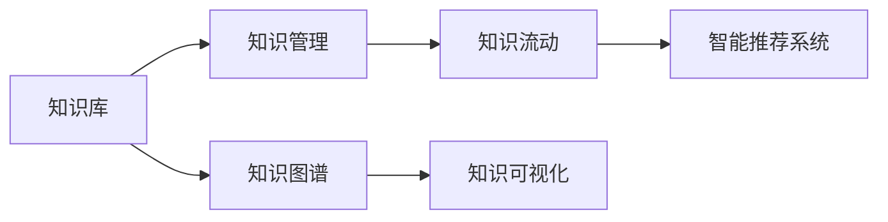

                 

# 知识输出与管理经验的系统化

在快速发展的数字时代，知识输出与管理经验的系统化成为企业和技术团队成功的关键。本文旨在深入探讨这一主题，从理论到实践，提供系统的视角和方法，帮助读者理解并实现有效的知识输出与经验管理，以推动组织创新和效率提升。

## 1. 背景介绍

### 1.1 问题由来

在科技日新月异的今天，企业和技术团队面临着前所未有的挑战。无论是知识爆炸还是信息过载，都需要高效、系统地管理和输出知识，以保持竞争力。传统的手工记录、经验积累方法已经难以应对复杂多变的需求。因此，如何系统化地管理和输出知识，提升团队协作和创新能力，成为现代企业亟待解决的问题。

### 1.2 问题核心关键点

系统化知识输出与经验管理的关键点包括：

- 构建知识库：有效地组织和存储各类知识，便于检索和利用。
- 优化知识流动：通过流程设计和管理，促进知识在团队中的高效传递。
- 智能化的知识应用：利用技术手段，提升知识获取和应用效率。
- 持续学习与创新：建立机制，促进知识持续更新和团队不断创新。

## 2. 核心概念与联系

### 2.1 核心概念概述

为更好地理解知识输出与管理经验的系统化，本节将介绍几个核心概念：

- **知识库(Knowledge Base)**：存储和组织各类知识的数据库，支持快速检索和应用。
- **知识图谱(Knowledge Graph)**：以图的形式表示知识关系，便于理解和管理。
- **知识管理(Knowledge Management)**：系统的规划、实施和维护知识，确保知识的高效利用。
- **知识流动(Knowledge Flow)**：知识在组织内部的传播与协作过程。
- **知识可视化(Knowledge Visualization)**：将知识以图表等形式展现，便于理解与传播。
- **智能推荐系统(Recommendation System)**：根据用户行为和偏好，推荐相关知识。

这些核心概念之间通过相互关联，形成一个完整的知识输出与经验管理系统。

### 2.2 核心概念原理和架构的 Mermaid 流程图



该图展示了知识库、知识图谱、知识管理、知识流动、知识可视化、智能推荐系统等核心概念的联系与架构。

## 3. 核心算法原理 & 具体操作步骤

### 3.1 算法原理概述

知识输出与管理经验系统化的一个关键技术是构建知识图谱。知识图谱通过将知识以图的形式表示，揭示了知识之间的内在联系，使得知识的管理和应用更加高效。核心算法包括：

- 本体构建(Ontology Construction)：定义知识的基本元素和关系。
- 知识抽取(Knowledge Extraction)：从非结构化数据中抽取结构化知识。
- 知识融合(Knowledge Fusion)：将多个来源的知识进行整合和冲突消解。
- 知识推理(Knowledge Reasoning)：通过逻辑推理，挖掘知识间的深层联系。

### 3.2 算法步骤详解

1. **本体构建**：定义知识图谱的基本元素和关系，构建知识的本体框架。
2. **知识抽取**：利用NLP、规则等技术，从非结构化数据中提取知识。
3. **知识融合**：将不同来源的知识进行匹配、合并和冲突消解。
4. **知识推理**：通过规则或机器学习模型，推导出新的知识。
5. **知识可视化**：将知识图谱以图表形式展现，便于理解与传播。

### 3.3 算法优缺点

**优点**：

- **结构化管理**：知识图谱将知识以结构化形式表示，便于管理和应用。
- **高效检索**：通过图谱结构，可以快速定位和检索知识。
- **可视化展现**：图表形式使得知识更加直观易懂。

**缺点**：

- **复杂度高**：知识图谱的构建和维护需要较高的时间和资源投入。
- **数据质量要求高**：图谱的质量依赖于输入数据的准确性和完整性。
- **技术门槛高**：需要掌握本体构建、知识抽取、知识融合等多项技术。

### 3.4 算法应用领域

知识图谱和知识管理技术在多个领域都有广泛应用，例如：

- **医疗领域**：构建医学知识图谱，支持诊断和治疗方案的推荐。
- **金融领域**：构建金融知识图谱，支持风险评估和投资建议。
- **电商领域**：构建产品知识图谱，支持个性化推荐和搜索。
- **教育领域**：构建教育知识图谱，支持在线学习与辅导。

## 4. 数学模型和公式 & 详细讲解 & 举例说明

### 4.1 数学模型构建

知识图谱的数学模型通常采用图数据库和图算法来实现。知识图谱的基本单位是**实体(Entity)**和**关系(Relation)**，通过边的连接构建知识图谱。

### 4.2 公式推导过程

1. **实体关系定义**：
   - 实体：$e = (e_1, e_2, ..., e_n)$，其中 $e_i$ 为实体属性。
   - 关系：$r = (r_1, r_2, ..., r_m)$，其中 $r_i$ 为关系属性。

2. **知识图谱构建**：
   - 图数据库：$G(V, E)$，其中 $V$ 为节点集，$E$ 为边集。

3. **知识推理**：
   - 基于规则的推理：$P_{rule} = P_{rule}(O)$，其中 $P_{rule}$ 为规则集，$O$ 为前提。
   - 基于模型的推理：$P_{model} = P_{model}(G, O)$，其中 $G$ 为知识图谱，$O$ 为前提。

### 4.3 案例分析与讲解

以金融领域的知识图谱为例，展示知识图谱的构建和应用：

1. **本体构建**：定义金融领域的基本概念，如股票、基金、债券等。
2. **知识抽取**：从金融新闻、报告等非结构化数据中抽取知识，如某股票的当前股价、历史表现等。
3. **知识融合**：将多个数据源的知识进行整合，消除冲突。
4. **知识推理**：利用图谱推理，预测某股票的未来走势。

## 5. 项目实践：代码实例和详细解释说明

### 5.1 开发环境搭建

为便于开发和实验，本文使用Python和Neo4j作为技术栈。

1. **安装Python**：
   ```bash
   sudo apt-get update
   sudo apt-get install python3-pip
   ```

2. **安装Neo4j**：
   ```bash
   wget https://neo4j.com/download -
   sudo dpkg -i neo4j-*.deb
   ```

3. **安装Python的Neo4j驱动程序**：
   ```bash
   pip install neo4j
   ```

### 5.2 源代码详细实现

以下是一个简单的知识图谱构建和查询示例，展示如何利用Python和Neo4j实现知识图谱的构建和管理：

```python
from neo4j import GraphDatabase

# 连接到Neo4j数据库
driver = GraphDatabase.driver("bolt://localhost:7687", auth=("neo4j", "password"))

# 构建知识图谱
with driver.session() as session:
    session.run(
        """
        CREATE (a:Person {name:"Alice", age:30})-[:KNOWS]->(b:Person {name:"Bob", age:40})
        CREATE (a:Person {name:"Alice", age:30})-[:READS]->(c:Book {title:"The Great Gatsby"})
        CREATE (d:Book {title:"To Kill a Mockingbird"})-[:AUTHOR]->(e:Person {name:"Harper Lee"})
        """
    )

# 查询知识图谱
result = session.run("MATCH (a:Person)-[:KNOWS]->(b:Person) RETURN a.name, b.name")

# 输出结果
for record in result:
    print(record["a.name"], record["b.name"])
```

### 5.3 代码解读与分析

上述代码展示了如何创建和查询知识图谱的基本操作。首先连接到Neo4j数据库，然后使用Cypher语言构建和查询图谱。代码简洁明了，易于理解，是实践知识图谱的良好入门。

## 6. 实际应用场景

### 6.1 智能医疗

在智能医疗领域，知识图谱可以帮助医生快速获取各类医学知识和文献，支持临床决策和治疗方案的推荐。例如，医生可以根据患者症状，从知识图谱中检索出相关疾病和治疗方案，提高诊断和治疗的准确性和效率。

### 6.2 金融投资

金融领域的知识图谱可以用于风险评估和投资建议。通过构建金融知识图谱，系统可以自动分析市场趋势和公司财报，预测股票或基金的未来走势，提供个性化的投资建议。

### 6.3 电商推荐

电商平台的知识图谱可以用于个性化推荐和搜索。通过构建商品、用户和评价之间的知识图谱，系统可以自动推荐符合用户偏好的商品，提升用户满意度和转化率。

### 6.4 未来应用展望

随着技术的不断进步，知识图谱和知识管理的应用将更加广泛。未来，知识图谱将更加智能化，能够自动更新和修正，提升知识的准确性和时效性。智能推荐系统也将更加精准，基于用户行为和情感进行动态推荐。

## 7. 工具和资源推荐

### 7.1 学习资源推荐

1. **《知识图谱与语义技术》**：全面介绍知识图谱的基本原理和应用，适合入门学习。
2. **《Neo4j官方文档》**：详细介绍了Neo4j数据库的使用方法和API接口，是实践知识图谱的首选资源。
3. **Coursera课程**：提供关于知识图谱和语义技术的在线课程，由斯坦福大学和加州大学伯克利分校等名校教授主讲。
4. **Kaggle竞赛**：通过参加相关竞赛，实践和提升知识图谱的构建和应用能力。

### 7.2 开发工具推荐

1. **Python**：强大的编程语言，广泛用于知识图谱的构建和应用。
2. **Neo4j**：优秀的图形数据库，支持复杂查询和图算法。
3. **Jupyter Notebook**：交互式的编程环境，便于实验和分享知识图谱的构建过程。
4. **ELK Stack**：用于数据存储、管理和可视化的开源工具栈，支持多种数据源和查询语言。

### 7.3 相关论文推荐

1. **Knowledge Graphs: Creating and Using Knowledge Based Networks**：总结了知识图谱的基本概念和构建方法。
2. **A Survey of Knowledge Graphs for Healthcare**：介绍知识图谱在医疗领域的应用，包括构建、查询和推理。
3. **Graph Neural Networks**：讨论了图神经网络在知识图谱中的应用，提升图谱的推理和预测能力。

## 8. 总结：未来发展趋势与挑战

### 8.1 总结

本文深入探讨了知识输出与管理经验的系统化方法，从理论到实践，提供系统的视角和方法。通过构建知识图谱和优化知识流动，可以实现高效的知识管理和应用。系统化的知识输出与管理经验，不仅提升团队协作和创新能力，还促进了企业和技术团队的成功。

### 8.2 未来发展趋势

未来知识图谱和知识管理的趋势包括：

1. **智能化**：通过AI技术，实现知识图谱的自动更新和修正，提升知识的准确性和时效性。
2. **个性化**：基于用户行为和情感，提供个性化的知识推荐和服务。
3. **跨领域**：知识图谱将跨越不同领域，形成全面的知识体系。
4. **云化**：知识图谱和知识管理将更加云化，便于访问和协作。

### 8.3 面临的挑战

尽管知识图谱和知识管理技术不断发展，但仍面临以下挑战：

1. **数据质量**：知识图谱的准确性和完整性依赖于高质量的数据输入。
2. **技术门槛**：知识图谱的构建和维护需要高技术门槛。
3. **隐私和安全**：保护用户隐私和数据安全是知识图谱应用中的重要问题。

### 8.4 研究展望

未来的研究需要在以下方面取得新的突破：

1. **自动化构建**：开发更加自动化和智能化的知识图谱构建工具。
2. **跨领域融合**：推动知识图谱与其他技术的深度融合，如AI、大数据等。
3. **隐私保护**：研究隐私保护技术，确保知识图谱的构建和使用过程中的数据安全。
4. **智能推理**：提升知识图谱的推理和预测能力，支持更复杂的决策和应用。

## 9. 附录：常见问题与解答

**Q1: 知识图谱如何构建？**

A: 知识图谱的构建通常包括以下步骤：
1. **需求分析**：明确知识图谱的目标和范围。
2. **本体设计**：定义实体和关系，构建知识图谱的基本框架。
3. **数据收集**：从各种数据源收集相关数据。
4. **数据清洗**：清洗和处理数据，去除噪音和错误。
5. **知识抽取**：利用NLP等技术从数据中提取知识。
6. **知识融合**：将不同来源的知识进行整合和冲突消解。
7. **知识可视化**：将知识图谱以图表形式展现，便于理解与传播。

**Q2: 如何提升知识图谱的推理能力？**

A: 提升知识图谱的推理能力可以通过以下方法：
1. **规则推理**：定义逻辑规则，进行基于规则的推理。
2. **基于模型的推理**：利用机器学习模型，学习知识图谱中的隐含关系。
3. **跨模态融合**：将知识图谱与其他数据源（如文本、图像）进行融合，提升推理能力。
4. **动态更新**：定期更新知识图谱，反映最新的知识和变化。

**Q3: 如何处理知识图谱中的噪声和冲突？**

A: 处理知识图谱中的噪声和冲突可以通过以下方法：
1. **数据清洗**：对数据进行清洗和处理，去除噪声和错误。
2. **规则验证**：利用规则验证知识图谱的一致性和完整性。
3. **冲突消解**：利用冲突消解算法，解决实体和关系之间的冲突。
4. **人工审核**：结合人工审核，确保知识图谱的质量和准确性。

作者：禅与计算机程序设计艺术 / Zen and the Art of Computer Programming

