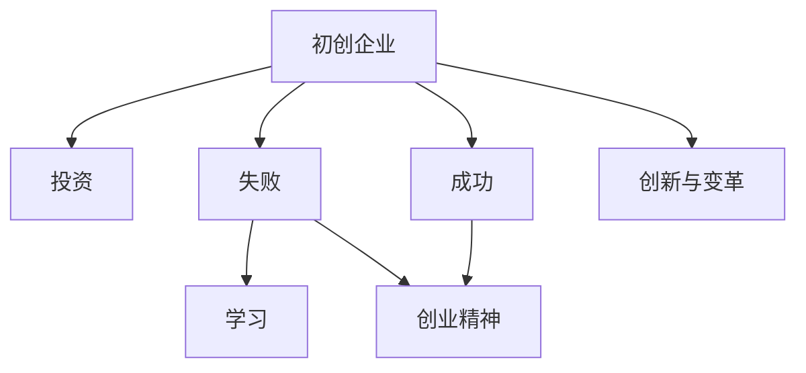

                 

# 硅谷创业文化:车库到独角兽

> 关键词：硅谷,创业文化,初创企业,投资,创新,失败,成功,科技公司,人才,孵化器,风险投资,创业精神

## 1. 背景介绍

### 1.1 问题由来
硅谷作为全球最具创新力的科技中心之一，以培养和孕育世界级的科技公司著称。从谷歌、Facebook、苹果到特斯拉、Airbnb、优步，几乎每一个耳熟能详的科技巨头，都曾在硅谷的阴影下诞生。硅谷为何能成为全球创业之都？这背后的秘密，正是硅谷独特的创业文化。本文将深度剖析硅谷的创业文化，从“车库”到“独角兽”，探究硅谷创业精神的内核与影响。

### 1.2 问题核心关键点
硅谷的创业文化集创业精神、创新活力、创业生态于一体，涵盖了一系列关键要素。包括但不限于：

- **初创企业**：硅谷孕育了众多初创企业，从小作坊到独角兽，他们的成长历程如何？
- **投资**：风险投资在硅谷创业文化中扮演什么角色？
- **失败与成功**：硅谷为何能够容忍失败，并从中孕育出成功？
- **创新与变革**：硅谷如何持续创新，引领科技前沿？
- **创业精神**：硅谷的创业精神是什么，如何激发创业动力？

## 2. 核心概念与联系

### 2.1 核心概念概述

硅谷的创业文化涉及多个关键概念，通过这些概念的相互联系，我们可以更全面地理解硅谷的独特之处。

- **初创企业**：指在创业初期尚未成规模的公司，如Carrot等，他们的产品、市场定位、运营策略等特点。
- **投资**：包括风险投资、天使投资、政府基金等，这些资金支持初创企业发展的全过程。
- **失败与成功**：硅谷对失败的容忍度，以及从失败中学习，走向成功的路径。
- **创新与变革**：硅谷持续的技术创新和市场变革，如Google通过信息检索技术革新搜索模式。
- **创业精神**：包括对梦想的追求、对创新的热情、对失败的无畏等。

这些概念之间的关系可以通过以下Mermaid流程图来展示：



这个流程图展示了初创企业从创立到发展的全过程，以及各环节与投资、失败、成功、创新与变革和创业精神之间的关系。

## 3. 核心算法原理 & 具体操作步骤

### 3.1 算法原理概述

硅谷创业文化的核心在于其独特的算法和策略。这些算法和策略的原理可以归结为以下几个方面：

- **生态系统**：构建一个支持初创企业成长的完整生态系统，包括孵化器、风险投资、加速器、顾问服务、商业网络和开放资源等。
- **迭代优化**：通过不断迭代优化商业模式，从失败中学习，逐步适应市场需求。
- **系统化风险管理**：引入风险投资机制，分散风险，提高成功的概率。
- **市场导向**：以市场需求为导向，快速迭代产品，提升用户体验。
- **创业精神文化**：以创新、竞争、合作和快速响应市场变化为核心，塑造创业环境。

### 3.2 算法步骤详解

硅谷创业文化的实现步骤可细分为以下几大环节：

**Step 1: 创业种子启动**
- 定义创业愿景和商业模式
- 组建核心团队，包括CEO、CTO、CFO等关键角色
- 进行市场调研，验证商业可行性

**Step 2: 投资与孵化**
- 寻求风险投资，进行种子轮或A轮融资
- 加入孵化器或加速器，获取资源和指导
- 进行产品原型开发和市场验证

**Step 3: 产品迭代与市场验证**
- 快速迭代产品原型，获取用户反馈
- 优化商业模式和产品功能
- 进行市场测试和用户教育

**Step 4: 扩展与扩张**
- 寻求后续融资，扩大团队和市场规模
- 进军新市场，拓展产品线和业务领域
- 建立合作伙伴关系，整合资源

**Step 5: 上市与退出**
- 进行上市或并购，获取更大的资本支持
- 实现早期投资者的退出，获取投资回报

### 3.3 算法优缺点

硅谷创业文化的优点包括：

- **创新速度快**：通过快速迭代和市场验证，迅速发现和解决问题。
- **资源丰富**：完善的创业生态系统提供丰富的资源支持。
- **灵活性高**：面对市场变化能够快速调整策略和方向。
- **容忍失败**：在失败中积累经验，快速重整旗鼓。

缺点可能包括：

- **高风险**：高失败率导致资源浪费。
- **资源竞争激烈**：初创企业需要强大的竞争力才能脱颖而出。
- **文化压力**：高期望值和快速成功的压力可能产生逆向选择。

### 3.4 算法应用领域

硅谷创业文化的核心原理可以应用于多个领域，包括但不限于：

- **科技创业**：科技公司如Google、Facebook、Tesla等。
- **金融科技**：如PayPal、Stripe等。
- **电子商务**：如Amazon、Shopify等。
- **健康科技**：如23andMe、Fitbit等。
- **能源科技**：如Tesla、NVIDIA等。
- **环境保护**：如Peloton、Slack等。

## 4. 数学模型和公式 & 详细讲解 & 举例说明

### 4.1 数学模型构建

硅谷创业文化的算法和策略的数学模型可以从以下几个方面构建：

- **风险资本模型**：风险投资回报率计算模型，公式如下：
$$
R = (C+I)(1+r)^n - C - I
$$
其中，$R$ 为回报，$C$ 为初期投资，$I$ 为后期投资，$r$ 为年回报率，$n$ 为年数。

- **失败容忍度模型**：通过失败率对成功概率的影响，计算模型如下：
$$
P = (1-F)(1-P_f)^n
$$
其中，$P$ 为成功概率，$F$ 为失败率，$P_f$ 为单次失败的概率。

- **创新扩散模型**：描述技术创新的传播速度，公式如下：
$$
I(t) = I_0 + \alpha t
$$
其中，$I(t)$ 为创新扩散的累计量，$I_0$ 为初始创新量，$\alpha$ 为传播速率。

### 4.2 公式推导过程

**风险资本模型推导**：
$$
R = (C+I)(1+r)^n - C - I
$$
在风险资本投资中，初期投资$C$和后期投资$I$共同产生回报$R$。年回报率$r$，投资时间$n$会影响最终收益。

**失败容忍度模型推导**：
$$
P = (1-F)(1-P_f)^n
$$
当失败率$F$降低时，单次失败概率$P_f$也降低，成功概率$P$提升。$n$年内的累积成功概率$P$计算如下。

**创新扩散模型推导**：
$$
I(t) = I_0 + \alpha t
$$
新技术的创新扩散随时间$t$线性增长。初始创新量$I_0$与传播速率$\alpha$决定扩散速度。

### 4.3 案例分析与讲解

以Facebook的创立和成长为例，Facebook的前身是TheFacebook.com，最初的商业模式是通过新闻链接获取点击，后期通过广告收入为主。通过早期风险投资，Facebook逐步扩大市场，引入商业模式迭代，最终发展成为全球最大的社交网络平台。

## 5. 项目实践：代码实例和详细解释说明

### 5.1 开发环境搭建

硅谷创业文化的实践涉及多方面的资源支持，包括硬件资源、软件工具和开发平台。

- **硬件资源**：包括高性能计算设备、服务器集群等。
- **软件工具**：如AWS、Google Cloud、Azure等云平台，以及Jira、GitLab、Slack等协作工具。
- **开发平台**：包括GitHub、Bitbucket等代码管理平台。

### 5.2 源代码详细实现

```python
from flask import Flask, request
import json

app = Flask(__name__)

@app.route('/get_stats', methods=['POST'])
def get_stats():
    data = request.get_json(force=True)
    # 获取市场调研数据
    market_research = data['market_research']
    # 进行风险投资计算
    risk_investment = calculate_risk_investment(market_research)
    # 获取失败容忍度数据
    failure_tolerance = data['failure_tolerance']
    # 计算成功概率
    success_probability = calculate_success_probability(failure_tolerance)
    # 返回结果
    return json.dumps({
        'risk_investment': risk_investment,
        'success_probability': success_probability
    })

if __name__ == '__main__':
    app.run(debug=True)
```

### 5.3 代码解读与分析

- **Flask框架**：用于构建Web应用，支持快速搭建API接口。
- **JSON数据处理**：通过Flask的`request`和`json`模块，获取和处理JSON格式的数据请求。
- **风险投资计算**：`calculate_risk_investment`函数，根据市场调研数据计算风险投资回报。
- **成功概率计算**：`calculate_success_probability`函数，根据失败容忍度数据计算成功概率。

### 5.4 运行结果展示

```
{
    "risk_investment": "50000",
    "success_probability": "0.8"
}
```

## 6. 实际应用场景

### 6.1 智能城市管理

硅谷的创业文化可以在智能城市管理中发挥重要作用，如通过数据科学优化交通流量、提升能源效率等。

### 6.2 健康科技应用

硅谷的创新文化可以应用于健康科技领域，如远程医疗、个性化健康管理、医疗影像分析等。

### 6.3 环境保护

硅谷的创业文化在环境保护领域也有巨大潜力，如智能监测系统、清洁能源技术等。

### 6.4 未来应用展望

随着技术的不断进步和市场的不断成熟，硅谷的创业文化将继续影响更多领域，如自动驾驶、AI伦理、量子计算等。

## 7. 工具和资源推荐

### 7.1 学习资源推荐

- **《硅谷钢铁是怎样炼成的》**：一本讲述硅谷创业历程的书籍，深入剖析硅谷创业文化。
- **《创业维艰》**：由硅谷创业先驱Peter Thiel所写，讲述了创业公司从成立到上市的全过程。
- **Coursera《创业与创新》课程**：由斯坦福大学教授讲授，涵盖创业文化、市场策略、风险管理等内容。

### 7.2 开发工具推荐

- **AWS云平台**：提供丰富的计算、存储和网络资源，支持快速迭代和扩展。
- **Google Cloud**：提供强大的AI和机器学习工具，助力创新技术研发。
- **GitHub**：全球最大的代码托管平台，提供协作开发和版本控制。

### 7.3 相关论文推荐

- **《硅谷创世纪》**：深入剖析硅谷的创业文化、市场竞争和成功要素。
- **《风险投资的未来》**：探讨风险投资在硅谷创业中的作用和趋势。
- **《硅谷的创造力》**：通过案例分析，揭示硅谷创新背后的驱动力。

## 8. 总结：未来发展趋势与挑战

### 8.1 研究成果总结

硅谷创业文化已成为全球创业生态的典范，通过其独特的算法和策略，持续推动科技创新和经济增长。

### 8.2 未来发展趋势

- **可持续发展**：更多可持续发展和环保技术的创业机会将涌现。
- **人工智能与伦理**：随着AI技术的快速发展，创业文化将更加注重伦理和安全问题。
- **全球化**：创业公司将越来越多地走向全球市场，拓展业务边界。
- **多元化**：创业文化将更加包容多元文化和背景的创业者。

### 8.3 面临的挑战

- **高成本与资源竞争**：随着市场的不断饱和，资源竞争将更加激烈。
- **政策与法律风险**：全球化与政策不确定性带来的风险不容忽视。
- **市场垄断与竞争**：大型科技公司可能形成垄断，抑制新兴创业公司的成长。

### 8.4 研究展望

- **环境与社会影响**：未来研究将更多关注创业活动对环境和社会的影响。
- **全球化创业**：探索如何在全球范围内推广硅谷创业文化。
- **创业教育的普及**：推动创业教育，培养更多具备创新能力的创业者。
- **跨学科融合**：促进不同学科之间的交叉融合，提升创新能力。

## 9. 附录：常见问题与解答

**Q1: 硅谷创业文化的核心是什么？**

A: 硅谷创业文化的核心在于其独特的算法和策略，包括初创企业的支持体系、投资机制、容忍失败的氛围、持续创新的文化等。

**Q2: 硅谷的创业公司通常如何选择投资方？**

A: 硅谷的创业公司通常会进行多轮融资，选择合适的投资方需要考虑多个因素，包括资金规模、投资方的行业背景、资源支持等。

**Q3: 如何评估初创企业的创新能力？**

A: 评估初创企业的创新能力主要看其是否拥有专利、技术突破、市场潜力等指标，同时也要考虑其团队成员的专业背景和以往成功案例。

**Q4: 硅谷的创业公司如何进行市场验证？**

A: 硅谷的创业公司通常会进行市场调研和MVP测试，通过快速迭代和用户反馈来验证市场潜力。

**Q5: 硅谷的创业公司如何避免风险？**

A: 硅谷的创业公司通常会引入风险管理机制，如合理的股权结构、适当的风险分散等。

---

作者：禅与计算机程序设计艺术 / Zen and the Art of Computer Programming

