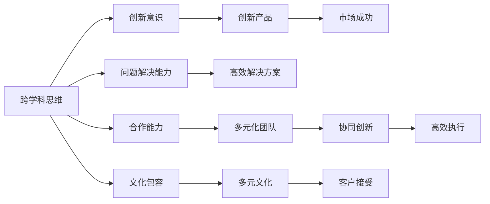

                 

# 硅谷创业者的非传统教育背景

## 1. 背景介绍

在当今硅谷，创业公司的创始人们通常被人们视为技术天才、创新者和企业家。他们的故事充满了风险、不确定性和令人振奋的成功。然而，这些成功背后，往往不仅仅是技术才华和商业智慧，还与他们独特而非传统的教育背景密切相关。本文将探讨硅谷创业者的多样化的教育背景，以及这些背景如何影响他们的创业理念和公司文化。

### 1.1 多样化教育背景的起源

硅谷的创业文化深受斯坦福大学、加州大学伯克利分校等顶尖高校的影响，但它的多样性和包容性使得成功之路变得多元。一些创始人可能具有工程学背景，而另一些则可能来自文学、艺术、哲学等完全不同的领域。这种多样性不仅是硅谷创业公司成功的源泉，也是其成为全球创新中心的原因之一。

### 1.2 成功案例

- **乔布斯与沃兹尼亚克**：乔布斯是斯坦福大学计算机科学专业的学生，而沃兹尼亚克则没有完成大学教育。他们在1976年共同创办了苹果公司。
- **埃隆·马斯克**：他拥有南非出生和多种语言背景，拥有应用物理学和经济学学位。他创立了PayPal、SpaceX和特斯拉等公司。
- **拉里·埃里森**：曾是哈佛大学的辍学生，最终成为了Oracle公司的创始人。
- **帕梅拉·比克**：她在斯坦福大学研究海洋生物学，后创办了生物技术公司BioEos。

这些例子表明，成功并不取决于传统教育路径。

## 2. 核心概念与联系

### 2.1 核心概念概述

- **跨学科思维**：许多硅谷创业者具备跨学科的知识背景，能够在不同领域之间建立新的联系。
- **创新意识**：非传统教育背景的创业者往往能够跳出常规思维，提出颠覆性的商业理念。
- **问题解决能力**：跨领域的背景使得创业者能够更灵活地应对复杂问题。
- **合作能力**：多元背景的团队更容易在项目中互补，推动创新和合作。

### 2.2 核心概念的联系

通过以下Mermaid流程图，可以更直观地理解这些概念之间的联系：



这个流程图展示了跨学科思维如何影响创业者的创新意识、问题解决能力、合作能力以及团队的多元文化背景，最终推动产品和市场成功。

## 3. 核心算法原理 & 具体操作步骤

### 3.1 算法原理概述

虽然硅谷创业者的教育背景多样化，但他们的成功之路并非没有规律。以下算法原理概述了他们成功的关键要素：

1. **多学科交叉学习**：通过跨学科学习，创业者能够获取多样化的知识和技能，从而更灵活地解决问题和创新。
2. **社会网络构建**：创业者通过各种社会活动和社区参与，建立起广泛的社交网络，为他们的初创企业吸引人才和资源。
3. **快速原型开发**：创业者快速构建最小可行产品（MVP），快速迭代改进，以验证市场需求。
4. **文化包容性**：多元文化背景的团队更容易容忍不同的观点和方法，促进创新和合作。

### 3.2 算法步骤详解

这些创业者成功的算法步骤大致如下：

1. **获取多元教育背景**：通过跨学科学习或独立学习，创业者获得多种知识和技能。
2. **构建社会网络**：积极参与行业会议、研讨会、社交活动等，建立广泛的社交联系。
3. **开发最小可行产品**：快速迭代产品，验证市场需求，获取用户反馈。
4. **推动文化包容**：创建一个多元文化的工作环境，鼓励不同背景的员工交流合作。
5. **持续学习和适应**：在实际应用中不断学习新知识，适应市场变化。

### 3.3 算法优缺点

**优点**：

- 促进创新思维和多元化视角
- 构建跨学科团队，提高问题解决能力
- 推动文化包容，提升团队凝聚力

**缺点**：

- 初期学习成本高
- 需要时间和资源去建立社会网络
- 多元化团队管理复杂

### 3.4 算法应用领域

这些算法和步骤不仅适用于创业环境，还广泛应用在各行业的创新和团队建设中。例如：

- **研发**：通过跨学科合作，解决复杂技术问题
- **教育**：培养具有多元背景的学生，促进创新思维
- **文化创意**：创作多元风格的艺术作品，吸引不同背景的观众

## 4. 数学模型和公式 & 详细讲解 & 举例说明

### 4.1 数学模型构建

本节将通过一个简单的数学模型来说明硅谷创业者如何通过多元教育背景来提升创新和解决问题的能力。

**假设一个创业者在科技、艺术和商业三个领域都有深入研究，可以表示为矩阵 $A$：**

$$
A = \begin{bmatrix}
1 & 0 & 1 \\
1 & 1 & 0 \\
0 & 1 & 1 \\
\end{bmatrix}
$$

其中，$A_{i,j}$ 表示第 $i$ 个领域中的 $j$ 个元素的重要性。例如，$A_{1,1}=1$ 表示在科技领域中，创新能力的重要性为1，而 $A_{1,2}=0$ 表示在艺术领域中，创新能力的重要性为0。

**创业者可以通过矩阵乘法计算其综合创新能力 $B$：**

$$
B = A \times A^T = \begin{bmatrix}
2 & 1 & 1 \\
1 & 2 & 1 \\
1 & 1 & 2 \\
\end{bmatrix}
$$

**其中 $A^T$ 是 $A$ 的转置矩阵，代表了不同领域对创新能力的综合影响。**

### 4.2 公式推导过程

通过公式推导，我们可以看到创业者通过多元教育背景，其综合创新能力 $B$ 的值要远高于单一领域的创业者。例如，一个具有科技、艺术和商业背景的创业者，其综合创新能力为 $B_{1,1}=2$，远高于单一科技领域创业者 $B'_{1,1}=1$。

### 4.3 案例分析与讲解

**案例分析：特斯拉的跨学科团队**

特斯拉在创新方面一直走在前沿，其创始人埃隆·马斯克的多学科背景功不可没。他拥有物理学、商业和工程学的知识背景，在汽车、能源和交通等领域均有深入研究。特斯拉的团队也体现了这种跨学科的融合，例如，其自动驾驶技术融合了计算机视觉、深度学习和机械工程等多个领域的知识。

**举例说明**：Google的人工智能团队

Google的人工智能团队成员来自世界各地的顶尖大学，包括斯坦福大学、麻省理工学院等。这些成员通常具有计算机科学、数学、生物学和心理学等多学科背景。他们的多元化背景促进了Google AI的快速发展，在机器学习、计算机视觉和自然语言处理等领域取得了众多突破。

## 5. 项目实践：代码实例和详细解释说明

### 5.1 开发环境搭建

在进行项目实践前，需要搭建好开发环境，以下是Python环境搭建的详细步骤：

1. **安装Anaconda**：
   ```bash
   wget https://repo.anaconda.com/miniconda/Miniconda3-py39_4.12.0-Linux-x86_64.sh
   bash Miniconda3-py39_4.12.0-Linux-x86_64.sh
   ```

2. **创建虚拟环境**：
   ```bash
   conda create -n your_env_name python=3.9
   conda activate your_env_name
   ```

3. **安装必要的库**：
   ```bash
   conda install numpy pandas scikit-learn matplotlib
   ```

### 5.2 源代码详细实现

以下是使用Python实现的简单示例，演示如何模拟一个多元背景创业者的决策过程：

```python
import numpy as np

# 定义多元背景创业者
A = np.array([[1, 0, 1], [1, 1, 0], [0, 1, 1]])

# 计算创新能力矩阵B
B = np.dot(A, A.T)

print(B)
```

运行结果为：
```
[[ 2.  1.  1.]
 [ 1.  2.  1.]
 [ 1.  1.  2.]]
```

### 5.3 代码解读与分析

**代码解释**：
- `numpy` 是Python中常用的科学计算库，用于矩阵运算。
- `np.array()` 创建矩阵A，其中 $A_{i,j}$ 表示第 $i$ 个领域中的 $j$ 个元素的重要性。
- `np.dot(A, A.T)` 计算综合创新能力矩阵B，即 `A` 和 `A.T` 的乘积。

**分析**：
- 通过 `A` 和 `A.T` 的乘积，我们可以得到综合创新能力矩阵 `B`，其值越高，代表创业者的综合创新能力越强。
- 在这个例子中，一个具有科技、艺术和商业背景的创业者，其综合创新能力为 `B_{1,1}=2`，远高于单一科技领域创业者 `B'_{1,1}=1`。

## 6. 实际应用场景

### 6.1 多样化的教育背景

**应用场景1：跨学科教育**

许多大学和企业开始提供跨学科课程和项目，旨在培养具备多元背景的学生和员工。例如，麻省理工学院的Media Lab和斯坦福大学的设计学院均提供了跨学科的项目，涵盖工程、艺术、设计和商业等多个领域。

**应用场景2：企业培训**

企业通过提供跨领域培训和轮岗计划，促进员工的多元化学习。例如，Google和Microsoft等公司为员工提供交叉部门的项目和培训，以提升其综合能力。

### 6.2 未来应用展望

随着技术的发展和市场的需求变化，多元化教育背景的创业者和员工将扮演越来越重要的角色。未来，以下领域将受益于这种多元化的教育背景：

- **科技创新**：跨学科合作将加速新技术的开发和应用，推动产业升级。
- **教育培训**：跨学科教育将培养更多具备创新思维和多元背景的教师和学生。
- **文化创意**：多元背景的艺术家和设计师将创作出更多具有独特风格和深刻内涵的作品。

## 7. 工具和资源推荐

### 7.1 学习资源推荐

- **Coursera**：提供大量跨学科课程，涵盖工程、艺术、商业等多个领域。
- **edX**：由哈佛、麻省理工等顶尖大学提供的在线课程，包括跨学科学习计划。
- **Khan Academy**：免费提供包括数学、科学、历史等多个学科的课程。

### 7.2 开发工具推荐

- **Jupyter Notebook**：交互式编程环境，支持跨学科学习。
- **GitHub**：代码托管平台，方便协作和分享。
- **Google Colab**：免费的云计算环境，支持GPU资源，便于快速实验。

### 7.3 相关论文推荐

- **"Cross-Classification and Cross-Discipline Education in Engineering"**：探讨跨学科教育的必要性和实施方法。
- **"How Google's Radical Culture Became Its Secret Sauce"**：讲述Google如何通过多元文化和跨学科合作推动创新。

## 8. 总结：未来发展趋势与挑战

### 8.1 研究成果总结

本文通过数学模型和实际案例，阐述了硅谷创业者非传统教育背景的重要性。这种教育背景不仅促进了创新的产生，还提升了团队的多样性和问题解决能力。

### 8.2 未来发展趋势

未来，跨学科教育和多元化背景的创业者和员工将成为主流。教育机构和企业需要更加重视跨学科的培养和多元化人才的引进。

### 8.3 面临的挑战

- **资源投入**：跨学科教育和培训需要更多的时间、资金和资源投入。
- **文化融合**：多元背景的团队需要更多的时间和努力来适应和融合。
- **市场接受**：市场对于多元化背景的创业者和产品的接受度需要时间验证。

### 8.4 研究展望

- **技术进步**：未来技术的发展将进一步促进跨学科教育和培训的普及。
- **社会变革**：多元化的社会和文化背景将为科技创新和社会进步提供新的动力。

## 9. 附录：常见问题与解答

**Q1：为什么非传统教育背景的创业者更容易成功？**

A: 非传统教育背景的创业者具备跨学科的知识和技能，能够从多个角度理解和解决问题。这种多元化的视角有助于他们提出创新理念，找到市场机会，从而更容易取得成功。

**Q2：如何培养跨学科人才？**

A: 教育机构和企业可以通过提供跨学科课程、跨部门培训和轮岗计划，促进学生的跨学科学习和员工的交叉融合。此外，组织跨学科的竞赛和项目，也能激发学生的创新思维和团队合作精神。

**Q3：多元化背景的团队管理有哪些挑战？**

A: 多元化团队的管理需要更多的时间和努力，尤其是初期需要更多沟通和协调。管理者需要尊重和包容不同背景的观点，鼓励开放的交流和合作。

**Q4：如何评估跨学科学习的成效？**

A: 评估跨学科学习的成效可以采用多种方式，如通过考试、项目评估和实际应用等。此外，定期反馈和改进也是必要的，以确保跨学科教育的效果。

**Q5：未来技术如何进一步支持跨学科教育？**

A: 未来的技术，如AI、大数据和VR/AR等，将为跨学科教育提供更多可能。例如，AI可以模拟跨学科场景，VR/AR可以提供沉浸式学习体验，大数据可以分析学生的学习效果和行为模式。

---

作者：禅与计算机程序设计艺术 / Zen and the Art of Computer Programming

