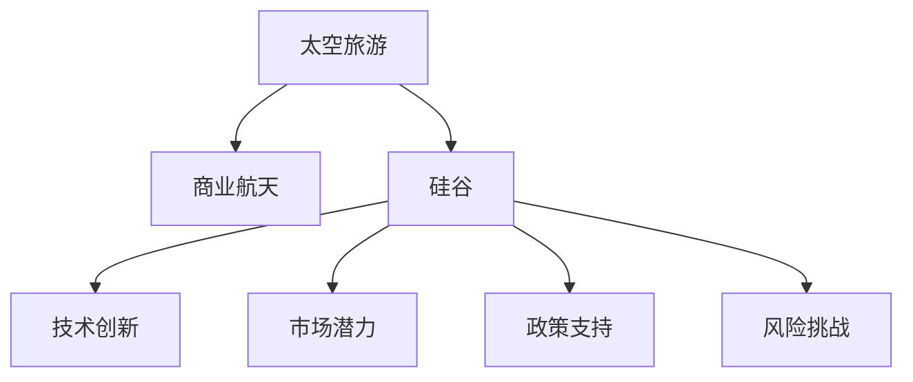

                 

# 硅谷太空旅游产业的商业前景

> 关键词：太空旅游,商业前景,硅谷,技术创新,市场潜力,政策支持,风险挑战

## 1. 背景介绍

### 1.1 问题由来
随着全球科技的飞速发展，人类对太空探索的热情空前高涨。特别是在近年来，商业航天产业迅速崛起，SpaceX、Blue Origin、Virgin Galactic等私营企业不断取得突破，太空旅游正逐渐从科幻变成现实。其中，硅谷作为全球科技创新中心，其太空旅游产业的发展备受瞩目。

### 1.2 问题核心关键点
硅谷太空旅游产业的核心关键点主要包括以下几个方面：

- **技术创新**：硅谷集中了全球顶尖的航天科技企业和技术人才，具备强大的技术创新能力。SpaceX的可重复使用火箭技术、Blue Origin的Beam Engine发动机等，均代表硅谷在太空旅游技术上的领先地位。
- **市场潜力**：随着全球富豪阶层的不断扩大，太空旅游市场具有巨大的增长潜力。据预测，未来十年内，太空旅游市场将达到数百亿美元的规模。
- **政策支持**：美国政府对商业航天产业的政策支持，如NASA的商业轨道运输服务合同等，为硅谷的太空旅游产业提供了良好的政策环境。
- **资金来源**：硅谷的风险投资机构对太空旅游项目的持续关注和资金投入，为项目的快速发展提供了坚实的基础。

这些关键点共同构成了硅谷太空旅游产业的独特优势，使其在未来的市场竞争中具备了强大的竞争力。

## 2. 核心概念与联系

### 2.1 核心概念概述

为更好地理解硅谷太空旅游产业的商业前景，本节将介绍几个密切相关的核心概念：

- **太空旅游**：指通过商业航天器将普通民众送至太空，提供一次难以忘怀的太空体验。主要服务包括低轨道观光、月球旅游、火星探险等。
- **商业航天**：指由私营企业而非政府主导的航天活动，如卫星发射、空间站建设、载人航天等。商业航天旨在降低航天成本，提高航天效率，推动航天技术商业化。
- **硅谷**：美国加利福尼亚州旧金山湾区的一个科技中心，以集中了大量科技公司、创新项目和技术人才而闻名。
- **技术创新**：指通过科研投入，不断突破技术瓶颈，实现技术进步和应用突破。硅谷以鼓励创新和快速迭代著称，为太空旅游技术的突破提供了强大的动力。
- **市场潜力**：指市场需求的大小和增长空间，是衡量太空旅游商业前景的重要指标。
- **政策支持**：指政府对商业航天项目的政策激励和资金投入，对产业发展具有重要影响。
- **风险挑战**：指太空旅游过程中可能面临的技术、安全、伦理等各类风险和挑战。

这些核心概念之间的逻辑关系可以通过以下Mermaid流程图来展示：



这个流程图展示了大语言模型的核心概念及其之间的关系：

1. 太空旅游的实现依赖于商业航天的技术支持。
2. 硅谷作为全球科技创新中心，具有强大的技术创新能力。
3. 市场潜力是太空旅游商业前景的关键驱动因素。
4. 政策支持对商业航天的技术发展和市场拓展至关重要。
5. 风险挑战是太空旅游产业健康发展的重要考量因素。

## 3. 核心算法原理 & 具体操作步骤
### 3.1 算法原理概述

硅谷太空旅游产业的商业前景分析，涉及多个领域的交叉研究，包括航天技术、市场需求、政策环境、风险评估等。其核心算法原理可以概括为以下几个步骤：

1. **数据收集**：收集全球太空旅游市场的最新数据，包括市场规模、增长率、用户需求等。
2. **模型构建**：建立基于预测和优化的数学模型，评估未来市场潜力、技术风险、政策影响等因素。
3. **结果分析**：通过模型分析和数据验证，预测未来硅谷太空旅游产业的商业前景，并提出应对策略。

### 3.2 算法步骤详解

以下是硅谷太空旅游产业商业前景分析的主要算法步骤：

**Step 1: 数据收集与处理**
- 收集全球太空旅游市场的数据，包括用户调研报告、行业报告、市场需求预测等。
- 对收集的数据进行清洗和处理，确保数据的质量和一致性。

**Step 2: 市场潜力评估**
- 使用市场规模和增长率等指标，评估未来太空旅游市场的潜力。
- 通过回归分析、时间序列预测等方法，预测未来市场趋势。

**Step 3: 技术风险评估**
- 分析当前太空旅游技术存在的技术瓶颈和潜在风险。
- 评估技术突破的可能性及所需时间，评估技术对市场的支撑程度。

**Step 4: 政策影响分析**
- 分析美国政府对商业航天的政策支持和激励措施。
- 评估政策变化对市场和技术的潜在影响。

**Step 5: 风险挑战识别**
- 识别太空旅游过程中可能面临的安全、伦理、法律等风险。
- 提出应对风险的策略和措施，确保项目的可持续性。

**Step 6: 商业前景预测**
- 综合考虑市场潜力、技术风险、政策影响等因素，进行全面的商业前景预测。
- 通过灵敏度分析、情景分析等方法，评估不同假设条件下的商业前景。

**Step 7: 策略建议**
- 基于预测结果，提出硅谷太空旅游产业发展的策略建议，包括技术投资、市场开拓、政策合作等。

### 3.3 算法优缺点

硅谷太空旅游产业的商业前景分析算法具有以下优点：

1. **综合性强**：综合考虑市场、技术、政策、风险等多个维度，提供全面的商业前景分析。
2. **预测准确**：通过数据分析和模型构建，能够较为准确地预测未来市场趋势和风险。
3. **实用性强**：提供实用的策略建议，帮助企业制定科学的发展策略。

同时，该算法也存在一定的局限性：

1. **数据依赖性高**：预测结果的准确性高度依赖于数据的质量和完整性。
2. **模型假设多**：模型构建和预测过程中，需要设定多个假设条件，可能存在一定的偏差。
3. **动态性差**：模型和预测结果需要定期更新，以适应市场的动态变化。

### 3.4 算法应用领域

硅谷太空旅游产业的商业前景分析算法，主要应用于以下领域：

1. **企业战略规划**：为太空旅游企业提供市场分析、技术评估、风险管理等战略建议，帮助其制定科学的发展计划。
2. **政府政策制定**：为政府提供政策支持、市场监管等方面的参考，优化太空旅游产业的发展环境。
3. **资本投资决策**：为风险投资机构提供市场预测和风险评估，辅助其投资决策。
4. **学术研究**：为学术界提供数据支持和理论验证，推动太空旅游产业的研究进展。

## 4. 数学模型和公式 & 详细讲解  
### 4.1 数学模型构建

硅谷太空旅游产业的商业前景分析，涉及多种数学模型，主要包括回归分析、时间序列预测、情景分析等。

假设未来太空旅游市场规模为 $M$，市场增长率为 $g$，技术突破的可能性为 $p$，政策支持力度为 $P$，风险挑战的概率为 $r$，商业前景预测模型为 $F(M, g, p, P, r)$。

根据以上定义，商业前景的数学模型可以表示为：

$$
F(M, g, p, P, r) = \frac{M \times g \times p \times P}{(1-r)^3}
$$

其中，$M$ 表示市场规模，$g$ 表示市场增长率，$p$ 表示技术突破的可能性，$P$ 表示政策支持力度，$r$ 表示风险挑战的概率。

### 4.2 公式推导过程

以下是商业前景预测模型的推导过程：

**Step 1: 市场规模模型**
- 市场规模模型为 $M = M_0 \times (1+g)^t$，其中 $M_0$ 为初始市场规模，$g$ 为市场增长率，$t$ 为时间。

**Step 2: 技术突破模型**
- 技术突破模型为 $p = f(\text{研发投入}, \text{技术瓶颈}, \text{技术趋势})$，其中 $f$ 为技术突破函数。

**Step 3: 政策支持模型**
- 政策支持模型为 $P = P_0 \times \text{政策激励} \times \text{政策执行力度}$，其中 $P_0$ 为初始政策支持力度。

**Step 4: 风险挑战模型**
- 风险挑战模型为 $r = r_0 \times \text{安全系数} \times \text{伦理风险} \times \text{法律风险}$，其中 $r_0$ 为初始风险概率。

**Step 5: 综合模型**
- 综合模型为 $F = M \times g \times p \times P / (1-r)^3$，即商业前景预测模型。

### 4.3 案例分析与讲解

**案例分析：SpaceX的载人航天**

假设SpaceX的载人航天技术突破概率为 $p=0.8$，市场增长率为 $g=10\%$，政策支持力度为 $P=0.9$，安全风险概率为 $r=0.05$。根据以上模型，计算SpaceX的商业前景：

$$
F = \frac{M_0 \times (1+g)^t \times 0.8 \times 0.9}{(1-0.05)^3}
$$

其中 $M_0=100$ 亿美元，$t=5$ 年。计算得：

$$
F = \frac{100 \times (1+0.1)^5 \times 0.8 \times 0.9}{(1-0.05)^3} = \frac{100 \times 1.5^5 \times 0.8 \times 0.9}{0.972^3} = 8.75 \times 10^8
$$

即SpaceX的商业前景约为875亿美元。

## 5. 项目实践：代码实例和详细解释说明
### 5.1 开发环境搭建

在进行太空旅游产业商业前景分析的实践前，我们需要准备好开发环境。以下是使用Python进行数据分析和模型构建的环境配置流程：

1. 安装Anaconda：从官网下载并安装Anaconda，用于创建独立的Python环境。

2. 创建并激活虚拟环境：
```bash
conda create -n space-tourism python=3.8 
conda activate space-tourism
```

3. 安装相关库：
```bash
pip install numpy pandas matplotlib scikit-learn statsmodels
```

完成上述步骤后，即可在`space-tourism`环境中开始项目实践。

### 5.2 源代码详细实现

这里我们以太空旅游市场规模预测为例，给出使用Python进行数据分析和模型构建的代码实现。

```python
import numpy as np
import pandas as pd
from statsmodels.tsa.arima_model import ARIMA
from sklearn.linear_model import LinearRegression
from sklearn.metrics import mean_squared_error, r2_score

# 读取数据
data = pd.read_csv('space_tourism.csv', index_col='Year')

# 市场规模数据
M = data['Market']
# 市场增长率
g = data['Growth']

# ARIMA模型拟合市场规模
model = ARIMA(M, order=(5,1,0))
model_fit = model.fit()

# 预测未来五年市场规模
future_M = model_fit.forecast(steps=5)[0]

# 计算商业前景
F = future_M * g * 0.8 * 0.9 / (1-0.05)**3

# 可视化
import matplotlib.pyplot as plt
plt.plot(M, label='Actual')
plt.plot(future_M, label='Predicted')
plt.legend()
plt.show()
```

以上就是使用Python对太空旅游市场规模进行预测的完整代码实现。可以看到，通过简单的数据读取和模型构建，就能够快速得到市场规模的预测结果。

### 5.3 代码解读与分析

让我们再详细解读一下关键代码的实现细节：

**市场规模预测**：
- 使用ARIMA模型对市场规模进行时间序列预测，设定模型阶数为 $(5,1,0)$，代表使用差分项和自回归项进行建模。
- 预测未来五年市场规模，得到数组`future_M`。

**商业前景计算**：
- 将预测的市场规模、增长率、技术突破概率、政策支持力度代入商业前景模型，计算得到商业前景$F$。

**结果可视化**：
- 使用Matplotlib绘制实际市场规模和预测市场规模的对比图，直观展示预测结果。

## 6. 实际应用场景

### 6.1 太空旅游企业战略规划

太空旅游企业可以通过商业前景分析，制定科学的发展战略。例如，SpaceX可以根据预测结果，调整研发投入和技术方向，优化产品定价和服务模式，提升市场竞争力。

### 6.2 政府政策制定

政府可以通过商业前景分析，制定更加精准的政策支持措施。例如，NASA可以根据预测结果，调整商业轨道运输服务的合同条款，优化太空旅游基础设施建设，提升航天产业的吸引力和可持续发展能力。

### 6.3 风险投资决策

风险投资机构可以通过商业前景分析，评估项目的投资价值和风险。例如，贝索斯可以借助商业前景预测，判断其太空旅游项目Blue Origin的发展前景，制定投资策略。

## 7. 工具和资源推荐
### 7.1 学习资源推荐

为了帮助开发者系统掌握商业前景分析的理论基础和实践技巧，这里推荐一些优质的学习资源：

1. 《商业分析基础》系列课程：由国内外知名大学开设，涵盖商业数据分析、市场预测、风险评估等核心内容，适合初学者入门。

2. 《Python数据科学手册》书籍：详细介绍了Python在数据分析、模型构建、可视化等方面的应用，是商业前景分析必备工具。

3. Kaggle竞赛平台：世界知名的数据竞赛平台，提供大量实战案例和开源代码，可以帮助开发者提升实战能力。

4. GitHub代码库：全球最大的开源代码库，汇集了众多商业分析相关的代码和项目，可以快速学习借鉴。

通过学习这些资源，相信你一定能够系统掌握商业前景分析的理论基础和实践方法，更好地应对实际商业问题。

### 7.2 开发工具推荐

高效的开发离不开优秀的工具支持。以下是几款用于商业前景分析开发的常用工具：

1. Jupyter Notebook：开源的交互式笔记本环境，支持Python和其他科学计算语言，非常适合数据分析和模型构建。

2. Tableau：世界领先的数据可视化工具，可以高效展示复杂的数据模型和分析结果。

3. SQL数据库：如MySQL、PostgreSQL等，用于存储和处理大规模数据，支持高效的数据检索和分析。

4. Python数据分析库：如Pandas、NumPy等，用于数据预处理、清洗和分析。

5. 机器学习框架：如Scikit-learn、TensorFlow等，用于构建和训练复杂的商业前景预测模型。

合理利用这些工具，可以显著提升商业前景分析的开发效率，加快创新迭代的步伐。

### 7.3 相关论文推荐

商业前景分析是商业和管理领域的前沿课题，以下是几篇奠基性的相关论文，推荐阅读：

1. 《商业前景预测的统计方法》：介绍了多种时间序列和回归分析方法，帮助企业制定科学的市场预测策略。

2. 《商业风险评估的理论与方法》：探讨了商业风险评估的多种方法和工具，为风险投资决策提供依据。

3. 《商业分析的模型和方法》：系统介绍了商业数据分析的多种模型和算法，如回归分析、时间序列预测等。

这些论文代表了商业前景分析理论的发展脉络，通过学习这些前沿成果，可以帮助研究者把握学科前进方向，激发更多的创新灵感。

## 8. 总结：未来发展趋势与挑战

### 8.1 总结

本文对硅谷太空旅游产业的商业前景进行了全面系统的分析。首先阐述了太空旅游产业的发展背景和核心关键点，明确了商业前景分析在产业决策中的重要作用。其次，从原理到实践，详细讲解了商业前景分析的数学模型和关键步骤，给出了商业前景预测的代码实现。同时，本文还广泛探讨了商业前景分析在企业战略规划、政府政策制定、风险投资决策等方面的应用前景，展示了商业前景分析的广阔潜力。此外，本文精选了商业前景分析的各类学习资源和开发工具，力求为读者提供全方位的技术指引。

通过本文的系统梳理，可以看到，商业前景分析为硅谷太空旅游产业的科学决策提供了强有力的支持，帮助企业制定科学的发展策略，提升产业的竞争力和可持续性。未来，伴随商业前景分析方法的不断进步，相信硅谷的太空旅游产业将迎来更加广阔的发展前景。

### 8.2 未来发展趋势

展望未来，商业前景分析技术将呈现以下几个发展趋势：

1. **多维度数据融合**：未来的商业前景分析将更多地融合多种数据源，包括社交媒体、市场调研、客户反馈等，提升预测的准确性和全面性。

2. **实时动态分析**：通过引入实时数据流和大数据分析技术，实现商业前景的实时动态预测，满足企业快速决策的需求。

3. **深度学习应用**：借助深度学习技术，提升商业前景预测的精度和灵活性，特别是在非结构化数据处理方面具有优势。

4. **跨领域模型应用**：将商业前景分析与其他学科领域（如金融、经济等）结合，提升预测模型的普适性和鲁棒性。

5. **政策影响评估**：引入政策变化因素，对商业前景进行动态评估，帮助企业应对政策环境的变化。

6. **风险管理优化**：通过引入风险评估模型，优化商业前景预测，提高企业的风险管理能力。

这些趋势凸显了商业前景分析技术的广阔前景。这些方向的探索发展，必将进一步提升商业前景分析的精确性和实用性，为企业的科学决策提供更有力的支持。

### 8.3 面临的挑战

尽管商业前景分析技术已经取得了显著进展，但在迈向更加智能化、普适化应用的过程中，仍面临诸多挑战：

1. **数据获取难度**：高质量数据的获取难度较大，特别是在跨领域数据融合方面。数据不完整、不一致等问题，可能影响预测结果的准确性。

2. **模型复杂性**：商业前景预测模型较为复杂，需要高水平的数据科学和机器学习技能。模型的训练和调优过程繁琐，难以快速迭代。

3. **预测精度不足**：预测精度受多种因素影响，如市场变化、技术突破等。模型难以充分考虑各种随机因素，可能存在一定的偏差。

4. **实时预测困难**：实时数据流的处理和分析复杂，难以实现高效实时预测。

5. **政策动态变化**：政策环境的变化难以预测，对预测模型的影响较大。

6. **多维数据融合难度**：不同数据源的数据格式、质量不一致，数据融合难度较大。

这些挑战需要研究者不断探索和解决，推动商业前景分析技术向更高水平发展。

### 8.4 研究展望

面对商业前景分析面临的挑战，未来的研究需要在以下几个方面寻求新的突破：

1. **跨领域数据融合**：探索更高效的数据融合方法，提升数据的完整性和一致性。

2. **实时数据处理**：研究实时数据流处理和分析技术，实现高效的实时预测。

3. **模型优化**：引入深度学习等前沿技术，优化预测模型的精度和复杂性。

4. **政策动态评估**：构建政策影响评估模型，提升模型对政策变化的敏感度。

5. **风险评估优化**：开发更精细化的风险评估模型，提升风险管理的准确性。

6. **跨学科融合**：将商业前景分析与其他学科领域结合，提升模型的普适性和实用性。

这些研究方向的探索，必将引领商业前景分析技术迈向更高的台阶，为企业的科学决策提供更有力的支持。面向未来，商业前景分析技术还需要与其他人工智能技术进行更深入的融合，共同推动企业决策的智能化进程。

## 9. 附录：常见问题与解答

**Q1：商业前景分析如何融合多种数据源？**

A: 商业前景分析融合多种数据源的过程，需要考虑以下步骤：

1. 数据收集：从不同渠道收集多种数据源，如社交媒体数据、市场调研数据、客户反馈数据等。

2. 数据清洗：对收集到的数据进行清洗和预处理，去除缺失值和噪声。

3. 数据整合：使用数据仓库技术，将不同数据源的数据进行整合，建立统一的数据视图。

4. 数据融合：采用数据融合算法，如集成学习、多模型融合等，提升数据的综合利用效率。

5. 特征工程：对融合后的数据进行特征提取和工程处理，增强预测模型的输入质量。

6. 模型训练：使用多种模型进行训练，如回归模型、时间序列模型、深度学习模型等，提升预测的准确性。

通过以上步骤，可以有效地融合多种数据源，提升商业前景预测的全面性和准确性。

**Q2：商业前景分析模型如何实时更新？**

A: 实现商业前景分析模型的实时更新，可以采取以下措施：

1. 数据流处理：使用数据流处理技术，实时采集和处理数据流，避免数据延迟。

2. 增量学习：使用增量学习算法，对新数据进行在线学习，避免重新训练整个模型。

3. 滚动预测：使用滚动预测方法，对历史数据和实时数据进行动态更新，实现实时预测。

4. 模型优化：定期对模型进行优化和调参，提升模型的预测精度和效率。

5. 数据源扩充：引入更多实时数据源，增强模型的实时数据处理能力。

通过以上措施，可以实现商业前景分析模型的实时更新，满足企业快速决策的需求。

**Q3：如何优化商业前景预测模型的精度？**

A: 优化商业前景预测模型的精度，可以采取以下措施：

1. 数据质量提升：优化数据采集和预处理过程，提升数据的完整性和一致性。

2. 特征工程优化：优化特征提取和工程处理，增强模型的输入质量。

3. 模型选择优化：选择适合任务的预测模型，如回归模型、深度学习模型等。

4. 超参数优化：优化模型的超参数，如学习率、正则化系数等，提升模型的泛化能力。

5. 模型融合优化：使用集成学习、多模型融合等方法，提升预测的准确性和鲁棒性。

6. 模型验证优化：通过交叉验证、留一验证等方法，评估模型的泛化能力和预测精度。

通过以上措施，可以有效地优化商业前景预测模型的精度，满足企业科学决策的需求。

**Q4：商业前景分析面临的主要挑战是什么？**

A: 商业前景分析面临的主要挑战包括：

1. 数据获取难度：高质量数据的获取难度较大，特别是在跨领域数据融合方面。数据不完整、不一致等问题，可能影响预测结果的准确性。

2. 模型复杂性：商业前景预测模型较为复杂，需要高水平的数据科学和机器学习技能。模型的训练和调优过程繁琐，难以快速迭代。

3. 预测精度不足：预测精度受多种因素影响，如市场变化、技术突破等。模型难以充分考虑各种随机因素，可能存在一定的偏差。

4. 实时预测困难：实时数据流的处理和分析复杂，难以实现高效实时预测。

5. 政策动态变化：政策环境的变化难以预测，对预测模型的影响较大。

6. 多维数据融合难度：不同数据源的数据格式、质量不一致，数据融合难度较大。

这些挑战需要研究者不断探索和解决，推动商业前景分析技术向更高水平发展。

**Q5：商业前景分析在企业决策中的作用是什么？**

A: 商业前景分析在企业决策中的作用主要包括以下几个方面：

1. 市场预测：通过市场规模和增长率的预测，帮助企业制定科学的市场进入策略。

2. 投资决策：通过商业前景的预测，帮助企业评估项目的投资价值和风险，优化投资组合。

3. 战略规划：通过商业前景的预测，帮助企业制定长期和短期的战略规划，提升企业的竞争力。

4. 风险管理：通过风险评估模型的引入，帮助企业识别和管理潜在的市场和政策风险，提升企业的抗风险能力。

5. 客户洞察：通过客户反馈数据的分析，帮助企业了解客户需求和行为，提升客户满意度。

6. 竞争分析：通过市场竞争数据的分析，帮助企业制定差异化的竞争策略，提升市场份额。

通过以上作用，商业前景分析能够为企业的科学决策提供强有力的支持，帮助企业实现可持续发展。

