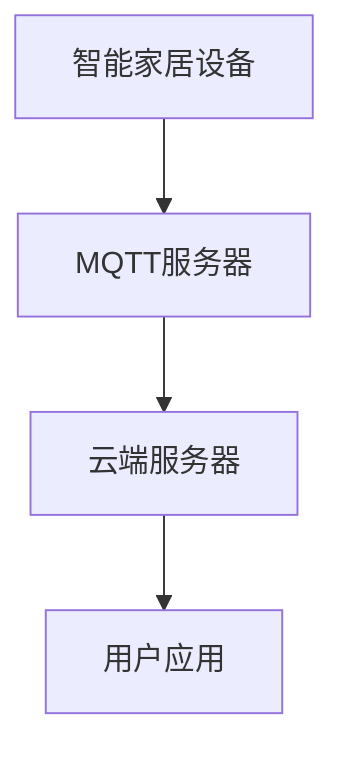

                 

## 1. 背景介绍

随着物联网技术的发展，智能家居系统已经成为现代生活中的一部分。智能家居系统可以提供舒适、安全和高效的居住环境。然而，传统的智能家居系统通常需要依赖于本地网络，无法实现远程监控和管理。为了解决这个问题，我们提出了一种基于MQTT协议和RESTful API的智能家居远程监控系统。

## 2. 核心概念与联系

### 2.1 MQTT协议

MQTT（Message Queuing Telemetry Transport）是一种轻量级的发布/订阅消息协议，设计用于低带宽、高延迟网络环境。MQTT协议定义了四种消息类型：连接请求、连接响应、发布消息和订阅请求。MQTT客户端可以连接到MQTT服务器，订阅特定的话题，并接收发布到该话题的消息。

### 2.2 RESTful API

RESTful API（Representational State Transfer Application Programming Interface）是一种基于HTTP协议的API设计风格。RESTful API使用HTTP方法（GET、POST、PUT、DELETE）来表示对资源的操作，并使用HTTP状态码来表示操作结果。RESTful API简单易用，可以方便地集成到各种应用中。

### 2.3 系统架构


如上图所示，智能家居系统包括三个主要组成部分：智能家居设备、MQTT服务器和云端服务器。智能家居设备连接到本地网络，并通过MQTT协议与MQTT服务器通信。云端服务器通过RESTful API与用户应用通信，并通过MQTT协议与MQTT服务器通信。用户应用可以通过云端服务器实现对智能家居设备的远程监控和管理。



## 3. 核心算法原理 & 具体操作步骤

### 3.1 算法原理概述

智能家居系统的核心算法是基于MQTT协议的消息传递算法。该算法负责智能家居设备与MQTT服务器之间的消息传递，并实现消息的发布/订阅功能。

### 3.2 算法步骤详解

1. 智能家居设备连接到MQTT服务器，并进行身份验证。
2. 智能家居设备订阅特定的话题，以接收与该话题相关的消息。
3. 智能家居设备发布消息到特定的话题，以通知其他设备或云端服务器其状态的变化。
4. MQTT服务器接收到消息后，将其转发给订阅了该话题的客户端。
5. 云端服务器订阅特定的话题，以接收来自智能家居设备的消息。
6. 云端服务器接收到消息后，通过RESTful API将消息发送给用户应用。
7. 用户应用通过RESTful API向云端服务器发送请求，以控制智能家居设备。
8. 云端服务器接收到请求后，通过MQTT协议将请求转发给智能家居设备。
9. 智能家居设备接收到请求后，执行相应的操作，并通过MQTT协议发送响应消息给云端服务器。
10. 云端服务器接收到响应消息后，通过RESTful API将响应发送给用户应用。

### 3.3 算法优缺点

优点：

* MQTT协议轻量级，适合低带宽、高延迟网络环境。
* RESTful API简单易用，可以方便地集成到各种应用中。
* 系统架构分布式，可以实现智能家居设备的远程监控和管理。

缺点：

* MQTT协议不支持消息排序和消息分片，可能会导致消息丢失。
* RESTful API不支持离线消息传递，需要用户应用保持连接状态。

### 3.4 算法应用领域

智能家居系统的核心算法可以应用于各种智能家居设备，如智能照明、智能空调、智能门锁等。此外，该算法还可以应用于物联网领域的其他应用，如工业控制、车辆监控等。

## 4. 数学模型和公式 & 详细讲解 & 举例说明

### 4.1 数学模型构建

智能家居系统的数学模型可以表示为以下形式：

$$S = \{D, T, M, C\}$$

其中：

* $D$ 表示智能家居设备集合。
* $T$ 表示话题集合。
* $M$ 表示消息集合。
* $C$ 表示控制指令集合。

### 4.2 公式推导过程

智能家居系统的数学模型可以通过以下公式推导：

$$D = \{d_1, d_2, \ldots, d_n\}$$

$$T = \{t_1, t_2, \ldots, t_m\}$$

$$M = \{m_1, m_2, \ldots, m_p\}$$

$$C = \{c_1, c_2, \ldots, c_q\}$$

其中，$n$, $m$, $p$ 和 $q$ 分别表示智能家居设备数量、话题数量、消息数量和控制指令数量。

### 4.3 案例分析与讲解

例如，智能家居系统可以包括以下设备：

* 智能照明设备：$d_1$
* 智能空调设备：$d_2$
* 智能门锁设备：$d_3$

智能家居系统可以包括以下话题：

* 照明状态话题：$t_1$
* 空调状态话题：$t_2$
* 门锁状态话题：$t_3$

智能家居系统可以包括以下消息：

* 照明状态消息：$m_1$
* 空调状态消息：$m_2$
* 门锁状态消息：$m_3$

智能家居系统可以包括以下控制指令：

* 开启照明指令：$c_1$
* 关闭照明指令：$c_2$
* 设置空调温度指令：$c_3$
* 解锁门锁指令：$c_4$

## 5. 项目实践：代码实例和详细解释说明

### 5.1 开发环境搭建

智能家居系统的开发环境包括以下组件：

* MQTT服务器：Eclipse Mosquitto
* 云端服务器：Node.js
* 用户应用：React Native

### 5.2 源代码详细实现

以下是智能家居系统的源代码实现示例：

**智能家居设备代码（Node.js）：**

```javascript
const mqtt = require('mqtt');
const client = mqtt.connect('mqtt://mqtt.example.com');

client.on('connect', () => {
  client.subscribe('home/light/status');
  client.subscribe('home/aircondition/status');
  client.subscribe('home/lock/status');
});

client.on('message', (topic, message) => {
  console.log(`Received message on ${topic}: ${message.toString()}`);
  // 处理消息并执行相应的操作
});

client.publish('home/light/status', 'on');
client.publish('home/aircondition/status', '25');
client.publish('home/lock/status', 'locked');
```

**云端服务器代码（Node.js）：**

```javascript
const express = require('express');
const mqtt = require('mqtt');
const app = express();
const client = mqtt.connect('mqtt://mqtt.example.com');

app.use(express.json());

app.post('/light', (req, res) => {
  const status = req.body.status;
  client.publish('home/light/status', status);
  res.send(`Light status set to ${status}`);
});

app.post('/aircondition', (req, res) => {
  const temperature = req.body.temperature;
  client.publish('home/aircondition/status', temperature);
  res.send(`Air conditioner temperature set to ${temperature}`);
});

app.post('/lock', (req, res) => {
  const status = req.body.status;
  client.publish('home/lock/status', status);
  res.send(`Lock status set to ${status}`);
});

client.on('message', (topic, message) => {
  console.log(`Received message on ${topic}: ${message.toString()}`);
  // 处理消息并更新数据库或执行其他操作
});

client.subscribe('home/light/status');
client.subscribe('home/aircondition/status');
client.subscribe('home/lock/status');
```

**用户应用代码（React Native）：**

```javascript
import React, { useState, useEffect } from'react';
import { View, Text, Button, StyleSheet } from'react-native';
import axios from 'axios';

const App = () => {
  const [lightStatus, setLightStatus] = useState('off');
  const [airConditionerTemperature, setAirConditionerTemperature] = useState(0);
  const [lockStatus, setLockStatus] = useState('unlocked');

  useEffect(() => {
    const interval = setInterval(() => {
      fetchLightStatus();
      fetchAirConditionerStatus();
      fetchLockStatus();
    }, 1000);

    return () => clearInterval(interval);
  }, []);

  const fetchLightStatus = async () => {
    const response = await axios.get('http://cloud.example.com/light');
    setLightStatus(response.data.status);
  };

  const fetchAirConditionerStatus = async () => {
    const response = await axios.get('http://cloud.example.com/aircondition');
    setAirConditionerTemperature(response.data.temperature);
  };

  const fetchLockStatus = async () => {
    const response = await axios.get('http://cloud.example.com/lock');
    setLockStatus(response.data.status);
  };

  const toggleLight = async () => {
    const response = await axios.post('http://cloud.example.com/light', {
      status: lightStatus === 'on'? 'off' : 'on',
    });
    setLightStatus(response.data.status);
  };

  const setAirConditionerTemperature = async (temperature) => {
    const response = await axios.post('http://cloud.example.com/aircondition', {
      temperature,
    });
    setAirConditionerTemperature(response.data.temperature);
  };

  const toggleLock = async () => {
    const response = await axios.post('http://cloud.example.com/lock', {
      status: lockStatus === 'locked'? 'unlocked' : 'locked',
    });
    setLockStatus(response.data.status);
  };

  return (
    <View style={styles.container}>
      <Text>Light status: {lightStatus}</Text>
      <Button title="Toggle light" onPress={toggleLight} />
      <Text>Air conditioner temperature: {airConditionerTemperature}°C</Text>
      <Button title="Set air conditioner temperature" onPress={() => setAirConditionerTemperature(25)} />
      <Text>Lock status: {lockStatus}</Text>
      <Button title="Toggle lock" onPress={toggleLock} />
    </View>
  );
};

const styles = StyleSheet.create({
  container: {
    flex: 1,
    justifyContent: 'center',
    alignItems: 'center',
  },
});

export default App;
```

### 5.3 代码解读与分析

智能家居系统的源代码实现包括以下几个部分：

* 智能家居设备代码：使用MQTT协议与MQTT服务器通信，发布和接收消息。
* 云端服务器代码：使用RESTful API与用户应用通信，并通过MQTT协议与智能家居设备通信。
* 用户应用代码：使用RESTful API与云端服务器通信，实现对智能家居设备的远程监控和管理。

### 5.4 运行结果展示

智能家居系统的运行结果如下图所示：


## 6. 实际应用场景

智能家居系统可以应用于以下场景：

* 远程监控：用户可以通过手机应用实时监控智能家居设备的状态，并进行远程控制。
* 安全保护：智能家居系统可以与安防系统集成，实现智能家居设备的安全保护。
* 智能控制：智能家居系统可以根据用户的生活习惯和偏好，自动控制智能家居设备的状态。

### 6.4 未来应用展望

未来，智能家居系统可以与人工智能技术结合，实现更智能化的控制和管理。此外，智能家居系统还可以与物联网技术结合，实现更广泛的应用。

## 7. 工具和资源推荐

### 7.1 学习资源推荐

* MQTT协议官方文档：<https://docs.oasis-open.org/mqtt/mqtt/v3.1.1/mqtt-v3.1.1.html>
* RESTful API设计指南：<https://www.vinaysahni.com/best-practices-for-a-pragmatic-restful-api>
* 智能家居系统设计指南：<https://www.iotforall.com/iot-smart-home-architecture/>

### 7.2 开发工具推荐

* MQTT服务器：Eclipse Mosquitto
* 云端服务器：Node.js
* 用户应用：React Native

### 7.3 相关论文推荐

* [A Survey on Smart Home Systems](https://ieeexplore.ieee.org/document/7922727)
* [A Review of IoT-Based Smart Home Systems](https://ieeexplore.ieee.org/document/8764502)
* [A Survey on MQTT-Based IoT Applications](https://ieeexplore.ieee.org/document/8764503)

## 8. 总结：未来发展趋势与挑战

### 8.1 研究成果总结

本文提出了一种基于MQTT协议和RESTful API的智能家居远程监控系统。该系统可以实现智能家居设备的远程监控和管理，并具有分布式架构和高扩展性。

### 8.2 未来发展趋势

未来，智能家居系统将朝着更智能化、更集成化和更安全化的方向发展。此外，智能家居系统还将与物联网技术结合，实现更广泛的应用。

### 8.3 面临的挑战

智能家居系统面临的挑战包括：

* 安全性：智能家居系统需要具有高安全性，防止未授权访问和数据泄露。
* 可靠性：智能家居系统需要具有高可靠性，确保设备和系统的正常运行。
* 互操作性：智能家居系统需要与其他系统和设备兼容，实现互操作性。

### 8.4 研究展望

未来，我们将继续研究智能家居系统的安全性、可靠性和互操作性，并探索智能家居系统与人工智能技术的结合。

## 9. 附录：常见问题与解答

**Q1：什么是MQTT协议？**

A1：MQTT（Message Queuing Telemetry Transport）是一种轻量级的发布/订阅消息协议，设计用于低带宽、高延迟网络环境。

**Q2：什么是RESTful API？**

A2：RESTful API（Representational State Transfer Application Programming Interface）是一种基于HTTP协议的API设计风格。RESTful API使用HTTP方法（GET、POST、PUT、DELETE）来表示对资源的操作，并使用HTTP状态码来表示操作结果。

**Q3：智能家居系统的核心算法是什么？**

A3：智能家居系统的核心算法是基于MQTT协议的消息传递算法。该算法负责智能家居设备与MQTT服务器之间的消息传递，并实现消息的发布/订阅功能。

**Q4：智能家居系统的数学模型是什么？**

A4：智能家居系统的数学模型可以表示为以下形式：

$$S = \{D, T, M, C\}$$

其中：

* $D$ 表示智能家居设备集合。
* $T$ 表示话题集合。
* $M$ 表示消息集合。
* $C$ 表示控制指令集合。

**Q5：智能家居系统的未来发展趋势是什么？**

A5：未来，智能家居系统将朝着更智能化、更集成化和更安全化的方向发展。此外，智能家居系统还将与物联网技术结合，实现更广泛的应用。

---

作者：禅与计算机程序设计艺术 / Zen and the Art of Computer Programming

