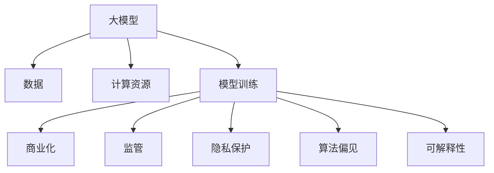

                 

## 大模型企业面临的生存挑战

> 关键词：大模型、企业生存、算力、数据、模型训练、商业化、监管、隐私保护、算法偏见、可解释性

## 1. 背景介绍

随着计算能力的指数级增长和数据的爆炸式增加，大模型（Large Models）已经成为人工智能（AI）领域的关键驱动因素。大模型的出现带来了巨大的商业机遇，但同时也给企业带来了独特的挑战。本文将深入探讨大模型企业面临的生存挑战，并提供解决方案和建议。

## 2. 核心概念与联系

### 2.1 大模型的定义

大模型是指具有数十亿甚至数千亿参数的模型，能够处理大量数据并产生人类级别甚至超越人类的表现。大模型通常基于Transformer架构，如BERT、T5和DALL-E。

### 2.2 大模型企业的特点

大模型企业具有以下特点：

- 依赖于大规模数据集和计算资源；
- 需要持续的模型训练和微调；
- 面临商业化、监管和隐私保护等挑战。

### 2.3 核心概念联系图



## 3. 核心算法原理 & 具体操作步骤

### 3.1 算法原理概述

大模型的核心算法是Transformer，它基于自注意力机制（Self-Attention）和位置编码（Positional Encoding）。Transformer模型可以并行处理输入序列，从而提高训练速度和模型性能。

### 3.2 算法步骤详解

1. **输入表示**：将输入数据（如文本或图像）转换为向量表示。
2. **位置编码**：为输入序列添加位置信息。
3. **自注意力**：计算输入序列中每个元素与其他元素之间的注意力权重。
4. **Feed Forward Network（FFN）**：对每个元素应用两层全连接网络。
5. **输出**：生成输出表示或预测结果。

### 3.3 算法优缺点

**优点**：

- 可以并行处理输入序列，提高训练速度。
- 具有出色的性能，能够处理大规模数据集。

**缺点**：

- 计算资源需求高，训练大模型需要大量GPU或TPU。
- 训练时间长，需要数天甚至数周。
- 存在过拟合风险，需要大量数据和技巧来避免。

### 3.4 算法应用领域

大模型在自然语言处理（NLP）、计算机视觉（CV）和多模式学习等领域具有广泛的应用。它们可以用于文本生成、机器翻译、图像生成和推荐系统等任务。

## 4. 数学模型和公式 & 详细讲解 & 举例说明

### 4.1 数学模型构建

大模型的数学模型可以表示为：

$$M(\theta) = f(x; \theta)$$

其中，$M(\theta)$表示模型，$f$表示模型函数，$x$表示输入数据，$\theta$表示模型参数。

### 4.2 公式推导过程

Transformer模型的自注意力机制可以表示为：

$$Attention(Q, K, V) = softmax\left(\frac{QK^T}{\sqrt{d_k}}\right)V$$

其中，$Q$, $K$, $V$分别是查询（Query）、键（Key）和值（Value）向量，$d_k$是键向量的维度。

### 4.3 案例分析与讲解

例如，在文本生成任务中，给定一段输入文本，大模型可以预测下一个单词。数学模型可以表示为：

$$P(w_{t+1} | w_1,..., w_t) = \text{softmax}(M(w_1,..., w_t))$$

其中，$w_{t+1}$是下一个单词，$w_1,..., w_t$是输入文本，$M$是大模型。

## 5. 项目实践：代码实例和详细解释说明

### 5.1 开发环境搭建

大模型的开发需要GPU或TPU，以及深度学习框架（如PyTorch或TensorFlow）。下面是一个简单的Transformer模型实现的开发环境配置：

- Python 3.8+
- PyTorch 1.8+
- Transformers library（Hugging Face）

### 5.2 源代码详细实现

```python
import torch
from transformers import TransfoXlTokenizer, TransfoXlModel

tokenizer = TransfoXlTokenizer.from_pretrained('transfo-xl-wt103')
model = TransfoXlModel.from_pretrained('transfo-xl-wt103')

inputs = tokenizer("Hello, I'm a transformer model!", return_tensors="pt")
outputs = model(**inputs)
```

### 5.3 代码解读与分析

上述代码首先导入必要的库和模型，然后对输入文本进行编码，并将其传递给模型以生成输出。

### 5.4 运行结果展示

运行上述代码后，`outputs`变量将包含模型的输出，包括最后一层的隐藏状态和预测分数。

## 6. 实际应用场景

### 6.1 当前应用

大模型已经在各种行业得到广泛应用，包括搜索引擎、虚拟助手、推荐系统和自动驾驶等。

### 6.2 未来应用展望

未来，大模型将继续在更多领域得到应用，如生物信息学、金融和制造业。此外，多模式大模型（如视觉和语言的结合）也将变得更加常见。

## 7. 工具和资源推荐

### 7.1 学习资源推荐

- "Attention is All You Need"论文：<https://arxiv.org/abs/1706.03762>
- Hugging Face Transformers库：<https://huggingface.co/transformers/>

### 7.2 开发工具推荐

- PyTorch：<https://pytorch.org/>
- TensorFlow：<https://www.tensorflow.org/>

### 7.3 相关论文推荐

- "Language Models are Few-Shot Learners"：<https://arxiv.org/abs/2005.14165>
- "DALL-E：Deep Learning for Generative Design"：<https://arxiv.org/abs/2102.05918>

## 8. 总结：未来发展趋势与挑战

### 8.1 研究成果总结

大模型已经取得了显著的成功，在各种任务上超越了人类水平。然而，它们也面临着挑战，需要进一步的研究和改进。

### 8.2 未来发展趋势

未来，大模型的发展将朝着更高效的训练、更少的数据需求和更好的可解释性等方向前进。

### 8.3 面临的挑战

大模型企业面临的挑战包括：

- **算力**：大模型需要大量的计算资源，这导致了高昂的成本和能源消耗。
- **数据**：大模型需要大量的数据来训练，这涉及到数据收集、清洗和隐私保护等问题。
- **商业化**：大模型的商业化面临着盈利模式和市场接受度等挑战。
- **监管**：大模型的部署需要遵循严格的监管规定，以保护用户和消费者的利益。
- **隐私保护**：大模型需要保护用户数据的隐私，并遵循相关法规（如GDPR）。
- **算法偏见**：大模型可能会受到训练数据的偏见影响，从而产生不公平的结果。
- **可解释性**：大模型的决策过程通常是不透明的，这导致了可解释性的挑战。

### 8.4 研究展望

未来的研究将关注于解决上述挑战，并开发更小、更快、更智能的大模型。

## 9. 附录：常见问题与解答

**Q：大模型需要多少计算资源？**

**A**：大模型需要数百甚至数千个GPU或TPU来训练，这导致了高昂的成本和能源消耗。

**Q：大模型需要多少数据？**

**A**：大模型需要数百万甚至数十亿个样本来训练，这涉及到数据收集、清洗和隐私保护等问题。

**Q：大模型的商业化有哪些挑战？**

**A**：大模型的商业化面临着盈利模式和市场接受度等挑战。企业需要开发新的商业模式来盈利，并说服客户接受大模型的解决方案。

**Q：大模型的监管有哪些要求？**

**A**：大模型的部署需要遵循严格的监管规定，以保护用户和消费者的利益。这包括数据保护法规（如GDPR）、反垄断法规和其他相关法规。

**Q：大模型如何保护隐私？**

**A**：大模型需要采取措施保护用户数据的隐私，包括数据匿名化、差分隐私和联邦学习等技术。

**Q：大模型如何避免算法偏见？**

**A**：大模型需要注意训练数据的偏见，并采取措施（如数据平衡、偏见度量和偏见修正）来减少算法偏见。

**Q：大模型如何提高可解释性？**

**A**：大模型需要开发新的技术（如LIME、SHAP和对抗解释）来提高可解释性，并帮助用户理解模型的决策过程。

## 作者：禅与计算机程序设计艺术 / Zen and the Art of Computer Programming

本文由禅与计算机程序设计艺术（Zen and the Art of Computer Programming）撰写，该项目旨在提供高质量的技术博客文章，帮助读者深入理解计算机科学和人工智能领域的最新进展。

