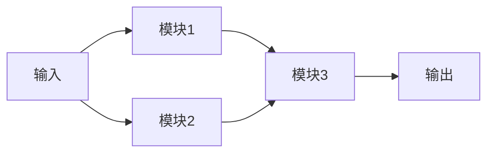

                 

大模型、创业、技术创新、深度学习、自然语言处理、计算机视觉、推荐系统、自动化、可解释性、隐私保护

## 1. 背景介绍

当前，人工智能（AI）技术正在各行各业得到广泛应用，其中大模型（Large Language Models）作为AI技术的一个重要分支，已经在自然语言处理（NLP）、计算机视觉（CV）、推荐系统等领域取得了显著的成就。然而，大模型的创业之路并非一帆风顺，技术创新是其中的关键。本文将从技术角度出发，深入探讨大模型创业中的技术创新。

## 2. 核心概念与联系

### 2.1 大模型的定义

大模型是指具有数十亿甚至数千亿参数的深度学习模型，能够在大规模数据集上进行训练，并能够在各种任务上取得卓越的性能。大模型的优势在于其强大的表示能力和泛化能力，能够在未见过的数据上表现出色。

### 2.2 大模型的架构

大模型的架构通常由多个相同或不同的模块组成，每个模块负责特定的任务。这些模块通过连接和组合，构成了大模型的整体架构。大模型的架构可以是并行的、串行的，也可以是混合的。



### 2.3 大模型的训练

大模型的训练需要大量的计算资源和数据。通常，大模型的训练过程分为两个阶段：预训练和微调。预训练阶段，大模型在大规模的数据集上进行训练，学习到语义表示；微调阶段，大模型在特定任务的数据集上进行训练，学习到任务特定的表示。

## 3. 核心算法原理 & 具体操作步骤

### 3.1 算法原理概述

大模型的核心算法原理是基于深度学习的表示学习。表示学习的目标是学习到一种表示，能够将高维的、结构化的数据表示为低维的、连续的向量，并保持数据的语义信息。大模型通过学习到一种表示，能够在各种任务上取得卓越的性能。

### 3.2 算法步骤详解

大模型的训练过程可以总结为以下步骤：

1. 数据预处理：对数据进行清洗、标记、切分等预处理操作。
2. 模型初始化：初始化大模型的参数。
3. 损失函数定义：定义损失函数，衡量模型的性能。
4. 优化器选择：选择优化器，如Adam、SGD等。
5. 训练：使用梯度下降法等优化算法，更新模型的参数，直至收敛。
6. 评估：在验证集上评估模型的性能。
7. 微调：在特定任务的数据集上进行微调，提高模型的性能。

### 3.3 算法优缺点

大模型的优点在于其强大的表示能力和泛化能力，能够在未见过的数据上表现出色。然而，大模型的缺点也很明显，包括训练成本高、计算资源需求大、训练时间长、模型解释性差等。

### 3.4 算法应用领域

大模型的应用领域非常广泛，包括自然语言处理、计算机视觉、推荐系统、自动驾驶、医疗诊断等。大模型的创业机会也因此非常多。

## 4. 数学模型和公式 & 详细讲解 & 举例说明

### 4.1 数学模型构建

大模型的数学模型通常是基于深度学习的表示学习模型。表示学习模型的数学模型可以表示为：

$$f(x; \theta) = g(h(x; \theta_1),..., h(x; \theta_n))$$

其中，$x$是输入数据，$f(x; \theta)$是模型的输出，$g$和$h$是非线性函数，$g$和$h$的参数分别为$\theta$和$\theta_1,..., \theta_n$.

### 4.2 公式推导过程

大模型的训练过程可以使用梯度下降法等优化算法来推导。梯度下降法的目标是最小化损失函数$L(\theta)$，即：

$$\theta_{t+1} = \theta_t - \eta \nabla L(\theta_t)$$

其中，$\eta$是学习率，$\nabla L(\theta_t)$是损失函数$L(\theta)$在$\theta_t$处的梯度。

### 4.3 案例分析与讲解

例如，在自然语言处理任务中，大模型的数学模型可以表示为：

$$P(y|x; \theta) = \frac{e^{s(y, f(x; \theta))}}{\sum_{y' \in Y} e^{s(y', f(x; \theta))}}$$

其中，$x$是输入文本，$y$是输出标签，$f(x; \theta)$是模型的表示，$s(y, f(x; \theta))$是标签分数函数，$Y$是标签集合。大模型的训练过程就是最大化$P(y|x; \theta)$的过程。

## 5. 项目实践：代码实例和详细解释说明

### 5.1 开发环境搭建

大模型的开发环境需要配备强大的计算资源，包括GPU、CPU、内存等。通常，开发环境需要使用分布式系统，如TPU、GPU集群等。

### 5.2 源代码详细实现

大模型的源代码通常是使用深度学习框架编写的，如TensorFlow、PyTorch等。以下是一个简单的大模型的源代码实现示例：

```python
import tensorflow as tf

class LargeModel(tf.keras.Model):
    def __init__(self):
        super(LargeModel, self).__init__()
        self.dense1 = tf.keras.layers.Dense(1024, activation='relu')
        self.dense2 = tf.keras.layers.Dense(512, activation='relu')
        self.dense3 = tf.keras.layers.Dense(1, activation='sigmoid')

    def call(self, x):
        x = self.dense1(x)
        x = self.dense2(x)
        return self.dense3(x)
```

### 5.3 代码解读与分析

上述代码定义了一个简单的大模型，包含三个全连接层。输入数据$x$首先通过第一个全连接层，然后通过第二个全连接层，最后通过第三个全连接层输出结果。模型的参数使用ReLU激活函数，输出层使用sigmoid激活函数。

### 5.4 运行结果展示

大模型的运行结果取决于模型的架构、参数、训练数据等因素。通常，大模型的运行结果需要在验证集上进行评估，并与基线模型进行比较。

## 6. 实际应用场景

大模型的实际应用场景非常广泛，包括：

* **自然语言处理**：大模型可以用于文本分类、命名实体识别、机器翻译等任务。
* **计算机视觉**：大模型可以用于图像分类、目标检测、图像生成等任务。
* **推荐系统**：大模型可以用于用户画像、内容推荐、个性化推荐等任务。
* **自动驾驶**：大模型可以用于目标检测、路径规划、决策控制等任务。
* **医疗诊断**：大模型可以用于图像分析、病理分析、药物发现等任务。

### 6.4 未来应用展望

未来，大模型的应用将会更加广泛，包括：

* **跨模态学习**：大模型将能够在视觉、听觉、语言等多模态数据上进行学习，实现跨模态的理解和生成。
* **自监督学习**：大模型将能够在无监督或少监督的情况下进行学习，实现更好的泛化能力。
* **可解释性**：大模型将能够提供更好的可解释性，帮助人们理解模型的决策过程。
* **隐私保护**：大模型将能够在保护隐私的情况下进行学习，实现更好的隐私保护。

## 7. 工具和资源推荐

### 7.1 学习资源推荐

* **课程**：斯坦福大学的“深度学习”课程（CS231n）和“计算机视觉”课程（CS231a）是学习大模型的好资源。
* **书籍**：“深度学习”一书（Goodfellow, Bengio, & Courville, 2016）是学习大模型的经典教材。
* **论文**：arXiv.org是学习大模型的最新研究成果的好去处。

### 7.2 开发工具推荐

* **深度学习框架**：TensorFlow、PyTorch、Keras等深度学习框架是开发大模型的好工具。
* **GPU集群**：GPU集群是开发大模型的强大计算资源。
* **分布式系统**：TPU、GPU集群等分布式系统是开发大模型的强大计算资源。

### 7.3 相关论文推荐

* **大模型的训练方法**：“Large Batch Training for Deep Learning: Generalization Gap and Sharp Minima”（Keskar et al., 2016）
* **大模型的表示学习**：“Visualizing the Loss Landscape of Neural Nets”（Li et al., 2017）
* **大模型的泛化能力**：“The Lottery Ticket Hypothesis: Finding Sparse, Trainable Neural Networks”（Frankle & Carbin, 2019）

## 8. 总结：未来发展趋势与挑战

### 8.1 研究成果总结

大模型的研究成果已经取得了显著的进展，包括：

* **表示学习**：大模型已经在表示学习上取得了显著的进展，能够学习到语义表示，并能够在各种任务上取得卓越的性能。
* **泛化能力**：大模型已经在泛化能力上取得了显著的进展，能够在未见过的数据上表现出色。
* **训练方法**：大模型的训练方法也已经取得了显著的进展，包括大批量训练、自监督学习等。

### 8.2 未来发展趋势

未来，大模型的发展趋势将包括：

* **模型规模**：大模型的规模将会进一步扩大，参数数量将会进一步增加。
* **模型架构**：大模型的架构将会进一步优化，以提高模型的性能和效率。
* **模型解释性**：大模型的解释性将会进一步提高，以帮助人们理解模型的决策过程。
* **模型隐私保护**：大模型的隐私保护将会进一步加强，以保护用户的隐私。

### 8.3 面临的挑战

然而，大模型也面临着一些挑战，包括：

* **训练成本**：大模型的训练成本高，需要大量的计算资源和数据。
* **模型解释性**：大模型的解释性差，人们很难理解模型的决策过程。
* **隐私保护**：大模型的隐私保护是一个挑战，需要开发新的技术来保护用户的隐私。
* **泛化能力**：大模型的泛化能力有待进一步提高，以在未见过的数据上表现出色。

### 8.4 研究展望

未来，大模型的研究将会朝着以下方向展开：

* **模型架构**：开发新的大模型架构，以提高模型的性能和效率。
* **模型解释性**：开发新的技术，以提高大模型的解释性。
* **模型隐私保护**：开发新的技术，以保护大模型的隐私。
* **泛化能力**：开发新的技术，以提高大模型的泛化能力。

## 9. 附录：常见问题与解答

* **Q：大模型的优势是什么？**
A：大模型的优势在于其强大的表示能力和泛化能力，能够在未见过的数据上表现出色。
* **Q：大模型的缺点是什么？**
A：大模型的缺点包括训练成本高、计算资源需求大、训练时间长、模型解释性差等。
* **Q：大模型的应用领域有哪些？**
A：大模型的应用领域非常广泛，包括自然语言处理、计算机视觉、推荐系统、自动驾驶、医疗诊断等。
* **Q：大模型的未来发展趋势是什么？**
A：大模型的未来发展趋势将包括模型规模扩大、模型架构优化、模型解释性提高、模型隐私保护加强等。

## 作者：禅与计算机程序设计艺术 / Zen and the Art of Computer Programming

