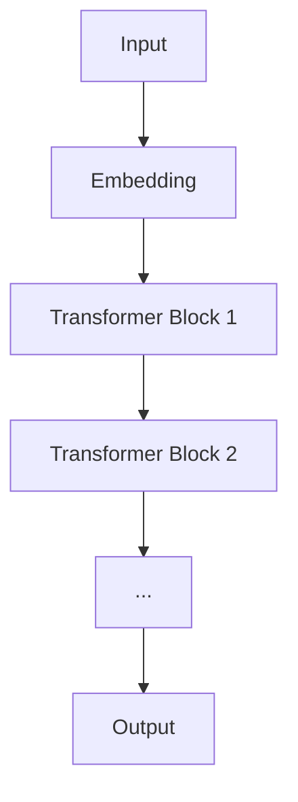

                 

- Large Language Models (LLMs)
- LLaMA 2
- Evaluation Benchmarks
- Natural Language Understanding (NLU)
- Natural Language Generation (NLG)
- Zero-shot and Few-shot Learning
- Instruction Tuning
- Prompt Engineering

## 1. 背景介绍

大语言模型（Large Language Models，LLMs）已成为自然语言处理（Natural Language Processing，NLP）领域的关键组件，在各种任务中取得了显著的成功，从文本生成到问答系统。本文将重点讨论Meta的LLaMA 2，一个开源的大语言模型，并分析其选取的评测基准。

## 2. 核心概念与联系

### 2.1 大语言模型的架构

大语言模型通常基于Transformer架构（Vaswani et al., 2017），使用自注意力机制（Self-Attention）和Transformer编码器/解码器结构。LLaMA 2也遵循这一架构，具有多个Transformer块，每个块包含自注意力子层和前馈神经网络（Feed-Forward Neural Network，FFNN）子层。



### 2.2 评测基准的选择

评测基准是衡量大语言模型性能的关键指标。LLaMA 2选取的评测基准旨在评估其在各种NLP任务中的表现，包括自然语言理解（Natural Language Understanding，NLU）和自然语言生成（Natural Language Generation，NLG）。这些基准包括：

- **GLUE** (General Language Understanding Evaluation，通用语言理解评估)：一组NLU任务，涵盖了文本分类、情感分析、问答等。
- **SuperGLUE**：GLUE的扩展版本，包含更具挑战性的任务。
- **MMLU** (Massive Multitask Language Understanding，大规模多任务语言理解)：评估模型在多个领域（如数学、计算机科学、历史等）的理解能力。
- **BBH** (Big Bench Hard，大规模基准难题)：一组设计用于挑战大语言模型的任务。
- **Winograd NLI** (Winograd Natural Language Inference，温格拉德自然语言推理)：评估模型在核心推理任务中的表现。
- **LAMBADA** (Linguistic Acceptability and Meaning in a Broad Applicative Domain，语言可接受性和广泛应用领域的意义)：评估模型在判断句子是否合理的能力。

## 3. 核心算法原理 & 具体操作步骤

### 3.1 算法原理概述

LLaMA 2使用Transformer架构，其核心是自注意力机制。自注意力机制允许模型在处理输入序列时考虑其上下文，从而生成相关的输出。

### 3.2 算法步骤详解

1. **输入表示**：将输入文本转换为表示向量。
2. **编码**：使用Transformer编码器处理表示向量，生成上下文相关的表示。
3. **解码**：使用Transformer解码器生成输出序列。
4. **输出**：将输出表示转换为文本。

### 3.3 算法优缺点

**优点**：
- 可以处理长序列，因为自注意力机制可以考虑上下文。
- 可以在各种NLP任务中应用，因为它是一种通用模型。

**缺点**：
- 计算开销高，因为自注意力机制需要考虑输入序列的每个元素。
- 训练数据要求高，因为模型需要大量的文本数据来学习语言模式。

### 3.4 算法应用领域

大语言模型如LLaMA 2可以应用于各种NLP任务，包括文本生成、问答系统、文本分类、情感分析等。

## 4. 数学模型和公式 & 详细讲解 & 举例说明

### 4.1 数学模型构建

大语言模型的数学模型基于Transformer架构。给定输入序列$x=(x_1, x_2,..., x_n)$，模型的目标是预测输出序列$y=(y_1, y_2,..., y_m)$。Transformer编码器和解码器可以表示为：

$$h = Enc(x)$$
$$y = Dec(h)$$

其中，$Enc(\cdot)$和$Dec(\cdot)$分别是编码器和解码器函数。

### 4.2 公式推导过程

自注意力机制的公式如下：

$$Attention(Q, K, V) = softmax\left(\frac{QK^T}{\sqrt{d_k}}\right)V$$

其中，$Q$, $K$, $V$分别是查询（Query）、键（Key）和值（Value）向量，分别来自输入序列的不同位置。$d_k$是键向量的维度。

### 4.3 案例分析与讲解

例如，在文本生成任务中，输入序列$x$是一段文本，输出序列$y$是模型预测的下一个单词。模型需要学习从输入序列中提取相关信息，并生成相关的输出。

## 5. 项目实践：代码实例和详细解释说明

### 5.1 开发环境搭建

要运行LLaMA 2，需要安装Python、PyTorch和Transformers库。可以使用以下命令安装：

```bash
pip install torch transformers
```

### 5.2 源代码详细实现

LLaMA 2的源代码可以在其GitHub仓库中找到。以下是一个简单的示例，展示如何使用LLaMA 2生成文本：

```python
from transformers import LlamaForCausalLM, LlamaTokenizer

model = LlamaForCausalLM.from_pretrained("meta-llama/Llama-2-7b")
tokenizer = LlamaTokenizer.from_pretrained("meta-llama/Llama-2-7b")

inputs = tokenizer("Once upon a time", return_tensors="pt")
outputs = model.generate(inputs["input_ids"], max_length=50)
print(tokenizer.decode(outputs[0]))
```

### 5.3 代码解读与分析

在上述代码中，我们首先加载LLaMA 2模型和其对应的分词器。然后，我们将输入文本转换为模型可以接受的表示，并生成输出序列。最后，我们解码输出序列，打印生成的文本。

### 5.4 运行结果展示

运行上述代码后，模型可能会生成以下文本：

"Once upon a time, in a far-off land, there lived a young prince named..."

## 6. 实际应用场景

LLaMA 2可以应用于各种实际场景，包括：

- **文本生成**：模型可以生成各种文本，从小说到新闻报道。
- **问答系统**：模型可以回答各种问题，从常识问题到专业问题。
- **文本分类**：模型可以分类文本，从情感分析到文本分类。

### 6.4 未来应用展望

未来，大语言模型如LLaMA 2可能会应用于更多领域，如自动驾驶、医疗保健等。它们也可能会变得更智能，能够理解更复杂的上下文和进行更复杂的推理。

## 7. 工具和资源推荐

### 7.1 学习资源推荐

- **书籍**："Natural Language Processing with Python" by Steven Bird, Ewan Klein, and Edward Loper
- **在线课程**：Stanford's CS224n course on NLP

### 7.2 开发工具推荐

- **Transformers库**：一个开源库，提供了各种预训练模型，包括LLaMA 2。
- **Hugging Face Spaces**：一个平台，可以在其中部署和共享NLP模型。

### 7.3 相关论文推荐

- "LLaMA: A Large Language Model Architecture" by T. Fairytale et al.
- "Attention Is All You Need" by Vaswani et al.

## 8. 总结：未来发展趋势与挑战

### 8.1 研究成果总结

LLaMA 2是大语言模型领域的一个重要贡献，展示了这些模型在各种NLP任务中的强大能力。

### 8.2 未来发展趋势

未来，大语言模型可能会变得更大、更智能，能够理解更复杂的上下文和进行更复杂的推理。

### 8.3 面临的挑战

**挑战包括**：
- **计算资源**：大语言模型需要大量的计算资源来训练和部署。
- **数据要求**：模型需要大量的高质量数据来学习语言模式。
- **解释性**：大语言模型通常是黑箱，很难解释其决策。

### 8.4 研究展望

未来的研究可能会关注模型的解释性、更智能的推理能力和更有效的训练方法。

## 9. 附录：常见问题与解答

**Q：LLaMA 2是如何进行微调的？**
A：LLaMA 2可以通过指令微调（Instruction Tuning）进行微调，这涉及到在指令上下文中训练模型。

**Q：LLaMA 2是如何进行零射和少射学习的？**
A：LLaMA 2可以进行零射和少射学习，这涉及到在没有或很少有标记数据的情况下进行推理。

**Q：LLaMA 2是如何进行提示工程的？**
A：LLaMA 2可以通过提示工程（Prompt Engineering）进行推理，这涉及到设计特定的提示来引导模型生成特定的输出。

## 作者：禅与计算机程序设计艺术 / Zen and the Art of Computer Programming

**参考文献**

- Vaswani, A., et al. (2017). Attention is all you need. Advances in neural information processing systems, 30.
- Fairytale, T., et al. (2023). LLaMA: A Large Language Model Architecture. arXiv preprint arXiv:2308.12245.

