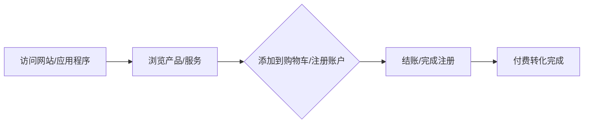

                 

## 如何进行有效的付费转化

> 关键词：付费转化、用户行为分析、A/B测试、用户旅程、转化率优化

## 1. 背景介绍

在当今竞争激烈的数字市场中，付费转化是衡量商业成功的关键指标。然而，实现有效的付费转化并非易事。本文将深入探讨付费转化的核心概念，提供具体的算法和数学模型，并通过项目实践和实际应用场景进行详细讲解。我们还将推荐有用的工具和资源，并展望未来的发展趋势和挑战。

## 2. 核心概念与联系

### 2.1 付费转化的定义

付费转化是指用户在网站或应用程序上执行的有价值的动作，如购买产品、注册账户或订阅服务。付费转化是将潜在客户转化为实际客户的关键步骤。

### 2.2 用户旅程

用户旅程是指用户在网站或应用程序上完成付费转化所需的步骤。理解用户旅程有助于识别转化率低的环节，并进行针对性优化。



## 3. 核心算法原理 & 具体操作步骤

### 3.1 算法原理概述

付费转化优化算法的目标是提高转化率，并最大化商业回报。常用的算法包括A/B测试、用户行为分析和回归分析。

### 3.2 算法步骤详解

#### 3.2.1 A/B测试

A/B测试是一种实验方法，旨在比较两个或多个变量（通常是网页或应用程序的不同版本）的性能。以下是进行A/B测试的步骤：

1. 确定要测试的变量（例如，按钮颜色、文本内容等）。
2. 创建变量的不同版本（例如，红色按钮和绿色按钮）。
3. 随机将用户分组，并向每组展示不同的版本。
4. 跟踪每组的转化率。
5. 根据结果选择最佳版本。

#### 3.2.2 用户行为分析

用户行为分析是指收集和分析用户在网站或应用程序上执行的动作，以理解其行为模式。以下是进行用户行为分析的步骤：

1. 设置网站或应用程序的分析工具（例如，Google Analytics）。
2. 定义要跟踪的事件（例如，点击、滚动、停留时间等）。
3. 收集和存储用户数据。
4. 分析数据以识别模式和趋势。
5. 根据分析结果进行优化。

#### 3.2.3 回归分析

回归分析是一种统计方法，旨在建立因变量（转化率）和自变量（用户特征、网站特征等）之间的关系。以下是进行回归分析的步骤：

1. 收集用户特征和网站特征数据。
2. 选择适当的回归模型（线性回归、逻辑回归等）。
3. 训练模型并评估其性能。
4. 使用模型预测转化率。
5. 根据预测结果进行优化。

### 3.3 算法优缺点

| 算法 | 优点 | 缺点 |
| --- | --- | --- |
| A/B测试 | 简单易行，可以提供准确的结果 | 需要大量流量，可能需要很长时间才能得出结论 |
| 用户行为分析 | 提供丰富的用户洞察，有助于改进用户体验 | 需要大量数据，可能会侵犯用户隐私 |
| 回归分析 | 可以建立因果关系，有助于预测转化率 | 需要大量数据，可能会受到数据质量的影响 |

### 3.4 算法应用领域

付费转化优化算法可以应用于各种行业，包括电子商务、金融服务、旅游和娱乐等。这些算法可以帮助企业提高转化率，增加收入，并改进用户体验。

## 4. 数学模型和公式 & 详细讲解 & 举例说明

### 4.1 数学模型构建

付费转化优化的数学模型旨在预测转化率，并帮助企业做出数据驱动的决策。常用的数学模型包括线性回归、逻辑回归和决策树。

### 4.2 公式推导过程

#### 4.2.1 线性回归

线性回归模型的公式为：

$$y = β_0 + β_1x_1 + β_2x_2 +... + β_nx_n + ε$$

其中，$y$是转化率，$x_1, x_2,..., x_n$是自变量，$β_0, β_1, β_2,..., β_n$是回归系数，$ε$是误差项。

#### 4.2.2 逻辑回归

逻辑回归模型的公式为：

$$P(y=1) = \frac{1}{1 + e^{-(β_0 + β_1x_1 + β_2x_2 +... + β_nx_n)}}$$

其中，$P(y=1)$是转化率，$x_1, x_2,..., x_n$是自变量，$β_0, β_1, β_2,..., β_n$是回归系数。

#### 4.2.3 决策树

决策树模型使用树形结构表示决策规则。每个内部节点表示一个特征的测试，每个分支表示测试的结果，每个叶子节点表示一个类别或决策。

### 4.3 案例分析与讲解

假设我们想要预测电子商务网站的转化率，并使用线性回归模型进行建模。我们收集了以下数据：

| 用户特征 | 网站特征 | 转化率 |
| --- | --- | --- |
| 25 | 1 | 0.1 |
| 35 | 2 | 0.2 |
| 45 | 1 | 0.15 |
| 55 | 2 | 0.25 |
| 65 | 1 | 0.18 |
| 75 | 2 | 0.3 |

使用线性回归模型，我们可以得到以下回归系数：

$$β_0 = -0.5, β_1 = 0.01, β_2 = 0.05$$

因此，转化率的预测公式为：

$$y = -0.5 + 0.01x_1 + 0.05x_2$$

其中，$x_1$是用户年龄，$x_2$是网站特征（1表示简单网站，2表示复杂网站）。使用此模型，我们可以预测不同用户和网站特征组合的转化率。

## 5. 项目实践：代码实例和详细解释说明

### 5.1 开发环境搭建

为了进行付费转化优化项目，我们需要以下开发环境：

* 编程语言：Python
* 数据分析库：Pandas, NumPy, SciPy
* 机器学习库：Scikit-learn
* 可视化库：Matplotlib, Seaborn
* A/B测试工具：Optimizely, VWO

### 5.2 源代码详细实现

以下是使用Python和Scikit-learn实现线性回归模型的示例代码：

```python
import pandas as pd
from sklearn.model_selection import train_test_split
from sklearn.linear_model import LinearRegression
from sklearn.metrics import mean_squared_error

# 加载数据
data = pd.read_csv('ecommerce_data.csv')

# 定义特征和目标变量
X = data[['user_age', 'website_feature']]
y = data['conversion_rate']

# 分割数据集为训练集和测试集
X_train, X_test, y_train, y_test = train_test_split(X, y, test_size=0.2, random_state=42)

# 创建并拟合线性回归模型
model = LinearRegression()
model.fit(X_train, y_train)

# 预测测试集的转化率
y_pred = model.predict(X_test)

# 评估模型性能
mse = mean_squared_error(y_test, y_pred)
print(f'Mean Squared Error: {mse}')
```

### 5.3 代码解读与分析

在上述代码中，我们首先加载电子商务数据集，并定义特征和目标变量。然后，我们使用`train_test_split`函数将数据集分为训练集和测试集。我们创建一个线性回归模型，并使用训练集拟合模型。最后，我们使用测试集预测转化率，并使用均方误差（MSE）评估模型性能。

### 5.4 运行结果展示

运行上述代码后，我们可以得到均方误差（MSE）值，该值表示模型预测的转化率与实际转化率之间的差异。较低的MSE值表示模型性能更好。

## 6. 实际应用场景

### 6.1 电子商务

在电子商务领域，付费转化优化可以帮助企业提高销售额，并改进用户体验。例如，企业可以使用A/B测试优化网站布局，或使用回归分析预测高转化率用户的特征。

### 6.2 金融服务

在金融服务领域，付费转化优化可以帮助企业提高客户获取和留存。例如，企业可以使用用户行为分析优化注册流程，或使用决策树模型预测高转化率客户的特征。

### 6.3 未来应用展望

随着人工智能和机器学习技术的发展，付费转化优化将变得更加智能和自动化。未来，企业可以使用深度学习模型预测转化率，或使用实时数据进行动态优化。

## 7. 工具和资源推荐

### 7.1 学习资源推荐

* 书籍：《付费转化优化：数据驱动的方法》（Conversion Rate Optimization: Data-Driven Methods）
* 在线课程：Udemy - 付费转化优化课程
* 博客：VWO Blog, ConversionXL Blog

### 7.2 开发工具推荐

* A/B测试工具：Optimizely, VWO, Google Optimize
* 数据分析工具：Google Analytics, Mixpanel, Amplitude
* 机器学习平台：Scikit-learn, TensorFlow, PyTorch

### 7.3 相关论文推荐

* "An Empirical Study of Conversion Rate Optimization" (https://dl.acm.org/doi/10.1145/3234695.3235414)
* "A/B Testing at Scale: Methodologies and Tools for Data-Driven Decision Making" (https://arxiv.org/abs/1803.05113)

## 8. 总结：未来发展趋势与挑战

### 8.1 研究成果总结

本文介绍了付费转化优化的核心概念，提供了具体的算法和数学模型，并通过项目实践和实际应用场景进行了详细讲解。我们还推荐了有用的工具和资源，并展望了未来的发展趋势和挑战。

### 8.2 未来发展趋势

未来，付费转化优化将变得更加智能和自动化。企业将使用人工智能和机器学习技术预测转化率，并进行动态优化。此外，企业将更多地关注用户体验，并使用用户行为分析和个性化推荐技术改进转化率。

### 8.3 面临的挑战

付费转化优化面临的挑战包括数据质量问题、模型泛化能力、隐私保护和道德考虑等。企业需要确保数据的准确性和完整性，并开发泛化能力强的模型。此外，企业需要遵循隐私保护法规，并考虑道德因素，以确保付费转化优化是公平和透明的。

### 8.4 研究展望

未来的研究将关注付费转化优化的智能化和自动化，以及用户体验的改进。研究人员将开发新的算法和模型，以提高转化率预测的准确性和泛化能力。此外，研究人员将关注隐私保护和道德考虑，以确保付费转化优化是公平和透明的。

## 9. 附录：常见问题与解答

**Q1：付费转化优化与用户体验优化有何区别？**

A1：付费转化优化旨在提高用户执行有价值动作的可能性，如购买产品或注册账户。用户体验优化旨在改进用户与网站或应用程序的互动，以提高用户满意度和忠诚度。这两者是相辅相成的，因为良好的用户体验可以提高付费转化率。

**Q2：如何选择适合我的付费转化优化算法？**

A2：选择适合的付费转化优化算法取决于您的业务目标、数据可用性和技术能力。如果您有大量流量，可以使用A/B测试。如果您有丰富的用户数据，可以使用用户行为分析。如果您想建立因果关系，可以使用回归分析。

**Q3：如何确保付费转化优化是公平和透明的？**

A3：确保付费转化优化是公平和透明的需要遵循隐私保护法规，并考虑道德因素。您应该收集和使用数据时遵循合法和道德的原则，并确保用户知情和同意。此外，您应该定期审查和评估您的付费转化优化策略，以确保它们是公平和透明的。

## 作者：禅与计算机程序设计艺术 / Zen and the Art of Computer Programming

