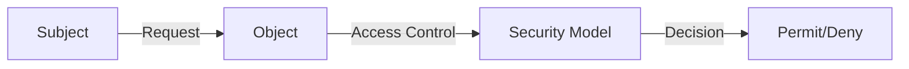
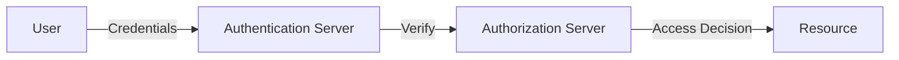

                 

**安全和访问控制：保护应用程序**

> 关键词：访问控制，安全模型，身份验证，授权，安全架构，最小特权原则，安全编程实践

## 1. 背景介绍

在当今的数字世界中，应用程序面临着各种安全威胁。保护应用程序免受未授权访问和滥用是一项关键任务。安全和访问控制是实现这一任务的关键组成部分。本文将深入探讨安全和访问控制的核心概念，并提供实用的指南，帮助开发人员和架构师保护他们的应用程序。

## 2. 核心概念与联系

### 2.1 安全模型

安全模型是定义系统安全属性的框架。最常见的安全模型是 Bell-LaPadula 模型和 Biba 模型。



### 2.2 身份验证与授权

身份验证是确认用户身份的过程。授权则是基于身份验证结果，确定用户是否有权访问特定资源的过程。



### 2.3 最小特权原则

最小特权原则（Principle of Least Privilege, PoLP）是一种安全设计原则，它要求每个主体（如进程、用户）只能获得完成任务所需的最低权限。

## 3. 核心算法原理 & 具体操作步骤

### 3.1 授权算法原理概述

授权算法基于访问控制列表（Access Control List, ACL）或角色基础结构（Role-Based Access Control, RBAC）来做出访问决策。

### 3.2 授权算法步骤详解

1. 身份验证：验证用户提供的凭据。
2. 授权检查：检查用户是否具有访问请求的权限。
3. 访问决策：基于授权检查结果，允许或拒绝访问请求。

### 3.3 算法优缺点

**优点**：授权算法有助于实现最小特权原则，提高系统的安全性。

**缺点**：实施复杂，需要大量的管理工作。

### 3.4 算法应用领域

授权算法广泛应用于操作系统、数据库系统和 Web 应用程序中。

## 4. 数学模型和公式 & 详细讲解 & 举例说明

### 4.1 访问控制矩阵

访问控制矩阵（Access Control Matrix, ACM）是一种表示访问控制信息的方式。它是一个二维矩阵，其中一维表示主体，另一维表示对象。

$$ACM = \begin{bmatrix}
  a_{11} & a_{12} & \cdots & a_{1n} \\
  a_{21} & a_{22} & \cdots & a_{2n} \\
  \vdots & \vdots & \ddots & \vdots \\
  a_{m1} & a_{m2} & \cdots & a_{mn}
\end{bmatrix}$$

其中，$a_{ij}$ 表示主体 $i$ 对对象 $j$ 的访问权限。

### 4.2 访问控制策略

访问控制策略（Access Control Policy,ACP）定义了系统中允许的访问控制决策。ACP 可以表示为：

$$ACP = \{ (s, o, a) | s \in S, o \in O, a \in A \}$$

其中，$S$ 是主体集，$O$ 是对象集，$A$ 是访问模式集。

### 4.3 案例分析与讲解

考虑一个简单的文件系统，其中有三个用户（Alice, Bob, Charlie）和三个文件（File1, File2, File3）。ACM 如下：

$$ACM = \begin{bmatrix}
  rw & r & - \\
  r & rw & r \\
  - & r & rw
\end{bmatrix}$$

其中，$rw$ 表示读写权限，$r$ 表示只读权限，$-$ 表示没有权限。ACP 如下：

$$ACP = \{ (Alice, File1, rw), (Alice, File2, r), (Bob, File2, rw), (Bob, File3, r), (Charlie, File3, rw) \}$$

## 5. 项目实践：代码实例和详细解释说明

### 5.1 开发环境搭建

本示例使用 Java 和 Spring Security 框架。您需要安装 Java 8 及以上版本，并设置 Spring Boot 开发环境。

### 5.2 源代码详细实现

```java
@Configuration
@EnableWebSecurity
public class SecurityConfig extends WebSecurityConfigurerAdapter {

    @Override
    protected void configure(HttpSecurity http) throws Exception {
        http.authorizeRequests()
           .antMatchers("/admin/**").hasRole("ADMIN")
           .anyRequest().authenticated()
           .and()
           .formLogin()
           .and()
           .httpBasic();
    }

    @Autowired
    public void configureGlobal(AuthenticationManagerBuilder auth) throws Exception {
        auth.inMemoryAuthentication()
           .withUser("user").password("{noop}password").roles("USER")
           .and()
           .withUser("admin").password("{noop}admin").roles("ADMIN");
    }
}
```

### 5.3 代码解读与分析

在 `SecurityConfig` 类中，我们配置了 Spring Security。我们使用 `HttpSecurity` 来配置安全规则。`antMatchers` 方法用于指定需要特定角色的 URL。`formLogin` 和 `httpBasic` 方法用于配置登录页面和 HTTP 基本身份验证。

### 5.4 运行结果展示

当用户尝试访问 `/admin/**` URL 时，系统会要求用户提供凭据。只有具有 "ADMIN" 角色的用户才能访问这些 URL。

## 6. 实际应用场景

### 6.1 企业应用

企业可以使用安全和访问控制来保护其敏感数据，并确保只有授权的用户才能访问这些数据。

### 6.2 云应用

云应用需要实施严格的安全和访问控制，以保护用户数据免受未授权访问。

### 6.3 未来应用展望

未来，安全和访问控制将越来越多地应用于物联网（IoT）设备和边缘计算环境中。

## 7. 工具和资源推荐

### 7.1 学习资源推荐

- "Computer Security Fundamentals" 课程（Coursera）
- "Access Control" 课程（Udacity）

### 7.2 开发工具推荐

- Spring Security
- Keycloak
- Okta

### 7.3 相关论文推荐

- Sandhu, R., et al. (1996). "Role-Based Access Control Models." IEEE Transactions on Software Engineering, 22(6), 434-445.
- Ferraiolo, D. F., Kuhn, D. R., & Sandhu, R. S. (1999). "Role-Based Access Control: Features and Research Challenges." ACM Transactions on Information and System Security, 2(1), 1-22.

## 8. 总结：未来发展趋势与挑战

### 8.1 研究成果总结

本文介绍了安全和访问控制的核心概念，并提供了实用的指南，帮助开发人员和架构师保护他们的应用程序。

### 8.2 未来发展趋势

未来，安全和访问控制将越来越多地应用于新兴领域，如物联网和边缘计算。此外，基于属性的访问控制（Attribute-Based Access Control, ABAC）将变得更加流行。

### 8.3 面临的挑战

实施安全和访问控制需要大量的管理工作。此外，随着新技术的出现，安全和访问控制面临着新的挑战。

### 8.4 研究展望

未来的研究将关注如何在新兴领域应用安全和访问控制，以及如何简化安全和访问控制的实施。

## 9. 附录：常见问题与解答

**Q：什么是最小特权原则？**

**A：**最小特权原则是一种安全设计原则，它要求每个主体（如进程、用户）只能获得完成任务所需的最低权限。

**Q：什么是访问控制矩阵？**

**A：**访问控制矩阵（ACM）是一种表示访问控制信息的方式。它是一个二维矩阵，其中一维表示主体，另一维表示对象。

**Q：什么是访问控制策略？**

**A：**访问控制策略（ACP）定义了系统中允许的访问控制决策。

**作者：禅与计算机程序设计艺术 / Zen and the Art of Computer Programming**

