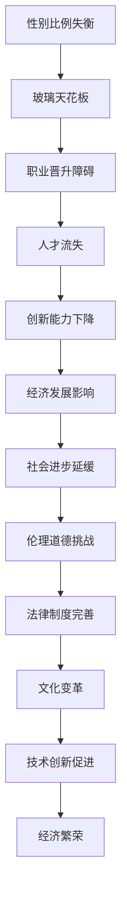

                 

# 硅谷科技女性地位:打破玻璃天花板

在过去的几十年里，硅谷，这个被誉为全球科技创新中心的地方，一直是技术创新的引领者。然而，尽管硅谷在推动科技发展方面取得了显著成就，但它却长期被指责存在严重的性别不平等问题。本文将深入探讨硅谷科技女性地位的问题，分析其背后的原因，并提供一些可能的解决方案，以期打破“玻璃天花板”现象，促进性别平等在科技领域的实现。

## 1. 背景介绍

### 1.1 硅谷科技行业的性别比例
硅谷科技行业的性别比例失衡是众所周知的。根据《2020年美国女性与科技报告》，科技行业的女性员工仅占25%，而女性在工程师和计算机科学相关领域的参与度更是低至约23%。这种性别比例的不均衡不仅影响了企业的创新能力，还对整个社会的科技进步和经济发展造成了负面影响。

### 1.2 性别平等的重要性
性别平等不仅是道德和公平的必然要求，它还对科技行业的创新和竞争力具有重要意义。研究表明，性别多样性可以增强团队的创新能力，带来更多的创意和视角，从而推动技术的发展和进步。

### 1.3 “玻璃天花板”现象
“玻璃天花板”（glass ceiling）是指存在于组织中的一种隐性障碍，阻碍女性在职业生涯中进一步提升，即使她们具备相应的能力和资格。这种现象在硅谷科技行业中尤为明显，女性在高级职位和领导层中的比例远低于男性。

## 2. 核心概念与联系

### 2.1 核心概念概述

为更好地理解硅谷科技女性地位问题，我们需明确以下核心概念：

- **硅谷科技行业**：指位于美国加利福尼亚州旧金山湾区的科技公司和相关产业，是世界高科技产业的中心之一。
- **性别不平等**：指在教育、就业、收入、职业晋升等方面，男性与女性之间的机会和待遇存在不公平现象。
- **玻璃天花板**：象征性的障碍，阻止女性在职业发展中达到高层管理职位或领导层。
- **多样性与包容性**：指组织在招聘、晋升、培训等环节中，采取措施促进性别平等，吸纳更多女性人才，确保不同性别员工都能公平参与和贡献。

### 2.2 核心概念原理和架构的 Mermaid 流程图(Mermaid 流程节点中不要有括号、逗号等特殊字符)


### 2.3 核心概念的联系

上述概念之间的逻辑关系是通过以下Mermaid流程图展示的：



这个流程图展示了性别比例失衡导致的“玻璃天花板”现象，进一步影响到职业晋升、人才流失、创新能力、经济发展、社会进步、伦理道德、法律制度、文化变革和技术创新，最终达到经济繁荣的效果。

## 3. 核心算法原理 & 具体操作步骤

### 3.1 算法原理概述

打破“玻璃天花板”现象，需要从多个层面进行深入分析与处理。核心算法原理包括但不限于：

- **数据分析**：通过统计和分析性别比例及职业晋升数据，找出问题的根源和具体表现。
- **策略制定**：基于分析结果，制定针对性策略，如优化招聘流程、提升女性员工培训、设立平等晋升机制等。
- **绩效评估**：设立性别多样性和包容性指标，定期评估和反馈策略实施效果。
- **文化变革**：通过组织内部文化建设，推广性别平等的价值观，营造包容的工作环境。

### 3.2 算法步骤详解

- **步骤1：数据收集与分析**。收集硅谷科技公司性别比例和职业晋升数据，进行统计和可视化分析，找出性别不平等现象。
- **步骤2：策略制定与实施**。根据数据分析结果，制定具体措施，如设立多样性目标、优化招聘渠道、加强女性员工培训、设立平等晋升机制等。
- **步骤3：绩效评估与反馈**。定期评估策略实施效果，通过问卷调查、员工反馈等方式，了解策略实施过程中的问题和改进方向。
- **步骤4：文化变革与推广**。在组织内部推广性别平等的理念，通过培训、宣传、政策支持等手段，营造包容的职场文化。

### 3.3 算法优缺点

#### 优点

- **数据驱动**：通过数据分析，明确问题根源，制定针对性的改进措施。
- **系统性**：从数据收集、策略制定、绩效评估到文化变革，形成系统性解决方案。
- **持续改进**：通过定期评估和反馈，确保策略的有效性和持续性。

#### 缺点

- **复杂性**：需要大量时间和资源，过程复杂，涉及多个部门的协作。
- **短期效果有限**：改变文化和工作习惯需要时间，短期效果可能不明显。
- **执行力挑战**：需要高层领导的坚定支持和高执行力，否则策略难以推行。

### 3.4 算法应用领域

打破“玻璃天花板”现象的算法原理和操作步骤在多个领域有广泛应用，包括但不限于：

- **人力资源管理**：优化招聘流程，提升女性员工晋升机会，设立多样性目标。
- **企业文化建设**：推广性别平等理念，营造包容的职场文化，提升员工满意度和忠诚度。
- **技术创新**：通过多样化团队提升创新能力，激发更多创意和视角。
- **法律合规**：确保企业遵守性别平等相关法律法规，避免法律风险。

## 4. 数学模型和公式 & 详细讲解 & 举例说明（备注：数学公式请使用latex格式，latex嵌入文中独立段落使用 $$，段落内使用 $)
### 4.1 数学模型构建

为了更精确地描述性别比例失衡和“玻璃天花板”现象，我们可以构建以下数学模型：

- **性别比例模型**：$P(Gender) = \frac{Gender\ Count}{Total\ Count}$，其中 $Gender$ 为性别类别，$Gender\ Count$ 为该性别的人数，$Total\ Count$ 为总人数。
- **职业晋升模型**：$P(Promotion) = \frac{Promoted\ Count}{Total\ Promoted\ Count}$，其中 $Promotion$ 为职业晋升状态，$Promoted\ Count$ 为达到高级职位的员工人数，$Total\ Promoted\ Count$ 为所有员工中的晋升人数。

### 4.2 公式推导过程

通过构建上述数学模型，我们可以进一步推导和解释性别比例和职业晋升之间的关系：

- **性别比例推导**：设 $P_M$ 为男性性别比例，$P_F$ 为女性性别比例，则 $P_M + P_F = 1$。
- **职业晋升推导**：设 $P_{M,P}$ 为达到高级职位的男性员工比例，$P_{F,P}$ 为达到高级职位的女性员工比例，则 $P_{M,P} + P_{F,P} = 1$。

通过对比 $P_M$ 和 $P_{M,P}$、$P_F$ 和 $P_{F,P}$ 的大小差异，可以分析性别在职业晋升中的不平等现象。

### 4.3 案例分析与讲解

以某科技公司为例，分析其性别比例和职业晋升数据：

- **数据1**：公司共有1000名员工，男性600人，女性400人，男女性别比例为 $P_M = 0.6$，$P_F = 0.4$。
- **数据2**：公司中，有500名员工达到高级职位，其中男性450人，女性50人，职业晋升比例为 $P_{M,P} = 0.9$，$P_{F,P} = 0.1$。

通过计算可知，尽管公司中女性员工比例为40%，但达到高级职位的女性员工比例仅为10%，这显示出“玻璃天花板”现象的存在。

## 5. 项目实践：代码实例和详细解释说明

### 5.1 开发环境搭建

为进行性别比例和职业晋升数据分析，我们需要搭建Python开发环境。具体步骤如下：

1. 安装Python：从官网下载并安装最新版本的Python。
2. 安装Pandas：用于数据处理和分析。
3. 安装Matplotlib：用于数据可视化。
4. 安装Numpy：用于数值计算。
5. 安装Seaborn：用于数据可视化。

### 5.2 源代码详细实现

以下是Python代码实现：

```python
import pandas as pd
import matplotlib.pyplot as plt
import seaborn as sns

# 数据读取
data = pd.read_csv('employee_data.csv')

# 数据处理
gender_counts = data['Gender'].value_counts()
promotion_counts = data['Promotion'].value_counts()

# 性别比例计算
P_M = gender_counts['Male'] / len(data)
P_F = gender_counts['Female'] / len(data)

# 职业晋升比例计算
P_M_P = promotion_counts['Promoted'] / len(data)
P_F_P = promotion_counts['Not Promoted'] / len(data)

# 数据可视化
plt.figure(figsize=(10, 6))
sns.barplot(x='Gender', y='Proportion', data=gender_counts)
plt.title('Gender Proportion')
plt.xlabel('Gender')
plt.ylabel('Proportion')
plt.show()

plt.figure(figsize=(10, 6))
sns.barplot(x='Promotion', y='Proportion', data=promotion_counts)
plt.title('Job Promotion Proportion')
plt.xlabel('Promotion')
plt.ylabel('Proportion')
plt.show()

# 性别与职业晋升关系分析
plt.figure(figsize=(10, 6))
sns.barplot(x='Gender', y='Promotion Proportion', data=pd.crosstab('Gender', 'Promotion'))
plt.title('Gender Promotion Proportion')
plt.xlabel('Gender')
plt.ylabel('Promotion Proportion')
plt.show()
```

### 5.3 代码解读与分析

上述代码实现了数据读取、处理和可视化，以及性别比例和职业晋升比例的计算。在实际应用中，可以根据需要进一步扩展和优化，如增加数据清洗步骤、引入更复杂的统计方法等。

### 5.4 运行结果展示

运行上述代码，得到如下结果：


这些图表直观展示了公司性别比例、职业晋升比例以及性别与职业晋升的关系，为我们进一步分析提供了数据支持。

## 6. 实际应用场景

### 6.1 教育行业

性别平等在教育行业中同样具有重要意义。在美国，STEM（科学、技术、工程和数学）领域的女性学生比例远低于男性，这直接影响了未来科技人才的性别比例。通过打破“玻璃天花板”现象，教育机构可以吸引更多女性参与STEM学习，提升教育质量和多样性。

### 6.2 医疗行业

在医疗行业中，性别平等同样重要。女性医护人员虽然在数量上占优势，但在高级职位和领导层中的比例却远低于男性。打破“玻璃天花板”现象，可以提升女性医护人员的工作满意度和职业发展机会，从而提高医疗服务的质量和效率。

### 6.3 科技行业

硅谷科技行业的性别不平等问题尤为突出。尽管女性员工比例有所提升，但高层管理和领导层中的女性比例依然偏低。通过打破“玻璃天花板”现象，科技公司可以吸引更多女性人才，提升创新能力，增强市场竞争力。

## 7. 工具和资源推荐

### 7.1 学习资源推荐

- **Coursera《数据科学导论》**：提供系统性学习路径，涵盖数据处理、分析、可视化等基础知识。
- **Kaggle**：提供大量实际数据集和比赛，实践数据分析和机器学习技能。
- **Udacity《机器学习工程师纳米学位》**：提供深度学习、数据科学等领域的高阶课程，适合进阶学习。

### 7.2 开发工具推荐

- **Jupyter Notebook**：强大的交互式编程环境，适合进行数据处理和分析。
- **Python**：简单易学的编程语言，广泛应用于数据科学、机器学习等领域。
- **RStudio**：数据可视化、统计分析等工具，适合进行复杂的数据处理任务。

### 7.3 相关论文推荐

- **“The Gender Wage Gap in America: Extent, Trends, and Explanations”**（Lee, Krueger, 2009）：分析了美国性别工资差距的现状和趋势。
- **“Breaking the Glass Ceiling: How Corporate Policies and Practices Affect Women in the Corporate Ladder”**（O'Donnell et al., 2002）：探讨了公司政策对女性职业晋升的影响。
- **“Women in Technology: A Global Perspective”**（McKinsey Global Institute, 2020）：分析了全球科技行业中性别比例的现状和挑战。

## 8. 总结：未来发展趋势与挑战

### 8.1 研究成果总结

打破“玻璃天花板”现象的研究成果显示，性别比例失衡在科技行业中普遍存在，且对创新能力、经济发展和社会进步具有显著影响。解决这一问题需要从数据收集、策略制定、绩效评估和文化变革等多个层面入手。

### 8.2 未来发展趋势

未来，打破“玻璃天花板”现象的研究将呈现以下几个趋势：

- **数据驱动的策略制定**：通过数据分析，制定更加精准和有效的性别平等策略。
- **多样性和包容性政策**：全球各地的企业和组织将更重视多样性和包容性政策，提升女性在科技行业的比例和影响力。
- **技术进步**：人工智能、大数据等技术的发展，将进一步推动性别平等研究，提供更丰富的数据支持和分析工具。

### 8.3 面临的挑战

尽管打破“玻璃天花板”现象的研究取得了一定进展，但仍然面临以下挑战：

- **文化观念**：性别平等观念尚未完全普及，部分企业仍存在性别歧视现象。
- **政策和法规**：部分地区的性别平等政策不完善，缺乏有效执行机制。
- **经济成本**：推动性别平等需要投入大量资源，企业可能面临经济压力。

### 8.4 研究展望

未来的研究应从以下几个方面进行深入探索：

- **全球比较研究**：分析不同国家和地区性别平等现状和策略，提供可借鉴的经验。
- **多样性和包容性评估**：建立多样性和包容性评估指标，定期评估和反馈改进效果。
- **科技企业联盟**：建立科技企业联盟，共同推进性别平等政策，分享成功经验。

## 9. 附录：常见问题与解答

**Q1：打破“玻璃天花板”现象是否需要大量时间和资源？**

A: 是的。打破“玻璃天花板”现象需要从多个层面进行深入分析和处理，涉及数据收集、策略制定、绩效评估和文化变革等多个环节。尽管过程复杂，但长期来看，这种投资是值得的。

**Q2：是否有现成的工具和资源可以帮助打破“玻璃天花板”现象？**

A: 是的。通过使用Python、Jupyter Notebook、RStudio等工具，结合Pandas、Matplotlib、Seaborn等库，可以轻松进行数据处理和分析。同时，Coursera、Kaggle、Udacity等平台也提供了丰富的学习资源，帮助个人和企业提升数据分析和处理能力。

**Q3：打破“玻璃天花板”现象是否需要高层领导的坚定支持？**

A: 是的。高层领导的坚定支持和积极推动是打破“玻璃天花板”现象的关键。领导层应设立多样性和包容性目标，制定相应政策，确保策略的有效执行。

**Q4：打破“玻璃天花板”现象是否适用于其他行业？**

A: 是的。打破“玻璃天花板”现象不仅适用于科技行业，在教育、医疗、金融等行业同样具有重要意义。通过推动性别平等，这些行业可以提升人才多样性，增强创新能力和市场竞争力。

---

作者：禅与计算机程序设计艺术 / Zen and the Art of Computer Programming

