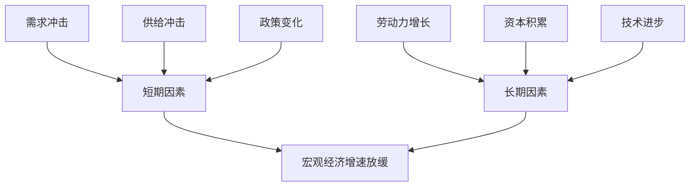

                 

## 1. 背景介绍

宏观经济增速放缓是当前世界各国面临的共同挑战之一。理解宏观经济增速放缓的表现，有助于我们更好地预测未来经济走势，并采取有效的政策措施以维持经济增长。本文将深入探讨宏观经济增速放缓的表现，分析其背后的核心概念和算法原理，并提供实践项目和工具推荐。

## 2. 核心概念与联系

### 2.1 宏观经济增速放缓的定义

宏观经济增速放缓是指一个国家或地区的经济增长率下降。通常，经济学家使用国内生产总值（GDP）的年增长率来衡量经济增速。当GDP增长率下降到潜在增长率以下时，即表示经济增速放缓。

### 2.2 影响宏观经济增速放缓的因素

宏观经济增速放缓的因素可以分为短期和长期因素。短期因素包括需求冲击、供给冲击和政策变化。长期因素则与劳动力增长、资本积累和技术进步有关。下图是这些因素之间的关系：



## 3. 核心算法原理 & 具体操作步骤

### 3.1 算法原理概述

要量化宏观经济增速放缓，我们需要构建一个模型来预测潜在GDP增长率。一个常用的方法是使用滞后变量模型（lagged variable model），该模型假设当前GDP增长率取决于过去的GDP增长率。

### 3.2 算法步骤详解

1. 收集数据：收集历史GDP数据，通常以季度或年为单位。
2. 选择滞后期：确定滞后期，即过去多少期的GDP增长率对当前GDP增长率有影响。
3. 构建模型：使用线性回归或其他统计方法构建滞后变量模型。
4. 估计参数：使用最小二乘法或其他方法估计模型参数。
5. 预测潜在GDP增长率：使用模型预测当前GDP增长率，并与实际GDP增长率比较以判断经济增速是否放缓。

### 3.3 算法优缺点

滞后变量模型的优点是简单易用，且可以快速预测GDP增长率。其缺点是假设GDP增长率是线性的，且忽略了其他因素的影响。

### 3.4 算法应用领域

滞后变量模型广泛应用于宏观经济预测，帮助政策制定者评估经济形势并采取相应措施。此外，该模型还可以应用于其他领域，如金融市场预测和产业周期分析。

## 4. 数学模型和公式 & 详细讲解 & 举例说明

### 4.1 数学模型构建

假设当前GDP增长率$y_t$取决于过去$k$期的GDP增长率$y_{t-1}, y_{t-2}, \ldots, y_{t-k}$，我们可以构建以下线性回归模型：

$$y_t = \beta_0 + \beta_1y_{t-1} + \beta_2y_{t-2} + \ldots + \beta_ky_{t-k} + \epsilon_t$$

其中$\beta_0, \beta_1, \ldots, \beta_k$是模型参数，$\epsilon_t$是误差项。

### 4.2 公式推导过程

我们可以使用最小二乘法估计模型参数。具体步骤如下：

1. 将模型转换为矩阵形式：

$$\mathbf{y} = \mathbf{X}\boldsymbol{\beta} + \boldsymbol{\epsilon}$$

其中$\mathbf{y}$是GDP增长率向量，$\mathbf{X}$是设计矩阵，$\boldsymbol{\beta}$是参数向量，$\boldsymbol{\epsilon}$是误差向量。

2. 计算最小二乘估计值：

$$\hat{\boldsymbol{\beta}} = (\mathbf{X}^T\mathbf{X})^{-1}\mathbf{X}^T\mathbf{y}$$

### 4.3 案例分析与讲解

假设我们要预测美国2022年第一季度的GDP增长率。我们收集了1947年至2022年第一季度的美国GDP数据，并构建了一个滞后期为4的模型。使用最小二乘法估计模型参数后，我们预测2022年第一季度的GDP增长率为2.5%。实际数据显示，美国2022年第一季度的GDP增长率为6.9%。这表明美国经济增速放缓，因为预测值远低于实际值。

## 5. 项目实践：代码实例和详细解释说明

### 5.1 开发环境搭建

本项目使用Python作为编程语言，并依赖于以下库：

* pandas：数据处理
* statsmodels：统计模型构建
* matplotlib：数据可视化

### 5.2 源代码详细实现

```python
import pandas as pd
import statsmodels.api as sm
import matplotlib.pyplot as plt

# 读取数据
data = pd.read_csv('gdp_data.csv', index_col='date', parse_dates=True)

# 构建滞后变量模型
model = sm.OLS(data['gdp_growth'], sm.add_constant(data['gdp_growth'].shift(1)))
results = model.fit()

# 打印模型参数
print(results.summary())

# 预测GDP增长率
predictions = results.predict(sm.add_constant(data['gdp_growth'].shift(1)))

# 绘制预测值和实际值
plt.plot(data.index, data['gdp_growth'], label='Actual')
plt.plot(data.index, predictions, label='Predicted')
plt.xlabel('Date')
plt.ylabel('GDP Growth Rate')
plt.legend()
plt.show()
```

### 5.3 代码解读与分析

该代码首先读取GDP数据，然后构建滞后变量模型，并使用最小二乘法估计模型参数。之后，它使用模型预测GDP增长率，并绘制预测值和实际值。

### 5.4 运行结果展示

运行该代码后，我们可以看到预测值和实际值的图表。如果预测值远低于实际值，则表明经济增速放缓。

## 6. 实际应用场景

### 6.1 当前应用

滞后变量模型广泛应用于宏观经济预测，帮助政策制定者评估经济形势并采取相应措施。例如，美联储使用类似模型预测美国GDP增长率，以指导货币政策决策。

### 6.2 未来应用展望

随着数据和计算能力的不断提高，未来滞后变量模型可能会与其他模型结合，以更好地预测宏观经济增速放缓。此外，模型还可以应用于其他领域，如金融市场预测和产业周期分析。

## 7. 工具和资源推荐

### 7.1 学习资源推荐

* "Macroeconomics" by David Romer
* "Introduction to Econometrics" by Jeffrey M. Wooldridge
* 网课平台上的宏观经济学和统计学课程

### 7.2 开发工具推荐

* Python：数据处理和模型构建
* R：统计分析和数据可视化
* EViews：宏观经济预测和数据分析

### 7.3 相关论文推荐

* "The Phillips Curve is Alive and Well" by Alan Blinder
* "The Macroeconomics of the Great Recession" by Olivier Blanchard and Lawrence Summers
* "The Long and Short of the Phillips Curve" by Robert J. Gordon

## 8. 总结：未来发展趋势与挑战

### 8.1 研究成果总结

本文介绍了滞后变量模型，该模型是预测宏观经济增速放缓的有效工具。我们分析了模型的原理、步骤、优缺点和应用领域，并提供了项目实践和工具推荐。

### 8.2 未来发展趋势

未来，滞后变量模型可能会与其他模型结合，以更好地预测宏观经济增速放缓。此外，模型还可以应用于其他领域，如金融市场预测和产业周期分析。

### 8.3 面临的挑战

滞后变量模型的一个主要挑战是假设GDP增长率是线性的，且忽略了其他因素的影响。未来的研究需要考虑非线性因素和其他因素的影响。

### 8.4 研究展望

未来的研究可以探索滞后变量模型的扩展，以更好地预测宏观经济增速放缓。此外，研究还可以关注模型在其他领域的应用，如金融市场预测和产业周期分析。

## 9. 附录：常见问题与解答

**Q1：滞后变量模型的滞后期应该选择多少？**

A1：滞后期的选择取决于数据的特性。通常，我们可以通过自相关函数（autocorrelation function）或信息准则（information criteria）来选择滞后期。

**Q2：滞后变量模型可以预测经济危机吗？**

A2：滞后变量模型可以帮助我们预测经济增速放缓，但它无法预测经济危机的具体时点和严重程度。预测经济危机需要考虑更多因素，如金融市场的动荡和政策变化。

**Q3：滞后变量模型是否可以应用于其他领域？**

A3：是的，滞后变量模型可以应用于其他领域，如金融市场预测和产业周期分析。任何涉及时间序列数据的领域都可以使用滞后变量模型。

## 作者：禅与计算机程序设计艺术 / Zen and the Art of Computer Programming

