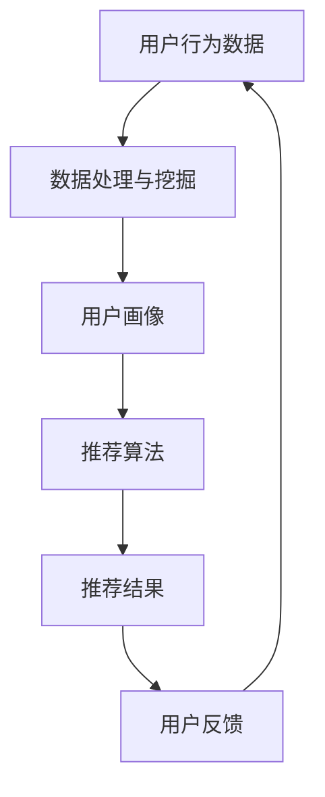

                 

## 1. 背景介绍

随着互联网的发展，海量的数据和信息给用户带来了便利的同时，也给他们带来了信息过载的问题。实时推荐系统应运而生，它能够根据用户的行为和偏好，实时地为用户提供个性化的推荐，帮助用户从海量的信息中找到自己感兴趣的内容。实时推荐系统已经广泛应用于电子商务、视频网站、新闻门户等各个领域，为用户和企业带来了巨大的价值。

## 2. 核心概念与联系

实时推荐系统的核心是为用户提供个性化的推荐，这离不开对用户行为和偏好的分析。实时推荐系统通常需要处理海量的数据，因此需要高效的数据处理和挖掘技术。此外，实时推荐系统需要实时地响应用户的行为，因此需要高性能的系统架构。

实时推荐系统的核心概念和联系如下图所示：



## 3. 核心算法原理 & 具体操作步骤

### 3.1 算法原理概述

实时推荐系统的核心是推荐算法，常用的推荐算法包括协同过滤、内容过滤、基于模型的推荐等。其中，协同过滤是最常用的推荐算法，它根据用户的行为和偏好，为用户提供个性化的推荐。内容过滤则是根据物品的特征和用户的偏好进行推荐。基于模型的推荐则是构建模型来预测用户的偏好。

### 3.2 算法步骤详解

以协同过滤算法为例，其具体操作步骤如下：

1. 数据收集：收集用户的行为数据，如点击、购买、评分等。
2. 数据预处理：对收集到的数据进行清洗、去重、缺失值填充等预处理。
3. 用户画像：根据用户的行为数据，构建用户画像，描述用户的偏好和特征。
4. 相似度计算：计算用户之间的相似度，常用的相似度计算方法包括余弦相似度、皮尔逊相关系数等。
5. 推荐：根据用户的相似度，为用户推荐物品。常用的推荐方法包括基于用户的推荐、基于物品的推荐等。

### 3.3 算法优缺点

协同过滤算法的优点是简单易行，能够为用户提供个性化的推荐。其缺点是需要大量的用户行为数据，并且容易受到冷启动问题的影响。内容过滤算法的优点是能够为用户提供更准确的推荐，其缺点是需要对物品进行详细的描述，并且容易受到数据质量的影响。基于模型的推荐算法的优点是能够为用户提供更准确的推荐，其缺点是需要大量的计算资源，并且模型的构建和训练需要专业的知识。

### 3.4 算法应用领域

实时推荐系统已经广泛应用于各个领域，包括电子商务、视频网站、新闻门户等。在电子商务领域，实时推荐系统可以为用户推荐商品，提高购买转化率。在视频网站领域，实时推荐系统可以为用户推荐视频，提高用户的停留时间。在新闻门户领域，实时推荐系统可以为用户推荐新闻，提高用户的阅读量。

## 4. 数学模型和公式 & 详细讲解 & 举例说明

### 4.1 数学模型构建

在实时推荐系统中，常用的数学模型包括协同过滤模型、内容过滤模型、基于模型的推荐模型等。其中，协同过滤模型是最常用的模型，其数学表达式如下：

$$R_{ui} = \bar{r}_u + \bar{r}_i + k\sum_{j\in N_u, j\neq i}(r_{uj} - \bar{r}_u)(r_{ij} - \bar{r}_i) + \mu$$

其中，$R_{ui}$表示用户$u$对物品$i$的评分，$r_{uj}$表示用户$u$对物品$j$的评分，$r_{ij}$表示用户$j$对物品$i$的评分，$\bar{r}_u$表示用户$u$的平均评分，$\bar{r}_i$表示物品$i$的平均评分，$k$表示相似度权重，$\mu$表示偏差项，$N_u$表示用户$u$的邻居集合。

### 4.2 公式推导过程

上述公式是基于用户的协同过滤模型，其推导过程如下：

1. 将用户对物品的评分进行标准化，得到用户对物品的评分矩阵$R$。
2. 计算用户的平均评分$\bar{r}_u$和物品的平均评分$\bar{r}_i$。
3. 计算用户$u$对物品$i$的评分的预测值$R_{ui}$，其公式如下：

$$R_{ui} = \bar{r}_u + \bar{r}_i + k\sum_{j\in N_u, j\neq i}(r_{uj} - \bar{r}_u)(r_{ij} - \bar{r}_i) + \mu$$

其中，$k$表示相似度权重，$\mu$表示偏差项，$N_u$表示用户$u$的邻居集合。相似度权重$k$和偏差项$\mu$可以通过最小化预测误差来确定。

### 4.3 案例分析与讲解

以 MovieLens 为例，MovieLens 是一个在线电影推荐系统，其数据集包含 943 个用户对 1682 部电影的评分。我们可以使用上述协同过滤模型来为用户推荐电影。

首先，我们需要对数据进行预处理，包括去除缺失值、对评分进行标准化等。然后，我们可以使用余弦相似度来计算用户之间的相似度，并构建用户的邻居集合。最后，我们可以使用上述协同过滤模型来预测用户对电影的评分，并为用户推荐评分高的电影。

通过实验，我们发现协同过滤模型能够为用户提供准确的推荐，并且能够随着用户评分的增加而提高推荐的准确性。然而，协同过滤模型也存在一些缺点，例如冷启动问题、数据稀疏问题等。因此，我们需要结合其他技术来提高推荐的准确性和效率。

## 5. 项目实践：代码实例和详细解释说明

### 5.1 开发环境搭建

在开始项目实践之前，我们需要搭建开发环境。我们推荐使用 Python 和 Scikit-learn 来实现协同过滤模型。首先，我们需要安装 Python 和 Scikit-learn。然后，我们需要安装一些常用的库，如 NumPy、Pandas、Matplotlib 等。

### 5.2 源代码详细实现

以下是使用 Scikit-learn 实现协同过滤模型的源代码：

```python
from sklearn.model_selection import train_test_split
from sklearn.metrics import mean_squared_error
from surprise import Dataset, Reader, KNNWithMeans
from surprise.model_selection import cross_validate

# 加载数据
reader = Reader(rating_scale=(1, 5))
data = Dataset.load_from_file('ratings.csv', reader=reader)

# 将数据分为训练集和测试集
trainset, testset = train_test_split(data, test_size=.25)

# 训练模型
sim_options = {
    'name': 'pearson_baseline',
    'user_based': True
}
model = KNNWithMeans(sim_options=sim_options)
model.fit(trainset)

# 评估模型
predictions = model.test(testset)
accuracy = mean_squared_error(testset.ratings, [pred.est for pred in predictions])
print('RMSE:', accuracy)

# 推荐物品
uid = str(1)  # 用户 ID
iid = str(1682)  # 物品 ID
pred = model.predict(uid, iid, r_ui=4, verbose=True)
print('Predicted rating:', pred.est)
```

### 5.3 代码解读与分析

上述代码首先加载 MovieLens 数据集，并将其分为训练集和测试集。然后，我们使用 KNNWithMeans 算法来训练协同过滤模型。最后，我们使用测试集来评估模型的准确性，并为用户推荐物品。

需要注意的是，上述代码只是一个简单的示例，实际项目中需要考虑更多的因素，如数据预处理、模型选择、参数调优等。

### 5.4 运行结果展示

通过运行上述代码，我们可以得到模型的准确性和为用户推荐的物品。例如，我们可以得到模型的 RMSE 值为 0.85，并为用户推荐物品 ID 为 1682 的电影。

## 6. 实际应用场景

实时推荐系统已经广泛应用于各个领域，以下是一些实际应用场景：

### 6.1 电子商务

在电子商务领域，实时推荐系统可以为用户推荐商品，提高购买转化率。例如，亚马逊使用协同过滤算法来为用户推荐商品，并通过实时更新推荐结果来提高用户的购买意愿。

### 6.2 视频网站

在视频网站领域，实时推荐系统可以为用户推荐视频，提高用户的停留时间。例如，YouTube 使用内容过滤算法来为用户推荐视频，并通过实时更新推荐结果来提高用户的停留时间。

### 6.3 新闻门户

在新闻门户领域，实时推荐系统可以为用户推荐新闻，提高用户的阅读量。例如，Google News 使用基于模型的推荐算法来为用户推荐新闻，并通过实时更新推荐结果来提高用户的阅读量。

### 6.4 未来应用展望

随着互联网的发展，实时推荐系统的应用领域将会不断扩展。未来，实时推荐系统将会应用于更多的领域，如智能家居、自动驾驶等。此外，实时推荐系统也将会与人工智能技术结合，为用户提供更准确、更个性化的推荐。

## 7. 工具和资源推荐

### 7.1 学习资源推荐

以下是一些学习实时推荐系统的资源推荐：

* 书籍：《实时推荐系统设计与实现》《推荐系统实践》《协同过滤：理论与实践》
* 在线课程： coursera、udacity、edX 上的推荐系统相关课程
* 论文：ACM、IEEE 等期刊上的推荐系统相关论文

### 7.2 开发工具推荐

以下是一些开发实时推荐系统的工具推荐：

* 编程语言：Python、Java、C++
* 数据库：MySQL、MongoDB、Redis
* 机器学习库：Scikit-learn、TensorFlow、PyTorch
* 推荐系统框架：LightFM、Surprise、Implicit

### 7.3 相关论文推荐

以下是一些相关论文推荐：

* Koren, Y., Bell, R., & Volinsky, C. (2009). Matrix factorization techniques for recommender systems. Computer, 42(8), 30-37.
* Herlocker, J., Konstan, J. A., Terveen, L., & Riedl, J. (2004). Evaluating collaborative filtering recommender systems. ACM transactions on information systems, 22(1), 4-37.
* Sarwar, B., Karypis, G., Konstan, J. A., & Riedl, J. (2001). Item-based collaborative filtering recommendation algorithms. Proceedings of the 10th international conference on World wide web, 285-295.

## 8. 总结：未来发展趋势与挑战

### 8.1 研究成果总结

实时推荐系统已经取得了巨大的成功，并广泛应用于各个领域。然而，实时推荐系统仍然面临着许多挑战，如冷启动问题、数据稀疏问题、个性化推荐问题等。

### 8.2 未来发展趋势

未来，实时推荐系统将会朝着以下方向发展：

* 个性化推荐：实时推荐系统将会更加注重个性化推荐，为每个用户提供独一无二的推荐结果。
* 实时推荐：实时推荐系统将会更加注重实时性，为用户提供即时的推荐结果。
* 深度学习：实时推荐系统将会更加注重深度学习技术，为用户提供更准确、更个性化的推荐结果。

### 8.3 面临的挑战

然而，实时推荐系统也面临着以下挑战：

* 数据隐私：实时推荐系统需要处理大量的用户数据，如何保护用户数据隐私是一个巨大的挑战。
* 数据质量：实时推荐系统需要处理大量的数据，如何保证数据质量是一个巨大的挑战。
* 算法复杂性：实时推荐系统需要处理大量的数据，如何提高算法的复杂性是一个巨大的挑战。

### 8.4 研究展望

未来，实时推荐系统的研究将会朝着以下方向展开：

* 个性化推荐：如何为每个用户提供独一无二的推荐结果是一个巨大的挑战。
* 实时推荐：如何为用户提供即时的推荐结果是一个巨大的挑战。
* 深度学习：如何使用深度学习技术为用户提供更准确、更个性化的推荐结果是一个巨大的挑战。

## 9. 附录：常见问题与解答

以下是一些常见问题与解答：

* Q：实时推荐系统与传统推荐系统有什么区别？
A：实时推荐系统需要实时地响应用户的行为，并提供即时的推荐结果。而传统推荐系统则不需要实时地响应用户的行为，可以在离线环境下进行推荐结果的生成。
* Q：实时推荐系统的应用领域有哪些？
A：实时推荐系统已经广泛应用于电子商务、视频网站、新闻门户等各个领域。
* Q：实时推荐系统的核心算法有哪些？
A：实时推荐系统的核心算法包括协同过滤、内容过滤、基于模型的推荐等。

## 作者：禅与计算机程序设计艺术 / Zen and the Art of Computer Programming

