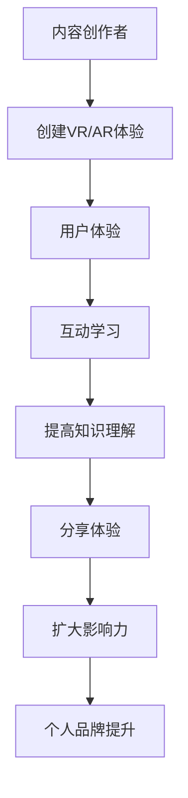

                 

**VR/AR**, **个人品牌**, **创新**, **知识传播**, **体验设计**, **技术趋势**, **未来应用**

## 1. 背景介绍

随着技术的发展，虚拟现实（VR）和增强现实（AR）已经从科幻电影走进了我们的日常生活。这两种技术正在改变我们与信息交互的方式，为知识传播带来了全新的可能。本文将探讨如何利用VR/AR技术创新个人品牌的知识传播方式，提供更丰富、更互动的体验。

## 2. 核心概念与联系

### 2.1 VR/AR的定义

- **虚拟现实（VR）**：一种计算机模拟的三维环境，用户可以通过头戴式显示器（HMD）和手柄等设备与之互动。
- **增强现实（AR）**：一种技术，它将数字信息和三维模型叠加到用户视野中，通常通过智能手机或AR眼镜等设备呈现。

### 2.2 VR/AR在知识传播中的作用


**Mermaid流程图：**



## 3. 核心算法原理 & 具体操作步骤

### 3.1 算法原理概述

VR/AR技术的核心是渲染引擎，它负责将三维模型和场景渲染成二维图像，并实时响应用户的输入。常用的渲染引擎包括Unity和Unreal Engine。

### 3.2 算法步骤详解

1. **场景设计**：使用3D建模软件（如Blender）创建三维场景和模型。
2. **编程**：使用C#（Unity）或C++（Unreal Engine）编写脚本，实现交互逻辑和动画控制。
3. **渲染**：渲染引擎将场景渲染成图像，并实时响应用户输入。
4. **跟踪**：使用位置追踪和头部追踪技术，跟踪用户在虚拟环境中的位置和方向。
5. **渲染和显示**：渲染好的图像通过HMD或AR设备显示给用户。

### 3.3 算法优缺点

**优点**：提供了更丰富、更互动的学习体验，有助于提高知识的理解和记忆。

**缺点**：开发成本高，技术门槛高，需要专业的3D建模和编程技能。

### 3.4 算法应用领域

VR/AR技术在教育、医疗、设计、娱乐等领域都有广泛的应用，个人品牌可以利用这些技术创建独特的知识传播体验。

## 4. 数学模型和公式 & 详细讲解 & 举例说明

### 4.1 数学模型构建

VR/AR技术涉及到三维几何学、光线追踪等数学模型。其中，三维几何学是构建虚拟环境的基础。

### 4.2 公式推导过程

三维几何学中的点**P**可以表示为：

$$P = (x, y, z)$$

其中，x、y、z分别表示点在三维空间中的坐标。两点**P1**和**P2**之间的距离**d**可以通过欧几里得距离公式计算：

$$d = \sqrt{(x_2 - x_1)^2 + (y_2 - y_1)^2 + (z_2 - z_1)^2}$$

### 4.3 案例分析与讲解

例如，在创建VR/AR体验时，需要计算用户与虚拟物体之间的距离，以实现交互逻辑。此时，可以使用上述公式计算两点之间的距离。

## 5. 项目实践：代码实例和详细解释说明

### 5.1 开发环境搭建

- **Unity**：下载并安装Unity Hub，创建新项目。
- **Unreal Engine**：下载并安装Epic Games Launcher，创建新项目。

### 5.2 源代码详细实现

以下是一个简单的VR项目示例，使用C#在Unity中实现了一个简单的VR交互逻辑：

```csharp
using UnityEngine;
using UnityEngine.XR.Interaction.Toolkit;

public class VRInteractor : XRBaseInteractor
{
    protected override void OnSelectEnter(SelectEnterEventArgs args)
    {
        base.OnSelectEnter(args);
        Debug.Log("Selected: " + args.interactableObject.gameObject.name);
    }
}
```

### 5.3 代码解读与分析

该脚本继承自`XRBaseInteractor`类，重写了`OnSelectEnter`方法，当用户选择虚拟物体时，打印物体名称。

### 5.4 运行结果展示

在VR设备上运行项目，用户可以通过手柄选择虚拟物体，并查看控制台输出的物体名称。

## 6. 实际应用场景

### 6.1 个人品牌展示

个人品牌可以创建VR/AR体验，展示自己的作品集、设计理念或产品。例如，建筑师可以创建VR体验，让客户在虚拟环境中参观设计方案。

### 6.2 互动学习

个人品牌可以创建互动学习体验，帮助用户更好地理解复杂的概念。例如，科学家可以创建AR体验，展示分子结构或化学反应过程。

### 6.3 未来应用展望

随着技术的发展，VR/AR技术将变得更加便宜、更加方便使用。个人品牌可以利用这些技术创建更丰富、更互动的体验，提高知识传播的效果。

## 7. 工具和资源推荐

### 7.1 学习资源推荐

- **Unity官方文档**：<https://docs.unity3d.com/Manual/index.html>
- **Unreal Engine官方文档**：<https://docs.unrealengine.com/en-US/>
- **VR/AR开发者论坛**：<https://forum.unity.com/forums/virtual-reality.118/>

### 7.2 开发工具推荐

- **3D建模软件**：Blender（免费）、Autodesk Maya、Autodesk 3DS Max
- **VR/AR设备**：Oculus Quest、HTC Vive、Microsoft HoloLens

### 7.3 相关论文推荐

- [Immersive Virtual Reality for Education: A Systematic Review](https://ieeexplore.ieee.org/document/8946647)
- [Augmented Reality in Education: A Systematic Review](https://link.springer.com/chapter/10.1007/978-981-13-7570-8_12)

## 8. 总结：未来发展趋势与挑战

### 8.1 研究成果总结

本文介绍了如何利用VR/AR技术创新个人品牌的知识传播方式，提供了核心概念、算法原理、数学模型、项目实践和工具推荐。

### 8.2 未来发展趋势

VR/AR技术将变得更加便宜、更加方便使用，个人品牌可以创建更丰富、更互动的体验。

### 8.3 面临的挑战

开发成本高，技术门槛高，需要专业的3D建模和编程技能。

### 8.4 研究展望

未来的研究可以关注如何降低VR/AR开发的门槛，如何创建更丰富、更互动的体验，如何提高知识传播的效果。

## 9. 附录：常见问题与解答

**Q：VR/AR技术的成本高吗？**

**A**：是的，VR/AR技术的开发成本高，需要专业的3D建模和编程技能。但是，随着技术的发展，成本将变得更低。

**Q：VR/AR技术的未来发展趋势是什么？**

**A**：VR/AR技术将变得更加便宜、更加方便使用，个人品牌可以创建更丰富、更互动的体验。

**Q：如何学习VR/AR技术？**

**A**：可以通过在线资源、官方文档和开发者论坛学习VR/AR技术。也可以参加相关的培训课程或工作坊。

**作者：禅与计算机程序设计艺术 / Zen and the Art of Computer Programming**

